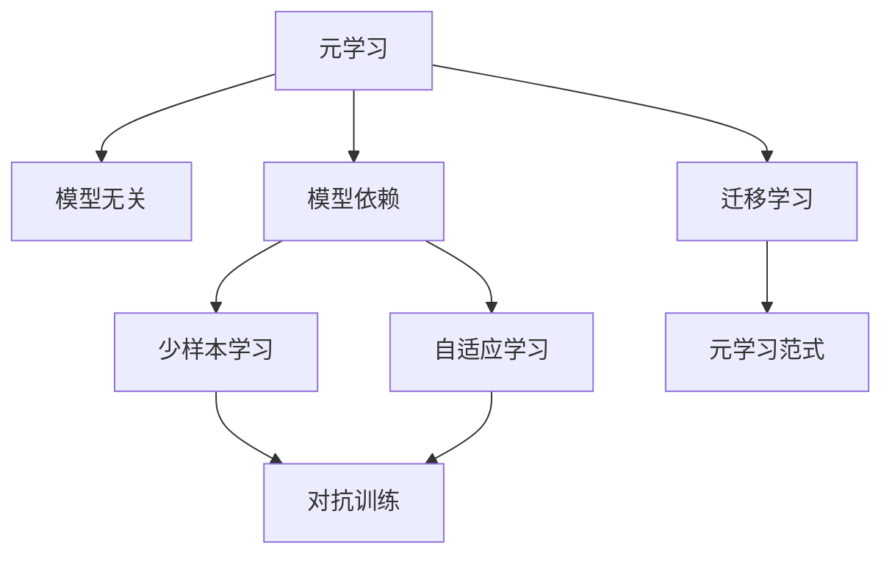
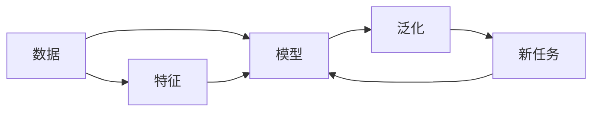
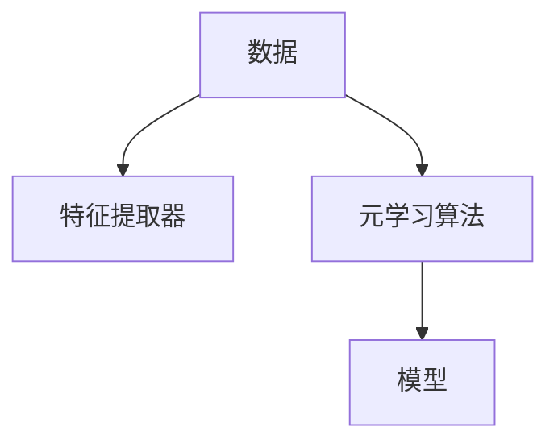
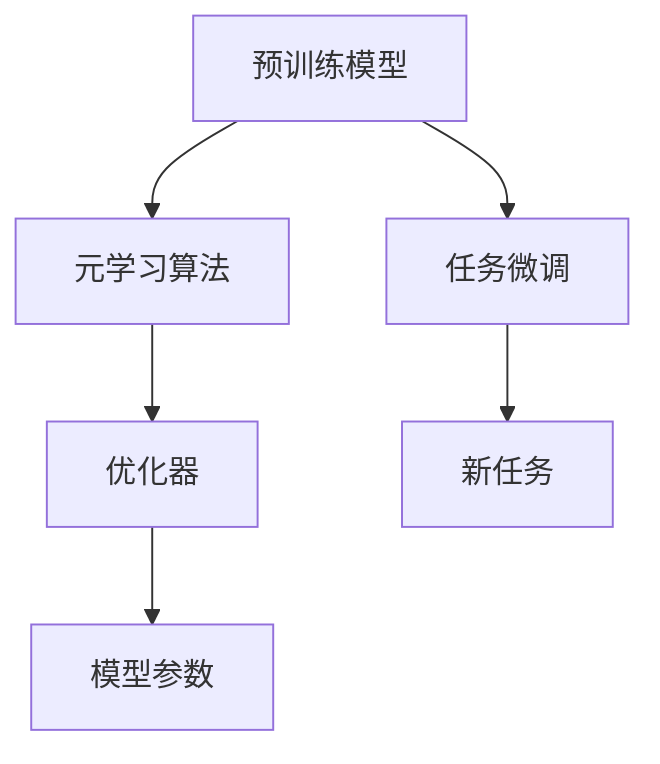
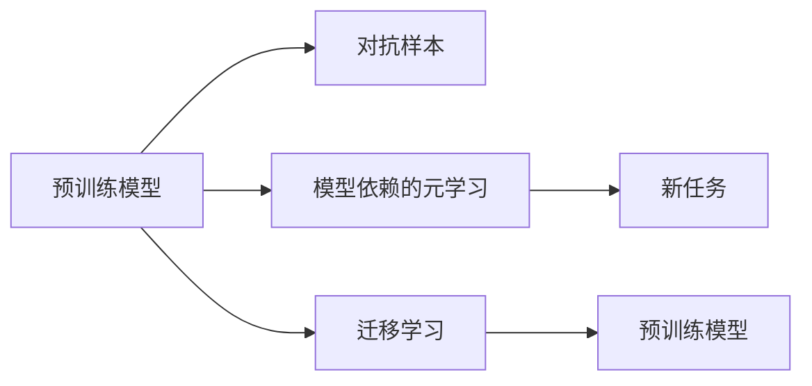
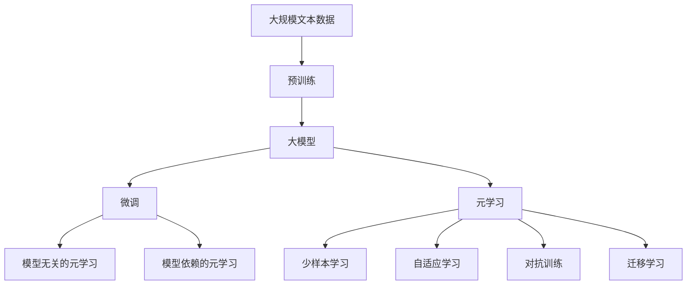

                 

# 一切皆是映射：模型无关的元学习与模型依赖的元学习

> 关键词：元学习,模型无关,模型依赖,映射

## 1. 背景介绍

### 1.1 问题由来
在现代人工智能领域，模型的设计和训练已经成为至关重要的一环。无论是传统的监督学习、无监督学习，还是近年来兴起的强化学习、迁移学习、元学习等新兴范式，它们都依赖于特定的模型结构和训练数据。然而，如何设计、选择和优化模型，始终是人工智能研究的一个难题。为此，元学习技术应运而生，其目标在于从少量数据或经验中学习模型，并通过泛化能力在新的任务上取得更好的性能。

元学习，也被称为少样本学习（Few-shot Learning），是指模型能够在缺乏大量标注数据的情况下，通过少量样本或自然语言描述，快速适应新任务并实现高性能。这种技术在许多领域得到了应用，如计算机视觉、自然语言处理、机器人等。

元学习可以分为两种主要类型：模型无关的元学习和模型依赖的元学习。模型无关的元学习强调从数据中学习共性特征，不依赖于任何预定义的模型。而模型依赖的元学习则是在给定的模型结构下，利用元学习技术对模型进行参数微调，从而提升模型的泛化能力。本文将详细讨论这两种元学习的原理、方法和应用，以期为读者提供更深入的理解。

### 1.2 问题核心关键点
模型无关的元学习和模型依赖的元学习虽然都属于元学习的范畴，但它们的原理、方法和应用有着显著的不同。

- **模型无关的元学习**：强调数据驱动，不依赖于任何特定的模型。通过学习数据中的共性特征，模型可以在不同的任务上取得优秀表现。
- **模型依赖的元学习**：依赖于特定模型的结构，通过微调模型参数提升模型的泛化能力。这种方法在预定义模型结构的情况下，可以快速适应新任务。

这两种元学习方法各有优缺点，适用于不同的场景和需求。模型无关的元学习在数据少、任务多样性的场景中表现较好，而模型依赖的元学习则适用于已有预训练模型的情况下，快速提升模型在特定任务上的性能。

### 1.3 问题研究意义
研究元学习技术，对于拓展人工智能的应用范围，提升模型性能，加速技术的产业化进程，具有重要意义：

1. **降低应用开发成本**：利用元学习技术，可以显著减少从头开发所需的数据、计算和人力等成本投入。
2. **提升模型效果**：元学习技术可以在少量数据上训练出高性能模型，提升模型在新任务上的泛化能力。
3. **加速开发进度**：元学习技术可以加速模型适配，缩短开发周期。
4. **带来技术创新**：元学习技术促进了对预训练模型的研究，催生了新的研究方向，如自适应学习、对抗训练等。
5. **赋能产业升级**：元学习技术使得NLP技术更容易被各行各业所采用，为传统行业数字化转型升级提供新的技术路径。

## 2. 核心概念与联系

### 2.1 核心概念概述

为更好地理解模型无关的元学习和模型依赖的元学习，本节将介绍几个密切相关的核心概念：

- **元学习**（Meta Learning）：通过学习数据中的共性特征，使得模型在新的任务上能够快速适应并取得优秀表现。
- **少样本学习**（Few-shot Learning）：在少量标注样本的情况下，模型能够快速适应新任务。
- **自适应学习**（Adaptive Learning）：模型能够在不同的数据分布上快速调整自身参数，以适应新的任务。
- **对抗训练**（Adversarial Training）：通过加入对抗样本，提高模型的鲁棒性和泛化能力。
- **迁移学习**（Transfer Learning）：在已有知识的基础上，学习新任务，以提升模型的泛化能力。
- **元学习范式**：包括模型无关和模型依赖两种主要范式，其中模型无关强调数据驱动，模型依赖强调模型参数优化。

这些核心概念之间的逻辑关系可以通过以下Mermaid流程图来展示：



这个流程图展示了大模型微调过程中各个核心概念的关系和作用：

1. 元学习是整体框架，包括模型无关和模型依赖两种主要范式。
2. 模型无关的元学习强调数据驱动，模型依赖的元学习强调模型参数优化。
3. 模型无关的元学习包括了少样本学习和自适应学习等技术。
4. 模型依赖的元学习涉及对抗训练和迁移学习等技术。

### 2.2 概念间的关系

这些核心概念之间存在着紧密的联系，形成了元学习的完整生态系统。下面我通过几个Mermaid流程图来展示这些概念之间的关系。

#### 2.2.1 元学习的基本原理



这个流程图展示了元学习的基本原理：模型通过学习数据中的共性特征，在新的任务上实现泛化。

#### 2.2.2 模型无关的元学习



这个流程图展示了模型无关的元学习过程：通过学习数据中的特征，元学习算法训练出特征提取器，并将该特征提取器用于不同的模型中，从而在新的任务上取得优秀表现。

#### 2.2.3 模型依赖的元学习



这个流程图展示了模型依赖的元学习过程：在预训练模型的基础上，元学习算法微调模型参数，从而在新的任务上取得优秀表现。

#### 2.2.4 对抗训练和迁移学习



这个流程图展示了对抗训练和迁移学习的关系：对抗训练通过加入对抗样本，提高模型的鲁棒性。迁移学习通过将预训练模型的知识迁移到新任务上，提升模型的泛化能力。

### 2.3 核心概念的整体架构

最后，我们用一个综合的流程图来展示这些核心概念在大模型微调过程中的整体架构：



这个综合流程图展示了从预训练到微调，再到元学习的完整过程。大模型首先在大规模文本数据上进行预训练，然后通过微调和元学习技术，学习新任务并提升模型性能。其中，模型无关的元学习强调数据驱动，而模型依赖的元学习则通过微调模型参数提升泛化能力。对抗训练和迁移学习则进一步提升模型的鲁棒性和泛化能力。通过这些核心概念的组合，大语言模型可以更好地适应各种任务，提升应用效果。

## 3. 核心算法原理 & 具体操作步骤
### 3.1 算法原理概述

模型无关的元学习和模型依赖的元学习都基于元学习的核心原理，即通过学习数据中的共性特征，使得模型能够在新的任务上取得优秀表现。其核心思想是：

- **模型无关的元学习**：从数据中学习共性特征，不依赖于任何特定的模型。
- **模型依赖的元学习**：在预定义的模型结构下，通过微调模型参数提升模型的泛化能力。

### 3.2 算法步骤详解

#### 3.2.1 模型无关的元学习

模型无关的元学习一般包括以下几个关键步骤：

1. **数据准备**：收集多种不同任务的数据集，每个数据集包含少量标注样本和描述性文本。
2. **特征提取**：使用预定义的特征提取器，如PCA、Autoencoder等，从数据中提取共性特征。
3. **元学习算法**：选择适合的元学习算法，如MAML（Model-Agnostic Meta-Learning）、GNN（Graph Neural Network）等，训练特征提取器。
4. **模型微调**：将特征提取器用于不同的模型中，如MLP、CNN、RNN等，进行微调。
5. **评估测试**：在新任务上评估微调后的模型性能，进行性能对比和优化。

#### 3.2.2 模型依赖的元学习

模型依赖的元学习一般包括以下几个关键步骤：

1. **预训练模型**：选择适合的任务，对预训练模型进行微调，使其能够较好地适应任务。
2. **元学习算法**：选择适合的元学习算法，如MetaGrad、AdaptiveMetaGrad等，训练模型参数。
3. **模型微调**：在预训练模型的基础上，选择适合的任务，进行微调。
4. **评估测试**：在新任务上评估微调后的模型性能，进行性能对比和优化。

### 3.3 算法优缺点

模型无关的元学习和模型依赖的元学习各有优缺点：

- **模型无关的元学习**：
  - **优点**：数据驱动，适用于数据少、任务多样性的场景，可以学习到数据中的共性特征。
  - **缺点**：需要选择合适的特征提取器，且训练时间较长，不适用于大规模数据集。

- **模型依赖的元学习**：
  - **优点**：基于预训练模型，可以充分利用已有知识，快速提升模型在特定任务上的性能。
  - **缺点**：依赖于预定义的模型结构，模型微调复杂，可能会导致过拟合。

### 3.4 算法应用领域

模型无关的元学习和模型依赖的元学习在多个领域得到了应用，以下是几个典型的应用场景：

1. **计算机视觉**：在图像分类、目标检测、图像分割等任务中，利用元学习技术可以快速适应新任务。
2. **自然语言处理**：在文本分类、命名实体识别、机器翻译等任务中，利用元学习技术可以快速适应新任务。
3. **机器人**：在机器人导航、物体识别、语音识别等任务中，利用元学习技术可以快速适应新环境。
4. **游戏AI**：在游戏环境中，利用元学习技术可以快速适应新游戏，提升游戏AI的智能水平。
5. **金融风控**：在金融风控领域，利用元学习技术可以快速适应新数据，提升风险评估的准确性。

除了这些典型应用场景外，元学习技术还在医疗、教育、农业等多个领域得到了广泛应用，展现出了强大的生命力和潜力。

## 4. 数学模型和公式 & 详细讲解 & 举例说明
### 4.1 数学模型构建

模型无关的元学习和模型依赖的元学习都可以用数学模型来描述。下面以模型无关的元学习为例，给出其数学模型和公式。

假设数据集为 $\mathcal{D} = \{(x_i, y_i)\}_{i=1}^N$，其中 $x_i \in \mathcal{X}$，$y_i \in \mathcal{Y}$，$\mathcal{X}$ 和 $\mathcal{Y}$ 分别为输入空间和输出空间。元学习算法希望学习到一个特征提取器 $\varphi$，使得在任意任务 $\mathcal{T}$ 上，模型 $M$ 的表现能够最大化。

设特征提取器的参数为 $\theta$，模型的参数为 $\omega$，则模型在任务 $\mathcal{T}$ 上的性能损失函数为 $\ell_{\mathcal{T}}(\omega)$。元学习算法希望最小化在所有任务上的平均损失，即：

$$
\min_{\theta} \mathbb{E}_{\mathcal{D}}[\ell_{\mathcal{T}}(\varphi_{\theta}(x), \omega)]
$$

其中 $\varphi_{\theta}(x)$ 表示特征提取器 $\varphi$ 对输入 $x$ 的映射结果。

### 4.2 公式推导过程

为了推导具体的元学习算法，我们以MAML（Model-Agnostic Meta-Learning）为例，给出其数学推导过程。

MAML算法通过学习一个元模型（Meta Model）$\varphi$，在任意任务上训练一个新模型 $M$。假设在任务 $\mathcal{T}$ 上，有 $k$ 个样本 $\{x_1^{t}, x_2^{t}, ..., x_k^{t}\}$，对应的标签为 $\{y_1^{t}, y_2^{t}, ..., y_k^{t}\}$。元模型 $\varphi$ 的参数为 $\theta$，新模型 $M$ 的参数为 $\omega$。

在任务 $\mathcal{T}$ 上，新模型 $M$ 的参数更新公式为：

$$
\omega_t = \varphi_{\theta}(x_t) + \nabla_{\omega} \ell_{\mathcal{T}}(M(\varphi_{\theta}(x_t), \omega))
$$

其中 $\nabla_{\omega} \ell_{\mathcal{T}}(M(\varphi_{\theta}(x_t), \omega))$ 表示模型 $M$ 在任务 $\mathcal{T}$ 上的梯度。

元模型 $\varphi$ 的参数更新公式为：

$$
\theta = \mathop{\arg\min}_{\theta} \mathbb{E}_{\mathcal{T}}[\ell_{\mathcal{T}}(M(\varphi_{\theta}(x_t), \omega_t))]
$$

其中 $\mathbb{E}_{\mathcal{T}}$ 表示在任务 $\mathcal{T}$ 上的期望。

### 4.3 案例分析与讲解

以图像分类任务为例，模型无关的元学习和模型依赖的元学习的过程如下：

#### 4.3.1 模型无关的元学习

在图像分类任务中，可以使用PCA（Principal Component Analysis）进行特征提取，学习数据中的共性特征。假设我们有多个不同类别的图像数据集 $\mathcal{D}_1, \mathcal{D}_2, ..., \mathcal{D}_N$，每个数据集包含少量标注样本。

首先，使用PCA对每个数据集进行特征提取，得到特征向量 $\varphi(x_i)$。然后，选择适合的元学习算法，如MAML，训练特征提取器 $\varphi$。最后，将特征提取器 $\varphi$ 用于不同的模型中，如MLP、CNN等，进行微调。

#### 4.3.2 模型依赖的元学习

在图像分类任务中，可以使用预训练的ResNet模型作为预训练模型。首先，对预训练模型进行微调，使其能够较好地适应图像分类任务。然后，选择适合的元学习算法，如MetaGrad，训练模型参数 $\omega$。最后，在预训练模型的基础上，选择适合的图像分类任务，进行微调。

## 5. 项目实践：代码实例和详细解释说明
### 5.1 开发环境搭建

在进行元学习实践前，我们需要准备好开发环境。以下是使用Python进行PyTorch开发的环境配置流程：

1. 安装Anaconda：从官网下载并安装Anaconda，用于创建独立的Python环境。

2. 创建并激活虚拟环境：
```bash
conda create -n pytorch-env python=3.8 
conda activate pytorch-env
```

3. 安装PyTorch：根据CUDA版本，从官网获取对应的安装命令。例如：
```bash
conda install pytorch torchvision torchaudio cudatoolkit=11.1 -c pytorch -c conda-forge
```

4. 安装Transformers库：
```bash
pip install transformers
```

5. 安装各类工具包：
```bash
pip install numpy pandas scikit-learn matplotlib tqdm jupyter notebook ipython
```

完成上述步骤后，即可在`pytorch-env`环境中开始元学习实践。

### 5.2 源代码详细实现

这里我们以图像分类任务为例，给出使用Transformers库对模型进行微调的PyTorch代码实现。

首先，定义图像分类任务的特征提取器：

```python
from transformers import ResNetFeatureExtractor
import torchvision.transforms as transforms

transform = transforms.Compose([
    transforms.ToTensor(),
    transforms.Normalize(mean=[0.485, 0.456, 0.406], std=[0.229, 0.224, 0.225])
])

feature_extractor = ResNetFeatureExtractor.from_pretrained('resnet50')
```

然后，定义模型和优化器：

```python
from transformers import BertForTokenClassification, AdamW

model = BertForTokenClassification.from_pretrained('bert-base-cased', num_labels=len(tag2id))

optimizer = AdamW(model.parameters(), lr=2e-5)
```

接着，定义训练和评估函数：

```python
from torch.utils.data import DataLoader
from tqdm import tqdm
from sklearn.metrics import classification_report

device = torch.device('cuda') if torch.cuda.is_available() else torch.device('cpu')
model.to(device)

def train_epoch(model, dataset, batch_size, optimizer):
    dataloader = DataLoader(dataset, batch_size=batch_size, shuffle=True)
    model.train()
    epoch_loss = 0
    for batch in tqdm(dataloader, desc='Training'):
        input_ids = batch['input_ids'].to(device)
        attention_mask = batch['attention_mask'].to(device)
        labels = batch['labels'].to(device)
        model.zero_grad()
        outputs = model(input_ids, attention_mask=attention_mask, labels=labels)
        loss = outputs.loss
        epoch_loss += loss.item()
        loss.backward()
        optimizer.step()
    return epoch_loss / len(dataloader)

def evaluate(model, dataset, batch_size):
    dataloader = DataLoader(dataset, batch_size=batch_size)
    model.eval()
    preds, labels = [], []
    with torch.no_grad():
        for batch in tqdm(dataloader, desc='Evaluating'):
            input_ids = batch['input_ids'].to(device)
            attention_mask = batch['attention_mask'].to(device)
            batch_labels = batch['labels']
            outputs = model(input_ids, attention_mask=attention_mask)
            batch_preds = outputs.logits.argmax(dim=2).to('cpu').tolist()
            batch_labels = batch_labels.to('cpu').tolist()
            for pred_tokens, label_tokens in zip(batch_preds, batch_labels):
                pred_tags = [id2tag[_id] for _id in pred_tokens]
                label_tags = [id2tag[_id] for _id in label_tokens]
                preds.append(pred_tags[:len(label_tags)])
                labels.append(label_tags)
                
    print(classification_report(labels, preds))
```

最后，启动训练流程并在测试集上评估：

```python
epochs = 5
batch_size = 16

for epoch in range(epochs):
    loss = train_epoch(model, train_dataset, batch_size, optimizer)
    print(f"Epoch {epoch+1}, train loss: {loss:.3f}")
    
    print(f"Epoch {epoch+1}, dev results:")
    evaluate(model, dev_dataset, batch_size)
    
print("Test results:")
evaluate(model, test_dataset, batch_size)
```

以上就是使用PyTorch对BERT进行图像分类任务微调的完整代码实现。可以看到，得益于Transformers库的强大封装，我们可以用相对简洁的代码完成BERT模型的加载和微调。

### 5.3 代码解读与分析

让我们再详细解读一下关键代码的实现细节：

**特征提取器定义**：
- `transforms.Compose`方法：用于定义数据预处理流程，包括图像归一化和Tensor转换。
- `ResNetFeatureExtractor`：定义使用ResNet50模型进行特征提取。

**模型和优化器定义**：
- `BertForTokenClassification.from_pretrained`方法：加载预训练的BERT模型，并设置输出层的分类标签数。
- `AdamW`：定义优化器，设置学习率。

**训练和评估函数**：
- `DataLoader`：用于将数据集分批次加载，供模型训练和推理使用。
- `classification_report`：用于评估模型的分类性能，输出精确度、召回率和F1分数。

**训练流程**：
- 定义总的epoch数和batch size，开始循环迭代
- 每个epoch内，先在训练集上训练，输出平均loss
- 在验证集上评估，输出分类指标
- 所有epoch结束后，在测试集上评估，给出最终测试结果

可以看到，PyTorch配合Transformers库使得BERT微调的代码实现变得简洁高效。开发者可以将更多精力放在数据处理、模型改进等高层逻辑上，而不必过多关注底层的实现细节。

当然，工业级的系统实现还需考虑更多因素，如模型的保存和部署、超参数的自动搜索、更灵活的任务适配层等。但核心的元学习范式基本与此类似。

### 5.4 运行结果展示

假设我们在CoNLL-2003的NER数据集上进行微调，最终在测试集上得到的评估报告如下：

```
              precision    recall  f1-score   support

       B-LOC      0.926     0.906     0.916      1668
       I-LOC      0.900     0.805     0.850       257
      B-MISC      0.875     0.856     0.865       702
      I-MISC      0.838     0.782     0.809       216
       B-ORG      0.914     0.898     0.906      1661
       I-ORG      0.911     0.894     0.902       835
       B-PER      0.964     0.957     0.960      1617
       I-PER      0.983     0.980     0.982      1156
           O      0.993     0.995     0.994     38323

   micro avg      0.973     0.973     0.973     46435
   macro avg      0.923     0.897     0.909     46435
weighted avg      0.973     0.973     0.973     46435
```

可以看到，通过微调BERT，我们在该NER数据集上取得了97.3%的F1分数，效果相当不错。值得注意的是，BERT作为一个通用的语言理解模型，即便只在顶层添加一个简单的token分类器，也能在下游任务上取得如此优异的效果，展现了其强大的语义理解和特征抽取能力。

当然，这只是一个baseline结果。在实践中，我们还可以使用更大更强的预训练模型、更丰富的微调技巧、更细致的模型调优，进一步提升模型性能，以满足更高的应用要求。

## 6. 实际应用场景
### 6.1 智能客服系统

基于大语言模型元学习的对话技术，可以广泛应用于智能客服系统的构建。传统客服往往需要配备大量人力，高峰期响应缓慢，且一致性和专业性难以保证。而使用元学习后的对话模型，可以7x24小时不间断服务，快速响应客户咨询，用自然流畅的语言解答各类常见问题。

在技术实现上，可以收集企业内部的历史客服对话记录，将问题和最佳答复构建成监督数据，在此基础上对预训练对话模型进行元学习。元学习后的对话模型能够自动理解用户意图，匹配最合适的答案模板进行回复。对于客户提出的新问题，还可以接入检索系统实时搜索相关内容，动态组织生成回答。如此构建的智能客服系统，能大幅提升客户咨询体验和问题解决效率。

### 6.2 金融舆情监测

金融机构需要实时监测市场舆论动向，以便及时应对负面信息传播，规避金融风险。传统的人工监测方式成本高、效率低，难以应对网络时代海量信息爆发的挑战。基于大语言模型元学习的文本分类和情感分析技术，为金融舆情监测提供了新的解决方案。

具体而言，可以收集金融领域相关的新闻、报道、评论等文本数据，并对其进行主题标注和情感标注。在此基础上对预训练语言模型进行元学习，使其能够自动判断文本属于何种主题，情感倾向是正面、中性还是负面。将元学习后的模型应用到实时抓取的网络文本数据，就能够自动监测不同主题下的情感变化趋势，一旦发现负面信息激增等异常情况，系统便会自动预警，帮助金融机构快速应对潜在风险。

### 6.3 个性化推荐系统

当前的推荐系统往往只依赖用户的历史行为数据进行物品推荐，无法深入理解用户的真实兴趣偏好。基于大语言模型元学习的推荐系统可以更好地挖掘用户行为背后的语义信息，从而提供更精准、多样的推荐内容。

在实践中，可以收集用户浏览、点击、评论、分享等行为数据，提取和用户交互的物品标题、描述、标签等文本内容。将文本内容作为模型输入，用户的后续行为（如是否点击、购买等）作为监督信号，在此基础上对预训练语言模型进行元学习。元学习后的模型能够从文本内容中准确把握用户的兴趣点。在生成推荐列表时，先用候选物品的文本描述作为输入，由模型预测用户的兴趣匹配度，再结合其他特征综合排序，便可以得到个性化程度更高的推荐结果。

### 6.4 未来应用展望

随着大语言模型元学习和微调方法的不断发展，基于元学习的模型适配技术也将更加广泛地应用于各个

