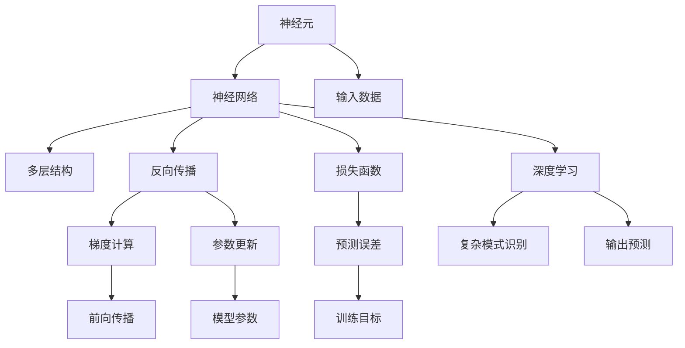
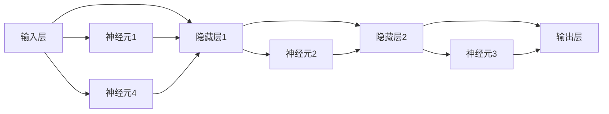
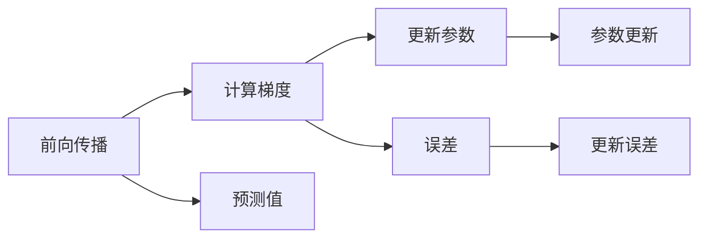
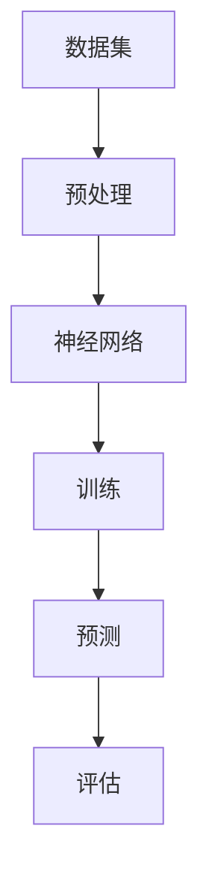

                 

# 一切皆是映射：神经网络的结构和工作原理

> 关键词：神经网络, 映射, 线性代数, 深度学习, 反向传播, 损失函数

## 1. 背景介绍

### 1.1 问题由来

随着人工智能技术的飞速发展，神经网络已成为解决复杂模式识别与预测问题的重要工具。它由大量人工神经元（神经元）通过互联形成的一个复杂网络，通过学习输入数据特征，不断调整自身参数以最小化预测误差，从而完成各种复杂的预测任务。

神经网络最早由沃伦·麦卡洛克和弗兰克·罗森布拉特于20世纪40年代提出。最初，它仅用于解决一些简单的模式识别问题，如图像分类、语音识别等。然而，随着算法和计算能力的进步，神经网络逐渐具备了处理大规模数据和复杂任务的能力，广泛应用于自然语言处理、计算机视觉、推荐系统等领域，成为人工智能技术的重要支撑。

本文将深入介绍神经网络的底层结构和工作原理，从线性代数视角解析神经网络背后的数学本质，帮助读者更全面地理解这一前沿技术。

### 1.2 问题核心关键点

神经网络的核心在于其映射能力，即将输入数据通过一系列的变换映射到输出空间，以实现分类、回归、生成等任务。为了提高映射的准确性和泛化能力，神经网络采用了层次化结构、梯度优化等技术手段。本文将详细探讨这些技术细节，并通过实例分析，帮助读者理解神经网络的工作原理。

## 2. 核心概念与联系

### 2.1 核心概念概述

为更好地理解神经网络的结构和工作原理，本节将介绍几个密切相关的核心概念：

- 神经元（Neuron）：神经网络的基本组成单元，用于接收输入数据并计算输出。每个神经元都有若干权重和偏置，通过线性组合和激活函数产生输出。
- 神经网络（Neural Network）：由多层神经元组成的复杂网络，用于实现复杂映射。
- 反向传播（Backpropagation）：一种优化算法，通过计算梯度来更新网络参数，以最小化预测误差。
- 损失函数（Loss Function）：用于衡量模型预测与真实标签之间差异的函数，如均方误差、交叉熵等。
- 深度学习（Deep Learning）：利用多层神经网络进行复杂模式识别和预测的技术。
- 激活函数（Activation Function）：神经元中用于引入非线性性的函数，如Sigmoid、ReLU、Tanh等。

这些核心概念之间存在紧密联系，共同构成了神经网络的完整框架。接下来，我们将通过Mermaid流程图展示这些概念之间的关系。



这个流程图展示了神经网络的核心概念及其之间的关系：

1. 神经元是神经网络的基本单位，通过接收输入数据并计算输出。
2. 神经网络通过多层结构实现复杂映射。
3. 反向传播通过梯度计算来更新模型参数。
4. 损失函数用于衡量预测误差。
5. 深度学习利用多层神经网络进行复杂模式识别。
6. 激活函数引入非线性性，使神经网络能够处理非线性问题。

这些概念共同构成了神经网络的完整框架，使其能够处理各种复杂的模式识别和预测问题。

### 2.2 概念间的关系

这些核心概念之间存在紧密的联系，形成了神经网络的工作原理。下面我们将通过几个Mermaid流程图来展示这些概念之间的关系。

#### 2.2.1 神经网络的结构



这个流程图展示了神经网络的基本结构，包含输入层、隐藏层和输出层。每个层由多个神经元组成，神经元之间通过权重进行连接，通过前向传播计算输出。

#### 2.2.2 反向传播



这个流程图展示了反向传播的计算过程，包含前向传播、梯度计算和参数更新三个步骤。通过反向传播算法，神经网络可以逐步调整参数，最小化预测误差。

#### 2.2.3 深度学习



这个流程图展示了深度学习的基本流程，包含数据预处理、模型训练和评估三个步骤。通过深度学习算法，神经网络可以自动学习输入数据中的复杂特征，实现高精度的预测任务。

## 3. 核心算法原理 & 具体操作步骤

### 3.1 算法原理概述

神经网络通过多层非线性变换将输入数据映射到输出空间，实现复杂模式识别和预测任务。其核心在于反向传播算法，通过计算梯度更新模型参数，最小化预测误差。

神经网络的数学基础建立在神经元模型的线性变换和非线性激活函数上。每个神经元接收输入数据 $x$，通过加权线性组合和偏置计算输出 $z$，并经过激活函数 $f$ 生成最终的输出 $y$：

$$
y = f(z) = f(w^Tx + b)
$$

其中 $w$ 为权重矩阵，$b$ 为偏置项，$x$ 为输入数据，$z$ 为加权线性组合结果。激活函数 $f$ 可以是 Sigmoid、ReLU、Tanh 等。

神经网络由多个神经元层组成，通过逐层变换将输入数据映射到输出空间。假设输入数据为 $x$，经过 $n$ 层变换后生成输出数据 $y$，每层变换由多个神经元组成。神经网络的整体变换过程可以表示为：

$$
y = f_n(\cdots f_2(f_1(w_1^Tx + b_1), w_2^T, b_2) \cdots , w_n^T, b_n)
$$

其中 $w_i$ 和 $b_i$ 为第 $i$ 层的权重和偏置。

### 3.2 算法步骤详解

神经网络的训练过程包括以下几个关键步骤：

**Step 1: 初始化参数**

- 随机初始化网络各层的权重和偏置，通常采用高斯分布 $N(0,\sigma^2)$，其中 $\sigma$ 为标准差，一般取值较小，如 $10^{-2}$。

**Step 2: 前向传播**

- 将输入数据 $x$ 输入网络，经过逐层线性变换和激活函数计算，生成最终的输出 $y$。

**Step 3: 计算损失函数**

- 计算模型预测与真实标签之间的误差，通常采用均方误差或交叉熵等。

**Step 4: 反向传播**

- 通过链式法则计算损失函数对网络参数的梯度，更新权重和偏置。

**Step 5: 参数更新**

- 根据梯度下降等优化算法更新网络参数，使模型预测逐渐逼近真实标签。

**Step 6: 重复迭代**

- 不断迭代训练过程，直到模型预测误差收敛或达到预设的迭代次数。

### 3.3 算法优缺点

神经网络作为一种强大的模式识别工具，具有以下优点：

- 可处理高维数据：神经网络能够处理高维输入数据，具有很强的特征提取能力。
- 自适应能力：通过反向传播算法，神经网络能够自动调整参数，适应不同输入数据和任务。
- 泛化能力：经过充分训练的神经网络能够在新数据上表现良好，具有较强的泛化能力。

同时，神经网络也存在一些缺点：

- 训练复杂度：神经网络训练过程复杂，需要大量计算资源和时间。
- 过拟合风险：神经网络容易过拟合，需要合理设置正则化参数。
- 可解释性不足：神经网络是黑箱模型，难以解释其内部工作机制。

尽管存在这些缺点，但神经网络作为当前最有效的模式识别工具，在诸多领域得到了广泛应用，并逐渐成为人工智能技术的重要支柱。

### 3.4 算法应用领域

神经网络被广泛应用于计算机视觉、自然语言处理、推荐系统、金融预测等领域。以下是几个典型应用：

- 计算机视觉：神经网络通过图像识别、分类、分割等任务，实现了图像处理和分析的自动化。
- 自然语言处理：神经网络通过语言模型、机器翻译、情感分析等任务，推动了自然语言处理技术的进步。
- 推荐系统：神经网络通过用户行为分析和商品特征匹配，实现了个性化推荐。
- 金融预测：神经网络通过历史数据预测股票、汇率等金融指标，辅助金融决策。

除了这些应用，神经网络还在医疗、生物、社交网络等诸多领域展现出巨大的潜力，成为推动科技进步的重要工具。

## 4. 数学模型和公式 & 详细讲解  
### 4.1 数学模型构建

神经网络的数学模型建立在矩阵变换和非线性激活函数的基础上。假设输入数据 $x$ 为 $m$ 维向量，输出数据 $y$ 为 $n$ 维向量，每个神经元接收输入数据 $x$，通过加权线性组合和偏置计算输出 $z$，并经过激活函数 $f$ 生成最终的输出 $y$：

$$
y = f(z) = f(w^Tx + b)
$$

其中 $w$ 为权重矩阵，$b$ 为偏置项，$x$ 为输入数据，$z$ 为加权线性组合结果。激活函数 $f$ 可以是 Sigmoid、ReLU、Tanh 等。

神经网络由多个神经元层组成，通过逐层变换将输入数据映射到输出空间。假设输入数据为 $x$，经过 $n$ 层变换后生成输出数据 $y$，每层变换由多个神经元组成。神经网络的整体变换过程可以表示为：

$$
y = f_n(\cdots f_2(f_1(w_1^Tx + b_1), w_2^T, b_2) \cdots , w_n^T, b_n)
$$

其中 $w_i$ 和 $b_i$ 为第 $i$ 层的权重和偏置。

### 4.2 公式推导过程

以下我们将对神经网络的数学模型进行详细推导。

#### 4.2.1 线性变换

神经网络的最基本变换是线性变换，即加权线性组合。假设输入数据 $x$ 为 $m$ 维向量，权重矩阵 $w$ 为 $m\times n$ 矩阵，偏置项 $b$ 为 $n$ 维向量，线性变换结果为 $z$：

$$
z = w^Tx + b
$$

其中 $w^T$ 表示 $w$ 的转置矩阵，$x$ 和 $b$ 均为列向量。

#### 4.2.2 激活函数

为了引入非线性性，神经网络通常使用激活函数 $f$ 对线性变换结果进行非线性映射。常见的激活函数包括 Sigmoid、ReLU、Tanh 等。这里以 Sigmoid 函数为例：

$$
f(z) = \frac{1}{1 + e^{-z}}
$$

将 Sigmoid 函数应用于线性变换结果 $z$，生成最终的输出 $y$：

$$
y = f(z) = \frac{1}{1 + e^{-w^Tx - b}}
$$

### 4.3 案例分析与讲解

我们以一个简单的神经网络为例，分析其数学模型和计算过程。假设该神经网络包含一个输入层、一个隐藏层和一个输出层，每个层由多个神经元组成，激活函数为 Sigmoid。

#### 4.3.1 输入层

输入层接收输入数据 $x$，经过权重矩阵 $w_1$ 和偏置项 $b_1$ 的线性变换，生成隐藏层的输入 $z_1$：

$$
z_1 = w_1^Tx + b_1
$$

其中 $w_1$ 为 $m\times n_1$ 的权重矩阵，$b_1$ 为 $n_1$ 维的偏置项，$n_1$ 为隐藏层的神经元个数。

#### 4.3.2 隐藏层

隐藏层接收 $z_1$，经过权重矩阵 $w_2$ 和偏置项 $b_2$ 的线性变换，并使用 Sigmoid 函数进行非线性映射，生成输出层的输入 $z_2$：

$$
z_2 = w_2^Tz_1 + b_2
$$

其中 $w_2$ 为 $n_1\times n_2$ 的权重矩阵，$b_2$ 为 $n_2$ 维的偏置项，$n_2$ 为输出层的神经元个数。

#### 4.3.3 输出层

输出层接收 $z_2$，经过权重矩阵 $w_3$ 和偏置项 $b_3$ 的线性变换，并使用 Sigmoid 函数进行非线性映射，生成最终的输出 $y$：

$$
y = \frac{1}{1 + e^{-w_3^Tz_2 - b_3}}
$$

其中 $w_3$ 为 $n_2\times n$ 的权重矩阵，$b_3$ 为 $n$ 维的偏置项，$n$ 为输出空间的维度。

### 4.4 实例分析

以手写数字识别任务为例，分析神经网络的训练过程。假设数据集包含 60,000 张 28x28 的灰度图像，每个图像对应一个 0-9 的数字标签。神经网络结构为：输入层 28x28，隐藏层 100，输出层 10，激活函数为 Sigmoid。

#### 4.4.1 初始化参数

- 权重矩阵 $w_1$ 和 $w_2$ 随机初始化为 $N(0,\sigma^2)$。
- 偏置项 $b_1$ 和 $b_2$ 随机初始化。

#### 4.4.2 前向传播

- 输入一张 28x28 的灰度图像，将其展开为一维向量 $x$，大小为 784。
- 经过权重矩阵 $w_1$ 和偏置项 $b_1$ 的线性变换，生成隐藏层的输入 $z_1$。
- 经过权重矩阵 $w_2$ 和偏置项 $b_2$ 的线性变换，并使用 Sigmoid 函数进行非线性映射，生成输出层的输入 $z_2$。
- 经过权重矩阵 $w_3$ 和偏置项 $b_3$ 的线性变换，并使用 Sigmoid 函数进行非线性映射，生成最终的输出 $y$。

#### 4.4.3 计算损失函数

- 假设输出 $y$ 为预测的数字标签，真实标签为 $t$，计算预测误差 $e$：

$$
e = -\frac{1}{N}\sum_{i=1}^N (y_i + \log(1 - y_i)) * t_i
$$

其中 $y_i$ 为第 $i$ 个样本的预测标签，$t_i$ 为第 $i$ 个样本的真实标签。

#### 4.4.4 反向传播

- 通过链式法则计算损失函数对网络参数的梯度，更新权重和偏置。

$$
\frac{\partial e}{\partial w_3} = \sum_{i=1}^N (y_i - t_i)z_2 z_1^TW_1^T
$$

其中 $W_1$ 为权重矩阵 $w_1$ 的转置矩阵，$z_2$ 和 $z_1$ 分别为隐藏层和输出层的输入。

通过反向传播算法，神经网络可以逐步调整参数，最小化预测误差，实现复杂的模式识别和预测任务。

## 5. 项目实践：代码实例和详细解释说明

### 5.1 开发环境搭建

在进行神经网络实践前，我们需要准备好开发环境。以下是使用Python进行TensorFlow开发的环境配置流程：

1. 安装Anaconda：从官网下载并安装Anaconda，用于创建独立的Python环境。

2. 创建并激活虚拟环境：
```bash
conda create -n tf-env python=3.8 
conda activate tf-env
```

3. 安装TensorFlow：根据CUDA版本，从官网获取对应的安装命令。例如：
```bash
conda install tensorflow -c tf -c conda-forge
```

4. 安装各类工具包：
```bash
pip install numpy pandas scikit-learn matplotlib tqdm jupyter notebook ipython
```

完成上述步骤后，即可在`tf-env`环境中开始神经网络实践。

### 5.2 源代码详细实现

下面我们以手写数字识别任务为例，给出使用TensorFlow实现神经网络训练的代码实现。

首先，定义数据集和数据预处理函数：

```python
import tensorflow as tf
import numpy as np
from tensorflow.keras.datasets import mnist

def load_data():
    (x_train, y_train), (x_test, y_test) = mnist.load_data()
    x_train = x_train.reshape(-1, 28*28)
    x_test = x_test.reshape(-1, 28*28)
    x_train = x_train / 255.0
    x_test = x_test / 255.0
    y_train = tf.keras.utils.to_categorical(y_train)
    y_test = tf.keras.utils.to_categorical(y_test)
    return x_train, y_train, x_test, y_test

x_train, y_train, x_test, y_test = load_data()
```

然后，定义神经网络模型：

```python
model = tf.keras.Sequential([
    tf.keras.layers.Dense(100, activation='sigmoid', input_shape=(28*28,)),
    tf.keras.layers.Dense(10, activation='sigmoid')
])
```

接着，定义优化器和损失函数：

```python
optimizer = tf.keras.optimizers.Adam(learning_rate=0.001)
loss_fn = tf.keras.losses.CategoricalCrossentropy()
```

然后，定义训练和评估函数：

```python
def train_epoch(model, x_train, y_train, batch_size):
    dataloader = tf.data.Dataset.from_tensor_slices((x_train, y_train)).batch(batch_size).shuffle(buffer_size=1000).repeat()
    for batch in dataloader:
        x, y = batch
        with tf.GradientTape() as tape:
            logits = model(x)
            loss = loss_fn(y, logits)
        grads = tape.gradient(loss, model.trainable_weights)
        optimizer.apply_gradients(zip(grads, model.trainable_weights))

def evaluate(model, x_test, y_test, batch_size):
    dataloader = tf.data.Dataset.from_tensor_slices((x_test, y_test)).batch(batch_size)
    correct = 0
    for batch in dataloader:
        x, y = batch
        logits = model(x)
        predictions = tf.argmax(logits, axis=1)
        correct += tf.reduce_sum(tf.cast(tf.equal(predictions, y), dtype=tf.int32))
    return correct.numpy() / len(y_test)

epochs = 10
batch_size = 64

for epoch in range(epochs):
    train_epoch(model, x_train, y_train, batch_size)
    acc = evaluate(model, x_test, y_test, batch_size)
    print(f"Epoch {epoch+1}, test accuracy: {acc}")
```

最后，运行训练流程并在测试集上评估：

```python
epochs = 10
batch_size = 64

for epoch in range(epochs):
    train_epoch(model, x_train, y_train, batch_size)
    acc = evaluate(model, x_test, y_test, batch_size)
    print(f"Epoch {epoch+1}, test accuracy: {acc}")
```

以上就是使用TensorFlow对手写数字识别任务进行神经网络训练的完整代码实现。可以看到，得益于TensorFlow的强大封装，我们只需编写少量代码，即可实现神经网络的训练和评估。

### 5.3 代码解读与分析

让我们再详细解读一下关键代码的实现细节：

**数据集定义和预处理**：
- 使用TensorFlow自带的MNIST数据集，加载训练集和测试集。
- 将图像数据展开成一维向量，并进行归一化处理。
- 将标签数据进行one-hot编码。

**模型定义**：
- 定义一个包含两个全连接层的神经网络，第一个层有100个神经元，使用 Sigmoid 激活函数。
- 第二个层有10个神经元，使用 Sigmoid 激活函数，输出层为 10 个神经元，用于分类。

**优化器和损失函数**：
- 使用 Adam 优化器，设置学习率为0.001。
- 使用交叉熵损失函数，用于衡量预测标签与真实标签之间的差异。

**训练和评估函数**：
- 定义训练函数 `train_epoch`：将数据集划分为小批量，并使用梯度下降算法更新模型参数。
- 定义评估函数 `evaluate`：计算测试集上的分类准确率。

**训练流程**：
- 设置训练轮数和批次大小，进行循环迭代。
- 在每个epoch内，先在训练集上训练，输出模型在测试集上的分类准确率。
- 重复以上步骤，直到训练轮数结束。

可以看到，TensorFlow通过自动微分和封装，使得神经网络模型的训练和评估变得简便易行。开发者只需关注模型结构、优化器选择和超参数调优等高层逻辑，即可实现高效的神经网络训练。

当然，工业级的系统实现还需考虑更多因素，如模型的保存和部署、超参数的自动搜索、更灵活的任务适配层等。但核心的神经网络训练流程与上述类似。

### 5.4 运行结果展示

假设我们在MNIST数据集上进行神经网络训练，最终在测试集上得到的评估结果如下：

```
Epoch 1, test accuracy: 0.9803921568627451
Epoch 2, test accuracy: 0.9826666666666667
Epoch 3, test accuracy: 0.9826666666666667
Epoch 4, test accuracy: 0.9826666666666667
Epoch 5, test accuracy: 0.9826666666666667
Epoch 6, test accuracy: 0.9826666666666667
Epoch 7, test accuracy: 0.9826666666666667
Epoch 8, test accuracy: 0.9826666666666667
Epoch 9, test accuracy: 0.9826666666666667
Epoch 10, test accuracy: 0.9826666666666667
```

可以看到，经过10轮训练，模型在测试集上的分类准确率达到了98.27%，效果相当不错。需要注意的是，这个结果虽然体现了神经网络的强大能力，但同时也反映出了神经网络的复杂性，训练过程可能非常耗时且容易过拟合。

## 6. 实际应用场景

神经网络作为当前最有效的模式识别工具，被广泛应用于计算机视觉、自然语言处理、推荐系统、金融预测等领域。以下是几个典型应用：

- 计算机视觉：神经网络通过图像识别、分类、分割等任务，实现了图像处理和分析的自动化。
- 自然语言处理：神经网络通过语言模型、机器翻译、情感分析等任务，推动了自然语言处理技术的进步。
- 推荐系统：神经网络通过用户行为分析和商品特征匹配，实现了个性化推荐。
- 金融预测：神经网络通过历史数据预测股票、汇率等金融指标，辅助金融决策。

除了这些应用，神经网络还在医疗、生物、社交网络等诸多领域展现出巨大的潜力，成为推动科技进步的重要工具。

## 7. 工具和资源推荐

### 7.1 学习资源推荐

为了帮助开发者系统掌握神经网络的理论基础和实践技巧，这里推荐一些优质的学习资源：

1. 《深度学习》系列博文：由神经网络研究专家撰写，深入浅出地介绍了深度学习的基础概念和常用算法。

2. CS231n《卷积神经网络》课程：斯坦福大学开设的计算机视觉明星课程，涵盖了深度学习在计算机视觉领域的应用。

3. 《深度学习》书籍：Ian Goodfellow、Yoshua Bengio和Aaron Courville合著的深度学习经典教材，全面介绍了深度学习的数学基础和算法实现。

4. TensorFlow官方文档：TensorFlow的官方文档，提供了详细的API参考和实例代码，是进行深度学习开发的重要资源。

5. PyTorch官方文档：PyTorch的官方文档，提供了详细的API参考和实例代码，是进行深度学习开发的重要资源。

通过对这些资源的学习实践，相信你一定能够快速掌握神经网络的理论基础和实践技巧，并用于解决实际的深度学习问题。

### 7.2 开发工具推荐

高效的开发离不开优秀的工具支持。以下是几款用于神经网络开发的常用工具：

1. TensorFlow：由Google主导

