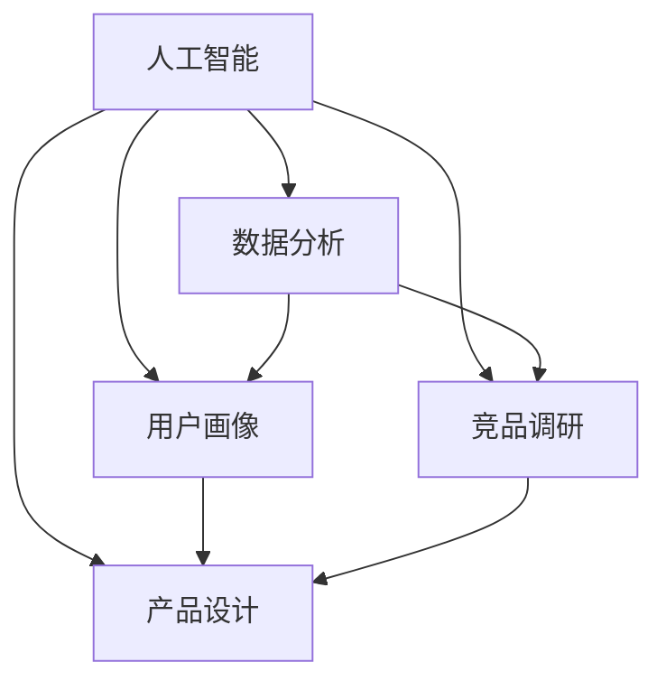

                 

# AI在用户画像、竞品调研等产品设计环节的应用

> 关键词：人工智能,用户画像,竞品调研,产品设计,数据分析,机器学习,深度学习,自然语言处理

## 1. 背景介绍

随着互联网的迅猛发展，各大企业对用户体验的重视程度日益增加，AI技术在产品设计环节的应用也越来越广泛。通过AI技术，企业可以更好地理解用户需求，优化产品功能，提升用户满意度。本文将重点探讨AI技术在用户画像构建、竞品调研、产品设计等多个产品设计环节的应用，介绍具体案例和实践经验，帮助企业更有效地利用AI技术提升产品竞争力。

### 1.1 问题由来

在产品设计过程中，企业需要收集、分析和应用大量用户数据，以形成更科学的用户画像，进而指导产品设计和优化。传统的用户画像构建依赖于问卷调查、用户访谈等人工手段，耗时耗力，且难以覆盖全面。随着数据驱动决策时代的到来，AI技术为产品设计带来了新的方法和思路，可以更快、更全面地构建用户画像，并支持竞品调研、需求分析等多个环节。

## 2. 核心概念与联系

### 2.1 核心概念概述

为更好地理解AI在产品设计中的应用，本文将介绍几个密切相关的核心概念：

- **人工智能(AI)**：一种模拟人类智能的技术，包括机器学习、深度学习、自然语言处理、计算机视觉等。
- **用户画像(User Persona)**：通过收集用户数据和行为信息，形成用户角色的刻画，帮助企业更好地理解用户需求。
- **竞品调研(Kompetitor Analysis)**：通过收集和分析竞品信息，了解市场趋势和用户需求，为产品设计提供参考。
- **产品设计(Product Design)**：结合用户需求和市场调研结果，进行产品功能的定义和设计。
- **数据分析(Analytical Data)**：对用户数据、行为数据等进行收集、清洗、处理和分析，以支持用户画像构建和竞品调研。

这些核心概念之间存在着紧密的联系，形成了产品设计的完整流程。AI技术可以通过数据分析、机器学习等方法，支持用户画像构建、竞品调研、产品设计等多个环节，从而提升企业的产品竞争力。

### 2.2 概念间的关系

这些核心概念之间的关系可以通过以下Mermaid流程图来展示：



这个流程图展示了AI技术在产品设计中的应用流程：

1. **数据分析**：通过AI技术对用户数据、竞品信息等进行分析，提取有价值的信息。
2. **用户画像**：基于数据分析结果，构建用户画像，帮助企业更好地理解用户需求。
3. **竞品调研**：通过数据分析和用户画像，了解市场趋势和用户需求，支持竞品调研。
4. **产品设计**：结合用户画像和竞品调研结果，进行产品功能的定义和设计。

## 3. 核心算法原理 & 具体操作步骤

### 3.1 算法原理概述

AI在产品设计中的应用，主要依赖于数据分析、机器学习和深度学习等技术。通过这些技术，可以构建用户画像、进行竞品调研和指导产品设计。

1. **数据分析**：通过数据清洗、特征提取、统计分析等技术，从海量数据中提取有价值的信息。
2. **用户画像**：利用聚类、分类、回归等机器学习算法，对用户数据进行分析，形成用户画像。
3. **竞品调研**：通过文本分析、图像识别等自然语言处理和计算机视觉技术，分析竞品信息，了解市场趋势和用户需求。
4. **产品设计**：结合用户画像和竞品调研结果，使用生成对抗网络(GAN)、神经网络等深度学习技术，进行产品功能的定义和设计。

### 3.2 算法步骤详解

以用户画像构建为例，其具体步骤如下：

1. **数据收集**：通过问卷调查、用户访谈、行为数据等方式收集用户信息。
2. **数据清洗**：去除噪声和无关数据，提取有用的特征。
3. **特征提取**：通过PCA、LDA等算法，对用户数据进行降维和特征提取。
4. **聚类分析**：使用K-means、层次聚类等算法，对用户进行聚类分组。
5. **画像构建**：对聚类结果进行可视化，形成用户画像。

竞品调研的流程如下：

1. **数据收集**：通过网络爬虫、社交媒体等手段，收集竞品信息。
2. **数据清洗**：清洗和格式化数据，去除无关信息。
3. **文本分析**：使用NLP技术，对竞品评论、新闻报道等文本进行分析。
4. **图像识别**：使用计算机视觉技术，对竞品图片进行识别和分类。
5. **分析报告**：结合文本分析和图像识别结果，形成竞品调研报告。

产品设计的具体步骤包括：

1. **需求收集**：通过用户访谈、问卷调查等方式收集用户需求。
2. **竞品分析**：基于竞品调研报告，了解市场趋势和用户需求。
3. **功能设计**：结合用户需求和竞品调研结果，定义产品功能和特性。
4. **原型设计**：使用CAD、Sketch等工具，设计产品原型。
5. **测试迭代**：对原型进行用户测试，收集反馈，进行迭代优化。

### 3.3 算法优缺点

AI在产品设计中的应用具有以下优点：

1. **高效准确**：通过数据分析和机器学习算法，可以快速处理大量数据，提取有价值的信息，生成准确的画像和调研报告。
2. **全面覆盖**：AI可以覆盖用户画像和竞品调研的各个方面，包括用户行为、竞品信息、市场趋势等。
3. **动态更新**：AI系统可以实时更新数据，不断优化用户画像和调研报告，适应市场变化。

同时，AI在产品设计中也有一定的局限性：

1. **数据依赖**：AI算法需要大量高质量的数据支持，数据不足或数据质量不高会影响结果。
2. **模型复杂**：构建和训练复杂的AI模型需要较高的技术门槛，对开发人员的要求较高。
3. **成本高昂**：构建和维护AI系统需要投入大量的人力、物力和财力，成本较高。

### 3.4 算法应用领域

AI在用户画像、竞品调研、产品设计等多个领域都有广泛的应用。例如：

- **用户画像**：基于AI技术，企业可以构建更加精准的用户画像，如性别、年龄、兴趣、消费习惯等，从而更好地理解用户需求。
- **竞品调研**：通过AI技术，企业可以快速、全面地了解市场趋势和用户需求，帮助企业制定更好的产品策略。
- **产品设计**：AI技术可以辅助企业进行产品功能的定义和设计，提高产品竞争力。

## 4. 数学模型和公式 & 详细讲解 & 举例说明

### 4.1 数学模型构建

以下是用户画像构建的数学模型构建过程。

假设用户画像包含若干个特征，记为 $\mathbf{x} = (x_1, x_2, \ldots, x_n)$，其中 $x_i$ 为第 $i$ 个特征值。设 $y$ 为用户的分类标签，$y \in \{0, 1\}$，其中 $y=1$ 表示用户符合某种画像特征，$y=0$ 表示用户不符合。

用户画像构建的目标是找到最优的分类模型，使得模型能够准确预测用户是否符合某种画像特征。通常采用逻辑回归、决策树、支持向量机等算法，目标函数为：

$$
\min_{\theta} \sum_{i=1}^N \ell(y_i, f(\mathbf{x}_i; \theta))
$$

其中 $f(\mathbf{x}_i; \theta)$ 为模型的预测函数，$\ell$ 为损失函数，$\theta$ 为模型参数。

### 4.2 公式推导过程

以逻辑回归为例，其公式推导如下：

设 $f(\mathbf{x}_i; \theta) = \sigma(\mathbf{w} \cdot \mathbf{x}_i + b)$，其中 $\mathbf{w}$ 为模型权重，$b$ 为偏置项，$\sigma$ 为sigmoid函数。

目标函数为：

$$
\min_{\mathbf{w}, b} \sum_{i=1}^N \ell(y_i, f(\mathbf{x}_i; \mathbf{w}, b))
$$

取交叉熵损失函数 $\ell(y_i, f(\mathbf{x}_i; \mathbf{w}, b)) = -[y_i\log f(\mathbf{x}_i; \mathbf{w}, b) + (1-y_i)\log (1-f(\mathbf{x}_i; \mathbf{w}, b))]$，则目标函数可以化简为：

$$
\min_{\mathbf{w}, b} -\frac{1}{N} \sum_{i=1}^N y_i \log f(\mathbf{x}_i; \mathbf{w}, b) + (1-y_i) \log (1-f(\mathbf{x}_i; \mathbf{w}, b))
$$

通过梯度下降等优化算法，求解上述最优化问题，即可得到最优的模型参数 $\mathbf{w}, b$。

### 4.3 案例分析与讲解

假设我们有一个电商平台的客户画像构建案例，具体步骤如下：

1. **数据收集**：通过平台订单、浏览记录、社交媒体等渠道，收集客户的基本信息、购买行为、兴趣爱好等数据。
2. **数据清洗**：去除无效数据，处理缺失值和异常值，提取有用的特征。
3. **特征提取**：使用PCA算法，对客户数据进行降维和特征提取，得到特征向量 $\mathbf{x}$。
4. **聚类分析**：使用K-means算法，对客户进行聚类分组，得到客户画像。
5. **画像可视化**：将客户画像结果进行可视化，形成可视化图表和报告。

通过上述步骤，企业可以构建精准的客户画像，为产品设计提供依据。例如，可以针对不同画像特征的用户，设计不同的促销策略和个性化推荐方案，提升用户满意度和转化率。

## 5. 项目实践：代码实例和详细解释说明

### 5.1 开发环境搭建

在进行AI应用开发前，我们需要准备好开发环境。以下是使用Python进行PyTorch开发的环境配置流程：

1. 安装Anaconda：从官网下载并安装Anaconda，用于创建独立的Python环境。

2. 创建并激活虚拟环境：
```bash
conda create -n pytorch-env python=3.8 
conda activate pytorch-env
```

3. 安装PyTorch：根据CUDA版本，从官网获取对应的安装命令。例如：
```bash
conda install pytorch torchvision torchaudio cudatoolkit=11.1 -c pytorch -c conda-forge
```

4. 安装各类工具包：
```bash
pip install numpy pandas scikit-learn matplotlib tqdm jupyter notebook ipython
```

完成上述步骤后，即可在`pytorch-env`环境中开始AI应用开发。

### 5.2 源代码详细实现

这里我们以用户画像构建为例，给出使用PyTorch进行用户画像构建的代码实现。

首先，定义用户画像构建的数据处理函数：

```python
import pandas as pd
from sklearn.preprocessing import StandardScaler, MinMaxScaler
from sklearn.cluster import KMeans

def process_data(data_path):
    data = pd.read_csv(data_path)
    features = data.drop('label', axis=1)
    labels = data['label']
    scaler = StandardScaler()
    features = scaler.fit_transform(features)
    features = pd.DataFrame(features, columns=features.columns)
    labels = labels.values
    return features, labels
```

然后，定义用户画像构建的模型函数：

```python
from sklearn.linear_model import LogisticRegression
from sklearn.metrics import accuracy_score

def train_user_profile(features, labels, n_clusters):
    model = LogisticRegression(solver='lbfgs')
    model.fit(features, labels)
    features_scaled = MinMaxScaler().fit_transform(features)
    kmeans = KMeans(n_clusters=n_clusters)
    kmeans.fit(features_scaled)
    return model, kmeans
```

接着，定义用户画像可视化的函数：

```python
import matplotlib.pyplot as plt
import seaborn as sns

def visualize_clusters(features, labels, kmeans):
    features_scaled = MinMaxScaler().fit_transform(features)
    plt.figure(figsize=(10, 5))
    sns.scatterplot(x=features_scaled[:, 0], y=features_scaled[:, 1], hue=labels, palette='Set2', s=50)
    centers = kmeans.cluster_centers_
    plt.scatter(centers[:, 0], centers[:, 1], c='red', s=100, marker='X')
    plt.title(f'K-means Clustering with {kmeans.n_clusters} Clusters')
    plt.show()
```

最后，启动用户画像构建流程：

```python
data_path = 'user_data.csv'
features, labels = process_data(data_path)
model, kmeans = train_user_profile(features, labels, n_clusters=5)
visualize_clusters(features, labels, kmeans)
```

以上就是使用PyTorch进行用户画像构建的完整代码实现。可以看到，通过简单的数据处理、模型训练和可视化，企业可以快速构建精准的用户画像。

### 5.3 代码解读与分析

让我们再详细解读一下关键代码的实现细节：

**process_data函数**：
- 读取数据集，去除标签列，保留特征列。
- 对特征列进行标准化处理，确保特征在同一个尺度下。
- 对标签进行编码，转换成0-1的向量形式。

**train_user_profile函数**：
- 使用逻辑回归模型对数据进行训练。
- 对特征进行最小-最大归一化，确保每个特征在0-1之间。
- 使用K-means算法对数据进行聚类分组，得到用户画像。

**visualize_clusters函数**：
- 对特征进行最小-最大归一化，确保数据在同一个尺度下。
- 使用散点图对聚类结果进行可视化。
- 在图中标记聚类中心，突出显示聚类结果。

可以看到，通过这些函数的组合，企业可以轻松实现用户画像的构建。用户画像的结果可以用于指导产品设计、竞品分析等多个环节，帮助企业更好地理解用户需求和市场趋势。

## 6. 实际应用场景

### 6.1 智能客服系统

智能客服系统是AI技术在用户画像和竞品调研中的典型应用。通过AI技术，企业可以构建精准的用户画像，了解用户需求和行为，实现智能化的客服服务。

在智能客服系统中，AI技术可以实现：

1. **用户画像构建**：通过分析用户历史行为和咨询记录，构建用户画像，了解用户需求和偏好。
2. **竞品调研**：分析竞品的客服系统，了解市场趋势和用户满意度，优化自身客服系统。
3. **聊天机器人设计**：结合用户画像和竞品调研结果，设计合适的聊天机器人，提升客服体验。

例如，某电商平台利用AI技术构建了精准的用户画像，并结合竞品调研结果，优化了自身的智能客服系统。通过用户画像分析，系统能够快速响应用户需求，提供个性化的服务方案。同时，通过竞品调研，系统能够了解市场趋势，优化自身客服策略，提升用户满意度。

### 6.2 金融产品设计

金融产品设计是AI技术在用户画像和竞品调研中的另一个重要应用领域。通过AI技术，企业可以构建精准的用户画像，了解用户需求和行为，设计更加符合用户需求的产品。

在金融产品设计中，AI技术可以实现：

1. **用户画像构建**：通过分析用户的投资行为和交易记录，构建用户画像，了解用户风险偏好和投资需求。
2. **竞品调研**：分析竞品的金融产品，了解市场趋势和用户满意度，优化自身产品设计。
3. **金融产品设计**：结合用户画像和竞品调研结果，设计符合用户需求和市场趋势的金融产品。

例如，某金融科技公司利用AI技术构建了精准的用户画像，并结合竞品调研结果，设计了多款金融产品。通过用户画像分析，系统能够快速响应用户需求，提供个性化的金融服务方案。同时，通过竞品调研，系统能够了解市场趋势，优化自身金融产品设计，提升用户满意度。

### 6.3 智慧零售应用

智慧零售是AI技术在用户画像和竞品调研中的另一个典型应用场景。通过AI技术，企业可以构建精准的用户画像，了解用户需求和行为，实现智能化的零售服务。

在智慧零售应用中，AI技术可以实现：

1. **用户画像构建**：通过分析用户的购物行为和评价记录，构建用户画像，了解用户需求和偏好。
2. **竞品调研**：分析竞品的零售系统，了解市场趋势和用户满意度，优化自身零售系统。
3. **零售产品设计**：结合用户画像和竞品调研结果，设计符合用户需求和市场趋势的零售产品。

例如，某电商平台利用AI技术构建了精准的用户画像，并结合竞品调研结果，优化了自身的智慧零售系统。通过用户画像分析，系统能够快速响应用户需求，提供个性化的零售服务方案。同时，通过竞品调研，系统能够了解市场趋势，优化自身零售产品设计，提升用户满意度。

## 7. 工具和资源推荐

### 7.1 学习资源推荐

为了帮助开发者系统掌握AI技术在产品设计中的应用，这里推荐一些优质的学习资源：

1. **深度学习基础课程**：如斯坦福大学的CS231n课程，详细介绍了深度学习的基础理论和应用实践。
2. **自然语言处理课程**：如Coursera上的Natural Language Processing with TensorFlow，介绍了NLP技术的基本原理和应用实例。
3. **用户画像构建课程**：如Udacity的User Personas for UX Design，介绍了用户画像的构建方法和工具。
4. **智能客服系统课程**：如Coursera的Deep Learning for Natural Language Processing，介绍了智能客服系统的构建方法和技术。
5. **金融产品设计课程**：如Udacity的Machine Learning for Trading，介绍了金融产品设计的机器学习方法。

通过对这些资源的学习实践，相信你一定能够快速掌握AI技术在产品设计中的应用方法，并用于解决实际问题。

### 7.2 开发工具推荐

高效的开发离不开优秀的工具支持。以下是几款用于AI应用开发的常用工具：

1. PyTorch：基于Python的开源深度学习框架，灵活动态的计算图，适合快速迭代研究。大部分预训练模型都有PyTorch版本的实现。
2. TensorFlow：由Google主导开发的开源深度学习框架，生产部署方便，适合大规模工程应用。同样有丰富的预训练模型资源。
3. Weights & Biases：模型训练的实验跟踪工具，可以记录和可视化模型训练过程中的各项指标，方便对比和调优。
4. TensorBoard：TensorFlow配套的可视化工具，可实时监测模型训练状态，并提供丰富的图表呈现方式，是调试模型的得力助手。
5. Jupyter Notebook：支持Python、R等多种编程语言的交互式编程环境，便于进行数据分析和模型训练。

合理利用这些工具，可以显著提升AI应用开发的效率，加快创新迭代的步伐。

### 7.3 相关论文推荐

AI在产品设计中的应用源于学界的持续研究。以下是几篇奠基性的相关论文，推荐阅读：

1. **《User Persona Development with Data Mining and Text Mining Techniques》**：详细介绍了用户画像构建的数据挖掘和文本挖掘方法，提供了大量实例和算法。
2. **《K-means Clustering: The Effects of Data Reduction and Preprocessing Techniques》**：介绍了K-means聚类算法的应用效果，比较了不同数据预处理方法的效果。
3. **《Competitive Analysis in Product Design》**：介绍了竞品调研的方法和技术，提供了多种竞品分析工具和案例。
4. **《Generative Adversarial Networks: An Overview》**：介绍了生成对抗网络的基本原理和应用实例，适合了解AI技术在产品设计中的具体应用。

这些论文代表了大模型微调技术的发展脉络。通过学习这些前沿成果，可以帮助研究者把握学科前进方向，激发更多的创新灵感。

## 8. 总结：未来发展趋势与挑战

### 8.1 总结

本文对AI在用户画像、竞品调研等产品设计环节的应用进行了全面系统的介绍。首先阐述了AI技术在产品设计中的重要性，明确了AI技术在用户画像构建、竞品调研、产品设计等多个环节的应用价值。其次，从原理到实践，详细讲解了AI技术的数学模型、算法步骤和关键技术点，提供了具体案例和代码实现。同时，本文还广泛探讨了AI技术在智能客服、金融产品设计、智慧零售等多个领域的应用前景，展示了AI技术的广阔应用场景。最后，本文精选了AI技术的学习资源、开发工具和相关论文，为开发者提供了全面的技术指引。

通过本文的系统梳理，可以看到，AI技术在产品设计中的应用已经成为企业提升产品竞争力的重要手段。AI技术不仅能够帮助企业构建精准的用户画像，进行竞品调研，还能指导产品设计，实现智能化、个性化的产品服务。未来，随着AI技术的不断进步，产品设计将变得更加智能化、个性化和人性化，为用户的生产生活方式带来深刻变革。

### 8.2 未来发展趋势

展望未来，AI在产品设计中的应用将呈现以下几个发展趋势：

1. **智能化提升**：通过AI技术，产品设计将变得更加智能化，能够自动生成设计方案、优化产品功能，提升用户体验。
2. **个性化增强**：AI技术能够根据用户画像和行为数据，提供个性化的产品推荐和服务，满足不同用户的需求。
3. **实时化优化**：AI技术能够实时分析用户反馈和市场变化，快速调整产品设计方案，优化产品性能。
4. **多模态融合**：AI技术将融合视觉、语音、文本等多种模态数据，提升产品设计的全面性和准确性。
5. **跨领域应用**：AI技术将跨越不同领域，如医疗、教育、金融等，应用到各种产品设计中，提升各领域的智能化水平。

以上趋势凸显了AI技术在产品设计中的巨大潜力。这些方向的探索发展，必将进一步提升产品设计的智能化水平，为用户的生产生活方式带来深刻变革。

### 8.3 面临的挑战

尽管AI在产品设计中的应用取得了显著进展，但在迈向更加智能化、普适化应用的过程中，仍面临诸多挑战：

1. **数据质量问题**：AI技术依赖大量高质量的数据支持，数据不足或数据质量不高会影响结果。
2. **模型复杂性**：构建和训练复杂的AI模型需要较高的技术门槛，对开发人员的要求较高。
3. **资源消耗**：AI模型的训练和推理需要大量的计算资源和存储空间，成本较高。
4. **隐私保护**：AI技术需要处理大量的用户数据，如何保护用户隐私和数据安全，是一个亟待解决的问题。
5. **伦理道德**：AI技术的应用可能涉及到伦理和道德问题，如算法歧视、偏见等，需要建立相应的监管机制。

正视AI技术面临的这些挑战，积极应对并寻求突破，将使AI技术在产品设计中更好地发挥作用，为用户的生产生活方式带来更大的益处。

### 8.4 未来突破

面对AI技术在产品设计中所面临的种种挑战，未来的研究需要在以下几个方面寻求新的突破：

1. **数据增强技术**：通过数据增强技术，生成更多高质量的训练数据，提升模型性能。
2. **轻量级模型**：开发更轻量级的模型，降低计算资源和存储空间的消耗，提升模型部署效率。
3. **多模态融合**：融合视觉、语音、文本等多种模态数据，提升产品设计的全面性和准确性。
4. **隐私保护技术**：采用隐私保护技术，如差分隐私、联邦学习等，保护用户数据隐私和安全性。
5. **伦理道德研究**：开展AI技术的伦理道德研究，建立公平、公正、透明的算法监管机制。

这些研究方向的探索，必将引领AI技术在产品设计中的应用走向更高的台阶，为用户的生产生活方式带来更大的益处。面向未来，AI技术需要在技术、伦理和应用等多个层面进行深入研究，才能真正实现智能化、个性化和人性化的产品设计，造福人类的生产生活方式。

## 9. 附录：常见问题与解答

**Q1：AI技术在产品设计中的应用是否依赖大量高质量的数据？**

A: 是的，AI技术在产品设计中的应用依赖大量高质量的数据支持。高质量的数据可以提升模型性能，从而构建更加精准的用户画像和竞品调研结果。

**Q2：AI技术在产品设计中的应用是否容易受到数据噪声的影响？**

A: 是的，AI技术在产品设计中的应用容易受到数据噪声的影响。数据噪声会导致模型性能下降，从而影响用户画像和竞品调研结果的准确性。

**Q3：AI技术在产品设计中的应用是否需要高技术门槛？**

A: 是的，AI技术在产品设计中的应用需要高技术门槛。AI模型的构建和训练需要具备一定的算法和数学基础，对开发人员的要求较高。

**Q4：AI技术在产品设计中的应用是否需要大量的计算资源和存储空间？**

A: 是的，AI技术在产品设计中的应用需要大量的计算资源和存储空间。AI模型的训练和推理需要较高的计算资源和存储空间，成本较高。

**Q5：AI技术在产品设计中的应用是否需要考虑用户隐私和数据安全？**

A: 是的，AI技术在产品设计中的应用需要考虑用户隐私和数据安全。处理用户数据时，需要采用隐私保护技术，如差分隐私、联邦学习等，保护用户数据隐私和安全性。

通过这些常见问题的解答，可以更好地理解AI技术在产品设计中的应用场景和潜在问题，为AI技术的实际应用提供参考。

---

作者：禅与计算机程序设计艺术 / Zen and the Art of Computer Programming

