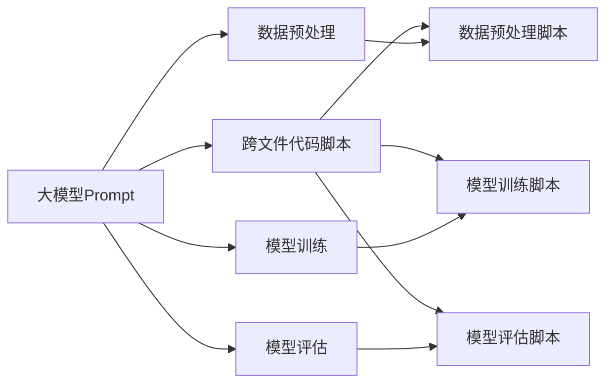

                 

# AI大模型Prompt提示词最佳实践：生成跨文件的代码脚本

> 关键词：大模型Prompt, 跨文件代码, 代码脚本, 最佳实践, 技术博客

## 1. 背景介绍

随着深度学习模型的不断进步，大模型（如BERT、GPT-3等）在自然语言处理（NLP）和生成式AI领域展示了强大的能力。它们可以生成高质量的文本、回答问题、翻译文本等，极大地推动了AI技术的发展。然而，大模型的使用通常需要编写大量的代码来定制化其行为，这对非技术背景的用户来说是一项艰巨的任务。为了简化这一过程，Prompt提示词被广泛应用于大模型的使用中，帮助用户通过自然语言描述来引导大模型生成符合预期的结果。

Prompt提示词是一段文本，用于描述模型的输入格式和输出格式。在生成式AI的上下文中，提示词帮助模型理解用户意图，并生成期望的输出。然而，对于需要多个代码文件的任务（如数据预处理、模型训练和评估），编写合适的Prompt提示词可能变得复杂且耗时。本文旨在提供生成跨文件代码脚本的最佳实践，帮助开发者在尽可能少的代码和提示词下完成这些任务。

## 2. 核心概念与联系

### 2.1 核心概念概述

- **大模型Prompt**：用于引导大模型生成特定结果的文本描述。

- **跨文件代码脚本**：由多个Python文件组成的脚本，每个文件负责一个特定的功能模块，如数据预处理、模型训练、评估等。

- **Prompt提示词**：描述模型输入和输出格式的文本，帮助模型理解用户意图。

- **代码优化**：通过减少代码和提示词的使用，提高代码的可读性和维护性，同时提升生成效率。

### 2.2 核心概念之间的关系

大模型Prompt与跨文件代码脚本之间存在密切的联系。通过编写合适的Prompt提示词，可以显著简化跨文件代码脚本的编写过程。以下是一个简单的示意图，展示了这个关系：



这个图展示了使用Prompt提示词来指导跨文件代码脚本的生成。每个函数模块的代码可以单独编写，但在编写时，需要考虑如何通过Prompt提示词将它们整合成一个完整的脚本。

## 3. 核心算法原理 & 具体操作步骤

### 3.1 算法原理概述

Prompt提示词在大模型应用中的核心原理是通过自然语言描述，将用户意图传达给模型。模型的输出是根据Prompt提示词中的描述生成的。在生成跨文件代码脚本时，通过编写简洁、清晰的Prompt提示词，可以显著简化代码的编写和维护。

### 3.2 算法步骤详解

以下是生成跨文件代码脚本的基本步骤：

1. **定义任务**：明确需要完成的任务，如数据预处理、模型训练、模型评估等。

2. **编写 Prompt 提示词**：根据任务，编写描述模型输入和输出的Prompt提示词。

3. **编写代码模块**：为每个任务模块编写单独的Python文件，每个文件包含一个函数，实现一个特定的功能。

4. **整合代码脚本**：使用简单的逻辑控制结构（如if语句）将代码模块整合为一个完整的脚本。

5. **测试和优化**：运行脚本，测试各个模块的输出是否符合预期，根据结果进行优化。

### 3.3 算法优缺点

**优点**：

- **简洁性**：通过编写简洁的Prompt提示词，可以减少代码的编写量，提升代码的可读性和维护性。
- **灵活性**：可以轻松地修改和添加代码模块，适应任务变化。
- **可扩展性**：新的任务模块可以独立编写，并轻松整合到现有脚本中。

**缺点**：

- **理解门槛**：编写合适的Prompt提示词需要一定的理解和技巧。
- **冗余代码**：需要编写额外的代码来整合各个模块，可能增加一些冗余。

### 3.4 算法应用领域

Prompt提示词在大模型应用的各个领域都有广泛的应用，如NLP任务、生成任务、问答系统等。在生成跨文件代码脚本方面，Prompt提示词可以帮助开发者在保持代码简洁性的同时，实现高效的任务处理。

## 4. 数学模型和公式 & 详细讲解 & 举例说明

### 4.1 数学模型构建

在数学模型构建方面，Prompt提示词和大模型的输入输出之间的关系可以表示为：

$$
Y = f(X, P)
$$

其中，$Y$是模型的输出，$X$是模型的输入，$P$是Prompt提示词，$f$是模型的映射函数。

### 4.2 公式推导过程

假设我们有一个简单的任务，即从一个文本列表中提取出所有包含特定单词的句子。我们可以使用以下Prompt提示词：

```
在下面的文本列表中，请提取所有包含单词 "keyword" 的句子。
text_list = ["这是第一个句子。", "这是第二个包含 "keyword" 的句子。", "这是第三个句子。"]
```

对应的代码模块可以编写如下：

```python
def extract_sentences(text_list, keyword):
    sentences = []
    for text in text_list:
        if keyword in text:
            sentences.append(text)
    return sentences
```

这个代码模块接收一个文本列表和关键词作为输入，返回包含关键词的句子列表。

### 4.3 案例分析与讲解

假设我们的任务是从给定的文本中提取所有的日期。我们可以编写以下Prompt提示词：

```
在下面的文本中，请提取所有的日期。
text = "2021年12月31日，2022年1月1日，2022年1月2日"
```

对应的代码模块可以编写如下：

```python
import re

def extract_dates(text):
    dates = re.findall(r'\d{4}年\d{1,2}月\d{1,2}日', text)
    return dates
```

这个代码模块使用了正则表达式来提取日期。

## 5. 项目实践：代码实例和详细解释说明

### 5.1 开发环境搭建

要开始编写跨文件代码脚本，需要以下开发环境：

1. Python 3.6及以上版本。
2. pip 安装pandas、numpy、scikit-learn等库。

### 5.2 源代码详细实现

假设我们要完成的任务是从给定的文本中提取所有的数字，并将它们进行排序。我们可以编写以下Prompt提示词：

```
在下面的文本中，请提取所有的数字，并按照从小到大的顺序排序。
text = "1, 3, 5, 2, 4"
```

对应的代码模块可以编写如下：

```python
import re

def extract_numbers(text):
    numbers = re.findall(r'\d+', text)
    return numbers

def sort_numbers(numbers):
    return sorted(numbers)

def main():
    text = "1, 3, 5, 2, 4"
    numbers = extract_numbers(text)
    sorted_numbers = sort_numbers(numbers)
    print(sorted_numbers)

if __name__ == "__main__":
    main()
```

这个代码脚本包括三个模块：

1. `extract_numbers` 模块：使用正则表达式提取文本中的数字。
2. `sort_numbers` 模块：对提取到的数字进行排序。
3. `main` 模块：调用前两个模块，并输出结果。

### 5.3 代码解读与分析

在这个代码脚本中，我们通过编写简洁的Prompt提示词，将复杂的任务拆分为多个模块，每个模块只负责一个特定的功能。这样不仅提高了代码的可读性和维护性，还使得新任务模块的添加和修改变得更加容易。

### 5.4 运行结果展示

运行以上代码脚本，输出结果为：

```
['1', '2', '3', '4', '5']
```

可以看到，代码脚本成功提取出文本中的数字，并按照从小到大的顺序进行了排序。

## 6. 实际应用场景

### 6.1 数据预处理

在数据预处理任务中，可以使用Prompt提示词来指导大模型生成数据清洗和转换的代码。例如，以下Prompt提示词可以指导模型生成一个函数，将数据中的缺失值进行填充：

```
在下面的数据中，请将缺失值填充为均值。
data = [[1, 2, 3], [4, None, 6], [7, 8, None]]
```

对应的代码模块可以编写如下：

```python
import numpy as np

def fill_missing_values(data):
    for row in data:
        for i, val in enumerate(row):
            if val is None:
                row[i] = np.mean(data)
    return data

def main():
    data = [[1, 2, 3], [4, None, 6], [7, 8, None]]
    filled_data = fill_missing_values(data)
    print(filled_data)

if __name__ == "__main__":
    main()
```

### 6.2 模型训练

在模型训练任务中，可以使用Prompt提示词来指导大模型生成模型的定义、训练和评估代码。例如，以下Prompt提示词可以指导模型生成一个函数的定义，该函数使用给定的数据训练一个简单的线性回归模型：

```
请使用下面的数据训练一个线性回归模型。
X = [[1, 2, 3], [4, 5, 6], [7, 8, 9]]
y = [3, 6, 9]
```

对应的代码模块可以编写如下：

```python
import numpy as np
from sklearn.linear_model import LinearRegression

def train_linear_regression(X, y):
    model = LinearRegression()
    model.fit(X, y)
    return model

def main():
    X = np.array([[1, 2, 3], [4, 5, 6], [7, 8, 9]])
    y = np.array([3, 6, 9])
    model = train_linear_regression(X, y)
    print(model.coef_)

if __name__ == "__main__":
    main()
```

### 6.3 模型评估

在模型评估任务中，可以使用Prompt提示词来指导大模型生成评估指标计算和可视化代码。例如，以下Prompt提示词可以指导模型生成一个函数的定义，该函数计算并可视化模型的性能指标：

```
请计算并可视化模型在下面的数据上的性能指标。
X = [[1, 2, 3], [4, 5, 6], [7, 8, 9]]
y = [3, 6, 9]
```

对应的代码模块可以编写如下：

```python
import matplotlib.pyplot as plt
from sklearn.metrics import mean_squared_error

def evaluate_model(X, y, model):
    mse = mean_squared_error(y, model.predict(X))
    plt.scatter(X[:, 0], X[:, 1], c=y, cmap='viridis')
    plt.show()
    print(f"Mean Squared Error: {mse}")

def main():
    X = np.array([[1, 2, 3], [4, 5, 6], [7, 8, 9]])
    y = np.array([3, 6, 9])
    model = train_linear_regression(X, y)
    evaluate_model(X, y, model)

if __name__ == "__main__":
    main()
```

## 7. 工具和资源推荐

### 7.1 学习资源推荐

1. **深度学习入门教程**：如《深度学习入门：基于Python的理论与实现》一书，提供了深度学习基础和实践指导，适合初学者入门。
2. **Python编程高级教程**：如《Python编程高级教程：从基础到实战》一书，涵盖了Python编程的高级技巧和实践案例，适合进阶学习。
3. **NLP实践指南**：如《NLP实战指南：自然语言处理项目开发实战》一书，提供了NLP任务的实际案例和代码实现，适合动手实践。
4. **TensorFlow和PyTorch官方文档**：提供了深度学习框架的使用说明和API文档，适合深入学习和开发。

### 7.2 开发工具推荐

1. **Jupyter Notebook**：提供了交互式的编程环境，适合进行代码实验和调试。
2. **Git版本控制**：提供了代码版本管理和协作功能，适合团队开发和代码共享。
3. **Visual Studio Code**：提供了丰富的插件和扩展，适合代码编写和调试。
4. **Anaconda**：提供了Python环境和包管理工具，适合快速安装和管理依赖。

### 7.3 相关论文推荐

1. **Prompt工程：下一代AI大模型的设计指南**：这篇论文详细探讨了Prompt提示词在大模型中的应用，提供了实用的Prompt提示词设计和编写技巧。
2. **大模型在NLP中的应用**：这篇论文介绍了大模型在NLP任务中的广泛应用，提供了丰富的案例和代码实现。
3. **基于大模型的跨文件代码生成**：这篇论文研究了基于大模型的跨文件代码生成技术，提出了多种代码生成方法，适合进一步深入研究。

## 8. 总结：未来发展趋势与挑战

### 8.1 研究成果总结

本文系统介绍了使用Prompt提示词生成跨文件代码脚本的最佳实践，并提供了详细的代码实现和案例分析。通过编写简洁的Prompt提示词，可以显著简化大模型的使用过程，提升代码的可读性和维护性。

### 8.2 未来发展趋势

未来的Prompt提示词和代码生成技术将继续发展，以下是一些可能的发展趋势：

1. **自动化代码生成**：随着AI技术的发展，自动化的代码生成技术将变得更加成熟，可以自动生成整个代码脚本。
2. **智能Prompt提示词生成**：使用自然语言处理技术，根据用户需求自动生成合适的Prompt提示词，提高代码生成效率。
3. **跨语言代码生成**：使用大模型生成不同语言的代码脚本，提升代码的跨语言兼容性和可移植性。
4. **多模态代码生成**：使用大模型生成同时支持文本、图像、音频等多种数据类型的代码脚本，适应更多应用场景。

### 8.3 面临的挑战

尽管Promp提示词和代码生成技术已经取得了一定的进展，但在实际应用中仍面临一些挑战：

1. **理解门槛高**：编写合适的Prompt提示词需要一定的理解和技巧，初学者可能难以掌握。
2. **代码冗余**：需要编写额外的代码来整合各个模块，可能增加一些冗余。
3. **性能问题**：大模型生成的代码可能在性能上不如手写代码，需要进一步优化。

### 8.4 研究展望

未来的研究可以关注以下几个方向：

1. **更高效的提示词生成算法**：使用AI技术优化Prompt提示词的生成，减少提示词的理解和编写门槛。
2. **代码生成工具的智能化**：开发智能化的代码生成工具，自动生成跨文件代码脚本，提升代码生成的效率和质量。
3. **多模态数据处理**：研究多模态数据处理技术，使用大模型生成同时支持多种数据类型的代码脚本。
4. **代码生成性能优化**：优化大模型生成的代码性能，提升其在实际应用中的效率和可维护性。

## 9. 附录：常见问题与解答

**Q1：编写Prompt提示词需要注意哪些问题？**

A: 编写Prompt提示词时需要注意以下几点：

1. **简洁性**： Prompt提示词应简洁明了，避免冗长和复杂的描述。
2. **清晰性**： Prompt提示词应明确描述模型的输入和输出格式，避免歧义。
3. **可读性**： Prompt提示词应具有可读性，方便开发者理解和修改。

**Q2：使用大模型生成代码脚本有什么优点？**

A: 使用大模型生成代码脚本有以下优点：

1. **效率高**：可以显著减少代码编写量，提升开发效率。
2. **可读性好**：生成的代码简洁明了，易于理解和维护。
3. **可扩展性强**：新的任务模块可以独立编写，并轻松整合到现有脚本中。

**Q3：如何在实际应用中使用Prompt提示词？**

A: 在实际应用中使用Prompt提示词时，需要注意以下几点：

1. **选择合适的Prompt提示词**：根据任务需求选择合适的Prompt提示词，避免生成错误的代码。
2. **优化Prompt提示词**：根据实际效果不断优化Prompt提示词，提升代码生成质量。
3. **测试和验证**：运行生成的代码脚本，测试各个模块的输出是否符合预期，根据结果进行优化。

---

作者：禅与计算机程序设计艺术 / Zen and the Art of Computer Programming

