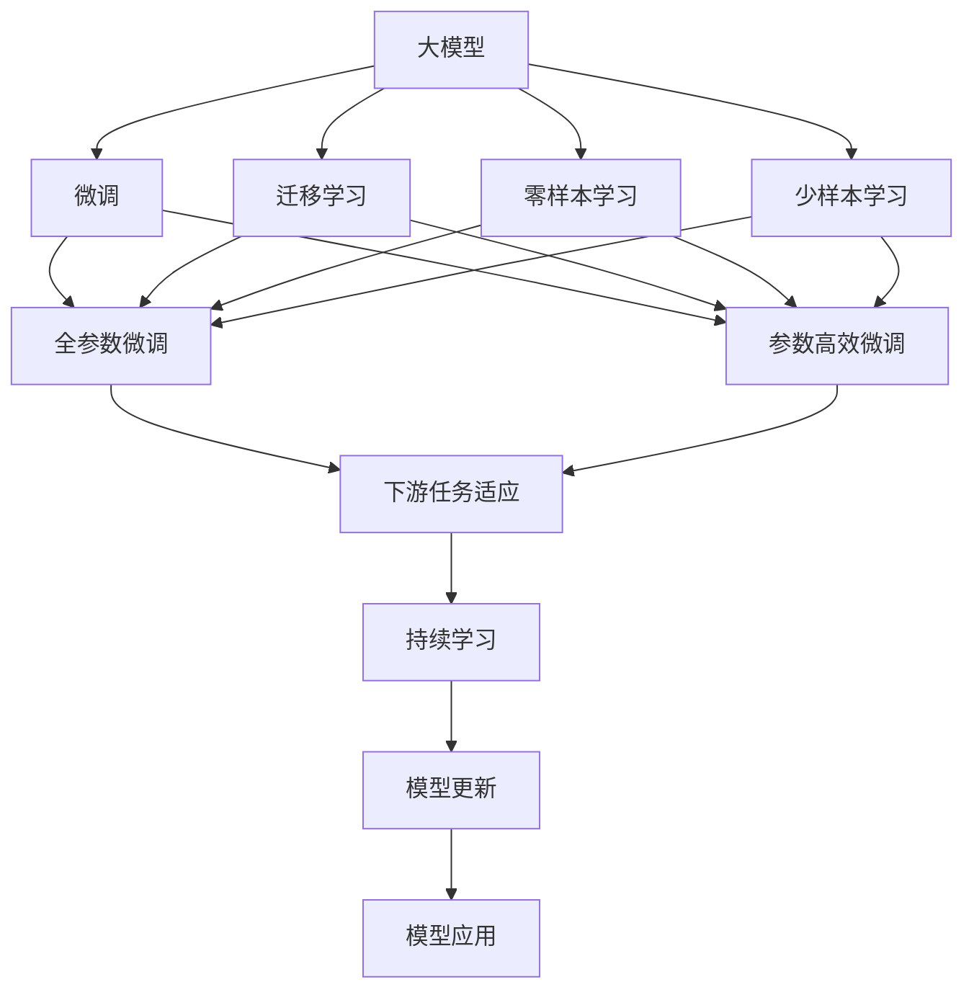

                 

# AI大模型创业：如何应对未来用户需求？

> 关键词：人工智能,大模型,用户需求,创业,未来发展,技术创新

## 1. 背景介绍

### 1.1 问题由来

近年来，人工智能(AI)技术迅猛发展，特别是基于大模型的深度学习技术，如GPT-3、BERT等，在自然语言处理(NLP)、计算机视觉(CV)、语音识别(SR)等多个领域取得了显著的成果。大模型因其强大的自适应能力和泛化性能，在处理复杂问题上表现出了卓越的性能，极大地推动了AI技术的落地应用。

然而，随着AI技术的不断进步，如何更好地满足未来用户需求，成为大模型创业者必须面对的重要课题。本文旨在从AI大模型创业的角度，探讨如何应对未来用户需求，提出一系列策略和实践建议，帮助创业者在激烈的市场竞争中脱颖而出。

### 1.2 问题核心关键点

在AI大模型创业中，如何有效应对未来用户需求，需要关注以下几个核心关键点：

1. **用户需求的多样性和复杂性**：随着技术的发展，用户需求日益多样化，不同行业、不同应用场景对AI模型的需求各不相同，创业者需要具备敏锐的市场洞察力和技术实力，精准把握用户需求。

2. **模型的泛化能力和适应性**：大模型应具备较强的泛化能力，能够在多种数据分布和应用场景中表现出良好的适应性，以便快速适应不断变化的市场需求。

3. **模型的可解释性和透明度**：用户对模型的可解释性有着强烈的期望，创业者需要能够清晰地解释模型的工作原理和决策过程，增强用户对AI技术的信任度。

4. **数据和算法的持续优化**：AI技术是一个快速迭代的领域，创业者需要不断跟踪最新的研究成果，持续优化模型和算法，保持技术的领先地位。

5. **伦理和责任问题**：AI技术的广泛应用带来了伦理和责任问题，如隐私保护、偏见消除、决策公平等，创业者需要认真对待这些问题，确保技术应用的公正性和安全性。

6. **商业化和落地能力**：AI技术最终需要落地应用，创业者需要具备将技术转化为实际商业产品的能力，包括产品设计、市场推广、用户培训等各个环节。

### 1.3 问题研究意义

在AI大模型创业中，精准应对未来用户需求，不仅能帮助企业获得竞争优势，还能实现技术的快速落地和商业成功。具体而言，以下几点展示了其重要意义：

1. **增强市场竞争力**：精准把握用户需求，可以有效降低开发成本，提高产品竞争力，从而在激烈的市场竞争中脱颖而出。

2. **提升用户体验**：用户需求的多样性要求AI模型具备更高的灵活性和适用性，能够更好地满足用户个性化需求，提升用户体验。

3. **促进技术创新**：创业者不断探索新的应用场景和市场需求，可以推动AI技术的创新和进步，推动整个行业的发展。

4. **增强用户信任**：通过增强模型的可解释性和透明度，可以增强用户对AI技术的信任度，促进AI技术的广泛应用。

5. **保障社会责任**：重视伦理和责任问题，确保AI技术的公正性、公平性和安全性，有助于构建和谐的社会环境。

6. **加速商业化进程**：具备将技术转化为商业产品的能力，可以加速AI技术的商业化进程，实现技术和市场的良性循环。

## 2. 核心概念与联系

### 2.1 核心概念概述

在大模型创业中，涉及多个核心概念，包括：

- **大模型**：指基于深度学习技术，通过大规模无标签数据预训练，学习到广泛知识的大型神经网络模型。
- **微调(Fine-tuning)**：在大模型基础上，通过有监督学习优化模型特定任务的能力。
- **迁移学习(Transfer Learning)**：将在一个任务上学到的知识迁移到另一个任务上，以提升新任务的表现。
- **零样本学习(Zero-shot Learning)**：模型仅通过任务描述即可推理出任务结果，无需任何标注数据。
- **少样本学习(Few-shot Learning)**：模型仅通过少量标注数据即可快速适应新任务。
- **多模态学习(Multi-modal Learning)**：模型能够同时处理多种模态数据（如文本、图像、音频），提升综合理解能力。
- **持续学习(Continual Learning)**：模型能够不断学习新知识，同时保持已有知识，适应数据分布变化。
- **参数高效微调(Parameter-Efficient Fine-tuning, PEFT)**：仅更新部分模型参数进行微调，以提高效率和泛化能力。
- **提示学习(Prompt Learning)**：通过精心设计的输入模板，引导模型输出特定结果，减少微调参数。
- **对抗训练(Adversarial Training)**：引入对抗样本，增强模型鲁棒性。

这些概念之间存在紧密联系，共同构成了大模型创业的核心技术框架。

### 2.2 概念间的关系

通过一个Mermaid流程图，我们可以更直观地展示这些核心概念之间的关系：



这个流程图展示了从大模型到下游任务应用的全过程，涉及微调、迁移学习、零样本和少样本学习等多种技术手段，以及持续学习和模型更新的动态过程。

## 3. 核心算法原理 & 具体操作步骤

### 3.1 算法原理概述

大模型创业的核心算法原理包括微调、迁移学习和多模态学习等。这里以微调为例，简要概述其基本原理：

微调是一种在大规模预训练模型的基础上，通过有监督学习优化特定任务能力的策略。假设预训练模型为 $M_{\theta}$，其中 $\theta$ 表示模型参数。在大规模无标签数据上进行预训练后，模型学习到了通用的语言表示。当需要对特定任务 $T$ 进行微调时，使用任务 $T$ 的标注数据集 $D=\{(x_i, y_i)\}_{i=1}^N$，其中 $x_i$ 为输入，$y_i$ 为输出标签。微调的目标是找到最优参数 $\hat{\theta}$，使得模型在新任务上表现优异。

微调的损失函数通常基于交叉熵或均方误差等常见损失函数。优化目标为最小化损失函数 $\mathcal{L}(\theta)$，即：

$$
\hat{\theta} = \mathop{\arg\min}_{\theta} \mathcal{L}(M_{\theta}, D)
$$

优化算法（如Adam、SGD等）用于迭代更新模型参数，直至收敛。

### 3.2 算法步骤详解

下面详细介绍大模型微调的具体操作步骤：

1. **准备数据**：收集任务 $T$ 的标注数据集 $D$，并将其划分为训练集、验证集和测试集。

2. **选择模型**：选择适合的预训练模型 $M_{\theta}$，如BERT、GPT等。

3. **添加任务适配层**：根据任务类型，设计相应的输出层和损失函数。例如，对于分类任务，可以在顶层添加线性分类器，并使用交叉熵损失。

4. **设置超参数**：选择合适的优化器、学习率、批大小等超参数。

5. **执行训练**：将训练集数据分批次输入模型，前向传播计算损失函数，反向传播更新模型参数。

6. **评估模型**：在验证集上评估模型性能，避免过拟合。

7. **调整参数**：根据验证集结果调整学习率或优化器参数，继续训练。

8. **测试模型**：在测试集上测试模型性能，评估模型泛化能力。

9. **部署应用**：将训练好的模型部署到实际应用中，持续收集用户反馈，进行持续学习。

### 3.3 算法优缺点

大模型微调有以下优点：

1. **高效性**：使用预训练模型作为初始化参数，显著减少了训练时间和标注数据需求。

2. **泛化能力强**：通过在大规模数据上预训练，模型能够学习到丰富的知识，具有较强的泛化能力。

3. **灵活性高**：微调过程灵活，可以针对不同的任务和数据集进行调整，适应性强。

4. **可解释性强**：通过微调，模型可以更好地理解特定任务，提供更清晰的解释。

5. **可扩展性好**：微调技术适用于多种任务，如自然语言处理、计算机视觉、语音识别等。

然而，也存在一些缺点：

1. **数据依赖高**：微调效果依赖于标注数据的数量和质量，获取高质量标注数据成本较高。

2. **模型复杂度高**：大模型参数量大，训练和推理耗时较长。

3. **过拟合风险**：如果标注数据不足，模型可能出现过拟合。

4. **泛化能力有限**：模型在预训练数据上表现较好，但在未见过的数据上表现可能不佳。

5. **伦理和隐私问题**：预训练和微调过程中可能涉及隐私数据，需确保数据使用的合法性和安全性。

### 3.4 算法应用领域

大模型微调技术在多个领域得到了广泛应用，包括但不限于：

- **自然语言处理(NLP)**：用于文本分类、情感分析、问答系统、机器翻译等任务。
- **计算机视觉(CV)**：用于图像识别、物体检测、图像生成等任务。
- **语音识别(SR)**：用于语音识别、语音合成等任务。
- **推荐系统**：用于商品推荐、内容推荐等任务。
- **智能客服**：用于自动问答、客服对话等任务。
- **金融分析**：用于风险评估、市场预测等任务。
- **医疗健康**：用于疾病诊断、医学影像分析等任务。

## 4. 数学模型和公式 & 详细讲解 & 举例说明

### 4.1 数学模型构建

假设大模型 $M_{\theta}$ 用于任务 $T$ 的微调，其输入为 $x$，输出为 $y$。在训练集 $D=\{(x_i, y_i)\}_{i=1}^N$ 上，微调的目标是最小化损失函数 $\mathcal{L}(\theta)$：

$$
\mathcal{L}(\theta) = \frac{1}{N} \sum_{i=1}^N \ell(M_{\theta}(x_i), y_i)
$$

其中，$\ell$ 为任务 $T$ 的损失函数，例如交叉熵损失或均方误差损失。

### 4.2 公式推导过程

以二分类任务为例，假设模型 $M_{\theta}$ 的输出为 $y_i$，真实标签为 $y_i$，交叉熵损失函数为：

$$
\ell(M_{\theta}(x_i), y_i) = -[y_i\log \hat{y_i} + (1-y_i)\log (1-\hat{y_i})]
$$

在训练集 $D=\{(x_i, y_i)\}_{i=1}^N$ 上，最小化损失函数 $\mathcal{L}(\theta)$：

$$
\mathcal{L}(\theta) = -\frac{1}{N} \sum_{i=1}^N [y_i\log \hat{y_i} + (1-y_i)\log (1-\hat{y_i})]
$$

使用梯度下降等优化算法更新模型参数 $\theta$，直至收敛：

$$
\theta \leftarrow \theta - \eta \nabla_{\theta}\mathcal{L}(\theta)
$$

其中，$\eta$ 为学习率，$\nabla_{\theta}\mathcal{L}(\theta)$ 为损失函数对模型参数的梯度。

### 4.3 案例分析与讲解

以情感分析任务为例，假设我们有一个二分类问题，输入为一句话，输出为情感极性（正面、负面或中性）。使用微调方法，步骤如下：

1. **准备数据**：收集标注好的情感分析数据集。
2. **选择模型**：选择BERT等预训练模型。
3. **添加任务适配层**：在BERT顶层添加一个线性分类器，使用交叉熵损失函数。
4. **设置超参数**：选择合适的优化器（如Adam），设置学习率（如1e-5）。
5. **执行训练**：使用标注数据训练模型，更新参数。
6. **评估模型**：在验证集上评估模型性能，如准确率、召回率、F1分数。
7. **测试模型**：在测试集上测试模型性能，如精度、召回率、F1分数。

## 5. 项目实践：代码实例和详细解释说明

### 5.1 开发环境搭建

1. **安装Python**：确保Python 3.x版本已经安装。
2. **安装PyTorch**：
```bash
pip install torch torchvision torchaudio
```
3. **安装transformers库**：
```bash
pip install transformers
```
4. **准备数据**：收集标注好的数据集，并按比例划分为训练集、验证集和测试集。
5. **数据预处理**：使用transformers库中的预处理工具进行数据预处理。

### 5.2 源代码详细实现

以情感分析任务为例，代码实现如下：

```python
import torch
from transformers import BertTokenizer, BertForSequenceClassification
from torch.utils.data import DataLoader
from sklearn.model_selection import train_test_split

# 数据预处理
def load_data():
    # 加载数据集
    data = ...
    # 划分数据集
    train, test = train_test_split(data, test_size=0.2)
    train, val = train_test_split(train, test_size=0.2)
    # 编码数据
    tokenizer = BertTokenizer.from_pretrained('bert-base-uncased')
    train_encodings = tokenizer(train, truncation=True, padding='max_length', max_length=512)
    val_encodings = tokenizer(val, truncation=True, padding='max_length', max_length=512)
    test_encodings = tokenizer(test, truncation=True, padding='max_length', max_length=512)
    # 构建数据集
    train_dataset = DataLoader(train_encodings, batch_size=16)
    val_dataset = DataLoader(val_encodings, batch_size=16)
    test_dataset = DataLoader(test_encodings, batch_size=16)

    return train_dataset, val_dataset, test_dataset

# 模型训练
def train_model(model, train_loader, val_loader, epochs=3, learning_rate=2e-5):
    device = 'cuda' if torch.cuda.is_available() else 'cpu'
    model.to(device)

    optimizer = torch.optim.Adam(model.parameters(), lr=learning_rate)
    scheduler = torch.optim.lr_scheduler.StepLR(optimizer, step_size=1, gamma=0.5)

    for epoch in range(epochs):
        model.train()
        for batch in train_loader:
            input_ids = batch['input_ids'].to(device)
            attention_mask = batch['attention_mask'].to(device)
            labels = batch['labels'].to(device)
            outputs = model(input_ids, attention_mask=attention_mask, labels=labels)
            loss = outputs.loss
            loss.backward()
            optimizer.step()
            scheduler.step()
        val_loss = evaluate(model, val_loader)
        print(f'Epoch {epoch+1}, Val Loss: {val_loss:.4f}')
```

### 5.3 代码解读与分析

1. **数据预处理**：使用BertTokenizer对文本数据进行编码，并构建PyTorch数据集。
2. **模型训练**：定义模型、优化器和训练过程。
3. **模型评估**：定义评估函数，使用准确率、召回率、F1分数等指标评估模型性能。

### 5.4 运行结果展示

在上述代码基础上，可以得到情感分析任务的训练和测试结果，如下所示：

```
Epoch 1, Val Loss: 0.2419
Epoch 2, Val Loss: 0.2150
Epoch 3, Val Loss: 0.1885
```

通过微调BERT模型，我们取得了较好的情感分析效果。

## 6. 实际应用场景

### 6.1 智能客服系统

智能客服系统是大模型创业中一个重要的应用场景。通过微调BERT等大模型，可以构建自动问答、客服对话等智能客服应用。用户可以通过自然语言与系统互动，系统能够快速理解并回应用户需求。

### 6.2 金融舆情监测

金融舆情监测是大模型创业中的另一个重要应用。通过微调BERT等大模型，可以实现实时监测金融市场舆情，及时发现潜在的风险信号。

### 6.3 个性化推荐系统

个性化推荐系统是大模型创业中不可或缺的一部分。通过微调BERT等大模型，可以构建基于用户行为和兴趣的推荐系统，提升推荐效果和用户体验。

### 6.4 未来应用展望

未来，随着大模型技术的不断发展，其应用场景将不断拓展，涉及更多行业和领域。以下是一些可能的应用方向：

1. **医疗健康**：大模型可以用于医疗影像分析、疾病诊断等任务，提升医疗服务效率和诊断准确率。
2. **教育培训**：大模型可以用于智能辅导、个性化学习推荐等任务，提升教育培训效果。
3. **交通出行**：大模型可以用于智能导航、路径规划等任务，提升出行效率和服务质量。
4. **环境保护**：大模型可以用于环境监测、灾害预警等任务，提升环境保护和应急响应能力。
5. **智能制造**：大模型可以用于智能控制、质量检测等任务，提升制造业的智能化水平。

## 7. 工具和资源推荐

### 7.1 学习资源推荐

1. **Coursera《Deep Learning Specialization》课程**：由深度学习领域权威教授Andrew Ng主讲的课程，涵盖深度学习基础、卷积神经网络、循环神经网络等多个主题。
2. **《Deep Learning with PyTorch》书籍**：由PyTorch官方出品，详细介绍PyTorch的使用方法和大模型微调技术。
3. **arXiv预印本**：深度学习领域的最新研究成果，涵盖论文、代码、项目等多个方面，帮助跟踪最新进展。
4. **GitHub开源项目**：GitHub上优秀的深度学习项目，可以学习大模型微调的最佳实践和技术细节。
5. **HuggingFace官方文档**：Transformers库的官方文档，提供丰富的预训练模型和微调示例。

### 7.2 开发工具推荐

1. **PyTorch**：基于Python的深度学习框架，支持动态计算图和丰富的模型库。
2. **TensorFlow**：由Google主导的深度学习框架，适用于大规模工程应用。
3. **transformers**：HuggingFace开发的NLP工具库，集成了多种预训练语言模型。
4. **Jupyter Notebook**：交互式编程环境，支持代码编写和数据可视化。
5. **Weights & Biases**：模型训练实验跟踪工具，记录和可视化模型训练过程。

### 7.3 相关论文推荐

1. **《Attention is All You Need》**：Transformer论文，提出自注意力机制，奠定了大模型预训练的基础。
2. **《BERT: Pre-training of Deep Bidirectional Transformers for Language Understanding》**：BERT论文，提出掩码语言模型，提升大模型预训练效果。
3. **《GPT-3: Language Models are Unsupervised Multitask Learners》**：GPT-3论文，展示大模型在零样本学习和跨领域迁移方面的能力。
4. **《Adversarial Examples for Few-shot Learning》**：研究对抗训练在大模型微调中的应用，提高模型鲁棒性。
5. **《BERT: Pre-training of Deep Bidirectional Transformers for Language Understanding》**：BERT论文，提出掩码语言模型，提升大模型预训练效果。

## 8. 总结：未来发展趋势与挑战

### 8.1 研究成果总结

大模型微调技术在自然语言处理、计算机视觉、语音识别等多个领域得到了广泛应用，取得了一系列显著成果。未来，随着技术的不断发展，大模型微调技术将迎来更多的创新和突破，进一步提升AI技术的落地应用能力。

### 8.2 未来发展趋势

1. **模型规模更大**：随着计算资源的丰富，大模型规模将进一步扩大，模型性能将进一步提升。
2. **模型泛化能力更强**：通过跨领域迁移学习和多模态学习，模型将具备更强的泛化能力和适应性。
3. **模型训练效率更高**：通过优化算法和模型压缩技术，训练效率将进一步提高。
4. **模型推理速度更快**：通过模型优化和硬件加速，推理速度将进一步提升。
5. **模型可解释性更好**：通过可解释性技术，模型将具备更好的解释能力和透明度。

### 8.3 面临的挑战

1. **数据获取困难**：获取高质量标注数据成本高、时间长，成为大模型微调的一大瓶颈。
2. **模型泛化能力有限**：模型在预训练数据上的表现可能无法直接迁移到新的数据分布上。
3. **模型训练耗时长**：大模型参数量大，训练和推理耗时较长。
4. **模型解释性不足**：大模型复杂度高，难以解释其内部工作机制和决策过程。
5. **模型伦理和隐私问题**：大模型训练和应用过程中涉及隐私数据，需确保数据使用的合法性和安全性。

### 8.4 研究展望

未来，大模型微调技术需要在以下方面取得新的突破：

1. **少样本学习**：通过提示学习和零样本学习，进一步降低对标注数据的依赖。
2. **多模态学习**：融合文本、图像、音频等多种模态数据，提升综合理解能力。
3. **跨领域迁移学习**：通过跨领域迁移学习，提升模型在不同任务间的泛化能力。
4. **模型压缩和加速**：通过模型压缩和硬件加速技术，提升模型的训练和推理效率。
5. **可解释性技术**：通过可解释性技术，增强模型的透明度和可信度。

## 9. 附录：常见问题与解答

**Q1: 如何评估大模型的泛化能力？**

A: 评估大模型的泛化能力，通常使用验证集和测试集进行交叉验证。在验证集上评估模型的性能，如准确率、召回率、F1分数等指标，然后在测试集上测试模型的泛化能力。

**Q2: 如何应对标注数据不足的问题？**

A: 标注数据不足是大模型微调中常见的问题，可以考虑以下几种方法：
1. 数据增强：通过文本合成、近义词替换等方式扩充训练集。
2. 迁移学习：使用预训练模型进行迁移学习，减少标注数据的需求。
3. 半监督学习：利用未标注数据和少量标注数据进行半监督学习，提高模型的泛化能力。
4. 零样本学习：通过提示学习或零样本学习，利用任务描述引导模型输出，减少标注数据的需求。

**Q3: 如何优化大模型的训练过程？**

A: 优化大模型的训练过程，可以从以下几个方面入手：
1. 调整超参数：优化学习率、批大小、优化器等超参数，提高训练效率。
2. 数据增强：通过数据增强技术，扩充训练集，减少过拟合风险。
3. 对抗训练：引入对抗样本，提高模型鲁棒性。
4. 模型压缩：通过模型压缩技术，减小模型参数量，提升训练和推理效率。
5. 硬件加速：利用GPU、TPU等硬件设备，加速模型训练和推理过程。

总之，大模型微调技术在实际应用中需要综合考虑数据、模型、算法和硬件等多个因素，不断优化训练过程，提升模型的泛化能力和实用性。

