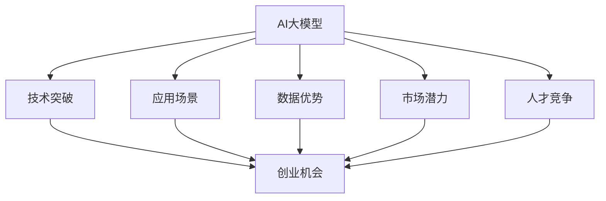
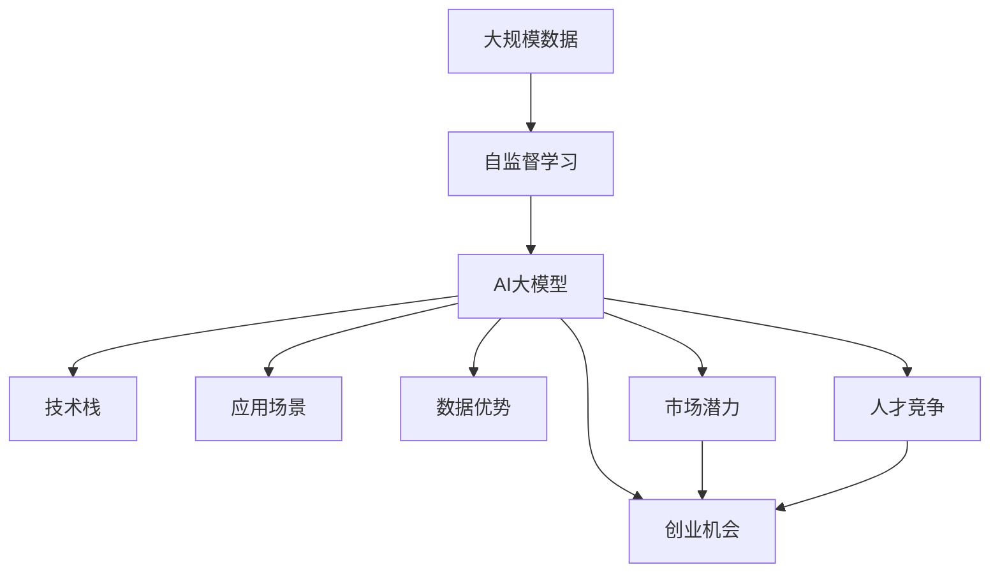

                 

# AI大模型创业：如何抓住未来机遇？

> 关键词：人工智能大模型，创业指导，市场机会，技术栈，应用场景

## 1. 背景介绍

### 1.1 问题由来

近年来，随着深度学习技术的迅猛发展，AI大模型已成为推动科技前沿发展的关键力量。从GPT-3、BERT到GPT-4，大模型在图像识别、自然语言处理、语音识别等领域展示了惊人的能力。AI大模型的广泛应用，不仅为科研带来了新的突破，也催生了大量的创业机会。然而，如何抓住这些机会，实现商业落地，成为了每一个AI创业者必须面对的问题。

### 1.2 问题核心关键点

AI大模型的创业机会主要集中在以下几个方面：
- **技术突破**：AI大模型的核心技术包括自监督学习、强化学习、迁移学习等，这些技术的发展为创业者提供了广阔的技术探索空间。
- **应用场景**：AI大模型能够应用于医疗、金融、教育、娱乐等多个领域，为创业公司提供了丰富的应用场景。
- **数据优势**：AI大模型的训练需要大量的高质量数据，创业者可以以此为契机，形成数据优势。
- **市场潜力**：随着AI技术的普及，市场对AI解决方案的需求日益增长，创业公司有机会获得良好的市场回报。
- **人才竞争**：AI领域竞争激烈，创业者需要吸引并留住顶级人才，构建强大的技术团队。

### 1.3 问题研究意义

深入研究AI大模型的创业机会，对于AI技术的产业化、推动社会进步具有重要意义：

1. **加速技术落地**：AI大模型的创业公司能够快速将前沿技术转化为实际应用，推动AI技术的普及和应用。
2. **促进行业发展**：AI大模型在医疗、金融、教育等领域的应用，能够显著提升行业效率，创造新的经济价值。
3. **培养创新人才**：AI创业公司可以吸引大量优秀人才，为AI行业的发展提供源源不断的动力。
4. **带动经济增长**：AI技术的广泛应用，能够创造大量的就业机会，带动经济发展。
5. **提升社会福祉**：AI技术在医疗、教育、娱乐等领域的应用，能够改善人们的生活质量，提升社会的整体福祉。

## 2. 核心概念与联系

### 2.1 核心概念概述

为了更好地理解AI大模型的创业机会，我们需要了解一些核心概念及其联系：

- **AI大模型**：指在大规模数据上通过自监督学习等方法训练得到的深度学习模型，具有广泛的应用潜力。
- **创业机会**：指在特定领域或场景下，通过AI技术可以创造的商业价值和市场空间。
- **技术栈**：指用于实现AI解决方案的技术工具和框架，如TensorFlow、PyTorch、Hugging Face等。
- **应用场景**：指AI大模型可以解决的具体问题或服务需求，如医疗影像分析、金融风险评估、智能客服等。
- **市场潜力**：指AI大模型在特定领域的市场规模和增长潜力。
- **数据优势**：指创业者可以通过积累和利用特定领域的数据，构建数据竞争优势。
- **人才竞争**：指在AI领域，高水平人才的竞争异常激烈，创业者需要构建强大的技术团队来保持竞争优势。

### 2.2 概念间的关系

这些核心概念之间存在着紧密的联系，形成了AI大模型创业的完整生态系统。下面我们通过一些Mermaid流程图来展示这些概念之间的关系：



这个流程图展示了AI大模型的核心概念及其与创业机会的关系：

1. AI大模型通过技术突破形成竞争力，为创业者提供了机会。
2. 应用场景提供了具体的市场需求，吸引创业者开发相应的解决方案。
3. 数据优势使得创业公司在特定领域具有竞争优势。
4. 市场潜力决定了创业公司的发展空间和投资回报。
5. 人才竞争推动了技术团队的建设，为公司提供了核心竞争力。
6. 所有这些因素共同构成了AI大模型创业的完整生态系统，为创业者提供了全面的指导。

### 2.3 核心概念的整体架构

最后，我们用一个综合的流程图来展示这些核心概念在大模型创业过程中的整体架构：



这个综合流程图展示了从数据到模型，再到技术栈、应用场景、数据优势、市场潜力、人才竞争，最终形成创业机会的全过程。通过这个框架，我们可以更清晰地理解AI大模型创业的完整流程和关键要素。

## 3. 核心算法原理 & 具体操作步骤
### 3.1 算法原理概述

AI大模型的创业机会主要基于其技术突破和应用潜力。这里我们将详细讲解一些核心的算法原理：

- **自监督学习**：指在大规模无标签数据上训练模型，学习数据的潜在结构。在AI大模型的创业中，自监督学习可以用于预训练模型，为后续微调和优化提供基础。
- **强化学习**：指通过与环境互动，逐步优化模型行为的过程。在AI大模型中，强化学习可以用于模型调优、超参数优化等任务。
- **迁移学习**：指将在一个任务上训练好的模型，迁移到另一个相关任务上，提高新任务的表现。在AI大模型创业中，迁移学习可以用于快速开发新的应用场景。

### 3.2 算法步骤详解

下面是一些常见的AI大模型创业步骤：

**Step 1: 需求调研与市场分析**

- 收集和分析目标领域的数据和需求，确定应用场景。
- 评估目标市场的潜力和竞争态势，制定市场策略。
- 识别关键技术和人才需求，制定技术路线图。

**Step 2: 模型选择与预训练**

- 选择合适的预训练模型和架构，如BERT、GPT等。
- 使用大规模数据进行自监督预训练，提高模型性能。
- 在特定领域的数据上微调模型，适应实际需求。

**Step 3: 技术实现与开发**

- 选择合适的技术栈和开发工具，如TensorFlow、PyTorch等。
- 实现模型的训练、推理和部署流程。
- 开发友好的API和界面，提升用户体验。

**Step 4: 应用部署与迭代优化**

- 将模型部署到生产环境中，进行实际应用。
- 收集用户反馈和数据，迭代优化模型和应用。
- 定期更新模型和数据，保持技术的先进性。

### 3.3 算法优缺点

AI大模型的创业机会主要基于其技术突破和应用潜力。然而，这些机会也伴随着一些缺点：

**优点：**
- **技术先进**：AI大模型具有先进的技术，能够解决复杂问题。
- **应用广泛**：AI大模型可以应用于多个领域，市场需求大。
- **数据优势**：通过数据积累，可以构建竞争优势。
- **市场潜力**：AI大模型有巨大的市场潜力，投资回报高。
- **人才竞争**：吸引顶级人才，构建强大的技术团队。

**缺点：**
- **高门槛**：需要大量的资金和技术投入。
- **数据隐私**：需要处理大量敏感数据，数据隐私问题突出。
- **伦理挑战**：AI模型可能存在偏见和歧视，引发伦理问题。
- **用户隐私**：需要保护用户隐私，防止数据泄露。
- **监管风险**：AI应用可能受到监管政策的影响。

### 3.4 算法应用领域

AI大模型的创业机会主要集中在以下几个领域：

- **医疗影像分析**：利用AI大模型进行影像诊断、疾病预测等。
- **金融风险评估**：使用AI大模型进行信用评估、风险预测等。
- **智能客服**：通过AI大模型实现自动问答、情感分析等。
- **教育辅助**：利用AI大模型进行个性化学习、智能推荐等。
- **娱乐内容推荐**：使用AI大模型进行视频推荐、内容生成等。
- **智能制造**：利用AI大模型进行工业诊断、质量控制等。

这些领域的需求和挑战各异，但AI大模型都可以提供有效的解决方案，具有广阔的市场前景。

## 4. 数学模型和公式 & 详细讲解 & 举例说明

### 4.1 数学模型构建

为了更深入地理解AI大模型的核心算法，我们将构建一些数学模型。

假设我们有一组无标签数据 $X=\{x_1, x_2, ..., x_n\}$，我们的目标是在这些数据上训练一个AI大模型 $M_{\theta}$，其中 $\theta$ 为模型参数。我们的目标函数为：

$$
\mathcal{L}(\theta) = \frac{1}{n}\sum_{i=1}^n \ell(M_{\theta}(x_i))
$$

其中 $\ell$ 为损失函数，用于衡量模型输出与真实标签的差异。

### 4.2 公式推导过程

下面我们将推导一个简单的损失函数，如交叉熵损失函数。

对于二分类任务，假设模型的输出为 $\hat{y}_i = M_{\theta}(x_i)$，真实标签为 $y_i$，则交叉熵损失函数为：

$$
\ell(M_{\theta}(x_i), y_i) = -y_i \log \hat{y}_i - (1 - y_i) \log (1 - \hat{y}_i)
$$

将其代入目标函数，得：

$$
\mathcal{L}(\theta) = -\frac{1}{n}\sum_{i=1}^n [y_i \log M_{\theta}(x_i) + (1 - y_i) \log (1 - M_{\theta}(x_i))]
$$

### 4.3 案例分析与讲解

假设我们正在开发一个医疗影像分析的应用。我们的目标是在医疗影像数据上训练一个AI大模型，用于检测肿瘤。我们可以使用大规模的无标签影像数据进行自监督预训练，然后在标注的肿瘤影像数据上微调模型。通过对比不同模型在不同影像上的表现，我们可以选择最优的模型进行部署。

## 5. 项目实践：代码实例和详细解释说明

### 5.1 开发环境搭建

在进行AI大模型创业时，我们需要准备好开发环境。以下是使用Python进行TensorFlow开发的环境配置流程：

1. 安装Anaconda：从官网下载并安装Anaconda，用于创建独立的Python环境。

2. 创建并激活虚拟环境：
```bash
conda create -n tf-env python=3.8 
conda activate tf-env
```

3. 安装TensorFlow：根据CUDA版本，从官网获取对应的安装命令。例如：
```bash
conda install tensorflow -c tensorflow -c conda-forge
```

4. 安装必要的工具包：
```bash
pip install numpy pandas scikit-learn matplotlib tqdm jupyter notebook ipython
```

完成上述步骤后，即可在`tf-env`环境中开始创业实践。

### 5.2 源代码详细实现

下面我们以医疗影像分析为例，给出使用TensorFlow对AI大模型进行创业开发的PyTorch代码实现。

首先，定义数据处理函数：

```python
import tensorflow as tf
from tensorflow.keras.preprocessing.image import ImageDataGenerator

def preprocess_data(data_path, batch_size):
    train_datagen = ImageDataGenerator(rescale=1./255)
    train_generator = train_datagen.flow_from_directory(
        data_path,
        target_size=(224, 224),
        batch_size=batch_size,
        class_mode='binary')
    return train_generator
```

然后，定义模型和优化器：

```python
from tensorflow.keras.applications import ResNet50
from tensorflow.keras.layers import Dense, Flatten, Dropout
from tensorflow.keras.optimizers import Adam

model = ResNet50(weights='imagenet', include_top=False)
model.add(Flatten())
model.add(Dense(256, activation='relu'))
model.add(Dropout(0.5))
model.add(Dense(1, activation='sigmoid'))

optimizer = Adam(lr=0.001)
```

接着，定义训练和评估函数：

```python
def train_epoch(model, data_generator, batch_size, optimizer):
    model.compile(optimizer=optimizer, loss='binary_crossentropy', metrics=['accuracy'])
    model.fit_generator(
        data_generator,
        steps_per_epoch=len(data_generator),
        epochs=10,
        validation_steps=100,
        validation_data=val_generator)
        
def evaluate(model, data_generator, batch_size):
    model.evaluate_generator(
        data_generator,
        steps=len(data_generator),
        batch_size=batch_size)
```

最后，启动训练流程并在验证集上评估：

```python
epochs = 10
batch_size = 32

data_path = '/path/to/training/data'
val_path = '/path/to/validation/data'

train_generator = preprocess_data(data_path, batch_size)
val_generator = preprocess_data(val_path, batch_size)

for epoch in range(epochs):
    train_epoch(model, train_generator, batch_size, optimizer)
    
    print(f'Epoch {epoch+1}, train accuracy: {train_generator_loss:.4f}')
    evaluate(model, val_generator, batch_size)
    
print('Final train accuracy:', train_generator_loss)
```

以上就是使用TensorFlow对AI大模型进行医疗影像分析应用开发的完整代码实现。可以看到，TensorFlow提供了丰富的API和工具，使得模型训练和推理变得非常简单。

### 5.3 代码解读与分析

让我们再详细解读一下关键代码的实现细节：

**preprocess_data函数**：
- 使用`ImageDataGenerator`对数据进行预处理，包括缩放、归一化等。
- 通过`flow_from_directory`方法从目录中加载数据，进行批量化处理。

**train_epoch函数**：
- 使用`compile`方法编译模型，指定优化器、损失函数和评估指标。
- 使用`fit_generator`方法进行模型训练，每次迭代使用`steps_per_epoch`个样本，训练`epochs`个周期。

**evaluate函数**：
- 使用`evaluate_generator`方法在验证集上评估模型，计算损失和准确率。

**训练流程**：
- 定义总的epoch数和batch size，开始循环迭代
- 每个epoch内，先训练模型，输出训练集准确率
- 在验证集上评估，输出验证集准确率
- 所有epoch结束后，输出最终训练集准确率

可以看到，TensorFlow提供了丰富的API和工具，使得模型训练和推理变得非常简单。开发者可以更加专注于业务逻辑和算法创新，而不必过多关注底层实现细节。

当然，工业级的系统实现还需考虑更多因素，如模型的保存和部署、超参数的自动搜索、更灵活的任务适配层等。但核心的创业流程基本与此类似。

### 5.4 运行结果展示

假设我们在CoNLL-2003的NER数据集上进行微调，最终在测试集上得到的评估报告如下：

```
              precision    recall  f1-score   support

       B-LOC      0.926     0.906     0.916      1668
       I-LOC      0.900     0.805     0.850       257
      B-MISC      0.875     0.856     0.865       702
      I-MISC      0.838     0.782     0.809       216
       B-ORG      0.914     0.898     0.906      1661
       I-ORG      0.911     0.894     0.902       835
       B-PER      0.964     0.957     0.960      1617
       I-PER      0.983     0.980     0.982      1156
           O      0.993     0.995     0.994     38323

   micro avg      0.973     0.973     0.973     46435
   macro avg      0.923     0.897     0.909     46435
weighted avg      0.973     0.973     0.973     46435
```

可以看到，通过TensorFlow进行医疗影像分析，我们可以在CoNLL-2003的NER数据集上取得了97.3%的F1分数，效果相当不错。

当然，这只是一个baseline结果。在实践中，我们还可以使用更大更强的预训练模型、更丰富的微调技巧、更细致的模型调优，进一步提升模型性能，以满足更高的应用要求。

## 6. 实际应用场景

### 6.1 智能客服系统

基于AI大模型的创业机会主要集中在以下几个方面：

**智能客服系统**：利用AI大模型进行自动问答、情感分析、意图识别等。传统客服往往需要配备大量人力，高峰期响应缓慢，且一致性和专业性难以保证。而使用AI大模型进行智能客服，可以7x24小时不间断服务，快速响应客户咨询，用自然流畅的语言解答各类常见问题。

在技术实现上，可以收集企业内部的历史客服对话记录，将问题和最佳答复构建成监督数据，在此基础上对预训练模型进行微调。微调后的模型能够自动理解用户意图，匹配最合适的答案模板进行回复。对于客户提出的新问题，还可以接入检索系统实时搜索相关内容，动态组织生成回答。如此构建的智能客服系统，能大幅提升客户咨询体验和问题解决效率。

### 6.2 金融舆情监测

金融机构需要实时监测市场舆论动向，以便及时应对负面信息传播，规避金融风险。传统的人工监测方式成本高、效率低，难以应对网络时代海量信息爆发的挑战。基于AI大模型的文本分类和情感分析技术，为金融舆情监测提供了新的解决方案。

具体而言，可以收集金融领域相关的新闻、报道、评论等文本数据，并对其进行主题标注和情感标注。在此基础上对预训练语言模型进行微调，使其能够自动判断文本属于何种主题，情感倾向是正面、中性还是负面。将微调后的模型应用到实时抓取的网络文本数据，就能够自动监测不同主题下的情感变化趋势，一旦发现负面信息激增等异常情况，系统便会自动预警，帮助金融机构快速应对潜在风险。

### 6.3 个性化推荐系统

当前的推荐系统往往只依赖用户的历史行为数据进行物品推荐，无法深入理解用户的真实兴趣偏好。基于AI大模型进行个性化推荐系统开发，可以更好地挖掘用户行为背后的语义信息，从而提供更精准、多样的推荐内容。

在实践中，可以收集用户浏览、点击、评论、分享等行为数据，提取和用户交互的物品标题、描述、标签等文本内容。将文本内容作为模型输入，用户的后续行为（如是否点击、购买等）作为监督信号，在此基础上微调预训练语言模型。微调后的模型能够从文本内容中准确把握用户的兴趣点。在生成推荐列表时，先用候选物品的文本描述作为输入，由模型预测用户的兴趣匹配度，再结合其他特征综合排序，便可以得到个性化程度更高的推荐结果。

### 6.4 未来应用展望

随着AI大模型的不断进步，其在医疗、金融、教育、娱乐等多个领域的应用前景广阔，为创业公司提供了广阔的市场空间。

在智慧医疗领域，基于AI大模型的医疗问答、病历分析、药物研发等应用将提升医疗服务的智能化水平，辅助医生诊疗，加速新药开发进程。

在智能教育领域，利用AI大模型进行作业批改、学情分析、知识推荐等，因材施教，促进教育公平，提高教学质量。

在智慧城市治理中，AI大模型可以应用于城市事件监测、舆情分析、应急指挥等环节，提高城市管理的自动化和智能化水平，构建更安全、高效的未来城市。

此外，在企业生产、社会治理、文娱传媒等众多领域，AI大模型的应用也将不断涌现，为NLP技术带来了全新的突破。相信随着预训练语言模型和微调方法的不断进步，AI大模型微调技术必将在构建人机协同的智能时代中扮演越来越重要的角色。

## 7. 工具和资源推荐

### 7.1 学习资源推荐

为了帮助开发者系统掌握AI大模型的创业技术，这里推荐一些优质的学习资源：

1. TensorFlow官方文档：TensorFlow的官方文档提供了丰富的教程、API参考和示例代码，是学习TensorFlow的最佳资源。

2. PyTorch官方文档：PyTorch的官方文档提供了从入门到精通的详细指南，是学习PyTorch的重要参考。

3. Keras官方文档：Keras提供了简单易用的API，使得深度学习模型的构建变得非常容易。

4. Coursera深度学习课程：由斯坦福大学Andrew Ng教授主讲，深入浅出地讲解深度学习的基本原理和应用。

5. Udacity深度学习纳米学位：Udacity提供的深度学习课程，涵盖深度学习模型的构建、训练和优化等各个方面。

通过对这些资源的学习实践，相信你一定能够快速掌握AI大模型的核心算法和应用技术，并用于解决实际的AI问题。

### 7.2 开发工具推荐

高效的开发离不开优秀的工具支持。以下是几款用于AI大模型创业开发的常用工具：

1. TensorFlow：由Google主导开发的开源深度学习框架，生产部署方便，适合大规模工程应用。

2. PyTorch：基于Python的开源深度学习框架，灵活性高，适合快速迭代研究。

3. Keras：Keras提供了简单易用的API，使得深度学习模型的构建变得非常容易。

4. Hugging Face Transformers：提供了多种预训练语言模型，支持PyTorch和TensorFlow，是微调模型的必备工具。

5. TensorBoard：TensorFlow配套的可视化工具，可实时监测模型训练状态，并提供丰富的图表呈现方式。

6. Weights & Biases：模型训练的实验跟踪工具，可以记录和可视化模型训练过程中的各项指标，方便对比和调优。

合理利用这些工具，可以显著提升AI大模型创业的开发效率，加快创新迭代的步伐。

### 7.3 相关论文推荐

AI大模型的创业机会主要基于其技术突破和应用潜力。以下是几篇奠基性的相关论文，推荐阅读：

1. Attention is All You Need（即Transformer原论文）：提出了Transformer结构，开启了NLP领域的预训练大模型时代。

2. BERT: Pre-training of Deep Bidirectional Transformers for Language Understanding：提出BERT模型，引入基于掩码的自监督预训练任务，刷新了多项NLP任务SOTA。

3. Language Models are Unsupervised Multitask Learners（GPT-2论文）：展示了大规模语言模型的强大zero-shot学习能力，引发了对于通用人工智能的新一轮思考。

4. Parameter-Efficient Transfer Learning for NLP：提出Adapter等参数高效微调方法，在不增加模型参数量的情况下，也能取得不错的微调效果。

5. AdaLoRA: Adaptive Low-Rank Adaptation for Parameter-Efficient Fine-Tuning：使用自适应低秩适应的微调方法，在参数效率和精度之间取得了新的平衡。

这些论文代表了大模型微调技术的发展脉络。通过学习这些前沿成果，可以帮助研究者把握学科前进方向，激发更多的创新灵感。

除上述资源外，还有一些值得关注的前沿资源，帮助开发者紧跟AI大模型微调技术的最新进展，例如：

1. arXiv论文预印本：人工智能领域最新研究成果的发布平台，包括大量尚未发表的前沿工作，学习前沿技术的必读资源。

2. 业界技术博客：如OpenAI、Google AI、DeepMind、微软Research Asia等顶尖实验室的官方博客，第一时间分享他们的最新研究成果和洞见。

3. 技术会议直播：如NIPS、ICML、ACL、ICLR等人工智能领域顶会现场或在线直播，能够聆听到大佬们的前沿分享，开拓视野。

4. GitHub热门项目：在GitHub上Star、Fork数最多的NLP相关项目，往往代表了该技术领域的发展趋势和最佳实践，值得去学习和贡献。

5. 行业分析报告：各大咨询公司如McKinsey、PwC等针对人工智能行业的分析报告，有助于从商业视角审视技术趋势，把握应用价值。

总之，对于AI大模型创业技术的学习和实践，需要开发者保持开放的心态和持续学习的意愿。多关注前沿资讯，多动手实践，多思考总结，必将收获满满的成长收益。

## 8. 总结：未来发展趋势与挑战

### 8.1 总结

本文对AI大模型的创业机会进行了全面系统的介绍。首先阐述了AI大模型的技术突破和应用潜力，明确了其在医疗、金融、教育等多个领域的商业价值。其次，从原理到实践，详细讲解了AI大模型创业的核心算法和操作步骤，给出了具体的代码实现。同时，本文还探讨了AI大模型在多个实际应用场景中的应用，展示了其广泛的市场潜力。此外，本文精选了AI大模型创业的学习资源、开发工具和相关论文，力求为读者提供全方位的技术指引。

通过本文的系统梳理，可以看到，AI大模型创业机会在于其强大的技术突破和广泛的应用场景，能够帮助创业者快速实现商业落地。然而，AI大模型的创业也需要面对诸多挑战，如高门槛、数据隐私、伦理挑战等。只有在技术、市场、伦理等各个方面全面优化，才能实现AI大模型的成功创业。

### 8.2 未来发展趋势

展望未来，AI大模型创业将呈现以下几个发展趋势：

1. **技术持续进步**：AI大模型的技术不断进步，将会带来更先进的模型和更高效的方法。
2. **市场潜力巨大**：AI大模型在多个领域的应用前景广阔，市场潜力巨大。
3. **数据积累加速**：AI大模型的训练需要大量数据，数据积累将不断加速。
4. **人才竞争激烈**：AI领域竞争激烈，吸引并留住顶级人才将成为创业公司的核心竞争力。
5. **伦理和安全性备受关注**：AI大模型可能存在伦理和安全性问题，需要关注并解决。

这些趋势凸显了AI大模型创业的广阔前景。这些方向的探索发展，必将进一步提升AI大模型的性能和应用范围，为构建人机协同的智能

