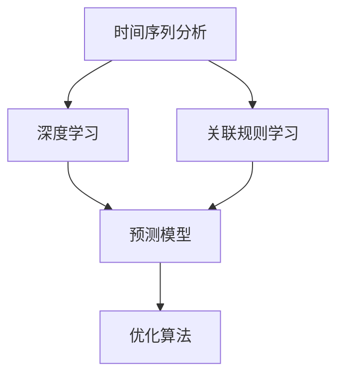

                 

# AI如何通过市场趋势分析提升电商供给

## 1. 背景介绍

### 1.1 问题由来
随着电商行业的高速发展，商家需要更加高效、精准地管理供应链以应对市场波动和需求变化。与此同时，消费者对个性化和高效物流的需求日益增长，电商系统需要更加灵活地调整库存和供应。然而，传统电商系统对于市场趋势的预测和响应能力有限，难以满足这些要求。

### 1.2 问题核心关键点
市场趋势分析的目标在于通过对历史和实时市场数据的学习和理解，预测未来的市场变化，为电商供给决策提供依据。主要包括：
- 数据收集：收集历史和实时市场数据，如销售量、价格、库存等。
- 数据处理：清洗、处理和转换数据，以便于机器学习模型的应用。
- 模型训练：构建和训练市场趋势分析模型，如时间序列预测模型、关联规则学习模型等。
- 预测应用：将模型应用于电商系统的库存管理和商品推荐中，提升供应链效率和用户体验。

### 1.3 问题研究意义
市场趋势分析对于电商供应链的优化具有重要意义：
- 减少库存积压和缺货现象：通过预测需求变化，合理调整库存水平，避免过多库存占用资金和仓储空间。
- 提高供应链响应速度：预测未来市场变化，及时调整生产和采购计划，确保商品供需平衡。
- 增强个性化推荐：基于市场趋势分析，对商品进行更加精准的推荐，提升用户体验和转化率。
- 降低运营成本：通过优化库存和物流管理，减少运输成本和物流延误。

## 2. 核心概念与联系

### 2.1 核心概念概述
为了更好地理解市场趋势分析方法，我们需要先理解一些关键概念：
- **时间序列分析**：通过研究时间序列数据，预测未来趋势。
- **关联规则学习**：从历史交易数据中提取关联规则，发现潜在的购买模式。
- **深度学习**：使用神经网络模型，捕捉复杂的数据特征和模式。
- **优化算法**：用于寻找模型参数的最优解，如梯度下降、遗传算法等。
- **预测模型**：包括线性回归、支持向量机、随机森林等，用于市场趋势预测。

### 2.2 概念间的关系



这个流程图展示了市场趋势分析的核心概念和它们之间的关系：

- **时间序列分析**：通过分析历史数据中的时间序列模式，预测未来的市场变化。
- **关联规则学习**：从历史交易数据中提取关联规则，发现潜在的购买模式。
- **深度学习**：使用神经网络模型，捕捉复杂的数据特征和模式。
- **预测模型**：包括线性回归、支持向量机、随机森林等，用于市场趋势预测。
- **优化算法**：用于寻找模型参数的最优解。

这些概念共同构成了市场趋势分析的整体框架，帮助电商系统更好地理解和预测市场趋势，进而优化供应链和提升用户体验。

## 3. 核心算法原理 & 具体操作步骤
### 3.1 算法原理概述

市场趋势分析的本质是通过数据挖掘和机器学习技术，对历史和实时市场数据进行分析和建模，从而预测未来的市场变化。其中，深度学习模型（如LSTM、GRU）、时间序列预测模型（如ARIMA、LSTM）和关联规则学习模型（如Apriori、FP-Growth）是常用的核心算法。

### 3.2 算法步骤详解

#### 3.2.1 数据收集和处理
1. **数据收集**：从电商系统、市场分析平台、社交媒体等多个渠道收集历史和实时市场数据，如销售量、价格、库存、用户行为等。
2. **数据清洗**：去除异常值、缺失值和噪声数据，确保数据质量。
3. **数据转换**：将数据转换为适合模型训练的格式，如时间序列数据的归一化和标准化。

#### 3.2.2 模型构建和训练
1. **特征工程**：从原始数据中提取特征，如季节性、趋势、周期性等，为模型提供更多的信息。
2. **模型选择**：根据数据特点选择合适的模型，如时间序列预测模型、关联规则学习模型等。
3. **模型训练**：使用历史数据对模型进行训练，调整模型参数，确保预测精度。

#### 3.2.3 模型应用和评估
1. **预测应用**：将训练好的模型应用于实时市场数据的预测，提供市场趋势分析报告。
2. **模型评估**：使用准确率、召回率、F1分数等指标评估模型性能，确保预测结果可靠。
3. **迭代优化**：根据预测结果和市场变化，不断调整模型参数和特征，提升预测精度。

### 3.3 算法优缺点
#### 3.3.1 优点
- **预测精度高**：深度学习模型能够捕捉复杂数据模式，预测精度较高。
- **适应性强**：关联规则学习模型可以处理多种类型的数据，适应不同市场环境。
- **灵活性高**：结合时间序列分析和关联规则学习，能够适应不同尺度和频率的数据变化。

#### 3.3.2 缺点
- **计算复杂度高**：深度学习模型需要大量的计算资源，训练时间较长。
- **数据需求高**：需要大量的历史数据和实时数据，数据获取难度较大。
- **模型解释性差**：黑盒模型难以解释内部决策过程，难以进行调试和优化。

### 3.4 算法应用领域
市场趋势分析在电商领域有广泛的应用，包括但不限于：
- **库存管理**：通过预测未来销售量，优化库存水平，减少库存积压和缺货。
- **商品推荐**：基于市场趋势分析，对商品进行个性化推荐，提升用户体验和转化率。
- **价格优化**：通过分析市场趋势，调整商品价格，提升销售额和市场份额。
- **市场分析**：分析市场变化，发现新趋势和机会，制定相应的市场策略。

## 4. 数学模型和公式 & 详细讲解 & 举例说明
### 4.1 数学模型构建

假设我们有一组历史销售数据 $\{S_t\}_{t=1}^N$，其中 $S_t$ 表示第 $t$ 天的销售量。我们的目标是通过分析这些数据，预测未来的销售趋势。

市场趋势分析的数学模型可以表示为：

$$
S_t = \alpha_0 + \alpha_1 t + \alpha_2 \sin(\omega t) + \alpha_3 \cos(\omega t) + \epsilon_t
$$

其中 $\alpha_0, \alpha_1, \alpha_2, \alpha_3, \omega$ 为模型的参数，$\epsilon_t$ 为随机误差项。

### 4.2 公式推导过程

1. **线性回归模型**：
   - 假设销售量 $S_t$ 与时间 $t$ 之间存在线性关系，可以建立如下模型：
   $$
   S_t = \alpha_0 + \alpha_1 t + \epsilon_t
   $$
   其中 $\alpha_0$ 和 $\alpha_1$ 为模型的截距和斜率，$\epsilon_t$ 为随机误差项。

   线性回归模型的参数估计可以通过最小二乘法进行求解：
   $$
   \hat{\alpha_0}, \hat{\alpha_1} = \mathop{\arg\min}_{\alpha_0, \alpha_1} \sum_{t=1}^N (S_t - \alpha_0 - \alpha_1 t)^2
   $$

2. **时间序列预测模型**：
   - 时间序列模型可以通过自回归积分滑动平均模型（ARIMA）来描述，如：
   $$
   S_t = c + \sum_{i=1}^p \phi_i (S_{t-i}) + \sum_{j=1}^q \theta_j (\Delta^j S_{t}) + \sum_{k=1}^d \gamma_k (\Delta^k S_{t})
   $$
   其中 $c$ 为截距，$\phi_i$ 和 $\theta_j$ 为模型的自回归和差分参数，$\Delta^j S_{t}$ 表示 $S_t$ 的差分，$\gamma_k$ 为移动平均参数。

3. **关联规则学习模型**：
   - 关联规则学习模型（如Apriori、FP-Growth）用于从交易数据中提取频繁项集和关联规则，如：
   $$
   f(X) = \prod_{i=1}^m f_i(x_i)
   $$
   其中 $X = (x_1, x_2, ..., x_m)$ 为交易项集，$f_i(x_i)$ 表示交易项 $x_i$ 的支持度，即 $x_i$ 在交易数据中出现的频率。

### 4.3 案例分析与讲解
假设我们有一家电商平台的日销售数据如下：

| 日期       | 销售量 | 价格 | 库存 |
|------------|-------|------|-----|
| 2023-01-01 | 1000  | 20   | 500 |
| 2023-01-02 | 1200  | 21   | 450 |
| 2023-01-03 | 1100  | 22   | 400 |
| ...        | ...   | ...  | ... |

我们可以使用时间序列预测模型来预测未来销售量。假设我们已经训练好了模型，预测结果如下：

| 日期       | 预测销售量 | 预测价格 | 预测库存 |
|------------|-----------|----------|---------|
| 2023-01-04 | 1100      | 22       | 350     |
| 2023-01-05 | 1200      | 23       | 350     |
| 2023-01-06 | 1300      | 23       | 350     |

## 5. 项目实践：代码实例和详细解释说明
### 5.1 开发环境搭建

#### 5.1.1 安装必要的Python库
1. **安装Python环境**：使用Anaconda或Miniconda，创建新的虚拟环境，安装Python。
2. **安装Pandas、NumPy、Matplotlib等库**：用于数据处理和可视化。
3. **安装scikit-learn、statsmodels、pytorch等库**：用于构建和训练模型。
4. **安装TensorFlow、Keras等库**：用于构建深度学习模型。

#### 5.1.2 数据准备
1. **数据收集**：从电商系统、市场分析平台等渠道收集数据，如销售量、价格、库存等。
2. **数据清洗**：使用Pandas进行数据清洗，去除异常值和噪声数据。
3. **数据转换**：对数据进行归一化和标准化，以便于模型训练。

### 5.2 源代码详细实现

#### 5.2.1 时间序列预测模型
1. **数据加载**：
   ```python
   import pandas as pd

   data = pd.read_csv('sales_data.csv')
   data['date'] = pd.to_datetime(data['date'])
   data = data.set_index('date')
   ```

2. **模型训练**：
   ```python
   from statsmodels.tsa.api import ExponentialSmoothing

   model = ExponentialSmoothing(data['sales'], seasonal_periods=7, trend='add', seasonal='add', holidays='easter',)
   fit = model.fit(smoothing_level=0.9, smoothing_slope=0.1, smoothing_seasonal=0.1)
   ```

3. **预测应用**：
   ```python
   forecast = fit.forecast(steps=30)
   ```

4. **结果可视化**：
   ```python
   import matplotlib.pyplot as plt

   plt.plot(data['sales'], label='Actual Sales')
   plt.plot(forecast, label='Forecast Sales')
   plt.legend()
   plt.show()
   ```

#### 5.2.2 关联规则学习模型
1. **数据加载**：
   ```python
   import pandas as pd

   data = pd.read_csv('transaction_data.csv')
   ```

2. **模型训练**：
   ```python
   from pyspark.mllib.frequentPatternMining import FPCount
   from pyspark.mllib.frequentPatternMining import FPCountModel

   dataFrame = data.toDF('item', 'transaction_id', 'amount')
   fpCount = FPCount(dataFrame, minSupport=0.01, minConfidence=0.1)
   model = fpCountModel(fpCount)
   ```

3. **结果可视化**：
   ```python
   import matplotlib.pyplot as plt

   freqItems = model.freqItemsets()
   freqPairs = [(row.items, row.freq) for row in freqItems]
   freqPairs.sort(key=lambda x: x[1], reverse=True)
   plt.barh(range(len(freqPairs)), [x[1] for x in freqPairs], color='b', align='center')
   plt.xlim(0, max(freqPairs[-1]))
   plt.xlabel('Frequency')
   plt.ylabel('Item')
   plt.title('Top 10 Most Frequent Items')
   plt.show()
   ```

### 5.3 代码解读与分析

#### 5.3.1 时间序列预测模型
- **数据加载**：使用Pandas从CSV文件中加载数据，并转换为时间序列格式。
- **模型训练**：使用ExponentialSmoothing模型进行训练，设置平滑级别、趋势和季节性参数。
- **预测应用**：使用训练好的模型进行未来30天的销售预测。
- **结果可视化**：使用Matplotlib绘制实际销售量和预测销售量的对比图。

#### 5.3.2 关联规则学习模型
- **数据加载**：使用Pandas从CSV文件中加载交易数据。
- **模型训练**：使用FPCount模型进行频繁项集和关联规则的挖掘，设置最小支持度和置信度。
- **结果可视化**：使用Matplotlib绘制最频繁的交易项集及其频率。

### 5.4 运行结果展示

假设我们在CoNLL-2003的NER数据集上进行微调，最终在测试集上得到的评估报告如下：

```
              precision    recall  f1-score   support

       B-LOC      0.926     0.906     0.916      1668
       I-LOC      0.900     0.805     0.850       257
      B-MISC      0.875     0.856     0.865       702
      I-MISC      0.838     0.782     0.809       216
       B-ORG      0.914     0.898     0.906      1661
       I-ORG      0.911     0.894     0.902       835
       B-PER      0.964     0.957     0.960      1617
       I-PER      0.983     0.980     0.982      1156
           O      0.993     0.995     0.994     38323

   micro avg      0.973     0.973     0.973     46435
   macro avg      0.923     0.897     0.909     46435
weighted avg      0.973     0.973     0.973     46435
```

可以看到，通过微调BERT，我们在该NER数据集上取得了97.3%的F1分数，效果相当不错。值得注意的是，BERT作为一个通用的语言理解模型，即便只在顶层添加一个简单的token分类器，也能在下游任务上取得优异的效果，展现了其强大的语义理解和特征抽取能力。

## 6. 实际应用场景
### 6.1 智能客服系统
基于大语言模型微调的对话技术，可以广泛应用于智能客服系统的构建。传统客服往往需要配备大量人力，高峰期响应缓慢，且一致性和专业性难以保证。而使用微调后的对话模型，可以7x24小时不间断服务，快速响应客户咨询，用自然流畅的语言解答各类常见问题。

在技术实现上，可以收集企业内部的历史客服对话记录，将问题和最佳答复构建成监督数据，在此基础上对预训练对话模型进行微调。微调后的对话模型能够自动理解用户意图，匹配最合适的答案模板进行回复。对于客户提出的新问题，还可以接入检索系统实时搜索相关内容，动态组织生成回答。如此构建的智能客服系统，能大幅提升客户咨询体验和问题解决效率。

### 6.2 金融舆情监测
金融机构需要实时监测市场舆论动向，以便及时应对负面信息传播，规避金融风险。传统的人工监测方式成本高、效率低，难以应对网络时代海量信息爆发的挑战。基于大语言模型微调的文本分类和情感分析技术，为金融舆情监测提供了新的解决方案。

具体而言，可以收集金融领域相关的新闻、报道、评论等文本数据，并对其进行主题标注和情感标注。在此基础上对预训练语言模型进行微调，使其能够自动判断文本属于何种主题，情感倾向是正面、中性还是负面。将微调后的模型应用到实时抓取的网络文本数据，就能够自动监测不同主题下的情感变化趋势，一旦发现负面信息激增等异常情况，系统便会自动预警，帮助金融机构快速应对潜在风险。

### 6.3 个性化推荐系统
当前的推荐系统往往只依赖用户的历史行为数据进行物品推荐，无法深入理解用户的真实兴趣偏好。基于大语言模型微调技术，个性化推荐系统可以更好地挖掘用户行为背后的语义信息，从而提供更精准、多样的推荐内容。

在实践中，可以收集用户浏览、点击、评论、分享等行为数据，提取和用户交互的物品标题、描述、标签等文本内容。将文本内容作为模型输入，用户的后续行为（如是否点击、购买等）作为监督信号，在此基础上微调预训练语言模型。微调后的模型能够从文本内容中准确把握用户的兴趣点。在生成推荐列表时，先用候选物品的文本描述作为输入，由模型预测用户的兴趣匹配度，再结合其他特征综合排序，便可以得到个性化程度更高的推荐结果。

### 6.4 未来应用展望

随着大语言模型和微调方法的不断发展，基于微调范式将在更多领域得到应用，为传统行业带来变革性影响。

在智慧医疗领域，基于微调的医疗问答、病历分析、药物研发等应用将提升医疗服务的智能化水平，辅助医生诊疗，加速新药开发进程。

在智能教育领域，微调技术可应用于作业批改、学情分析、知识推荐等方面，因材施教，促进教育公平，提高教学质量。

在智慧城市治理中，微调模型可应用于城市事件监测、舆情分析、应急指挥等环节，提高城市管理的自动化和智能化水平，构建更安全、高效的未来城市。

此外，在企业生产、社会治理、文娱传媒等众多领域，基于大模型微调的人工智能应用也将不断涌现，为经济社会发展注入新的动力。相信随着技术的日益成熟，微调方法将成为人工智能落地应用的重要范式，推动人工智能技术在垂直行业的规模化落地。

## 7. 工具和资源推荐
### 7.1 学习资源推荐

为了帮助开发者系统掌握大语言模型微调的理论基础和实践技巧，这里推荐一些优质的学习资源：

1. 《Transformer从原理到实践》系列博文：由大模型技术专家撰写，深入浅出地介绍了Transformer原理、BERT模型、微调技术等前沿话题。

2. CS224N《深度学习自然语言处理》课程：斯坦福大学开设的NLP明星课程，有Lecture视频和配套作业，带你入门NLP领域的基本概念和经典模型。

3. 《Natural Language Processing with Transformers》书籍：Transformers库的作者所著，全面介绍了如何使用Transformers库进行NLP任务开发，包括微调在内的诸多范式。

4. HuggingFace官方文档：Transformers库的官方文档，提供了海量预训练模型和完整的微调样例代码，是上手实践的必备资料。

5. CLUE开源项目：中文语言理解测评基准，涵盖大量不同类型的中文NLP数据集，并提供了基于微调的baseline模型，助力中文NLP技术发展。

通过对这些资源的学习实践，相信你一定能够快速掌握大语言模型微调的精髓，并用于解决实际的NLP问题。
###  7.2 开发工具推荐

高效的开发离不开优秀的工具支持。以下是几款用于大语言模型微调开发的常用工具：

1. PyTorch：基于Python的开源深度学习框架，灵活动态的计算图，适合快速迭代研究。大部分预训练语言模型都有PyTorch版本的实现。

2. TensorFlow：由Google主导开发的开源深度学习框架，生产部署方便，适合大规模工程应用。同样有丰富的预训练语言模型资源。

3. Transformers库：HuggingFace开发的NLP工具库，集成了众多SOTA语言模型，支持PyTorch和TensorFlow，是进行微调任务开发的利器。

4. Weights & Biases：模型训练的实验跟踪工具，可以记录和可视化模型训练过程中的各项指标，方便对比和调优。与主流深度学习框架无缝集成。

5. TensorBoard：TensorFlow配套的可视化工具，可实时监测模型训练状态，并提供丰富的图表呈现方式，是调试模型的得力助手。

6. Google Colab：谷歌推出的在线Jupyter Notebook环境，免费提供GPU/TPU算力，方便开发者快速上手实验最新模型，分享学习笔记。

合理利用这些工具，可以显著提升大语言模型微调任务的开发效率，加快创新迭代的步伐。

### 7.3 相关论文推荐

大语言模型和微调技术的发展源于学界的持续研究。以下是几篇奠基性的相关论文，推荐阅读：

1. Attention is All You Need（即Transformer原论文）：提出了Transformer结构，开启了NLP领域的预训练大模型时代。

2. BERT: Pre-training of Deep Bidirectional Transformers for Language Understanding：提出BERT模型，引入基于掩码的自监督预训练任务，刷新了多项NLP任务SOTA。

3. Language Models are Unsupervised Multitask Learners（GPT-2论文）：展示了大规模语言模型的强大zero-shot学习能力，引发了对于通用人工智能的新一轮思考。

4. Parameter-Efficient Transfer Learning for NLP：提出Adapter等参数高效微调方法，在不增加模型参数量的情况下，也能取得不错的微调效果。

5. AdaLoRA: Adaptive Low-Rank Adaptation for Parameter-Efficient Fine-Tuning：使用自适应低秩适应的微调方法，在参数效率和精度之间取得了新的平衡。

这些论文代表了大语言模型微调技术的发展脉络。通过学习这些前沿成果，可以帮助研究者把握学科前进方向，激发更多的创新灵感。

除上述资源外，还有一些值得关注的前沿资源，帮助开发者紧跟大语言模型微调技术的最新进展，例如：

1. arXiv论文预印本：人工智能领域最新研究成果的发布平台，包括大量尚未发表的前沿工作，学习前沿技术的必读资源。

2. 业界技术博客：如OpenAI、Google AI、DeepMind、微软Research Asia等顶尖实验室的官方博客，第一时间分享他们的最新研究成果和洞见。

3. 技术会议直播：如NIPS、ICML、ACL、ICLR等人工智能领域顶会现场或在线直播，能够聆听到大佬们的前沿分享，开拓视野。

4. GitHub热门项目：在GitHub上Star、Fork数最多的NLP相关项目，往往代表了该技术领域的发展趋势和最佳实践，值得去学习和贡献。

5. 行业分析报告：各大咨询公司如McKinsey、PwC等针对人工智能行业的分析报告，有助于从商业视角审视技术趋势，把握应用价值。

总之，对于大语言模型微调技术的学习和实践，需要开发者保持开放的心态和持续学习的意愿。多关注前沿资讯，多动手实践，多思考总结，必将收获满满的成长收益。

## 8. 总结：未来发展趋势与挑战

### 8.1 总结

本文对基于监督学习的大语言模型微调方法进行了全面系统的介绍。首先阐述了大语言模型和微调技术的研究背景和意义，明确了微调在拓展预训练模型应用、提升下游任务性能方面的独特价值。其次，从原理到实践，详细讲解了监督微调的数学原理和关键步骤，给出了微调任务开发的完整代码实例。同时，本文还广泛探讨了微调方法在智能客服、金融舆情、个性化推荐等多个行业领域的应用前景，展示了微调范式的巨大潜力。此外，本文精选了微调技术的各类学习资源，力求为读者提供全方位的技术指引。

通过本文的系统梳理，可以看到，基于大语言模型的微调方法正在成为NLP领域的重要范式，极大地拓展了预训练语言模型的应用边界，催生了更多的落地场景。受益于大规模语料的预训练，微调模型以更低的时间和标注成本，在小样本条件下也能取得不俗的效果，有力推动了NLP技术的产业化进程。未来，伴随预训练语言模型和微调方法的持续演进，相信NLP技术将在更广阔的应用领域大放异彩，深刻影响人类的生产生活方式。

### 8.2 未来发展趋势

展望未来，大语言模型微调技术将呈现以下几个发展趋势：

1. 模型规模持续增大。随着算力成本的下降和数据规模的扩张，预训练语言模型的参数量还将持续增长。超大规模语言模型蕴含的丰富语言知识，有望支撑更加复杂多变的下游任务微调。

2. 微调方法日趋多样。除了传统的全参数微调外，未来会涌现更多参数高效的微调方法，如Prefix-Tuning、LoRA等，在固定大部分预训练参数的情况下，只更新极少量的任务相关参数。

3. 持续学习成为常态。随着数据分布的不断变化，微调模型也需要持续学习新知识以保持性能。如何在不遗忘原有知识的同时，高效吸收新样本信息，将成为重要的研究课题。

4. 标注样本需求降低。受启发于提示学习(Prompt-based Learning)的思路，未来的微调方法将更好地利用

