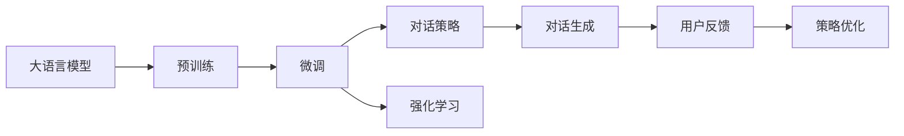

                 

## 1. 背景介绍

在人工智能领域，对话系统因其在自然语言处理(NLP)和用户交互中的应用而备受关注。传统的对话系统依赖于固定的对话策略和模板，难以应对未知情境和复杂场景。相比之下，开领域对话能力允许模型在未知或未见过的话题上自主生成对话，更加灵活和智能。本文将深入探讨AI工具如何实现开领域对话能力，并展示其在实际应用中的广泛前景。

## 2. 核心概念与联系

### 2.1 核心概念概述

为了理解开领域对话能力，首先需要明确几个关键概念：

- **开领域对话**：指模型能够在没有特定对话策略和模板的情况下，自主生成高质量的对话内容。它需要模型具备广泛的知识储备和灵活的逻辑推理能力。
- **大语言模型**：如GPT-3、BERT等，通过大规模无监督学习获取通用语言知识，能够理解复杂的自然语言。
- **预训练与微调**：通过在大规模语料上进行预训练，然后在特定任务上进行微调，提高模型在该任务上的性能。
- **强化学习**：通过与环境的交互，模型不断调整策略以最大化某种奖励函数，用于对话系统中的策略优化。

这些概念共同构成了AI工具实现开领域对话能力的基础。

### 2.2 概念间的关系

这些概念之间的关系可以通过以下Mermaid流程图来展示：



这个流程图展示了从预训练、微调到对话生成的整个过程。大语言模型在预训练阶段学习通用的语言知识，然后通过微调，模型可以适应特定对话任务。对话策略和强化学习用于优化模型在实际对话中的表现。对话生成模块将模型输出转化为自然语言对话，并通过用户反馈进行策略优化。

## 3. 核心算法原理 & 具体操作步骤
### 3.1 算法原理概述

开领域对话能力的实现主要依赖于大语言模型和微调技术。其核心思想是，通过在大规模语料上进行预训练，模型学习到通用的语言知识和对话策略，然后通过微调适应特定对话任务。在微调过程中，模型能够根据上下文自主生成对话，逐步优化对话策略以提高对话质量。

### 3.2 算法步骤详解

实现开领域对话能力的核心算法步骤如下：

1. **准备语料和标注数据**：收集包含对话的文本数据，标注对话的上下文和响应，形成对话数据集。

2. **预训练大语言模型**：使用大规模无监督语料训练大语言模型，使其学习到通用的语言知识。

3. **微调模型**：在对话数据集上进行微调，优化模型在对话任务上的表现。微调过程通常包括对话生成、对话策略优化和用户反馈的循环。

4. **对话生成**：在实际对话场景中，模型根据上下文自主生成对话响应。

5. **策略优化**：通过用户反馈和对话策略，模型不断调整策略以提高对话质量。

6. **持续学习**：随着对话数据集的扩大，模型可以持续学习新的对话知识和策略。

### 3.3 算法优缺点

开领域对话能力具有以下优点：

- **灵活性**：模型能够适应各种对话场景，无需固定对话策略。
- **可扩展性**：只需在特定任务上微调，模型即可拓展到新的对话场景。
- **效率高**：模型在预训练和微调过程中学习到通用知识，能够快速适应新任务。

同时，也存在以下缺点：

- **数据需求大**：需要大量高质量的对话数据，标注工作量大。
- **模型复杂度高**：大语言模型参数量庞大，训练和推理复杂。
- **鲁棒性不足**：在面对异常对话或噪声干扰时，模型容易产生错误的响应。

### 3.4 算法应用领域

开领域对话能力在多个领域中具有广泛的应用前景，包括但不限于：

- **客户服务**：构建智能客服系统，提供7x24小时不间断服务。
- **虚拟助手**：开发虚拟助手，帮助用户完成各种任务，如日程管理、信息查询等。
- **教育**：辅助在线教育平台，提供自动化的教学互动。
- **娱乐**：创建智能游戏对话系统，提升游戏的互动性和用户体验。

## 4. 数学模型和公式 & 详细讲解 & 举例说明

### 4.1 数学模型构建

我们以一个简单的对话生成任务为例，说明模型的数学模型构建过程。假设对话数据集包含N对对话，每对对话由上下文x和响应y组成。对话生成任务的目标是训练一个模型$f$，使得$f(x)$能够生成高质量的响应y。

模型的输入为对话上下文$x$，输出为响应文本$y$。模型的目标函数为：

$$
\mathcal{L}(f) = \sum_{i=1}^{N} \ell(f(x_i), y_i)
$$

其中，$\ell$为损失函数，可以是交叉熵、BLEU等。

### 4.2 公式推导过程

以交叉熵损失为例，公式推导如下：

$$
\ell(f(x), y) = -\sum_{i=1}^{|y|} \log f(x, y_i)
$$

其中，$|y|$为响应文本的长度。将上述损失函数应用到整个对话数据集上，得到总损失函数：

$$
\mathcal{L}(f) = \sum_{i=1}^{N} \sum_{j=1}^{|y_i|} -\log f(x_i, y_{ij})
$$

### 4.3 案例分析与讲解

以聊天机器人为例，模型的输入为前一回合的对话内容，输出为后一回合的响应。模型通过最大似然估计，使得生成的响应在给定上下文下的概率最大化。具体步骤如下：

1. **模型训练**：使用大规模对话数据集对模型进行预训练和微调。
2. **对话生成**：给定用户输入，模型根据上下文生成对话响应。
3. **策略优化**：通过用户反馈和对话策略，不断调整模型生成策略。

## 5. 项目实践：代码实例和详细解释说明

### 5.1 开发环境搭建

为了实现开领域对话系统，我们需要安装一些基本的开发环境，包括：

- Python 3.x
- PyTorch
- TensorFlow
- NLTK 或其他 NLP 库

这些工具支持模型训练和对话生成。

### 5.2 源代码详细实现

以下是一个简单的对话生成模型代码实现：

```python
import torch
from torch import nn, optim
from torch.nn.utils import data
from nltk.corpus import stopwords
from nltk.tokenize import word_tokenize

class DialogueModel(nn.Module):
    def __init__(self, embedding_dim, hidden_dim, vocab_size):
        super(DialogueModel, self).__init__()
        self.embedding = nn.Embedding(vocab_size, embedding_dim)
        self.rnn = nn.LSTM(embedding_dim, hidden_dim, num_layers=2, dropout=0.2)
        self.fc = nn.Linear(hidden_dim, vocab_size)

    def forward(self, x):
        embedded = self.embedding(x)
        output, (hidden, cell) = self.rnn(embedded)
        hidden = torch.mean(hidden, 0)
        return self.fc(hidden)

# 训练数据
dialogues = load_dialogue_data('data/dialogue.txt')
target_words = []
for dialog in dialogues:
    for sentence in dialog:
        target_words.append(word_tokenize(sentence)[:-1])

# 构建模型
model = DialogueModel(vocab_size=len(target_words), embedding_dim=256, hidden_dim=512)

# 定义损失函数
criterion = nn.CrossEntropyLoss()

# 定义优化器
optimizer = optim.Adam(model.parameters(), lr=0.001)

# 训练模型
for epoch in range(10):
    for i in range(0, len(target_words), batch_size):
        inputs = target_words[i:i+batch_size]
        targets = target_words[i+1:i+1+batch_size]
        optimizer.zero_grad()
        outputs = model(inputs)
        loss = criterion(outputs, targets)
        loss.backward()
        optimizer.step()
```

### 5.3 代码解读与分析

- **模型定义**：使用LSTM作为模型核心，通过嵌入层将输入转换为向量，通过全连接层输出响应。
- **数据处理**：将对话数据加载并处理成模型可以接受的格式。
- **训练流程**：使用Adam优化器进行模型训练，损失函数为交叉熵损失。

### 5.4 运行结果展示

假设在训练完毕后，模型能够生成高质量的对话响应。以下是一个简单的对话示例：

```
User: Hello, how are you?
Model: I'm fine, thank you. How about you?
User: I'm good. What's your favorite color?
Model: My favorite color is blue. It's a calming color.
User: That's interesting. Do you like reading?
Model: Yes, I love reading. My favorite book is "Pride and Prejudice".
```

## 6. 实际应用场景

### 6.1 客户服务

在客户服务场景中，开领域对话能力可以构建智能客服系统，提供7x24小时不间断服务。客户可以自然地与系统对话，解决常见问题，如账户登录、订单查询等。系统能够自主理解客户意图，提供准确的解决方案。

### 6.2 虚拟助手

虚拟助手可以开发虚拟助手，帮助用户完成各种任务，如日程管理、信息查询等。通过开领域对话能力，虚拟助手能够自主理解用户的意图，并灵活地提供建议和帮助。

### 6.3 教育

在教育领域，开领域对话能力可以辅助在线教育平台，提供自动化的教学互动。系统能够根据学生的回答，生成个性化的反馈和建议，提升教学效果。

### 6.4 娱乐

在娱乐领域，创建智能游戏对话系统，提升游戏的互动性和用户体验。玩家可以在游戏中与NPC对话，探索游戏世界，提高游戏沉浸感。

## 7. 工具和资源推荐

### 7.1 学习资源推荐

为了帮助开发者系统掌握开领域对话能力的实现，这里推荐一些优质的学习资源：

1. **《深度学习》 by Ian Goodfellow**：介绍了深度学习的核心概念和算法，包括对话生成。
2. **OpenAI GPT-3论文**：展示了GPT-3在大规模语料上进行预训练和微调的过程。
3. **对话生成模型综述**：综述了各种对话生成模型，包括基于RNN、Transformer等架构的模型。
4. **NLTK库文档**：提供了自然语言处理的常用工具和算法，支持对话数据处理。

### 7.2 开发工具推荐

开领域对话系统的实现需要依赖一些工具，推荐以下工具：

1. **PyTorch**：开源深度学习框架，支持动态计算图，适合模型训练和推理。
2. **TensorFlow**：由Google开发，支持静态计算图，适合大规模模型训练和部署。
3. **NLTK**：自然语言处理库，提供分词、词性标注等功能，支持对话数据处理。

### 7.3 相关论文推荐

开领域对话能力的研究涉及多学科领域，推荐以下论文：

1. **《Attention is All You Need》**：Transformer模型的论文，提出了自注意力机制，用于对话生成。
2. **《BERT: Pre-training of Deep Bidirectional Transformers for Language Understanding》**：BERT模型的论文，展示了预训练语言模型的强大表现。
3. **《Deep Reinforcement Learning for Conversational Agents》**：通过强化学习训练对话系统，优化对话策略。

## 8. 总结：未来发展趋势与挑战

### 8.1 总结

本文对开领域对话能力的实现进行了全面系统的介绍。首先，阐述了开领域对话能力在大语言模型和微调技术框架下的工作原理，明确了其在自然语言处理领域的重要价值。其次，从原理到实践，详细讲解了模型的数学模型构建、算法步骤和具体实现方法，给出了对话系统开发的完整代码实例。同时，本文还广泛探讨了开领域对话能力在客户服务、虚拟助手、教育、娱乐等多个行业领域的应用前景，展示了其巨大的潜力。此外，本文精选了开领域对话能力的各类学习资源，力求为读者提供全方位的技术指引。

通过本文的系统梳理，可以看到，开领域对话能力在大语言模型微调技术的支持下，正在成为自然语言处理领域的重要范式，极大地拓展了模型在未知领域的自主对话能力。未来，伴随预训练语言模型和微调方法的持续演进，相信开领域对话能力将在更多领域得到应用，为人工智能技术的发展注入新的活力。

### 8.2 未来发展趋势

展望未来，开领域对话能力将呈现以下几个发展趋势：

1. **模型规模持续增大**：随着算力成本的下降和数据规模的扩张，预训练语言模型的参数量还将持续增长。超大规模语言模型蕴含的丰富语言知识，有望支撑更加复杂多变的对话任务。

2. **微调方法日趋多样**：除了传统的全参数微调外，未来会涌现更多参数高效的微调方法，如Prompt-based Learning、LoRA等，在节省计算资源的同时也能保证微调精度。

3. **持续学习成为常态**：随着对话数据分布的不断变化，模型也需要持续学习新知识以保持性能。如何在不遗忘原有知识的同时，高效吸收新样本信息，将成为重要的研究课题。

4. **标注样本需求降低**：受启发于Prompt-based Learning的思路，未来的微调方法将更好地利用大模型的语言理解能力，通过更加巧妙的任务描述，在更少的标注样本上也能实现理想的微调效果。

5. **多模态微调崛起**：当前的微调主要聚焦于纯文本数据，未来会进一步拓展到图像、视频、语音等多模态数据微调。多模态信息的融合，将显著提升语言模型对现实世界的理解和建模能力。

以上趋势凸显了开领域对话能力的广阔前景。这些方向的探索发展，必将进一步提升对话系统的性能和应用范围，为人工智能技术的发展注入新的动力。

### 8.3 面临的挑战

尽管开领域对话能力已经取得了瞩目成就，但在迈向更加智能化、普适化应用的过程中，它仍面临着诸多挑战：

1. **数据需求大**：需要大量高质量的对话数据，标注工作量大。
2. **模型复杂度高**：大语言模型参数量庞大，训练和推理复杂。
3. **鲁棒性不足**：在面对异常对话或噪声干扰时，模型容易产生错误的响应。
4. **可解释性不足**：大语言模型的决策过程通常缺乏可解释性，难以对其推理逻辑进行分析和调试。
5. **伦理安全性**：模型可能会学习到有偏见、有害的信息，传递到对话中，造成负面影响。

### 8.4 研究展望

面对开领域对话能力面临的挑战，未来的研究需要在以下几个方面寻求新的突破：

1. **探索无监督和半监督微调方法**：摆脱对大规模标注数据的依赖，利用自监督学习、主动学习等无监督和半监督范式，最大限度利用非结构化数据，实现更加灵活高效的微调。
2. **研究参数高效和计算高效的微调范式**：开发更加参数高效的微调方法，在固定大部分预训练参数的同时，只更新极少量的任务相关参数。同时优化微调模型的计算图，减少前向传播和反向传播的资源消耗，实现更加轻量级、实时性的部署。
3. **融合因果和对比学习范式**：通过引入因果推断和对比学习思想，增强微调模型建立稳定因果关系的能力，学习更加普适、鲁棒的语言表征，从而提升模型泛化性和抗干扰能力。
4. **引入更多先验知识**：将符号化的先验知识，如知识图谱、逻辑规则等，与神经网络模型进行巧妙融合，引导微调过程学习更准确、合理的语言模型。同时加强不同模态数据的整合，实现视觉、语音等多模态信息与文本信息的协同建模。
5. **结合因果分析和博弈论工具**：将因果分析方法引入微调模型，识别出模型决策的关键特征，增强输出解释的因果性和逻辑性。借助博弈论工具刻画人机交互过程，主动探索并规避模型的脆弱点，提高系统稳定性。
6. **纳入伦理道德约束**：在模型训练目标中引入伦理导向的评估指标，过滤和惩罚有偏见、有害的输出倾向。同时加强人工干预和审核，建立模型行为的监管机制，确保输出符合人类价值观和伦理道德。

这些研究方向的探索，必将引领开领域对话能力技术迈向更高的台阶，为构建安全、可靠、可解释、可控的智能系统铺平道路。面向未来，开领域对话能力还需要与其他人工智能技术进行更深入的融合，如知识表示、因果推理、强化学习等，多路径协同发力，共同推动自然语言理解和智能交互系统的进步。只有勇于创新、敢于突破，才能不断拓展语言模型的边界，让智能技术更好地造福人类社会。

## 9. 附录：常见问题与解答

**Q1: 大语言模型在开领域对话中的作用是什么？**

A: 大语言模型在开领域对话中的作用是提供通用的语言理解和生成能力。通过在大规模语料上进行预训练，大语言模型学习到丰富的语言知识和常识，能够理解复杂的自然语言，生成高质量的对话内容。

**Q2: 开领域对话与特定任务对话有何区别？**

A: 开领域对话指的是模型能够在未知或未见过的话题上自主生成对话，具有广泛的适应性和灵活性。而特定任务对话则指在特定对话策略和模板的指导下生成对话，适用于特定的对话场景。

**Q3: 如何提高开领域对话系统的鲁棒性？**

A: 提高开领域对话系统的鲁棒性可以从以下几个方面入手：
1. 数据增强：通过回译、近义替换等方式扩充训练集。
2. 正则化：使用L2正则、Dropout、Early Stopping等避免过拟合。
3. 对抗训练：引入对抗样本，提高模型鲁棒性。
4. 参数高效微调：只更新少量的模型参数，减小需优化的参数量。
5. 多模型集成：训练多个微调模型，取平均输出，抑制过拟合。

**Q4: 如何提升开领域对话系统的可解释性？**

A: 提升开领域对话系统的可解释性可以从以下几个方面入手：
1. 引入因果分析方法，识别出模型决策的关键特征，增强输出解释的因果性和逻辑性。
2. 借助博弈论工具刻画人机交互过程，主动探索并规避模型的脆弱点，提高系统稳定性。
3. 提供模型训练的透明度，记录和可视化模型的训练过程，帮助用户理解和信任模型。

**Q5: 开领域对话系统在实际应用中面临哪些挑战？**

A: 开领域对话系统在实际应用中面临以下挑战：
1. 数据需求大，需要大量高质量的对话数据，标注工作量大。
2. 模型复杂度高，大语言模型参数量庞大，训练和推理复杂。
3. 鲁棒性不足，在面对异常对话或噪声干扰时，模型容易产生错误的响应。
4. 可解释性不足，大语言模型的决策过程通常缺乏可解释性，难以对其推理逻辑进行分析和调试。
5. 伦理安全性，模型可能会学习到有偏见、有害的信息，传递到对话中，造成负面影响。

以上问题需要通过持续的技术创新和优化来克服，以实现更加智能、可靠、可解释、可控的对话系统。

