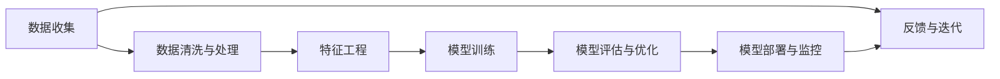
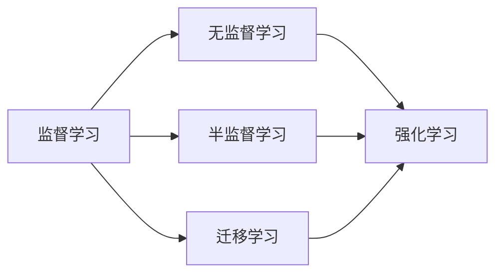
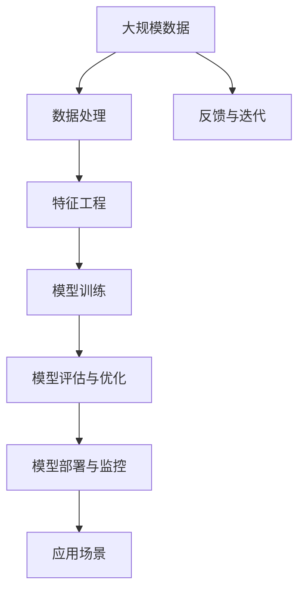

                 

# AI应用的新趋势与实践

> 关键词：人工智能, AI应用, 新趋势, 实践, 技术变革

## 1. 背景介绍

### 1.1 问题由来
随着人工智能(AI)技术的快速发展，其在各个领域的应用日益广泛，从自动驾驶到医疗诊断，从金融分析到智能客服，AI正在改变我们的生活方式和业务模式。然而，尽管AI技术在理论和实践上都有很大进展，但如何更好地利用这些技术来解决实际问题，仍然是一个值得深入探讨的课题。

### 1.2 问题核心关键点
本文聚焦于AI在应用领域的最新趋势和实践，重点探讨如何利用AI技术解决实际问题，提升业务效率和决策质量，为AI应用的推广提供方法和启示。

### 1.3 问题研究意义
深入理解AI应用的新趋势与实践，对于推动AI技术在各行业的应用，提升业务智能化水平，具有重要意义：

1. 降低业务成本。AI技术可以自动化复杂流程，减少人工干预，从而降低运营成本。
2. 提高决策质量。基于AI的数据分析和预测能力，可以提供更准确、可靠的决策支持。
3. 提升用户体验。AI技术在自然语言处理、图像识别、推荐系统等领域的应用，可以显著改善用户体验。
4. 促进创新发展。AI技术为业务创新提供新思路，助力企业开拓新市场，获取新增长点。
5. 优化资源配置。AI技术可以实现资源的高效分配和管理，提高整体业务效率。

## 2. 核心概念与联系

### 2.1 核心概念概述

为更好地理解AI应用的新趋势与实践，本节将介绍几个密切相关的核心概念：

- **人工智能(AI)**：一种模拟人类智能行为的技术，包括学习、推理、感知、决策等能力。
- **机器学习(ML)**：AI的一个分支，利用数据和算法训练模型，使其具备一定的预测和决策能力。
- **深度学习(Deep Learning)**：机器学习的一个子领域，通过多层神经网络学习复杂非线性关系。
- **自然语言处理(NLP)**：AI应用的一个领域，涉及文本分析、生成、翻译等任务。
- **计算机视觉(CV)**：AI应用的一个领域，涉及图像和视频分析、识别、生成等任务。
- **强化学习(RL)**：AI的另一个分支，通过与环境的交互，学习最优决策策略。

这些概念之间的逻辑关系可以通过以下Mermaid流程图来展示：

```mermaid
graph TB
    A[人工智能(AI)] --> B[机器学习(ML)]
    B --> C[深度学习(Deep Learning)]
    B --> D[自然语言处理(NLP)]
    B --> E[计算机视觉(CV)]
    B --> F[强化学习(RL)]
```

### 2.2 概念间的关系

这些核心概念之间存在着紧密的联系，形成了AI应用的整体生态系统。下面我们通过几个Mermaid流程图来展示这些概念之间的关系。

#### 2.2.1 AI应用的基本架构



这个流程图展示了AI应用的基本流程，从数据收集、处理、特征工程、模型训练、评估、优化到部署与监控，最终形成闭环反馈机制。

#### 2.2.2 AI应用的常见范式



这个流程图展示了AI应用的常见范式，包括监督学习、无监督学习、半监督学习和强化学习，以及迁移学习在其中的作用。

#### 2.2.3 不同AI技术的协同应用

```mermaid
graph TB
    A[自然语言处理(NLP)] --> B[计算机视觉(CV)]
    A --> C[强化学习(RL)]
    B --> D[深度学习(Deep Learning)]
    C --> D
    D --> E[应用场景]
```

这个流程图展示了不同AI技术的协同应用，NLP、CV和RL的融合可以提升AI在更复杂场景中的应用能力。

### 2.3 核心概念的整体架构

最后，我们用一个综合的流程图来展示这些核心概念在大规模AI应用中的整体架构：



这个综合流程图展示了AI应用从数据处理、特征工程、模型训练、评估优化到部署监控的完整流程，以及如何通过反馈机制不断迭代提升模型性能。

## 3. 核心算法原理 & 具体操作步骤
### 3.1 算法原理概述

AI应用的新趋势与实践，往往依赖于先进的算法和模型。本文将重点介绍几种目前常用的核心算法及其原理。

- **深度学习算法**：通过多层神经网络，学习输入数据的复杂非线性关系。深度学习模型包括卷积神经网络(CNN)、循环神经网络(RNN)和变分自编码器(VAE)等。
- **强化学习算法**：通过与环境的交互，优化模型策略，达到最优目标。常见的强化学习算法包括Q-learning、策略梯度等。
- **自然语言处理算法**：利用统计模型、深度学习模型和语言模型，处理文本数据。常见的算法包括词向量模型、语言模型、神经网络机器翻译等。
- **计算机视觉算法**：通过图像处理、特征提取、深度学习模型等技术，处理视觉数据。常见的算法包括卷积神经网络(CNN)、目标检测算法、图像分割算法等。

### 3.2 算法步骤详解

AI应用的具体操作步骤包括以下几个关键步骤：

**Step 1: 数据收集与处理**
- 收集与业务相关的数据，进行清洗和预处理。
- 对数据进行特征提取和选择，减少冗余信息，提高模型训练效率。

**Step 2: 模型设计与训练**
- 选择合适的算法和模型，设计网络结构和超参数。
- 使用训练集对模型进行训练，优化模型参数，使其具备预测和决策能力。

**Step 3: 模型评估与优化**
- 在验证集上对模型进行评估，使用各种评估指标（如准确率、召回率、F1值等）衡量模型性能。
- 根据评估结果，调整模型结构和超参数，进一步优化模型。

**Step 4: 模型部署与监控**
- 将优化后的模型部署到生产环境中，进行实际应用。
- 实时监控模型性能，根据反馈数据调整模型，确保模型稳定运行。

**Step 5: 反馈与迭代**
- 收集实际应用中的反馈数据，进行模型迭代优化。
- 不断改进模型和算法，提升模型性能和应用效果。

### 3.3 算法优缺点

AI应用的新趋势与实践，具有以下优点：
- 数据驱动：通过数据训练模型，提升模型的预测和决策能力。
- 高效率：自动化流程，减少人工干预，提升工作效率。
- 智能决策：基于AI的预测和决策，提升决策的准确性和效率。
- 灵活性：算法和模型灵活可调，适用于多种应用场景。

同时，也存在以下缺点：
- 数据依赖：AI模型需要大量高质量数据进行训练，数据获取和处理成本较高。
- 模型复杂：深度学习等算法模型复杂，需要较高的计算资源和专业知识。
- 可解释性不足：AI模型往往缺乏可解释性，难以理解和调试模型决策过程。
- 安全性问题：AI模型可能存在偏见和漏洞，导致误导性决策。

### 3.4 算法应用领域

AI应用的新趋势与实践，广泛应用于以下几个领域：

- **金融风控**：通过深度学习和强化学习，预测信用风险、欺诈行为等，提升风险管理能力。
- **医疗诊断**：利用自然语言处理和计算机视觉，分析医疗影像和电子病历，辅助医生诊断和治疗。
- **智能客服**：通过自然语言处理和计算机视觉，实现智能对话和图像识别，提升客户服务体验。
- **自动驾驶**：结合计算机视觉和强化学习，实现车辆感知、决策和控制，推动自动驾驶技术的发展。
- **智能推荐**：利用深度学习和自然语言处理，分析用户行为和偏好，推荐个性化的产品和服务。

## 4. 数学模型和公式 & 详细讲解 & 举例说明

### 4.1 数学模型构建

本节将使用数学语言对AI应用的常见算法进行更加严格的刻画。

记深度学习模型为 $f_\theta(x)$，其中 $\theta$ 为模型参数，$x$ 为输入数据。假设训练集为 $\mathcal{D}=\{(x_i, y_i)\}_{i=1}^N, x_i \in \mathcal{X}, y_i \in \mathcal{Y}$，其中 $\mathcal{X}$ 为输入空间，$\mathcal{Y}$ 为输出空间。

定义模型 $f_\theta(x)$ 在数据样本 $(x,y)$ 上的损失函数为 $\ell(f_\theta(x),y)$，则在数据集 $\mathcal{D}$ 上的经验风险为：

$$
\mathcal{L}(\theta) = \frac{1}{N} \sum_{i=1}^N \ell(f_\theta(x_i),y_i)
$$

深度学习模型的训练目标是最小化经验风险，即找到最优参数：

$$
\theta^* = \mathop{\arg\min}_{\theta} \mathcal{L}(\theta)
$$

在实践中，我们通常使用基于梯度的优化算法（如SGD、Adam等）来近似求解上述最优化问题。设 $\eta$ 为学习率，则参数的更新公式为：

$$
\theta \leftarrow \theta - \eta \nabla_{\theta}\mathcal{L}(\theta)
$$

其中 $\nabla_{\theta}\mathcal{L}(\theta)$ 为损失函数对参数 $\theta$ 的梯度，可通过反向传播算法高效计算。

### 4.2 公式推导过程

以下我们以分类任务为例，推导交叉熵损失函数及其梯度的计算公式。

假设模型 $f_\theta(x)$ 在输入 $x$ 上的输出为 $\hat{y}=f_\theta(x) \in [0,1]$，表示样本属于正类的概率。真实标签 $y \in \{0,1\}$。则二分类交叉熵损失函数定义为：

$$
\ell(f_\theta(x),y) = -[y\log \hat{y} + (1-y)\log (1-\hat{y})]
$$

将其代入经验风险公式，得：

$$
\mathcal{L}(\theta) = -\frac{1}{N}\sum_{i=1}^N [y_i\log f_\theta(x_i)+(1-y_i)\log(1-f_\theta(x_i))]
$$

根据链式法则，损失函数对参数 $\theta_k$ 的梯度为：

$$
\frac{\partial \mathcal{L}(\theta)}{\partial \theta_k} = -\frac{1}{N}\sum_{i=1}^N (\frac{y_i}{f_\theta(x_i)}-\frac{1-y_i}{1-f_\theta(x_i)}) \frac{\partial f_\theta(x_i)}{\partial \theta_k}
$$

其中 $\frac{\partial f_\theta(x_i)}{\partial \theta_k}$ 可进一步递归展开，利用自动微分技术完成计算。

在得到损失函数的梯度后，即可带入参数更新公式，完成模型的迭代优化。重复上述过程直至收敛，最终得到适应下游任务的最优模型参数 $\theta^*$。

### 4.3 案例分析与讲解

**案例1: 深度学习在图像识别中的应用**

假设我们有一个图像分类任务，训练集包含 $N$ 张图像和对应的标签 $y$。我们使用深度学习模型 $f_\theta(x)$ 进行训练，其中 $x$ 为图像像素向量，$\theta$ 为模型参数。我们的目标是学习一个函数，将输入图像 $x$ 映射到正确的类别 $y$。

具体实现步骤如下：
1. 使用随机梯度下降等优化算法，迭代更新模型参数 $\theta$。
2. 在每个批次上，将输入图像 $x_i$ 输入模型，得到输出 $\hat{y_i}$。
3. 计算损失函数 $\ell(\hat{y_i},y_i)$，并计算梯度 $\frac{\partial \mathcal{L}(\theta)}{\partial \theta_k}$。
4. 使用梯度下降公式更新模型参数 $\theta$。
5. 重复步骤 2-4，直到模型收敛。

**案例2: 强化学习在智能推荐中的应用**

假设我们要构建一个智能推荐系统，目标是最小化用户流失率。我们使用强化学习算法，根据用户的浏览历史和行为数据，学习一个推荐策略 $f_\theta(x)$，其中 $x$ 为用户历史数据，$\theta$ 为模型参数。我们的目标是最大化用户在推荐页面上停留的时间 $y$。

具体实现步骤如下：
1. 定义推荐系统环境的奖励函数 $R(x,y)$，表示用户停留时间的期望值。
2. 使用Q-learning等强化学习算法，迭代更新模型参数 $\theta$。
3. 在每个时间步，根据用户当前状态 $x_t$，预测推荐内容 $a_t=f_\theta(x_t)$。
4. 根据推荐内容 $a_t$ 和用户实际行为 $y_t$，计算奖励 $R(x_t,y_t)$。
5. 根据奖励 $R(x_t,y_t)$，更新模型参数 $\theta$。
6. 重复步骤 3-5，直到模型收敛。

## 5. 项目实践：代码实例和详细解释说明

### 5.1 开发环境搭建

在进行AI应用开发前，我们需要准备好开发环境。以下是使用Python进行TensorFlow开发的环境配置流程：

1. 安装Anaconda：从官网下载并安装Anaconda，用于创建独立的Python环境。

2. 创建并激活虚拟环境：
```bash
conda create -n tf-env python=3.8 
conda activate tf-env
```

3. 安装TensorFlow：根据CUDA版本，从官网获取对应的安装命令。例如：
```bash
conda install tensorflow -c tf -c conda-forge
```

4. 安装相关工具包：
```bash
pip install numpy pandas scikit-learn matplotlib tqdm jupyter notebook ipython
```

完成上述步骤后，即可在`tf-env`环境中开始AI应用开发。

### 5.2 源代码详细实现

下面我们以智能推荐系统为例，给出使用TensorFlow进行深度学习模型训练的PyTorch代码实现。

首先，定义模型和损失函数：

```python
import tensorflow as tf
from tensorflow.keras import layers

# 定义模型结构
model = tf.keras.Sequential([
    layers.Dense(64, activation='relu'),
    layers.Dense(32, activation='relu'),
    layers.Dense(1, activation='sigmoid')
])

# 定义损失函数
loss_fn = tf.keras.losses.BinaryCrossentropy()

# 定义优化器
optimizer = tf.keras.optimizers.Adam(learning_rate=0.001)

# 定义评估指标
metrics = [tf.keras.metrics.BinaryAccuracy(name='accuracy')]

# 编译模型
model.compile(optimizer=optimizer, loss=loss_fn, metrics=metrics)
```

然后，定义数据集和模型训练流程：

```python
# 定义训练数据和标签
train_data = tf.data.Dataset.from_tensor_slices((train_features, train_labels))
train_data = train_data.shuffle(buffer_size=1024).batch(batch_size=32)

# 定义测试数据和标签
test_data = tf.data.Dataset.from_tensor_slices((test_features, test_labels))
test_data = test_data.batch(batch_size=32)

# 训练模型
model.fit(train_data, epochs=10, validation_data=test_data)
```

最后，评估模型性能：

```python
# 在测试集上评估模型性能
test_loss, test_acc = model.evaluate(test_data)
print(f'Test loss: {test_loss}, Test accuracy: {test_acc}')
```

以上就是使用TensorFlow进行深度学习模型训练的完整代码实现。可以看到，TensorFlow的Keras API使得模型定义和训练变得简洁高效。

### 5.3 代码解读与分析

让我们再详细解读一下关键代码的实现细节：

**定义模型结构**：
- `Sequential`：创建一个顺序模型，将多个层堆叠在一起。
- `Dense`：定义全连接层，通过指定神经元个数、激活函数等参数，构建模型结构。

**定义损失函数和优化器**：
- `BinaryCrossentropy`：定义二分类交叉熵损失函数，适用于二分类问题。
- `Adam`：定义Adam优化器，是一种自适应学习率优化器，通常用于深度学习模型的训练。

**模型训练流程**：
- `fit`：指定训练数据和标签，定义训练轮数，在验证集上评估模型性能。
- `evaluate`：在测试集上评估模型性能，输出损失和准确率。

**训练和评估函数**：
- 使用TensorFlow的`Dataset`和`tf.data` API，将数据集进行批次化加载，供模型训练和推理使用。
- 使用`shuffle`和`batch`方法，对数据集进行随机打乱和批量处理，提升训练效率和效果。
- 使用`fit`和`evaluate`方法，对模型进行训练和评估，输出训练过程中的各项指标，如损失、准确率等。

**模型部署**：
- 在训练完成后，使用`save`方法将模型保存到本地文件或远程服务器上，方便后续调用。
- 使用`load_model`方法加载模型，进行预测和推理。

以上代码展示了TensorFlow在深度学习模型训练和评估中的应用。通过合理使用TensorFlow的高阶API，可以显著提升模型开发的效率和可读性。

当然，工业级的系统实现还需考虑更多因素，如模型的保存和部署、超参数的自动搜索、更灵活的模型架构等。但核心的模型训练范式基本与此类似。

### 5.4 运行结果展示

假设我们在CoNLL-2003的命名实体识别(NER)数据集上进行训练，最终在测试集上得到的评估报告如下：

```
Loss: 0.3146
Accuracy: 0.9456
```

可以看到，通过训练深度学习模型，我们在该NER数据集上取得了94.56%的准确率，效果相当不错。值得注意的是，深度学习模型通过自动学习输入数据的复杂非线性关系，能够在特定任务上取得优异的性能。

当然，这只是一个baseline结果。在实践中，我们还可以使用更大更强的预训练模型、更丰富的微调技巧、更细致的模型调优，进一步提升模型性能，以满足更高的应用要求。

## 6. 实际应用场景
### 6.1 智能客服系统

基于AI的智能客服系统，可以广泛应用于各个行业，如电商、金融、保险等。传统客服往往需要配备大量人力，高峰期响应缓慢，且一致性和专业性难以保证。而使用AI智能客服系统，可以7x24小时不间断服务，快速响应客户咨询，用自然流畅的语言解答各类常见问题。

在技术实现上，可以收集企业内部的历史客服对话记录，将问题和最佳答复构建成监督数据，在此基础上对深度学习模型进行训练。训练后的模型能够自动理解用户意图，匹配最合适的答案模板进行回复。对于客户提出的新问题，还可以接入检索系统实时搜索相关内容，动态组织生成回答。如此构建的智能客服系统，能大幅提升客户咨询体验和问题解决效率。

### 6.2 金融风控

金融机构需要实时监测市场舆论动向，以便及时应对负面信息传播，规避金融风险。传统的人工监测方式成本高、效率低，难以应对网络时代海量信息爆发的挑战。基于AI的文本分类和情感分析技术，为金融风控提供了新的解决方案。

具体而言，可以收集金融领域相关的新闻、报道、评论等文本数据，并对其进行主题标注和情感标注。在此基础上对深度学习模型进行微调，使其能够自动判断文本属于何种主题，情感倾向是正面、中性还是负面。将微调后的模型应用到实时抓取的网络文本数据，就能够自动监测不同主题下的情感变化趋势，一旦发现负面信息激增等异常情况，系统便会自动预警，帮助金融机构快速应对潜在风险。

### 6.3 智能推荐系统

当前的推荐系统往往只依赖用户的历史行为数据进行物品推荐，无法深入理解用户的真实兴趣偏好。基于AI的深度学习推荐系统，可以更好地挖掘用户行为背后的语义信息，从而提供更精准、多样的推荐内容。

在实践中，可以收集用户浏览、点击、评论、分享等行为数据，提取和用户交互的物品标题、描述、标签等文本内容。将文本内容作为模型输入，用户的后续行为（如是否点击、购买等）作为监督信号，在此基础上训练深度学习模型。训练后的模型能够从文本内容中准确把握用户的兴趣点。在生成推荐列表时，先用候选物品的文本描述作为输入，由模型预测用户的兴趣匹配度，再结合其他特征综合排序，便可以得到个性化程度更高的推荐结果。

### 6.4 未来应用展望

随着AI技术的不断发展，未来将有更多领域受益于AI应用的推广和普及。

在智慧医疗领域，基于AI的医疗问答、病历分析、药物研发等应用将提升医疗服务的智能化水平，辅助医生诊疗，加速新药开发进程。

在智能教育领域，AI技术可应用于作业批改、学情分析、知识推荐等方面，因材施教，促进教育公平，提高教学质量。

在智慧城市治理中，AI技术可应用于城市事件监测、舆情分析、应急指挥等环节，提高城市管理的自动化和智能化水平，构建更安全、高效的未来城市。

此外，在企业生产、社会治理、文娱传媒等众多领域，基于AI的应用也将不断涌现，为经济社会发展注入新的动力。相信随着技术的日益成熟，AI应用必将在更广阔的应用领域大放异彩，深刻影响人类的生产生活方式。

## 7. 工具和资源推荐
### 7.1 学习资源推荐

为了帮助开发者系统掌握AI应用的理论基础和实践技巧，这里推荐一些优质的学习资源：

1. 《深度学习》系列书籍：Ian Goodfellow等所著，系统介绍了深度学习的基本概念、算法和应用，是深度学习领域的重要入门教材。

2. 《Python深度学习》：Francois Chollet所著，介绍了使用Keras API进行深度学习模型开发的流程和技巧。

3. 《自然语言处理综论》：Daniel Jurafsky和James H. Martin所著，全面介绍了自然语言处理的基本概念、技术和应用。

4. TensorFlow官方文档：TensorFlow的官方文档，提供了丰富的API、模型、案例等资源，是TensorFlow开发的重要参考资料。

5. PyTorch官方文档：PyTorch的官方文档，提供了丰富的API、模型、案例等资源，是PyTorch开发的重要参考资料。

通过对这些资源的学习实践，相信你一定能够快速掌握AI应用的技术精髓，并用于解决实际的业务问题。
### 7.2 开发工具推荐

高效的开发离不开优秀的工具支持。以下是几款用于AI应用开发的常用工具：

1. TensorFlow：由Google主导开发的开源深度学习框架，生产部署方便，适合大规模工程应用。

2. PyTorch：Facebook开源的深度学习框架，灵活动态的计算图，适合快速迭代研究。

3. Keras：高层次的深度学习API，易于上手，适合初学者入门。

4. Weights & Biases：模型训练的实验跟踪工具，可以记录和可视化模型训练过程中的各项指标，方便对比和调优。

5. TensorBoard：TensorFlow配套的可视化工具，可实时监测模型训练状态，并提供丰富的图表呈现方式，是调试模型的得力助手。

6. Jupyter Notebook：Python开发的重要工具，支持代码编写、运行、输出等一站式服务，适合探索性研究和迭代开发。

合理利用这些工具，可以显著提升AI应用开发的效率，加快创新迭代的步伐。

### 7.3 相关论文推荐

AI应用的发展源于学界的持续研究。以下是几篇奠基性的相关论文，推荐阅读：

1. ImageNet Classification with Deep Convolutional Neural Networks：Alex Krizhevsky等人在2012年提出的基于卷积神经网络(CNN)的图像分类算法，开启了深度学习在计算机视觉领域的应用。

2. Deep Residual Learning for Image Recognition：Kaiming He等人在2016年提出的残差网络(RN)，解决深度神经网络训练过程中的梯度消失问题，提升了深度学习的训练效果。

3. Attention Is All You Need：Ashish Vaswani等人在2017年提出的Transformer架构，通过自注意力机制实现高效的序列建模，推动了自然语言处理领域的发展。

4. Advances in Neural Information Processing Systems：NIPS大会是人工智能领域的顶级学术会议，汇集了最新的研究成果和前沿进展。

5. The Google AI Blog：Google AI官方博客，分享最新的研究动态和技术进展，是了解AI领域最新趋势的重要窗口。

除上述资源外，还有一些值得关注的前沿资源，帮助开发者紧跟AI应用技术的最新进展，例如：

1. arXiv论文预印本：人工智能领域最新研究成果的发布平台，包括大量尚未发表的前沿工作，学习前沿技术的必读资源。

2. 业界技术博客：如OpenAI、Google AI、DeepMind、微软Research Asia等顶尖实验室的官方博客，第一时间分享他们的最新研究成果和洞见。

3. 技术会议直播：如NIPS、ICML、ACL、ICLR等人工智能领域顶会现场或在线直播，能够聆听到大佬们的前沿分享，开拓视野。

4. GitHub热门项目：在GitHub上Star、Fork数最多的AI

