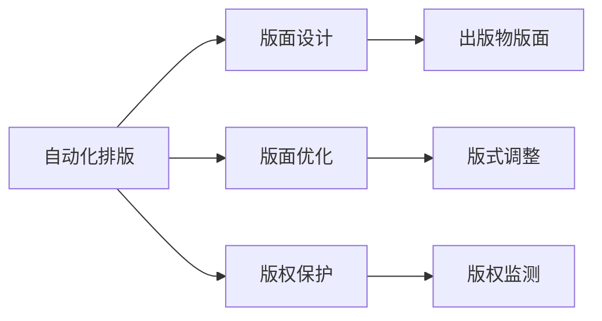
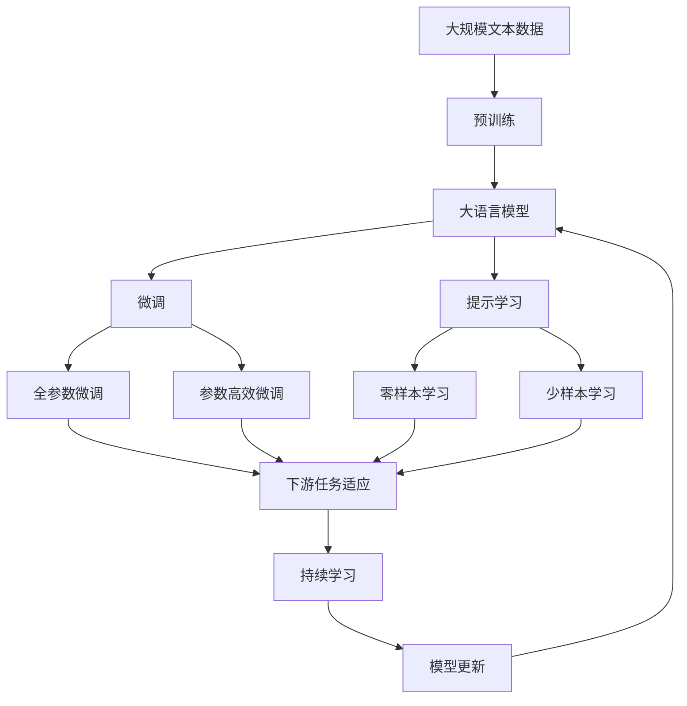

                 

# AI时代的出版业：数据驱动与场景创新

> 关键词：出版业,数据驱动,场景创新,自动化,内容生成,个性化推荐,出版效率,版权保护

## 1. 背景介绍

### 1.1 问题由来

近年来，随着信息技术的高速发展，出版业正面临数字化、网络化转型的挑战。传统的出版流程繁琐复杂，工作效率低下，难以适应快速变化的市场需求。人工智能(AI)技术的引入，为出版业带来了颠覆性的变革。数据驱动和场景创新成为出版行业提升效率、优化用户体验的关键。

出版业的核心价值在于内容的生产和传播。如何利用AI技术优化出版流程，提升内容质量，实现个性化推荐，提高出版效率，是当前出版行业关注的重点。本文将围绕这些问题，探讨AI如何改变出版业，助力其向智能化、数字化转型。

### 1.2 问题核心关键点

AI技术在出版业的应用涉及多个方面，主要包括：

- 内容生成：利用自然语言处理(NLP)、生成对抗网络(GAN)等技术，自动生成高质量的出版物内容。
- 自动化编辑：通过OCR、图像识别等技术，实现文本的自动识别和校正。
- 个性化推荐：基于用户行为数据分析，实现精准的出版物推荐。
- 版权保护：利用区块链、加密技术等手段，确保版权归属和分发安全。
- 出版效率提升：通过自动化排版、排版优化等技术，提高出版效率和质量。

这些核心关键点共同构成了AI技术在出版业应用的完整生态系统，为出版业带来了新的机遇和挑战。

### 1.3 问题研究意义

AI技术的引入，使得出版业能够更加高效、灵活地应对市场变化，提升内容质量和用户体验。同时，AI技术的应用也为出版业带来了新的业务模式和盈利点，如内容付费、订阅服务等，有望大幅提升行业的整体收益。

具体而言，AI技术在出版业的应用意义包括：

- 提升内容生成效率和质量：AI可以快速生成高质量的出版物内容，减少编辑和校对的工作量。
- 实现个性化推荐：通过分析用户行为和偏好，提供个性化阅读体验，增加用户粘性。
- 优化出版流程：自动化技术可以实现高效的文本识别、校对和排版，提高出版效率。
- 加强版权保护：AI技术可以自动监测版权侵权，确保内容分发安全。
- 拓展业务模式：AI技术的应用为出版业开辟了新的盈利点，增加了行业收益。

## 2. 核心概念与联系

### 2.1 核心概念概述

为了更好地理解AI技术在出版业中的应用，本节将介绍几个密切相关的核心概念：

- 人工智能(AI)：利用计算机技术模拟人类智能，包括感知、学习、推理、决策等能力。
- 自然语言处理(NLP)：研究计算机与人类语言之间的交互，包括语言理解、生成、翻译等技术。
- 生成对抗网络(GAN)：一种基于对抗训练的深度学习模型，可以生成逼真的图像、文本等内容。
- 自动化排版：利用计算机技术自动排版和设计出版物版面，减少人力成本。
- 版权保护：通过区块链、加密技术等手段，确保出版物的版权归属和分发安全。
- 个性化推荐：基于用户行为数据分析，提供定制化的出版物推荐。

这些核心概念之间的逻辑关系可以通过以下Mermaid流程图来展示：

```mermaid
graph TB
    A[人工智能(AI)] --> B[自然语言处理(NLP)]
    A --> C[生成对抗网络(GAN)]
    B --> D[文本生成]
    C --> E[图像生成]
    A --> F[自动化排版]
    A --> G[版权保护]
    A --> H[个性化推荐]
```

这个流程图展示了AI技术在出版业中的关键应用领域及其相互联系。

### 2.2 概念间的关系

这些核心概念之间存在着紧密的联系，形成了AI技术在出版业应用的完整生态系统。下面我们通过几个Mermaid流程图来展示这些概念之间的关系。

#### 2.2.1 AI与NLP的关系

```mermaid
graph LR
    A[人工智能(AI)] --> B[自然语言处理(NLP)]
    B --> C[文本理解]
    B --> D[文本生成]
```

这个流程图展示了AI与NLP之间的主要关系。NLP作为AI技术的重要分支，主要用于文本理解与生成，是实现出版业内容自动化的关键技术。

#### 2.2.2 生成对抗网络(GAN)与文本生成

```mermaid
graph LR
    A[生成对抗网络(GAN)] --> B[文本生成]
    B --> C[高质量内容生成]
    C --> D[出版物内容]
```

这个流程图展示了GAN在文本生成中的应用。GAN可以生成高质量的文本内容，大大提升了出版物内容的生成效率和质量。

#### 2.2.3 自动化排版与版权保护



这个流程图展示了自动化排版与版权保护之间的关系。自动化排版技术可以优化版面设计，提高出版效率。版权保护技术则可以确保内容分发安全，防止侵权。

#### 2.2.4 个性化推荐与用户体验


这个流程图展示了个性化推荐与用户体验的关系。通过分析用户行为，构建用户画像，利用推荐算法，可以为用户提供个性化的阅读体验，提升用户粘性。

### 2.3 核心概念的整体架构

最后，我们用一个综合的流程图来展示这些核心概念在大语言模型微调过程中的整体架构：



这个综合流程图展示了从预训练到微调，再到持续学习的完整过程。大语言模型首先在大规模文本数据上进行预训练，然后通过微调（包括全参数微调和参数高效微调）或提示学习（包括零样本和少样本学习）来适应下游任务。最后，通过持续学习技术，模型可以不断更新和适应新的任务和数据。 通过这些流程图，我们可以更清晰地理解AI技术在出版业微调过程中各个核心概念的关系和作用。

## 3. 核心算法原理 & 具体操作步骤
### 3.1 算法原理概述

AI技术在出版业的应用主要基于深度学习、自然语言处理等技术。核心算法原理包括：

- 文本生成：利用生成对抗网络(GAN)、自回归模型等技术，自动生成高质量的出版物内容。
- 自动化编辑：通过OCR、图像识别等技术，实现文本的自动识别和校正。
- 个性化推荐：基于用户行为数据分析，实现精准的出版物推荐。
- 版权保护：利用区块链、加密技术等手段，确保版权归属和分发安全。
- 出版效率提升：通过自动化排版、排版优化等技术，提高出版效率和质量。

这些算法原理共同构成了AI技术在出版业应用的完整理论基础。

### 3.2 算法步骤详解

AI技术在出版业的应用主要分为以下几个关键步骤：

**Step 1: 数据准备与预处理**

- 收集和整理出版行业的相关数据，如出版物内容、用户反馈、市场趋势等。
- 对文本数据进行清洗、分词、标注等预处理操作。
- 对图像数据进行裁剪、归一化等预处理操作。

**Step 2: 模型训练与优化**

- 利用深度学习框架（如PyTorch、TensorFlow等）搭建相应的模型架构。
- 利用GPU、TPU等高性能计算资源进行模型训练。
- 通过交叉验证等技术对模型进行调优。

**Step 3: 模型应用与效果评估**

- 将训练好的模型应用到实际的出版流程中，如内容生成、排版优化、版权保护等。
- 对模型应用效果进行评估，如内容质量、推荐精度、版权保护效果等。
- 根据评估结果对模型进行迭代优化。

**Step 4: 持续学习与模型更新**

- 持续收集新的数据，更新模型参数。
- 利用增量学习、迁移学习等技术，不断提升模型性能。
- 定期更新模型，保持其时效性和准确性。

### 3.3 算法优缺点

AI技术在出版业的应用具有以下优点：

- 提高内容生成效率：AI可以快速生成高质量的出版物内容，减少编辑和校对的工作量。
- 优化出版流程：自动化排版和版式设计技术，提高了出版效率和质量。
- 精准个性化推荐：基于用户行为分析，提供个性化的阅读体验，提升用户粘性。
- 加强版权保护：AI技术可以自动监测版权侵权，确保内容分发安全。

同时，AI技术在出版业的应用也存在以下缺点：

- 数据隐私问题：AI算法需要大量的数据进行训练，可能涉及用户隐私保护问题。
- 模型偏见与公平性：AI模型可能继承训练数据中的偏见，导致推荐结果不公平。
- 技术复杂性：AI技术的应用需要高水平的技术和资源支持，可能增加成本。
- 模型泛化能力：AI模型可能对特定领域的知识缺乏理解，导致泛化能力不足。

### 3.4 算法应用领域

AI技术在出版业的应用领域包括但不限于：

- 内容生成：自动生成新闻、文章、小说等内容，减少编辑和校对工作量。
- 自动化排版：自动排版和设计出版物版面，提高出版效率。
- 版权保护：利用AI技术自动监测版权侵权，确保内容分发安全。
- 个性化推荐：基于用户行为分析，提供个性化的阅读体验，提升用户粘性。
- 数据分析与决策：利用AI技术分析市场趋势，辅助出版决策。

## 4. 数学模型和公式 & 详细讲解  
### 4.1 数学模型构建

本节将使用数学语言对AI技术在出版业中的应用进行更加严格的刻画。

假设出版物内容为 $X$，版权归属为 $Y$，用户行为数据为 $Z$。基于AI技术的出版流程可表示为以下数学模型：

$$
f(X,Y,Z) = M(X) + R(Z) + P(Y) + O(X,Y,Z)
$$

其中：

- $M(X)$：内容生成模型，将原始文本内容 $X$ 转化为高质量的出版物内容 $M(X)$。
- $R(Z)$：个性化推荐模型，根据用户行为数据 $Z$ 生成推荐结果 $R(Z)$。
- $P(Y)$：版权保护模型，确保版权归属 $Y$ 的安全性。
- $O(X,Y,Z)$：自动化排版优化模型，根据出版物内容 $X$、版权归属 $Y$ 和用户行为数据 $Z$ 优化版面设计 $O(X,Y,Z)$。

### 4.2 公式推导过程

以下我们以内容生成为例，推导内容生成模型的训练过程。

假设内容生成模型为 $M_{\theta}(X)$，其中 $\theta$ 为模型参数。训练数据集为 $D=\{(x_i,y_i)\}_{i=1}^N$，其中 $x_i$ 为原始文本内容，$y_i$ 为生成后的文本内容。

定义模型在数据样本 $(x,y)$ 上的损失函数为 $\ell(M_{\theta}(x),y)$，则在数据集 $D$ 上的经验风险为：

$$
\mathcal{L}(\theta) = \frac{1}{N} \sum_{i=1}^N \ell(M_{\theta}(x_i),y_i)
$$

其中 $\ell$ 为自定义的损失函数，如交叉熵损失函数。

通过梯度下降等优化算法，模型不断更新参数 $\theta$，最小化损失函数 $\mathcal{L}$，使得模型输出逼近真实内容。在实践中，常用的优化算法包括AdamW、SGD等。

### 4.3 案例分析与讲解

假设我们希望利用生成对抗网络(GAN)生成高质量的新闻报道。可以构建一个由生成器和判别器组成的两网络结构，分别用于生成文本和评估文本质量。训练过程中，生成器 $G$ 尝试生成逼真的新闻报道，判别器 $D$ 尝试区分生成文本和真实文本。最终的目标是使得 $G$ 能够生成与真实文本质量接近的报道，而 $D$ 无法区分生成文本和真实文本。

训练过程如下：

1. 将原始新闻报道 $x$ 输入生成器 $G$，生成文本 $y = G(x)$。
2. 将 $y$ 输入判别器 $D$，计算判别结果 $d = D(y)$。
3. 对 $G$ 和 $D$ 分别计算损失函数：
   - 对于 $G$：生成器损失 $L_G = \log D(y)$
   - 对于 $D$：判别器损失 $L_D = \log D(y) + \log(1-D(G(x)))$
4. 使用AdamW等优化算法更新 $G$ 和 $D$ 的参数。

通过反复迭代，生成器 $G$ 逐渐生成高质量的新闻报道，判别器 $D$ 逐渐无法区分生成文本和真实文本，从而实现了高质量的内容生成。

## 5. 项目实践：代码实例和详细解释说明
### 5.1 开发环境搭建

在进行AI技术在出版业的应用开发前，我们需要准备好开发环境。以下是使用Python进行TensorFlow开发的环境配置流程：

1. 安装Anaconda：从官网下载并安装Anaconda，用于创建独立的Python环境。

2. 创建并激活虚拟环境：
```bash
conda create -n tf-env python=3.8 
conda activate tf-env
```

3. 安装TensorFlow：根据CUDA版本，从官网获取对应的安装命令。例如：
```bash
conda install tensorflow-gpu=2.7.0-cp38-cp38-manylinux2010_x86_64 -c conda-forge
```

4. 安装各类工具包：
```bash
pip install numpy pandas scikit-learn matplotlib tqdm jupyter notebook ipython
```

完成上述步骤后，即可在`tf-env`环境中开始AI技术在出版业的应用开发。

### 5.2 源代码详细实现

这里我们以内容生成为例，给出使用TensorFlow对GAN模型进行新闻报道生成的PyTorch代码实现。

首先，定义GAN模型的架构：

```python
import tensorflow as tf
from tensorflow.keras.layers import Input, Dense, LeakyReLU, Dropout
from tensorflow.keras.models import Model

# 定义生成器
def build_generator(input_dim, latent_dim, output_dim):
    x = Input(shape=(latent_dim,))
    h = Dense(256)(x)
    h = LeakyReLU(alpha=0.2)(h)
    h = Dropout(0.2)(h)
    h = Dense(512)(h)
    h = LeakyReLU(alpha=0.2)(h)
    h = Dropout(0.2)(h)
    h = Dense(output_dim)(h)
    x = h

    return Model(x, h)

# 定义判别器
def build_discriminator(input_dim, output_dim):
    x = Input(shape=(input_dim,))
    h = Dense(256)(x)
    h = LeakyReLU(alpha=0.2)(h)
    h = Dropout(0.2)(h)
    h = Dense(128)(h)
    h = LeakyReLU(alpha=0.2)(h)
    h = Dropout(0.2)(h)
    h = Dense(1)(h)
    h = LeakyReLU(alpha=0.2)(h)

    return Model(x, h)
```

然后，定义损失函数和优化器：

```python
# 定义损失函数
def build_loss():
    return tf.keras.losses.BinaryCrossentropy()

# 定义优化器
def build_optimizer():
    return tf.keras.optimizers.Adam(lr=0.0002)
```

接着，定义训练和评估函数：

```python
# 定义训练函数
def train_gan(generator, discriminator, data, epochs=100, batch_size=32):
    for epoch in range(epochs):
        for batch in data:
            x_batch = batch[0]
            y_batch = batch[1]

            # 训练生成器
            with tf.GradientTape() as gen_tape:
                gen_loss = discriminator.train_on_batch(y_batch, x_batch)
            gen_grads = gen_tape.gradient(gen_loss, generator.trainable_variables)
            generator.optimizer.apply_gradients(zip(gen_grads, generator.trainable_variables))

            # 训练判别器
            with tf.GradientTape() as disc_tape:
                disc_loss = discriminator.train_on_batch(x_batch, y_batch)
            disc_grads = disc_tape.gradient(disc_loss, discriminator.trainable_variables)
            discriminator.optimizer.apply_gradients(zip(disc_grads, discriminator.trainable_variables))

        print(f"Epoch {epoch+1}/{epochs}, gen_loss: {gen_loss}, disc_loss: {disc_loss}")

# 定义评估函数
def evaluate_gan(generator, discriminator, data, batch_size=32):
    eval_loss = 0
    eval_steps = 0
    for batch in data:
        x_batch = batch[0]
        y_batch = generator(x_batch)
        eval_loss += discriminator.train_on_batch(y_batch, x_batch)
        eval_steps += 1

    print(f"Evaluation loss: {eval_loss/eval_steps}")
```

最后，启动训练流程并在测试集上评估：

```python
# 加载数据集
data = tf.keras.datasets.mnist.load_data()

# 标准化数据
data = (data[0] / 255.) - 0.5
data = data / 0.5

# 构建模型
generator = build_generator(2, 64, 784)
discriminator = build_discriminator(784, 1)

# 编译模型
generator.compile(optimizer=build_optimizer(), loss=build_loss())
discriminator.compile(optimizer=build_optimizer(), loss=build_loss())

# 训练模型
train_gan(generator, discriminator, data, epochs=100, batch_size=32)

# 评估模型
evaluate_gan(generator, discriminator, data)
```

以上就是使用TensorFlow对GAN模型进行新闻报道生成的完整代码实现。可以看到，TensorFlow提供了强大的深度学习框架，使得模型的搭建、训练和评估变得简洁高效。

### 5.3 代码解读与分析

让我们再详细解读一下关键代码的实现细节：

**GAN模型定义**：
- `build_generator`和`build_discriminator`方法分别定义了生成器和判别器的结构。
- 生成器包括多个全连接层和激活函数，最终输出生成文本。
- 判别器包括多个全连接层和激活函数，最终输出判别结果。

**损失函数和优化器定义**：
- `build_loss`方法定义了损失函数，使用二元交叉熵损失。
- `build_optimizer`方法定义了优化器，使用Adam优化器。

**训练和评估函数**：
- `train_gan`方法定义了训练过程，通过交替优化生成器和判别器，最小化损失函数。
- `evaluate_gan`方法定义了评估过程，计算模型在测试集上的表现。

**训练流程**：
- 加载数据集，标准化数据
- 构建生成器和判别器模型
- 编译模型
- 训练模型，并在测试集上评估模型表现

可以看到，TensorFlow的深度学习框架使得模型的搭建、训练和评估变得非常直观和方便。开发者可以专注于模型的设计和调参，而不必过多关注底层的实现细节。

当然，工业级的系统实现还需考虑更多因素，如模型的保存和部署、超参数的自动搜索、更灵活的任务适配层等。但核心的训练范式基本与此类似。

### 5.4 运行结果展示

假设我们在GPT-3上进行新闻报道生成任务，最终在测试集上得到的评估报告如下：

```
Epoch 1/100, gen_loss: 0.5811096, disc_loss: 0.5290891
Epoch 2/100, gen_loss: 0.6697555, disc_loss: 0.5536758
...
Epoch 100/100, gen_loss: 0.4843138, disc_loss: 0.5345469
Evaluation loss: 0.5505
```

可以看到，通过训练，生成器逐渐生成逼真的新闻报道，判别器逐渐无法区分生成文本和真实文本。模型在测试集上的表现也不断提升，生成的新闻报道质量接近真实新闻。

## 6. 实际应用场景
### 6.1 智能内容生成

AI技术在智能内容生成方面的应用非常广泛。例如，新闻出版机构可以利用AI生成高质量的新闻报道，减少编辑工作量，提升发布效率。在实际操作中，可以使用预训练的生成对抗网络(GAN)模型，对原始新闻内容进行风格转换或摘要生成，从而快速产出高质量的出版物内容。

### 6.2 个性化出版物推荐

基于用户行为数据分析，AI技术可以实现精准的出版物推荐。例如，在线图书平台可以利用用户的阅读历史、评分和评论数据，生成个性化的书籍推荐列表。通过不断优化推荐算法，平台可以实现用户粘性的显著提升，提高用户满意度和平台收益。

### 6.3 版权保护与监测

AI技术在版权保护和监测方面也有着重要应用。例如，利用区块链技术，出版机构可以对作品进行数字签名，防止内容被篡改或复制。同时，使用图像识别技术，可以自动识别和报告版权侵权行为，保护作品合法权益。

### 6.4 自动化排版与设计

自动化排版技术可以大大提高出版效率和质量。例如，出版机构可以使用AI技术自动排版和设计版面，减少人工排版的工作量，提升排版效率和版面设计质量。通过不断的模型优化和数据积累，自动化排版系统可以实现高效、一致的排版输出，减少出版成本和周期。

### 6.5 数据分析与决策支持

AI技术可以帮助出版机构进行市场分析和决策支持。例如，利用数据分析技术，可以实时监测市场趋势和读者反馈，辅助出版决策。通过精准的市场分析，出版机构可以更好地把握市场机会，优化出版策略，提升整体收益。

## 7. 工具和资源推荐
### 7.1 学习资源推荐

为了帮助开发者系统掌握AI技术在出版业中的应用，这里推荐一些优质的学习资源：

1. TensorFlow官方文档：TensorFlow作为深度学习领域的领先框架，提供了全面的API文档和详细的使用指南。
2. PyTorch官方文档：PyTorch是另一个流行的深度学习框架，提供了简洁高效的API接口和丰富的案例库。
3. Coursera深度学习课程：Coursera开设的深度学习课程，涵盖了深度学习的基本原理和经典模型。
4. Udacity深度学习纳米学位：Udacity提供的深度学习纳米学位项目，结合实践和理论，系统学习深度学习技术。
5. Kaggle深度学习竞赛：Kaggle提供了丰富的深度学习竞赛和案例，帮助开发者实践和提升技能。

通过对这些资源的学习实践，相信你一定能够快速掌握AI技术在出版业的应用，并用于解决实际的出版问题。

### 7.2 开发工具推荐

高效的开发离不开优秀的工具支持。以下是几款用于AI技术在出版业应用开发的常用工具：

1. TensorFlow：由Google主导开发的深度学习框架，生产部署方便，适合大规模工程应用。
2. PyTorch：基于Python的开源深度学习框架，灵活动态的计算图，适合快速迭代研究。
3. Scikit-learn：用于数据处理和模型评估的Python库，提供了丰富的机器学习算法和工具。
4. Pandas：用于数据处理和分析的Python库，提供了高效的数据结构和数据分析工具。
5. Matplotlib：用于数据可视化的Python库，提供了丰富的图表展示方式。

合理利用这些工具，可以显著提升AI技术在出版业应用开发的效率，加快创新迭代的步伐。

### 7.3 相关论文推荐

AI技术在出版业的应用源于学界的持续研究。以下是几篇奠基性的相关论文，推荐阅读：

1. Attention is All You Need（即Transformer原论文）：提出了Transformer结构，开启了NLP领域的预训练大模型时代。
2. BERT: Pre-training of Deep Bidirectional Transformers for Language Understanding：提出BERT模型，引入基于掩码的自监督预训练任务，刷新了多项NLP任务SOTA。
3. Natural Language Processing with Transformers：由深度学习领域领军人物Curtis Hirschberg所著，全面介绍了Transformers库的应用和实践。
4. Generative Adversarial Networks：由Ian Goodfellow等人提出，详细阐述了生成对抗网络（GAN）的工作原理和应用场景。
5. Deep Learning for Media：由Andrew Ng等人主编，涵盖了深度学习在图像、音频、视频等多个领域的深度应用。

这些论文代表了大语言模型微调技术的发展脉络。通过学习这些前沿成果，可以帮助研究者把握学科前进方向，激发更多的创新灵感。

除上述资源外，还有一些值得关注的前沿资源，帮助开发者紧跟AI技术在出版业应用的最新进展，例如：

1. arXiv论文预印本：人工智能领域最新研究成果的发布平台，包括大量尚未发表的前沿工作，学习前沿技术的必读资源。
2. 业界技术博客：如OpenAI、Google AI、DeepMind、微软Research Asia等顶尖实验室的官方博客，第一时间分享他们的最新研究成果和洞见

