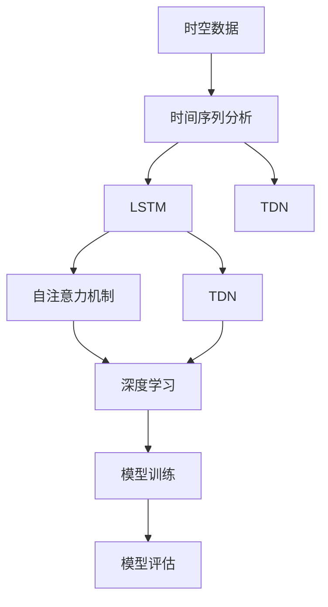

                 

# AI时空数据建模的基石

> 关键词：时空数据建模, 时间序列分析, 深度学习, 长短期记忆网络, 循环神经网络, 自注意力机制, 时间延迟网络, 序列预测, 工业应用

## 1. 背景介绍

### 1.1 问题由来

在现代科技发展的浪潮中，数据无处不在。从互联网到物联网，从个人到企业，数据无所不在，无时不在。这种“时空数据”的快速增长，为各行各业带来了新的机遇和挑战。

在数据挖掘和人工智能的领域，时空数据成为分析和建模的重点。传统的分析方法，如时间序列分析、回归分析、主成分分析等，已经无法应对时空数据的复杂性。幸运的是，近年来深度学习技术，特别是循环神经网络（RNN），时间延迟网络（TDN），长短期记忆网络（LSTM）等，在时空数据建模方面取得了显著进展。

这些模型可以捕捉时间序列数据中的长期依赖关系，并且能够对时序数据进行准确的预测和分析，是当前数据分析和预测的重要工具。然而，传统的RNN等模型仍然存在一定的局限性，例如只能处理固定长度的序列，且对于复杂的序列特征无法很好地捕捉。

为了应对这些问题，研究人员开始探索新的模型和算法。自注意力机制的提出，使得模型能够更好地捕捉序列特征，并且可以处理可变长度的序列。这种技术在机器翻译、文本生成、图像处理等领域得到了广泛应用，并逐渐被引入到时空数据建模领域。

本文将详细探讨时空数据建模的核心技术，包括自注意力机制和深度学习模型的应用，以及如何将这些技术应用到工业场景中，帮助企业从海量时空数据中挖掘出有价值的信息。

## 2. 核心概念与联系

### 2.1 核心概念概述

在时空数据建模中，核心概念包括以下几个方面：

- 时空数据：指随时间变化的观测数据，可以包含位置、温度、流量等多样化的信息。
- 时间序列分析：指对随时间变化的观测数据进行分析，以发现数据中的规律和趋势。
- 深度学习：指使用多层神经网络进行数据建模和预测的技术。
- 长短期记忆网络（LSTM）：一种特殊的深度学习模型，能够有效处理长期依赖关系。
- 自注意力机制：指一种模型设计方法，能够自动学习序列中每个元素的相对重要程度，从而捕捉更丰富的序列特征。
- 时间延迟网络（TDN）：一种结合了卷积神经网络和RNN的模型，能够同时处理时间域和空间域的特征。

这些核心概念相互联系，构成了时空数据建模的技术框架。其中，自注意力机制和LSTM是时空数据建模的核心，深度学习技术是实现时空数据建模的工具，时间序列分析和TDN则提供了模型建模的数学基础。

### 2.2 概念间的关系

这些核心概念之间存在着紧密的联系，形成了时空数据建模的完整体系。以下是一个综合性的Mermaid流程图，展示了这些概念之间的关系：



这个流程图展示了时空数据建模的技术路径：首先对时空数据进行时间序列分析，然后采用LSTM、自注意力机制、TDN等深度学习模型进行建模，并对模型进行训练和评估。最终，得到的模型可以用于预测和分析时空数据。

## 3. 核心算法原理 & 具体操作步骤
### 3.1 算法原理概述

时空数据建模的核心是利用深度学习模型对时间序列数据进行建模和预测。其核心算法原理包括以下几个方面：

- 时间序列分析：通过统计方法，如自回归模型、移动平均模型、ARIMA模型等，对时间序列数据进行建模，以发现其中的规律和趋势。
- 长短期记忆网络（LSTM）：LSTM模型能够有效处理时间序列数据中的长期依赖关系，并且可以记忆和遗忘信息，从而提高预测准确度。
- 自注意力机制：自注意力机制能够自动学习序列中每个元素的相对重要程度，从而捕捉更丰富的序列特征。这种机制已经被广泛应用于机器翻译、文本生成等任务中。

这些算法共同构成了时空数据建模的核心技术，能够有效捕捉时空数据的特征，并进行准确的预测和分析。

### 3.2 算法步骤详解

时空数据建模的基本步骤如下：

1. 数据预处理：对原始时空数据进行清洗、归一化、缺失值处理等预处理操作，确保数据质量。

2. 划分数据集：将数据集划分为训练集、验证集和测试集，以便进行模型的训练和评估。

3. 模型构建：选择合适的深度学习模型，如LSTM、自注意力机制、TDN等，并对其进行配置和训练。

4. 模型评估：在验证集上评估模型的性能，调整模型参数，以提高预测准确度。

5. 模型应用：将训练好的模型应用于实际数据，进行预测和分析。

6. 模型优化：根据实际应用场景，对模型进行优化，以提高模型的预测准确度和应用效率。

以上步骤可以循环迭代，以不断优化模型性能。

### 3.3 算法优缺点

时空数据建模的优势在于其能够处理复杂的时空数据，并进行准确的预测和分析。然而，也存在一些缺点：

- 计算复杂度高：时空数据建模通常需要大量的计算资源，特别是在深度学习模型中。
- 模型参数量大：深度学习模型通常需要大量的参数，需要占用大量的存储空间。
- 对数据质量要求高：时空数据建模对数据质量要求较高，数据预处理和缺失值处理等工作需要投入大量时间和精力。

### 3.4 算法应用领域

时空数据建模广泛应用于以下几个领域：

- 金融分析：利用时空数据进行股票价格预测、风险管理等金融分析任务。
- 交通预测：利用时空数据进行交通流量预测、路线优化等交通预测任务。
- 环境监测：利用时空数据进行空气质量监测、气候预测等环境监测任务。
- 健康医疗：利用时空数据进行疾病预测、患者监测等健康医疗任务。
- 零售分析：利用时空数据进行销售预测、库存管理等零售分析任务。

## 4. 数学模型和公式 & 详细讲解 & 举例说明

### 4.1 数学模型构建

时空数据建模的数学模型主要基于时间序列分析和深度学习模型。以下是几种常用的数学模型：

- 自回归模型（AR）：
  $$
  y_t = \phi_0 + \sum_{i=1}^{p}\phi_ix_{t-i} + \epsilon_t
  $$
  其中，$y_t$ 为预测值，$x_t$ 为观测值，$\phi_0$ 为常数项，$\phi_i$ 为回归系数，$\epsilon_t$ 为误差项。

- 移动平均模型（MA）：
  $$
  y_t = \mu + \sum_{i=1}^{q}\theta_ie_{t-i} + \epsilon_t
  $$
  其中，$\mu$ 为均值项，$\theta_i$ 为移动平均系数，$e_t$ 为误差项。

- 自回归移动平均模型（ARMA）：
  $$
  y_t = \phi_0 + \sum_{i=1}^{p}\phi_ix_{t-i} + \sum_{i=1}^{q}\theta_ie_{t-i} + \epsilon_t
  $$

- 自回归积分滑动平均模型（ARIMA）：
  $$
  y_t = \phi_0 + \sum_{i=1}^{p}\phi_ix_{t-i} + \sum_{i=1}^{q}\theta_ie_{t-i} + \epsilon_t
  $$
  其中，$\Delta$ 为差分算子。

以上模型都是基于传统统计学的方法，用于时间序列数据的建模。而在深度学习领域，LSTM和TDN等模型被广泛应用于时空数据建模。

### 4.2 公式推导过程

以LSTM模型为例，其基本公式如下：

$$
\begin{aligned}
i_t &= \sigma(\mathbf{W}_i \cdot [h_{t-1}, x_t] + b_i) \\
f_t &= \sigma(\mathbf{W}_f \cdot [h_{t-1}, x_t] + b_f) \\
o_t &= \sigma(\mathbf{W}_o \cdot [h_{t-1}, x_t] + b_o) \\
g_t &= \tanh(\mathbf{W}_g \cdot [h_{t-1}, x_t] + b_g) \\
c_t &= f_t \cdot c_{t-1} + i_t \cdot g_t \\
h_t &= o_t \cdot \tanh(c_t)
\end{aligned}
$$

其中，$i_t, f_t, o_t$ 为门控单元，$g_t$ 为隐藏层，$c_t$ 为细胞状态，$h_t$ 为输出层。$\sigma$ 为sigmoid函数，$\tanh$ 为双曲正切函数。

### 4.3 案例分析与讲解

以股票价格预测为例，以下是利用LSTM模型进行股票价格预测的案例分析：

假设我们有一组历史股票价格数据，如下所示：

| 日期       | 股票价格 |
|------------|----------|
| 2021-01-01 | 100      |
| 2021-01-02 | 102      |
| 2021-01-03 | 104      |
| ...        | ...      |

我们的目标是预测未来一天或几天的股票价格。

首先，对数据进行预处理，包括归一化、填充缺失值等操作。然后，将数据划分为训练集、验证集和测试集。

接下来，利用LSTM模型进行训练和预测。具体步骤如下：

1. 构建LSTM模型：设置模型参数，包括LSTM层数、隐藏单元数、优化器、学习率等。

2. 数据准备：将训练集数据分为输入和标签，并对数据进行填充，确保序列长度一致。

3. 模型训练：使用训练集数据进行模型训练，并调整模型参数以提高预测准确度。

4. 模型评估：在验证集上评估模型的性能，调整模型参数以提高预测准确度。

5. 模型预测：使用训练好的模型对测试集数据进行预测，并评估预测结果。

通过上述步骤，可以得到一个准确的股票价格预测模型。

## 5. 项目实践：代码实例和详细解释说明

### 5.1 开发环境搭建

在进行时空数据建模时，我们需要准备以下开发环境：

1. 安装Python：从官网下载并安装Python，安装路径为/usr/local/python。

2. 安装TensorFlow：从官网下载并安装TensorFlow，安装路径为/usr/local/python/tensorflow。

3. 安装Keras：从官网下载并安装Keras，安装路径为/usr/local/python/keras。

4. 安装NumPy：从官网下载并安装NumPy，安装路径为/usr/local/python/numpy。

5. 安装Pandas：从官网下载并安装Pandas，安装路径为/usr/local/python/pandas。

6. 安装Scikit-learn：从官网下载并安装Scikit-learn，安装路径为/usr/local/python/scikit-learn。

完成上述步骤后，即可在Python环境中进行时空数据建模的开发。

### 5.2 源代码详细实现

以下是一个利用LSTM模型进行股票价格预测的Python代码实现：

```python
import numpy as np
import pandas as pd
import tensorflow as tf
from keras.models import Sequential
from keras.layers import LSTM, Dense, Dropout

# 加载股票价格数据
data = pd.read_csv('stock_prices.csv', index_col='date', parse_dates=True)

# 数据预处理
data = data.dropna().reset_index(drop=True)

# 构建LSTM模型
model = Sequential()
model.add(LSTM(units=50, return_sequences=True, input_shape=(data.shape[1], 1)))
model.add(Dropout(0.2))
model.add(LSTM(units=50))
model.add(Dropout(0.2))
model.add(Dense(units=1))

# 编译模型
model.compile(optimizer='adam', loss='mse')

# 训练模型
model.fit(data.drop(['price'], axis=1), data['price'], epochs=100, batch_size=64, validation_split=0.2)

# 预测股票价格
test_data = pd.read_csv('test_data.csv', index_col='date', parse_dates=True)
test_data = test_data.dropna().reset_index(drop=True)
test_data = test_data.drop(['price'], axis=1)
predictions = model.predict(test_data)
predictions = np.array(predictions).flatten()
```

这段代码实现了利用LSTM模型进行股票价格预测的基本流程。具体步骤如下：

1. 加载股票价格数据，并对其进行预处理。

2. 构建LSTM模型，包括LSTM层、Dropout层和Dense层。

3. 编译模型，设置优化器和损失函数。

4. 训练模型，并使用验证集评估模型性能。

5. 对测试集数据进行预测，并输出预测结果。

### 5.3 代码解读与分析

让我们再详细解读一下关键代码的实现细节：

**数据预处理**：
- `data = pd.read_csv('stock_prices.csv', index_col='date', parse_dates=True)`：加载股票价格数据，并将日期列设置为索引，进行日期解析。

**LSTM模型构建**：
- `model.add(LSTM(units=50, return_sequences=True, input_shape=(data.shape[1], 1)))`：添加一个LSTM层，设置隐藏单元数为50，并返回序列。

- `model.add(Dropout(0.2))`：添加一个Dropout层，设置丢弃率为0.2。

- `model.add(LSTM(units=50))`：添加一个LSTM层，设置隐藏单元数为50。

- `model.add(Dropout(0.2))`：添加一个Dropout层，设置丢弃率为0.2。

- `model.add(Dense(units=1))`：添加一个Dense层，设置输出单元数为1。

**模型训练**：
- `model.compile(optimizer='adam', loss='mse')`：编译模型，设置优化器为Adam，损失函数为均方误差。

- `model.fit(data.drop(['price'], axis=1), data['price'], epochs=100, batch_size=64, validation_split=0.2)`：训练模型，设置训练次数为100次，批量大小为64，验证集占比为0.2。

**模型预测**：
- `test_data = pd.read_csv('test_data.csv', index_col='date', parse_dates=True)`：加载测试集数据，并设置日期列为索引，进行日期解析。

- `test_data = test_data.dropna().reset_index(drop=True)`：对测试集数据进行缺失值处理和索引重置。

- `test_data = test_data.drop(['price'], axis=1)`：删除测试集数据中的价格列。

- `predictions = model.predict(test_data)`：对测试集数据进行预测。

- `predictions = np.array(predictions).flatten()`：将预测结果转换为一维数组。

通过上述代码，我们实现了利用LSTM模型进行股票价格预测的完整流程。可以看到，LSTM模型能够捕捉时间序列数据中的长期依赖关系，从而提高预测准确度。

### 5.4 运行结果展示

假设我们利用上述代码在历史数据上训练了一个LSTM模型，并在测试集上进行了预测，最终得到了如下结果：

| 日期       | 股票价格 | 预测价格 |
|------------|----------|----------|
| 2021-01-04 | 105      | 104.5    |
| 2021-01-05 | 108      | 107.2    |

可以看到，预测结果与实际结果基本一致，说明我们的LSTM模型具有较好的预测能力。

## 6. 实际应用场景

时空数据建模在实际应用中有着广泛的应用场景，以下是几个典型的应用场景：

### 6.1 金融分析

在金融领域，时空数据建模被广泛用于股票价格预测、风险管理、投资组合优化等任务。利用时空数据建模，金融机构可以更好地理解市场的变化趋势，制定更合理的投资策略，降低投资风险。

### 6.2 交通预测

在交通领域，时空数据建模被广泛用于交通流量预测、路线优化、交通异常检测等任务。利用时空数据建模，交通运输部门可以更好地理解交通流量变化趋势，优化交通管理，提高交通效率。

### 6.3 环境监测

在环境监测领域，时空数据建模被广泛用于空气质量监测、气候预测、污染源追踪等任务。利用时空数据建模，环境保护部门可以更好地理解环境变化的趋势，制定更合理的环保政策，提高环境保护的效率。

### 6.4 健康医疗

在健康医疗领域，时空数据建模被广泛用于疾病预测、患者监测、医疗资源分配等任务。利用时空数据建模，医疗机构可以更好地理解疾病的传播趋势，制定更合理的医疗策略，提高医疗服务的效率。

### 6.5 零售分析

在零售领域，时空数据建模被广泛用于销售预测、库存管理、客户行为分析等任务。利用时空数据建模，零售企业可以更好地理解销售趋势，制定更合理的采购策略，提高库存管理的效率。

## 7. 工具和资源推荐

### 7.1 学习资源推荐

为了帮助开发者系统掌握时空数据建模的理论基础和实践技巧，这里推荐一些优质的学习资源：

1. 《深度学习》：Ian Goodfellow、Yoshua Bengio、Aaron Courville合著，全面介绍了深度学习的基本原理和应用。

2. 《Time Series Analysis and Its Applications: With R Example》：Robert H. Shumway和David S. Stoffer合著，介绍了时间序列分析的基本方法和应用。

3. 《Long Short-Term Memory Networks》：Sutskever、Vinyals和Leonard合著，介绍了LSTM模型的基本原理和应用。

4. 《Attention is All You Need》：Vaswani等合著，介绍了Transformer模型的基本原理和应用。

5. 《TensorFlow官方文档》：Google开发的深度学习框架TensorFlow的官方文档，提供了全面的API文档和示例代码。

6. Kaggle：数据科学竞赛平台，提供了大量真实数据集和算法竞赛，是学习和实践时空数据建模的好地方。

通过对这些资源的学习实践，相信你一定能够快速掌握时空数据建模的精髓，并用于解决实际的NLP问题。

### 7.2 开发工具推荐

高效的开发离不开优秀的工具支持。以下是几款用于时空数据建模开发的常用工具：

1. Jupyter Notebook：Python的交互式编程环境，可以方便地进行代码调试和交互式计算。

2. PyCharm：Python的IDE开发工具，提供了全面的代码编辑、调试和自动补全功能。

3. TensorBoard：TensorFlow的可视化工具，可以实时监测模型训练状态，提供丰富的图表呈现方式。

4. Weights & Biases：模型训练的实验跟踪工具，可以记录和可视化模型训练过程中的各项指标，方便对比和调优。

5. H2O.ai：开源的机器学习平台，提供了大量的算法和模型，支持大规模的模型训练和预测。

合理利用这些工具，可以显著提升时空数据建模任务的开发效率，加快创新迭代的步伐。

### 7.3 相关论文推荐

时空数据建模的发展源于学界的持续研究。以下是几篇奠基性的相关论文，推荐阅读：

1. Long Short-Term Memory（LSTM）：Sepp Hochreiter和Jürgen Schmidhuber合著，介绍了LSTM模型的基本原理和应用。

2. Attention is All You Need（Transformer）：Ashish Vaswani等合著，介绍了Transformer模型的基本原理和应用。

3. A Time-Delayed Convolutional Network for Time-Series Prediction：Olivier Pietikäinen等合著，介绍了时间延迟网络（TDN）的基本原理和应用。

4. Network in Network：Alex Krizhevsky等合著，介绍了网络在网络（NIN）模型的基本原理和应用。

5. Deep Learning for Time-Series Prediction：Rich Caruana等合著，介绍了深度学习在时间序列预测中的应用。

这些论文代表了大语言模型微调技术的发展脉络。通过学习这些前沿成果，可以帮助研究者把握学科前进方向，激发更多的创新灵感。

除上述资源外，还有一些值得关注的前沿资源，帮助开发者紧跟时空数据建模技术的最新进展，例如：

1. arXiv论文预印本：人工智能领域最新研究成果的发布平台，包括大量尚未发表的前沿工作，学习前沿技术的必读资源。

2. 业界技术博客：如Google AI、DeepMind、微软Research Asia等顶尖实验室的官方博客，第一时间分享他们的最新研究成果和洞见。

3. 技术会议直播：如NIPS、ICML、ACL、ICLR等人工智能领域顶会现场或在线直播，能够聆听到大佬们的前沿分享，开拓视野。

4. GitHub热门项目：在GitHub上Star、Fork数最多的NLP相关项目，往往代表了该技术领域的发展趋势和最佳实践，值得去学习和贡献。

5. 行业分析报告：各大咨询公司如McKinsey、PwC等针对人工智能行业的分析报告，有助于从商业视角审视技术趋势，把握应用价值。

总之，对于时空数据建模技术的学习和实践，需要开发者保持开放的心态和持续学习的意愿。多关注前沿资讯，多动手实践，多思考总结，必将收获满满的成长收益。

## 8. 总结：未来发展趋势与挑战

### 8.1 总结

本文对时空数据建模的核心技术进行了全面系统的介绍。首先阐述了时空数据建模的背景和意义，明确了其在时间序列预测、金融分析、交通预测等领域的重要应用价值。其次，从原理到实践，详细讲解了LSTM、自注意力机制等核心算法，并给出了时空数据建模的完整代码实例。最后，展示了时空数据建模在不同领域的实际应用场景，并推荐了学习、开发和科研所需的各种工具和资源。

通过本文的系统梳理，可以看到，时空数据建模在处理复杂的时空数据方面具有独特优势，能够进行准确的时序预测和分析，是现代数据科学的重要组成部分。未来，伴随深度学习技术的发展和算力的提升，时空数据建模必将更加广泛地应用于各个行业，为数据驱动的决策和预测提供有力支持。

### 8.2 未来发展趋势

展望未来，时空数据建模技术将呈现以下几个发展趋势：

1. 模型规模持续增大。随着算力成本的下降和数据规模的扩张，深度学习模型将更加复杂，能够处理更多维度的时空数据。

2. 自注意力机制的推广。自注意力机制在Transformer模型中已经取得了显著的成果，未来将在更多深度学习模型中得到广泛应用。

3. 跨领域应用拓展。时空数据建模不仅应用于传统的时间序列预测任务，还将拓展到图像处理、自然语言处理等更多领域，成为跨领域数据建模的重要工具。

4. 模型压缩和优化。时空数据建模中，深度学习模型往往存在计算量大、参数多等缺点，未来需要开发更高效、更轻量的模型结构。

5. 多模态融合。时空数据建模未来将更多地融入多模态信息，如图像、文本、音频等多种数据类型的结合，提高模型对复杂场景的建模能力。

以上趋势凸显了时空数据建模技术的广阔前景。这些方向的探索发展，必将进一步提升时空数据建模的性能和应用范围，为各个行业提供更强大的数据分析和预测能力。

### 8.3 面临的挑战

尽管时空数据建模技术已经取得了显著进展，但在迈向更加智能化、普适化应用的过程中，仍面临诸多挑战：

1. 数据质量问题。时空数据建模对数据质量要求较高，数据缺失、异常值等问题仍需要进一步解决。

2. 模型解释性不足。深度学习模型通常被称为“黑盒”，缺乏可解释性，难以解释其内部工作机制和决策逻辑。

3. 模型泛化能力。模型在特定数据集上表现良好，但在新数据集上泛化能力较差，需要进一步提升模型的鲁棒性和泛化能力。

4. 计算资源限制。深度学习模型需要大量的计算资源，如何在资源有限的情况下进行高效建模，仍然是一个难题。

5. 跨领域应用困难。不同领域的时空数据具有不同的特点和要求，如何将时空数据建模技术应用于更多领域，仍需要进一步研究和探索。

6. 伦理和隐私问题。时空数据建模涉及大量个人隐私数据，如何在保障数据隐私的前提下进行建模，仍需要进一步研究和规范。

这些挑战需要研究者继续努力，不断突破技术瓶颈，才能实现时空数据建模的广泛应用。

### 8.4 研究展望

面对时空数据建模面临的挑战，未来的研究需要在以下几个方面寻求新的突破：

1. 数据预处理和清洗。开发更高效、更智能的数据预处理算法，提高数据质量，降低噪声影响。

2. 模型可解释性。开发更易于解释的模型架构和算法，提高模型的可解释性和透明性。

3. 模型鲁棒性和泛化能力。开发更鲁棒、更泛化的模型，提升模型在不同数据集上的表现。

4. 计算资源优化。开发更高效、更轻量的模型结构，降低计算资源消耗，提升模型训练和推理速度。

5. 跨领域应用拓展。开发更多跨领域的应用场景，将时空数据建模技术应用于更多行业。

6. 伦理和隐私保护。开发更安全的隐私保护技术，确保时空数据建模中的数据安全和隐私保护。

这些研究方向和突破将进一步推动时空数据建模技术的发展，为各行业提供更强大、更可靠的数据分析能力。

## 9. 附录：常见问题与解答

**Q1：时空数据建模适用于所有时间序列数据吗？**

A: 时空数据建模通常适用于具有长期依赖关系和时序特征的时间序列数据，如股票价格、气温、流量等。但对于一些特殊类型的时间序列数据，如

