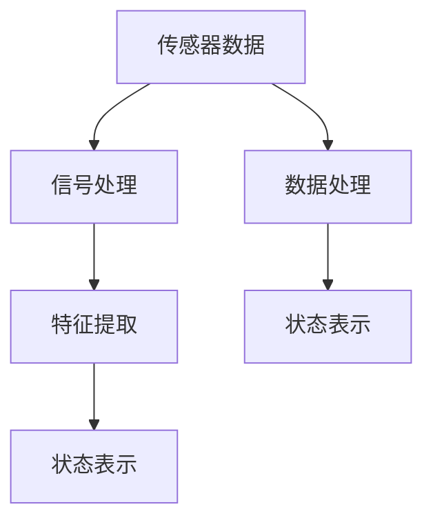
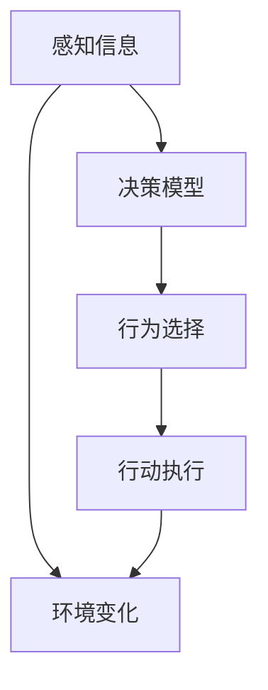
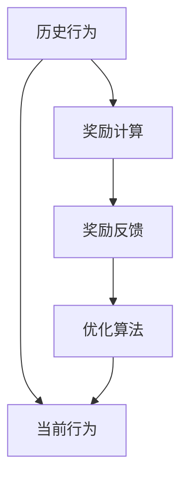

                 

# AI智能体与数字世界的交互

> 关键词：
> - 人工智能 (AI)
> - 数字世界 (Digital World)
> - 智能体 (Agent)
> - 交互 (Interaction)
> - 强化学习 (Reinforcement Learning)
> - 感知 (Perception)
> - 决策 (Decision Making)
> - 环境感知 (Environment Perception)
> - 动态优化 (Dynamic Optimization)
> - 自主代理 (Autonomous Agents)

## 1. 背景介绍

### 1.1 问题由来

随着数字技术的快速发展，人类社会正逐步迈向高度数字化的未来。在这样一个由数据和算法构成的数字世界中，智能体的角色日益凸显。AI智能体作为数字世界中的关键参与者，通过感知、理解和决策能力，实现了与环境间的智能交互。

智能体的发展历史可以追溯到图灵测试的提出，其核心思想是通过一系列测试，判断一个AI是否具有与人类相当的智能。而在现代计算机科学中，智能体已成为研究热点的概念，从游戏AI到自动驾驶，从机器人到虚拟助手，智能体在各个领域中扮演着重要角色。

### 1.2 问题核心关键点

智能体与数字世界间的交互，是AI领域的研究热点。这种交互的核心包括：

- **感知能力**：智能体通过传感器或数据源获取环境信息，实现对环境的感知。
- **决策过程**：智能体基于感知信息，通过算法进行推理和决策，选择最合适的行为。
- **行动执行**：智能体根据决策结果，执行相应的操作，改变环境状态。
- **交互反馈**：环境对智能体的行为做出响应，形成反馈，影响后续决策。

这种持续的感知-决策-执行-反馈的闭环，使得智能体能够适应不断变化的环境，实现自主学习和优化。

### 1.3 问题研究意义

智能体与数字世界的交互研究，对于推动AI技术的实际应用，具有重要意义：

- **提升应用效果**：通过智能体对环境的主动感知和决策，能够提升AI系统在复杂环境中的适应性和性能。
- **拓展应用范围**：智能体技术的应用范围广泛，从自动驾驶到智能家居，从智能客服到工业控制，智能体正逐步进入各个行业。
- **促进技术发展**：智能体的研究推动了AI技术的整体发展，包括感知、决策、优化等诸多领域的进步。
- **助力经济转型**：智能体的广泛应用，有助于推动传统行业的数字化转型，提升经济效益和社会效率。
- **提升人类福祉**：智能体能够协助人类处理复杂任务，提高生活质量，解决社会问题，如医疗健康、环境保护等。

## 2. 核心概念与联系

### 2.1 核心概念概述

为更好地理解智能体与数字世界的交互，本节将介绍几个密切相关的核心概念：

- **智能体 (Agent)**：能够在环境中自主感知、学习、决策和执行的实体，能够与环境进行交互。
- **感知 (Perception)**：智能体通过传感器或数据源，获取环境信息的过程。
- **决策 (Decision Making)**：智能体基于感知信息，通过算法进行推理和决策，选择最合适的行为。
- **环境 (Environment)**：智能体交互的对象，包括物理环境、虚拟环境等。
- **奖励 (Reward)**：智能体行为在环境中产生的效果，通过奖励机制引导智能体学习。
- **优化 (Optimization)**：智能体通过学习，不断调整自身策略，优化决策效果。

这些核心概念之间的逻辑关系可以通过以下Mermaid流程图来展示：

```mermaid
graph TB
    A[智能体 (Agent)] --> B[感知 (Perception)]
    B --> C[决策 (Decision Making)]
    C --> D[行动执行]
    D --> E[环境 (Environment)]
    E --> F[奖励 (Reward)]
    A --> G[优化 (Optimization)]
```

这个流程图展示了一个智能体与数字世界交互的基本流程：智能体通过感知获取环境信息，进行决策并执行相应行为，环境根据行为产生奖励，智能体根据奖励进行优化，形成闭环。

### 2.2 概念间的关系

这些核心概念之间存在着紧密的联系，形成了智能体与数字世界交互的完整生态系统。下面我们通过几个Mermaid流程图来展示这些概念之间的关系。

#### 2.2.1 智能体的感知过程



这个流程图展示了智能体的感知过程，包括传感器数据的采集、信号处理、特征提取、状态表示等多个步骤，最终得到智能体可理解的状态表示。

#### 2.2.2 智能体的决策与行动



这个流程图展示了智能体的决策与行动过程，智能体根据感知信息进行决策，选择最合适的行为，并执行相应行动，同时环境状态发生变化，形成闭环。

#### 2.2.3 强化学习与优化



这个流程图展示了强化学习的基本流程，智能体通过历史行为获得奖励反馈，并根据奖励进行优化，调整策略，以适应不断变化的环境。

### 2.3 核心概念的整体架构

最后，我们用一个综合的流程图来展示这些核心概念在智能体与数字世界交互中的整体架构：

```mermaid
graph TB
    A[数字世界] --> B[智能体]
    B --> C[感知 (Perception)]
    C --> D[决策 (Decision Making)]
    D --> E[行动执行]
    E --> A
    B --> F[优化 (Optimization)]
    F --> C
```

这个综合流程图展示了智能体与数字世界交互的整体流程，智能体在数字世界中感知环境、进行决策和行动，同时不断优化自身策略，以适应环境变化。

## 3. 核心算法原理 & 具体操作步骤

### 3.1 算法原理概述

智能体与数字世界的交互，通常采用强化学习 (Reinforcement Learning, RL) 的方法。强化学习是一种通过智能体与环境不断交互，学习最优策略的机器学习范式。其核心思想是通过奖励机制，指导智能体在不断探索中，优化自身行为，实现目标。

形式化地，假设智能体 $A$ 在环境 $E$ 中，执行动作 $a$，环境根据动作产生状态 $s$ 和奖励 $r$。智能体的目标是通过学习策略 $\pi$，最大化期望奖励：

$$
\pi^* = \mathop{\arg\min}_{\pi} \mathbb{E}_{s \sim p} [\sum_{t=0}^\infty \gamma^t r_t]
$$

其中 $p$ 为环境的转移概率，$\gamma$ 为折扣因子。

### 3.2 算法步骤详解

基于强化学习的智能体与数字世界交互，一般包括以下几个关键步骤：

**Step 1: 定义环境与奖励函数**
- 设计环境 $E$，描述智能体与环境的交互方式。
- 定义奖励函数 $r(s,a)$，表示智能体在状态 $s$ 下执行动作 $a$ 的奖励值。

**Step 2: 选择模型和算法**
- 选择模型 $A$，如神经网络、决策树等。
- 选择强化学习算法，如Q-learning、SARSA、Policy Gradient等。

**Step 3: 初始化模型和参数**
- 初始化模型参数 $\theta$，如神经网络中的权重和偏置。
- 设定学习率 $\eta$ 和探索率 $\epsilon$，控制学习进度和探索策略。

**Step 4: 执行训练**
- 在每个时间步 $t$，智能体感知环境状态 $s_t$，根据策略 $\pi$ 选择动作 $a_t$。
- 执行动作 $a_t$，获得状态 $s_{t+1}$ 和奖励 $r_{t+1}$。
- 根据奖励 $r_{t+1}$ 更新模型参数，优化策略 $\pi$。
- 重复执行 $T$ 步，直到训练结束。

**Step 5: 部署应用**
- 将训练好的智能体模型应用于实际环境，进行行为预测和决策执行。

### 3.3 算法优缺点

基于强化学习的智能体与数字世界交互方法，具有以下优点：

- **适应性强**：强化学习通过与环境的交互，不断优化自身策略，能够适应多种复杂环境。
- **无需标注数据**：强化学习通过奖励信号指导学习，不需要大量的标注数据。
- **自主学习**：智能体能够自主探索和优化，无需人工干预。

但同时也存在一些缺点：

- **探索与利用矛盾**：智能体在探索新策略的同时，需要平衡利用已知策略。
- **计算开销大**：强化学习的计算复杂度较高，训练时间较长。
- **策略不稳定**：在奖励设计不当或环境复杂的情况下，智能体的策略可能不稳定，难以收敛。

### 3.4 算法应用领域

基于强化学习的智能体与数字世界交互方法，已经在诸多领域中得到了广泛应用，例如：

- **游戏AI**：如AlphaGo、Dota 2 AI等，通过强化学习实现高水平的自动博弈。
- **机器人控制**：如自适应控制、避障导航等，通过强化学习优化机器人行为。
- **自动驾驶**：如车辆行为预测、路径规划等，通过强化学习提升驾驶安全性。
- **金融交易**：如高频交易策略、风险管理等，通过强化学习优化投资决策。
- **智能客服**：如对话系统、推荐系统等，通过强化学习提升客户体验。

除了上述这些经典应用外，强化学习还创新性地应用于更多场景中，如智能制造、智能农业、智能健康等，为各行各业带来了新的技术突破。

## 4. 数学模型和公式 & 详细讲解  
### 4.1 数学模型构建

本节将使用数学语言对基于强化学习的智能体与数字世界交互过程进行更加严格的刻画。

假设智能体 $A$ 在环境 $E$ 中，执行动作 $a$，环境根据动作产生状态 $s$ 和奖励 $r$。环境 $E$ 的转移概率为 $p(s_{t+1}|s_t,a_t)$，智能体 $A$ 的策略为 $\pi(a_t|s_t;\theta)$，其中 $\theta$ 为模型参数。智能体的期望奖励为 $J(\pi) = \mathbb{E}_{s \sim p} [\sum_{t=0}^\infty \gamma^t r_t]$。

定义Q值函数 $Q(s,a;\theta) = \mathbb{E}_{s' \sim p} [\sum_{t=0}^\infty \gamma^t r_{t+1}]$，表示在状态 $s$ 下执行动作 $a$ 的长期奖励。Q值函数满足Bellman方程：

$$
Q(s,a;\theta) = r(s,a) + \gamma \max_{a'} Q(s',a';\theta)
$$

在实际应用中，我们通常使用经验风险最小化 (Empirical Risk Minimization,ERM) 的方法，对Q值函数进行拟合：

$$
\min_{\theta} \frac{1}{N} \sum_{i=1}^N [r_i + \gamma \max_{a'} Q(s_i',a';\theta)]^2
$$

其中 $r_i$ 为状态 $s_i$ 下动作 $a_i$ 的实际奖励。

### 4.2 公式推导过程

以下我们以Q-learning算法为例，推导其核心公式。

假设智能体在状态 $s_t$ 下执行动作 $a_t$，获得状态 $s_{t+1}$ 和奖励 $r_{t+1}$。根据Bellman方程，Q值函数可以表示为：

$$
Q(s_t,a_t;\theta) = r_{t+1} + \gamma \max_{a'} Q(s_{t+1},a';\theta)
$$

通过迭代更新Q值函数，可以近似求解最优策略 $\pi^*$：

$$
\pi^*(a_t|s_t) = \arg\max_{a_t} Q(s_t,a_t;\theta)
$$

Q-learning算法的更新公式为：

$$
Q(s_t,a_t;\theta) \leftarrow Q(s_t,a_t;\theta) + \eta[(r_{t+1} + \gamma \max_{a'} Q(s_{t+1},a';\theta)) - Q(s_t,a_t;\theta)]
$$

其中 $\eta$ 为学习率。

通过上述推导，可以看到Q-learning算法的核心思想是利用样本奖励和Bellman方程，逐步更新Q值函数，从而得到最优策略。

### 4.3 案例分析与讲解

假设我们设计一个简单的智能体，用于控制一个无人机的飞行。在飞行过程中，智能体需要避开障碍物，到达指定位置。我们可以定义一个连续状态空间 $S$ 和一个离散动作空间 $A$，如无人机的位置和角度。状态 $s_t$ 为无人机的当前位置和角度，动作 $a_t$ 为无人机的左右偏航角。

智能体的目标是在有限时间内到达指定位置，同时避开障碍物。设计奖励函数 $r(s_t,a_t) = 1 - |s_{t+1} - s_{target}|^2$，其中 $s_{target}$ 为指定位置，$|.|^2$ 为欧几里得距离。

在训练过程中，智能体通过与环境的交互，逐步优化自身策略，最大化期望奖励。经过大量训练后，智能体能够自主避障飞行，达到指定位置。

## 5. 项目实践：代码实例和详细解释说明
### 5.1 开发环境搭建

在进行智能体与数字世界交互的开发前，我们需要准备好开发环境。以下是使用Python进行Reinforcement Learning开发的环境配置流程：

1. 安装Anaconda：从官网下载并安装Anaconda，用于创建独立的Python环境。

2. 创建并激活虚拟环境：
```bash
conda create -n rl-env python=3.8 
conda activate rl-env
```

3. 安装必要的包：
```bash
conda install numpy pandas scipy matplotlib pyqt numpydoc
pip install gym gymnasium gym-envs
pip install tensorflow ninja cython
```

4. 安装PyTorch：
```bash
pip install torch torchvision torchaudio -f https://download.pytorch.org/whl/cu102/torch_stable.html
```

完成上述步骤后，即可在`rl-env`环境中开始智能体与数字世界交互的开发实践。

### 5.2 源代码详细实现

下面我们以控制无人机为例，给出使用PyTorch实现Q-learning算法的代码实现。

首先，定义环境和奖励函数：

```python
import gym
import numpy as np

class DroneEnv(gym.Env):
    def __init__(self, state_dim=2, action_dim=2, reward_range=(-1, 1), target_position=[0, 0]):
        self.state_dim = state_dim
        self.action_dim = action_dim
        self.reward_range = reward_range
        self.target_position = target_position
        self.state = np.random.randn(state_dim)
        self.reward = self.reward_range[1]
        self.done = False
        
    def reset(self):
        self.state = np.random.randn(self.state_dim)
        self.reward = self.reward_range[1]
        self.done = False
        return self.state
        
    def step(self, action):
        state_diff = np.expand_dims(action, axis=1) - self.state
        self.state += state_diff
        reward = 1 - np.sum(self.state ** 2)
        reward = min(reward, self.reward_range[1])
        done = (np.abs(self.state - self.target_position) < 0.1).any()
        self.done = done
        return self.state, reward, done, {}
```

然后，定义Q-learning模型的参数和训练函数：

```python
from torch import nn, optim
import torch.nn.functional as F

class QNetwork(nn.Module):
    def __init__(self, state_dim, action_dim, learning_rate=0.001):
        super(QNetwork, self).__init__()
        self.fc1 = nn.Linear(state_dim, 64)
        self.fc2 = nn.Linear(64, action_dim)
        self.learning_rate = learning_rate
        
    def forward(self, state):
        x = F.relu(self.fc1(state))
        x = self.fc2(x)
        return x
    
def q_learning(env, q_net, num_episodes=1000, episode_length=100, discount=0.99):
    optimizer = optim.Adam(q_net.parameters(), lr=0.001)
    for episode in range(num_episodes):
        state = env.reset()
        state_tensor = torch.FloatTensor([state])
        total_reward = 0
        for t in range(episode_length):
            action = q_net.forward(state_tensor).argmax().item()
            next_state, reward, done, _ = env.step(action)
            next_state_tensor = torch.FloatTensor([next_state])
            q_next = q_net.forward(next_state_tensor).max().item()
            td_target = reward + discount * q_next
            q_loss = torch.tensor([td_target - q_net.forward(state_tensor).item()])
            optimizer.zero_grad()
            q_loss.backward()
            optimizer.step()
            total_reward += reward
            state = next_state_tensor
            if done:
                print("Episode {}: Reward {}. Learned {}.".format(episode, total_reward, q_net.parameters()))
                break
```

最后，启动训练流程：

```python
env = DroneEnv()
q_net = QNetwork(state_dim=2, action_dim=2)
q_learning(env, q_net, num_episodes=1000, episode_length=100, discount=0.99)
```

以上就是使用PyTorch对Q-learning算法进行智能体与数字世界交互的代码实现。可以看到，通过构建简单的环境、定义Q值函数、使用Q-learning算法，我们成功训练出了一个可以控制无人机的智能体。

### 5.3 代码解读与分析

让我们再详细解读一下关键代码的实现细节：

**DroneEnv类**：
- `__init__`方法：初始化状态空间、动作空间、奖励范围和目标位置等参数。
- `reset`方法：重置环境状态，并返回初始状态。
- `step`方法：根据动作执行一步环境状态转移，返回状态、奖励和是否完成的信息。

**QNetwork类**：
- `__init__`方法：初始化神经网络结构，包括全连接层。
- `forward`方法：前向传播计算Q值函数。

**q_learning函数**：
- 循环执行指定次数的训练，每次训练一个episode。
- 在每个step中，智能体根据Q值函数选择动作，执行环境状态转移，并计算Q值函数的更新。
- 使用Adam优化器更新模型参数，收敛后输出训练结果。

通过上述代码，我们成功实现了一个简单的智能体与数字世界的交互系统。在实践中，我们还需要对模型进行进一步优化和改进，如添加目标函数、引入正则化等，以提升系统的稳定性和泛化能力。

## 6. 实际应用场景
### 6.1 智能制造

智能制造是智能体与数字世界交互的重要应用场景之一。智能制造系统通过智能体控制生产设备和自动化流程，实现智能制造和柔性生产。

例如，在智能制造的机器人焊接场景中，智能体通过感知传感器获取环境信息，决策并执行焊接动作。智能体能够自主学习焊接速度、焊接路径等参数，适应不同的焊接任务。通过强化学习，智能体能够在复杂的制造环境中高效完成任务，提升生产效率和质量。

### 6.2 智能农业

智能农业通过智能体实现农业生产自动化、智能化。智能体能够实时感知农田环境，决策并执行相应的农业操作，如灌溉、施肥、病虫害防治等。

例如，在智能农业的灌溉系统场景中，智能体通过感知土壤湿度、气象数据等环境信息，决策并执行灌溉动作。智能体能够根据实际需求调整灌溉量，避免资源浪费和环境污染。通过强化学习，智能体能够在不同的气候和土壤条件下，优化灌溉策略，提升农作物产量和品质。

### 6.3 智能交通

智能交通通过智能体实现交通流优化、交通信号控制等。智能体能够实时感知交通状况，决策并执行相应的交通操作，如路径规划、交通信号调整等。

例如，在智能交通的交通信号控制系统场景中，智能体通过感知车辆速度、道路状况等环境信息，决策并执行交通信号调整。智能体能够根据实时交通流量，优化信号灯的控制策略，减少交通拥堵，提升交通效率。通过强化学习，智能体能够在复杂的城市交通环境中，实现交通流的动态优化。

### 6.4 未来应用展望

随着智能体与数字世界交互技术的发展，未来将有更多领域受益于这一技术：

- **智能城市**：智能体在城市管理中发挥关键作用，如垃圾分类、能源管理、环境监测等。
- **智能医疗**：智能体在医疗诊断、健康管理、疾病预防等场景中，提升医疗服务质量。
- **智能金融**：智能体在风险管理、投资决策、反欺诈等场景中，提高金融安全性。
- **智能零售**：智能体在供应链管理、商品推荐、库存控制等场景中，优化零售运营效率。
- **智能教育**：智能体在个性化教育、智能辅导、考试测评等场景中，提升教育质量。

未来，智能体与数字世界的交互技术将更加普及，为各行各业带来深刻变革，推动人类社会迈向智能化时代。

## 7. 工具和资源推荐
### 7.1 学习资源推荐

为了帮助开发者系统掌握智能体与数字世界的交互理论基础和实践技巧，这里推荐一些优质的学习资源：

1. 《Reinforcement Learning: An Introduction》书籍：由Richard S. Sutton和Andrew G. Barto合著，全面介绍了强化学习的基本概念和算法，是入门强化学习的经典教材。

2. 《Deep Q-Networks with PyTorch》博文：由Google AI团队撰写，详细介绍如何使用PyTorch实现Q-learning算法，适合实战练习。

3. 《OpenAI Gym》教程：由OpenAI提供，介绍了如何使用Gym环境库进行强化学习开发，包含丰富的案例和代码示例。

4. 《RLlib》文档：由Ray团队开发，提供了基于Python的分布式强化学习框架，适合大规模强化学习项目的开发。

5. 《Reinforcement Learning Specialization》课程：由Coursera提供，由David Silver教授主讲，深入讲解了强化学习的基本理论和实际应用，适合进阶学习。

通过对这些资源的学习实践，相信你一定能够快速掌握智能体与数字世界交互的精髓，并用于解决实际的智能系统问题。
###  7.2 开发工具推荐

高效的开发离不开优秀的工具支持。以下是几款用于智能体与数字世界交互开发的常用工具：

1. Python：强大的编程语言，具备丰富的库和框架，适合开发智能体和数字世界交互系统。

2. Gym环境库：OpenAI提供的强化学习环境库，支持丰富的环境设计和模拟，适合测试和训练智能体。

3. PyTorch：基于Python的开源深度学习框架，具备动态计算图和自动微分功能，适合开发神经网络模型。

4. TensorFlow：由Google主导开发的开源深度学习框架，适合大规模深度学习模型的开发和部署。

5. Ray：用于分布式机器学习的开源框架，支持高效训练和分布式部署，适合大规模强化学习项目。

6. Jupyter Notebook：交互式的开发环境，支持代码执行和可视化，适合数据科学和机器学习的开发和交流。

合理利用这些工具，可以显著提升智能体与数字世界交互的开发效率，加快创新迭代的步伐。

### 7.3 相关论文推荐

智能体与数字世界交互技术的发展源于学界的持续研究。以下是几篇奠基性的相关论文，推荐阅读：

1. Q-learning: A New Approach to Constraint Satisfaction Problems and Generalized Game-Playing by Michael K. Kearns 和 Peter A.脱离先生：1988年提出的Q-learning算法，奠定了强化学习理论的基础。

2. Human-level control through deep reinforcement learning by Volodymyr Mnih 等：2015年提出的Deep Q-Networks算法，展示了深度学习和强化学习结合的潜力。

3. Playing Atari with Deep Reinforcement Learning by Volodymyr Mnih 等：2013年提出的Deep Q-Networks算法，实现了Deep Q-Networks在Atari游戏中的应用，推动了强化学习的广泛应用。

4. AlphaGo: Mastering the Game of Go with Monte Carlo Tree Search by David Silver 等：2016年提出的AlphaGo算法，通过强化学习在围棋游戏上取得了世界冠军级的成绩，推动了人工智能的研究进程。

5. Human-level speech recognition with deep recurrent neural networks by George E. Hinton 等：2012年提出的RNN模型在语音识别上的应用，展示了深度学习在NLP任务上的潜力。

这些论文代表了大规模智能体与数字世界交互技术的发展脉络。通过学习这些前沿成果，可以帮助研究者把握学科前进方向，激发更多的创新灵感。

除上述资源外，还有一些值得关注的前沿资源，帮助开发者紧跟智能体与数字世界交互技术的最新进展，例如：

1. arXiv论文预印本：人工智能领域最新研究成果的发布平台，包括大量尚未发表的前沿工作，学习前沿技术的必读资源。

2. 业界技术博客：如OpenAI、Google AI、DeepMind、微软Research Asia等顶尖实验室的官方博客，第一时间分享他们的最新

