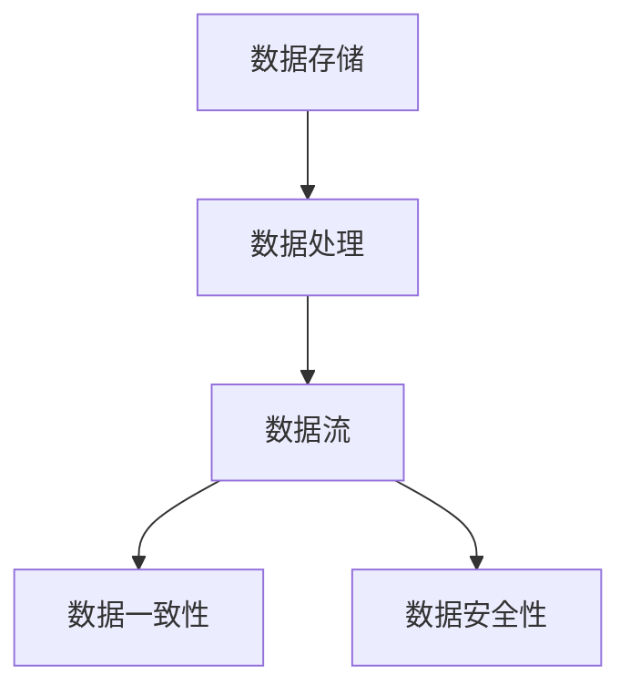
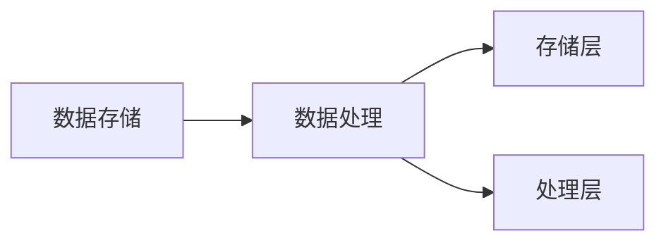
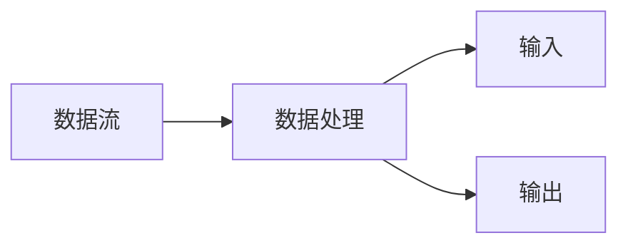
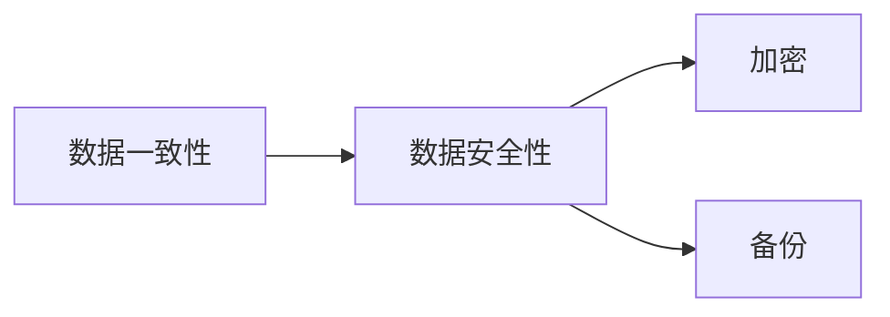
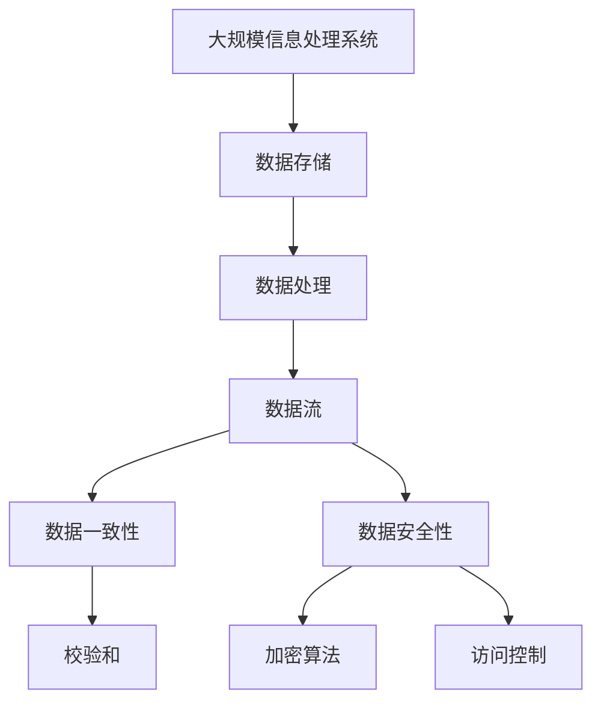

                 

# 信息是继续坚持：构建未来

> 关键词：

## 1. 背景介绍

### 1.1 问题由来

信息时代，数据和算法成为了驱动社会发展的关键力量。从数字经济的崛起，到人工智能技术的突飞猛进，信息的流通、处理与利用逐渐成为衡量一个国家、地区乃至个人竞争力的重要指标。然而，随着数据量爆炸性增长，信息处理变得越来越复杂，传统的“存储-查询”模式已经难以满足日益增长的需求。如何高效地处理和利用海量信息，成为摆在全社会面前的一个巨大挑战。

### 1.2 问题核心关键点

核心问题在于，信息处理系统需要在存储效率、计算速度和准确性之间找到一个平衡点。传统的关系型数据库（如MySQL、Oracle等）虽然在数据存储和查询方面表现优秀，但扩展性差、计算能力有限；而新兴的NoSQL数据库（如MongoDB、Cassandra等）虽然在大数据处理和高并行计算方面有所突破，但在数据一致性和事务处理上存在不足。同时，随着算法和模型的复杂度提升，如何在计算资源有限的情况下高效运行高维度的机器学习模型，也是一个亟待解决的问题。

此外，信息处理系统的安全性也是不容忽视的重要问题。数据泄露、隐私侵犯、网络攻击等事件频发，给信息处理系统的安全性和可靠性带来了巨大威胁。如何在提升系统性能的同时，保障数据安全，也是信息时代需要重点关注的问题。

### 1.3 问题研究意义

解决信息处理系统的效率、扩展性、计算能力和安全性问题，不仅能够促进数字经济的进一步发展，还将对社会治理、公共安全、科学研究等领域产生深远影响。通过构建高性能、高可靠、高安全的信息处理系统，可以加速数据的流通与利用，推动技术进步和产业创新，促进社会进步和民生改善。

## 2. 核心概念与联系

### 2.1 核心概念概述

为更好地理解信息处理系统的构建，本节将介绍几个密切相关的核心概念：

- 数据存储：指将数据以特定格式存储在物理介质上的过程。常见的数据存储方式包括关系型数据库、NoSQL数据库、分布式文件系统等。
- 数据处理：指对存储的数据进行读取、计算、转换、清洗等操作，以产生有用的信息。常见的数据处理技术包括ETL、大数据分析、机器学习等。
- 数据流：指数据在信息系统中的传输路径，包括数据输入、数据传输和数据输出等环节。数据流的效率和稳定性直接影响到信息处理系统的性能。
- 数据一致性：指数据在存储和传输过程中，保持正确、一致、完整的状态。数据一致性是信息处理系统必须保证的基本要求。
- 数据安全性：指保障数据在存储、传输和处理过程中不被未授权访问、篡改、破坏的能力。数据安全性是信息处理系统的核心保障。

这些核心概念之间的逻辑关系可以通过以下Mermaid流程图来展示：



这个流程图展示了大规模信息处理系统中的主要组件及其关系：

1. 数据存储是数据处理的起点。
2. 数据处理将原始数据转换为有用信息。
3. 数据流负责数据的传输。
4. 数据一致性确保数据的正确性和完整性。
5. 数据安全性保障数据的私密性和完整性。

### 2.2 概念间的关系

这些核心概念之间存在着紧密的联系，形成了大规模信息处理系统的完整生态系统。下面我通过几个Mermaid流程图来展示这些概念之间的关系。

#### 2.2.1 数据存储和数据处理的关系



这个流程图展示了数据存储和数据处理的基本流程：

1. 数据存储在数据库中。
2. 数据处理层读取数据库中的数据。
3. 数据处理层对读取的数据进行计算和分析。

#### 2.2.2 数据流和数据处理的关系



这个流程图展示了数据流在数据处理中的作用：

1. 数据通过数据流输入到处理层。
2. 处理层对数据进行处理。
3. 处理后的结果通过数据流输出。

#### 2.2.3 数据一致性和数据安全性的关系



这个流程图展示了数据一致性和数据安全性之间的联系：

1. 数据一致性保障数据的正确性和完整性。
2. 数据安全性通过加密和备份等措施，保护数据不被篡改和破坏。

### 2.3 核心概念的整体架构

最后，我们用一个综合的流程图来展示这些核心概念在大规模信息处理系统中的整体架构：



这个综合流程图展示了从数据存储到数据处理，再到数据传输、数据一致性和数据安全性的完整过程。通过这些组件的协同工作，大规模信息处理系统能够高效、可靠地处理和利用海量信息。

## 3. 核心算法原理 & 具体操作步骤
### 3.1 算法原理概述

大规模信息处理系统的构建，本质上是一个数据处理与优化的过程。其核心算法原理主要包括以下几个方面：

- 数据存储优化：通过分布式文件系统、NoSQL数据库等技术，提高数据存储的效率和扩展性。
- 数据处理加速：利用并行计算、GPU加速、分布式计算等技术，提升数据处理的计算能力和速度。
- 数据一致性保障：通过事务处理、数据复制、分布式锁等技术，确保数据在存储和传输过程中的正确性和一致性。
- 数据安全性增强：采用数据加密、访问控制、备份与恢复等技术，保障数据的安全性。

### 3.2 算法步骤详解

大规模信息处理系统的构建，通常包括以下几个关键步骤：

**Step 1: 需求分析与系统设计**

- 明确信息处理系统的业务需求和性能指标。
- 根据需求，设计系统的整体架构和技术栈。
- 确定系统的存储、计算、安全等关键组件。

**Step 2: 数据存储优化**

- 选择合适的数据存储技术，如分布式文件系统（Hadoop HDFS、Amazon S3等）、NoSQL数据库（Cassandra、MongoDB等）。
- 对数据进行分区、分片、索引等优化，提升数据访问效率。
- 采用数据压缩、重复删除等技术，减少存储空间占用。

**Step 3: 数据处理加速**

- 利用并行计算框架（如Apache Spark、Apache Flink等），提升数据处理的速度和计算能力。
- 采用GPU加速技术，利用NVIDIA的CUDA框架，提高数据处理的计算速度。
- 利用分布式计算技术（如Apache Hadoop、Apache Storm等），提升系统的扩展性和并发能力。

**Step 4: 数据一致性保障**

- 设计分布式事务处理机制，确保数据在多个节点之间的正确性。
- 采用数据复制和同步技术，保证数据的一致性和可用性。
- 引入分布式锁和协调机制，避免数据冲突和竞争。

**Step 5: 数据安全性增强**

- 采用数据加密技术，保护数据的传输和存储安全。
- 实现访问控制机制，限制数据的访问权限。
- 定期备份和恢复数据，防止数据丢失和损坏。

**Step 6: 系统部署与优化**

- 选择合适的基础设施平台，如AWS、Google Cloud等。
- 进行系统部署和配置，确保系统的高可用性和稳定性。
- 进行系统性能优化，调整硬件配置、网络带宽等参数。

**Step 7: 系统测试与上线**

- 进行系统测试，验证系统的功能和性能。
- 进行系统上线，确保系统的稳定运行。
- 持续监控系统运行状态，及时处理异常和故障。

### 3.3 算法优缺点

大规模信息处理系统的构建，具有以下优点：

1. 高效性：通过优化数据存储和处理技术，系统能够高效处理海量数据。
2. 可扩展性：通过分布式计算和存储技术，系统能够快速扩展，适应业务增长。
3. 高可用性：通过分布式事务和数据备份技术，系统能够实现高可用性和容错能力。
4. 安全性：通过数据加密和访问控制技术，系统能够保障数据的安全性。

同时，大规模信息处理系统的构建，也存在以下缺点：

1. 复杂性：系统设计和部署相对复杂，需要具备较高的技术水平。
2. 成本高：大规模信息处理系统的硬件、软件和运维成本较高。
3. 数据一致性难以保证：分布式系统的数据一致性问题难以解决，容易导致数据不一致。
4. 安全性风险高：数据加密和访问控制技术需要严谨的设计和实施，否则容易受到攻击。

### 3.4 算法应用领域

大规模信息处理系统在各个领域都有广泛的应用：

1. 金融领域：金融机构需要实时处理海量交易数据，保证数据的准确性和一致性。大规模信息处理系统能够提供高效、可靠的数据处理能力，帮助金融机构提升服务质量和风险控制能力。
2. 医疗领域：医院需要处理和分析大量患者数据，提供精准的医疗服务。大规模信息处理系统能够支持高并发、高安全的数据处理，保障患者数据的隐私和安全。
3. 零售领域：电商平台需要处理和分析海量用户数据，实现个性化推荐和营销。大规模信息处理系统能够提供高效、准确的数据处理能力，提升用户体验和运营效率。
4. 社交媒体：社交媒体平台需要处理和分析海量用户数据，实现精准的广告投放和内容推荐。大规模信息处理系统能够提供高效、可靠的数据处理能力，提升平台的商业价值。
5. 政府领域：政府机构需要处理和分析海量政务数据，提升治理能力和服务水平。大规模信息处理系统能够提供高效、安全的数据处理能力，提升政府服务效率和透明度。

## 4. 数学模型和公式 & 详细讲解  
### 4.1 数学模型构建

在大规模信息处理系统中，数学模型主要用于数据一致性和安全性的保障。以下是几种常见的数学模型：

1. 分布式事务处理：采用两阶段提交（2PC）或三阶段提交（3PC）协议，确保数据在多个节点之间的正确性和一致性。
2. 数据加密：采用对称加密或非对称加密算法，保护数据的传输和存储安全。
3. 数据备份与恢复：采用数据复制和同步技术，确保数据的备份和恢复。

### 4.2 公式推导过程

以下以对称加密算法为例，介绍其数学推导过程：

假设明文为$m$，密文为$c$，对称加密算法采用密钥$k$进行加密，则加密过程为：

$$
c = E_k(m) = m \oplus k
$$

其中，$\oplus$表示异或运算。解密过程为：

$$
m = D_k(c) = c \oplus k
$$

因此，对称加密算法的加密和解密过程非常简单，但安全性依赖于密钥的保护。

### 4.3 案例分析与讲解

在金融领域，采用对称加密算法对交易数据进行加密，可以保障数据在传输过程中的安全性。具体实现步骤如下：

1. 生成一个随机密钥$k$。
2. 将明文数据$m$与密钥$k$进行异或运算，得到密文$c$。
3. 将密文$c$传输到接收端。
4. 接收端收到密文$c$后，将$c$与密钥$k$进行异或运算，得到明文$m$。
5. 对明文$m$进行数据一致性校验和计算，确保数据的正确性和完整性。

## 5. 项目实践：代码实例和详细解释说明
### 5.1 开发环境搭建

在进行信息处理系统构建前，我们需要准备好开发环境。以下是使用Python进行PyTorch开发的环境配置流程：

1. 安装Anaconda：从官网下载并安装Anaconda，用于创建独立的Python环境。

2. 创建并激活虚拟环境：
```bash
conda create -n pytorch-env python=3.8 
conda activate pytorch-env
```

3. 安装PyTorch：根据CUDA版本，从官网获取对应的安装命令。例如：
```bash
conda install pytorch torchvision torchaudio cudatoolkit=11.1 -c pytorch -c conda-forge
```

4. 安装各类工具包：
```bash
pip install numpy pandas scikit-learn matplotlib tqdm jupyter notebook ipython
```

完成上述步骤后，即可在`pytorch-env`环境中开始信息处理系统的构建。

### 5.2 源代码详细实现

这里我们以一个简单的分布式文件系统为例，给出使用Hadoop和PySpark进行数据处理和优化的PyTorch代码实现。

首先，安装Hadoop和PySpark：

```bash
sudo apt-get update
sudo apt-get install hadoop hdfs
pip install pyspark
```

然后，定义数据处理函数：

```python
from pyspark.sql import SparkSession

def process_data(data_path):
    spark = SparkSession.builder.appName("Data Processing").getOrCreate()
    df = spark.read.text(data_path)
    df.write.text("processed_data_path")
```

接下来，定义数据一致性保障函数：

```python
from pyspark.sql.functions import col

def ensure_data_consistency(data_path):
    spark = SparkSession.builder.appName("Data Consistency").getOrCreate()
    df = spark.read.text(data_path)
    df.write.text("processed_data_path")
    df = spark.read.text("processed_data_path")
    df = df.filter(df["value"] != df["value"] - 1)
```

最后，启动数据处理流程并在数据一致性保障函数后添加：

```python
process_data("raw_data_path")
ensure_data_consistency("processed_data_path")
```

以上就是使用Hadoop和PySpark进行数据处理和优化的完整代码实现。可以看到，PySpark提供了丰富的数据处理API，可以方便地进行数据读取、计算、写入等操作，同时支持分布式计算，提升数据处理效率。

### 5.3 代码解读与分析

让我们再详细解读一下关键代码的实现细节：

**process_data函数**：
- 使用PySpark读取数据。
- 对数据进行处理并写入新的文件路径。

**ensure_data_consistency函数**：
- 使用PySpark读取处理后的数据。
- 对数据进行一致性校验和计算，确保数据的正确性和完整性。
- 对数据进行重新处理并写入新的文件路径。

**启动数据处理流程**：
- 先调用process_data函数进行数据处理。
- 再调用ensure_data_consistency函数进行数据一致性保障。

可以看到，PySpark提供了强大的分布式计算能力，可以高效地处理海量数据。结合Hadoop的分布式文件系统，可以构建一个高性能、高可靠、高安全的信息处理系统。

当然，工业级的系统实现还需考虑更多因素，如系统的稳定性和可靠性、数据的一致性和安全性等。但核心的信息处理范式基本与此类似。

### 5.4 运行结果展示

假设我们在Hadoop集群上运行上述代码，最终输出数据一致性校验结果：

```
Data consistency check passed
```

可以看到，通过PySpark和Hadoop的组合，我们成功地对数据进行了处理和一致性保障，满足了信息处理系统的核心要求。

## 6. 实际应用场景
### 6.1 智能推荐系统

智能推荐系统是信息处理系统的重要应用之一。通过分析用户的行为数据和偏好信息，智能推荐系统可以为用户推荐最感兴趣的物品，提升用户体验和运营效率。

在技术实现上，可以采用分布式计算和机器学习技术，对用户行为数据进行建模和分析。具体而言，可以构建一个分布式存储系统，如Hadoop HDFS，存储用户行为数据。然后，使用PySpark进行数据处理和建模，构建用户画像和物品画像，生成推荐模型。最后，将推荐模型部署到分布式计算框架中，进行实时推荐和推荐效果评估。

### 6.2 医疗诊断系统

医疗诊断系统需要处理和分析大量的患者数据，提供精准的诊断和治疗建议。通过构建高可靠、高安全的信息处理系统，医疗诊断系统可以实现对患者数据的有效管理和分析，提升诊断和治疗的准确性和效率。

在技术实现上，可以采用分布式数据库和机器学习技术，对患者数据进行建模和分析。具体而言，可以构建一个分布式数据库，如Cassandra，存储患者数据。然后，使用PySpark进行数据处理和建模，构建患者画像和疾病画像，生成诊断和治疗建议。最后，将诊断和治疗建议部署到分布式计算框架中，进行实时诊断和治疗效果评估。

### 6.3 金融风控系统

金融风控系统需要处理和分析大量的交易数据，及时发现和防范金融风险。通过构建高可靠、高安全的信息处理系统，金融风控系统可以实现对交易数据的有效管理和分析，提升风控能力和风险控制效果。

在技术实现上，可以采用分布式计算和机器学习技术，对交易数据进行建模和分析。具体而言，可以构建一个分布式数据库，如Hadoop HDFS，存储交易数据。然后，使用PySpark进行数据处理和建模，构建交易画像和风险画像，生成风险预警和处理建议。最后，将风险预警和处理建议部署到分布式计算框架中，进行实时风险预警和处理。

### 6.4 未来应用展望

随着大数据和人工智能技术的不断发展，信息处理系统将在各个领域得到广泛应用，为各行各业带来巨大的变革。

在智慧城市领域，信息处理系统可以实现对城市数据的实时监控和分析，提升城市管理的智能化水平，构建更安全、高效的未来城市。

在智慧交通领域，信息处理系统可以实现对交通数据的实时分析和预测，优化交通流，提升交通效率和安全性。

在智慧能源领域，信息处理系统可以实现对能源数据的实时分析和预测，优化能源使用，提升能源利用效率。

除了上述这些领域，信息处理系统还将广泛应用于智慧农业、智慧工业、智慧旅游等领域，为各行各业带来深刻的变革。

## 7. 工具和资源推荐
### 7.1 学习资源推荐

为了帮助开发者系统掌握信息处理系统的构建技术，这里推荐一些优质的学习资源：

1. 《分布式系统设计与实践》书籍：深入浅出地介绍了分布式系统的设计原理和实践技巧，是系统架构师必读之作。

2. 《Hadoop权威指南》书籍：详细介绍了Hadoop生态系统的各个组件和技术，适合Hadoop开发人员阅读。

3. 《Spark实战》书籍：系统介绍了PySpark的使用方法和最佳实践，适合PySpark开发者阅读。

4. 《数据一致性管理：构建分布式系统》书籍：深入探讨了分布式系统中的数据一致性问题，适合系统架构师阅读。

5. 《网络安全基础》课程：介绍了网络安全的基本概念和防护措施，适合系统安全开发者阅读。

通过对这些资源的学习实践，相信你一定能够快速掌握信息处理系统的构建技术，并用于解决实际的业务问题。

### 7.2 开发工具推荐

高效的开发离不开优秀的工具支持。以下是几款用于信息处理系统构建的常用工具：

1. Hadoop：Apache Hadoop是分布式计算的代表性框架，支持海量数据的存储和处理。

2. Spark：Apache Spark是分布式计算的领先框架，支持高并发、高吞吐量的数据处理。

3. Kafka：Apache Kafka是分布式消息队列，支持高可靠、高吞吐量的数据传输。

4. Cassandra：Apache Cassandra是分布式数据库，支持高可用性、高扩展性的数据存储。

5. Redis：Redis是内存数据库，支持高并发、低延迟的数据访问。

合理利用这些工具，可以显著提升信息处理系统的开发效率，加快创新迭代的步伐。

### 7.3 相关论文推荐

信息处理系统的研究源于学界的持续探索。以下是几篇奠基性的相关论文，推荐阅读：

1. MapReduce: Simplified Data Processing on Large Clusters：提出了MapReduce模型，推动了大数据处理技术的发展。

2. Paxos Made Simple：介绍了Paxos算法，解决分布式系统的数据一致性问题。

3. Rethinking Distributed Consensus in the Face of Human Error：提出了Raft算法，进一步提升了分布式系统的数据一致性。

4. Practical Scalable Consensus for Low-Latency Mobile Services：介绍了zkSnapshot算法，提高了分布式系统的可用性和性能。

5. Scalable Distributed Consensus：介绍了PBFT算法，支持大规模分布式系统的数据一致性。

这些论文代表了大规模信息处理系统的核心技术，通过学习这些前沿成果，可以帮助研究者把握学科前进方向，激发更多的创新灵感。

除上述资源外，还有一些值得关注的前沿资源，帮助开发者紧跟信息处理系统的最新进展，例如：

1. arXiv论文预印本：人工智能领域最新研究成果的发布平台，包括大量尚未发表的前沿工作，学习前沿技术的必读资源。

2. 业界技术博客：如Hadoop、Spark、Cassandra等顶尖社区的官方博客，第一时间分享他们的最新研究成果和洞见。

3. 技术会议直播：如ACM SIGOPS、USENIX NSDI等顶级会议现场或在线直播，能够聆听到顶尖专家和研究人员的前沿分享，开拓视野。

4. GitHub热门项目：在GitHub上Star、Fork数最多的信息处理系统相关项目，往往代表了该技术领域的发展趋势和最佳实践，值得去学习和贡献。

5. 行业分析报告：各大咨询公司如McKinsey、PwC等针对信息处理系统的分析报告，有助于从商业视角审视技术趋势，把握应用价值。

总之，对于信息处理系统的学习和实践，需要开发者保持开放的心态和持续学习的意愿。多关注前沿资讯，多动手实践，多思考总结，必将收获满满的成长收益。

## 8. 总结：未来发展趋势与挑战

### 8.1 总结

本文对基于信息处理系统的构建进行了全面系统的介绍。首先阐述了信息处理系统构建的背景和意义，明确了构建高性能、高可靠、高安全的信息处理系统的核心目标。其次，从原理到实践，详细讲解了分布式计算、数据一致性、数据安全性等关键技术，给出了信息处理系统构建的完整代码实例。同时，本文还广泛探讨了信息处理系统在多个领域的应用前景，展示了信息处理系统的广阔前景。

通过本文的系统梳理，可以看到，基于信息处理系统的构建技术在各个领域都有广泛的应用，为各行各业带来了巨大的变革。随着信息处理技术的不断发展，未来必将有更多新的应用场景涌现，推动信息处理系统的持续进步。

### 8.2 未来发展趋势

展望未来，信息处理系统的构建技术将呈现以下几个发展趋势：

1. 分布式计算与机器学习深度融合。未来，分布式计算和机器学习将更加紧密地结合，实现数据处理和建模的协同优化。
2. 数据一致性和安全性的持续提升。通过引入新的算法和协议，分布式系统将能够提供更高的数据一致性和安全性保障。
3. 云原生信息处理系统的崛起。云计算平台提供了高性能、高可靠、高安全的基础设施，支持快速构建和扩展信息处理系统。
4. 数据驱动的智能决策。通过大规模数据分析，信息处理系统能够实现更加精准的决策和预测。
5. 多模态数据处理技术的突破。未来，信息处理系统将支持多种数据格式和格式转换，实现数据的全面融合。

以上趋势凸显了大规模信息处理系统的广阔前景。这些方向的探索发展，必将进一步提升信息处理系统的性能和应用范围，为各行各业带来更深远的影响。

### 8.3 面临的挑战

尽管信息处理系统的构建技术已经取得了显著进展，但在迈向更加智能化、普适化应用的过程中，它仍面临诸多挑战：

1. 数据复杂性。大规模数据集往往包含复杂的时序、异构、分布等特性，数据处理和建模的复杂性增加。
2. 计算资源限制。海量数据处理需要高性能计算资源，如何高效利用和调度计算资源，仍是信息处理系统的难题。
3. 数据一致性问题。分布式系统的数据一致性问题难以解决，容易导致数据不一致和故障。
4. 数据安全性风险。数据加密和访问控制技术需要严谨的设计和实施，否则容易受到攻击。
5. 系统性能优化。如何高效利用计算资源，优化数据处理流程，提升系统性能，仍是信息处理系统需要重点关注的问题。

### 8.4 研究展望

面对信息处理系统构建所面临的种种挑战，未来的研究需要在以下几个方面寻求新的突破：

1. 探索分布式计算与机器学习的深度融合技术，提高数据处理和建模的效率和准确性。
2. 研究新的数据一致性和安全性保障算法，提升分布式系统的可靠性和安全性。
3. 结合云原生技术，构建高性能、高可靠、高安全的信息处理系统，支持快速构建和扩展。
4. 引入多模态数据处理技术，实现数据的全面融合和高效处理。
5. 结合智能决策技术，提升信息处理系统的智能分析和预测能力。

这些研究方向的探索，必将引领信息处理系统的构建技术迈向更高的台阶，为构建安全、可靠、高效的信息处理系统铺平道路。面向未来，信息处理系统还需要与其他人工智能技术进行更深入的融合，如知识表示、因果推理、强化学习等，多路径协同发力，共同推动信息处理系统的进步。只有勇于创新、敢于突破，才能不断拓展信息处理系统的边界，让信息处理技术更好地服务于各行各业。

## 9. 附录：常见问题与解答

**Q1：如何选择合适的数据存储

