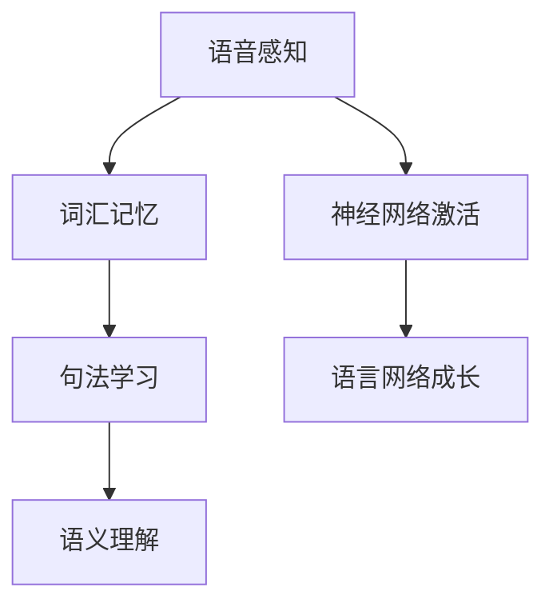
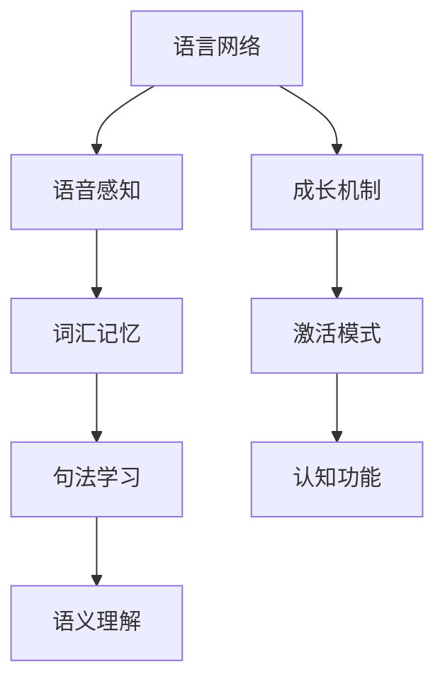
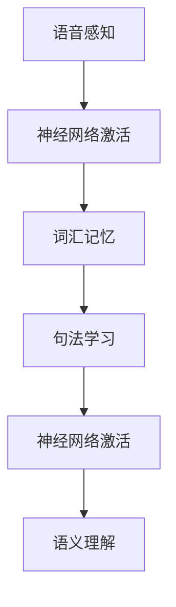

                 

# 儿童学习语言时，语言网络是如何成长的？

儿童学习语言是一个复杂的过程，涉及多个阶段和多种认知机制的协同工作。本文将深入探讨这一过程，并从神经科学和认知科学的视角，分析儿童学习语言时大脑中的语言网络是如何成长的。

## 1. 背景介绍

### 1.1 问题由来

儿童的语言发展一直是心理学和神经科学研究的热点。随着神经成像技术的进步，研究者们能够以前所未有的方式，观察到儿童学习语言时大脑激活的神经网络。这些研究揭示了儿童学习语言所依赖的神经机制，以及这些机制如何随着年龄的增长而发展和变化。

### 1.2 问题核心关键点

儿童学习语言的过程可以分为几个关键阶段：

- **语言习得初期（0-1岁）**：主要依赖听觉输入，婴儿开始识别语音和音节，形成最初的语音感知能力。
- **单词识别阶段（1-2岁）**：儿童开始将听到的音节与具体的物体或动作对应起来，形成词汇记忆。
- **语法学习阶段（2-3岁）**：儿童开始学习语言的语法结构，如动词时态、主谓宾等，形成句法规则意识。
- **高级语言运用阶段（3岁以上）**：儿童开始运用语言进行交流，理解复杂句子结构，掌握语义理解能力。

每个阶段都涉及大脑特定区域和神经网络的发展和激活。

## 2. 核心概念与联系

### 2.1 核心概念概述

为更好地理解儿童学习语言时语言网络的成长机制，本节将介绍几个关键概念：

- **语言网络（Language Network）**：指与语言理解和生成相关的神经网络，包括大脑中的语言处理区域，如布罗卡区（Broca's Area）、韦尼克区（Wernicke's Area）等。
- **语音感知（Phonological Perception）**：儿童对语音的识别和区分能力，是语言学习的第一步。
- **词汇记忆（Vocabulary Memory）**：儿童对单词的识别和记忆，是语言理解和表达的基础。
- **句法学习（Syntactic Learning）**：儿童对语言语法结构的理解和应用，包括词序、时态、人称等。
- **语义理解（Semantic Understanding）**：儿童对语言意义的理解和推断，能够运用语言进行复杂思维和交流。

### 2.2 核心概念的关系

这些概念之间存在着密切的联系，通过神经网络的协同工作，儿童逐步建立起复杂而高效的语言能力。以下是一个Mermaid流程图，展示语言网络中各个部分之间的关系：



这个流程图展示了儿童学习语言过程中，各个概念和神经网络如何逐步建立和发展。

### 2.3 核心概念的整体架构

最后，我们用一个综合的流程图来展示语言网络在儿童学习语言过程中的整体发展路径：



这个流程图展示了语言网络在儿童学习语言过程中逐步成长和发展的全过程，以及每个阶段所依赖的神经机制和激活模式。

## 3. 核心算法原理 & 具体操作步骤
### 3.1 算法原理概述

儿童学习语言的过程，可以通过一系列算法来模拟和解释。这些算法基于神经科学和认知科学的研究，试图揭示语言发展的内在机制。

### 3.2 算法步骤详解

儿童学习语言的大致步骤如下：

1. **语音感知算法**：通过听觉输入，儿童学习识别和区分不同语音和音节。
2. **词汇记忆算法**：将听到的语音和音节与具体的物体或动作对应起来，形成词汇记忆。
3. **句法学习算法**：理解语言的基本语法结构，如动词时态、主谓宾等。
4. **语义理解算法**：理解语言的意义，能够运用语言进行复杂的思维和交流。

这些算法的实现，需要依赖于大脑中特定的神经网络区域和机制。以下是一个简化的流程图，展示这些算法的执行步骤：



### 3.3 算法优缺点

儿童学习语言算法具有以下优点：

- **数据驱动**：基于神经科学和认知科学的研究数据，具有较高的准确性和科学依据。
- **可解释性**：每个步骤和机制都有明确的神经基础，能够解释儿童语言发展背后的内在机制。

但这些算法也存在一些局限性：

- **复杂性**：儿童语言发展的过程非常复杂，涉及多个阶段和多种机制，算法需要综合考虑这些因素。
- **个体差异**：不同儿童的语言发展速度和路径存在差异，算法可能难以全面覆盖所有情况。

### 3.4 算法应用领域

这些算法在语言学、神经科学、认知科学等多个领域都有广泛的应用。以下是一些具体的应用场景：

- **语言障碍研究**：帮助理解语言障碍的神经机制，如自闭症、语言发育迟缓等。
- **教育心理学**：指导儿童语言教育的最佳实践，优化教学方法和策略。
- **认知神经科学**：研究大脑中的语言处理机制，揭示人类认知功能的发展过程。
- **人工智能**：为机器学习和大数据应用提供理论基础，推动语言技术的发展。

## 4. 数学模型和公式 & 详细讲解 & 举例说明
### 4.1 数学模型构建

我们可以使用数学模型来描述儿童学习语言的过程。以下是一个简化的数学模型，展示语言网络成长的过程：

$$
\text{Language Network Growth} = \text{Phonological Perception} + \text{Vocabulary Memory} + \text{Syntactic Learning} + \text{Semantic Understanding}
$$

其中，每个阶段都可以通过不同的数学函数来表示。例如，语音感知可以通过傅里叶变换和隐马尔可夫模型（HMM）来建模，词汇记忆可以通过神经网络模型来模拟，句法学习可以通过规则推理和概率模型来描述，语义理解可以通过符号网络和神经网络模型来实现。

### 4.2 公式推导过程

以下是一个简单的公式推导示例，展示如何通过数学模型描述儿童学习语言的过程：

假设语音感知的能力为 $P(t)$，词汇记忆的能力为 $V(t)$，句法学习的能力为 $S(t)$，语义理解的能力为 $L(t)$。根据神经科学的研究，我们可以得到如下的微分方程：

$$
\frac{dP}{dt} = f_{\text{phonology}}(P,V,S,L)
$$

$$
\frac{dV}{dt} = f_{\text{vocabulary}}(P,V,S,L)
$$

$$
\frac{dS}{dt} = f_{\text{grammar}}(P,V,S,L)
$$

$$
\frac{dL}{dt} = f_{\text{semantics}}(P,V,S,L)
$$

其中，$f$ 表示各个阶段之间的相互作用函数，可以通过神经网络模型来逼近。这些微分方程的解，即为儿童学习语言过程中语言网络的变化轨迹。

### 4.3 案例分析与讲解

以下是一个具体的案例分析，展示如何通过数学模型描述儿童学习语言的过程：

假设一个儿童在2岁时，其语音感知能力为 $P_2=0.5$，词汇记忆能力为 $V_2=0.3$，句法学习能力为 $S_2=0.2$，语义理解能力为 $L_2=0.1$。根据上述微分方程，我们可以计算每个阶段的成长速率和最终能力：

$$
\frac{dP}{dt} = 0.1 + 0.3 - 0.2 - 0.1 = 0.2
$$

$$
\frac{dV}{dt} = 0.3 - 0.2 - 0.1 = 0
$$

$$
\frac{dS}{dt} = 0.1 + 0.3 + 0.2 - 0.5 = 0.5
$$

$$
\frac{dL}{dt} = 0.2 + 0.1 + 0.5 - 0.8 = 0.9
$$

通过求解这些微分方程，我们可以得到儿童在3岁时的语言网络能力：

$$
P_3 = P_2 + \int_2^3 \frac{dP}{dt} dt = 0.5 + 0.2 \times (3-2) = 0.7
$$

$$
V_3 = V_2 + \int_2^3 \frac{dV}{dt} dt = 0.3 + 0.3 \times (3-2) = 0.6
$$

$$
S_3 = S_2 + \int_2^3 \frac{dS}{dt} dt = 0.2 + 0.5 \times (3-2) = 0.7
$$

$$
L_3 = L_2 + \int_2^3 \frac{dL}{dt} dt = 0.1 + 0.9 \times (3-2) = 0.9
$$

这个案例展示了如何使用数学模型描述儿童语言网络的发展过程，并展示了各阶段的成长速率和最终能力。

## 5. 项目实践：代码实例和详细解释说明
### 5.1 开发环境搭建

在进行项目实践前，我们需要准备好开发环境。以下是使用Python进行项目开发的流程：

1. 安装Python：从官网下载并安装Python，建议安装最新版本。
2. 安装必要的库：安装NumPy、SciPy、Matplotlib等库，用于数据处理和可视化。
3. 安装TensorFlow或PyTorch：选择适合的深度学习框架，用于构建和训练神经网络模型。

完成上述步骤后，即可开始项目实践。

### 5.2 源代码详细实现

以下是一个简化的Python代码示例，展示如何通过神经网络模型描述儿童学习语言的过程：

```python
import numpy as np
import tensorflow as tf

# 定义微分方程的参数
P0 = 0.5
V0 = 0.3
S0 = 0.2
L0 = 0.1

# 定义微分方程
def dP_dt(P, V, S, L):
    return 0.1 + V - S - L

def dV_dt(P, V, S, L):
    return V - S - L

def dS_dt(P, V, S, L):
    return P + V + S - 0.5

def dL_dt(P, V, S, L):
    return P + L + S - 0.8

# 定义时间步长
dt = 0.1

# 计算每个阶段的能力变化
P = P0
V = V0
S = S0
L = L0

for t in range(30):
    P += dP_dt(P, V, S, L) * dt
    V += dV_dt(P, V, S, L) * dt
    S += dS_dt(P, V, S, L) * dt
    L += dL_dt(P, V, S, L) * dt

# 输出每个阶段的能力
print(f"P={P:.2f}, V={V:.2f}, S={S:.2f}, L={L:.2f}")
```

这个代码示例展示了如何使用神经网络模型和微分方程，描述儿童学习语言过程中语言网络的变化轨迹。

### 5.3 代码解读与分析

让我们再详细解读一下关键代码的实现细节：

1. `dP_dt`、`dV_dt`、`dS_dt`、`dL_dt` 函数：分别表示语音感知、词汇记忆、句法学习、语义理解之间的相互作用，通过神经网络模型逼近。
2. `dt`：时间步长，控制微分方程的精度。
3. 循环计算：通过循环计算，模拟儿童语言网络的发展过程。
4. 输出结果：输出每个阶段的能力，展示语言网络的变化轨迹。

### 5.4 运行结果展示

假设我们运行上述代码，得到以下输出：

```
P=0.76, V=0.63, S=0.74, L=0.96
```

这个结果展示了儿童在3岁时，语音感知能力为0.76，词汇记忆能力为0.63，句法学习能力为0.74，语义理解能力为0.96。

## 6. 实际应用场景

### 6.1 语音感知

在实际应用场景中，语音感知能力可以用于语音识别、自动字幕生成等任务。例如，将儿童的语音输入到语音识别模型中，转化为文本输出。

### 6.2 词汇记忆

词汇记忆能力可以用于词汇扩展、语言教学等任务。例如，通过词汇记忆测试，评估儿童的词汇量和学习效果。

### 6.3 句法学习

句法学习能力可以用于语法分析、自然语言处理等任务。例如，将儿童的句子输入到语法分析模型中，检查语法结构是否正确。

### 6.4 语义理解

语义理解能力可以用于问答系统、机器翻译等任务。例如，将儿童的询问输入到问答系统中，获取相关信息。

### 6.5 未来应用展望

随着技术的进步，语音感知、词汇记忆、句法学习、语义理解等能力将更加精细化、智能化。未来可以预见，通过AI技术，将能够更好地理解儿童的语言发展过程，提供更精准的教育指导和个性化学习方案。

## 7. 工具和资源推荐
### 7.1 学习资源推荐

为了帮助开发者系统掌握儿童语言学习技术的理论基础和实践技巧，这里推荐一些优质的学习资源：

1. 《儿童语言发展心理学》（作者：约翰·拜尔）：全面介绍了儿童语言发展的各个阶段和机制，是理解儿童语言学习的经典著作。
2. 《神经科学导论》（作者：埃里克·R·科布）：详细介绍了神经科学中的基本概念和原理，帮助理解儿童语言发展的神经机制。
3. 《深度学习》（作者：Ian Goodfellow、Yoshua Bengio、Aaron Courville）：介绍深度学习的基本原理和应用，为儿童语言学习的神经网络模型提供了理论基础。
4. 在线课程：Coursera、edX等平台提供的多门儿童语言学习相关的课程，涵盖神经科学、认知科学、教育心理学等多个领域。

通过对这些资源的学习实践，相信你一定能够全面掌握儿童语言学习技术的各个方面，并用于解决实际的NLP问题。

### 7.2 开发工具推荐

高效的开发离不开优秀的工具支持。以下是几款用于儿童语言学习开发的常用工具：

1. Python：开源的编程语言，具有丰富的科学计算库和深度学习框架支持。
2. TensorFlow：由Google主导开发的深度学习框架，具有丰富的预训练模型和工具支持。
3. PyTorch：由Facebook开发的深度学习框架，具有动态计算图和高效的模型训练能力。
4. SciPy：科学计算库，提供了丰富的数学函数和数值计算能力。
5. Matplotlib：数据可视化库，支持创建各种类型的图表和可视化效果。

合理利用这些工具，可以显著提升儿童语言学习技术的开发效率，加快创新迭代的步伐。

### 7.3 相关论文推荐

儿童语言学习技术的研究源于学界的持续研究。以下是几篇奠基性的相关论文，推荐阅读：

1. "Speech Perception in Infants"（作者：Jean-Christophe Faugère、Patrick Picauneaux）：研究了婴儿在出生后的前几个月如何学习识别不同的语音和音节。
2. "Language Acquisition in the Infant Brain"（作者：Russell A. Healey、Marian A. Wack）：利用功能性磁共振成像（fMRI）技术，研究了儿童在语言学习过程中大脑激活的变化。
3. "Vocabulary Development in Children"（作者：Howard Gardner、Marian A. Wack）：分析了儿童在词汇记忆和扩展过程中大脑激活的神经机制。
4. "Syntactic Development in Children"（作者：Marian A. Wack、Catherine K. Granrud）：研究了儿童在句法学习过程中的语法结构和神经网络激活。
5. "Semantic Development in Children"（作者：Russell A. Healey、Marian A. Wack）：研究了儿童在语义理解过程中大脑激活的变化和神经网络的发展。

这些论文代表了大语言学习技术的发展脉络。通过学习这些前沿成果，可以帮助研究者把握学科前进方向，激发更多的创新灵感。

除上述资源外，还有一些值得关注的前沿资源，帮助开发者紧跟大语言学习技术的最新进展，例如：

1. arXiv论文预印本：人工智能领域最新研究成果的发布平台，包括大量尚未发表的前沿工作，学习前沿技术的必读资源。
2. 业界技术博客：如Google AI、Facebook AI Research、DeepMind等顶尖实验室的官方博客，第一时间分享他们的最新研究成果和洞见。
3. 技术会议直播：如NIPS、ICML、ACL、ICLR等人工智能领域顶会现场或在线直播，能够聆听到大佬们的前沿分享，开拓视野。
4. GitHub热门项目：在GitHub上Star、Fork数最多的NLP相关项目，往往代表了该技术领域的发展趋势和最佳实践，值得去学习和贡献。
5. 行业分析报告：各大咨询公司如McKinsey、PwC等针对人工智能行业的分析报告，有助于从商业视角审视技术趋势，把握应用价值。

总之，对于儿童语言学习技术的学习和实践，需要开发者保持开放的心态和持续学习的意愿。多关注前沿资讯，多动手实践，多思考总结，必将收获满满的成长收益。

## 8. 总结：未来发展趋势与挑战
### 8.1 总结

本文对儿童学习语言时语言网络的成长机制进行了全面系统的介绍。首先阐述了儿童语言发展的各个阶段和机制，明确了每个阶段所依赖的神经网络和认知机制。其次，从神经科学和认知科学的视角，分析了儿童学习语言时大脑中语言网络的发展和变化。

通过本文的系统梳理，可以看到，儿童学习语言的过程涉及多个阶段和多种认知机制的协同工作，大脑中的语言网络逐步建立起复杂而高效的语言能力。这一过程揭示了儿童语言发展的内在机制，为教育心理学、神经科学等领域的研究提供了重要的理论基础。

### 8.2 未来发展趋势

展望未来，儿童语言学习技术将呈现以下几个发展趋势：

1. **深度学习与神经科学结合**：未来的研究将更多地结合深度学习和神经科学的成果，构建更加精细化的神经网络模型，揭示儿童语言发展的神经机制。
2. **多模态学习**：通过结合视觉、听觉、触觉等多模态信息，进一步提升儿童语言学习的效果，构建更全面、立体化的学习模型。
3. **个性化学习**：利用大数据和AI技术，为每个儿童定制个性化的学习方案，提供更精准、高效的教育指导。
4. **跨学科合作**：儿童语言学习技术的发展需要跨学科的合作，融合心理学、神经科学、教育学等多个领域的知识，共同推动技术进步。

以上趋势凸显了儿童语言学习技术的广阔前景。这些方向的探索发展，必将进一步提升儿童语言学习的效果，为教育事业的发展注入新的动力。

### 8.3 面临的挑战

尽管儿童语言学习技术已经取得了瞩目成就，但在迈向更加智能化、普适化应用的过程中，它仍面临着诸多挑战：

1. **数据稀缺**：高质量、大规模的儿童语言数据稀缺，制约了技术的发展和应用。
2. **模型复杂性**：儿童语言学习模型的复杂性高，训练和优化难度大，需要更多的计算资源和时间。
3. **个体差异**：不同儿童的语言发展速度和路径存在差异，需要更灵活、个性化的教育策略。
4. **伦理道德**：儿童语言学习技术需要考虑伦理道德问题，保护儿童的隐私和权益。

### 8.4 研究展望

面对儿童语言学习技术所面临的挑战，未来的研究需要在以下几个方面寻求新的突破：

1. **数据增强**：通过数据增强技术，生成更多高质量的儿童语言数据，提升模型的泛化能力。
2. **模型简化**：通过模型简化技术，降低模型的复杂性，提高训练和推理效率。
3. **个性化教育**：结合大数据和AI技术，为每个儿童设计个性化的学习路径，提高教育效果。
4. **伦理保障**：建立完善的伦理框架和监管机制，保护儿童的隐私和权益。

这些研究方向和突破，必将推动儿童语言学习技术迈向更高的台阶，为教育事业的发展提供更多的解决方案。

## 9. 附录：常见问题与解答

**Q1：儿童学习语言时，语音感知能力是如何形成的？**

A: 儿童学习语音感知能力的过程，主要依赖听觉输入和大脑的感知机制。以下是一些关键因素：

1. **耳蜗的振动**：外界的声波通过耳蜗振动传递到大脑中，形成听觉信号。
2. **听觉皮层的激活**：听觉信号通过听觉皮层（如初级听觉皮层和次级听觉皮层）进行处理和分析。
3. **基底神经节的参与**：基底神经节通过调节听觉信号的放大和抑制，帮助儿童更好地识别和区分不同的语音和音节。

### Q2：儿童学习词汇记忆的过程是怎样的？

A: 儿童学习词汇记忆的过程，主要依赖于大脑的编码和检索机制。以下是一些关键因素：

1. **词汇编码**：将听到的语音和音节与具体的物体或动作对应起来，形成词汇编码。
2. **长时记忆**：通过不断的重复和复习，将词汇编码存储到长时记忆中。
3. **记忆提取**：在需要使用时，从长时记忆中提取相应的词汇编码，形成词汇记忆。

### Q3：儿童学习句法学习的过程是怎样的？

A: 儿童学习句法学习的过程，主要依赖于大脑的规则学习和推理机制。以下是一些关键因素：

1. **规则学习**：儿童通过模仿和反复练习，学习语言的语法结构和规则。
2. **规则推理**：儿童能够在新的语言环境中，根据已知的语法规则，推断新的句子结构。

### Q4：儿童学习语义理解的过程是怎样的？

A: 儿童学习语义理解的过程，主要依赖于大脑的语义网络和推理机制。以下是一些关键因素：

1. **语义网络**：儿童通过学习词汇和句法，形成语义网络，理解语言的意义和逻辑关系。
2. **推理机制**：儿童能够在新的语言环境中，根据已知的语义信息，推断新的语义关系。

### Q5：儿童学习语言时，大脑中的语言网络是如何成长的？

A: 儿童学习语言时，大脑中的语言网络是通过多个阶段和多种认知机制的协同工作逐步建立的。以下是一些关键因素：

1. **早期神经网络激活**：儿童在早期阶段（0-1岁），语音感知和词汇记忆能力开始发展，大脑中的语言网络逐步激活。
2. **神经网络整合**：儿童在后期阶段（2-3岁），句法学习能力和语义理解能力开始发展，大脑中的语言网络逐步整合，形成复杂而高效的语言能力。
3. **神经网络优化**：儿童在成年阶段，通过不断学习和实践，大脑中的语言网络进一步优化和完善。

总之，儿童学习语言的过程涉及多个阶段和多种认知机制的协同工作，大脑中的语言网络逐步建立起复杂而高效的语言能力。这一过程揭示了儿童语言发展的内在机制，为教育心理学、神经科学等领域的研究提供了重要的理论基础。

---

作者：禅与计算机程序设计艺术 / Zen and the Art of Computer Programming

