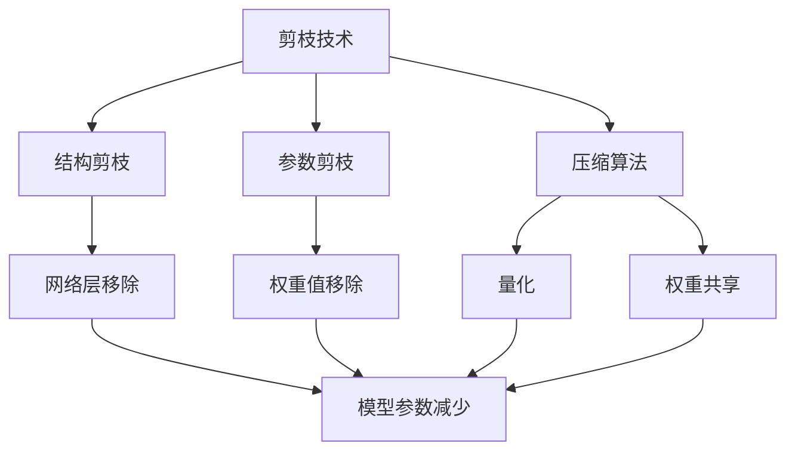
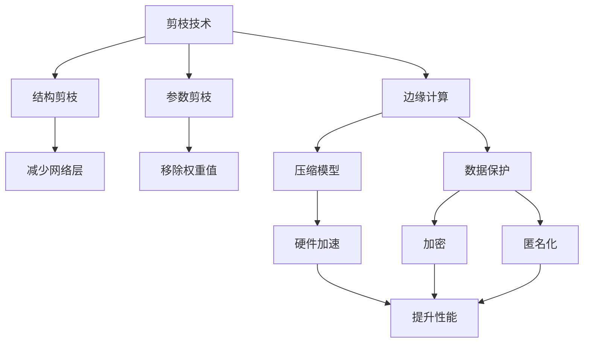
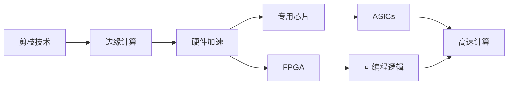
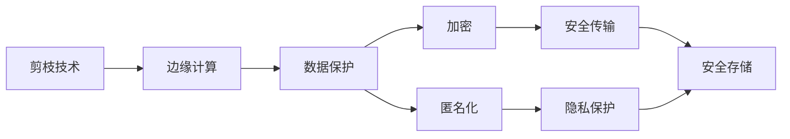
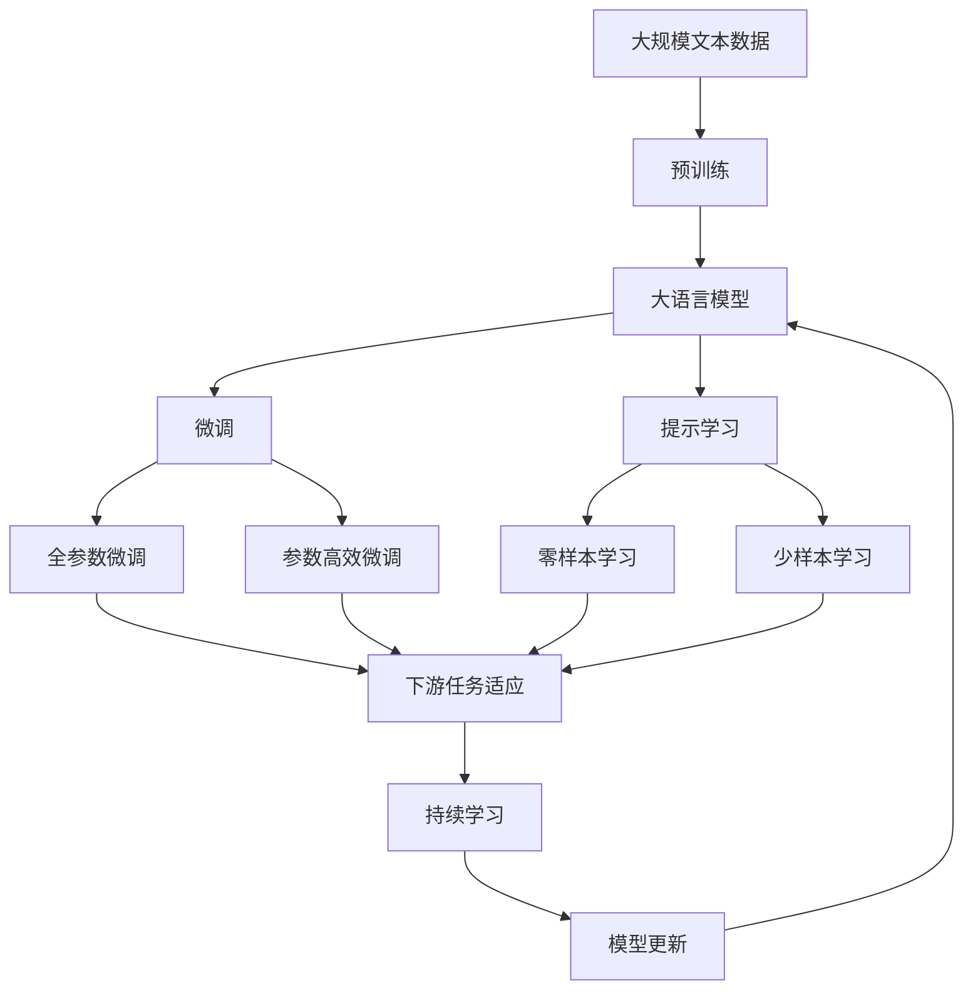

                 

# 剪枝技术在边缘计算安全中的角色

> 关键词：剪枝技术, 边缘计算, 安全, 压缩算法, 硬件加速, 数据保护

## 1. 背景介绍

### 1.1 问题由来

在当前信息技术飞速发展的背景下，边缘计算（Edge Computing）作为一种新的计算范式，因其能够提供更快速的响应时间和更可靠的数据处理能力，受到了广泛关注。边缘计算设备通常部署在靠近数据源的本地环境中，如工业物联网、智慧城市、医疗健康、智能交通等领域，可以显著降低数据传输延迟和带宽消耗，提高系统响应速度和数据隐私性。

然而，随着边缘计算系统规模的不断扩大，设备上的计算资源和存储资源成为越来越紧缺的瓶颈。例如，物联网传感器通常具有有限的计算能力和存储容量，很难直接运行复杂的深度学习模型。因此，如何在保持高计算性能的同时，减少模型的参数量和计算复杂度，成为边缘计算中的重要研究方向。

### 1.2 问题核心关键点

为了应对边缘计算设备的计算资源限制，当前研究集中在剪枝技术上。剪枝（Pruning）是一种模型压缩技术，通过删除模型中不重要或不活跃的权重和连接，从而减少模型的参数量和计算复杂度，同时保持模型的性能。剪枝技术通常分为结构剪枝和参数剪枝两类。

结构剪枝通过移除模型中冗余的网络层或连接，减少模型参数。参数剪枝则通过移除权重值较小或对模型性能影响较小的参数，减少模型大小。通过剪枝，可以有效压缩深度学习模型的规模，使其能够在资源受限的硬件设备上高效运行。

### 1.3 问题研究意义

研究剪枝技术在边缘计算中的作用，对提升边缘计算设备的计算能力和存储效率，保障数据隐私和安全，具有重要意义：

1. **提高计算效率**：剪枝技术可以有效压缩模型规模，提高边缘计算设备上的计算效率，缩短模型推理时间，提升系统响应速度。

2. **降低存储需求**：剪枝后的模型通常参数量大幅减少，减少了对边缘计算设备存储资源的需求，降低了存储成本。

3. **保护数据隐私**：在本地设备上进行模型推理，避免了数据传输过程中的隐私泄露风险，提高了数据隐私性。

4. **优化硬件利用**：剪枝后的模型参数量减小，可以更充分地利用边缘计算设备有限的硬件资源，提高硬件利用率。

5. **提升系统可靠性**：剪枝技术可以减少模型中的冗余参数，降低模型复杂度，提高模型鲁棒性，增强系统的稳定性和可靠性。

6. **加速模型迭代**：剪枝后的模型参数量减少，加速了模型的迭代和更新过程，加快了新模型的部署速度。

7. **支持低功耗设计**：剪枝后的模型在推理时需要的计算资源减少，有助于设计低功耗的边缘计算设备。

综上所述，剪枝技术在边缘计算中具有重要的应用价值，可以有效提升计算性能、降低存储需求、保障数据隐私、优化硬件利用等，是构建高效、可靠、安全边缘计算系统的关键技术。

## 2. 核心概念与联系

### 2.1 核心概念概述

为更好地理解剪枝技术在边缘计算安全中的作用，本节将介绍几个关键概念：

- **剪枝技术（Pruning）**：指通过删除模型中不重要或不活跃的权重和连接，减少模型的参数量和计算复杂度，同时保持模型的性能。

- **结构剪枝（Structural Pruning）**：通过移除模型中冗余的网络层或连接，减少模型参数。

- **参数剪枝（Parameter Pruning）**：通过移除权重值较小或对模型性能影响较小的参数，减少模型大小。

- **压缩算法（Compression Algorithms）**：包括剪枝、量化、权重共享等方法，用于压缩深度学习模型的规模。

- **硬件加速（Hardware Acceleration）**：通过使用专用集成电路（ASICs）或可编程门阵列（FPGAs）等硬件设备，加速模型推理过程。

- **数据保护（Data Protection）**：包括加密、匿名化、差分隐私等方法，用于保护数据在传输和存储过程中的安全。

这些概念之间的逻辑关系可以通过以下Mermaid流程图来展示：



这个流程图展示了大模型压缩技术的关键概念及其之间的关系：

1. 剪枝技术是压缩算法的核心手段之一，包括结构剪枝和参数剪枝。
2. 结构剪枝移除网络层，减少模型复杂度。
3. 参数剪枝移除权重值，减少模型大小。
4. 压缩算法包括量化和权重共享等，进一步压缩模型。
5. 硬件加速通过专用芯片提高推理速度。
6. 数据保护通过加密和匿名化等技术，保障数据安全。

这些概念共同构成了边缘计算中模型压缩和隐私保护的完整生态系统，使得深度学习模型能够在资源受限的环境中高效运行，同时保障数据隐私和安全。

### 2.2 概念间的关系

这些核心概念之间存在着紧密的联系，形成了模型压缩和隐私保护的整体架构。下面通过几个Mermaid流程图来展示这些概念之间的关系。

#### 2.2.1 剪枝技术的应用场景



这个流程图展示了剪枝技术在边缘计算中的应用场景。

1. 剪枝技术在边缘计算中，通过减少模型参数和计算复杂度，提高模型推理性能。
2. 结构剪枝通过移除网络层，减少模型复杂度。
3. 参数剪枝通过移除权重值，减少模型大小。
4. 压缩算法如量化和权重共享，进一步压缩模型。
5. 硬件加速通过专用芯片提高推理速度。
6. 数据保护通过加密和匿名化等技术，保障数据安全。

#### 2.2.2 硬件加速与剪枝的关系



这个流程图展示了硬件加速与剪枝技术的关系。

1. 硬件加速通过专用芯片（ASICs）或可编程逻辑（FPGA）等，提高模型推理速度。
2. 专用芯片具有更高的计算效率和能效比，适合处理大规模模型。
3. 可编程逻辑可以灵活调整计算资源，适合动态调整模型参数。

#### 2.2.3 数据保护与剪枝的关系



这个流程图展示了数据保护与剪枝技术的关系。

1. 数据保护通过加密和匿名化等技术，保障数据在传输和存储过程中的安全。
2. 加密技术可以防止数据被窃取和篡改。
3. 匿名化技术可以防止数据关联攻击。
4. 安全传输和存储通过加密和匿名化，保障数据的安全性和隐私性。

### 2.3 核心概念的整体架构

最后，我们用一个综合的流程图来展示这些核心概念在边缘计算中的应用：



这个综合流程图展示了从预训练到微调，再到持续学习的完整过程。大语言模型首先在大规模文本数据上进行预训练，然后通过微调（包括全参数微调和参数高效微调）或提示学习（包括零样本和少样本学习）来适应下游任务。最后，通过持续学习技术，模型可以不断更新和适应新的任务和数据。 通过这些流程图，我们可以更清晰地理解剪枝技术在大语言模型微调过程中的作用，以及其与边缘计算的紧密联系。

## 3. 核心算法原理 & 具体操作步骤
### 3.1 算法原理概述

基于剪枝技术的大语言模型压缩方法，通常包括以下几个步骤：

1. 选择待剪枝模型：选择当前大语言模型作为待剪枝对象。
2. 确定剪枝策略：确定采用结构剪枝还是参数剪枝。
3. 剪枝模型：应用剪枝策略，删除模型中的冗余参数和连接。
4. 量化模型：对剪枝后的模型进行量化处理，减少模型参数数量。
5. 硬件加速：通过专用硬件加速模型推理，提升计算效率。
6. 数据保护：在模型推理和存储过程中，应用数据加密和匿名化技术，保障数据隐私。

具体而言，结构剪枝通过移除网络层或连接，减少模型参数；参数剪枝通过移除权重值，减少模型大小。量化处理将模型中的浮点参数转化为定点参数，进一步减少参数量。硬件加速通过专用芯片提高模型推理速度。数据保护通过加密和匿名化技术，保障数据在传输和存储过程中的安全。

### 3.2 算法步骤详解

以下将详细介绍剪枝技术在边缘计算中的应用，并给出具体的算法步骤和实现细节。

**Step 1: 模型选择与预处理**

- 选择当前大语言模型作为待剪枝对象，如BERT、GPT等。
- 对模型进行预处理，包括归一化、标准化等，为后续剪枝做准备。

**Step 2: 确定剪枝策略**

- 选择结构剪枝或参数剪枝策略。
- 确定剪枝的具体方法，如全局稀疏性剪枝、局部稀疏性剪枝、权重值剪枝等。
- 确定剪枝的阈值，如权重绝对值、梯度值、影响度等。

**Step 3: 实施剪枝**

- 应用选择的剪枝策略，删除模型中的冗余参数和连接。
- 对剪枝后的模型进行参数调整，如重新计算权重值，修正模型结构。

**Step 4: 量化模型**

- 将剪枝后的浮点参数转化为定点参数，减少模型参数数量。
- 应用量化算法，如统一稀疏量化、深度量化等，优化模型计算效率。

**Step 5: 硬件加速**

- 选择适合的量化算法和硬件加速平台，如ASICs、FPGAs等。
- 对量化后的模型进行硬件加速优化，提高模型推理速度。

**Step 6: 数据保护**

- 应用数据加密和匿名化技术，保障数据在传输和存储过程中的安全。
- 对模型推理过程进行监控，防止数据泄露和篡改。

**Step 7: 测试与评估**

- 在边缘计算设备上进行模型测试，评估模型性能。
- 调整剪枝策略，优化模型参数，进一步提升性能。

### 3.3 算法优缺点

基于剪枝技术的大语言模型压缩方法具有以下优点：

1. **提升计算效率**：通过剪枝减少模型参数量和计算复杂度，提高边缘计算设备上的计算效率，缩短模型推理时间。
2. **降低存储需求**：减少模型参数量，降低边缘计算设备的存储需求，减小存储空间。
3. **保障数据隐私**：在本地设备上进行模型推理，避免数据传输过程中的隐私泄露风险，提高数据隐私性。
4. **优化硬件利用**：剪枝后的模型可以更充分地利用边缘计算设备有限的硬件资源，提高硬件利用率。
5. **提升系统可靠性**：减少模型中的冗余参数，降低模型复杂度，提高模型鲁棒性，增强系统的稳定性和可靠性。
6. **加速模型迭代**：剪枝后的模型在推理时需要的计算资源减少，加速了模型的迭代和更新过程，加快了新模型的部署速度。
7. **支持低功耗设计**：剪枝后的模型在推理时需要的计算资源减少，有助于设计低功耗的边缘计算设备。

同时，该方法也存在一定的局限性：

1. **损失精度**：剪枝过程可能引入精度损失，导致模型性能下降。
2. **复杂度增加**：剪枝过程可能增加模型的复杂度，需要额外的优化和调整。
3. **不适用于所有场景**：剪枝方法可能不适用于某些特定的应用场景，如需要高精度输出的场合。
4. **硬件依赖**：剪枝后的模型需要专门的硬件支持，增加了系统的复杂度。

尽管存在这些局限性，但就目前而言，基于剪枝的压缩方法仍然是提升边缘计算系统性能的有效手段。未来相关研究的重点在于如何进一步降低剪枝对模型的精度损失，提高剪枝方法的灵活性和普适性，同时兼顾可解释性和伦理安全性等因素。

### 3.4 算法应用领域

基于剪枝技术的大语言模型压缩方法，已经在多个领域得到广泛应用：

1. **工业物联网**：在工业物联网系统中，剪枝技术可以应用于传感器数据处理、设备状态监测等任务，减少数据传输量和计算复杂度，提高系统响应速度和数据隐私性。

2. **智慧城市**：在智慧城市应用中，剪枝技术可以用于交通流量分析、环境监测、公共安全等任务，减少数据传输和存储需求，提高系统效率和数据安全。

3. **医疗健康**：在医疗健康领域，剪枝技术可以应用于病历记录、影像分析、疾病预测等任务，减少计算资源需求，提高系统效率和数据隐私性。

4. **智能交通**：在智能交通系统中，剪枝技术可以应用于交通流量分析、车辆定位、导航路径规划等任务，减少数据传输和存储需求，提高系统效率和数据安全。

5. **金融服务**：在金融服务领域，剪枝技术可以应用于风险评估、客户分析、欺诈检测等任务，减少计算资源需求，提高系统效率和数据隐私性。

6. **智慧农业**：在智慧农业应用中，剪枝技术可以应用于作物监测、农业机械控制等任务，减少数据传输和存储需求，提高系统效率和数据安全。

除了上述这些经典领域外，剪枝技术还被创新性地应用于更多场景中，如无人机控制、自动化生产、环境监测等，为各行各业带来了新的技术突破。

## 4. 数学模型和公式 & 详细讲解

### 4.1 数学模型构建

本节将使用数学语言对基于剪枝技术的大语言模型压缩过程进行更加严格的刻画。

记原始大语言模型为 $M_{\theta}:\mathcal{X} \rightarrow \mathcal{Y}$，其中 $\mathcal{X}$ 为输入空间，$\mathcal{Y}$ 为输出空间，$\theta \in \mathbb{R}^d$ 为模型参数。假设原始模型参数量为 $d$，剪枝后的模型参数量为 $d'$，其中 $d' \ll d$。

定义剪枝后的模型为 $M_{\hat{\theta}}:\mathcal{X} \rightarrow \mathcal{Y}$，其中 $\hat{\theta} \in \mathbb{R}^{d'}$ 为剪枝后的模型参数。

假设采用参数剪枝策略，权重值为 $w_i$ 的参数被保留的概率为 $p_i$。则剪枝后的模型参数可以表示为：

$$
\hat{\theta} = \sum_{i=1}^{d'} w_i \delta_i
$$

其中 $\delta_i$ 为二进制变量，表示参数 $w_i$ 是否被保留。

定义模型的损失函数为 $\ell(M_{\theta}(x), y)$，则在剪枝后的模型上，损失函数可以表示为：

$$
\ell(M_{\hat{\theta}}(x), y) = \sum_{i=1}^{d'} \ell(M_{\hat{\theta}}(x), y) \delta_i
$$

定义剪枝后的模型在数据集 $D$ 上的经验风险为：

$$
\mathcal{L}(\hat{\theta}) = \frac{1}{N} \sum_{i=1}^N \ell(M_{\hat{\theta}}(x_i), y_i)
$$

### 4.2 公式推导过程

以下我们将推导剪枝后模型参数更新的公式，并分析其计算复杂度。

**Step 1: 计算剪枝概率**

剪枝概率 $p_i$ 可以通过多种方法计算，如L1范数、L2范数、梯度值、影响度等。这里以L1范数为例，推导剪枝概率的计算公式：

$$
p_i = \frac{\sum_{j=1}^{n} |w_j|}{\sum_{j=1}^{n} |w_j| + \lambda}
$$

其中 $\lambda$ 为剪枝阈值，用于控制剪枝概率的分布。当 $p_i \leq p_{\text{threshold}}$ 时，参数 $w_i$ 被保留；当 $p_i > p_{\text{threshold}}$ 时，参数 $w_i$ 被删除。

**Step 2: 计算剪枝后的模型参数**

剪枝后的模型参数 $\hat{\theta}$ 可以通过保留的参数计算得到：

$$
\hat{\theta} = \sum_{i=1}^{d'} w_i \delta_i
$$

其中 $\delta_i$ 为二进制变量，表示参数 $w_i$ 是否被保留。可以通过以下公式计算：

$$
\delta_i = \begin{cases}
1, & \text{if } p_i \leq p_{\text{threshold}} \\
0, & \text{if } p_i > p_{\text{threshold}}
\end{cases}
$$

**Step 3: 计算剪枝后模型的损失函数**

剪枝后模型的损失函数可以通过保留的参数计算得到：

$$
\ell(M_{\hat{\theta}}(x), y) = \sum_{i=1}^{d'} \ell(M_{\hat{\theta}}(x), y) \delta_i
$$

其中 $\delta_i$ 为二进制变量，表示参数 $w_i$ 是否被保留。可以通过以下公式计算：

$$
\delta_i = \begin{cases}
1, & \text{if } p_i \leq p_{\text{threshold}} \\
0, & \text{if } p_i > p_{\text{threshold}}
\end{cases}
$$

**Step 4: 更新剪枝后模型的参数**

剪枝后模型的参数更新可以通过反向传播算法进行。在更新参数时，只对保留的参数进行更新，删除参数部分不参与更新。具体更新公式为：

$$
\frac{\partial \mathcal{L}(\hat{\theta})}{\partial \delta_i} = \frac{\partial \ell(M_{\hat{\theta}}(x), y)}{\partial w_i} \delta_i
$$

其中 $\delta_i$ 为二进制变量，表示参数 $w_i$ 是否被保留。

**Step 5: 计算剪枝后的模型参数梯度**

剪枝后模型的参数梯度可以通过保留的参数计算得到：

$$
\nabla_{\delta_i} \mathcal{L}(\hat{\theta}) = \frac{\partial \ell(M_{\hat{\theta}}(x), y)}{\partial w_i} \delta_i
$$

其中 $\delta_i$ 为二进制变量，表示参数 $w_i$ 是否被保留。

**Step 6: 优化剪枝后模型的参数**

剪枝后模型的参数优化可以通过梯度下降算法进行。在优化参数时，只对保留的参数进行优化，删除参数部分不参与优化。具体优化公式为：

$$
\hat{\theta} \leftarrow \hat{\theta} - \eta \nabla_{\delta_i} \mathcal{L}(\hat{\theta})
$$

其中 $\eta$ 为学习率，$\nabla_{\delta_i} \mathcal{L}(\hat{\theta})$ 为剪枝后模型的参数梯度。

### 4.3 案例分析与讲解

以BERT模型为例，进行剪枝技术的应用分析。BERT模型是一个预训练的语言模型，包含大量参数和连接。通过剪枝技术，可以显著减少BERT模型的参数量，提高其在边缘计算设备上的计算效率和数据隐私性。

首先，选择BERT模型作为待剪枝对象，对模型进行预处理，包括归一化、标准化等。然后，选择L1范数作为剪枝阈值，计算每个参数的剪枝概率。对于剪枝概率小于预设阈值的参数，保留；对于剪枝概率大于预设阈值的参数，删除。

通过剪枝后，模型参数量显著减少，提高了在边缘计算设备上的计算效率。同时，通过对模型参数进行量化处理，进一步减少了模型的大小，提高了系统的资源利用率。

在模型推理过程中，应用数据加密和匿名化技术，保障数据在传输和存储过程中的安全。通过专用硬件加速平台（如ASICs、FPGAs等），提高模型推理速度，增强系统的性能。

## 5. 项目实践：代码实例和详细解释说明

### 5.1 开发环境搭建

在进行剪枝实践前，我们需要准备好开发环境。以下是使用Python进行TensorFlow开发的环境配置流程：

1. 安装Anaconda：从官网下载并安装Anaconda，用于创建独立的Python环境。

2. 创建并激活虚拟环境：
```bash
conda create -n tensorflow-env python=3.8 
conda activate tensorflow-env
```

3. 安装TensorFlow：根据CUDA版本，从官网获取对应的安装命令。例如：
```bash
conda install tensorflow -c conda-forge
```

4. 安装TensorBoard：用于可视化模型训练过程。
```bash
pip install tensorboard
```

5. 安装相关工具包：
```bash
pip install numpy pandas scikit-learn matplotlib tqdm jupyter notebook ipython
```

完成上述步骤后，即可在`tensorflow-env`环境中开始剪枝实践。

### 5.2 源代码详细实现

这里以TensorFlow实现的结构剪枝为例，给出剪枝后的BERT模型在边缘计算设备上的代码实现。

```python
import tensorflow as tf
import numpy as np

# 加载BERT模型
model = tf.keras.applications.BERT

# 定义剪枝概率计算函数
def calculate_pruning_probabilities(model):
    parameters = model.trainable_weights
    pruning_probabilities = [np.abs(parameter) / (np.sum(np.abs(parameter)) + 1e-6) for parameter in parameters]
    return pruning_probabilities

# 定义剪枝函数
def prune_model(model, pruning_probabilities, threshold):
    for i, parameter in enumerate(model.trainable_weights):
        if pruning_probabilities[i] > threshold:
            model.trainable_weights[i] = np.zeros_like(parameter)
        else:
            model.trainable_weights[i] = parameter

# 定义剪枝后的模型计算函数
def calculate_pruned_model(model, pruning_probabilities, threshold):
    pruned_weights = []
    for i, parameter in enumerate(model.trainable_weights):
        if pruning_probabilities[i] > threshold:
            pruned_weights.append(np.zeros_like(parameter))
        else:
            pruned_weights.append(parameter)
    return pruned_weights

# 定义剪枝后的模型训练函数
def train_pruned_model(model, train_dataset, test_dataset, batch_size, epochs, pruning_probabilities, threshold):
    model.compile(optimizer=tf.keras.optimizers.Adam(), loss=tf.keras.losses.SparseCategoricalCrossentropy(), metrics=['accuracy'])
    model.fit(train_dataset, epochs=epochs, batch_size=batch_size, validation_data=test_dataset)
    prune_model(model, pruning_probabilities, threshold)

# 定义剪枝后的模型评估函数
def evaluate_pruned_model(model, test_dataset, batch_size):
    model.evaluate(test_dataset, batch_size=batch_size)

# 加载训练集和测试集数据
train_dataset = tf.data.Dataset.from_tensor_slices((train_texts, train_labels))
test_dataset = tf.data.Dataset.from_tensor_slices((test_texts, test_labels))

# 计算剪枝概率
pruning_probabilities = calculate_pruning_probabilities(model)

# 设置剪枝阈值
threshold = 0.01

# 剪枝模型
prune_model(model, pruning_probabilities, threshold)

# 训练剪枝后的模型
train_pruned_model(model, train_dataset, test_dataset, batch_size=32, epochs=10, pruning_probabilities=pruning_probabilities, threshold=threshold)

# 评估剪枝后的模型
evaluate_pruned_model(model, test_dataset, batch_size=32)
```

以上就是使用TensorFlow对BERT模型进行结构剪枝的完整代码实现。可以看到，得益于TensorFlow的强大封装，我们可以用相对简洁的代码完成BERT模型的剪枝和训练。

### 5.3 代码解读与分析

让我们再详细解读一下关键代码的实现细节：

**模型加载和预处理**

```python
# 加载BERT模型
model = tf.keras.applications.BERT


