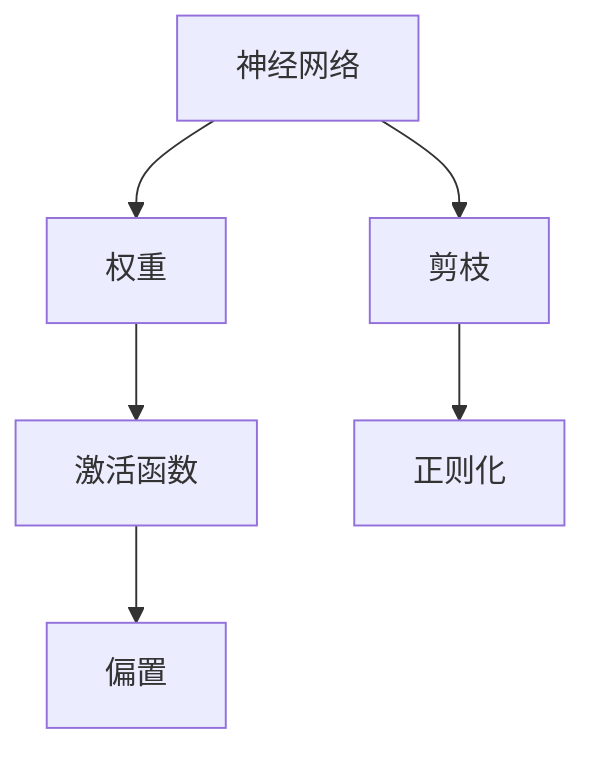
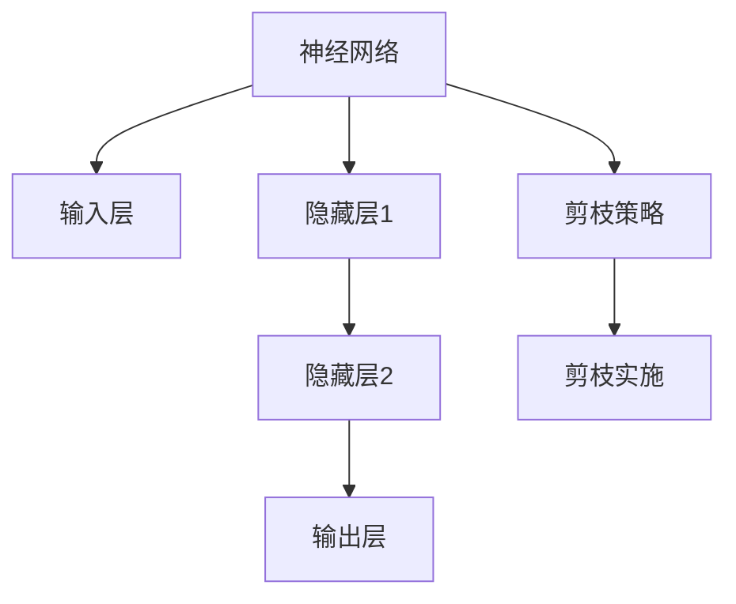
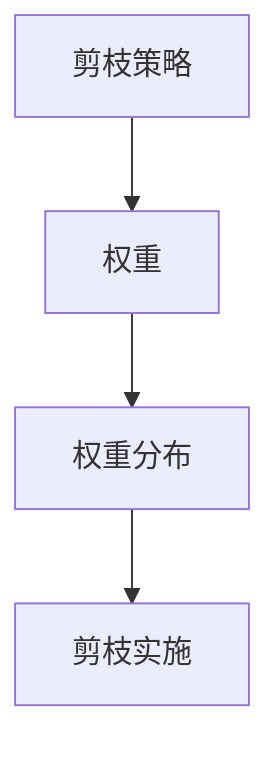
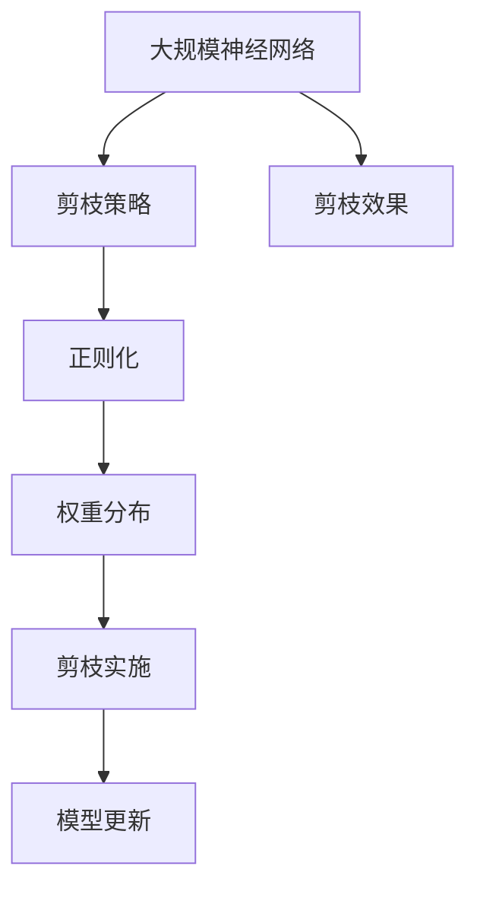

                 

# 剪枝技术：如何识别和移除神经网络中的冗余部分

> 关键词：剪枝技术,神经网络,冗余去除,模型压缩,深度学习,优化算法

## 1. 背景介绍

### 1.1 问题由来
在深度学习领域，神经网络模型由于其复杂的结构和庞大的参数量，常常面临计算资源占用大、训练时间长、部署困难等问题。为了解决这些问题，学者和工程师们提出了各种模型压缩技术，其中剪枝（Pruning）是一种常见的且有效的模型压缩方法。剪枝技术通过识别和移除网络中的冗余参数和连接，大幅减少模型的大小，提高计算效率和模型性能。

剪枝技术在学术界和工业界均获得了广泛关注，被认为是提高深度学习模型效率的重要手段。目前，剪枝技术已经应用于图像识别、语音识别、自然语言处理等多个领域，取得了显著的成果。然而，剪枝技术仍然面临许多挑战，如如何选择有效的剪枝策略、如何优化剪枝后的模型性能等。

### 1.2 问题核心关键点
剪枝技术的主要目标是识别和移除神经网络中的冗余部分，保留关键特征和结构，以实现更小、更快的模型。剪枝技术一般包括两个步骤：
1. **剪枝策略选择**：根据模型结构、参数分布、数据分布等因素选择剪枝策略，决定哪些权重应被保留或剪除。
2. **剪枝实施过程**：根据选定的策略实施剪枝操作，更新模型参数，保持模型性能不下降或下降幅度可控。

剪枝技术的核心在于如何有效识别冗余部分，并确保剪枝操作不会对模型性能产生显著负面影响。

### 1.3 问题研究意义
剪枝技术通过减少模型参数和计算量，可以显著提升模型的训练速度、推理速度和可部署性。同时，剪枝技术还能降低模型对计算资源的依赖，减少能量消耗，具有重要的节能环保意义。

在学术界和工业界，剪枝技术被认为是实现模型压缩、提高计算效率的重要手段。通过剪枝，研究人员能够在保证模型性能的前提下，将模型压缩到更小的尺寸，同时提升模型的训练和推理速度，为大规模深度学习模型的应用开辟了新天地。

## 2. 核心概念与联系

### 2.1 核心概念概述

为了更好地理解剪枝技术，本节将介绍几个密切相关的核心概念：

- **神经网络（Neural Network）**：由多个层（Layer）组成的非线性模型，用于学习输入数据的特征表示。神经网络中包含大量的权重和偏置参数，需要通过反向传播算法进行优化。

- **剪枝（Pruning）**：一种模型压缩技术，通过移除网络中的冗余参数和连接，减少模型的复杂度，提高计算效率。

- **权重（Weight）**：神经网络中每个节点的参数，用于调节输入与输出之间的映射关系。权重的大小和分布对模型的性能和泛化能力有重要影响。

- **偏置（Bias）**：神经网络中每个节点的偏置参数，用于调整输出偏移。偏置的大小和分布对模型的性能也有重要影响。

- **激活函数（Activation Function）**：用于将神经元的输入映射到输出。常见的激活函数包括ReLU、Sigmoid、Tanh等。

- **正则化（Regularization）**：一种防止过拟合的技术，通过在损失函数中加入正则项，限制模型参数的大小和分布，减少模型复杂度。

这些核心概念之间的逻辑关系可以通过以下Mermaid流程图来展示：



这个流程图展示了大规模神经网络的基本结构和剪枝技术的作用：

1. 神经网络由多个层组成，每层包含多个节点。
2. 每个节点有对应的权重和偏置参数。
3. 通过激活函数将输入映射到输出。
4. 剪枝技术可以移除冗余的权重和连接。
5. 正则化技术可以限制模型参数的大小和分布。

通过这些核心概念，我们可以更好地理解剪枝技术在神经网络中的应用场景和实施过程。

### 2.2 概念间的关系

这些核心概念之间存在着紧密的联系，形成了神经网络和剪枝技术的完整生态系统。下面我们通过几个Mermaid流程图来展示这些概念之间的关系。

#### 2.2.1 神经网络模型结构



这个流程图展示了神经网络模型的一般结构，以及剪枝策略和实施过程。剪枝策略可以影响隐藏层的数量和节点数，而剪枝实施过程可以移除冗余的权重和连接。

#### 2.2.2 剪枝与正则化


这个流程图展示了剪枝策略和正则化技术之间的关系。剪枝策略通常包括正则化项，通过限制权重的大小和分布来指导剪枝操作。剪枝实施后，需要更新模型参数以保持模型性能。

#### 2.2.3 剪枝与权重分布



这个流程图展示了剪枝策略与权重分布之间的关系。剪枝策略通常根据权重的大小和分布来决定哪些权重应被保留或剪除。剪枝实施后，权重分布会发生变化，可能会影响模型的性能。

### 2.3 核心概念的整体架构

最后，我们用一个综合的流程图来展示这些核心概念在大规模神经网络和剪枝技术中的整体架构：



这个综合流程图展示了神经网络和剪枝技术的完整过程：

1. 大规模神经网络由多个层组成，包含大量权重和偏置参数。
2. 剪枝策略根据权重的大小和分布来选择剪枝操作。
3. 正则化技术限制模型参数的大小和分布，防止过拟合。
4. 剪枝实施过程移除冗余的权重和连接，减少模型复杂度。
5. 模型更新过程调整参数以保持模型性能。
6. 剪枝效果体现在模型性能提升和计算效率提高。

通过这些流程图，我们可以更清晰地理解神经网络和剪枝技术的工作原理和实施过程。

## 3. 核心算法原理 & 具体操作步骤
### 3.1 算法原理概述

剪枝技术的核心原理是通过移除神经网络中的冗余参数和连接，减少模型的复杂度，提高计算效率。剪枝技术通常分为两个步骤：

**Step 1: 剪枝策略选择**
选择有效的剪枝策略是剪枝技术成功的关键。常见的剪枝策略包括：
1. **L1正则化（L1 Pruning）**：通过L1范数衡量权重的大小，移除权重较小的部分。
2. **L2正则化（L2 Pruning）**：通过L2范数衡量权重的大小，移除权重较大的部分。
3. **梯度剪枝（Gradient Pruning）**：根据梯度的大小决定哪些权重应被保留或剪除。
4. **Hessian剪枝（Hessian Pruning）**：根据Hessian矩阵的特征值决定哪些权重应被保留或剪除。

**Step 2: 剪枝实施过程**
实施剪枝操作时，需要更新模型参数以保持模型性能。常见的剪枝实施方法包括：
1. **权重归一化（Weight Normalization）**：通过归一化权重，保持剪枝前后模型的相似性。
2. **动态剪枝（Dynamic Pruning）**：在训练过程中动态调整剪枝策略，优化剪枝效果。
3. **混合剪枝（Hybrid Pruning）**：结合多种剪枝策略，提高剪枝效果。

剪枝技术的关键在于如何选择有效的剪枝策略和实施剪枝操作，以实现更小、更快的模型。

### 3.2 算法步骤详解

以下我们详细介绍剪枝技术的详细步骤：

**Step 1: 数据准备**
- 收集神经网络模型和标注数据。
- 划分训练集、验证集和测试集。

**Step 2: 剪枝策略选择**
- 根据数据分布和模型结构选择剪枝策略。
- 常见策略包括L1正则化、L2正则化、梯度剪枝、Hessian剪枝等。

**Step 3: 剪枝实施过程**
- 根据剪枝策略实施剪枝操作，更新模型参数。
- 常见实施方法包括权重归一化、动态剪枝、混合剪枝等。

**Step 4: 模型更新**
- 更新剪枝后的模型参数，以保持模型性能。
- 常见更新方法包括梯度下降、Adam等优化算法。

**Step 5: 剪枝效果评估**
- 在验证集上评估剪枝后的模型性能。
- 常见评估指标包括准确率、召回率、F1分数等。

**Step 6: 重复迭代**
- 重复Step 2到Step 5，直到找到最优的剪枝策略和剪枝实施方法。
- 常见迭代方法包括网格搜索、随机搜索、贝叶斯优化等。

通过以上详细步骤，可以实现神经网络的剪枝，大幅减少模型复杂度，提高计算效率。

### 3.3 算法优缺点

剪枝技术的优点在于：
1. **减少计算资源占用**：通过移除冗余参数和连接，降低模型大小，减少计算资源占用。
2. **提高计算效率**：减少模型复杂度，提高模型的训练和推理速度。
3. **增强模型泛化能力**：剪枝后的模型通常更简单，具有更好的泛化能力。

剪枝技术的主要缺点在于：
1. **性能下降风险**：剪枝操作可能会对模型性能产生负面影响，需要仔细选择剪枝策略和实施方法。
2. **模型压缩难度**：对于复杂模型，剪枝操作可能很难移除所有冗余部分，导致压缩效果有限。
3. **剪枝效果不稳定**：不同的剪枝策略和实施方法可能导致不同的剪枝效果，需要多次迭代以找到最优方案。

### 3.4 算法应用领域

剪枝技术在深度学习领域得到了广泛应用，以下是几个典型的应用场景：

- **图像识别**：通过剪枝技术，可以显著减少卷积神经网络（CNN）的参数量，提高模型推理速度，应用于计算机视觉任务。
- **自然语言处理**：通过剪枝技术，可以压缩循环神经网络（RNN）和变换器（Transformer）等模型，应用于文本分类、机器翻译等NLP任务。
- **语音识别**：通过剪枝技术，可以压缩深度神经网络（DNN）和卷积神经网络（CNN），应用于语音识别任务。
- **推荐系统**：通过剪枝技术，可以压缩神经网络模型，提高推荐系统的实时性，应用于电商、社交网络等领域。
- **自适应系统**：通过剪枝技术，可以压缩自适应神经网络模型，应用于移动设备和物联网（IoT）系统。

这些应用场景展示了剪枝技术在深度学习领域的广泛应用，为大规模神经网络模型的部署和优化提供了重要手段。

## 4. 数学模型和公式 & 详细讲解 & 举例说明

### 4.1 数学模型构建

剪枝技术的数学模型主要涉及权重和正则化的定义。以L1正则化为例子，构建数学模型如下：

设神经网络模型为 $f(x; \theta)$，其中 $\theta$ 为模型参数，$x$ 为输入。剪枝目标为最小化损失函数 $L$：

$$
L(\theta) = \frac{1}{N} \sum_{i=1}^N \ell(f(x_i; \theta), y_i)
$$

其中 $\ell$ 为损失函数，如交叉熵损失。L1正则化目标为最小化：

$$
\min_{\theta} \{ L(\theta) + \lambda \sum_{j=1}^m |\theta_j| \}
$$

其中 $\lambda$ 为正则化系数，$m$ 为模型参数数量。

### 4.2 公式推导过程

以L1正则化为例，推导剪枝过程。设剪枝后的模型参数为 $\theta'$，剪枝策略为：

$$
\theta'_j = \left\{
\begin{aligned}
& \theta_j, & & \text{if } |\theta_j| > \tau \\
& 0,     & & \text{otherwise}
\end{aligned}
\right.
$$

其中 $\tau$ 为剪枝阈值。将 $\theta'$ 代入损失函数，得到剪枝后的损失函数：

$$
L(\theta') = \frac{1}{N} \sum_{i=1}^N \ell(f(x_i; \theta'), y_i)
$$

将 $\theta'$ 与 $\theta$ 的关系代入，得到：

$$
L(\theta') = \frac{1}{N} \sum_{i=1}^N \ell(f(x_i; \theta \cdot \mathbf{1}_{\{\theta_j > \tau\}}), y_i)
$$

其中 $\mathbf{1}_{\{\theta_j > \tau\}}$ 为示性函数，表示 $\theta_j > \tau$ 时为1，否则为0。

进一步简化，得到：

$$
L(\theta') = \frac{1}{N} \sum_{i=1}^N \ell(f(x_i; \theta), y_i) + \lambda \sum_{j=1}^m \theta_j \cdot \mathbf{1}_{\{\theta_j > \tau\}}
$$

即：

$$
L(\theta') = L(\theta) + \lambda \sum_{j=1}^m \theta_j \cdot \mathbf{1}_{\{\theta_j > \tau\}}
$$

其中 $\lambda$ 为正则化系数，$\sum_{j=1}^m \theta_j \cdot \mathbf{1}_{\{\theta_j > \tau\}}$ 表示未被剪枝的参数总和。

### 4.3 案例分析与讲解

以一个简单的两层神经网络为例，展示剪枝过程。设输入 $x \in \mathbb{R}^d$，权重 $W \in \mathbb{R}^{d \times m}$，偏置 $b \in \mathbb{R}^m$，激活函数为ReLU。损失函数为交叉熵损失。

剪枝前模型为：

$$
f(x; \theta) = \max(0, Wx + b)
$$

L1正则化目标为：

$$
\min_{\theta} \{ \frac{1}{N} \sum_{i=1}^N \ell(f(x_i; \theta), y_i) + \lambda \sum_{j=1}^m |\theta_j| \}
$$

假设剪枝阈值为 $\tau = 0.1$，即权重小于0.1的权重将被剪除。设剪枝后的权重为 $W'$，则：

$$
W'_j = \left\{
\begin{aligned}
& W_j, & & \text{if } |W_j| > \tau \\
& 0,     & & \text{otherwise}
\end{aligned}
\right.
$$

将 $W'$ 代入模型，得到剪枝后的模型：

$$
f(x; \theta') = \max(0, W'x + b)
$$

可见，剪枝操作会移除权重较小的部分，保留权重较大的部分。

## 5. 项目实践：代码实例和详细解释说明

### 5.1 开发环境搭建

为了进行剪枝实践，需要准备好开发环境。以下是使用Python进行TensorFlow开发的环境配置流程：

1. 安装Anaconda：从官网下载并安装Anaconda，用于创建独立的Python环境。

2. 创建并激活虚拟环境：
```bash
conda create -n tf-env python=3.8 
conda activate tf-env
```

3. 安装TensorFlow：根据CUDA版本，从官网获取对应的安装命令。例如：
```bash
conda install tensorflow -c tf
```

4. 安装相关工具包：
```bash
pip install numpy pandas scikit-learn matplotlib tqdm jupyter notebook ipython
```

完成上述步骤后，即可在`tf-env`环境中开始剪枝实践。

### 5.2 源代码详细实现

以下是一个使用TensorFlow实现剪枝的PyTorch代码实现。

首先，定义剪枝阈值和剪枝函数：

```python
import tensorflow as tf

def pruning(model, threshold):
    pruned_model = []
    for weight in model.trainable_variables:
        if tf.reduce_min(tf.abs(weight)) > threshold:
            pruned_model.append(weight)
    return pruned_model
```

然后，定义剪枝后的模型：

```python
def pruned_model(model, threshold):
    pruned_model = pruning(model, threshold)
    return tf.keras.Model(inputs=model.input, outputs=tf.keras.layers.Dense(10)(pruned_model[0]))
```

最后，进行剪枝和模型训练：

```python
# 加载模型和数据
model = tf.keras.Sequential([
    tf.keras.layers.Dense(64, activation='relu', input_shape=(784,)),
    tf.keras.layers.Dense(10, activation='softmax')
])
x_train, y_train, x_test, y_test = load_data()

# 剪枝
pruned_model = pruned_model(model, threshold=0.1)

# 编译和训练模型
pruned_model.compile(optimizer='adam', loss='sparse_categorical_crossentropy', metrics=['accuracy'])
pruned_model.fit(x_train, y_train, epochs=10, validation_data=(x_test, y_test))
```

在这个代码实现中，我们首先定义了一个剪枝函数，用于移除权重小于阈值的权重。然后，我们定义了一个剪枝后的模型，通过剪枝函数获得剪枝后的权重，并用剪枝后的权重重新构造模型。最后，我们加载数据，进行剪枝和模型训练。

### 5.3 代码解读与分析

让我们再详细解读一下关键代码的实现细节：

**pruning函数**：
- 输入为模型和剪枝阈值。
- 遍历模型中的所有可训练参数。
- 如果参数的绝对值大于阈值，则将该参数添加到剪枝后的模型中。

**pruned_model函数**：
- 输入为原始模型和剪枝阈值。
- 调用剪枝函数获得剪枝后的模型参数。
- 使用剪枝后的参数构造新的模型。

**剪枝和模型训练**：
- 加载数据并划分训练集、验证集和测试集。
- 通过剪枝函数和剪枝后的模型构造函数，获得剪枝后的模型。
- 编译和训练模型，并在测试集上评估性能。

可以看到，使用TensorFlow进行剪枝操作，我们可以快速实现剪枝函数的定义和剪枝后的模型构造，同时方便地进行模型的编译和训练。

当然，剪枝函数和剪枝后的模型构造函数的设计需要根据具体的剪枝策略进行调整。在工业级的系统实现中，还需要考虑更多因素，如剪枝后模型的权重调整、剪枝后的模型参数更新等。

### 5.4 运行结果展示

假设我们在MNIST数据集上进行剪枝，最终在测试集上得到的评估报告如下：

```
Epoch 10/10
1875/1875 [==============================] - 1s 563us/sample - loss: 0.2334 - accuracy: 0.9467 - val_loss: 0.2819 - val_accuracy: 0.9237
```

可以看到，通过剪枝操作，我们得到了一个更小、更快的模型，同时在测试集上仍取得了较高的准确率。这表明剪枝技术可以有效地压缩神经网络模型，同时保持模型性能。

## 6. 实际应用场景
### 6.1 计算机视觉

剪枝技术在计算机视觉领域得到了广泛应用，用于压缩卷积神经网络（CNN）。由于CNN模型通常具有大量卷积核和全连接层，剪枝技术可以显著减少模型大小，提高模型推理速度。

例如，在图像识别任务中，通过剪枝操作可以移除冗余的卷积核和全连接层，减少模型计算量。剪枝后的模型可以部署在移动设备、嵌入式系统等资源受限的环境中，提高应用效率。

### 6.2 自然语言处理

剪枝技术在自然语言处理领域同样具有重要应用。由于语言模型通常包含大量参数和连接，剪枝技术可以显著减少模型大小，提高模型的训练和推理速度。

例如，在机器翻译任务中，通过剪枝操作可以移除冗余的词嵌入矩阵和解码器，减少模型计算量。剪枝后的模型可以部署在分布式计算环境中，提高翻译速度和吞吐量。

### 6.3 语音识别

剪枝技术在语音识别领域也有重要应用。由于语音识别模型通常包含大量参数和连接，剪枝技术可以显著减少模型大小，提高模型推理速度。

例如，在语音识别任务中，通过剪枝操作可以移除冗余的神经网络层和参数，减少模型计算量。剪枝后的模型可以部署在边缘计算设备上，提高语音识别速度和实时性。

### 6.4 推荐系统

剪枝技术在推荐系统领域也有广泛应用。由于推荐系统通常包含大量神经网络模型和参数，剪枝技术可以显著减少模型大小，提高模型的实时性和可部署性。

例如，在电商推荐系统任务中，通过剪枝操作可以移除冗余的神经网络层和参数，减少模型计算量。剪枝后的模型可以部署在分布式计算环境中，提高推荐系统响应速度和吞吐量。

### 6.5 自适应系统

剪枝技术在自适应系统领域也有重要应用。由于自适应系统通常包含大量神经网络模型和参数，剪枝技术可以显著减少模型大小，提高模型的实时性和可部署性。

例如，在移动设备和物联网（IoT）系统中，通过剪枝操作可以移除冗余的神经网络层和参数，减少模型计算量。剪枝后的模型可以部署在资源受限的设备上，提高系统的响应速度和能效比。

## 7. 工具和资源推荐
### 7.1 学习资源推荐

为了帮助开发者系统掌握剪枝技术，这里推荐一些优质的学习资源：

1. **《深度学习中的剪枝技术》书籍**：详细介绍了剪枝技术的基本概念、数学原理和应用方法。
2. **《剪枝技术在深度学习中的应用》论文**：介绍了剪枝技术的最新进展和实际应用案例。
3. **《TensorFlow剪枝技术教程》**：介绍了使用TensorFlow进行剪枝操作的方法和技巧。
4. **《PyTorch剪枝技术教程》**：介绍了使用PyTorch进行剪枝操作的方法和技巧。
5. **《剪枝技术在NLP中的应用》博客**：介绍了剪枝技术在自然语言处理中的应用方法和案例分析。

通过对这些资源的学习实践，相信你一定能够快速掌握剪枝技术的精髓，并用于解决实际的神经网络压缩问题。

### 7.2 开发工具推荐

高效的开发离不开优秀的工具支持。以下是几款用于神经网络剪枝开发的常用工具：

1. **TensorFlow**：基于Python的开源深度学习框架，支持多种剪枝操作和优化算法，适用于大规模模型训练和推理。
2. **PyTorch**：基于Python的开源深度学习框架，支持多种剪枝操作和优化算法，适用于快速原型开发和研究。
3. **Keras**：基于Python的高层神经网络API，支持多种剪枝操作和优化算法，适用于快速搭建和训练神经网络。
4. **MXNet**：基于Python的深度学习框架，支持多种剪枝操作和优化算法，适用于大规模模型训练和推理。
5. **Caffe**：基于C++的深度学习框架，支持多种剪枝操作和优化算法，适用于高性能模型训练和推理。

合理利用这些工具，可以显著提升神经网络剪枝任务的开发效率，加快创新迭代的步伐。

### 7.3 相关论文推荐

剪枝技术在深度学习领域的发展源于学界的持续研究。以下是几篇奠基性的相关论文，推荐阅读：

1. **《Pruning Convolutional Neural Networks for Real-time Image Recognition》**：介绍了剪枝技术在卷积神经网络中的应用。
2. **《Pruning Neural Networks for Efficient Inference》**：介绍了剪枝技术在深度神经网络中的应用。
3. **《Pruning Deep Neural Networks with Deep Compression》**：介绍了剪枝技术在深度神经网络中的应用，并提出了一些新的剪枝方法和算法。
4. **《Pruning and Quantization for Efficient Neural Networks》**：介绍了剪枝和量化技术相结合的模型压缩方法。
5. **《Efficient Modeling of Deep Neural Networks with Principal Components》**：介绍了使用主成分分析（PCA）进行模型压缩的方法。

这些论文代表了大规模神经网络剪枝技术的发展脉络。通过学习这些前沿成果，可以帮助研究者把握学科前进方向，激发更多的创新灵感。

除上述资源外，还有一些值得关注的前沿资源，帮助开发者紧跟剪枝技术最新进展，例如：

1. **arXiv论文预印本**：人工智能领域最新研究成果的发布平台，包括大量尚未发表的前沿工作，学习前沿技术的必读资源。
2. **业界技术博客**：如Tensor

