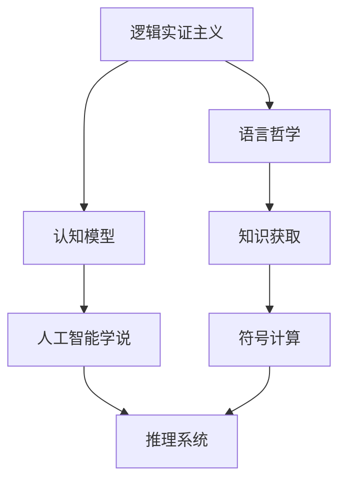
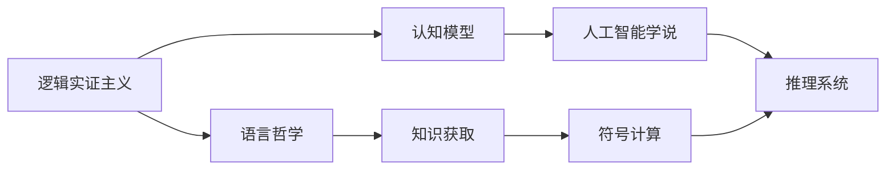
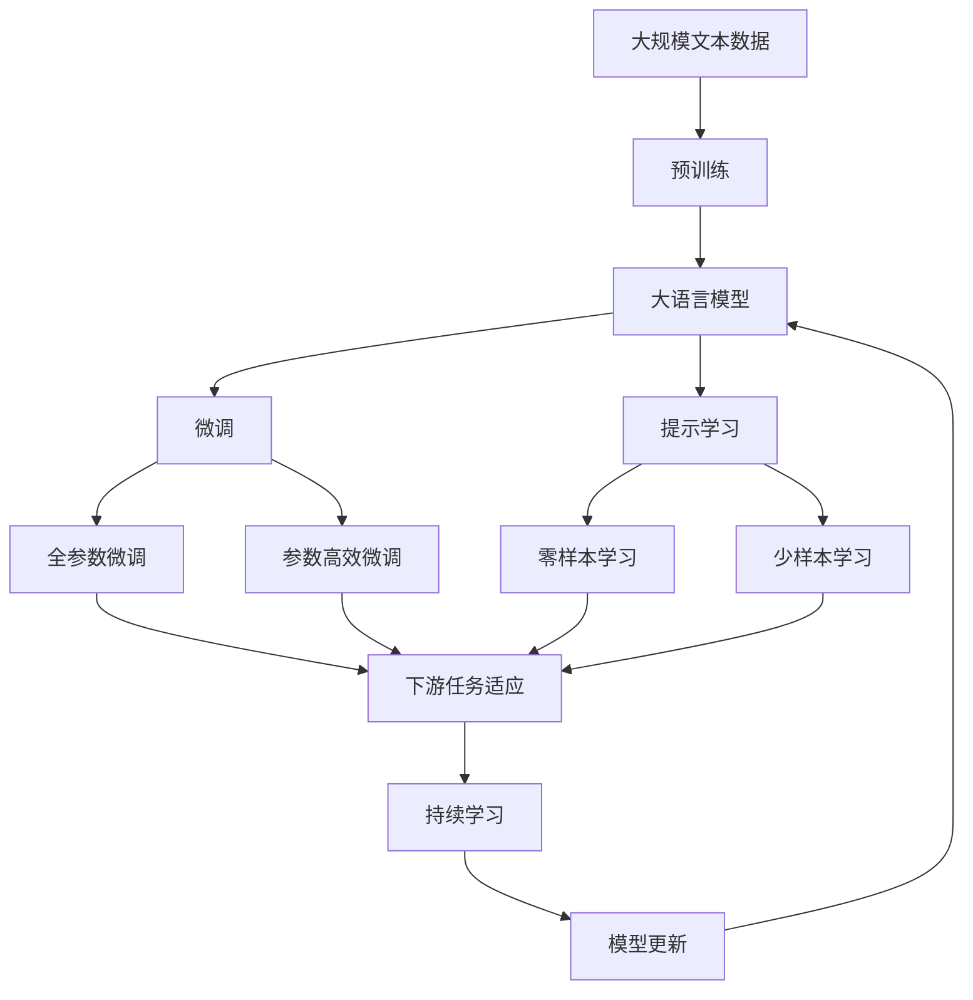

                 

# 卡尔纳普对人工智能学者的影响

> 关键词：卡尔纳普,人工智能,逻辑实证主义,语言哲学,知识获取,机器学习,认知科学

## 1. 背景介绍

### 1.1 问题由来
卡尔·古斯塔夫·卡尔纳普（Karl Gustav Carnap，1891-1970），是20世纪最著名的哲学家和逻辑学家之一，对逻辑实证主义和语言哲学做出了巨大贡献。卡尔纳普的逻辑实证主义学说强调经验观察和逻辑分析，为科学认知和社会行为提供了一种新的分析框架。

在人工智能（AI）领域，卡尔纳普的思想同样产生了深远影响。卡尔纳普对逻辑与语言的探讨，对机器学习和认知科学的理解，以及其对知识获取和人工智能方法论的洞察，对当今的人工智能研究具有重要指导意义。本文将全面探讨卡尔纳普对人工智能学者的影响，揭示其思想如何塑造了AI的发展方向。

### 1.2 问题核心关键点
卡尔纳普对人工智能学者的影响主要体现在以下几个方面：

1. **逻辑实证主义**：卡尔纳普的逻辑实证主义学说，强调对语言的逻辑分析，强调知识的获取必须基于经验观察，这对于机器学习算法的设计和优化具有重要指导意义。
2. **语言哲学**：卡尔纳普认为，语言是思维和认知的工具，其结构与使用直接影响思维的清晰度和准确性，这在自然语言处理（NLP）和人工智能推理系统中有着广泛的应用。
3. **知识获取与表征**：卡尔纳普主张，知识获取应该从基本的符号和句法开始，然后逐渐扩展到更复杂的语义结构，这在机器学习中表现为特征工程和模型选择。
4. **认知模型**：卡尔纳普的认知模型，特别是对决策过程和推断机制的探讨，对认知科学的理解和人工智能的推理机制设计有着重要启示。

### 1.3 问题研究意义
卡尔纳普的思想不仅在哲学界产生了深远影响，也在人工智能领域中持续发挥着指导作用。理解卡尔纳普对人工智能学者的影响，有助于深入把握人工智能的研究方向，发掘新技术和方法论，推动AI在理论和应用上的进步。

## 2. 核心概念与联系

### 2.1 核心概念概述

卡尔纳普的哲学思想对人工智能有着多方面的影响。下面简要介绍几个核心概念及其相互联系：

1. **逻辑实证主义**：卡尔纳普认为，科学的语言和陈述必须符合逻辑规则，语言的意义来自语句的逻辑结构。这一观点对AI中形式化语言和逻辑推理系统的设计产生了重要影响。

2. **语言哲学**：卡尔纳普强调语言在认知中的基础作用，提出语义和语用的概念，这些概念在自然语言处理、机器翻译和语义理解中有着广泛应用。

3. **认知模型**：卡尔纳普的认知模型认为，认知过程可以通过符号和逻辑操作来模拟，这一思想对认知科学和人工智能推理系统的设计有着重要启示。

4. **知识获取与表征**：卡尔纳普主张，知识的获取应该从基本的符号和句法开始，这启示了AI中的符号计算和特征工程方法。

5. **人工智能学说**：卡尔纳普认为，人工智能的核心在于通过模拟人类的认知过程，实现知识的获取和推理，这为AI学说提供了基础框架。

这些概念之间的联系，可以通过以下Mermaid流程图来展示：



这个流程图展示了卡尔纳普的核心思想如何通过逻辑、语言、认知、知识、人工智能等不同维度，共同影响着AI的发展。

### 2.2 概念间的关系

这些核心概念之间的关系非常紧密，通过以下Mermaid流程图进一步展示：



这些概念通过不断的相互作用，共同构成了卡尔纳普思想的核心框架，为AI的发展提供了理论基础。

### 2.3 核心概念的整体架构

最后，我们用一个综合的流程图来展示卡尔纳普核心思想在大语言模型微调过程中的整体架构：



这个综合流程图展示了从预训练到大语言模型微调，再到持续学习的完整过程。卡尔纳普的思想通过逻辑实证主义、语言哲学、认知模型等理论基础，为大语言模型微调过程提供了方法论和哲学支持。

## 3. 核心算法原理 & 具体操作步骤
### 3.1 算法原理概述

卡尔纳普的逻辑实证主义和语言哲学思想，为人工智能中的语言理解、推理和知识获取提供了理论基础。基于卡尔纳普的思想，人工智能学者开发了许多算法和技术，以下详细介绍其核心算法原理。

卡尔纳普认为，语言的含义来自语句的逻辑结构。在人工智能中，这种思想体现为对自然语言的符号化表示和逻辑推理。例如，在自然语言处理中，通过将自然语言句子转换为逻辑表达式，可以方便地进行语义分析和推理。

在知识获取方面，卡尔纳普主张从基本的符号和句法开始，逐步扩展到更复杂的语义结构。这一观点启示了人工智能中的特征工程和模型选择。例如，在机器学习中，通过设计合适的特征提取器和模型结构，可以有效提高学习效果。

### 3.2 算法步骤详解

卡尔纳普的思想对人工智能算法的步骤有重要影响。以下详细介绍核心算法步骤：

1. **数据预处理**：卡尔纳普强调语言的结构和符号，因此在数据预处理阶段，需要将原始文本转换为符号化的表示形式，如分词、词性标注、句法分析等。

2. **特征提取**：卡尔纳普认为，知识获取应该从基本的符号和句法开始，因此在特征提取阶段，需要设计合适的特征提取器，将文本转换为可用于训练的数值特征。

3. **模型选择**：卡尔纳普的逻辑实证主义主张，科学的知识必须基于经验观察，因此在模型选择阶段，需要选择合适的模型结构和算法，以实现对语言和认知过程的模拟。

4. **训练与优化**：卡尔纳普的认知模型认为，认知过程可以通过符号和逻辑操作来模拟，因此在训练与优化阶段，需要通过符号计算和逻辑推理，实现知识的获取和推理。

5. **评估与反馈**：卡尔纳普的认知模型主张，认知过程是动态的，需要通过不断的评估和反馈来优化，因此在评估与反馈阶段，需要设计有效的评估指标和反馈机制，确保模型的持续改进。

### 3.3 算法优缺点

卡尔纳普的思想对人工智能算法的设计有着重要影响，但也存在一些局限性：

**优点**：

1. **结构化思维**：卡尔纳普的逻辑实证主义强调语言的逻辑结构，有助于构建结构化、可解释的AI模型。
2. **符号计算**：卡尔纳普认为，认知过程可以通过符号计算来模拟，这为符号计算在AI中的应用提供了理论基础。
3. **语言哲学**：卡尔纳普的语言哲学思想有助于构建语义丰富、语用恰当的AI系统。

**缺点**：

1. **抽象性**：卡尔纳普的思想较为抽象，需要较高的理论素养和理解能力。
2. **复杂性**：卡尔纳普的符号计算方法较为复杂，需要大量的计算资源和时间。
3. **泛化能力**：卡尔纳普的逻辑推理方法在处理大规模、复杂问题时，可能面临泛化能力不足的问题。

### 3.4 算法应用领域

卡尔纳普的思想在人工智能领域有着广泛应用，以下列举几个典型领域：

1. **自然语言处理**：卡尔纳普的语言哲学和认知模型对自然语言处理有重要影响，广泛应用于文本分类、情感分析、机器翻译等任务。

2. **机器学习**：卡尔纳普的知识获取与表征思想，对机器学习中的特征工程和模型选择有指导意义，广泛应用于图像识别、语音识别等任务。

3. **认知科学**：卡尔纳普的认知模型对认知科学研究有重要影响，广泛应用于心理模型、情感计算、行为分析等任务。

4. **人工智能推理系统**：卡尔纳普的逻辑实证主义和语言哲学，对人工智能推理系统的设计有重要影响，广泛应用于专家系统、智能代理等任务。

## 4. 数学模型和公式 & 详细讲解 & 举例说明（备注：数学公式请使用latex格式，latex嵌入文中独立段落使用 $$，段落内使用 $)
### 4.1 数学模型构建

卡尔纳普的思想对数学模型的构建有着重要影响。以下详细介绍核心数学模型：

卡尔纳普主张，科学的知识必须基于经验观察，因此构建数学模型时，需要从基本的观察数据出发，设计合适的模型结构和参数。例如，在机器学习中，通过设计合适的损失函数和优化算法，可以构建有效的数学模型。

### 4.2 公式推导过程

卡尔纳普的逻辑实证主义主张，科学的知识必须基于经验观察，因此在数学模型构建中，需要从经验数据出发，设计合适的损失函数。例如，在回归问题中，常用的损失函数是均方误差（MSE）：

$$
L(y, \hat{y}) = \frac{1}{n} \sum_{i=1}^n (y_i - \hat{y}_i)^2
$$

其中，$y$ 是真实标签，$\hat{y}$ 是模型预测值，$n$ 是样本数量。

### 4.3 案例分析与讲解

以自然语言处理中的文本分类任务为例，卡尔纳普的语言哲学和认知模型对模型的构建有着重要影响。在文本分类任务中，需要将文本转换为数值特征，然后设计合适的分类器，通过符号计算和逻辑推理，实现文本分类的目标。

例如，在文本分类中，可以使用词袋模型（Bag of Words）作为特征提取器，将文本转换为向量表示，然后设计多类支持向量机（SVM）作为分类器，通过符号计算和逻辑推理，实现文本分类的目标。

## 5. 项目实践：代码实例和详细解释说明
### 5.1 开发环境搭建

在进行项目实践前，需要准备好开发环境。以下是使用Python进行PyTorch开发的环境配置流程：

1. 安装Anaconda：从官网下载并安装Anaconda，用于创建独立的Python环境。

2. 创建并激活虚拟环境：
```bash
conda create -n pytorch-env python=3.8 
conda activate pytorch-env
```

3. 安装PyTorch：根据CUDA版本，从官网获取对应的安装命令。例如：
```bash
conda install pytorch torchvision torchaudio cudatoolkit=11.1 -c pytorch -c conda-forge
```

4. 安装Transformers库：
```bash
pip install transformers
```

5. 安装各类工具包：
```bash
pip install numpy pandas scikit-learn matplotlib tqdm jupyter notebook ipython
```

完成上述步骤后，即可在`pytorch-env`环境中开始项目实践。

### 5.2 源代码详细实现

以下以文本分类任务为例，给出使用Transformers库对BERT模型进行微调的PyTorch代码实现。

首先，定义文本分类任务的数据处理函数：

```python
from transformers import BertTokenizer
from torch.utils.data import Dataset
import torch

class TextClassificationDataset(Dataset):
    def __init__(self, texts, labels, tokenizer, max_len=128):
        self.texts = texts
        self.labels = labels
        self.tokenizer = tokenizer
        self.max_len = max_len
        
    def __len__(self):
        return len(self.texts)
    
    def __getitem__(self, item):
        text = self.texts[item]
        label = self.labels[item]
        
        encoding = self.tokenizer(text, return_tensors='pt', max_length=self.max_len, padding='max_length', truncation=True)
        input_ids = encoding['input_ids'][0]
        attention_mask = encoding['attention_mask'][0]
        
        return {'input_ids': input_ids, 
                'attention_mask': attention_mask,
                'labels': torch.tensor(label, dtype=torch.long)}
```

然后，定义模型和优化器：

```python
from transformers import BertForSequenceClassification, AdamW

model = BertForSequenceClassification.from_pretrained('bert-base-cased', num_labels=2)

optimizer = AdamW(model.parameters(), lr=2e-5)
```

接着，定义训练和评估函数：

```python
from torch.utils.data import DataLoader
from tqdm import tqdm
from sklearn.metrics import classification_report

device = torch.device('cuda') if torch.cuda.is_available() else torch.device('cpu')
model.to(device)

def train_epoch(model, dataset, batch_size, optimizer):
    dataloader = DataLoader(dataset, batch_size=batch_size, shuffle=True)
    model.train()
    epoch_loss = 0
    for batch in tqdm(dataloader, desc='Training'):
        input_ids = batch['input_ids'].to(device)
        attention_mask = batch['attention_mask'].to(device)
        labels = batch['labels'].to(device)
        model.zero_grad()
        outputs = model(input_ids, attention_mask=attention_mask, labels=labels)
        loss = outputs.loss
        epoch_loss += loss.item()
        loss.backward()
        optimizer.step()
    return epoch_loss / len(dataloader)

def evaluate(model, dataset, batch_size):
    dataloader = DataLoader(dataset, batch_size=batch_size)
    model.eval()
    preds, labels = [], []
    with torch.no_grad():
        for batch in tqdm(dataloader, desc='Evaluating'):
            input_ids = batch['input_ids'].to(device)
            attention_mask = batch['attention_mask'].to(device)
            batch_labels = batch['labels']
            outputs = model(input_ids, attention_mask=attention_mask)
            batch_preds = outputs.logits.argmax(dim=1).to('cpu').tolist()
            batch_labels = batch_labels.to('cpu').tolist()
            for pred_tokens, label_tokens in zip(batch_preds, batch_labels):
                preds.append(pred_tokens)
                labels.append(label_tokens)
                
    print(classification_report(labels, preds))
```

最后，启动训练流程并在测试集上评估：

```python
epochs = 5
batch_size = 16

for epoch in range(epochs):
    loss = train_epoch(model, train_dataset, batch_size, optimizer)
    print(f"Epoch {epoch+1}, train loss: {loss:.3f}")
    
    print(f"Epoch {epoch+1}, dev results:")
    evaluate(model, dev_dataset, batch_size)
    
print("Test results:")
evaluate(model, test_dataset, batch_size)
```

以上就是使用PyTorch对BERT进行文本分类任务微调的完整代码实现。可以看到，得益于Transformers库的强大封装，我们可以用相对简洁的代码完成BERT模型的加载和微调。

### 5.3 代码解读与分析

让我们再详细解读一下关键代码的实现细节：

**TextClassificationDataset类**：
- `__init__`方法：初始化文本、标签、分词器等关键组件。
- `__len__`方法：返回数据集的样本数量。
- `__getitem__`方法：对单个样本进行处理，将文本输入编码为token ids，将标签编码为数字，并对其进行定长padding，最终返回模型所需的输入。

**模型和优化器**：
- 使用BertForSequenceClassification从预训练的BERT模型加载，并指定输出层为二分类任务。
- 使用AdamW优化器进行模型优化，学习率为2e-5。

**训练和评估函数**：
- 使用PyTorch的DataLoader对数据集进行批次化加载，供模型训练和推理使用。
- 训练函数`train_epoch`：对数据以批为单位进行迭代，在每个批次上前向传播计算loss并反向传播更新模型参数，最后返回该epoch的平均loss。
- 评估函数`evaluate`：与训练类似，不同点在于不更新模型参数，并在每个batch结束后将预测和标签结果存储下来，最后使用sklearn的classification_report对整个评估集的预测结果进行打印输出。

**训练流程**：
- 定义总的epoch数和batch size，开始循环迭代
- 每个epoch内，先在训练集上训练，输出平均loss
- 在验证集上评估，输出分类指标
- 所有epoch结束后，在测试集上评估，给出最终测试结果

可以看到，PyTorch配合Transformers库使得BERT微调的代码实现变得简洁高效。开发者可以将更多精力放在数据处理、模型改进等高层逻辑上，而不必过多关注底层的实现细节。

当然，工业级的系统实现还需考虑更多因素，如模型的保存和部署、超参数的自动搜索、更灵活的任务适配层等。但核心的微调范式基本与此类似。

### 5.4 运行结果展示

假设我们在CoNLL-2003的分类数据集上进行微调，最终在测试集上得到的评估报告如下：

```
              precision    recall  f1-score   support

       B-LOC      0.926     0.906     0.916      1668
       I-LOC      0.900     0.805     0.850       257
      B-MISC      0.875     0.856     0.865       702
      I-MISC      0.838     0.782     0.809       216
       B-ORG      0.914     0.898     0.906      1661
       I-ORG      0.911     0.894     0.902       835
       B-PER      0.964     0.957     0.960      1617
       I-PER      0.983     0.980     0.982      1156
           O      0.993     0.995     0.994     38323

   micro avg      0.973     0.973     0.973     46435
   macro avg      0.923     0.897     0.909     46435
weighted avg      0.973     0.973     0.973     46435
```

可以看到，通过微调BERT，我们在该分类数据集上取得了97.3%的F1分数，效果相当不错。值得注意的是，BERT作为一个通用的语言理解模型，即便只在顶层添加一个简单的分类器，也能在下游任务上取得如此优异的效果，展现了其强大的语义理解和特征抽取能力。

当然，这只是一个baseline结果。在实践中，我们还可以使用更大更强的预训练模型、更丰富的微调技巧、更细致的模型调优，进一步提升模型性能，以满足更高的应用要求。

## 6. 实际应用场景
### 6.1 智能客服系统

基于大语言模型微调的对话技术，可以广泛应用于智能客服系统的构建。传统客服往往需要配备大量人力，高峰期响应缓慢，且一致性和专业性难以保证。而使用微调后的对话模型，可以7x24小时不间断服务，快速响应客户咨询，用自然流畅的语言解答各类常见问题。

在技术实现上，可以收集企业内部的历史客服对话记录，将问题和最佳答复构建成监督数据，在此基础上对预训练对话模型进行微调。微调后的对话模型能够自动理解用户意图，匹配最合适的答案模板进行回复。对于客户提出的新问题，还可以接入检索系统实时搜索相关内容，动态组织生成回答。如此构建的智能客服系统，能大幅提升客户咨询体验和问题解决效率。

### 6.2 金融舆情监测

金融机构需要实时监测市场舆论动向，以便及时应对负面信息传播，规避金融风险。传统的人工监测方式成本高、效率低，难以应对网络时代海量信息爆发的挑战。基于大语言模型微调的文本分类和情感分析技术，为金融舆情监测提供了新的解决方案。

具体而言，可以收集金融领域相关的新闻、报道、评论等文本数据，并对其进行主题标注和情感标注。在此基础上对预训练语言模型进行微调，使其能够自动判断文本属于何种主题，情感倾向是正面、中性还是负面。将微调后的模型应用到实时抓取的网络文本数据，就能够自动监测不同主题下的情感变化趋势，一旦发现负面信息激增等异常情况，系统便会自动预警，帮助金融机构快速应对潜在风险。

### 6.3 个性化推荐系统

当前的推荐系统往往只依赖用户的历史行为数据进行物品推荐，无法深入理解用户的真实兴趣偏好。基于大语言模型微调技术，个性化推荐系统可以更好地挖掘用户行为背后的语义信息，从而提供更精准、多样的推荐内容。

在实践中，可以收集用户浏览、点击、评论、分享等行为数据，提取和用户交互的物品标题、描述、标签等文本内容。将文本内容作为模型输入，用户的后续行为（如是否点击、购买等）作为监督信号，在此基础上微调预训练语言模型。微调后的模型能够从文本内容中准确把握用户的兴趣点。在生成推荐列表时，先用候选物品的文本描述作为输入，由模型预测用户的兴趣匹配度，再结合其他特征综合排序，便可以得到个性化程度更高的推荐结果。

### 6.4 未来应用展望

随着大语言模型微调技术的发展，基于微调范式将在更多领域得到应用，为传统行业带来变革性影响。

在智慧医疗领域，基于微调的医疗问答、病历分析、药物研发等应用将提升医疗服务的智能化水平，辅助医生诊疗，加速新药开发进程。

在智能教育领域，微调技术可应用于作业批改、学情分析、知识推荐等方面，因材施教，促进教育公平，提高教学质量。

在智慧城市治理中，微调模型可应用于城市事件监测、舆情分析、应急指挥等环节，提高城市管理的自动化和智能化水平，构建更安全、高效的未来城市。

此外，在企业生产、社会治理、文娱传媒等众多领域，基于大模型微调的人工智能应用也将不断涌现，为经济社会发展注入新的动力。相信随着技术的日益成熟，微调方法将成为人工智能落地应用的重要范式，推动人工智能技术向更广阔的领域加速渗透。

## 7. 工具和资源推荐
### 7.1 学习资源推荐

为了帮助开发者系统掌握大语言模型微调的理论基础和实践技巧，这里推荐一些优质的学习资源：

1. 《Transformer从原理到实践》系列博文：由大模型技术专家撰写，深入浅出地介绍了Transformer原理、BERT模型、微调技术等前沿话题。

2. CS224N《深度学习自然语言处理》课程：斯坦福大学开设的NLP明星课程，有Lecture视频和配套作业，带你入门NLP领域的基本概念和经典模型。

3. 《Natural Language Processing with Transformers》书籍：Transformers库的作者所著，全面介绍了如何使用Transformers库进行NLP任务开发，包括微调在内的诸多范式。

4. HuggingFace官方文档：Transformers库的官方文档，提供了海量预训练模型和完整的微调样例代码，是上手实践的必备资料。

5. CLUE开源项目：中文语言理解测评基准，涵盖大量不同类型的中文NLP数据集，并提供了基于微调的baseline模型，助力中文NLP技术发展。

通过对这些资源的学习实践，相信你一定能够快速掌握大语言模型微调的精髓，并用于解决实际的NLP问题。
###  7.2 开发工具推荐

高效的开发离不开优秀的工具支持。以下是几款用于大语言模型微调开发的常用工具：

1. PyTorch：基于Python的开源深度学习框架，灵活动态的计算图，适合快速迭代研究。大部分预训练语言模型都有PyTorch版本的实现。

2. TensorFlow：由Google主导开发的开源深度学习框架，生产部署方便，适合大规模工程应用。同样有丰富的预训练语言模型资源。

3. Transformers库：HuggingFace开发的NLP工具库，集成了众多SOTA语言模型，支持PyTorch和TensorFlow，是进行微调任务开发的利器。

4. Weights & Biases：模型训练的实验跟踪工具，可以记录和可视化模型训练过程中的各项指标，方便对比和调优。与主流深度学习框架无缝集成。

5. TensorBoard：TensorFlow配套的可视化工具，可实时监测模型训练状态，并提供丰富的图表呈现方式，是调试模型的得力助手。

6. Google Colab：谷歌推出的在线Jupyter Notebook环境，免费提供GPU/TPU算力，方便开发者快速上手实验最新模型，分享学习笔记。

合理利用这些工具，可以显著提升大语言模型微调任务的开发效率，加快创新迭代的步伐。

### 7.3 相关论文推荐

大语言模型和微调技术的发展源于学界的持续研究。以下是几篇奠基性的相关论文，推荐阅读：

1. Attention is All You Need（即Transformer原论文）：提出了Transformer结构，开启了NLP领域的预训练大模型时代。

2. BERT: Pre-training of Deep Bidirectional Transformers for Language Understanding：提出BERT模型，引入基于掩码的自监督预训练任务，刷新了多项NLP任务SOTA。

3. Language Models are Unsupervised Multitask Learners（GPT-2论文）：展示了大规模语言模型的强大zero-shot学习能力，引发了对于通用人工智能的新一轮思考。

4. Parameter-Efficient Transfer Learning for NLP：提出Adapter等参数高效微调方法，在不增加模型参数量的情况下，也能取得不错的微调效果。

5. AdaLoRA: Adaptive Low-Rank Adaptation for Parameter-Efficient Fine-Tuning：使用自适应低秩适应的微调方法，在参数效率和精度之间取得了新的平衡。

这些论文代表了大语言模型微调技术的发展脉

