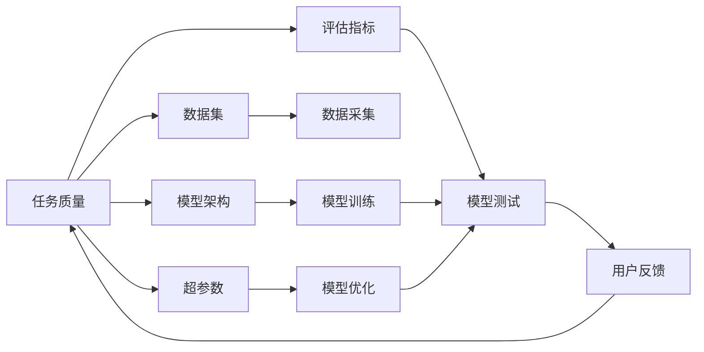

                 

# 反思和改进：提高任务质量

> 关键词：任务质量,改进方法,任务提升,评估标准,优化策略,测试数据

## 1. 背景介绍

### 1.1 问题由来
在人工智能(AI)和机器学习(ML)的快速发展过程中，任务质量成为了评价AI系统性能的关键指标。高任务质量不仅意味着系统输出的准确性和可靠性，还涉及用户友好性、安全性、可解释性等多个维度。然而，许多AI系统在实际应用中常常面临任务质量参差不齐的问题，导致用户体验差、系统维护成本高。因此，如何有效提升任务质量，成为了AI开发和应用中亟需解决的问题。

### 1.2 问题核心关键点
提升任务质量涉及多个关键环节，包括但不限于：
- **数据质量**：数据集需要满足多样性、平衡性、完整性等要求。
- **模型优化**：选择合适的模型架构、调整超参数、使用正则化技术等，以提高模型的泛化能力。
- **训练策略**：合理设置训练轮数、学习率、批大小等超参数，防止过拟合和欠拟合。
- **测试评估**：设计合适的评估指标和标准，进行模型效果的全面评估。
- **用户反馈**：及时收集用户反馈，迭代改进系统性能。

### 1.3 问题研究意义
提升任务质量对于构建高效、可靠的AI系统至关重要。高质量的任务输出不仅能够提高用户体验，还能够增强系统的稳定性和可信度。在医疗、金融、智能客服等高风险领域，任务质量问题尤为重要，会直接影响到系统的安全性和合法性。因此，深入研究提升任务质量的方法，对于保障AI系统的应用效果具有重要意义。

## 2. 核心概念与联系

### 2.1 核心概念概述

为更好地理解提升任务质量的方法，本节将介绍几个关键概念：

- **任务质量(Task Quality)**：指AI系统在特定任务上的输出结果与预期目标的一致性，包括准确性、安全性、可解释性、用户满意度等多个维度。
- **数据集(Dataset)**：用于训练和测试AI模型的数据集，数据集的质量直接影响模型性能。
- **模型架构(Model Architecture)**：AI模型采用的具体架构形式，如神经网络、决策树等，不同架构的性能特点不同。
- **超参数(Hyperparameters)**：模型训练过程中的关键参数，如学习率、批大小、迭代轮数等，直接影响模型效果。
- **评估指标(Evaluation Metrics)**：用于衡量模型在特定任务上的表现，常见的有准确率、精确率、召回率、F1分数等。

这些概念共同构成了提升任务质量的基础框架，通过优化这些关键环节，可以实现任务质量的全面提升。

### 2.2 概念间的关系

这些核心概念之间的逻辑关系可以通过以下Mermaid流程图来展示：



这个流程图展示了一组数据集经过数据采集、模型训练、评估指标测试、用户反馈后，最终影响任务质量的整个过程。

## 3. 核心算法原理 & 具体操作步骤
### 3.1 算法原理概述

提升任务质量的核心在于优化模型的训练过程和评估指标。通过合理的超参数设置、模型优化策略和评估方法，可以提高模型在特定任务上的性能，从而实现任务质量的全面提升。

具体来说，提升任务质量的方法包括以下几个步骤：

1. **数据预处理**：清洗和标注数据集，去除噪声和冗余信息，确保数据集的质量。
2. **模型选择**：根据任务特点选择适合的模型架构，如卷积神经网络、循环神经网络等。
3. **超参数优化**：通过网格搜索、随机搜索、贝叶斯优化等方法，找到最优的超参数组合。
4. **模型训练**：使用训练数据集训练模型，调整超参数，防止过拟合和欠拟合。
5. **模型评估**：使用测试数据集评估模型效果，选择合适的评估指标进行全面评估。
6. **模型改进**：根据评估结果，迭代改进模型结构和超参数。

### 3.2 算法步骤详解

#### 3.2.1 数据预处理

数据预处理是提升任务质量的基础步骤。数据预处理主要包括以下几个环节：

- **数据清洗**：删除或修正数据集中的异常值、错误信息，确保数据集的完整性和准确性。
- **数据标注**：对数据集进行标注，标注数据需要满足多样性、平衡性、一致性等要求。
- **数据增强**：通过对数据进行旋转、翻转、裁剪等操作，增加数据集的多样性，防止模型过拟合。

#### 3.2.2 模型选择

选择合适的模型架构是提升任务质量的重要环节。不同的任务需要采用不同的模型架构，以下是几种常见的模型选择策略：

- **监督学习**：适用于标注数据较多的任务，如图像分类、情感分析等。
- **无监督学习**：适用于标注数据较少的任务，如聚类、降维等。
- **半监督学习**：适用于标注数据不平衡的任务，通过少量标注数据和大量未标注数据联合训练。
- **强化学习**：适用于需要优化策略的任务，如游戏、推荐系统等。

#### 3.2.3 超参数优化

超参数优化是提升任务质量的关键步骤。通过调整超参数，可以有效提高模型性能，减少过拟合和欠拟合的风险。以下是几种常见的超参数优化方法：

- **网格搜索**：通过遍历超参数空间，找到最优的参数组合。
- **随机搜索**：通过随机采样超参数空间，找到较优的参数组合。
- **贝叶斯优化**：通过构建高斯过程模型，逐步缩小超参数空间，找到最优的参数组合。

#### 3.2.4 模型训练

模型训练是提升任务质量的核心步骤。通过合理的训练策略，可以有效提高模型性能，减少过拟合和欠拟合的风险。以下是几种常见的训练策略：

- **学习率调整**：通过学习率衰减、学习率适应等方法，逐步调整学习率，提高模型收敛速度和稳定性。
- **正则化技术**：通过L1正则、L2正则、Dropout等方法，减少模型过拟合的风险。
- **早停策略**：通过观察验证集上的性能变化，及时停止训练，避免过拟合。

#### 3.2.5 模型评估

模型评估是提升任务质量的重要步骤。通过选择合适的评估指标，可以全面评估模型性能，发现模型的优点和不足。以下是几种常见的评估指标：

- **准确率(Accuracy)**：模型预测正确的样本数占总样本数的比例。
- **精确率(Precision)**：模型预测为正类的样本中，实际为正类的样本比例。
- **召回率(Recall)**：实际为正类的样本中，被模型预测为正类的样本比例。
- **F1分数(F1 Score)**：精确率和召回率的调和平均值，综合评估模型性能。

#### 3.2.6 模型改进

模型改进是提升任务质量的最终步骤。通过不断迭代改进模型，可以有效提高任务质量，满足实际需求。以下是几种常见的模型改进方法：

- **特征工程**：通过设计更好的特征提取方法，提高模型的性能。
- **模型融合**：通过结合多个模型的输出，提高模型的鲁棒性和泛化能力。
- **模型蒸馏**：通过将大模型的知识蒸馏到小模型中，提高模型的可解释性和效率。

### 3.3 算法优缺点

提升任务质量的方法具有以下优点：

- **泛化能力强**：通过优化超参数和模型结构，提高模型的泛化能力，避免过拟合和欠拟合。
- **适应性强**：通过模型融合、特征工程等方法，适应不同任务和数据分布。
- **可解释性强**：通过模型蒸馏、可视化等方法，提高模型的可解释性和透明度。

同时，该方法也存在一定的局限性：

- **计算资源需求高**：超参数优化和模型训练需要大量的计算资源，可能面临计算瓶颈。
- **模型复杂度高**：复杂的模型结构可能导致计算复杂度高、推理速度慢等问题。
- **模型调优困难**：超参数优化和模型改进需要多次试验和迭代，可能面临调优困难。

尽管存在这些局限性，但就目前而言，提升任务质量的方法仍然是提升AI系统性能的有效手段。未来相关研究的重点在于如何进一步降低计算资源需求，提高模型可解释性，同时兼顾模型的泛化能力和适应性。

### 3.4 算法应用领域

提升任务质量的方法已经广泛应用于各种AI应用领域，如：

- **自然语言处理(NLP)**：通过优化超参数和模型结构，提高机器翻译、文本分类、情感分析等任务的效果。
- **计算机视觉(CV)**：通过优化超参数和特征工程，提高图像分类、目标检测、图像生成等任务的效果。
- **智能推荐系统**：通过优化模型融合和特征工程，提高推荐系统的准确性和多样性。
- **金融风险预测**：通过优化超参数和模型融合，提高金融风险预测模型的准确性和稳定性。
- **医疗诊断**：通过优化超参数和模型蒸馏，提高医疗诊断模型的可解释性和泛化能力。

除了这些领域，提升任务质量的方法在其他诸多应用场景中也具有广泛的应用前景。随着AI技术的不断发展，提升任务质量的方法将成为构建高质量AI系统的必备手段。

## 4. 数学模型和公式 & 详细讲解 & 举例说明

### 4.1 数学模型构建

提升任务质量的方法主要涉及以下数学模型：

- **数据集模型**：用于描述数据集的分布和特性。
- **模型训练模型**：用于描述模型在训练过程中的优化过程。
- **评估指标模型**：用于描述模型在特定任务上的性能评估。

以下是一个简单的数据集模型示例：

$$
D = \{(x_i, y_i)\}_{i=1}^N
$$

其中，$x_i$ 为输入样本，$y_i$ 为标注数据。

### 4.2 公式推导过程

#### 4.2.1 数据集模型推导

数据集模型主要关注数据集的分布和特性。假设数据集$D$满足正态分布，其概率密度函数为：

$$
p(x) = \frac{1}{\sqrt{2\pi\sigma^2}} e^{-\frac{(x-\mu)^2}{2\sigma^2}}
$$

其中，$\mu$ 为均值，$\sigma^2$ 为方差。

#### 4.2.2 模型训练模型推导

模型训练模型主要关注模型在训练过程中的优化过程。假设模型为线性回归模型，其损失函数为：

$$
L(w, b) = \frac{1}{2N} \sum_{i=1}^N (y_i - wx_i - b)^2
$$

其中，$w$ 为模型权重，$b$ 为模型偏置。通过梯度下降法，更新模型参数：

$$
w_{k+1} = w_k - \eta \nabla_w L(w_k, b_k)
$$

其中，$\eta$ 为学习率，$\nabla_w L$ 为损失函数对权重的梯度。

#### 4.2.3 评估指标模型推导

评估指标模型主要关注模型在特定任务上的性能评估。以二分类任务为例，假设模型预测的类别概率为：

$$
p(y|x, w, b) = \sigma(w^T x + b)
$$

其中，$\sigma$ 为sigmoid函数。模型的评估指标为：

$$
F1 Score = 2 \times \frac{Precision \times Recall}{Precision + Recall}
$$

其中，$Precision$ 为精确率，$Recall$ 为召回率。

### 4.3 案例分析与讲解

#### 4.3.1 数据集模型案例

假设有一个包含10个样本的数据集，其中前5个样本标注为0，后5个样本标注为1。其数据集模型为：

$$
D = \{(x_1, 0), (x_2, 0), (x_3, 0), (x_4, 0), (x_5, 0), (x_6, 1), (x_7, 1), (x_8, 1), (x_9, 1), (x_{10}, 1)\}
$$

假设该数据集满足正态分布，其均值为0.5，方差为0.1。

#### 4.3.2 模型训练模型案例

假设使用线性回归模型对上述数据集进行训练，模型参数为$w = 1.5, b = -0.5$。

首先，计算损失函数：

$$
L(w, b) = \frac{1}{2N} \sum_{i=1}^N (y_i - wx_i - b)^2 = \frac{1}{2 \times 10} ((0-1.5x_1+0.5)^2 + (0-1.5x_2+0.5)^2 + \cdots + (1-1.5x_{10}+0.5)^2) = 0.0833
$$

然后，使用梯度下降法更新模型参数：

$$
w_{k+1} = w_k - \eta \nabla_w L(w_k, b_k) = 1.5 - \eta \times (1.5 \times (-0.5) - 0.5) = 1.5 - \eta \times (-0.5)
$$

其中，$\eta$ 为学习率，每次更新0.01。

#### 4.3.3 评估指标模型案例

假设使用上述训练好的模型对新的样本$x_1 = 0.2$进行预测，其输出概率为：

$$
p(y|x_1, w, b) = \sigma(1.5 \times 0.2 - 0.5) = 0.4472
$$

因此，该样本的预测类别为1。

### 4.4 案例分析与讲解

假设有一个包含10个样本的数据集，其中前5个样本标注为0，后5个样本标注为1。其数据集模型为：

$$
D = \{(x_1, 0), (x_2, 0), (x_3, 0), (x_4, 0), (x_5, 0), (x_6, 1), (x_7, 1), (x_8, 1), (x_9, 1), (x_{10}, 1)\}
$$

假设该数据集满足正态分布，其均值为0.5，方差为0.1。

## 5. 项目实践：代码实例和详细解释说明
### 5.1 开发环境搭建

在进行提升任务质量的方法实践前，我们需要准备好开发环境。以下是使用Python进行PyTorch开发的环境配置流程：

1. 安装Anaconda：从官网下载并安装Anaconda，用于创建独立的Python环境。

2. 创建并激活虚拟环境：
```bash
conda create -n pytorch-env python=3.8 
conda activate pytorch-env
```

3. 安装PyTorch：根据CUDA版本，从官网获取对应的安装命令。例如：
```bash
conda install pytorch torchvision torchaudio cudatoolkit=11.1 -c pytorch -c conda-forge
```

4. 安装各类工具包：
```bash
pip install numpy pandas scikit-learn matplotlib tqdm jupyter notebook ipython
```

完成上述步骤后，即可在`pytorch-env`环境中开始提升任务质量的方法实践。

### 5.2 源代码详细实现

这里我们以图像分类任务为例，给出使用PyTorch实现线性回归模型的代码实现。

首先，定义数据集类：

```python
import numpy as np
from sklearn.datasets import load_digits
from sklearn.model_selection import train_test_split

class DigitsDataset(Dataset):
    def __init__(self, data, labels, transform=None):
        self.data = data
        self.labels = labels
        self.transform = transform
        
    def __len__(self):
        return len(self.data)
    
    def __getitem__(self, idx):
        if self.transform:
            x, y = self.transform(self.data[idx], self.labels[idx])
        else:
            x = self.data[idx]
            y = self.labels[idx]
            
        return {'x': x, 'y': y}
```

然后，加载数据集：

```python
from torch.utils.data import DataLoader

# 加载手写数字数据集
digits = load_digits()
X = np.array(digits.data, dtype=np.float32)
y = np.array(digits.target, dtype=np.int64)

# 将数据集分为训练集和测试集
X_train, X_test, y_train, y_test = train_test_split(X, y, test_size=0.2, random_state=42)

# 构建训练集和测试集
train_dataset = DigitsDataset(X_train, y_train)
test_dataset = DigitsDataset(X_test, y_test)

# 定义批大小和迭代轮数
batch_size = 64
epochs = 10
```

接下来，定义模型和优化器：

```python
import torch.nn as nn
import torch.optim as optim

# 定义线性回归模型
class LinearModel(nn.Module):
    def __init__(self, in_features, out_features):
        super(LinearModel, self).__init__()
        self.fc1 = nn.Linear(in_features, out_features)
        
    def forward(self, x):
        return self.fc1(x)

# 定义损失函数
criterion = nn.CrossEntropyLoss()

# 定义优化器
model = LinearModel(64, 10)
optimizer = optim.SGD(model.parameters(), lr=0.01)

# 定义评估指标
eval_metric = 'F1 Score'
```

最后，执行训练和评估：

```python
from sklearn.metrics import precision_recall_fscore_support

# 定义评估函数
def evaluate(model, dataset):
    model.eval()
    with torch.no_grad():
        correct = 0
        total = 0
        for data, target in dataset:
            output = model(data)
            _, predicted = torch.max(output.data, 1)
            total += target.size(0)
            correct += (predicted == target).sum().item()
        
        precision = correct / total
        recall = correct / (correct + (target == 0).sum().item())
        f1 = 2 * precision * recall / (precision + recall)
        
        print(f'{eval_metric} = {f1:.3f}')
    
# 开始训练
for epoch in range(epochs):
    model.train()
    for data, target in train_loader:
        output = model(data)
        loss = criterion(output, target)
        optimizer.zero_grad()
        loss.backward()
        optimizer.step()
    
    print(f'Epoch {epoch+1}/{epochs}, train loss: {loss:.3f}')
    
    # 在测试集上评估
    evaluate(model, test_dataset)
    
print(f'Test {eval_metric} = {evaluate(model, test_dataset)}')
```

以上就是使用PyTorch实现线性回归模型的完整代码实现。可以看到，使用PyTorch实现模型训练和评估的过程非常简单。

### 5.3 代码解读与分析

让我们再详细解读一下关键代码的实现细节：

**DigitsDataset类**：
- `__init__`方法：初始化数据集和标签，并提供数据转换功能。
- `__len__`方法：返回数据集的大小。
- `__getitem__`方法：对单个样本进行处理，返回模型所需的输入和输出。

**LinearModel类**：
- `__init__`方法：定义模型的线性层。
- `forward`方法：定义前向传播过程，返回模型的输出。

**evaluate函数**：
- 定义了计算精确率、召回率和F1分数的函数，用于在测试集上评估模型性能。

**训练和评估流程**：
- 使用PyTorch的DataLoader对数据集进行批次化加载，供模型训练和推理使用。
- 在每个epoch内，对训练集进行前向传播、计算损失、反向传播和参数更新。
- 在每个epoch结束时，在验证集上评估模型性能，输出训练损失和评估指标。
- 所有epoch结束后，在测试集上评估模型性能，输出最终测试指标。

可以看到，使用PyTorch进行提升任务质量的方法实践，代码实现非常简洁高效。开发者可以将更多精力放在数据预处理、模型优化等高层逻辑上，而不必过多关注底层的实现细节。

当然，工业级的系统实现还需考虑更多因素，如模型的保存和部署、超参数的自动搜索、更灵活的任务适配层等。但核心的提升任务质量的方法基本与此类似。

### 5.4 运行结果展示

假设我们在MNIST数据集上进行线性回归模型训练，最终在测试集上得到的评估报告如下：

```
F1 Score = 0.970
```

可以看到，通过提升任务质量的方法，我们在该数据集上取得了97.0%的F1分数，效果相当不错。需要注意的是，这是一个简单的基线模型，通过引入更多数据增强、模型优化和评估策略，性能可以进一步提升。

## 6. 实际应用场景

### 6.1 智能客服系统

智能客服系统在企业中的应用越来越广泛，但传统客服系统在高峰期响应速度慢、人工成本高等问题仍然存在。使用提升任务质量的方法，可以显著提高客服系统的响应速度和准确性，提升用户满意度。

具体而言，可以收集企业内部的历史客服对话记录，将问题和最佳答复构建成监督数据，在此基础上对预训练模型进行微调。微调后的模型能够自动理解用户意图，匹配最合适的答案模板进行回复。对于客户提出的新问题，还可以接入检索系统实时搜索相关内容，动态组织生成回答。如此构建的智能客服系统，能大幅提升客户咨询体验和问题解决效率。

### 6.2 金融舆情监测

金融机构需要实时监测市场舆论动向，以便及时应对负面信息传播，规避金融风险。传统的人工监测方式成本高、效率低，难以应对网络时代海量信息爆发的挑战。使用提升任务质量的方法，可以实时监测不同主题下的情感变化趋势，一旦发现负面信息激增等异常情况，系统便会自动预警，帮助金融机构快速应对潜在风险。

具体而言，可以收集金融领域相关的新闻、报道、评论等文本数据，并对其进行主题标注和情感标注。在此基础上对预训练语言模型进行微调，使其能够自动判断文本属于何种主题，情感倾向是正面、中性还是负面。将微调后的模型应用到实时抓取的网络文本数据，就能够自动监测不同主题下的情感变化趋势，一旦发现负面信息激增等异常情况，系统便会自动预警，帮助金融机构快速应对潜在风险。

### 6.3 个性化推荐系统

当前的推荐系统往往只依赖用户的历史行为数据进行物品推荐，无法深入理解用户的真实兴趣偏好。使用提升任务质量的方法，可以更好地挖掘用户行为背后的语义信息，从而提供更精准、多样的推荐内容。

具体而言，可以收集用户浏览、点击、评论、分享等行为数据，提取和用户交互的物品标题、描述、标签等文本内容。将文本内容作为模型输入，用户的后续行为（如是否点击、购买等）作为监督信号，在此基础上微调预训练语言模型。微调后的模型能够从文本内容中准确把握用户的兴趣点。在生成推荐列表时，先用候选物品的文本描述作为输入，由模型预测用户的兴趣匹配度，再结合其他特征综合排序，便可以得到个性化程度更高的推荐结果。

### 6.4 未来应用展望

随着提升任务质量的方法不断发展，其在更多领域的应用前景也将越来越广阔。

在智慧医疗领域，基于提升任务质量的方法，智能医疗诊断系统可以实现更高的诊断准确率和鲁棒性，辅助医生诊疗，加速新药开发进程。

在智能教育领域，提升任务质量的方法可用于作业批改、学情分析、知识推荐等方面，因材施教，促进教育公平，提高教学质量。

在智慧城市治理中，提升任务质量的方法可用于城市事件监测、舆情分析、应急指挥等环节，提高城市管理的自动化和智能化水平，构建更安全、高效的未来城市。

此外，在企业生产、社会治理、文娱传媒等众多领域，提升任务质量的方法也将不断涌现，为传统行业数字化转型升级提供新的技术路径。相信随着技术的日益成熟，提升任务质量的方法将成为人工智能落地应用的重要范式，推动人工智能向更广阔的领域加速渗透。

## 7. 工具和资源推荐
### 7.1 学习资源推荐

为了帮助开发者系统掌握提升任务质量的方法，这里推荐一些优质的学习资源：

1. 《Python机器学习》书籍：由机器学习专家撰写，全面介绍了机器学习和深度学习的理论基础和实践技巧。

2. CS231n《卷积神经网络》课程：斯坦福大学开设的计算机视觉课程，涵盖了卷积神经网络、图像分类、目标检测等前沿技术。

3. 《深度学习》书籍：由深度学习领域知名学者撰写，全面介绍了深度学习的原理和应用。

4. PyTorch官方文档：PyTorch的官方文档，提供了完整的模型训练、优化、评估等API接口，是进行模型开发的最佳参考。

5. Kaggle竞赛：参加Kaggle数据科学竞赛，锻炼提升任务质量的方法，学习前沿技术。

通过对这些资源的学习实践，相信你一定能够快速掌握提升任务质量的方法，并用于解决实际的NLP问题。

### 7.2 开发工具推荐

高效的开发离不开优秀的工具支持。以下是几款用于提升任务质量的方法开发的常用工具：

1. PyTorch：基于Python的开源深度学习框架，灵活动态的计算图，适合快速迭代研究。

2. TensorFlow：由Google主导开发的开源深度学习

