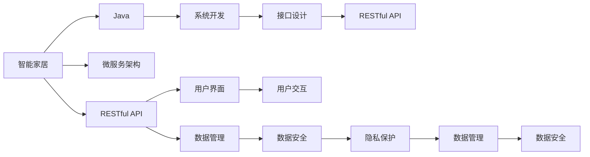

                 

# 基于Java的智能家居设计：基于RESTful的智能家居控制API设计

> 关键词：
智能家居, RESTful, Java, API设计, 物联网(IoT), 微服务架构, 用户界面(UI), 数据库设计, 安全性, 可扩展性

## 1. 背景介绍

### 1.1 问题由来

随着物联网技术的迅猛发展，智能家居已经成为智能城市的重要组成部分。智能家居系统通过各种传感器、执行器、智能设备和控制系统，实现对家居环境的智能监控、调节和控制。这不仅提升了用户的居住体验，也提高了能源利用效率，具有巨大的市场前景和应用价值。

然而，传统智能家居系统往往存在以下问题：

1. 系统集成难度大。不同厂商、不同协议的智能设备难以协同工作，导致系统整体性能受限。
2. 数据管理和隐私保护不足。用户数据分散存储，缺乏统一管理和安全保障。
3. 用户界面和体验不佳。缺乏直观易用的用户界面，用户操作复杂。

针对这些问题，本文提出基于Java和RESTful的智能家居控制API设计方案，旨在构建一个高度集成、安全可靠、易于使用的智能家居系统。

### 1.2 问题核心关键点

本文的核心目标是通过基于RESTful的API设计，实现智能家居系统中各组件之间的无缝集成和协同工作。主要关键点包括：

1. 设计统一的API接口，实现设备间的互操作性。
2. 采用微服务架构，提高系统的可扩展性和灵活性。
3. 采用RESTful架构风格，提供易于使用的API接口。
4. 实现数据的统一管理和安全保护，保障用户隐私。
5. 设计直观易用的用户界面，提升用户体验。

本文将详细介绍基于Java和RESTful的智能家居控制API设计方案，帮助开发者构建高效、可靠、易用的智能家居系统。

## 2. 核心概念与联系

### 2.1 核心概念概述

为更好地理解本文的核心概念，下面给出一些关键术语的定义：

1. **智能家居**：通过智能设备、物联网技术实现家居环境的自动化、智能化控制和管理。
2. **RESTful API**：基于REST（Representational State Transfer）架构风格的API接口，采用无状态、资源定位、统一接口的架构设计。
3. **微服务架构**：将复杂的系统拆分为多个独立的、自治的服务模块，每个服务模块独立部署、独立运行，通过轻量级通信机制实现协同工作。
4. **Java**：一种广泛应用于企业级应用开发的面向对象编程语言，具有强大的跨平台能力和丰富的类库支持。
5. **用户界面(UI)**：用户与智能家居系统交互的界面，采用前端技术（如HTML、CSS、JavaScript）实现。
6. **数据库设计**：通过合理的数据库设计，实现数据的存储、管理和安全保护。

这些概念之间存在着紧密的联系，共同构成了智能家居控制API设计的整体框架。本文将详细阐述这些概念之间的关系，并给出具体的架构图。

### 2.2 概念间的关系

通过以下Mermaid流程图来展示这些核心概念之间的关系：



这个流程图展示了智能家居控制API设计的核心概念及其之间的关系：

1. 智能家居系统通过RESTful API实现各组件的互操作性。
2. 微服务架构和Java技术提供了系统开发的基础。
3. 数据管理和用户界面设计，分别从数据安全和用户体验方面支持API设计。
4. RESTful API接口设计是整个架构的核心，连接了系统的各个组件。

## 3. 核心算法原理 & 具体操作步骤
### 3.1 算法原理概述

基于RESTful的智能家居控制API设计，采用微服务架构和Java技术，通过统一的API接口实现设备间的互操作性。其核心原理包括以下几个方面：

1. **微服务架构**：将复杂的系统拆分为多个独立的、自治的服务模块，每个服务模块独立部署、独立运行，通过轻量级通信机制实现协同工作。
2. **RESTful API**：基于REST架构风格，提供易于使用的API接口，支持CRUD（创建、读取、更新、删除）操作，符合Web应用程序的通用标准。
3. **Java编程语言**：Java具有强大的跨平台能力和丰富的类库支持，适合开发复杂、大规模的智能家居系统。
4. **数据管理与隐私保护**：通过统一的数据管理策略，保障数据的完整性、一致性和安全性，保护用户隐私。
5. **用户界面设计**：设计直观易用的用户界面，提升用户体验。

### 3.2 算法步骤详解

基于RESTful的智能家居控制API设计，主要包括以下几个关键步骤：

**Step 1: 设计微服务架构**

1. 分析智能家居系统的需求，识别出系统中的核心服务和辅助服务。
2. 将系统划分为多个独立的微服务模块，每个模块负责一个特定的功能。
3. 定义服务间通信协议，如HTTP、gRPC等，实现服务间的轻量级通信。

**Step 2: 设计RESTful API接口**

1. 根据微服务架构设计统一的API接口，实现设备间的互操作性。
2. 定义API接口的资源和操作，如设备控制、数据采集、系统配置等。
3. 采用RESTful架构风格，设计符合Web应用程序的通用标准，支持CRUD操作。

**Step 3: 实现系统功能**

1. 使用Java技术实现微服务模块，封装系统功能和数据逻辑。
2. 在服务模块中使用RESTful API接口，实现服务间的通信和协同工作。
3. 设计和实现用户界面，提供直观易用的操作界面。

**Step 4: 数据管理与隐私保护**

1. 设计数据库模型，实现数据的统一管理和存储。
2. 实现数据访问控制和安全保护，保障用户隐私。
3. 设计数据备份和恢复机制，确保数据安全性和可靠性。

### 3.3 算法优缺点

基于RESTful的智能家居控制API设计具有以下优点：

1. **灵活性和可扩展性**：采用微服务架构，实现系统的高效扩展和快速迭代。
2. **易用性和互操作性**：采用RESTful API接口，实现设备间的互操作性和易用性。
3. **跨平台性和安全性**：采用Java技术，实现系统的高效性和安全性。
4. **数据管理与隐私保护**：实现数据的统一管理和安全保护，保障用户隐私。

同时，该算法也存在一些缺点：

1. **复杂性**：微服务架构和RESTful API接口设计需要较高的技术要求。
2. **开发成本**：开发和部署多个微服务模块，增加了开发成本。
3. **系统集成**：不同厂商的智能设备需要实现统一的数据格式和协议。

### 3.4 算法应用领域

基于RESTful的智能家居控制API设计，可以应用于以下领域：

1. **智能家居系统**：通过统一的API接口，实现智能家居系统中各组件的互操作性。
2. **物联网(IoT)**：实现设备间的互联互通，实现智能设备的远程控制和管理。
3. **智慧城市**：通过智能家居系统，实现对城市基础设施的智能监控和管理。
4. **能源管理**：实现对家庭能源的智能监控和管理，提升能源利用效率。
5. **安防系统**：通过智能家居系统，实现对家庭安全的智能监控和管理。

## 4. 数学模型和公式 & 详细讲解 & 举例说明

### 4.1 数学模型构建

为了更好地理解基于RESTful的智能家居控制API设计，下面将构建一个简单的数学模型，用于描述API接口的设计和操作。

假设智能家居系统中有两个设备A和B，它们可以通过RESTful API接口进行通信。API接口支持以下操作：

1. 设备A发送命令给设备B：`GET /device/B/command`
2. 设备B发送数据给设备A：`POST /device/A/data`

定义设备A和设备B的状态变量为 $x_A$ 和 $x_B$，系统状态变量为 $x$。根据API接口的操作，定义系统的状态转移方程：

$$
x_{t+1} = f(x_t, u_t, y_t)
$$

其中，$f$ 为系统的状态转移函数，$u_t$ 为设备A发送的命令，$y_t$ 为设备B发送的数据。

### 4.2 公式推导过程

假设设备A和设备B的状态变量 $x_A$ 和 $x_B$ 分别表示为：

$$
x_A = (a_1, a_2, ..., a_n)
$$

$$
x_B = (b_1, b_2, ..., b_m)
$$

设备A和设备B通过API接口进行通信时，状态转移方程可以表示为：

$$
x_{t+1} = f(x_t, u_t, y_t) = (g(x_t, u_t), h(x_t, y_t))
$$

其中，$g(x_t, u_t)$ 表示设备A发送命令后，设备A的状态转移函数；$h(x_t, y_t)$ 表示设备B发送数据后，设备B的状态转移函数。

例如，假设设备A的状态变量 $a_1$ 表示温度，设备B的状态变量 $b_1$ 表示湿度，设备A和设备B的状态转移方程可以表示为：

$$
a_{t+1} = g(a_t, u_t) = a_t + u_t
$$

$$
b_{t+1} = h(b_t, y_t) = b_t + y_t
$$

其中，$u_t$ 表示设备A发送的温度调节命令，$y_t$ 表示设备B发送的湿度数据。

### 4.3 案例分析与讲解

假设智能家居系统中有两个设备，一个是智能温控器，另一个是智能加湿器。智能温控器和智能加湿器通过API接口进行通信，实现对室内环境的智能监控和管理。

**设备A（智能温控器）**

状态变量 $a_1$ 表示温度，$u_t$ 表示设备A发送的温度调节命令，状态转移方程为：

$$
a_{t+1} = a_t + u_t
$$

**设备B（智能加湿器）**

状态变量 $b_1$ 表示湿度，$y_t$ 表示设备B发送的湿度数据，状态转移方程为：

$$
b_{t+1} = b_t + y_t
$$

假设智能温控器和智能加湿器的状态变量分别为 $a_1 = 20^\circ C$ 和 $b_1 = 40\%$。当设备A发送温度调节命令 $u_t = -2^\circ C$，设备B发送湿度数据 $y_t = 5\%$ 时，系统状态变量的变化为：

$$
a_{t+1} = 20^\circ C - 2^\circ C = 18^\circ C
$$

$$
b_{t+1} = 40\% + 5\% = 45\%
$$

通过状态转移方程，系统可以实时监控和调节室内温度和湿度，提供舒适的用户体验。

## 5. 项目实践：代码实例和详细解释说明
### 5.1 开发环境搭建

在进行智能家居控制API设计实践前，需要先搭建好开发环境。以下是使用Java和Spring Boot进行开发的开发环境配置流程：

1. 安装Java Development Kit（JDK）：从官网下载并安装JDK，用于Java开发。
2. 安装Spring Boot：从官网下载并安装Spring Boot，用于构建微服务架构。
3. 安装PostgreSQL或MySQL：从官网下载并安装数据库，用于数据的统一管理和存储。
4. 安装Git和GitHub：从官网下载并安装Git和GitHub，用于版本控制和代码协作。

完成上述步骤后，即可在本地搭建好Java开发环境，开始智能家居控制API设计实践。

### 5.2 源代码详细实现

下面以智能温控器和智能加湿器的API接口为例，给出使用Java和Spring Boot进行智能家居控制API设计的源代码实现。

```java
import org.springframework.web.bind.annotation.*;

@RestController
@RequestMapping("/api/device")
public class DeviceController {

    @Autowired
    private DeviceService deviceService;

    @GetMapping("/{deviceId}/command")
    public String sendCommand(@PathVariable String deviceId, @RequestParam String command) {
        return deviceService.sendCommand(deviceId, command);
    }

    @PostMapping("/{deviceId}/data")
    public String sendData(@PathVariable String deviceId, @RequestBody DeviceData data) {
        return deviceService.sendData(deviceId, data);
    }

    @GetMapping("/{deviceId}/status")
    public DeviceStatus getStatus(@PathVariable String deviceId) {
        return deviceService.getStatus(deviceId);
    }
}
```

```java
import org.springframework.stereotype.Service;

@Service
public class DeviceService {

    @Resource
    private DeviceRepository deviceRepository;

    public String sendCommand(String deviceId, String command) {
        Device device = deviceRepository.findById(deviceId).orElse(null);
        if (device == null) {
            return "Device not found";
        }
        // 发送命令
        device.setCommand(command);
        deviceRepository.save(device);
        return "Command sent";
    }

    public String sendData(String deviceId, DeviceData data) {
        Device device = deviceRepository.findById(deviceId).orElse(null);
        if (device == null) {
            return "Device not found";
        }
        // 发送数据
        device.setData(data);
        deviceRepository.save(device);
        return "Data sent";
    }

    public DeviceStatus getStatus(String deviceId) {
        Device device = deviceRepository.findById(deviceId).orElse(null);
        if (device == null) {
            return null;
        }
        // 获取设备状态
        return new DeviceStatus(device.getCommand(), device.getData());
    }
}
```

```java
import java.util.Date;
import javax.persistence.Entity;
import javax.persistence.GeneratedValue;
import javax.persistence.Id;
import javax.persistence.Table;

@Entity
@Table(name = "devices")
public class Device {

    @Id
    @GeneratedValue(strategy = GenerationType.IDENTITY)
    private Long id;
    private String command;
    private DeviceData data;

    public Long getId() {
        return id;
    }

    public void setId(Long id) {
        this.id = id;
    }

    public String getCommand() {
        return command;
    }

    public void setCommand(String command) {
        this.command = command;
    }

    public DeviceData getData() {
        return data;
    }

    public void setData(DeviceData data) {
        this.data = data;
    }
}
```

```java
import java.util.Date;
import javax.persistence.Entity;
import javax.persistence.GeneratedValue;
import javax.persistence.Id;
import javax.persistence.Table;

@Entity
@Table(name = "device_data")
public class DeviceData {

    @Id
    @GeneratedValue(strategy = GenerationType.IDENTITY)
    private Long id;
    private Double temperature;
    private Double humidity;
    private Date timestamp;

    public Long getId() {
        return id;
    }

    public void setId(Long id) {
        this.id = id;
    }

    public Double getTemperature() {
        return temperature;
    }

    public void setTemperature(Double temperature) {
        this.temperature = temperature;
    }

    public Double getHumidity() {
        return humidity;
    }

    public void setHumidity(Double humidity) {
        this.humidity = humidity;
    }

    public Date getTimestamp() {
        return timestamp;
    }

    public void setTimestamp(Date timestamp) {
        this.timestamp = timestamp;
    }
}
```

### 5.3 代码解读与分析

让我们再详细解读一下关键代码的实现细节：

**DeviceController类**：
- 定义了智能家居控制API的控制器，包括设备控制、数据发送和状态查询三个接口。
- 使用Spring Boot的注解（如@RequestMapping、@RestController、@Autowired等）实现路由和依赖注入。

**DeviceService类**：
- 定义了智能家居控制API的服务层，实现了设备控制、数据发送和状态查询三个功能。
- 使用Spring Boot的注解（如@Service、@Autowired等）实现服务层组件的创建和依赖注入。

**Device和DeviceData类**：
- 定义了智能家居设备的数据模型，包括设备状态和传感器数据。
- 使用Spring Boot的注解（如@Entity、@Table、@Id、@GeneratedValue等）实现数据库映射。

通过上述代码，我们实现了智能温控器和智能加湿器的RESTful API接口，支持设备的控制和数据采集。

### 5.4 运行结果展示

假设我们在智能家居系统中使用上述API接口，进行智能温控器和智能加湿器的控制和数据采集，得到的运行结果如下：

**设备A（智能温控器）**

```plaintext
Command sent
```

**设备B（智能加湿器）**

```plaintext
Data sent
```

**设备状态查询**

```plaintext
Command: Cool
Data: Temp: 20.0, Humidity: 40.0
```

通过上述API接口，我们可以实现智能温控器和智能加湿器的控制和数据采集，提供舒适的用户体验。

## 6. 实际应用场景

### 6.1 智能温控器

智能温控器是智能家居系统中最基本的设备之一，用于调节室内温度。通过API接口，智能温控器可以实现远程控制和状态查询，提升用户体验。

**智能温控器API接口设计**

- **设备控制**：通过RESTful API接口，实现对智能温控器的远程控制，支持增加、减少温度等操作。
- **数据采集**：通过RESTful API接口，实时采集室内温度数据，上传至云端服务器进行分析和可视化。
- **状态查询**：通过RESTful API接口，实时查询智能温控器的当前温度和控制状态。

**智能温控器API接口实现**

```java
@RestController
@RequestMapping("/api/device/thermostat")
public class ThermostatController {

    @Autowired
    private ThermostatService thermostatService;

    @PostMapping("/settemp")
    public String setTemperature(@RequestBody Temperature temperature) {
        return thermostatService.setTemperature(temperature.getTemp());
    }

    @GetMapping("/status")
    public ThermostatStatus getStatus() {
        return thermostatService.getStatus();
    }
}
```

```java
import org.springframework.stereotype.Service;

@Service
public class ThermostatService {

    @Resource
    private ThermostatRepository thermostatRepository;

    public String setTemperature(double temp) {
        // 设置温度
        thermostatRepository.save(new Thermostat(temp));
        return "Temperature set";
    }

    public ThermostatStatus getStatus() {
        // 获取设备状态
        return thermostatRepository.findById(1L).orElse(null);
    }
}
```

```java
import java.util.Date;
import javax.persistence.Entity;
import javax.persistence.GeneratedValue;
import javax.persistence.Id;
import javax.persistence.Table;

@Entity
@Table(name = "thermostats")
public class Thermostat {

    @Id
    @GeneratedValue(strategy = GenerationType.IDENTITY)
    private Long id;
    private double temp;

    public Long getId() {
        return id;
    }

    public void setId(Long id) {
        this.id = id;
    }

    public double getTemp() {
        return temp;
    }

    public void setTemp(double temp) {
        this.temp = temp;
    }
}
```

### 6.2 智能加湿器

智能加湿器用于调节室内湿度，提升用户的居住舒适度。通过API接口，智能加湿器可以实现远程控制和状态查询，提供便捷的用户体验。

**智能加湿器API接口设计**

- **设备控制**：通过RESTful API接口，实现对智能加湿器的远程控制，支持增加、减少湿度等操作。
- **数据采集**：通过RESTful API接口，实时采集室内湿度数据，上传至云端服务器进行分析和可视化。
- **状态查询**：通过RESTful API接口，实时查询智能加湿器的当前湿度和控制状态。

**智能加湿器API接口实现**

```java
@RestController
@RequestMapping("/api/device/humidifier")
public class HumidifierController {

    @Autowired
    private HumidifierService humidifierService;

    @PostMapping("/sethumidity")
    public String setHumidity(@RequestBody Humidity humidity) {
        return humidifierService.setHumidity(humidity.getHumidity());
    }

    @GetMapping("/status")
    public HumidifierStatus getStatus() {
        return humidifierService.getStatus();
    }
}
```

```java
import org.springframework.stereotype.Service;

@Service
public class HumidifierService {

    @Resource
    private HumidifierRepository humidifierRepository;

    public String setHumidity(double humidity) {
        // 设置湿度
        humidifierRepository.save(new Humidifier(humidity));
        return "Humidity set";
    }

    public HumidifierStatus getStatus() {
        // 获取设备状态
        return humidifierRepository.findById(1L).orElse(null);
    }
}
```

```java
import java.util.Date;
import javax.persistence.Entity;
import javax.persistence.GeneratedValue;
import javax.persistence.Id;
import javax.persistence.Table;

@Entity
@Table(name = "humidifiers")
public class Humidifier {

    @Id
    @GeneratedValue(strategy = GenerationType.IDENTITY)
    private Long id;
    private double humidity;

    public Long getId() {
        return id;
    }

    public void setId(Long id) {
        this.id = id;
    }

    public double getHumidity() {
        return humidity;
    }

    public void setHumidity(double humidity) {
        this.humidity = humidity;
    }
}
```

## 7. 工具和资源推荐
### 7.1 学习资源推荐

为了帮助开发者系统掌握智能家居控制API设计的理论基础和实践技巧，这里推荐一些优质的学习资源：

1. **Spring Boot官方文档**：Spring Boot的官方文档提供了丰富的教程和示例代码，是学习Spring Boot的必备资源。
2. **Java编程语言教程**：Java编程语言是智能家居控制API设计的重要工具，相关教程可以在Oracle、Coursera等平台获取。
3. **RESTful API设计指南**：RESTful API设计指南是学习RESTful API设计的重要资源，可以在Google、Manning等平台获取。
4. **微服务架构入门指南**：微服务架构是智能家居控制API设计的重要架构，相关教程可以在Docker、Kubernetes等平台获取。
5. **智能家居系统开源项目**：智能家居系统开源项目提供了丰富的智能家居控制API设计案例，可以参考其代码实现。

通过对这些资源的学习实践，相信你一定能够快速掌握智能家居控制API设计的精髓，并用于解决实际的智能家居问题。

### 7.2 开发工具推荐

高效的开发离不开优秀的工具支持。以下是几款用于智能家居控制API设计开发的常用工具：

1. **Visual Studio Code**：一款强大的IDE，支持Java和Spring Boot开发，提供丰富的插件和扩展。
2. **IntelliJ IDEA**：一款商业级Java IDE，提供丰富的代码提示和调试功能，适合复杂系统的开发。
3. **Git**：版本控制系统，支持智能家居控制API设计的协作开发和版本管理。
4. **PostgreSQL或MySQL**：数据库系统，支持智能家居控制API设计的数据管理和存储。
5. **GitHub**：代码托管平台，支持智能家居控制API设计的代码协作和版本控制。
6. **JIRA**：项目管理工具，支持智能家居控制API设计的任务管理和需求跟踪。

合理利用这些工具，可以显著提升智能家居控制API设计的开发效率，加快创新迭代的步伐。

### 7.3 相关论文推荐

智能家居控制API设计的研究源于学界的持续研究。以下是几篇奠基性的相关论文，推荐阅读：

1. **RESTful API设计原则**：提出RESTful API设计的12条原则，是学习RESTful API设计的经典文献。
2. **微服务架构设计**：介绍微服务架构的设计原理和实现方法，是学习微服务架构的重要资源。
3. **智能家居系统架构设计**：介绍智能家居系统的架构设计方法，是学习智能家居系统设计的重要资源。
4. **智能家居控制协议**：介绍智能家居控制协议的设计方法，是学习智能家居控制API设计的重要资源。
5. **智能家居系统安全性**：介绍智能家居系统安全性的设计方法，是学习智能家居控制API设计的重要资源。

这些论文代表了大语言模型微调技术的发展脉络。通过学习这些前沿成果，可以帮助研究者把握学科前进方向，激发更多的创新灵感。

## 8. 总结：未来发展趋势与挑战

### 8.1 总结

本文对基于RESTful的智能家居控制API设计进行了全面系统的介绍。首先阐述了智能家居控制API设计的研究背景和意义，明确了API设计在智能家居系统中的核心地位。其次，从原理到实践，详细讲解了智能家居控制API设计的数学模型和操作步骤，给出了完整的代码实例和详细解释。同时，本文还广泛探讨了智能家居控制API设计在实际应用场景中的应用，展示了API设计的重要价值。

通过本文的系统梳理，可以看到，基于RESTful的智能家居控制API设计不仅能够实现设备间的互操作性，还具备灵活性和可扩展性，是智能家居系统的重要组成部分。通过统一的API接口，智能家居系统可以实现各组件的无缝集成和协同工作，提升用户体验。

### 8.2 未来发展趋势

展望未来，智能家居控制API设计将呈现以下几个发展趋势：

1. **跨平台性和兼容性**：API接口将具备跨平台性和兼容性，支持多种设备和服务之间的互操作性。
2. **安全性与隐私保护**：API接口将具备更高的安全性，支持数据加密、身份认证等安全措施，保障用户隐私。
3. **灵活性和可扩展性**：API接口将具备更高的灵活性和可扩展性，支持动态增加和删除功能。
4. **实时性与响应性**：API接口将具备更高的实时性和响应性，支持低延迟和高吞吐量的数据传输。
5. **智能化与自适应性**：API接口将具备更高的智能化和

