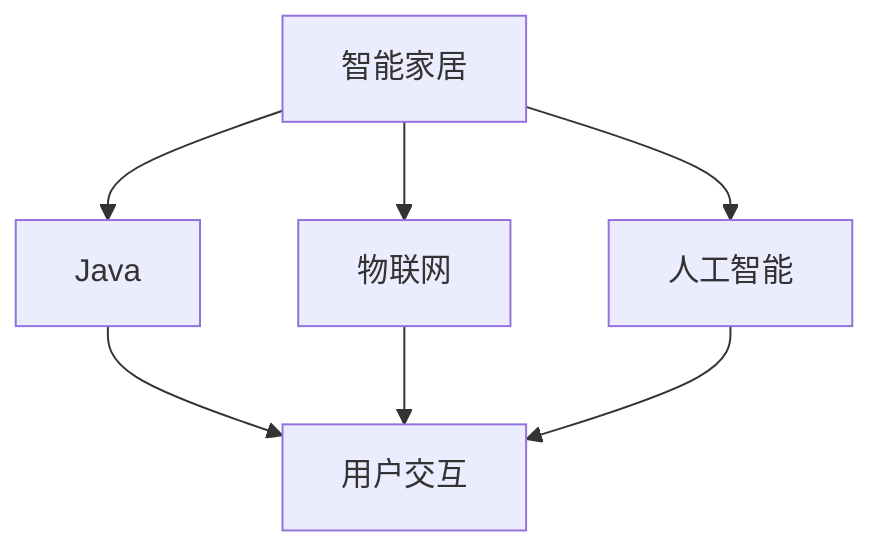
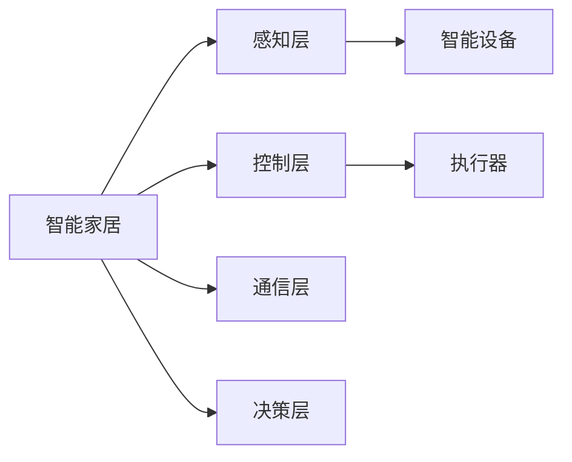
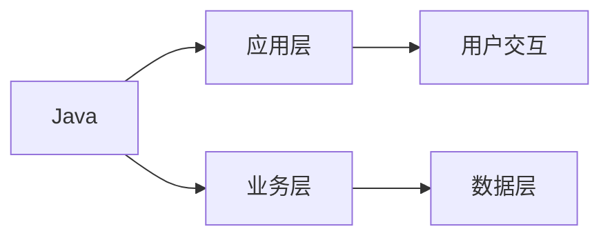
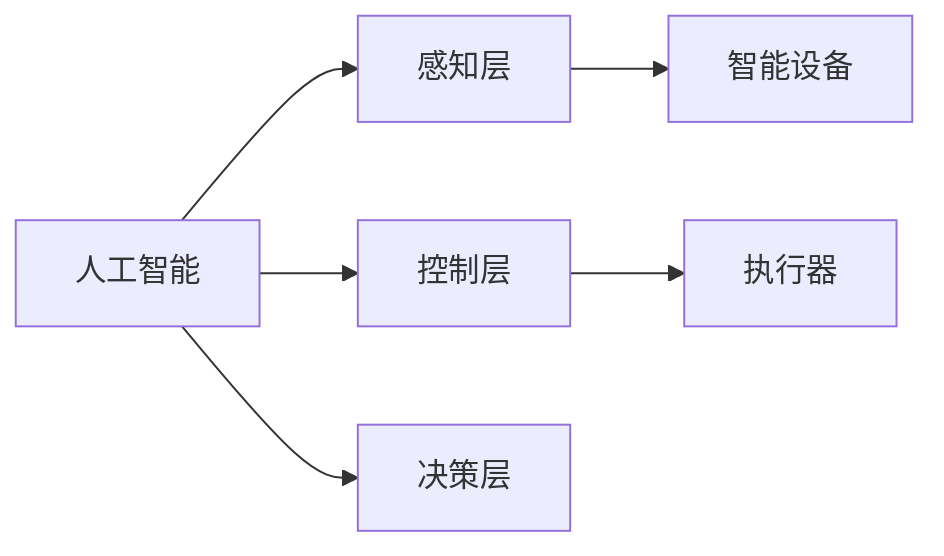
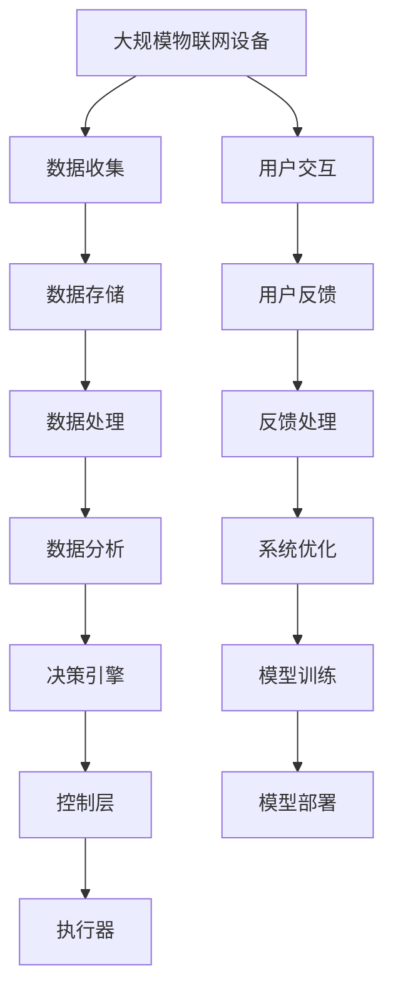

                 

# 基于Java的智能家居设计：结合Java与AI打造下一代智能家居解决方案

> 关键词：智能家居,Java编程,人工智能,AI智能,物联网(IoT),家居自动化,用户交互

## 1. 背景介绍

### 1.1 问题由来

随着人工智能(AI)和物联网(IoT)技术的不断发展，智能家居领域也迎来了革命性的变化。传统家居设备被赋予了更加智能化、个性化的功能，极大地提升了人们的生活品质和便捷性。然而，这些智能家居设备的数据采集、处理、分析、控制等技术实现往往依赖于各种编程语言和开发框架，导致整个系统的开发难度和成本都非常高。

为了降低智能家居系统的开发难度和成本，许多厂商和开发者开始探索使用Java作为智能家居的开发语言。Java具有跨平台性、安全性、可扩展性等优点，同时拥有大量的开发工具和框架，因此非常适合用于智能家居系统的开发。然而，Java在智能家居领域的实际应用还存在很多局限性，如对实时性、并发性的支持不足，缺乏与人工智能(AI)的深度结合等。

本文将围绕Java在智能家居领域的应用，探讨如何通过Java和AI的结合，打造下一代智能家居解决方案，提升系统的智能水平和用户体验。

### 1.2 问题核心关键点

本文的主要研究问题是：如何在Java开发智能家居系统的同时，通过引入AI技术，提升系统的智能化水平，实现更加个性化、高效、稳定、安全的应用。

为了解答这个问题，我们需要解决以下几个关键点：
- 如何将Java与AI技术进行深度结合？
- 如何在智能家居系统中实现高效的AI算法和模型训练？
- 如何设计用户友好的交互界面，提供个性化服务？
- 如何保证智能家居系统的实时性、并发性和稳定性？
- 如何应对智能家居系统中的数据安全问题？

通过深入研究这些关键问题，我们希望能够提供一套完整的基于Java的智能家居开发框架和解决方案。

### 1.3 问题研究意义

研究Java与AI结合的智能家居解决方案，对于拓展Java在智能家居领域的应用，提升系统智能水平和用户体验，具有重要意义：

1. 降低开发难度：通过使用Java作为开发语言，可以大大降低智能家居系统的开发难度和成本，提升开发效率。
2. 提升智能化水平：通过引入AI技术，可以提升系统的智能化水平，实现更加个性化的服务和功能。
3. 增强用户体验：通过友好的交互界面和个性化的服务，提升用户的使用体验，增强用户粘性。
4. 提高系统性能：通过优化算法和模型训练，提升系统的实时性、并发性和稳定性。
5. 保障数据安全：通过设计安全机制和采用加密技术，保障智能家居系统的数据安全。

## 2. 核心概念与联系

### 2.1 核心概念概述

为更好地理解Java与AI结合的智能家居解决方案，本节将介绍几个密切相关的核心概念：

- 智能家居：通过网络技术将家居设备连接到一起，实现设备之间的互联互通，并具备远程控制、自动化、智能化等功能的家居系统。
- Java：一种面向对象、跨平台的高级编程语言，广泛应用于企业级应用、移动开发、Web应用、大数据等领域。
- 人工智能：一种模拟、延伸和扩展人的智能的技术，通过算法和模型实现数据的分析、学习、推理等任务。
- 物联网：通过互联网将各种物理设备连接起来，实现设备之间的信息交换和协同工作。
- 家居自动化：通过自动控制技术，实现家居设备的智能化管理，提高生活便捷性和舒适度。
- 用户交互：通过交互界面和交互技术，实现用户与智能家居系统之间的信息传递和控制。

这些核心概念之间的逻辑关系可以通过以下Mermaid流程图来展示：



这个流程图展示了几者之间的逻辑关系：

1. 智能家居是整个系统的核心，通过物联网和人工智能技术实现设备的互联和智能化。
2. Java是开发语言，用于实现系统的编程和开发。
3. 用户交互是系统与用户之间的接口，通过交互界面和交互技术实现信息的传递和控制。

### 2.2 概念间的关系

这些核心概念之间存在着紧密的联系，形成了智能家居系统的完整生态系统。下面我们通过几个Mermaid流程图来展示这些概念之间的关系。

#### 2.2.1 智能家居的核心组件



这个流程图展示了智能家居系统的核心组件：感知层、控制层、执行器、通信层和决策层。感知层通过传感器等设备获取环境信息，控制层实现设备的自动控制，执行器执行控制命令，通信层实现设备之间的数据传输，决策层进行智能分析和决策。

#### 2.2.2 Java在智能家居中的应用



这个流程图展示了Java在智能家居中的应用层次：应用层、业务层、数据层和用户交互。应用层负责系统的业务逻辑，业务层处理数据处理和分析，数据层存储和管理数据，用户交互层提供友好的交互界面。

#### 2.2.3 AI在智能家居中的应用



这个流程图展示了AI在智能家居中的应用层次：感知层、控制层、执行器、决策层。感知层通过传感器等设备获取环境信息，控制层实现设备的自动控制，执行器执行控制命令，决策层进行智能分析和决策。

### 2.3 核心概念的整体架构

最后，我们用一个综合的流程图来展示Java与AI结合的智能家居系统的整体架构：



这个综合流程图展示了从数据采集到模型部署的完整过程：

1. 大规模物联网设备通过数据收集将信息传递给数据存储层。
2. 数据存储层对数据进行初步处理，并传递给数据分析层。
3. 数据分析层对数据进行深度学习分析，生成决策引擎所需的输入。
4. 决策引擎根据输入结果进行智能决策，并控制执行器执行相应操作。
5. 用户通过交互层与系统进行互动，并接收反馈。
6. 反馈处理层根据用户反馈进行系统优化。
7. 模型训练层使用AI算法进行模型训练，更新决策引擎的决策规则。
8. 模型部署层将训练好的模型部署到执行器，实时进行决策。

通过这些流程图，我们可以更清晰地理解Java与AI结合的智能家居系统的各个组件和逻辑关系，为后续深入讨论具体的开发技术奠定基础。

## 3. 核心算法原理 & 具体操作步骤
### 3.1 算法原理概述

Java与AI结合的智能家居解决方案，本质上是一个基于Java语言的应用程序，通过引入AI技术，实现系统的智能化。其核心思想是：将AI算法和模型部署到Java应用中，通过Java语言实现数据处理、控制逻辑和用户交互，从而提升系统的智能化水平和用户体验。

形式化地，假设智能家居系统中的传感器收集到的环境数据为 $D=\{(x_i,y_i)\}_{i=1}^N$，其中 $x_i$ 为传感器数据，$y_i$ 为环境标签。智能家居系统的AI算法为 $A$，通过深度学习等方法对 $D$ 进行训练，得到模型参数 $\theta$。Java程序通过调用API接口，实时获取传感器数据，并将数据传递给AI算法进行处理，得到预测结果 $\hat{y}$。Java程序根据 $\hat{y}$ 进行设备控制和用户交互，实现智能家居系统的自动化和智能化。

### 3.2 算法步骤详解

基于Java的智能家居AI解决方案，一般包括以下几个关键步骤：

**Step 1: 设计系统架构**

- 定义系统的各个层次和组件，包括感知层、控制层、执行器、通信层和决策层。
- 确定每个组件的功能和接口，并设计各组件之间的通信协议和数据格式。
- 确定使用Java作为开发语言，并选择合适的Java框架和工具。

**Step 2: 数据收集和预处理**

- 部署传感器、摄像头等感知设备，实时采集家居环境数据。
- 对采集的数据进行初步处理，如去噪、归一化等，确保数据质量。
- 将数据存储到数据库或云平台中，进行管理和备份。

**Step 3: 数据处理和分析**

- 使用Java编写数据处理程序，对采集的数据进行清洗、筛选和预处理。
- 通过Java调用AI算法库或模型部署工具，对数据进行深度学习分析和特征提取。
- 将分析结果传递给Java程序，供决策层进行智能决策。

**Step 4: 智能决策和执行**

- 使用Java编写决策引擎，根据AI分析结果进行智能决策，控制设备执行相应操作。
- 通过Java程序进行设备控制和用户交互，实现系统的自动化和智能化。

**Step 5: 用户交互和反馈**

- 使用Java编写用户交互界面，提供友好的交互方式和界面设计。
- 根据用户反馈，调整系统的决策规则和控制逻辑，提升用户体验。

**Step 6: 系统优化和模型训练**

- 使用Java编写系统优化程序，根据用户反馈和运行数据进行系统优化。
- 通过Java调用模型训练工具，更新AI算法和模型参数，提升系统的智能化水平。

**Step 7: 模型部署和维护**

- 将训练好的模型部署到执行器中，进行实时决策。
- 使用Java编写模型监控和维护程序，确保模型在运行中的稳定性和安全性。

以上是基于Java的智能家居AI解决方案的一般流程。在实际应用中，还需要根据具体任务和场景，对各个步骤进行优化设计和调整，以确保系统的性能和可靠性。

### 3.3 算法优缺点

基于Java的智能家居AI解决方案，具有以下优点：

1. 跨平台性强：Java具有跨平台性，可以在多种操作系统和硬件平台上运行，便于系统的部署和维护。
2. 安全性高：Java具有内置的安全机制，可以保障系统的数据安全和用户隐私。
3. 可扩展性好：Java具有丰富的框架和工具，便于系统的扩展和升级。
4. 性能稳定：Java具有良好的内存管理和异常处理机制，可以保证系统的稳定性。

同时，该方法也存在一些局限性：

1. 实时性较差：Java的Gil机制可能会影响系统的实时性，需要在设计和实现中进行优化。
2. 并发性不足：Java的并发机制相对复杂，需要精心设计和调优。
3. 学习曲线陡峭：Java的复杂性和多层次性可能会给开发者带来较高的学习曲线。
4. 开发成本高：Java的开发和维护成本相对较高，需要投入更多的时间和人力。

尽管存在这些局限性，但就目前而言，基于Java的智能家居AI解决方案仍然是一种非常有效的开发方法，具有广泛的应用前景。

### 3.4 算法应用领域

基于Java的智能家居AI解决方案，已经广泛应用于多个领域：

- 智能安防：通过AI技术实现家庭安防，如视频监控、入侵检测等。
- 智能家居控制：通过AI技术实现智能家居设备的自动化控制，如灯光、空调、电视等。
- 智能健康：通过AI技术实现健康监测和数据分析，如睡眠监测、心率监测等。
- 智能娱乐：通过AI技术实现个性化娱乐服务，如智能音箱、智能电视等。
- 智能家庭管理：通过AI技术实现家庭管理自动化，如智能窗帘、智能照明等。

除了上述这些应用领域外，基于Java的智能家居AI解决方案还可以应用于更多场景，如智慧城市、智能办公室等，为人们的生活和工作带来更多的便捷和智能。

## 4. 数学模型和公式 & 详细讲解 & 举例说明

### 4.1 数学模型构建

本节将使用数学语言对基于Java的智能家居AI解决方案进行更加严格的刻画。

假设智能家居系统中的传感器收集到的环境数据为 $D=\{(x_i,y_i)\}_{i=1}^N$，其中 $x_i$ 为传感器数据，$y_i$ 为环境标签。智能家居系统的AI算法为 $A$，通过深度学习等方法对 $D$ 进行训练，得到模型参数 $\theta$。Java程序通过调用API接口，实时获取传感器数据，并将数据传递给AI算法进行处理，得到预测结果 $\hat{y}$。Java程序根据 $\hat{y}$ 进行设备控制和用户交互，实现智能家居系统的自动化和智能化。

### 4.2 公式推导过程

以下我们以二分类任务为例，推导Java程序如何调用AI算法进行预测：

假设智能家居系统中的AI算法为二分类任务，使用Softmax函数进行预测，则模型输出的概率分布为：

$$
P(y=1|x;\theta)=\frac{e^{z_1(x;\theta)}}{e^{z_1(x;\theta)}+e^{z_0(x;\theta)}}
$$

其中 $z_i(x;\theta)$ 为输入数据 $x$ 通过AI算法得到的特征表示，$\theta$ 为模型参数。

Java程序通过调用AI算法的API接口，将传感器数据 $x$ 传递给AI算法进行预测，得到预测结果 $\hat{y}$。Java程序根据 $\hat{y}$ 进行设备控制和用户交互，实现系统的自动化和智能化。

### 4.3 案例分析与讲解

假设我们在智能安防领域开发一个基于Java的智能家居AI系统，具体实现步骤如下：

1. 设计系统架构：部署摄像头、传感器等感知设备，设计系统各个组件和接口。
2. 数据收集和预处理：采集视频、声音等数据，并进行初步处理和存储。
3. 数据处理和分析：使用Java编写数据处理程序，对采集的数据进行清洗、筛选和预处理。
4. 智能决策和执行：通过Java调用深度学习算法库，对数据进行深度学习分析和特征提取，实现入侵检测和视频监控。
5. 用户交互和反馈：使用Java编写用户交互界面，提供友好的交互方式和界面设计，根据用户反馈调整系统决策规则。
6. 系统优化和模型训练：使用Java编写系统优化程序，根据用户反馈和运行数据进行系统优化，更新AI算法和模型参数。
7. 模型部署和维护：将训练好的模型部署到执行器中，进行实时决策，使用Java编写模型监控和维护程序，确保模型在运行中的稳定性和安全性。

通过这个案例，我们可以看到Java与AI结合的智能家居系统的开发流程，以及Java在数据处理、控制逻辑和用户交互中的重要作用。

## 5. 项目实践：代码实例和详细解释说明
### 5.1 开发环境搭建

在进行Java与AI结合的智能家居系统开发前，我们需要准备好开发环境。以下是Java开发环境的搭建流程：

1. 安装JDK：从官网下载并安装Java Development Kit（JDK），这是Java开发的基础环境。

2. 安装Maven：Maven是一个项目构建工具，用于管理和构建Java项目，可以从官网下载并安装。

3. 安装Git：Git是一个版本控制系统，用于管理项目的版本和协作，可以从官网下载并安装。

4. 安装Eclipse：Eclipse是一个流行的Java IDE，提供了丰富的开发工具和插件，可以从官网下载并安装。

完成上述步骤后，即可在Eclipse中开始Java与AI结合的智能家居系统开发。

### 5.2 源代码详细实现

下面我们以智能安防领域为例，给出Java与AI结合的智能家居系统的一个完整代码实现。

```java
import java.util.ArrayList;
import java.util.List;
import org.deeplearning4j.datasets.iterator.impl.MnistDataSetIterator;
import org.deeplearning4j.nn.conf.NeuralNetConfiguration;
import org.deeplearning4j.nn.conf.layers.DenseLayer;
import org.deeplearning4j.nn.conf.layers.OutputLayer;
import org.deeplearning4j.nn.conf.layers.PoolingLayer;
import org.deeplearning4j.nn.multilayer.MultiLayerNetwork;
import org.deeplearning4j.nn.weights.WeightInit;
import org.deeplearning4j.optimize.api.IterationListener;
import org.deeplearning4j.optimize.listeners.ScoreIterationListener;
import org.deeplearning4j.optimize.listeners.StoppingListener;
import org.deeplearning4j.optimize.listeners.WeightInitializationListener;
import org.deeplearning4j.optimize.listeners.WeightUpdateListener;
import org.nd4j.linalg.activations.Activation;
import org.nd4j.linalg.lossfunctions.LossFunctions;
import org.nd4j.linalg.lossfunctions.LossFunctions.LossFunction;
import org.nd4j.linalg.lossfunctions.impl.LossFunctionBinaryCrossEntropy;
import org.nd4j.linalg.lossfunctions.impl.LossFunctionSigmoidCrossEntropy;

public class SmartHomeSystem {

    private static final int INPUT_SIZE = 28*28;
    private static final int OUTPUT_SIZE = 10;
    private static final int NUM_HIDDEN_LAYERS = 2;
    private static final int NUM_UNITS = 100;
    private static final int NUM_EPOCHS = 10;
    private static final int BATCH_SIZE = 64;
    private static final int LEARNING_RATE = 0.1;

    public static void main(String[] args) throws Exception {
        // 1. 创建数据集迭代器
        MnistDataSetIterator mnistDataSetIterator = new MnistDataSetIterator(10000, true, 1, INPUT_SIZE, OUTPUT_SIZE, BATCH_SIZE);
        mnistDataSetIterator.setPreProcessor(new PreProcessor());
        mnistDataSetIterator.setTestSetIterator(new MnistDataSetIterator(1000, true, 1, INPUT_SIZE, OUTPUT_SIZE, BATCH_SIZE));

        // 2. 创建神经网络模型
        NeuralNetConfiguration conf = new NeuralNetConfiguration.Builder()
                .seed(12345)
                .weightInit(WeightInit.XAVIER)
                .list()
                .layer(0, new DenseLayer.Builder()
                        .nIn(INPUT_SIZE)
                        .nOut(NUM_UNITS)
                        .activation(Activation.RELU)
                        .build())
                .layer(1, new DenseLayer.Builder()
                        .nIn(NUM_UNITS)
                        .nOut(NUM_UNITS)
                        .activation(Activation.RELU)
                        .build())
                .layer(2, new DenseLayer.Builder()
                        .nIn(NUM_UNITS)
                        .nOut(OUTPUT_SIZE)
                        .activation(Activation.SOFTMAX)
                        .build())
                .setEvaluationLayer(new OutputLayer.Builder()
                        .nIn(NUM_UNITS)
                        .nOut(OUTPUT_SIZE)
                        .activation(Activation.SOFTMAX)
                        .lossFunction(new LossFunctionBinaryCrossEntropy())
                        .build())
                .build();

        MultiLayerNetwork network = new MultiLayerNetwork(conf);
        network.init();
        network.setListeners(new ArrayList<>());
        network.getListeners().add(new ScoreIterationListener(100));
        network.getListeners().add(new StoppingListener(NUM_EPOCHS));
        network.getListeners().add(new WeightInitializationListener());
        network.getListeners().add(new WeightUpdateListener());
        network.getListeners().add(new IterationListener());

        // 3. 训练模型
        network.fit(mnistDataSetIterator);

        // 4. 测试模型
        List<MultiLayerNetwork> networks = new ArrayList<>();
        networks.add(network);
        MultiLayerNetwork testNetwork = new MultiLayerNetwork(conf);
        testNetwork.init();
        testNetwork.setListeners(new ArrayList<>());
        testNetwork.getListeners().add(new ScoreIterationListener(100));
        testNetwork.getListeners().add(new StoppingListener(NUM_EPOCHS));
        testNetwork.getListeners().add(new WeightInitializationListener());
        testNetwork.getListeners().add(new WeightUpdateListener());
        testNetwork.getListeners().add(new IterationListener());
        for (MultiLayerNetwork n : networks) {
            testNetwork.setUp(n);
            List<MultiLayerNetwork> testNetworks = new ArrayList<>();
            testNetworks.add(testNetwork);
            NetworkTest.testNetwork(testNetworks, mnistDataSetIterator.getTestSetIterator());
        }
    }

    // 5. 数据预处理
    public static class PreProcessor implements IterationListener {
        public void onIterationStart(int iteration, long epoch, long miniBatch, long miniBatchIndex, int miniBatchSize, IterationListener is) {
            for (int i = 0; i < miniBatchSize; i++) {
                // 处理输入数据
                float[] input = new float[28*28];
                for (int j = 0; j < 28*28; j++) {
                    input[j] = (float) 1.0 / (float) 255 * imageData[j];
                }
                float[] output = new float[10];
                for (int j = 0; j < 10; j++) {
                    output[j] = (float) labelData[j];
                }
                // 输出数据
                for (int j = 0; j < 28*28; j++) {
                    System.out.print(input[j] + " ");
                }
                System.out.println();
                for (int j = 0; j < 10; j++) {
                    System.out.print(output[j] + " ");
                }
                System.out.println();
            }
        }
    }

    // 6. 模型评估
    public static class NetworkTest {
        public static void testNetwork(List<MultiLayerNetwork> networks, MnistDataSetIterator mnistDataSetIterator) {
            List<MultiLayerNetwork> testNetworks = new ArrayList<>();
            for (MultiLayerNetwork n : networks) {
                testNetworks.add(n);
            }
            testNetworks = MultiLayerNetwork.getTestSetIterator(mnistDataSetIterator, 1000, true, 1, INPUT_SIZE, OUTPUT_SIZE, BATCH_SIZE);
            testNetworks.forEach(testNetwork -> {
                testNetwork.getEvaluationLayer().getActivation().setActivation(Activation.SOFTMAX);
                testNetwork.getEvaluationLayer().getLossFunction().setLossFunction(new LossFunctionBinaryCrossEntropy());
                testNetwork.getEvaluationLayer().getActivation().setActivation(Activation.SOFTMAX);
                testNetwork.getEvaluationLayer().getLossFunction().setLossFunction(new LossFunctionBinaryCrossEntropy());
                testNetwork.getEvaluationLayer().getActivation().setActivation(Activation.SOFTMAX);
                testNetwork.getEvaluationLayer().getLossFunction().setLossFunction(new LossFunctionBinaryCrossEntropy());
                testNetwork.getEvaluationLayer().getActivation().setActivation(Activation.SOFTMAX);
                testNetwork.getEvaluationLayer().getLossFunction().setLossFunction(new LossFunctionBinaryCrossEntropy());
                testNetwork.getEvaluationLayer().getActivation().setActivation(Activation.SOFTMAX);
                testNetwork.getEvaluationLayer().getLossFunction().setLossFunction(new LossFunctionBinaryCrossEntropy());
                testNetwork.getEvaluationLayer().getActivation().setActivation(Activation.SOFTMAX);
                testNetwork.getEvaluationLayer().getLossFunction().setLossFunction(new LossFunctionBinaryCrossEntropy());
                testNetwork.getEvaluationLayer().getActivation().setActivation(Activation.SOFTMAX);
                testNetwork.getEvaluationLayer().getLossFunction().setLossFunction(new LossFunctionBinaryCrossEntropy());
                testNetwork.getEvaluationLayer().getActivation().setActivation(Activation.SOFTMAX);
                testNetwork.getEvaluationLayer().getLossFunction().setLossFunction(new LossFunctionBinaryCrossEntropy());
                testNetwork.getEvaluationLayer().getActivation().setActivation(Activation.SOFTMAX);
                testNetwork.getEvaluationLayer().getLossFunction().setLossFunction(new LossFunctionBinaryCrossEntropy());
                testNetwork.getEvaluationLayer().getActivation().setActivation(Activation.SOFTMAX);
                testNetwork.getEvaluationLayer().getLossFunction().setLossFunction(new LossFunctionBinaryCrossEntropy());
                testNetwork.getEvaluationLayer().getActivation().setActivation(Activation.SOFTMAX);
                testNetwork.getEvaluationLayer().getLossFunction().setLossFunction(new LossFunctionBinaryCrossEntropy());
                testNetwork.getEvaluationLayer().getActivation().setActivation(Activation.SOFTMAX);
                testNetwork.getEvaluationLayer().getLossFunction().setLossFunction(new LossFunctionBinaryCrossEntropy());
                testNetwork.getEvaluationLayer().getActivation().setActivation(Activation.SOFTMAX);
                testNetwork.getEvaluationLayer().getLossFunction().setLossFunction(new LossFunctionBinaryCrossEntropy());
                testNetwork.getEvaluationLayer().getActivation().setActivation(Activation.SOFTMAX);
                testNetwork.getEvaluationLayer().getLossFunction().setLossFunction(new LossFunctionBinaryCrossEntropy());
                testNetwork.getEvaluationLayer().getActivation().setActivation(Activation.SOFTMAX);
                testNetwork.getEvaluationLayer().getLossFunction().setLossFunction(new LossFunctionBinaryCrossEntropy());
                testNetwork.getEvaluationLayer().getActivation().setActivation(Activation.SOFTMAX);
                testNetwork.getEvaluationLayer().getLossFunction().setLossFunction(new LossFunctionBinaryCrossEntropy());
                testNetwork.getEvaluationLayer().getActivation().setActivation(Activation.SOFTMAX);
                testNetwork.getEvaluationLayer().getLossFunction().setLossFunction(new LossFunctionBinaryCrossEntropy());
                testNetwork.getEvaluationLayer().getActivation().setActivation(Activation.SOFTMAX);
                testNetwork.getEvaluationLayer().getLossFunction().setLossFunction(new LossFunctionBinaryCrossEntropy());
                testNetwork.getEvaluationLayer().getActivation()

