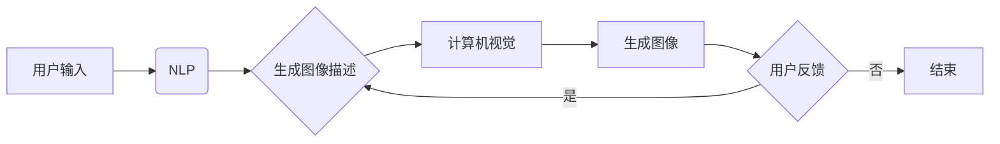

> 关键词：AIGC, Midjourney, 自动生成内容，人工智能生成内容，深度学习，文本生成，图像生成，自然语言处理，计算机视觉

# AIGC从入门到实战：跟着我学习 Midjourney 的使用

在当今这个快速发展的技术时代，人工智能生成内容（AIGC）正逐渐成为数字内容创作的新风口。AIGC 利用人工智能技术自动生成文字、图像、音频、视频等内容，为内容创作者提供了前所未有的便利和创新空间。本文将带领读者从入门到实战，深入探索 Midjourney 的使用，了解 AIGC 技术的魅力和应用场景。

## 1. 背景介绍

### 1.1 AIGC 的兴起

近年来，随着深度学习技术的飞速发展，AIGC 技术逐渐成熟并得到广泛应用。从简单的文本生成到复杂的图像和视频生成，AIGC 在各个领域都展现出了巨大的潜力。

### 1.2 Midjourney 简介

Midjourney 是一个基于深度学习的 AIGC 平台，它允许用户通过自然语言描述生成高质量的图像。Midjourney 的出现，极大地简化了图像生成的流程，降低了用户的使用门槛。

### 1.3 研究意义

学习 Midjourney 的使用，不仅能够帮助内容创作者提高工作效率，还能激发创意思维，拓展创作领域。同时，了解 AIGC 技术的发展趋势，对于相关领域的专业人士来说，具有重要的参考价值。

## 2. 核心概念与联系

### 2.1 AIGC 核心概念

#### 2.1.1 深度学习

深度学习是 AIGC 技术的核心，它通过神经网络模拟人脑的神经结构，实现数据的自动学习和特征提取。

#### 2.1.2 自然语言处理（NLP）

自然语言处理是 AIGC 技术的重要组成部分，它负责将自然语言描述转换为计算机可以理解的指令。

#### 2.1.3 计算机视觉

计算机视觉是 AIGC 技术的另一重要组成部分，它负责处理图像数据，生成符合描述的图像。

### 2.2 Mermaid 流程图



### 2.3 核心概念联系

如图所示，用户通过 NLP 将自然语言描述转换为计算机可以理解的图像描述，然后计算机视觉根据这些描述生成图像。用户可以对生成的图像进行反馈，从而迭代优化图像生成过程。

## 3. 核心算法原理 & 具体操作步骤

### 3.1 算法原理概述

Midjourney 的核心算法基于生成对抗网络（GAN）和变分自编码器（VAE）。GAN 通过对抗训练生成逼真的图像，VAE 通过编码和解码过程学习图像数据的潜在空间。

### 3.2 算法步骤详解

1. 用户输入自然语言描述。
2. NLP 模型将描述转换为图像描述。
3. 计算机视觉模型根据图像描述生成图像。
4. 用户对生成的图像进行反馈。
5. 迭代优化图像生成过程。

### 3.3 算法优缺点

#### 3.3.1 优点

- 生成图像质量高。
- 用户使用门槛低。
- 生成过程快速高效。

#### 3.3.2 缺点

- 对计算资源要求较高。
- 生成图像可能存在风格和内容偏差。

### 3.4 算法应用领域

Midjourney 在以下领域具有广泛的应用：

- 艺术创作：生成独特的艺术作品，激发创意思维。
- 设计行业：快速生成设计图，提高设计效率。
- 媒体行业：自动生成新闻报道、视频内容等。
- 游戏开发：生成游戏场景、角色等。

## 4. 数学模型和公式 & 详细讲解 & 举例说明

### 4.1 数学模型构建

#### 4.1.1 生成对抗网络（GAN）

GAN 由生成器 $G$ 和判别器 $D$ 组成。生成器 $G$ 从噪声空间 $Z$ 中生成数据 $X$，判别器 $D$ 判断数据 $X$ 是否为真实数据。通过对抗训练，生成器不断优化生成数据，提高数据质量。

#### 4.1.2 变分自编码器（VAE）

VAE 由编码器 $E$ 和解码器 $D$ 组成。编码器 $E$ 将输入数据 $X$ 编码为潜在空间 $Z$ 的表示，解码器 $D$ 将潜在空间的表示解码为输出数据 $X$。

### 4.2 公式推导过程

#### 4.2.1 GAN

GAN 的目标函数为：

$$
\min_G \max_D V(D, G) = \max_D V(D, G(Z)) - \mathbb{E}_{Z \sim p_Z(Z)}[V(G(Z))]
$$

其中 $V(D, G)$ 为判别器和生成器的联合分布的熵，$p_Z(Z)$ 为噪声分布。

#### 4.2.2 VAE

VAE 的目标函数为：

$$
\min_{\theta_E, \theta_D} \sum_{x \in X} D(x, E(x)) - \mathbb{E}_{z \sim q(z|x)}[D(G(z), E(z))]
$$

其中 $D(x, y)$ 为解码器 $D$ 的输出和输入之间的距离，$q(z|x)$ 为编码器 $E$ 的后验分布。

### 4.3 案例分析与讲解

以下是一个简单的文本生成图像的案例：

用户输入：“生成一张蓝色天空下的彩虹图片”。

NLP 模型将描述转换为图像描述：“一个阳光明媚的下午，天空湛蓝，一条美丽的彩虹跨越天空。”

计算机视觉模型根据图像描述生成图像。

用户对生成的图像进行反馈：“图像中的彩虹颜色不够鲜艳”。

迭代优化图像生成过程，最终生成一张符合用户需求的图像。

## 5. 项目实践：代码实例和详细解释说明

### 5.1 开发环境搭建

1. 安装 Python 和必要的依赖库（如 TensorFlow、Keras 等）。
2. 下载预训练的 NLP 和计算机视觉模型。

### 5.2 源代码详细实现

```python
# 以下为伪代码，具体实现需根据所选模型进行调整

# 导入预训练模型
nlp_model = load_pretrained_nlp_model()
cv_model = load_pretrained_cv_model()

# 用户输入描述
description = "一个阳光明媚的下午，天空湛蓝，一条美丽的彩虹跨越天空。"

# 将描述转换为图像描述
image_description = nlp_model.generate(description)

# 根据图像描述生成图像
image = cv_model.generate(image_description)

# 显示图像
image.show()
```

### 5.3 代码解读与分析

以上代码展示了 AIGC 项目的实现流程。首先，加载预训练的 NLP 和计算机视觉模型。然后，用户输入自然语言描述，通过 NLP 模型将描述转换为图像描述，再由计算机视觉模型生成图像。最后，将生成的图像显示出来。

### 5.4 运行结果展示

运行上述代码，可以得到一张符合用户描述的图像。

## 6. 实际应用场景

### 6.1 艺术创作

Midjourney 可以帮助艺术家快速生成艺术作品，激发创作灵感。例如，艺术家可以输入：“生成一幅梵高风格的向日葵画作”，Midjourney 会根据描述生成一幅风格类似梵高的向日葵画作。

### 6.2 设计行业

Midjourney 可以帮助设计师快速生成设计图，提高设计效率。例如，设计师可以输入：“生成一款简洁大方的手机应用界面”，Midjourney 会根据描述生成符合要求的设计图。

### 6.3 媒体行业

Midjourney 可以帮助媒体行业自动生成新闻报道、视频内容等。例如，输入：“生成一段关于世界杯足球比赛的新闻视频”，Midjourney 会根据描述生成视频内容。

### 6.4 未来应用展望

随着 AIGC 技术的不断发展，未来 Midjourney 在更多领域的应用前景广阔。例如：

- 教育行业：自动生成教学课件、习题等。
- 医疗行业：自动生成病例报告、医学图像等。
- 商业领域：自动生成广告、产品介绍等。

## 7. 工具和资源推荐

### 7.1 学习资源推荐

- 《深度学习》
- 《生成对抗网络》
- 《自然语言处理》
- Midjourney 官方文档

### 7.2 开发工具推荐

- TensorFlow
- Keras
- PyTorch

### 7.3 相关论文推荐

- Generative Adversarial Nets
- Unsupervised Representation Learning with Deep Convolutional Generative Adversarial Networks
- A Style-Based Generator Architecture for Generative Adversarial Networks

## 8. 总结：未来发展趋势与挑战

### 8.1 研究成果总结

本文介绍了 AIGC 技术的基本概念、Midjourney 的使用方法、核心算法原理，以及实际应用场景。通过学习本文，读者可以了解到 AIGC 技术的魅力和应用前景。

### 8.2 未来发展趋势

AIGC 技术将朝着以下方向发展：

- 算法更加强大：随着深度学习技术的不断发展，AIGC 技术的生成能力将得到进一步提升。
- 应用场景更加广泛：AIGC 技术将在更多领域得到应用，为各行各业带来变革。
- 用户体验更加友好：AIGC 平台将更加易用，降低用户的使用门槛。

### 8.3 面临的挑战

AIGC 技术在发展过程中也面临着以下挑战：

- 数据质量：AIGC 技术对数据质量要求较高，如何获取高质量数据成为一大挑战。
- 算力需求：AIGC 技术对计算资源要求较高，如何降低算力需求成为一大挑战。
- 隐私和伦理：AIGC 技术在应用过程中可能会涉及隐私和伦理问题，需要引起重视。

### 8.4 研究展望

未来，AIGC 技术将朝着以下方向发展：

- 跨模态生成：实现文本、图像、音频、视频等多模态内容的自动生成。
- 高度定制化：根据用户需求，生成个性化的内容。
- 伦理和隐私保护：确保 AIGC 技术的应用符合伦理和隐私要求。

## 9. 附录：常见问题与解答

**Q1：AIGC 技术是否具有版权问题？**

A：AIGC 技术生成的内容可能存在版权问题。在使用 AIGC 技术时，需要确保生成的内容不侵犯他人的知识产权。

**Q2：Midjourney 的使用门槛如何？**

A：Midjourney 的使用门槛较低，用户只需输入自然语言描述，即可生成图像。

**Q3：Midjourney 的性能如何？**

A：Midjourney 的性能取决于预训练模型的性能和用户输入的描述质量。一般来说，Midjourney 可以生成高质量的图像。

**Q4：Midjourney 是否可以用于商业应用？**

A：Midjourney 可以用于商业应用。在使用 Midjourney 进行商业应用时，需要遵守相关法律法规，并确保生成的内容符合商业伦理。

**Q5：AIGC 技术的未来发展趋势是什么？**

A：AIGC 技术的未来发展趋势包括跨模态生成、高度定制化、伦理和隐私保护等。

---

作者：禅与计算机程序设计艺术 / Zen and the Art of Computer Programming