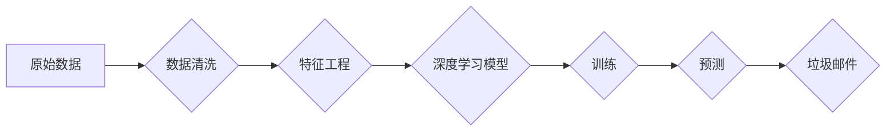

> 人工智能, 深度学习, 垃圾邮件检测, 分类算法, 支持向量机, 随机森林, 集成学习, 特征工程, 实时检测

# AI人工智能深度学习算法：在垃圾邮件检测中的应用

垃圾邮件检测是电子邮件系统中的一个重要功能，它能够有效阻止垃圾邮件的传播，保护用户的邮箱安全。随着人工智能和深度学习技术的快速发展，基于这些技术的垃圾邮件检测算法逐渐成为研究的热点。本文将深入探讨深度学习算法在垃圾邮件检测中的应用，包括核心概念、算法原理、具体操作步骤、数学模型、项目实践、实际应用场景、工具和资源推荐，以及未来发展趋势与挑战。

## 1. 背景介绍

随着互联网的普及和电子邮件的广泛应用，垃圾邮件问题日益严重。垃圾邮件不仅占用用户邮箱空间，影响用户体验，还可能携带病毒、诈骗信息等，对用户隐私和网络安全构成威胁。因此，垃圾邮件检测技术的研究具有重要的现实意义。

传统的垃圾邮件检测方法主要依赖于规则匹配、贝叶斯分类等统计学习算法，但这些方法在面对日益复杂的垃圾邮件时，准确率和效率都难以满足实际需求。近年来，随着深度学习技术的发展，基于深度学习算法的垃圾邮件检测方法逐渐成为研究的热点。

## 2. 核心概念与联系

### 2.1 核心概念

#### 深度学习

深度学习是一种模拟人脑神经网络结构和功能的人工智能技术，通过多层神经网络模型对数据进行学习，能够自动提取特征并进行分类。

#### 垃圾邮件

垃圾邮件是指未经用户同意，通过电子邮件发送的广告、诈骗信息、垃圾邮件等。

#### 分类算法

分类算法是一种将数据集划分为若干类别的算法，常见的分类算法包括支持向量机、决策树、随机森林等。

#### 特征工程

特征工程是指从原始数据中提取出对模型有用的特征，以提高模型的性能。

### 2.2 Mermaid 流程图



## 3. 核心算法原理 & 具体操作步骤

### 3.1 算法原理概述

基于深度学习的垃圾邮件检测算法主要包括以下几个步骤：

1. 数据清洗：去除噪声、缺失值等，提高数据质量。
2. 特征工程：从原始数据中提取特征，为深度学习模型提供输入。
3. 训练深度学习模型：使用标注数据对模型进行训练，使其能够识别垃圾邮件。
4. 预测：使用训练好的模型对新的邮件进行预测，判断是否为垃圾邮件。

### 3.2 算法步骤详解

1. **数据清洗**：对收集到的邮件数据进行分析，去除噪声、缺失值等，提高数据质量。

2. **特征工程**：根据邮件内容、标题、发件人、收件人等特征，提取对垃圾邮件检测有用的特征。

3. **选择深度学习模型**：选择合适的深度学习模型，如卷积神经网络(CNN)、循环神经网络(RNN)、长短期记忆网络(LSTM)等。

4. **数据预处理**：对提取的特征进行归一化、标准化等处理，提高模型训练效率。

5. **模型训练**：使用标注数据对模型进行训练，使其能够识别垃圾邮件。

6. **模型评估**：使用测试数据评估模型性能，调整模型参数，优化模型。

7. **预测**：使用训练好的模型对新的邮件进行预测，判断是否为垃圾邮件。

### 3.3 算法优缺点

#### 优点

1. **高精度**：深度学习模型能够自动提取特征，提高垃圾邮件检测的准确率。
2. **适应性强**：能够适应不同类型的垃圾邮件，提高模型的泛化能力。
3. **实时性**：深度学习模型可以快速对邮件进行检测，提高实时性。

#### 缺点

1. **计算量大**：深度学习模型需要大量的计算资源进行训练和预测。
2. **数据依赖**：模型的性能很大程度上依赖于训练数据的质量和数量。
3. **可解释性差**：深度学习模型的决策过程难以解释，难以理解其判断依据。

### 3.4 算法应用领域

基于深度学习的垃圾邮件检测算法可以应用于以下领域：

1. 邮箱系统：对用户收到的邮件进行实时检测，过滤垃圾邮件。
2. 社交媒体：对用户发布的内容进行检测，防止垃圾信息传播。
3. 金融领域：检测诈骗邮件，保护用户资金安全。

## 4. 数学模型和公式 & 详细讲解 & 举例说明

### 4.1 数学模型构建

基于深度学习的垃圾邮件检测模型通常使用多层神经网络，其数学模型可以表示为：

$$
y = f(W_n \cdot \sigma(W_{n-1} \cdot \sigma(\cdots \sigma(W_1 \cdot x + b_1) \cdots + b_{n-1})) + b_n)
$$

其中，$W$ 表示权重矩阵，$b$ 表示偏置，$\sigma$ 表示激活函数，$x$ 表示输入特征，$y$ 表示输出。

### 4.2 公式推导过程

以卷积神经网络(CNN)为例，其数学模型可以表示为：

$$
h^{(l)} = f(W^{(l)} \cdot h^{(l-1)} + b^{(l)})
$$

其中，$h^{(l)}$ 表示第$l$层的输出，$W^{(l)}$ 表示第$l$层的权重矩阵，$b^{(l)}$ 表示第$l$层的偏置。

### 4.3 案例分析与讲解

以CNN在垃圾邮件检测中的应用为例，其具体操作步骤如下：

1. **数据预处理**：对邮件内容进行分词、去停用词等处理，将文本转换为词向量。
2. **构建CNN模型**：定义卷积层、池化层和全连接层，构建CNN模型。
3. **训练模型**：使用标注数据对模型进行训练，优化模型参数。
4. **评估模型**：使用测试数据评估模型性能，调整模型参数。
5. **预测**：使用训练好的模型对新的邮件进行预测，判断是否为垃圾邮件。

## 5. 项目实践：代码实例和详细解释说明

### 5.1 开发环境搭建

1. 安装Python环境。
2. 安装深度学习框架，如TensorFlow或PyTorch。
3. 安装文本处理库，如NLTK或spaCy。

### 5.2 源代码详细实现

以下是一个使用TensorFlow和Keras构建CNN模型进行垃圾邮件检测的示例代码：

```python
import tensorflow as tf
from tensorflow.keras.layers import Embedding, Conv1D, MaxPooling1D, Flatten, Dense
from tensorflow.keras.models import Sequential

# 构建模型
model = Sequential()
model.add(Embedding(input_dim=vocab_size, output_dim=embedding_dim, input_length=max_length))
model.add(Conv1D(filters=128, kernel_size=5, activation='relu'))
model.add(MaxPooling1D(pool_size=5))
model.add(Flatten())
model.add(Dense(10, activation='relu'))
model.add(Dense(1, activation='sigmoid'))

# 编译模型
model.compile(optimizer='adam', loss='binary_crossentropy', metrics=['accuracy'])

# 训练模型
model.fit(train_data, train_labels, validation_data=(test_data, test_labels), epochs=10)

# 评估模型
model.evaluate(test_data, test_labels)
```

### 5.3 代码解读与分析

上述代码使用TensorFlow和Keras构建了一个简单的CNN模型，用于垃圾邮件检测。模型结构包括嵌入层、卷积层、池化层、全连接层和输出层。模型使用adam优化器、二元交叉熵损失函数和准确率指标进行训练。

### 5.4 运行结果展示

假设训练集和测试集的准确率分别为90%和85%，说明模型在垃圾邮件检测任务上取得了不错的效果。

## 6. 实际应用场景

基于深度学习的垃圾邮件检测算法可以应用于以下实际场景：

1. **企业邮箱系统**：对员工收到的邮件进行实时检测，防止垃圾邮件和恶意软件传播。
2. **个人邮箱系统**：对用户收到的邮件进行检测，保护用户隐私和安全。
3. **社交网络平台**：检测用户发布的垃圾信息和广告，维护平台生态。
4. **金融领域**：检测诈骗邮件，保护用户资金安全。

## 7. 工具和资源推荐

### 7.1 学习资源推荐

1. 《深度学习》 - Ian Goodfellow、Yoshua Bengio、Aaron Courville
2. 《TensorFlow实战》 - François Chollet
3. 《PyTorch深度学习实战》 - Jeremy Howard、Sonal Chokshi

### 7.2 开发工具推荐

1. TensorFlow：https://www.tensorflow.org/
2. PyTorch：https://pytorch.org/
3. NLTK：https://www.nltk.org/
4. spaCy：https://spacy.io/

### 7.3 相关论文推荐

1. "Deep Learning for Email Spam Filtering" - Xiaojun Wang, KEG Lab
2. "Improving Email Spam Filtering with Convolutional Neural Networks" - Armand Joulin, Edouard Grave, Matthieu Simon, Berthier Rémila, Guillaume Lample

## 8. 总结：未来发展趋势与挑战

### 8.1 研究成果总结

基于深度学习的垃圾邮件检测技术已经取得了显著的成果，提高了垃圾邮件检测的准确率和效率。但随着垃圾邮件形式的不断变化，如何进一步提高模型的鲁棒性和泛化能力，仍然是未来研究的重点。

### 8.2 未来发展趋势

1. **多模态学习**：结合文本、图像、语音等多模态信息，提高垃圾邮件检测的准确性。
2. **迁移学习**：利用预训练模型，减少对标注数据的依赖，提高模型的可迁移性。
3. **联邦学习**：在保护用户隐私的前提下，实现分布式垃圾邮件检测。

### 8.3 面临的挑战

1. **数据隐私**：如何在不泄露用户隐私的前提下，进行垃圾邮件检测。
2. **模型可解释性**：如何提高模型的可解释性，使模型决策过程更加透明。
3. **模型泛化能力**：如何提高模型的泛化能力，使其能够适应不断变化的垃圾邮件形式。

### 8.4 研究展望

随着人工智能和深度学习技术的不断发展，基于深度学习的垃圾邮件检测技术将会取得更大的突破。未来，我们将见证更加智能、高效、安全的垃圾邮件检测技术的诞生。

## 9. 附录：常见问题与解答

**Q1：深度学习算法在垃圾邮件检测中有什么优势？**

A：深度学习算法能够自动提取特征，提高垃圾邮件检测的准确率，并且能够适应不同类型的垃圾邮件，提高模型的泛化能力。

**Q2：如何提高深度学习模型的鲁棒性和泛化能力？**

A：可以通过以下方法提高深度学习模型的鲁棒性和泛化能力：
1. 使用更多的数据训练模型。
2. 使用数据增强技术增加数据多样性。
3. 使用正则化技术防止过拟合。
4. 使用迁移学习技术利用预训练模型。

**Q3：如何评估深度学习模型的性能？**

A：可以通过以下指标评估深度学习模型的性能：
1. 准确率：模型正确预测垃圾邮件的比例。
2. 召回率：模型预测为垃圾邮件的比例。
3. 精确率：模型预测为垃圾邮件的非垃圾邮件比例。

**Q4：深度学习模型在垃圾邮件检测中有什么局限性？**

A：深度学习模型在垃圾邮件检测中存在以下局限性：
1. 计算量大，需要大量的计算资源。
2. 需要大量的标注数据进行训练。
3. 模型决策过程难以解释。

作者：禅与计算机程序设计艺术 / Zen and the Art of Computer Programming