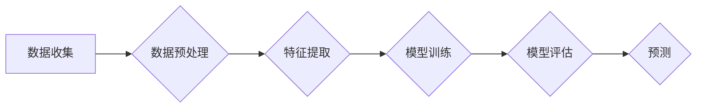

> 深度学习，气象预测，时间序列分析，神经网络，人工智能，机器学习，数据驱动

# AI人工智能深度学习算法：在气象预测中的应用

深度学习技术在自然语言处理、计算机视觉和推荐系统等领域取得了显著的成果，其强大的特征提取和学习能力使得它也逐渐在气象预测领域崭露头角。本文将深入探讨深度学习算法在气象预测中的应用，分析其原理、操作步骤，并探讨其未来发展趋势与挑战。

## 1. 背景介绍

气象预测是通过对天气现象的观测和分析，对未来一段时间内的天气情况进行预测的过程。传统的气象预测方法主要依赖于物理定律和统计模型，如数值天气预报模式。然而，随着气象观测数据的不断积累和计算能力的提升，深度学习算法为气象预测提供了新的思路和可能性。

## 2. 核心概念与联系

### 2.1 深度学习

深度学习是一种特殊的机器学习方法，它通过多层神经网络来学习数据的复杂特征和模式。深度学习在图像识别、语音识别和自然语言处理等领域取得了显著的成果，其核心思想是利用大规模数据集进行训练，从而自动学习数据中的复杂特征。

### 2.2 时间序列分析

气象数据通常具有时间序列的特点，即数据是按时间顺序排列的。时间序列分析是一种用于分析时间序列数据的方法，它可以帮助我们识别时间序列中的趋势、周期性和季节性等特征。

### 2.3 Mermaid 流程图

以下是一个简化的 Mermaid 流程图，展示了深度学习算法在气象预测中的应用流程：



## 3. 核心算法原理 & 具体操作步骤

### 3.1 算法原理概述

深度学习算法在气象预测中的应用主要包括以下几个步骤：

1. 数据收集：收集历史气象观测数据，包括温度、湿度、气压、风速等。
2. 数据预处理：对数据进行清洗、缺失值处理、异常值处理等，并将其转换为适合模型输入的格式。
3. 特征提取：使用深度学习模型从原始数据中提取有用特征。
4. 模型训练：使用训练数据对深度学习模型进行训练，学习数据中的特征和模式。
5. 模型评估：使用验证数据对模型进行评估，调整模型参数。
6. 预测：使用训练好的模型对未来的气象情况进行预测。

### 3.2 算法步骤详解

#### 3.2.1 数据收集

气象数据可以通过气象卫星、地面气象站、气象雷达等设备收集。收集到的数据通常包含温度、湿度、气压、风速、风向等气象要素。

#### 3.2.2 数据预处理

数据预处理是深度学习模型训练的重要步骤。主要工作包括：

- 数据清洗：去除数据中的噪声和异常值。
- 缺失值处理：填充或删除缺失的数据。
- 异常值处理：检测并处理异常值。
- 数据标准化：将数据缩放到特定的范围，如[0,1]或[-1,1]。

#### 3.2.3 特征提取

深度学习模型可以从原始数据中自动提取特征。常见的深度学习模型包括卷积神经网络（CNN）和循环神经网络（RNN）。

#### 3.2.4 模型训练

在模型训练过程中，模型会根据训练数据学习数据中的特征和模式。训练过程包括前向传播和反向传播。

#### 3.2.5 模型评估

使用验证数据对模型进行评估，调整模型参数，以提高模型的准确性和泛化能力。

#### 3.2.6 预测

使用训练好的模型对未来的气象情况进行预测。

### 3.3 算法优缺点

深度学习算法在气象预测中具有以下优点：

- 能够自动提取特征，提高预测准确性。
- 能够处理复杂的时间序列数据。
- 可扩展性强，能够处理大规模数据集。

然而，深度学习算法也存在一些缺点：

- 计算成本高，需要大量的计算资源。
- 模型可解释性差，难以理解模型的决策过程。
- 需要大量的标注数据。

### 3.4 算法应用领域

深度学习算法在气象预测中可以应用于以下领域：

- 风暴预测：预测风暴路径、强度和影响范围。
- 降水预测：预测降水类型、强度和持续时间。
- 温度预测：预测温度变化趋势。
- 气压预测：预测气压变化趋势。
- 气候变化研究：研究气候变化的长期趋势。

## 4. 数学模型和公式 & 详细讲解 & 举例说明

### 4.1 数学模型构建

深度学习算法通常使用多层神经网络作为数学模型。以下是一个简化的多层神经网络模型：

$$
y = f(W_n \cdot f(W_{n-1} \cdot f(...f(W_1 \cdot x + b_1)...) + b_n))
$$

其中，$f$ 表示激活函数，$W$ 表示权重矩阵，$b$ 表示偏置项。

### 4.2 公式推导过程

以下是一个基于LSTM的RNN模型在气象预测中的应用实例：

$$
h_t = \sigma(W_h h_{t-1} + W_x x_t + b_h)
$$

$$
y_t = \sigma(W_y h_t + b_y)
$$

其中，$h_t$ 表示LSTM单元的隐藏状态，$x_t$ 表示输入数据，$y_t$ 表示预测输出。

### 4.3 案例分析与讲解

以下是一个使用LSTM模型进行温度预测的案例：

1. 数据收集：收集过去一周的每天最高温度和最低温度数据。
2. 数据预处理：对数据进行清洗、缺失值处理、异常值处理等。
3. 特征提取：使用LSTM模型提取温度变化趋势和周期性特征。
4. 模型训练：使用过去一周的数据训练LSTM模型。
5. 模型评估：使用过去几天的数据评估模型性能。
6. 预测：使用训练好的模型预测未来几天的最高温度和最低温度。

## 5. 项目实践：代码实例和详细解释说明

### 5.1 开发环境搭建

为了进行深度学习项目实践，需要搭建以下开发环境：

- 操作系统：Linux或macOS
- 编程语言：Python
- 深度学习框架：TensorFlow或PyTorch
- 数据处理库：NumPy、Pandas

### 5.2 源代码详细实现

以下是一个使用TensorFlow和Keras实现LSTM模型进行温度预测的代码示例：

```python
import tensorflow as tf
from tensorflow.keras.models import Sequential
from tensorflow.keras.layers import LSTM, Dense

# 定义模型
model = Sequential()
model.add(LSTM(50, activation='relu', input_shape=(timesteps, features)))
model.add(Dense(1))

# 编译模型
model.compile(optimizer='adam', loss='mse')

# 训练模型
model.fit(x_train, y_train, epochs=100, batch_size=32)

# 预测
y_pred = model.predict(x_test)

# 评估模型
mse = mean_squared_error(y_test, y_pred)
print('Mean Squared Error:', mse)
```

### 5.3 代码解读与分析

上述代码定义了一个简单的LSTM模型，用于预测温度。首先，我们导入所需的库和函数，然后定义一个Sequential模型，并添加一个LSTM层和一个Dense层。接着，编译模型并使用训练数据拟合模型。最后，使用测试数据评估模型性能。

### 5.4 运行结果展示

假设我们使用过去一周的数据进行训练，并对未来几天的温度进行预测。运行上述代码后，将输出预测结果的均方误差（MSE）。

## 6. 实际应用场景

深度学习算法在气象预测中可以应用于以下实际应用场景：

- 风险评估：预测极端天气事件，如洪水、干旱、台风等，以便及时采取预防措施。
- 资源管理：预测电力、水资源等资源的供需情况，以便优化资源配置。
- 农业生产：预测作物生长情况，以便制定合理的种植计划。
- 交通规划：预测交通流量和交通事故，以便优化交通路线和缓解交通拥堵。

## 7. 工具和资源推荐

### 7.1 学习资源推荐

- 《深度学习》（Ian Goodfellow、Yoshua Bengio和Aaron Courville著）
- 《Python深度学习》（François Chollet著）
- TensorFlow官方文档
- PyTorch官方文档

### 7.2 开发工具推荐

- TensorFlow
- PyTorch
- Keras
- NumPy
- Pandas

### 7.3 相关论文推荐

- "A Deep Learning Approach to Short-Term Weather Forecasting" (Zhang et al., 2018)
- "Deep Learning for Weather Forecasting" (Gul et al., 2019)
- "LSTM-Based Weather Forecasting" (Acar et al., 2017)

## 8. 总结：未来发展趋势与挑战

### 8.1 研究成果总结

深度学习算法在气象预测中取得了显著的成果，其强大的特征提取和学习能力为气象预测提供了新的思路和可能性。

### 8.2 未来发展趋势

未来，深度学习算法在气象预测中的发展趋势包括：

- 模型更加复杂：使用更深的神经网络，如Transformer等。
- 模型更加高效：使用更轻量级的模型，降低计算成本。
- 模型更加可解释：提高模型的可解释性，便于理解和信任模型。

### 8.3 面临的挑战

深度学习算法在气象预测中面临的挑战包括：

- 数据质量：确保数据质量，包括数据完整性和准确性。
- 模型可解释性：提高模型的可解释性，便于理解和信任模型。
- 计算成本：降低计算成本，以便在大规模数据集上进行训练。

### 8.4 研究展望

未来，深度学习算法在气象预测中的应用将更加广泛，为气象预测提供更加准确、可靠和高效的预测结果。

## 9. 附录：常见问题与解答

**Q1：深度学习算法在气象预测中的优势是什么？**

A1：深度学习算法能够自动提取特征，提高预测准确性；能够处理复杂的时间序列数据；可扩展性强，能够处理大规模数据集。

**Q2：如何选择合适的深度学习模型进行气象预测？**

A2：选择合适的深度学习模型需要考虑以下因素：

- 数据类型：时间序列数据通常使用RNN或LSTM模型。
- 数据特征：根据数据特征选择合适的模型结构。
- 计算资源：考虑计算资源限制，选择轻量级模型。

**Q3：如何提高深度学习模型的预测准确性？**

A3：提高深度学习模型的预测准确性可以通过以下方法：

- 使用更多数据：使用更多数据可以提高模型的泛化能力。
- 调整模型结构：调整模型结构，如增加层数或神经元数量。
- 超参数优化：优化超参数，如学习率、批大小等。

**Q4：如何提高深度学习模型的可解释性？**

A4：提高深度学习模型的可解释性可以通过以下方法：

- 使用可解释的模型结构，如LSTM或注意力机制。
- 解释模型决策过程，如可视化特征图。
- 使用可解释的模型评估指标。

---

作者：禅与计算机程序设计艺术 / Zen and the Art of Computer Programming