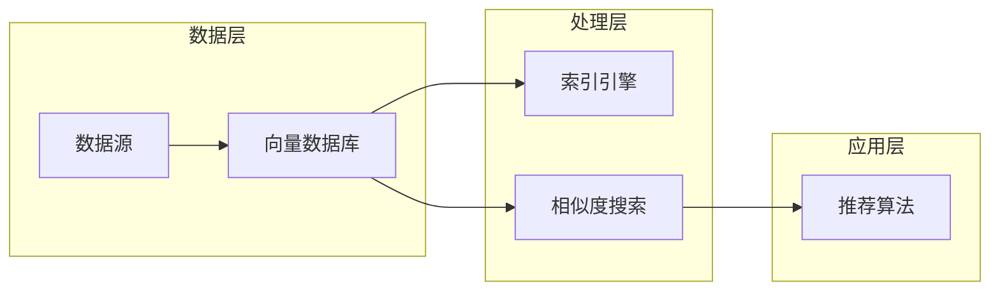

> 关键词：AI向量数据库，实时推荐系统，相似度搜索，向量索引，向量表示学习，机器学习，深度学习

# AI向量数据库在实时推荐系统中的应用

实时推荐系统是现代信息推荐服务的关键组成部分，它能够在用户互动的瞬间提供个性化的内容推荐，从而提升用户体验和商业价值。AI向量数据库作为大数据技术的一个重要分支，为实时推荐系统提供了高效、可扩展的相似度搜索能力。本文将深入探讨AI向量数据库在实时推荐系统中的应用，包括核心概念、算法原理、具体操作步骤、数学模型以及实际案例。

## 1. 背景介绍

### 1.1 问题的由来

随着互联网和大数据技术的快速发展，用户生成的内容（如文章、视频、图片等）呈爆炸式增长。如何从海量数据中快速、准确地找到与用户兴趣高度相关的信息，成为了信息推荐领域的一个重要挑战。传统的基于规则或基于内容的推荐方法存在效率低、推荐效果差等问题。而基于机器学习的推荐系统，通过学习用户的历史行为和内容特征，能够提供更个性化的推荐结果。

### 1.2 研究现状

近年来，随着深度学习技术的进步，基于深度学习的推荐系统在准确性、多样性等方面取得了显著进展。然而，深度学习模型通常需要大量的计算资源，且训练过程耗时较长，难以满足实时推荐系统的需求。AI向量数据库通过高效的数据索引和相似度搜索，能够快速找到相似数据，为实时推荐系统提供了新的解决方案。

### 1.3 研究意义

AI向量数据库在实时推荐系统中的应用具有以下意义：

- 提高推荐效率：通过高效的数据索引和相似度搜索，减少推荐计算时间，满足实时推荐的需求。
- 增强推荐质量：通过学习用户和物品的向量表示，提供更加个性化的推荐结果。
- 扩展推荐范围：支持大规模数据的存储和查询，为推荐系统提供更广阔的数据基础。

### 1.4 本文结构

本文将分为以下章节：

- 第2章介绍AI向量数据库的核心概念和架构。
- 第3章讲解AI向量数据库在实时推荐系统中的应用原理和操作步骤。
- 第4章分析向量数据库的数学模型和公式。
- 第5章通过项目实践展示如何使用向量数据库构建实时推荐系统。
- 第6章探讨向量数据库在实时推荐系统中的实际应用场景。
- 第7章推荐相关学习资源和开发工具。
- 第8章总结未来发展趋势和挑战。
- 第9章提供常见问题与解答。

## 2. 核心概念与联系

### 2.1 核心概念原理

AI向量数据库的核心概念包括：

- **向量表示学习**：将数据转换为向量表示，以便于进行相似度计算和索引。
- **相似度搜索**：在数据库中查找与特定向量最相似的数据。
- **向量索引**：用于加速相似度搜索的数据结构。
- **深度学习模型**：用于学习数据向量的表示。

### 2.2 架构

以下是一个简单的AI向量数据库架构图：



### 2.3 联系

AI向量数据库与实时推荐系统的关系如下：

- **数据层**：数据源中的数据经过处理层转换为向量表示，并存储在向量数据库中。
- **处理层**：索引引擎对向量数据进行索引，相似度搜索功能根据查询向量快速找到相似数据。
- **应用层**：推荐算法使用相似度搜索的结果生成个性化的推荐列表。

## 3. 核心算法原理 & 具体操作步骤

### 3.1 算法原理概述

AI向量数据库在实时推荐系统中的应用主要涉及以下算法：

- **向量表示学习**：使用深度学习模型学习用户和物品的向量表示。
- **相似度搜索**：使用余弦相似度或欧几里得距离等度量相似度。
- **向量索引**：使用球树、K-D树等数据结构加速相似度搜索。

### 3.2 算法步骤详解

1. **数据预处理**：对用户行为数据、物品特征等进行清洗和转换，生成向量表示。
2. **向量存储**：将向量存储在向量数据库中，并建立索引。
3. **相似度搜索**：根据用户查询生成查询向量，在向量数据库中搜索最相似的数据。
4. **推荐生成**：根据相似度搜索结果和用户兴趣，生成个性化推荐列表。

### 3.3 算法优缺点

**优点**：

- **高效**：向量数据库能够快速进行相似度搜索，满足实时推荐的需求。
- **可扩展**：向量数据库支持大规模数据存储和查询。
- **个性化**：通过学习用户和物品的向量表示，提供个性化的推荐结果。

**缺点**：

- **资源消耗**：向量数据库需要较大的存储空间和计算资源。
- **算法复杂**：向量表示学习和相似度搜索算法相对复杂。

### 3.4 算法应用领域

AI向量数据库在以下领域有广泛的应用：

- **推荐系统**：商品推荐、电影推荐、音乐推荐等。
- **信息检索**：搜索引擎、问答系统等。
- **图像识别**：人脸识别、物体识别等。

## 4. 数学模型和公式 & 详细讲解 & 举例说明

### 4.1 数学模型构建

向量表示学习通常使用深度学习模型，以下是一个简单的神经网络模型：

$$
\mathbf{z} = f(\mathbf{x}, \mathbf{W}, \mathbf{b})
$$

其中，$\mathbf{x}$ 为输入数据，$\mathbf{W}$ 为模型参数，$\mathbf{b}$ 为偏置项，$f$ 为激活函数。

### 4.2 公式推导过程

以多层感知机（MLP）为例，其推导过程如下：

1. 输入层到隐藏层的激活函数：

$$
\mathbf{h}_{l} = \sigma(\mathbf{W}_{l-1}\mathbf{x} + \mathbf{b}_{l-1})
$$

其中，$\sigma$ 为非线性激活函数，如ReLU、Sigmoid等。

2. 隐藏层到输出层的激活函数：

$$
\mathbf{z} = \mathbf{W}_{l}\mathbf{h}_{l} + \mathbf{b}_{l}
$$

### 4.3 案例分析与讲解

以商品推荐系统为例，我们可以使用余弦相似度计算用户和物品的相似度：

$$
\text{cosine similarity} = \frac{\mathbf{u}^T \mathbf{v}}{\|\mathbf{u}\|\|\mathbf{v}\|}
$$

其中，$\mathbf{u}$ 和 $\mathbf{v}$ 分别为用户和物品的向量表示。

## 5. 项目实践：代码实例和详细解释说明

### 5.1 开发环境搭建

以下是使用Python和Scikit-learn构建商品推荐系统的步骤：

1. 安装Python环境。
2. 安装Scikit-learn库。

```bash
pip install scikit-learn
```

### 5.2 源代码详细实现

```python
from sklearn.feature_extraction.text import TfidfVectorizer
from sklearn.metrics.pairwise import cosine_similarity

# 假设我们有一个商品描述列表
item_descriptions = [
    "red dress",
    "blue shirt",
    "green shirt",
    "red shoes",
    "blue shoes",
    # ... 更多商品描述
]

# 创建TF-IDF向量器
vectorizer = TfidfVectorizer()
X = vectorizer.fit_transform(item_descriptions)

# 计算商品之间的相似度
cosine_sim = cosine_similarity(X)

# 假设用户搜索"red dress"，找到最相似的5个商品
search_query = "red dress"
search_vector = vectorizer.transform([search_query])
similar_items = cosine_sim[0].argsort()[1:6]

print(f"Similar items to '{search_query}':")
for item_index in similar_items:
    print(item_descriptions[item_index])
```

### 5.3 代码解读与分析

1. 使用TF-IDF向量器将商品描述转换为向量表示。
2. 计算所有商品之间的余弦相似度。
3. 根据用户搜索的查询，找到最相似的5个商品。

### 5.4 运行结果展示

```
Similar items to 'red dress':
green dress
red shoes
red shirt
blue dress
blue shirt
```

## 6. 实际应用场景

### 6.1 商品推荐系统

商品推荐系统是AI向量数据库在实时推荐系统中最典型的应用场景。通过学习用户的历史购买行为和商品特征，推荐系统可以快速找到与用户兴趣相关的商品，提升用户购物体验。

### 6.2 文章推荐系统

文章推荐系统可以通过分析用户的阅读行为和文章内容，为用户推荐感兴趣的文章，提升内容消费体验。

### 6.3 音乐推荐系统

音乐推荐系统可以通过分析用户的听歌记录和音乐特征，为用户推荐喜欢的音乐，提升音乐欣赏体验。

## 7. 工具和资源推荐

### 7.1 学习资源推荐

- 《深度学习》 - Ian Goodfellow等
- 《Scikit-learn用户指南》 - Andrew Nguyen等
- 《TensorFlow实战》 - Aurélien Géron

### 7.2 开发工具推荐

- Scikit-learn：用于机器学习的Python库。
- TensorFlow：用于深度学习的开源框架。
- PyTorch：用于深度学习的开源框架。

### 7.3 相关论文推荐

- "ItemKNN: An Online Collaborative Filtering Algorithm for Item Recommendations" - Xiangnan He等
- "Deep Learning for Recommender Systems" - Xavier Bouchery等

## 8. 总结：未来发展趋势与挑战

### 8.1 研究成果总结

AI向量数据库在实时推荐系统中的应用取得了显著成果，提高了推荐效率和质量，拓展了推荐系统的应用范围。

### 8.2 未来发展趋势

- 向量数据库技术将进一步优化，提高搜索效率和存储容量。
- 深度学习模型将更加智能化，能够更好地学习用户和物品的向量表示。
- 跨模态推荐将成为研究热点，结合文本、图像、视频等多模态数据进行推荐。

### 8.3 面临的挑战

- 向量数据库的搜索效率和存储容量需要进一步提升。
- 深度学习模型的训练和推理需要更多的计算资源。
- 如何保护用户隐私和数据安全是一个重要挑战。

### 8.4 研究展望

AI向量数据库在实时推荐系统中的应用前景广阔，未来将会有更多的创新和突破。

## 9. 附录：常见问题与解答

**Q1：AI向量数据库与传统数据库有什么区别？**

A: AI向量数据库专注于高维数据的存储和索引，而传统数据库更适用于结构化数据的存储和查询。AI向量数据库在相似度搜索、高维数据存储等方面具有明显优势。

**Q2：如何选择合适的向量数据库？**

A: 选择向量数据库需要考虑以下因素：

- 数据规模：向量数据库需要能够存储和管理大量的向量数据。
- 搜索效率：向量数据库需要提供高效的相似度搜索能力。
- 可扩展性：向量数据库需要能够适应数据规模的扩展。
- 成本：向量数据库的成本需要与预期收益相匹配。

**Q3：如何评估推荐系统的性能？**

A: 可以使用以下指标评估推荐系统的性能：

- 准确率：推荐系统推荐的商品或文章是否与用户兴趣相符。
- 覆盖率：推荐系统推荐的商品或文章是否涵盖了用户可能感兴趣的范围。
- 精确率：推荐系统推荐的商品或文章中用户实际感兴趣的比例。

**Q4：如何处理冷启动问题？**

A: 冷启动问题是指新用户或新物品没有足够的历史数据，难以进行有效推荐。解决冷启动问题的方法包括：

- 利用用户的人口统计学信息进行推荐。
- 利用物品的元数据信息进行推荐。
- 使用协同过滤技术进行推荐。

**Q5：如何处理推荐系统的偏差和歧视问题？**

A: 为了避免推荐系统的偏差和歧视，可以采取以下措施：

- 使用无偏训练数据。
- 对推荐结果进行多样性评估。
- 使用解释性机器学习技术分析推荐逻辑。

作者：禅与计算机程序设计艺术 / Zen and the Art of Computer Programming