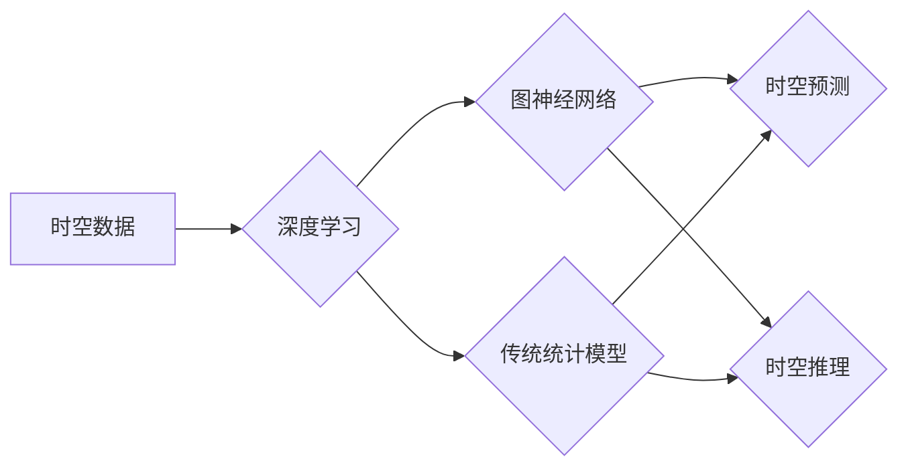

# AI时空建模的未来技术趋势解析

> 关键词：AI时空建模，时空数据，深度学习，图神经网络，时空预测，时空推理，多尺度建模，动态网络

## 1. 背景介绍

随着物联网、地理信息系统、移动通信等技术的发展，时空数据在各个领域得到了广泛应用。时空数据具有时间和空间的双重维度特性，蕴含着丰富的动态变化规律。AI时空建模旨在利用人工智能技术，对时空数据进行有效分析、挖掘和预测，从而为城市规划、交通管理、环境监测等领域的决策提供支持。

近年来，随着深度学习技术的快速发展，AI时空建模取得了显著的进展。从传统的统计模型到深度学习模型，再到图神经网络等新兴技术，AI时空建模方法不断进化，应用领域也在不断扩大。

## 2. 核心概念与联系

### 2.1 核心概念

- **时空数据**：指具有时间和空间属性的数据，如位置、时间戳、速度、温度等。
- **深度学习**：一种通过神经网络模拟人脑学习过程，从大量数据中自动学习特征和模式的人工智能技术。
- **图神经网络**：一种适用于处理图结构数据的神经网络，能够捕捉节点之间的复杂关系。
- **时空预测**：基于时空数据，预测未来一段时间内某个地点的某个属性值。
- **时空推理**：根据时空数据，推理出某个事件发生的原因或结果。

### 2.2 核心概念原理和架构的 Mermaid 流程图



## 3. 核心算法原理 & 具体操作步骤

### 3.1 算法原理概述

AI时空建模的核心算法主要包括以下几个方面：

- **特征工程**：从原始时空数据中提取有价值的信息，如时间序列特征、空间特征、空间关系等。
- **深度学习模型**：利用神经网络自动学习时空数据的特征和模式。
- **图神经网络**：利用图结构来表示时空数据中的复杂关系。
- **时空预测和推理**：基于学习到的特征和模式，预测未来一段时间内的时空变化或推理事件发生的原因。

### 3.2 算法步骤详解

AI时空建模的一般步骤如下：

1. **数据预处理**：清洗、去重、填充缺失值、标准化等。
2. **特征工程**：根据任务需求，提取时空数据中的特征。
3. **模型选择**：选择合适的深度学习模型或图神经网络。
4. **模型训练**：使用训练数据对模型进行训练。
5. **模型评估**：使用验证数据评估模型性能。
6. **模型部署**：将训练好的模型部署到实际应用场景中。

### 3.3 算法优缺点

- **优点**：
  - 能够有效处理大规模、高维的时空数据。
  - 能够自动学习时空数据的特征和模式。
  - 能够进行时空预测和推理。
- **缺点**：
  - 训练过程复杂，需要大量计算资源。
  - 模型可解释性较差。
  - 数据集质量对模型性能影响较大。

### 3.4 算法应用领域

AI时空建模的应用领域包括：

- **城市规划**：城市交通流量预测、公共设施规划、城市规划决策支持等。
- **交通管理**：交通流量预测、交通事故预测、交通信号控制等。
- **环境监测**：空气质量预测、水质监测、灾害预警等。
- **商业智能**：顾客流量预测、供应链优化、销售预测等。

## 4. 数学模型和公式 & 详细讲解 & 举例说明

### 4.1 数学模型构建

时空建模中常用的数学模型包括：

- **时间序列模型**：如ARIMA、LSTM、GRU等。
- **空间分析模型**：如空间自回归模型、空间插值模型等。
- **图神经网络模型**：如图卷积网络（GCN）、图注意力网络（GAT）等。

### 4.2 公式推导过程

以LSTM模型为例，其数学模型如下：

$$
h_t = \sigma(W_f \cdot h_{t-1} + W_i \cdot x_t + b_f + b_i) \otimes h_{t-1}
$$

$$
c_t = \sigma(W_c \cdot h_{t-1} + W_g \cdot x_t + b_c + b_g) \odot (c_{t-1} - \sigma(W_f \cdot h_{t-1} + W_i \cdot x_t + b_f + b_i) \odot c_{t-1})
$$

其中，$h_t$ 是第 $t$ 个时刻的隐藏状态，$x_t$ 是第 $t$ 个时刻的输入序列，$\sigma$ 是sigmoid函数，$\odot$ 是Hadamard乘积，$\otimes$ 是元素级外积。

### 4.3 案例分析与讲解

以下以LSTM模型在交通流量预测中的应用为例进行讲解。

假设我们使用LSTM模型对某路段的未来5分钟的交通流量进行预测。模型输入为过去15分钟内的交通流量数据，输出为未来5分钟的交通流量预测值。

1. **数据预处理**：将交通流量数据进行归一化处理，将时间序列数据转换为LSTM模型可接受的格式。
2. **模型构建**：使用PyTorch框架构建LSTM模型。
3. **模型训练**：使用训练数据对模型进行训练，并调整模型参数。
4. **模型评估**：使用验证数据评估模型性能，调整模型参数。
5. **模型部署**：将训练好的模型部署到实际应用场景中，进行交通流量预测。

## 5. 项目实践：代码实例和详细解释说明

### 5.1 开发环境搭建

- 安装Python 3.7及以上版本。
- 安装PyTorch框架。
- 安装NumPy、Matplotlib等工具。

### 5.2 源代码详细实现

以下是一个使用PyTorch框架构建LSTM模型进行交通流量预测的示例代码：

```python
import torch
import torch.nn as nn
import torch.optim as optim
import matplotlib.pyplot as plt

# 数据预处理
def preprocess_data(data):
    data = torch.tensor(data).float()
    data = torch.reshape(data, (len(data), 1, 1))
    return data

# LSTM模型
class TrafficFlowLSTM(nn.Module):
    def __init__(self):
        super(TrafficFlowLSTM, self).__init__()
        self.lstm = nn.LSTM(input_size=1, hidden_size=50, num_layers=1, batch_first=True)
        self.fc = nn.Linear(50, 1)

    def forward(self, x):
        _, (h_n, _) = self.lstm(x)
        out = self.fc(h_n)
        return out

# 训练模型
def train_model(model, train_loader, optimizer, criterion):
    model.train()
    for data, target in train_loader:
        optimizer.zero_grad()
        output = model(data)
        loss = criterion(output, target)
        loss.backward()
        optimizer.step()

# 评估模型
def evaluate_model(model, test_loader, criterion):
    model.eval()
    total_loss = 0
    with torch.no_grad():
        for data, target in test_loader:
            output = model(data)
            total_loss += criterion(output, target)
    return total_loss / len(test_loader)

# 加载数据
train_data = preprocess_data(train_traffic_data)
test_data = preprocess_data(test_traffic_data)
train_loader = torch.utils.data.DataLoader(train_data, batch_size=32, shuffle=True)
test_loader = torch.utils.data.DataLoader(test_data, batch_size=32, shuffle=False)

# 初始化模型和优化器
model = TrafficFlowLSTM()
optimizer = optim.Adam(model.parameters(), lr=0.001)
criterion = nn.MSELoss()

# 训练模型
epochs = 50
for epoch in range(epochs):
    train_model(model, train_loader, optimizer, criterion)
    test_loss = evaluate_model(model, test_loader, criterion)
    print(f'Epoch {epoch+1}, Test Loss: {test_loss:.4f}')

# 预测交通流量
def predict_traffic(model, data):
    model.eval()
    with torch.no_grad():
        output = model(data)
    return output

# 预测未来5分钟的交通流量
future_traffic_data = preprocess_data(future_traffic_data)
predicted_traffic = predict_traffic(model, future_traffic_data)

# 可视化预测结果
plt.plot(future_traffic_data, label='Actual')
plt.plot(predicted_traffic, label='Predicted')
plt.legend()
plt.show()
```

### 5.3 代码解读与分析

以上代码实现了一个简单的交通流量预测模型。首先，我们使用`preprocess_data`函数对交通流量数据进行归一化处理。然后，定义`TrafficFlowLSTM`类，构建一个包含一个LSTM层和全连接层的神经网络模型。在`train_model`函数中，使用训练数据对模型进行训练，并计算损失值。在`evaluate_model`函数中，使用测试数据评估模型性能。最后，在`predict_traffic`函数中，使用模型预测未来5分钟的交通流量，并将实际值和预测值进行可视化展示。

## 6. 实际应用场景

AI时空建模在实际应用场景中具有广泛的应用价值，以下列举几个典型应用场景：

- **城市规划**：通过对交通流量、人口密度、建筑密度等时空数据的分析，为城市规划提供决策支持，如优化交通网络、优化土地利用等。
- **交通管理**：通过对交通流量、交通事故、交通信号等时空数据的分析，实现交通拥堵预测、交通事故预警、交通信号控制优化等。
- **环境监测**：通过对空气质量、水质、噪声等时空数据的分析，实现环境质量预测、污染源追踪、环境事件预警等。
- **商业智能**：通过对顾客流量、销售数据、库存数据等时空数据的分析，实现销售预测、库存优化、营销活动策划等。

## 7. 工具和资源推荐

### 7.1 学习资源推荐

- 《深度学习》（Goodfellow et al.）
- 《图神经网络》（Hamilton et al.）
- 《时空数据分析》（Koch et al.）

### 7.2 开发工具推荐

- PyTorch
- TensorFlow
- KEG时空数据集

### 7.3 相关论文推荐

- Hamilton, W.L., Ying, R., Leskovec, J.: Representation learning on graphs: A survey of existing methods and applications. 
- Kipf, T. N., Welling, M.: Semi-supervised learning with graph convolutional networks. In: Proceedings of the ICLR.
- Zhou, J., Yao, L., Liu, Y., et al.: Deep Learning for Time Series Classification: A Survey. IEEE Transactions on Knowledge and Data Engineering 32(12): 2325-2340 (2020)

## 8. 总结：未来发展趋势与挑战

### 8.1 研究成果总结

本文对AI时空建模的未来技术趋势进行了分析，介绍了时空数据的定义、深度学习、图神经网络等核心概念，并详细讲解了AI时空建模的核心算法原理和具体操作步骤。同时，本文还探讨了AI时空建模的实际应用场景，并推荐了相关学习资源和开发工具。

### 8.2 未来发展趋势

未来AI时空建模技术将呈现以下发展趋势：

- **多尺度建模**：针对不同时间尺度的时空数据，构建多尺度模型，实现更精准的预测和推理。
- **动态网络**：将动态系统建模与图神经网络相结合，实现更灵活的时空建模。
- **可解释性**：提高模型的可解释性，使模型决策过程更加透明。
- **鲁棒性**：提高模型的鲁棒性，使其在面对异常数据时仍能保持稳定性能。

### 8.3 面临的挑战

AI时空建模在实际应用中仍面临以下挑战：

- **数据质量**：时空数据的质量直接影响模型的性能。
- **模型可解释性**：提高模型的可解释性，使模型决策过程更加透明。
- **计算资源**：AI时空建模需要大量的计算资源，对硬件设备要求较高。
- **领域知识**：需要结合领域知识，提高模型在特定领域的适应性。

### 8.4 研究展望

未来，AI时空建模技术将在以下方面取得进一步突破：

- **数据融合**：将不同来源的时空数据进行融合，提高模型的信息利用率。
- **多模态融合**：将时空数据与其他模态数据（如图像、声音等）进行融合，实现更全面的时空建模。
- **知识图谱**：将知识图谱与时空数据相结合，实现更智能的时空建模。

相信随着技术的不断进步，AI时空建模技术将在各个领域发挥越来越重要的作用。

## 9. 附录：常见问题与解答

**Q1：AI时空建模与传统的时空分析技术相比，有哪些优势？**

A：AI时空建模相比传统的时空分析技术，具有以下优势：
- **自动学习特征**：AI时空建模可以自动从数据中学习特征和模式，无需人工进行特征工程。
- **处理大规模数据**：AI时空建模能够处理大规模、高维的时空数据。
- **预测和推理**：AI时空建模可以实现时空预测和推理，为决策提供支持。

**Q2：如何选择合适的AI时空建模方法？**

A：选择合适的AI时空建模方法需要考虑以下因素：
- **数据类型**：根据数据类型选择合适的模型，如时间序列数据选择LSTM，图结构数据选择图神经网络等。
- **任务需求**：根据任务需求选择合适的模型，如预测任务选择预测模型，推理任务选择推理模型等。
- **数据规模**：根据数据规模选择合适的模型，如小规模数据选择简单模型，大规模数据选择复杂模型等。

**Q3：如何提高AI时空建模的可解释性？**

A：提高AI时空建模的可解释性可以从以下方面入手：
- **可视化**：将模型结构、参数、特征等信息进行可视化展示。
- **注意力机制**：使用注意力机制，突出模型在决策过程中的关注点。
- **解释性模型**：使用可解释性模型，如LIME、SHAP等，解释模型预测结果。

**Q4：AI时空建模在实际应用中存在哪些挑战？**

A：AI时空建模在实际应用中存在以下挑战：
- **数据质量**：时空数据的质量直接影响模型的性能。
- **模型可解释性**：提高模型的可解释性，使模型决策过程更加透明。
- **计算资源**：AI时空建模需要大量的计算资源，对硬件设备要求较高。
- **领域知识**：需要结合领域知识，提高模型在特定领域的适应性。

**Q5：未来AI时空建模技术将如何发展？**

A：未来AI时空建模技术将在以下方面取得进一步发展：
- **多尺度建模**：针对不同时间尺度的时空数据，构建多尺度模型，实现更精准的预测和推理。
- **动态网络**：将动态系统建模与图神经网络相结合，实现更灵活的时空建模。
- **可解释性**：提高模型的可解释性，使模型决策过程更加透明。
- **鲁棒性**：提高模型的鲁棒性，使其在面对异常数据时仍能保持稳定性能。

作者：禅与计算机程序设计艺术 / Zen and the Art of Computer Programming