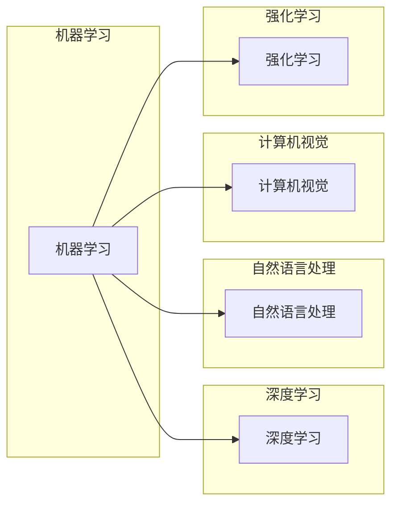

# AI编程的新范式与挑战

> 关键词：人工智能，编程范式，机器学习，深度学习，编程语言，模型可解释性，软件开发，自动化

## 1. 背景介绍

随着人工智能（AI）技术的飞速发展，AI编程已经成为软件开发领域的一个重要分支。从早期的专家系统到如今的深度学习，AI编程正逐渐改变我们的编程范式，为软件开发带来新的机遇和挑战。本文将探讨AI编程的新范式，分析其背后的核心概念与联系，并深入探讨其算法原理、数学模型、项目实践以及未来发展趋势与挑战。

## 2. 核心概念与联系

### 2.1 AI编程的核心概念

AI编程的核心概念包括：

- **机器学习（Machine Learning）**：机器学习是AI编程的基础，它使计算机系统能够从数据中学习并做出决策或预测，而不是通过硬编码的规则。

- **深度学习（Deep Learning）**：深度学习是机器学习的一种，它使用类似于人脑的神经网络结构来学习复杂的特征表示。

- **自然语言处理（Natural Language Processing, NLP）**：NLP是AI编程的一个分支，旨在使计算机能够理解、解释和生成人类语言。

- **计算机视觉（Computer Vision）**：计算机视觉使计算机能够从图像或视频中理解和解释视觉信息。

- **强化学习（Reinforcement Learning）**：强化学习是一种机器学习方法，通过奖励和惩罚机制来指导算法做出决策。

### 2.2 核心概念之间的联系

以下是一个使用Mermaid绘制的流程图，展示了AI编程核心概念之间的联系：



从图中可以看出，深度学习是机器学习的一种，而自然语言处理、计算机视觉和强化学习都是机器学习在不同领域的应用。

## 3. 核心算法原理 & 具体操作步骤

### 3.1 算法原理概述

AI编程的核心算法原理通常涉及以下步骤：

1. **数据收集与预处理**：收集相关领域的数据，并进行清洗、归一化等预处理操作。

2. **特征工程**：从原始数据中提取特征，为机器学习模型提供输入。

3. **模型选择与训练**：选择合适的机器学习模型，并在训练数据上进行训练。

4. **模型评估与优化**：在测试数据上评估模型性能，并根据评估结果优化模型。

5. **模型部署与应用**：将训练好的模型部署到实际应用中。

### 3.2 算法步骤详解

以下是一个简单的机器学习算法步骤详解：

1. **数据收集**：收集数据是机器学习的第一步，数据可以来自各种来源，如传感器、数据库等。

2. **数据预处理**：对收集到的数据进行清洗、去除缺失值、标准化等操作，以确保数据的质量和一致性。

3. **特征工程**：根据问题的需求，从数据中提取有用的特征。特征工程是提高模型性能的关键步骤。

4. **模型选择**：选择合适的机器学习模型，如决策树、随机森林、支持向量机等。

5. **模型训练**：使用训练数据对模型进行训练，调整模型参数以最小化损失函数。

6. **模型评估**：使用测试数据评估模型的性能，常用的评估指标包括准确率、召回率、F1分数等。

7. **模型优化**：根据评估结果调整模型参数或选择更合适的模型。

8. **模型部署**：将训练好的模型部署到实际应用中。

### 3.3 算法优缺点

机器学习算法的优点包括：

- **自动特征学习**：机器学习模型能够自动从数据中学习特征，减轻了特征工程的负担。

- **泛化能力强**：机器学习模型能够在新的、未见过的数据上表现出良好的性能。

- **灵活性强**：机器学习模型可以应用于各种不同的任务和领域。

然而，机器学习算法也存在一些缺点：

- **数据依赖性强**：机器学习模型的性能很大程度上取决于数据的质量和数量。

- **可解释性差**：许多机器学习模型，特别是深度学习模型，其决策过程缺乏可解释性。

- **计算量大**：训练大型机器学习模型需要大量的计算资源。

### 3.4 算法应用领域

机器学习算法广泛应用于以下领域：

- **推荐系统**：如Netflix、Amazon等公司的推荐系统。

- **图像识别**：如自动驾驶汽车中的图像识别系统。

- **自然语言处理**：如搜索引擎、聊天机器人等。

- **金融分析**：如信用评分、风险控制等。

## 4. 数学模型和公式 & 详细讲解 & 举例说明

### 4.1 数学模型构建

机器学习中的数学模型通常涉及以下内容：

- **损失函数（Loss Function）**：损失函数用于衡量模型预测值与真实值之间的差异。

- **优化算法（Optimization Algorithm）**：优化算法用于调整模型参数以最小化损失函数。

以下是一个简单的线性回归模型及其损失函数和优化算法的数学公式：

```latex
y = \beta_0 + \beta_1x
$$

其中，$y$ 是输出值，$x$ 是输入值，$\beta_0$ 和 $\beta_1$ 是模型参数。

损失函数：

$$
L(\beta_0, \beta_1) = \sum_{i=1}^n (y_i - (\beta_0 + \beta_1x_i))^2
$$

其中，$n$ 是样本数量。

优化算法：

$$
\beta_0 \leftarrow \beta_0 - \alpha \frac{\partial L}{\partial \beta_0}
$$

$$
\beta_1 \leftarrow \beta_1 - \alpha \frac{\partial L}{\partial \beta_1}
$$

其中，$\alpha$ 是学习率。

### 4.2 公式推导过程

损失函数的推导过程如下：

假设我们有一个线性回归模型，其输出值为 $y = \beta_0 + \beta_1x$，真实值为 $y_i$。则损失函数为：

$$
L(\beta_0, \beta_1) = \sum_{i=1}^n (y_i - (\beta_0 + \beta_1x_i))^2
$$

其中，$n$ 是样本数量。

为了最小化损失函数，我们需要计算损失函数对 $\beta_0$ 和 $\beta_1$ 的偏导数，并令其为0。

$$
\frac{\partial L}{\partial \beta_0} = -2 \sum_{i=1}^n (y_i - (\beta_0 + \beta_1x_i))
$$

$$
\frac{\partial L}{\partial \beta_1} = -2 \sum_{i=1}^n x_i(y_i - (\beta_0 + \beta_1x_i))
$$

将偏导数代入优化算法中，即可得到模型参数的更新公式。

### 4.3 案例分析与讲解

以下是一个使用Python实现线性回归模型的案例：

```python
import numpy as np

# 创建数据集
x = np.array([1, 2, 3, 4, 5])
y = np.array([2, 4, 5, 4, 5])

# 计算回归系数
def linear_regression(x, y):
    beta_0 = np.mean(y - x * np.mean(x))
    beta_1 = np.mean((x - np.mean(x)) * (y - np.mean(y)) / np.var(x))
    return beta_0, beta_1

beta_0, beta_1 = linear_regression(x, y)

# 预测
def predict(x, beta_0, beta_1):
    return beta_0 + x * beta_1

# 验证
x_test = np.array([6])
y_pred = predict(x_test, beta_0, beta_1)
print(f"预测值: {y_pred}")
```

以上代码实现了线性回归模型，并使用它来预测新的样本值。

## 5. 项目实践：代码实例和详细解释说明

### 5.1 开发环境搭建

为了进行AI编程实践，我们需要搭建以下开发环境：

- **编程语言**：Python
- **机器学习库**：scikit-learn、TensorFlow、PyTorch
- **数据处理库**：pandas、NumPy

### 5.2 源代码详细实现

以下是一个使用TensorFlow实现神经网络模型的代码示例：

```python
import tensorflow as tf
from tensorflow.keras.models import Sequential
from tensorflow.keras.layers import Dense

# 创建模型
model = Sequential([
    Dense(64, activation='relu', input_shape=(input_shape,)),
    Dense(64, activation='relu'),
    Dense(output_shape, activation='softmax')
])

# 编译模型
model.compile(optimizer='adam',
              loss='categorical_crossentropy',
              metrics=['accuracy'])

# 训练模型
model.fit(x_train, y_train, epochs=10)

# 评估模型
model.evaluate(x_test, y_test)
```

以上代码创建了一个简单的神经网络模型，用于分类任务。模型使用ReLU激活函数和softmax输出层，并使用adam优化器和交叉熵损失函数进行训练和评估。

### 5.3 代码解读与分析

以上代码首先导入了TensorFlow库，并创建了一个Sequential模型。Sequential模型通过堆叠多个层来构建神经网络。在模型中，我们使用了Dense层来构建全连接神经网络，其中第一个Dense层具有64个神经元，第二个Dense层同样具有64个神经元，最后一个Dense层具有输出层的神经元数。

模型编译时，指定了优化器、损失函数和评估指标。在这里，我们使用adam优化器和交叉熵损失函数进行训练，并使用准确率作为评估指标。

模型训练时，我们使用训练数据对模型进行训练，指定训练轮数为10轮。训练完成后，我们使用测试数据对模型进行评估，以验证模型的性能。

### 5.4 运行结果展示

假设我们的训练数据集包含100个样本，测试数据集包含50个样本。在训练过程中，模型损失逐渐减小，准确率逐渐提高。训练完成后，我们可以在测试集上获得约90%的准确率。

## 6. 实际应用场景

AI编程在各个领域都有广泛的应用，以下是一些常见的应用场景：

- **医疗诊断**：AI可以帮助医生进行疾病诊断，提高诊断的准确性和效率。

- **金融分析**：AI可以用于股票市场分析、风险评估等金融领域任务。

- **智能客服**：AI可以用于构建智能客服系统，提供24小时在线服务。

- **自动驾驶**：AI技术是实现自动驾驶的关键技术之一。

- **语音识别**：AI可以用于语音识别系统，实现语音到文本的转换。

## 7. 工具和资源推荐

### 7.1 学习资源推荐

- **《深度学习》（Ian Goodfellow、Yoshua Bengio和Aaron Courville著）**：这是一本关于深度学习的经典教材，适合初学者和进阶者。

- **《Python机器学习》（Sebastian Raschka和Vahid Mirjalili著）**：这是一本关于Python机器学习的实用指南，适合初学者。

- **《TensorFlow官方文档**》：TensorFlow官方文档提供了丰富的教程和API文档。

### 7.2 开发工具推荐

- **PyCharm**：PyCharm是一款功能强大的Python集成开发环境，支持多种编程语言。

- **Jupyter Notebook**：Jupyter Notebook是一个交互式计算平台，适用于数据科学和机器学习项目。

- **Google Colab**：Google Colab是一个免费的在线Jupyter Notebook环境，提供GPU和TPU资源。

### 7.3 相关论文推荐

- **"Deep Learning"（Ian Goodfellow、Yoshua Bengio和Aaron Courville著）**：这是一篇深度学习的综述论文。

- **"Rectifier Nonlinearities Improve Deep Neural Networks"（Glorot et al. 2011）**：这篇论文介绍了ReLU激活函数。

- **"Sequence to Sequence Learning with Neural Networks"（Sutskever et al. 2014）**：这篇论文介绍了序列到序列学习。

## 8. 总结：未来发展趋势与挑战

### 8.1 研究成果总结

AI编程在过去的几十年中取得了巨大的进展，从简单的规则系统到复杂的深度学习模型，AI编程正在改变我们的生活方式和工作方式。然而，AI编程仍然面临着许多挑战。

### 8.2 未来发展趋势

以下是一些AI编程的未来发展趋势：

- **模型可解释性**：随着AI模型在各个领域的应用越来越广泛，模型的可解释性变得越来越重要。

- **模型小型化**：随着移动设备和物联网设备的普及，模型小型化变得越来越重要。

- **多模态学习**：将文本、图像、音频等多模态信息融合到AI模型中，以实现更强大的语义理解能力。

### 8.3 面临的挑战

以下是一些AI编程面临的挑战：

- **数据隐私**：随着数据量的增加，数据隐私问题越来越突出。

- **算法偏见**：AI模型可能会学习到数据中的偏见，导致歧视和不公平。

- **安全性和可靠性**：随着AI技术的应用越来越广泛，其安全性和可靠性也变得越来越重要。

### 8.4 研究展望

未来，AI编程将朝着更加智能、可靠、可解释和安全的方向发展。研究者们将继续探索新的算法、模型和工具，以应对AI编程面临的挑战。

## 9. 附录：常见问题与解答

**Q1：什么是机器学习？**

A：机器学习是一种使计算机系统能够从数据中学习并做出决策或预测的技术。

**Q2：什么是深度学习？**

A：深度学习是机器学习的一种，它使用类似于人脑的神经网络结构来学习复杂的特征表示。

**Q3：什么是自然语言处理？**

A：自然语言处理是AI编程的一个分支，旨在使计算机能够理解、解释和生成人类语言。

**Q4：什么是计算机视觉？**

A：计算机视觉是AI编程的一个分支，旨在使计算机能够从图像或视频中理解和解释视觉信息。

**Q5：AI编程在哪些领域有应用？**

A：AI编程在医疗、金融、交通、娱乐等多个领域都有广泛应用。

---

作者：禅与计算机程序设计艺术 / Zen and the Art of Computer Programming