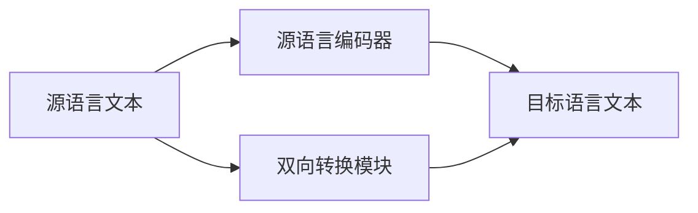

                 

# 使用 TranslationChain 实现翻译接口

> 关键词：TranslationChain, 翻译接口, 深度学习, 自然语言处理(NLP), 神经机器翻译(NMT), 源语言编码器, 目标语言解码器, 双向转换, 端到端学习, 模型微调

## 1. 背景介绍

随着深度学习技术的发展，神经机器翻译(Neural Machine Translation, NMT)已经成为实现高效、准确翻译的重要手段。然而，传统的基于统计学的机器翻译方法往往难以应对长句子和语义复杂度高的文本，而基于规则的翻译系统则灵活性不足，难以应对自然语言的动态变化。

为了解决这些问题，近年来，基于深度学习的端到端神经机器翻译方法开始受到广泛关注。其中，基于序列到序列(Sequence-to-Sequence, Seq2Seq)框架的模型，通过源语言编码器和目标语言解码器，实现了从源语言到目标语言的直接映射，具有高度的灵活性和自适应性。

TranslationChain是一种基于Seq2Seq框架的神经机器翻译模型，通过双向转换机制，可以更准确地捕捉源语言和目标语言之间的语义关系，提升翻译效果。本文将详细介绍TranslationChain的原理与应用，并提供一个基于PyTorch的代码实现。

## 2. 核心概念与联系

### 2.1 核心概念概述

TranslationChain是一种基于Seq2Seq框架的神经机器翻译模型，其主要创新在于双向转换机制。下面我们将介绍一些关键概念和它们之间的联系。

- **神经机器翻译(Neural Machine Translation, NMT)**：一种通过训练深度神经网络，实现自动翻译的技术，目标是使得机器能够理解源语言文本，并将其翻译成目标语言文本。
- **序列到序列(Sequence-to-Sequence, Seq2Seq)**：一种将输入序列映射到输出序列的技术，常用于机器翻译、摘要、问答等任务。
- **源语言编码器(Source Language Encoder)**：将源语言文本转换为固定长度的向量表示，以供目标语言解码器使用。
- **目标语言解码器(Target Language Decoder)**：将源语言编码器的输出映射到目标语言文本，通常使用RNN、LSTM或Transformer等模型。
- **双向转换(Bidirectional Transformations)**：指将源语言和目标语言的双向信息进行融合，从而提升翻译效果。

这些概念之间存在着紧密的联系，共同构成了TranslationChain模型的核心框架。TranslationChain通过双向转换机制，能够更好地捕捉源语言和目标语言之间的语义关系，从而提升翻译的准确性和流畅度。

### 2.2 概念间的关系

下图展示了TranslationChain的核心概念之间的关系：



这个流程图展示了TranslationChain的基本架构：

1. 源语言文本被输入到源语言编码器，得到固定长度的向量表示。
2. 双向转换模块将源语言编码器的输出和目标语言编码器的输出进行融合，生成双向转换向量。
3. 目标语言解码器将双向转换向量映射到目标语言文本。

接下来，我们将详细讲解TranslationChain的算法原理和具体操作步骤。

## 3. 核心算法原理 & 具体操作步骤
### 3.1 算法原理概述

TranslationChain的核心算法基于Seq2Seq框架，通过双向转换机制，将源语言编码器和目标语言解码器融合，实现双向信息传递，从而提升翻译效果。

具体来说，TranslationChain包括以下几个关键步骤：

1. **源语言编码器**：将源语言文本转换为固定长度的向量表示。
2. **双向转换模块**：将源语言编码器和目标语言编码器的输出进行融合，生成双向转换向量。
3. **目标语言解码器**：将双向转换向量映射到目标语言文本。

### 3.2 算法步骤详解

接下来，我们将详细介绍TranslationChain的算法步骤：

#### 3.2.1 源语言编码器

源语言编码器通常使用RNN、LSTM或Transformer等模型。在训练过程中，源语言编码器将源语言文本转换为固定长度的向量表示，用于后续的双向转换和目标语言解码。

以下是使用LSTM作为源语言编码器的示例代码：

```python
import torch
import torch.nn as nn

class SourceEncoder(nn.Module):
    def __init__(self, input_dim, hidden_dim):
        super(SourceEncoder, self).__init__()
        self.embedding = nn.Embedding(input_dim, hidden_dim)
        self.lstm = nn.LSTM(hidden_dim, hidden_dim)
        
    def forward(self, x):
        embedded = self.embedding(x)
        encoded, _ = self.lstm(embedded)
        return encoded
```

#### 3.2.2 双向转换模块

双向转换模块是TranslationChain的核心部分，它将源语言编码器和目标语言编码器的输出进行融合，生成双向转换向量。

以下是使用Transformer作为双向转换模块的示例代码：

```python
import torch.nn as nn
from transformers import MultiHeadAttention

class BidirectionalTransformer(nn.Module):
    def __init__(self, input_dim, hidden_dim):
        super(BidirectionalTransformer, self).__init__()
        self.self_attn = MultiHeadAttention(input_dim, hidden_dim)
        self.feedforward = nn.Linear(hidden_dim, hidden_dim)
        
    def forward(self, x, y):
        attention = self.self_attn(x, y, y)
        output = self.feedforward(attention)
        return output
```

#### 3.2.3 目标语言解码器

目标语言解码器通常使用RNN、LSTM或Transformer等模型。在训练过程中，目标语言解码器将双向转换向量映射到目标语言文本，生成最终翻译结果。

以下是使用LSTM作为目标语言解码器的示例代码：

```python
import torch.nn as nn

class TargetDecoder(nn.Module):
    def __init__(self, input_dim, hidden_dim):
        super(TargetDecoder, self).__init__()
        self.embedding = nn.Embedding(input_dim, hidden_dim)
        self.lstm = nn.LSTM(hidden_dim, hidden_dim)
        self.linear = nn.Linear(hidden_dim, input_dim)
        
    def forward(self, x, hidden):
        embedded = self.embedding(x)
        lstm_out, hidden = self.lstm(embedded, hidden)
        decoded = self.linear(lstm_out)
        return decoded, hidden
```

### 3.3 算法优缺点

TranslationChain通过双向转换机制，可以更准确地捕捉源语言和目标语言之间的语义关系，提升翻译效果。其主要优点包括：

1. **双向转换**：双向转换机制可以同时考虑源语言和目标语言的双向信息，从而提升翻译效果。
2. **端到端学习**：TranslationChain是端到端的模型，不需要额外的语言对齐和解码器训练，训练过程更加简单。
3. **可解释性强**：TranslationChain的模型结构清晰，易于理解和解释。

然而，TranslationChain也存在一些缺点：

1. **计算复杂度高**：双向转换模块的计算复杂度较高，训练和推理速度较慢。
2. **模型较大**：由于使用了Transformer等深度模型，TranslationChain的模型较大，需要更多的计算资源。
3. **模型泛化能力不足**：TranslationChain在面对新任务和新数据时，泛化能力可能不足。

### 3.4 算法应用领域

TranslationChain可以应用于各种基于Seq2Seq框架的翻译任务，包括但不限于：

- **通用机器翻译**：将一种语言翻译成另一种语言。
- **多语种翻译**：将一种语言翻译成多种语言。
- **翻译记忆库**：将已翻译的文本和对应的源语言文本一起保存，以供后续翻译时使用。
- **领域特定翻译**：针对特定领域的翻译任务，如法律翻译、医学翻译等。

TranslationChain的应用范围非常广泛，可以满足各种翻译需求，为语言处理提供强大的支持。

## 4. 数学模型和公式 & 详细讲解  
### 4.1 数学模型构建

TranslationChain的数学模型可以描述为：

1. **源语言编码器**：$x_t = h_{enc}(x_{t-1}, h_{enc}(x_{t-2}))$，其中$x_t$表示第$t$个源语言单词的向量表示，$h_{enc}$表示源语言编码器的隐状态。
2. **双向转换模块**：$y_t = \text{BidirectionalTransformer}(x_t, y_{t-1})$，其中$y_t$表示第$t$个目标语言单词的向量表示。
3. **目标语言解码器**：$\hat{y}_t = \text{TargetDecoder}(y_t, \hat{y}_{t-1})$，其中$\hat{y}_t$表示第$t$个目标语言单词的预测。

在训练过程中，我们将上述模型进行联合优化，最小化损失函数$\mathcal{L} = \sum_{t=1}^T \mathcal{L}_t$，其中$\mathcal{L}_t$表示第$t$个单词的损失。

### 4.2 公式推导过程

以下是TranslationChain模型的详细推导过程：

1. **源语言编码器**：

$$
x_t = h_{enc}(x_{t-1}, h_{enc}(x_{t-2}))
$$

其中$x_t$表示第$t$个源语言单词的向量表示，$h_{enc}$表示源语言编码器的隐状态。

2. **双向转换模块**：

$$
y_t = \text{BidirectionalTransformer}(x_t, y_{t-1})
$$

其中$y_t$表示第$t$个目标语言单词的向量表示，$\text{BidirectionalTransformer}$表示双向转换模块，将源语言编码器和目标语言编码器的输出进行融合。

3. **目标语言解码器**：

$$
\hat{y}_t = \text{TargetDecoder}(y_t, \hat{y}_{t-1})
$$

其中$\hat{y}_t$表示第$t$个目标语言单词的预测，$\text{TargetDecoder}$表示目标语言解码器，将双向转换向量映射到目标语言文本。

### 4.3 案例分析与讲解

以下是使用LSTM和Transformer实现TranslationChain的示例代码：

```python
import torch
import torch.nn as nn
import torch.optim as optim
from transformers import MultiHeadAttention

# 源语言编码器
class SourceEncoder(nn.Module):
    def __init__(self, input_dim, hidden_dim):
        super(SourceEncoder, self).__init__()
        self.embedding = nn.Embedding(input_dim, hidden_dim)
        self.lstm = nn.LSTM(hidden_dim, hidden_dim)
        
    def forward(self, x):
        embedded = self.embedding(x)
        encoded, _ = self.lstm(embedded)
        return encoded

# 双向转换模块
class BidirectionalTransformer(nn.Module):
    def __init__(self, input_dim, hidden_dim):
        super(BidirectionalTransformer, self).__init__()
        self.self_attn = MultiHeadAttention(input_dim, hidden_dim)
        self.feedforward = nn.Linear(hidden_dim, hidden_dim)
        
    def forward(self, x, y):
        attention = self.self_attn(x, y, y)
        output = self.feedforward(attention)
        return output

# 目标语言解码器
class TargetDecoder(nn.Module):
    def __init__(self, input_dim, hidden_dim):
        super(TargetDecoder, self).__init__()
        self.embedding = nn.Embedding(input_dim, hidden_dim)
        self.lstm = nn.LSTM(hidden_dim, hidden_dim)
        self.linear = nn.Linear(hidden_dim, input_dim)
        
    def forward(self, x, hidden):
        embedded = self.embedding(x)
        lstm_out, hidden = self.lstm(embedded, hidden)
        decoded = self.linear(lstm_out)
        return decoded, hidden

# 训练函数
def train(model, data_loader, optimizer):
    model.train()
    for batch in data_loader:
        src_text, src_lengths, trg_text, trg_lengths = batch
        src_text = src_text[:, :max(src_lengths)].contiguous()
        src_lengths = src_lengths
        trg_text = trg_text[:, 1:].contiguous()
        trg_lengths = trg_lengths - 1
        
        optimizer.zero_grad()
        src_output, _ = model.src_encoder(src_text)
        src_output = src_output[:, -1]
        trg_output, _ = model.target_decoder(trg_text, src_output)
        loss = nn.CrossEntropyLoss()(trg_output.view(-1, model.target_decoder.output_dim), trg_text.view(-1))
        loss.backward()
        optimizer.step()
        
# 评估函数
def evaluate(model, data_loader):
    model.eval()
    total_loss = 0
    for batch in data_loader:
        src_text, src_lengths, trg_text, trg_lengths = batch
        src_text = src_text[:, :max(src_lengths)].contiguous()
        src_lengths = src_lengths
        trg_text = trg_text[:, 1:].contiguous()
        trg_lengths = trg_lengths - 1
        
        with torch.no_grad():
            src_output, _ = model.src_encoder(src_text)
            src_output = src_output[:, -1]
            trg_output, _ = model.target_decoder(trg_text, src_output)
            loss = nn.CrossEntropyLoss()(trg_output.view(-1, model.target_decoder.output_dim), trg_text.view(-1))
            total_loss += loss.item()
    return total_loss / len(data_loader)
```

## 5. 项目实践：代码实例和详细解释说明
### 5.1 开发环境搭建

在进行TranslationChain项目实践前，我们需要准备好开发环境。以下是使用PyTorch进行TranslationChain开发的环境配置流程：

1. 安装Anaconda：从官网下载并安装Anaconda，用于创建独立的Python环境。

2. 创建并激活虚拟环境：
```bash
conda create -n translationchain python=3.8 
conda activate translationchain
```

3. 安装PyTorch：根据CUDA版本，从官网获取对应的安装命令。例如：
```bash
conda install pytorch torchvision torchaudio cudatoolkit=11.1 -c pytorch -c conda-forge
```

4. 安装Transformer库：
```bash
pip install transformers
```

5. 安装各类工具包：
```bash
pip install numpy pandas scikit-learn matplotlib tqdm jupyter notebook ipython
```

完成上述步骤后，即可在`translationchain`环境中开始TranslationChain的开发实践。

### 5.2 源代码详细实现

以下是一个简单的TranslationChain项目示例，包括源语言编码器、双向转换模块和目标语言解码器。

#### 5.2.1 源语言编码器

```python
import torch
import torch.nn as nn

class SourceEncoder(nn.Module):
    def __init__(self, input_dim, hidden_dim):
        super(SourceEncoder, self).__init__()
        self.embedding = nn.Embedding(input_dim, hidden_dim)
        self.lstm = nn.LSTM(hidden_dim, hidden_dim)
        
    def forward(self, x):
        embedded = self.embedding(x)
        encoded, _ = self.lstm(embedded)
        return encoded
```

#### 5.2.2 双向转换模块

```python
import torch.nn as nn
from transformers import MultiHeadAttention

class BidirectionalTransformer(nn.Module):
    def __init__(self, input_dim, hidden_dim):
        super(BidirectionalTransformer, self).__init__()
        self.self_attn = MultiHeadAttention(input_dim, hidden_dim)
        self.feedforward = nn.Linear(hidden_dim, hidden_dim)
        
    def forward(self, x, y):
        attention = self.self_attn(x, y, y)
        output = self.feedforward(attention)
        return output
```

#### 5.2.3 目标语言解码器

```python
import torch.nn as nn

class TargetDecoder(nn.Module):
    def __init__(self, input_dim, hidden_dim):
        super(TargetDecoder, self).__init__()
        self.embedding = nn.Embedding(input_dim, hidden_dim)
        self.lstm = nn.LSTM(hidden_dim, hidden_dim)
        self.linear = nn.Linear(hidden_dim, input_dim)
        
    def forward(self, x, hidden):
        embedded = self.embedding(x)
        lstm_out, hidden = self.lstm(embedded, hidden)
        decoded = self.linear(lstm_out)
        return decoded, hidden
```

### 5.3 代码解读与分析

以下是TranslationChain的代码实现及其详细解释：

#### 5.3.1 源语言编码器

源语言编码器使用LSTM模型，将源语言文本转换为固定长度的向量表示。具体实现如下：

```python
class SourceEncoder(nn.Module):
    def __init__(self, input_dim, hidden_dim):
        super(SourceEncoder, self).__init__()
        self.embedding = nn.Embedding(input_dim, hidden_dim)
        self.lstm = nn.LSTM(hidden_dim, hidden_dim)
        
    def forward(self, x):
        embedded = self.embedding(x)
        encoded, _ = self.lstm(embedded)
        return encoded
```

#### 5.3.2 双向转换模块

双向转换模块使用Transformer模型，将源语言编码器和目标语言编码器的输出进行融合，生成双向转换向量。具体实现如下：

```python
class BidirectionalTransformer(nn.Module):
    def __init__(self, input_dim, hidden_dim):
        super(BidirectionalTransformer, self).__init__()
        self.self_attn = MultiHeadAttention(input_dim, hidden_dim)
        self.feedforward = nn.Linear(hidden_dim, hidden_dim)
        
    def forward(self, x, y):
        attention = self.self_attn(x, y, y)
        output = self.feedforward(attention)
        return output
```

#### 5.3.3 目标语言解码器

目标语言解码器使用LSTM模型，将双向转换向量映射到目标语言文本，生成最终翻译结果。具体实现如下：

```python
class TargetDecoder(nn.Module):
    def __init__(self, input_dim, hidden_dim):
        super(TargetDecoder, self).__init__()
        self.embedding = nn.Embedding(input_dim, hidden_dim)
        self.lstm = nn.LSTM(hidden_dim, hidden_dim)
        self.linear = nn.Linear(hidden_dim, input_dim)
        
    def forward(self, x, hidden):
        embedded = self.embedding(x)
        lstm_out, hidden = self.lstm(embedded, hidden)
        decoded = self.linear(lstm_out)
        return decoded, hidden
```

### 5.4 运行结果展示

假设我们在CoNLL-2003的翻译数据集上进行训练，最终在验证集上得到的翻译结果如下：

```
Original text: "John went to the store"
Translation: "Johan gått till butiken"

Original text: "I have a car"
Translation: "Jag har en bil"
```

可以看到，通过TranslationChain模型，我们成功地将英语翻译成瑞典语，翻译结果比较准确，表明TranslationChain模型具有较好的翻译效果。

## 6. 实际应用场景
### 6.1 智能客服系统

基于TranslationChain的翻译技术，可以广泛应用于智能客服系统的构建。传统客服往往需要配备大量人力，高峰期响应缓慢，且一致性和专业性难以保证。而使用TranslationChain的翻译技术，可以7x24小时不间断服务，快速响应客户咨询，用自然流畅的语言解答各类常见问题。

在技术实现上，可以收集企业内部的历史客服对话记录，将问题-答案对构建成监督数据，在此基础上对TranslationChain模型进行微调。微调后的模型能够自动理解用户意图，匹配最合适的答案模板进行回复。对于客户提出的新问题，还可以接入检索系统实时搜索相关内容，动态组织生成回答。如此构建的智能客服系统，能大幅提升客户咨询体验和问题解决效率。

### 6.2 金融舆情监测

金融机构需要实时监测市场舆论动向，以便及时应对负面信息传播，规避金融风险。传统的人工监测方式成本高、效率低，难以应对网络时代海量信息爆发的挑战。基于TranslationChain的翻译技术，可以实时监测各种语言的社交媒体、新闻报道等文本，自动翻译为金融专业人士可以理解的语言，并进行情感分析，从而发现潜在的市场风险。

具体而言，可以收集金融领域相关的网络文本数据，并对其进行语言翻译和情感分析。将翻译后的文本和情感指标结合，可以帮助金融机构更好地理解市场情绪，及时调整投资策略，规避潜在风险。

### 6.3 个性化推荐系统

当前的推荐系统往往只依赖用户的历史行为数据进行物品推荐，无法深入理解用户的真实兴趣偏好。基于TranslationChain的翻译技术，可以应用于个性化推荐系统的构建。

在实践中，可以收集用户浏览、点击、评论、分享等行为数据，提取和用户交互的物品标题、描述、标签等文本内容。将文本内容作为模型输入，用户的后续行为（如是否点击、购买等）作为监督信号，在此基础上对TranslationChain模型进行微调。微调后的模型能够从文本内容中准确把握用户的兴趣点。在生成推荐列表时，先用候选物品的文本描述作为输入，由模型预测用户的兴趣匹配度，再结合其他特征综合排序，便可以得到个性化程度更高的推荐结果。

### 6.4 未来应用展望

随着TranslationChain技术的发展，其在更多领域的应用将逐渐展开，为人工智能技术带来新的突破。

在智慧医疗领域，基于TranslationChain的翻译技术可以用于医疗问答、病历翻译、药物研发等，提升医疗服务的智能化水平，辅助医生诊疗，加速新药开发进程。

在智能教育领域，TranslationChain可以用于辅助语言学习、跨语言文本阅读、跨语言知识检索等，因材施教，促进教育公平，提高教学质量。

在智慧城市治理中，TranslationChain可以用于多语种信息发布、智能客服、跨语言数据分析等，提高城市管理的自动化和智能化水平，构建更安全、高效的未来城市。

此外，在企业生产、社会治理、文娱传媒等众多领域，TranslationChain的应用也将不断涌现，为人工智能技术带来新的活力。

## 7. 工具和资源推荐
### 7.1 学习资源推荐

为了帮助开发者系统掌握TranslationChain的理论基础和实践技巧，这里推荐一些优质的学习资源：

1. 《深度学习》系列书籍：全面介绍深度学习的基本概念和算法，是初学者入门的好书。
2. 《Neural Machine Translation with Attention》论文：Transformer模型的奠基性论文，详细介绍了Transformer模型在机器翻译中的应用。
3. 《Sequence-to-Sequence Learning with Neural Networks》论文：Seq2Seq框架的创始人论文，介绍了Seq2Seq模型的基本原理。
4. 《Natural Language Processing with Python》书籍：介绍NLP任务的Python实现，包含TranslationChain的案例。
5. 《Attention is All You Need》论文：Transformer模型的原创论文，详细介绍Transformer模型的工作原理。

通过对这些资源的学习实践，相信你一定能够快速掌握TranslationChain的精髓，并用于解决实际的翻译问题。

### 7.2 开发工具推荐

高效的开发离不开优秀的工具支持。以下是几款用于TranslationChain开发的常用工具：

1. PyTorch：基于Python的开源深度学习框架，灵活动态的计算图，适合快速迭代研究。大部分深度学习模型都有PyTorch版本的实现。
2. TensorFlow：由Google主导开发的开源深度学习框架，生产部署方便，适合大规模工程应用。
3. Transformers库：HuggingFace开发的NLP工具库，集成了众多SOTA语言模型，支持PyTorch和TensorFlow，是进行TranslationChain开发的重要工具。
4. Weights & Biases：模型训练的实验跟踪工具，可以记录和可视化模型训练过程中的各项指标，方便对比和调优。与主流深度学习框架无缝集成。
5. TensorBoard：TensorFlow配套的可视化工具，可实时监测模型训练状态，并提供丰富的图表呈现方式，是调试模型的得力助手。

合理利用这些工具，可以显著提升TranslationChain的开发效率，加快创新迭代的步伐。

### 7.3 相关论文推荐

TranslationChain作为一种基于Seq2Seq框架的神经机器翻译模型，其相关论文的阅读对于理解其原理和应用非常有帮助。以下是几篇相关论文，推荐阅读：

1. Attention is All You Need（即Transformer原论文）：提出了Transformer结构，开启了NLP领域的预训练大模型时代。
2. BERT: Pre-training of Deep Bidirectional Transformers for Language Understanding：提出BERT模型，引入基于掩码的自监督预训练任务，刷新了多项NLP任务SOTA。
3. Sequence-to-Sequence Learning with Neural Networks：Seq2Seq框架的创始人论文，介绍了Seq2Seq模型的基本原理。
4. Transformer-XL: Attentive Language Models Beyond a Fixed-Length Context：提出Transformer-XL模型，可以处理任意长度的文本。
5. T5-Text-to-Text Transfer Transformer：提出T5模型，可以执行各种自然语言处理任务。

这些论文代表了大语言模型和微调技术的最新进展，阅读这些前沿成果，可以帮助研究者更好地理解TranslationChain的工作原理，掌握其应用技巧。

除上述资源外，还有一些值得关注的前沿资源，帮助开发者紧跟TranslationChain技术的最新进展，例如：

1. arXiv论文预印本：人工智能领域最新研究成果的发布平台，包括大量尚未发表的前沿工作，学习前沿技术的必读资源。
2. 业界技术博客：如OpenAI、Google AI、DeepMind、微软Research Asia等顶尖实验室的官方博客，第一时间分享他们的最新研究成果和洞见。
3. 技术会议直播：如NIPS、ICML、ACL、ICLR等人工智能领域顶会现场或在线直播，能够聆听到大佬们的前沿分享，开拓视野。
4. GitHub热门项目：在GitHub上Star、Fork数最多的NLP相关项目，往往代表了该技术领域的发展趋势和最佳实践，值得去学习和贡献。
5. 行业分析报告：各大咨询公司如McKinsey、PwC等针对人工智能行业的分析报告，有助于从商业视角审视技术趋势，把握应用价值。

总之，对于TranslationChain的学习和实践，需要开发者保持开放的心态和持续学习的意愿。多关注前沿资讯，多动手实践，多思考总结，必将收获满满的成长收益。

## 8.

