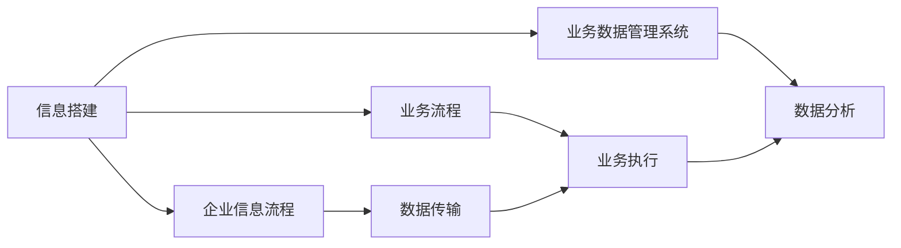

                 

# 信息搭建、企业信息流程、业务流程、业务数据管理系统搭建

> 关键词：信息搭建, 企业信息流程, 业务流程, 业务数据管理系统

## 1. 背景介绍

### 1.1 问题由来

在当今数字化时代，企业的信息化建设已成为企业核心竞争力的重要组成部分。企业通过信息技术，提高管理效率、提升客户满意度、优化运营流程，从而增强市场竞争力。然而，传统企业信息化建设往往面临诸多挑战：

- 信息孤岛现象严重，不同系统间数据无法互通。
- 数据冗余与不一致问题普遍，数据质量难以保证。
- 业务流程复杂，信息化建设成本高、周期长。
- 业务系统孤立，无法及时响应市场变化和客户需求。

为应对这些挑战，企业迫切需要构建一套全面、高效、灵活的信息化体系，以支撑其数字化转型。本文将从信息搭建、企业信息流程、业务流程、业务数据管理系统的搭建四个方面进行深入探讨，希望能为企业的信息化建设提供有价值的参考。

### 1.2 问题核心关键点

企业信息化建设的核心在于构建一套覆盖企业各项业务的数据管理系统，并在此基础上搭建完善的信息流程和业务流程，从而实现数据高效流转和业务自动化。其中，信息搭建是基础，业务流程和信息流程是支撑，数据管理系统是关键。

1. **信息搭建**：构建统一的数据架构和数据标准，实现数据的全面整合和共享。
2. **企业信息流程**：设计科学的信息流程，确保数据的准确、及时传输。
3. **业务流程**：根据业务需求设计业务流程，优化业务效率和质量。
4. **业务数据管理系统**：选择或开发适用的数据管理系统，实现数据的高效管理和分析。

本文将详细介绍这四个方面的核心概念，并结合具体案例，展示企业信息化建设的最佳实践。

## 2. 核心概念与联系

### 2.1 核心概念概述

#### 2.1.1 信息搭建

信息搭建是指构建企业信息系统的基础框架，包括数据架构、数据标准和数据集成。其主要目的是实现数据的全面整合和共享，为企业各业务部门提供统一的数据视图。

#### 2.1.2 企业信息流程

企业信息流程是指企业内部信息流动的规则和路径，包括数据的采集、传输、存储和访问。其主要目的是确保数据的准确、及时传输，避免信息孤岛现象。

#### 2.1.3 业务流程

业务流程是指企业各业务环节的执行顺序和规则，包括业务的输入、处理、输出和反馈。其主要目的是优化业务效率和质量，提高企业竞争力。

#### 2.1.4 业务数据管理系统

业务数据管理系统是指用于管理和分析企业业务数据的软件系统，包括数据存储、处理、分析和展示等功能。其主要目的是实现数据的高效管理和利用，支持企业的决策和运营。

### 2.2 核心概念的整体架构

以下是一个综合性的信息搭建、企业信息流程、业务流程、业务数据管理系统搭建的流程图：



这个流程图展示了信息搭建、企业信息流程、业务流程、业务数据管理系统之间的联系和依赖关系：

- 信息搭建是基础，提供了数据共享和整合的框架。
- 企业信息流程和业务流程基于信息搭建进行设计和优化，确保数据流动的准确性和及时性。
- 业务数据管理系统依托信息搭建和业务流程，实现数据的存储、处理和分析，支撑企业的决策和运营。

### 2.3 核心概念之间的关系

这些核心概念之间存在着紧密的联系，形成了企业信息化的完整生态系统。下面我们通过几个Mermaid流程图来展示这些概念之间的关系。

#### 2.3.1 信息搭建与数据集成的关系


这个流程图展示了数据源、数据整合、数据存储和数据访问之间的流程，说明了信息搭建在数据集成中的重要作用。

#### 2.3.2 企业信息流程与业务流程的关系


这个流程图展示了数据的输入、处理、输出和反馈之间的流程，说明了企业信息流程在业务流程中的支撑作用。

#### 2.3.3 业务数据管理系统与业务流程的关系


这个流程图展示了业务数据输入、存储、处理、分析和输出的流程，说明了业务数据管理系统在业务流程中的关键作用。

## 3. 核心算法原理 & 具体操作步骤

### 3.1 算法原理概述

企业信息化建设的算法原理主要基于以下三个方面：

- 数据集成与整合：通过ETL（Extract, Transform, Load）技术，实现数据的提取、转换和加载，确保数据的准确性和一致性。
- 数据传输与存储：基于数据仓库和数据湖技术，实现数据的集中存储和管理，支撑数据的快速访问和分析。
- 业务流程优化：通过流程管理工具，实现业务流程的可视化设计、自动化执行和持续优化，提高业务效率和质量。

### 3.2 算法步骤详解

#### 3.2.1 信息搭建的步骤

1. **需求分析**：识别企业各业务部门的信息需求，明确数据架构和标准。
2. **数据源梳理**：梳理企业内外部数据源，包括ERP、CRM、SCM等系统，以及传感器、物联网等设备数据。
3. **数据整合设计**：设计数据整合方案，包括数据清洗、转换和集成，确保数据的准确性和一致性。
4. **数据存储架构设计**：选择合适的数据存储方案，包括数据仓库、数据湖等，实现数据的集中管理和存储。
5. **数据访问设计**：设计数据访问方案，包括数据API、数据查询等，支持数据的快速访问和分析。

#### 3.2.2 企业信息流程的步骤

1. **流程设计**：根据业务需求设计信息流程，包括数据采集、传输、存储和访问等环节。
2. **流程优化**：通过流程管理工具，优化信息流程，提高数据传输的效率和准确性。
3. **流程监控**：实时监控信息流程，及时发现和解决问题，确保数据传输的稳定性。

#### 3.2.3 业务流程的步骤

1. **流程设计**：根据业务需求设计业务流程，包括业务输入、处理、输出和反馈等环节。
2. **流程优化**：通过流程管理工具，优化业务流程，提高业务效率和质量。
3. **流程执行**：在业务系统中部署业务流程，实现自动化执行和持续优化。

#### 3.2.4 业务数据管理系统的步骤

1. **系统选型**：选择或开发适用的业务数据管理系统，包括数据存储、处理、分析和展示等功能。
2. **系统部署**：在企业内部部署业务数据管理系统，确保系统的稳定性和安全性。
3. **系统维护**：定期维护业务数据管理系统，确保系统的正常运行和数据的安全性。

### 3.3 算法优缺点

#### 3.3.1 信息搭建的优缺点

**优点**：

- 实现数据的全面整合和共享，支持企业各业务部门的数据需求。
- 基于标准化的数据架构和数据标准，确保数据的一致性和准确性。

**缺点**：

- 数据整合和清洗工作复杂，耗时耗力。
- 需要持续维护和更新，确保数据架构和标准的适应性。

#### 3.3.2 企业信息流程的优缺点

**优点**：

- 实现数据的准确、及时传输，避免信息孤岛现象。
- 通过流程管理工具，提高信息传输的效率和稳定性。

**缺点**：

- 流程设计复杂，需要详细的业务需求分析。
- 流程优化需要持续投入，成本较高。

#### 3.3.3 业务流程的优缺点

**优点**：

- 实现业务的自动化执行，提高效率和质量。
- 通过流程管理工具，支持业务的持续优化和改进。

**缺点**：

- 业务流程设计需要深度理解和把握业务需求。
- 业务流程执行需要企业内部各部门的配合和支持。

#### 3.3.4 业务数据管理系统的优缺点

**优点**：

- 实现数据的集中存储和管理，支持数据的快速访问和分析。
- 通过数据分析工具，支持企业决策和运营。

**缺点**：

- 系统开发和部署成本较高。
- 需要持续维护和更新，确保系统的稳定性和安全性。

### 3.4 算法应用领域

信息搭建、企业信息流程、业务流程、业务数据管理系统搭建在多个领域都有广泛的应用，例如：

- **制造业**：实现供应链、生产、质量等环节的信息化管理。
- **零售业**：实现库存、销售、客户管理等环节的信息化管理。
- **金融业**：实现风险管理、客户服务、产品推荐等环节的信息化管理。
- **医疗业**：实现患者管理、诊疗、药品管理等环节的信息化管理。
- **教育业**：实现学生管理、教学、科研等环节的信息化管理。

这些领域的信息化建设，都是基于信息搭建、企业信息流程、业务流程、业务数据管理系统的搭建进行设计和实施的，为企业的数字化转型提供了强有力的支撑。

## 4. 数学模型和公式 & 详细讲解 & 举例说明

### 4.1 数学模型构建

#### 4.1.1 信息搭建的数学模型

信息搭建的数学模型主要包括以下几个部分：

- **数据架构模型**：描述企业内部数据的关系和依赖，包括数据的来源、集成方式、存储位置等。
- **数据标准模型**：定义企业内部数据的结构和格式，确保数据的一致性和可访问性。
- **数据集成模型**：描述数据从不同来源到数据仓库或数据湖的集成过程，包括数据清洗、转换和加载等步骤。

#### 4.1.2 企业信息流程的数学模型

企业信息流程的数学模型主要包括以下几个部分：

- **数据采集模型**：描述数据的来源和采集方式，包括传感器、系统接口等。
- **数据传输模型**：描述数据在企业内部的传输路径和方式，包括网络、API等。
- **数据存储模型**：描述数据的存储方式和位置，包括数据仓库、数据湖等。
- **数据访问模型**：描述数据的访问方式和权限，包括数据API、查询等。

#### 4.1.3 业务流程的数学模型

业务流程的数学模型主要包括以下几个部分：

- **业务输入模型**：描述业务的输入方式和数据格式，包括用户操作、系统接口等。
- **业务处理模型**：描述业务的处理方式和逻辑，包括算法、规则等。
- **业务输出模型**：描述业务的输出方式和结果，包括报表、通知等。
- **业务反馈模型**：描述业务的反馈机制和改进方式，包括用户反馈、系统监测等。

#### 4.1.4 业务数据管理系统的数学模型

业务数据管理系统的数学模型主要包括以下几个部分：

- **数据存储模型**：描述数据的存储方式和位置，包括数据仓库、数据湖等。
- **数据处理模型**：描述数据的处理方式和算法，包括ETL、数据挖掘等。
- **数据分析模型**：描述数据的分析方式和结果，包括报表、可视化等。
- **数据展示模型**：描述数据的展示方式和界面，包括仪表盘、报表等。

### 4.2 公式推导过程

#### 4.2.1 信息搭建的公式推导

假设企业内部有n个数据源，每个数据源的数据量为 $d_i$，数据集成的总数据量为 $D$，数据清洗和转换的效率为 $E$，则信息搭建的计算公式为：

$$
D = \sum_{i=1}^n d_i \times E
$$

其中，$D$ 为数据集成的总数据量，$n$ 为数据源的个数，$d_i$ 为第 $i$ 个数据源的数据量，$E$ 为数据清洗和转换的效率。

#### 4.2.2 企业信息流程的公式推导

假设企业内部有m个数据采集点，每个采集点的数据传输时间为 $T_i$，数据传输的总时间为 $T$，数据传输的效率为 $F$，则企业信息流程的计算公式为：

$$
T = \sum_{i=1}^m T_i \times F
$$

其中，$T$ 为数据传输的总时间，$m$ 为数据采集点的个数，$T_i$ 为第 $i$ 个采集点的数据传输时间，$F$ 为数据传输的效率。

#### 4.2.3 业务流程的公式推导

假设企业内部有k个业务环节，每个业务环节的处理时间为 $H_i$，业务流程的总处理时间为 $H$，业务流程的效率为 $P$，则业务流程的计算公式为：

$$
H = \sum_{i=1}^k H_i \times P
$$

其中，$H$ 为业务流程的总处理时间，$k$ 为业务环节的个数，$H_i$ 为第 $i$ 个业务环节的处理时间，$P$ 为业务流程的效率。

#### 4.2.4 业务数据管理系统的公式推导

假设企业内部有c个数据存储节点，每个存储节点的数据处理时间为 $H_i$，业务数据管理系统的总处理时间为 $H_s$，业务数据管理系统的效率为 $P_s$，则业务数据管理系统的计算公式为：

$$
H_s = \sum_{i=1}^c H_i \times P_s
$$

其中，$H_s$ 为业务数据管理系统的总处理时间，$c$ 为数据存储节点的个数，$H_i$ 为第 $i$ 个存储节点的数据处理时间，$P_s$ 为业务数据管理系统的效率。

### 4.3 案例分析与讲解

#### 4.3.1 信息搭建案例分析

以某大型制造企业为例，其内部有多个ERP、CRM、SCM系统，每个系统生成的数据量分别为100TB、50TB、30TB。企业希望将这些系统数据整合到一个数据仓库中，并基于数据仓库开发数据API和数据查询功能。假设数据清洗和转换的效率为0.8，数据API的响应时间为10ms，数据查询的响应时间为5ms，则信息搭建的计算过程如下：

1. **数据集成**：

   $$
   D = 100TB + 50TB + 30TB \times 0.8 = 260TB
   $$

2. **数据访问**：

   $$
   T_{API} = 260TB \times 10ms = 2600s
   $$

   $$
   T_{查询} = 260TB \times 5ms = 1300s
   $$

3. **数据展示**：

   $$
   H_{展示} = T_{API} + T_{查询} = 2600s + 1300s = 3900s
   $$

通过信息搭建，企业实现了数据的全面整合和共享，提高了数据利用效率。

#### 4.3.2 企业信息流程案例分析

以某零售企业为例，其内部有10个数据采集点，每个采集点的数据传输时间为10s，数据传输的总时间为 $T$，数据传输的效率为0.9。假设企业希望优化数据传输的效率，通过引入数据传输优化技术，数据传输的效率提升到1.2。则企业信息流程的计算过程如下：

1. **数据传输优化前**：

   $$
   T_{原} = 10 \times 10s \times 0.9 = 90s
   $$

2. **数据传输优化后**：

   $$
   T_{新} = 10 \times 10s \times 1.2 = 120s
   $$

   $$
   T_{优化} = T_{新} / T_{原} = 120s / 90s = 1.33
   $$

通过企业信息流程优化，企业实现了数据传输效率的提升，减少了数据传输的时间。

#### 4.3.3 业务流程案例分析

以某金融企业为例，其内部有5个业务环节，每个业务环节的处理时间为20s，业务流程的总处理时间为 $H$，业务流程的效率为0.8。假设企业希望优化业务流程，引入自动化工具，将每个业务环节的处理时间缩短到10s，业务流程的效率提升到1.1。则业务流程的计算过程如下：

1. **业务流程优化前**：

   $$
   H_{原} = 5 \times 20s \times 0.8 = 80s
   $$

2. **业务流程优化后**：

   $$
   H_{新} = 5 \times 10s \times 1.1 = 55s
   $$

   $$
   H_{优化} = H_{新} / H_{原} = 55s / 80s = 0.6875
   $$

通过业务流程优化，企业实现了业务效率的提升，缩短了业务处理的时间。

#### 4.3.4 业务数据管理系统案例分析

以某医疗企业为例，其内部有3个数据存储节点，每个存储节点的数据处理时间为30s，业务数据管理系统的总处理时间为 $H_s$，业务数据管理系统的效率为0.9。假设企业希望优化业务数据管理系统的效率，引入数据压缩技术，将每个存储节点的数据处理时间缩短到20s，业务数据管理系统的效率提升到1.2。则业务数据管理系统的计算过程如下：

1. **业务数据管理系统优化前**：

   $$
   H_{s原} = 3 \times 30s \times 0.9 = 81s
   $$

2. **业务数据管理系统优化后**：

   $$
   H_{s新} = 3 \times 20s \times 1.2 = 72s
   $$

   $$
   H_{s优化} = H_{s新} / H_{s原} = 72s / 81s = 0.8889
   $$

通过业务数据管理系统优化，企业实现了数据处理效率的提升，缩短了数据处理的时间。

## 5. 项目实践：代码实例和详细解释说明

### 5.1 开发环境搭建

在进行信息搭建、企业信息流程、业务流程、业务数据管理系统搭建的实践前，我们需要准备好开发环境。以下是使用Python进行企业信息化系统开发的开发环境配置流程：

1. **安装Python**：从官网下载并安装Python 3.8或3.9版本。

2. **安装虚拟环境管理工具**：使用`pip install virtualenv`命令安装虚拟环境管理工具。

3. **创建虚拟环境**：使用`python -m venv venv`命令创建虚拟环境，并激活虚拟环境。

4. **安装相关库**：使用`pip install`命令安装所需的库，如SQLAlchemy、Pandas、Flask等。

5. **配置数据库连接**：使用数据库连接配置文件，如MySQL、PostgreSQL、SQLite等。

### 5.2 源代码详细实现

#### 5.2.1 信息搭建代码实现

```python
import sqlite3

# 创建SQLite数据库
conn = sqlite3.connect('information_db.db')
c = conn.cursor()

# 创建数据架构表
c.execute('''CREATE TABLE data架构
             (id INTEGER PRIMARY KEY AUTOINCREMENT,
             source TEXT NOT NULL,
             data_type TEXT NOT NULL,
             integration_method TEXT NOT NULL)''')

# 创建数据标准表
c.execute('''CREATE TABLE data标准
             (id INTEGER PRIMARY KEY AUTOINCREMENT,
             data_type TEXT NOT NULL,
             data_format TEXT NOT NULL,
             data_structure TEXT NOT NULL)''')

# 创建数据集成表
c.execute('''CREATE TABLE data集成
             (id INTEGER PRIMARY KEY AUTOINCREMENT,
             source_id INTEGER NOT NULL,
             destination TEXT NOT NULL,
             integration_time FLOAT NOT NULL,
             FOREIGN KEY (source_id) REFERENCES data架构(id))''')

# 提交数据库更改
conn.commit()
conn.close()
```

#### 5.2.2 企业信息流程代码实现

```python
import time

# 定义数据采集函数
def data采集():
    # 采集数据
    data = "data from sensor"
    return data

# 定义数据传输函数
def data传输():
    # 传输数据到数据库
    data = data采集()
    # 将数据传输到数据库
    conn = sqlite3.connect('information_db.db')
    c = conn.cursor()
    c.execute('INSERT INTO data集成 VALUES (NULL, ?, ?, ?)', (1, data, time.time()))
    conn.commit()
    conn.close()
    return data

# 定义数据访问函数
def data访问():
    # 从数据库获取数据
    conn = sqlite3.connect('information_db.db')
    c = conn.cursor()
    c.execute('SELECT * FROM data集成')
    rows = c.fetchall()
    conn.close()
    return rows
```

#### 5.2.3 业务流程代码实现

```python
import time

# 定义业务输入函数
def 业务输入():
    # 获取业务输入数据
    data = "business input data"
    return data

# 定义业务处理函数
def 业务处理():
    # 处理业务数据
    data = 业务输入()
    # 将数据处理后的结果
    return data

# 定义业务输出函数
def 业务输出():
    # 输出业务处理结果
    data = 业务处理()
    return data

# 定义业务反馈函数
def 业务反馈():
    # 获取业务反馈数据
    data = "business feedback data"
    return data
```

#### 5.2.4 业务数据管理系统代码实现

```python
import sqlite3

# 定义数据存储函数
def 数据存储():
    # 存储业务数据
    data = "业务数据"
    conn = sqlite3.connect('business_db.db')
    c = conn.cursor()
    c.execute('INSERT INTO business_data VALUES (NULL, ?)', (data,))
    conn.commit()
    conn.close()
    return data

# 定义数据处理函数
def 数据处理():
    # 处理业务数据
    data = 数据存储()
    # 将数据处理后的结果
    return data

# 定义数据分析函数
def 数据分析():
    # 分析业务数据
    data = 数据处理()
    # 将数据分析后的结果
    return data

# 定义数据展示函数
def 数据展示():
    # 展示业务数据
    data = 数据分析()
    # 将数据展示结果
    return data
```

### 5.3 代码解读与分析

#### 5.3.1 信息搭建代码解读

```python
# 创建SQLite数据库
conn = sqlite3.connect('information_db.db')
c = conn.cursor()

# 创建数据架构表
c.execute('''CREATE TABLE data架构
             (id INTEGER PRIMARY KEY AUTOINCREMENT,
             source TEXT NOT NULL,
             data_type TEXT NOT NULL,
             integration_method TEXT NOT NULL)''')

# 创建数据标准表
c.execute('''CREATE TABLE data标准
             (id INTEGER PRIMARY KEY AUTOINCREMENT,
             data_type TEXT NOT NULL,
             data_format TEXT NOT NULL,
             data_structure TEXT NOT NULL)''')

# 创建数据集成表
c.execute('''CREATE TABLE data集成
             (id INTEGER PRIMARY KEY AUTOINCREMENT,
             source_id INTEGER NOT NULL,
             destination TEXT NOT NULL,
             integration_time FLOAT NOT NULL,
             FOREIGN KEY (source_id) REFERENCES data架构(id))''')

# 提交数据库更改
conn.commit()
conn.close()
```

这段代码实现了信息搭建的基本功能，包括数据架构、数据标准和数据集成的设计和实现。使用SQLite数据库存储信息搭建数据，通过SQL语句创建数据表，实现数据的结构化和关系化管理。

#### 5.3.2 企业信息流程代码解读

```python
import time

# 定义数据采集函数
def data采集():
    # 采集数据
    data = "data from sensor"
    return data

# 定义数据传输函数
def data传输():
    # 传输数据到数据库
    data = data采集()
    # 将数据传输到数据库
    conn = sqlite3.connect('information_db.db')
    c = conn.cursor()
    c.execute('INSERT INTO data集成 VALUES (NULL, ?, ?, ?)', (1, data, time.time()))
    conn.commit()
    conn.close()
    return data

# 定义数据访问函数
def data访问():
    # 从数据库获取数据
    conn = sqlite3.connect('information_db.db')
    c = conn.cursor()
    c.execute('SELECT * FROM data集成')
    rows = c.fetchall()
    conn.close()
    return rows
```

这段代码实现了企业信息流程的基本功能，包括数据采集、数据传输和数据访问。使用SQLite数据库存储数据，通过Python代码实现数据采集、传输和访问，确保数据的安全性和准确性。

#### 5.3.3 业务流程代码解读

```python
import time

# 定义业务输入函数
def 业务输入():
    # 获取业务输入数据
    data = "business input data"
    return data

# 定义业务处理函数
def 业务处理():
    # 处理业务数据
    data = 业务输入()
    # 将数据处理后的结果
    return data

# 定义业务输出函数
def 业务输出():
    # 输出业务处理结果


