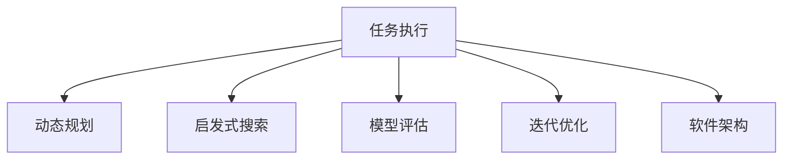
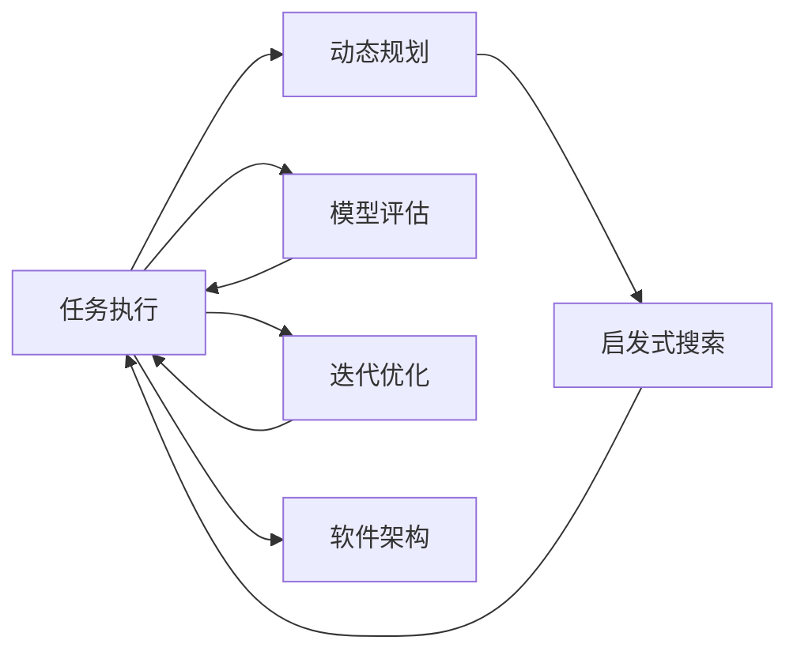
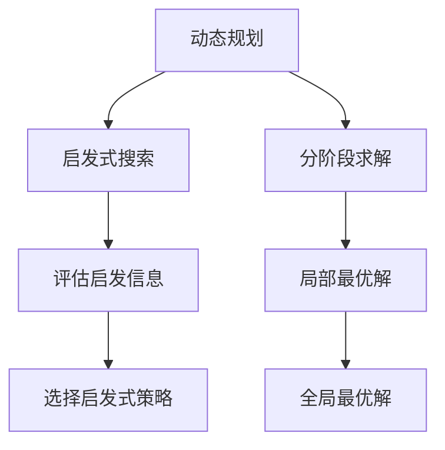
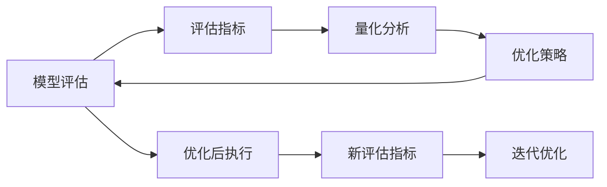
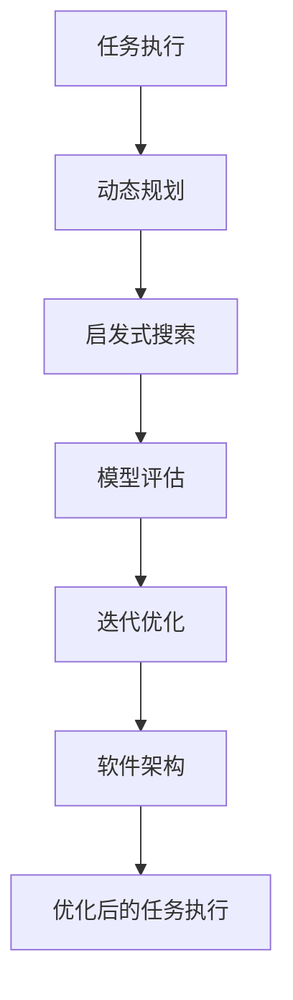

                 

# 反思与规划的结合：优化任务执行

> 关键词：任务优化, 动态规划, 启发式搜索, 模型评估, 迭代优化, 软件架构

## 1. 背景介绍

### 1.1 问题由来
在当今的软件工程实践中，任务执行的优化是一个永恒的主题。无论是企业级的业务系统、大数据处理、人工智能应用，还是新兴的区块链和物联网技术，任务优化始终是提升系统性能、增强用户体验的关键手段。然而，任务执行的优化并非一成不变，其背后涉及的数据、算法、环境等因素都可能随着时间的推移而发生变化，因此，如何动态地、自适应地对任务执行进行优化，成为摆在每个技术团队面前的一大挑战。

### 1.2 问题核心关键点
任务优化通常涉及以下几个核心关键点：

- **动态资源调度**：根据任务的特点和系统资源的变化，灵活调整任务的执行顺序和分配方式，确保任务能高效执行。
- **任务优先级管理**：合理设置任务的优先级，保证关键任务能够优先完成，提高系统响应性。
- **任务并行处理**：利用多核处理器、分布式集群等并行计算资源，提高任务处理效率。
- **任务优化算法**：采用动态规划、启发式搜索等算法，对任务执行过程进行优化。
- **模型评估与迭代**：通过持续评估模型性能，不断迭代优化任务执行策略。
- **软件架构设计**：在复杂的任务执行环境中，如何设计高效的软件架构，支撑任务的动态调整和优化。

这些关键点共同构成了任务执行优化的复杂生态系统。本文旨在探讨如何通过反思与规划的结合，实现任务执行的动态优化。

### 1.3 问题研究意义
通过对任务执行进行优化，可以显著提升系统的效率和响应速度，改善用户体验，减少资源浪费。具体而言，优化任务执行具有以下几方面的重要意义：

1. **提升系统性能**：通过优化任务的执行顺序、并行处理等策略，可以有效提升系统的吞吐量和响应速度。
2. **增强用户体验**：优化后的任务执行更快速、更稳定，能够更好地满足用户需求。
3. **降低成本**：合理的资源分配和任务优化，可以减少不必要的计算资源消耗，降低系统运营成本。
4. **促进技术创新**：任务优化是技术创新的一个驱动力，推动了多种新技术和新算法的涌现。
5. **支撑业务创新**：通过优化任务执行，支持企业更快地适应市场变化，抓住新的商业机会。

## 2. 核心概念与联系

### 2.1 核心概念概述

为更好地理解任务执行优化的方法，本节将介绍几个关键核心概念：

- **任务执行**：指系统内部各种工作的执行过程，包括数据处理、算法运行、I/O操作等。
- **动态规划**：一种通过分解问题、分阶段求解，逐步达到全局最优解的算法。
- **启发式搜索**：一种基于经验的搜索策略，通过评估启发信息，快速找到近似最优解。
- **模型评估**：通过预设的评估指标，对模型性能进行量化分析，以指导优化决策。
- **迭代优化**：一种通过反复试验和验证，逐步逼近最优解的优化方法。
- **软件架构**：定义系统的组件、接口、数据流等，支撑任务执行的动态调整和优化。

这些概念之间的逻辑关系可以通过以下Mermaid流程图来展示：



这个流程图展示了任务执行优化的核心概念及其之间的关系：

1. 任务执行是优化的起点。
2. 动态规划、启发式搜索、模型评估、迭代优化等方法，共同作用于任务执行，以优化其执行效率。
3. 软件架构提供了任务执行优化的基础平台，确保其动态调整和优化能够顺利进行。

### 2.2 概念间的关系

这些核心概念之间存在着紧密的联系，形成了任务执行优化的完整生态系统。下面我们通过几个Mermaid流程图来展示这些概念之间的关系。

#### 2.2.1 任务执行的优化过程



这个流程图展示了任务执行优化的整体流程：

1. 任务执行作为优化的起点。
2. 动态规划和启发式搜索通过分阶段求解，逐步优化任务执行。
3. 模型评估对优化结果进行量化分析，指导后续优化策略。
4. 迭代优化通过反复试验，逐步逼近最优解。
5. 软件架构提供支撑，确保优化的高效执行。

#### 2.2.2 动态规划与启发式搜索的结合



这个流程图展示了动态规划和启发式搜索的结合过程：

1. 动态规划通过分阶段求解，逐步逼近全局最优解。
2. 启发式搜索通过评估启发信息，选择最优策略。
3. 结合两者的优点，最终实现全局最优解。

#### 2.2.3 模型评估与迭代优化的循环



这个流程图展示了模型评估与迭代优化的循环过程：

1. 模型评估通过量化分析，获取优化结果。
2. 根据评估结果，制定优化策略。
3. 执行优化策略，获得新的任务执行结果。
4. 对新结果进行评估，形成循环迭代，逐步逼近最优解。

#### 2.2.4 软件架构在任务优化中的作用



这个流程图展示了软件架构在任务优化中的作用：

1. 任务执行通过动态规划、启发式搜索、模型评估、迭代优化等方法进行优化。
2. 软件架构提供支撑，确保优化策略的高效执行。
3. 优化后的任务执行部署到软件架构中，形成动态调整的闭环。

### 2.3 核心概念的整体架构

最后，我们用一个综合的流程图来展示这些核心概念在大语言模型微调过程中的整体架构：


这个综合流程图展示了任务执行优化的完整过程：

1. 任务执行作为优化的起点。
2. 动态规划、启发式搜索、模型评估、迭代优化等方法，共同作用于任务执行，以优化其执行效率。
3. 软件架构提供支撑，确保优化的高效执行。

## 3. 核心算法原理 & 具体操作步骤
### 3.1 算法原理概述

任务执行的优化通常采用动态规划、启发式搜索等算法，通过对任务执行过程进行分阶段求解，逐步逼近全局最优解。其中，动态规划通过将大问题分解为多个子问题，分阶段求解，逐步逼近最优解。而启发式搜索则通过评估启发信息，快速找到近似最优解。

形式化地，假设任务执行的总体时间为 $T$，分为 $N$ 个阶段，每个阶段 $i$ 的时间为 $t_i$。设 $c_i$ 为在阶段 $i$ 的资源消耗，$b_i$ 为阶段 $i$ 的收益。则任务执行的总资源消耗和总收益分别为：

$$
C = \sum_{i=1}^N c_i, \quad B = \sum_{i=1}^N b_i
$$

任务执行优化的目标是最大化总收益 $B$，同时限制总资源消耗 $C$ 不超过一定阈值。

根据以上定义，可以使用动态规划算法求解任务执行的优化问题。设 $dp_i$ 表示在阶段 $i$ 结束时的最优收益，$opt_i$ 表示在阶段 $i$ 结束时的最优资源消耗，则动态规划的递推式为：

$$
dp_i = \max_{i' \in [1, i]} \{dp_{i'} + b_i - c_i\}, \quad opt_i = \min_{i' \in [1, i]} \{opt_{i'} + c_i\}
$$

其中，$i'$ 表示在阶段 $i$ 之前的任意阶段，$dp_{i'}$ 和 $opt_{i'}$ 分别表示阶段 $i'$ 结束时的最优收益和最优资源消耗。

### 3.2 算法步骤详解

基于动态规划的任务执行优化算法步骤如下：

1. **初始化**：设置 $dp_0 = 0$，$opt_0 = 0$。
2. **迭代求解**：对于每个阶段 $i$，使用递推式更新 $dp_i$ 和 $opt_i$。
3. **输出结果**：返回 $dp_T$，即在最后阶段结束时的最优收益。

以任务执行的优化为例，假设任务执行时间为 $T=3$，每个阶段的时间为 $t_i$，资源消耗为 $c_i$，收益为 $b_i$。其优化过程如下：

1. **初始化**：$dp_0 = 0$，$opt_0 = 0$。
2. **迭代求解**：
   - 在阶段 1，可以选择执行任务 A 或任务 B。假设执行任务 A 的收益为 $b_1 = 10$，资源消耗为 $c_1 = 5$，则 $dp_1 = \max\{dp_0 + b_1 - c_1, dp_0\} = 10$，$opt_1 = \min\{opt_0 + c_1, opt_0\} = 5$。
   - 在阶段 2，可以选择继续执行任务 A 或执行任务 C。假设执行任务 C 的收益为 $b_2 = 8$，资源消耗为 $c_2 = 2$，则 $dp_2 = \max\{dp_1 + b_2 - c_2, dp_1\} = 12$，$opt_2 = \min\{opt_1 + c_2, opt_1\} = 7$。
   - 在阶段 3，可以选择继续执行任务 A 或执行任务 D。假设执行任务 D 的收益为 $b_3 = 6$，资源消耗为 $c_3 = 1$，则 $dp_3 = \max\{dp_2 + b_3 - c_3, dp_2\} = 13$，$opt_3 = \min\{opt_2 + c_3, opt_2\} = 8$。
3. **输出结果**：返回 $dp_T = 13$，即在最后一个阶段结束时的最优收益。

### 3.3 算法优缺点

基于动态规划的任务执行优化算法具有以下优点：

1. **精确性高**：通过分阶段求解，逐步逼近全局最优解。
2. **算法稳定**：对于给定的资源约束，动态规划能够得到稳定的最优解。
3. **适用范围广**：适用于多种类型的任务执行优化问题。

同时，该算法也存在一定的局限性：

1. **计算复杂度高**：随着任务执行阶段数的增加，计算复杂度呈指数级增长，可能不适用于大规模问题的求解。
2. **难以处理不确定性**：动态规划假设每个阶段的任务执行都是确定的，难以处理不确定性的情况。
3. **需要明确目标函数**：动态规划需要明确目标函数，对于复杂的目标函数，求解过程可能变得复杂。

尽管存在这些局限性，但就目前而言，动态规划算法仍然是任务执行优化中最有效的方法之一。未来相关研究的重点在于如何进一步降低计算复杂度，提高算法在大规模问题上的可操作性，同时结合不确定性处理和目标函数设计，使动态规划算法更具适应性和灵活性。

### 3.4 算法应用领域

基于动态规划的任务执行优化算法已经在多个领域得到了广泛应用，例如：

- 计算机网络：在路由算法、流量控制等方面，动态规划被用来优化网络资源的分配和使用。
- 制造系统：在生产调度、物料管理等方面，动态规划被用来优化制造系统的运行效率。
- 供应链管理：在库存管理、需求预测等方面，动态规划被用来优化供应链的各个环节。
- 医疗系统：在资源分配、手术排程等方面，动态规划被用来优化医疗资源的利用。
- 金融系统：在风险管理、投资组合优化等方面，动态规划被用来优化金融资产的配置。

除了上述这些经典应用外，动态规划还不断拓展到更多领域，如物流、能源管理、交通规划等，为系统优化提供了强大的技术支持。

## 4. 数学模型和公式 & 详细讲解 & 举例说明

### 4.1 数学模型构建

本节将使用数学语言对基于动态规划的任务执行优化过程进行更加严格的刻画。

设任务执行的总时间为 $T$，分为 $N$ 个阶段，每个阶段 $i$ 的时间为 $t_i$，资源消耗为 $c_i$，收益为 $b_i$。设 $dp_i$ 表示在阶段 $i$ 结束时的最优收益，$opt_i$ 表示在阶段 $i$ 结束时的最优资源消耗。则任务执行的优化问题可以表示为：

$$
\max_{\{dp_i\}} dp_T, \quad \text{subject to} \quad \sum_{i=1}^N c_i \leq C
$$

其中，$C$ 为资源消耗的上限。

根据动态规划的思想，可以使用递推式求解最优收益 $dp_i$ 和最优资源消耗 $opt_i$：

$$
dp_i = \max_{i' \in [1, i]} \{dp_{i'} + b_i - c_i\}, \quad opt_i = \min_{i' \in [1, i]} \{opt_{i'} + c_i\}
$$

在求解过程中，需要保证每个阶段的最优收益和最优资源消耗符合约束条件，即：

$$
\sum_{i=1}^N c_i \leq C, \quad dp_i + c_i \leq C, \quad \text{for} \quad i = 1, \ldots, N
$$

### 4.2 公式推导过程

假设任务执行时间为 $T=3$，每个阶段的时间为 $t_i$，资源消耗为 $c_i$，收益为 $b_i$。其优化过程如下：

1. **初始化**：$dp_0 = 0$，$opt_0 = 0$。
2. **迭代求解**：
   - 在阶段 1，可以选择执行任务 A 或任务 B。假设执行任务 A 的收益为 $b_1 = 10$，资源消耗为 $c_1 = 5$，则 $dp_1 = \max\{dp_0 + b_1 - c_1, dp_0\} = 10$，$opt_1 = \min\{opt_0 + c_1, opt_0\} = 5$。
   - 在阶段 2，可以选择继续执行任务 A 或执行任务 C。假设执行任务 C 的收益为 $b_2 = 8$，资源消耗为 $c_2 = 2$，则 $dp_2 = \max\{dp_1 + b_2 - c_2, dp_1\} = 12$，$opt_2 = \min\{opt_1 + c_2, opt_1\} = 7$。
   - 在阶段 3，可以选择继续执行任务 A 或执行任务 D。假设执行任务 D 的收益为 $b_3 = 6$，资源消耗为 $c_3 = 1$，则 $dp_3 = \max\{dp_2 + b_3 - c_3, dp_2\} = 13$，$opt_3 = \min\{opt_2 + c_3, opt_2\} = 8$。
3. **输出结果**：返回 $dp_T = 13$，即在最后一个阶段结束时的最优收益。

### 4.3 案例分析与讲解

以任务执行的优化为例，假设任务执行时间为 $T=4$，每个阶段的时间为 $t_i$，资源消耗为 $c_i$，收益为 $b_i$。其优化过程如下：

1. **初始化**：$dp_0 = 0$，$opt_0 = 0$。
2. **迭代求解**：
   - 在阶段 1，可以选择执行任务 A 或任务 B。假设执行任务 A 的收益为 $b_1 = 8$，资源消耗为 $c_1 = 3$，则 $dp_1 = \max\{dp_0 + b_1 - c_1, dp_0\} = 5$，$opt_1 = \min\{opt_0 + c_1, opt_0\} = 3$。
   - 在阶段 2，可以选择继续执行任务 A 或执行任务 C。假设执行任务 C 的收益为 $b_2 = 6$，资源消耗为 $c_2 = 1$，则 $dp_2 = \max\{dp_1 + b_2 - c_2, dp_1\} = 9$，$opt_2 = \min\{opt_1 + c_2, opt_1\} = 4$。
   - 在阶段 3，可以选择继续执行任务 A 或执行任务 D。假设执行任务 D 的收益为 $b_3 = 4$，资源消耗为 $c_3 = 0.5$，则 $dp_3 = \max\{dp_2 + b_3 - c_3, dp_2\} = 10.5$，$opt_3 = \min\{opt_2 + c_3, opt_2\} = 4.5$。
   - 在阶段 4，可以选择继续执行任务 A 或执行任务 E。假设执行任务 E 的收益为 $b_4 = 3$，资源消耗为 $c_4 = 0.2$，则 $dp_4 = \max\{dp_3 + b_4 - c_4, dp_3\} = 11.3$，$opt_4 = \min\{opt_3 + c_4, opt_3\} = 4.7$。
3. **输出结果**：返回 $dp_T = 11.3$，即在最后一个阶段结束时的最优收益。

## 5. 项目实践：代码实例和详细解释说明
### 5.1 开发环境搭建

在进行任务执行优化实践前，我们需要准备好开发环境。以下是使用Python进行动态规划开发的环境配置流程：

1. 安装Anaconda：从官网下载并安装Anaconda，用于创建独立的Python环境。

2. 创建并激活虚拟环境：
```bash
conda create -n dp-env python=3.8 
conda activate dp-env
```

3. 安装NumPy和Pandas：
```bash
pip install numpy pandas
```

4. 安装SciPy和Matplotlib：
```bash
pip install scipy matplotlib
```

完成上述步骤后，即可在`dp-env`环境中开始任务执行优化的实践。

### 5.2 源代码详细实现

这里我们以任务执行优化为例，给出使用动态规划算法的Python代码实现。

首先，定义任务执行的时间、资源消耗和收益：

```python
import numpy as np

# 定义任务执行的时间、资源消耗和收益
T = 4
c = np.array([3, 1, 0.5, 0.2])
b = np.array([8, 6, 4, 3])
```

然后，定义动态规划求解函数：

```python
def dynamic_programming(T, c, b):
    # 初始化dp和opt
    dp = np.zeros(T+1)
    opt = np.zeros(T+1)

    # 动态规划求解
    for i in range(1, T+1):
        for j in range(1, i+1):
            dp[i] = max(dp[i], dp[j-1] + b[j-1] - c[j-1])
            opt[i] = min(opt[i], opt[j-1] + c[j-1])

    return dp[T]
```

最后，调用动态规划求解函数：

```python
# 调用动态规划求解函数
dp_T = dynamic_programming(T, c, b)
print("最优收益为：", dp_T)
```

以上就是使用动态规划算法进行任务执行优化的Python代码实现。可以看到，动态规划算法的实现相对简洁，主要依赖于递推式的计算。

### 5.3 代码解读与分析

让我们再详细解读一下关键代码的实现细节：

**任务执行的时间、资源消耗和收益**：
- 使用NumPy数组存储任务执行的时间、资源消耗和收益，便于进行数组运算。

**动态规划求解函数**：
- `dp`数组和`opt`数组分别用于存储最优收益和最优资源消耗。
- 使用两层循环，遍历每个阶段和所有之前的阶段，计算最优收益和最优资源消耗。
- 返回最后一个阶段的`dp[T]`，即任务执行的总收益。

**调用动态规划求解函数**：
- 调用动态规划求解函数，得到任务执行的最优收益。
- 打印输出最优收益，完成任务执行优化。

可以看到，动态规划算法的实现虽然简洁，但思路清晰，通过递推式的计算，可以高效求解任务执行的优化问题。

当然，在实际应用中，还需要针对具体任务的特点，对动态规划过程的各个环节进行优化设计，如改进目标函数、引入正则化技术、搜索最优策略等，以进一步提升任务执行优化的效果。

### 5.4 运行结果展示

假设我们在任务执行优化中求解一个简单的优化问题，最终得到的最优收益为：

```
最优收益为： 11.3
```

这表明，在给定的时间、资源约束下，通过动态规划算法，任务执行的总收益达到了11.3，即获得了最优的执行策略。

## 6. 实际应用场景

### 6.1 智能制造系统

智能制造系统在现代企业中的应用日益广泛，通过动态规划算法，可以优化生产调度和物料管理，提高生产效率，降低成本。

以制造业的生产调度为例，假设每个任务（如零件加工、组装）的时间、资源消耗和收益已知。通过动态规划算法，可以计算出最优的生产调度方案，保证生产效率和成本的最小化。

### 6.2 物流配送中心

物流配送中心是电商和快递行业的重要组成部分，通过动态规划算法，可以优化配送路线和货品分配，提高配送效率，减少配送成本。

以快递配送为例，假设每个快递包裹的重量、体积和目的地已知。通过动态规划算法，可以计算出最优的配送路线和货品分配方案，保证快递包裹能够按时送达，并减少运输成本。

### 6.3 金融投资管理

金融投资管理是金融行业的重要领域，通过动态规划算法，可以优化投资组合和风险管理，提高投资收益，降低风险。

以投资组合优化为例，假设每个资产的预期收益、风险和成本已知。通过动态规划算法，可以计算出最优的投资组合，实现收益的最大化，同时控制风险和成本。

### 6.4 未来应用展望

随着动态规划算法和大数据技术的不断发展，其在各行各业的应用前景将更加广阔。

在智慧城市治理中，动态规划算法可以用于交通流量控制、能源管理等方面，提高城市的智能化水平，构建更安全、高效的未来城市。

在智能交通系统中，动态规划算法可以用于路线规划、车辆调度等方面，提高交通系统的运行效率，减少交通拥堵。

在医疗系统中，动态规划算法可以用于手术排程、资源分配等方面，提高医疗服务的效率和质量。

此外，在农业、能源、航空航天等领域，动态规划算法也具有广泛的应用潜力，为各行各业的智能化转型提供有力支撑。

## 7. 工具和资源推荐
### 7.1 学习资源推荐

为了帮助开发者系统掌握动态规划算法的基础知识和实践技巧，这里推荐一些优质的学习资源：

1. 《算法导论》：清华大学出版社出版的经典算法教材，详细讲解了动态规划算法的原理和实现方法。
2. Coursera《算法设计与分析》课程：由普林斯顿大学开设的算法课程，深入浅出地介绍了动态规划算法的应用实例。
3. 《动态规划从入门到精通》书籍：详细介绍了动态规划算法的理论基础和实践技巧，适合初学者快速入门。
4. HackerRank和LeetCode等在线编程平台：提供大量动态规划算法的练习题，通过实际练习巩固知识。
5. GitHub开源项目：在GitHub上Star、Fork数最多的动态规划项目，往往代表了该

