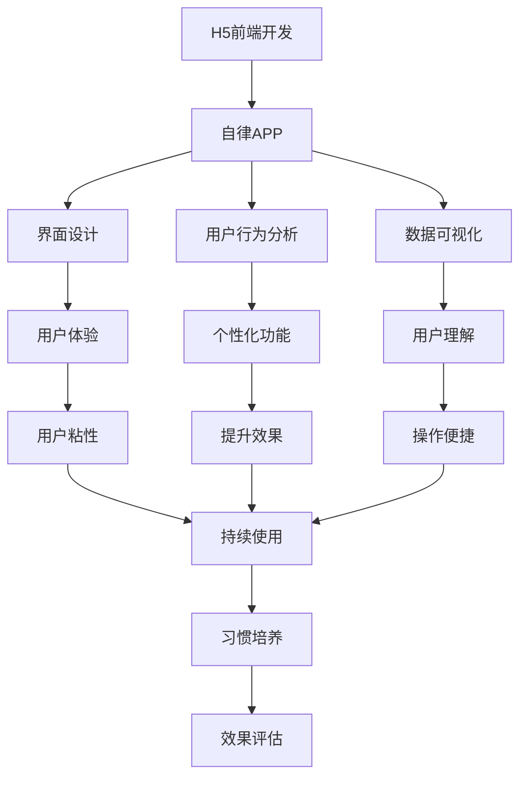
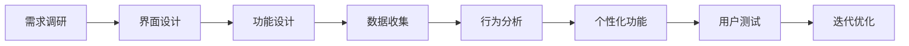
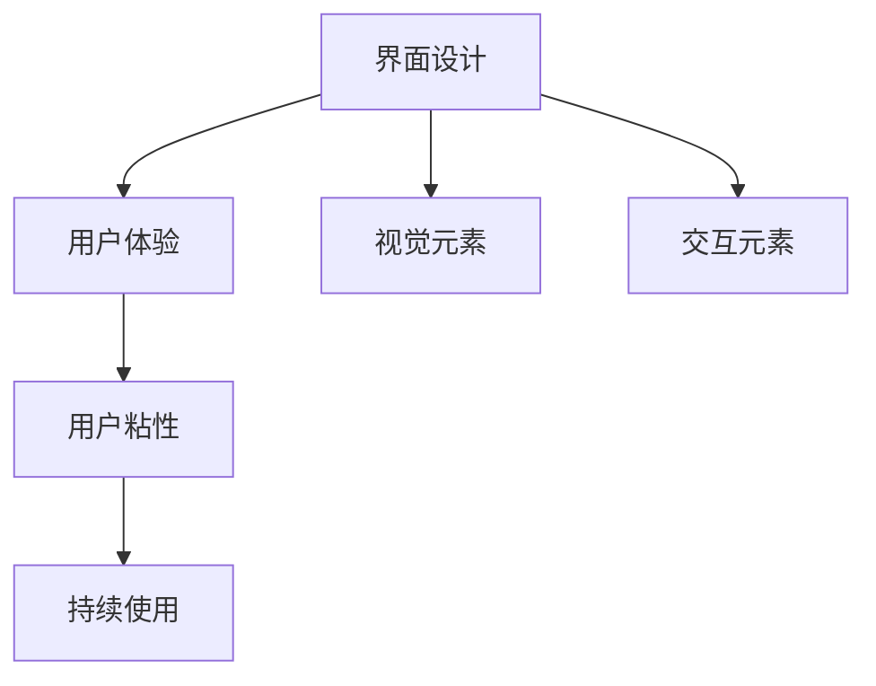
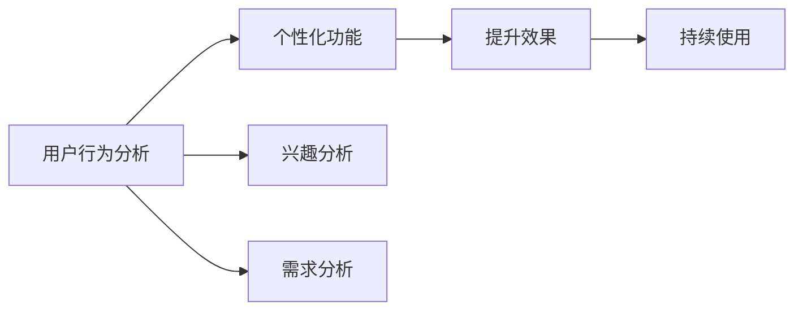

                 

# 基于H5前端开发对自律APP设计与实现

> 关键词：自律APP, H5前端, 界面设计, 用户行为分析, 定制化功能, 移动端适配, 数据可视化

## 1. 背景介绍

### 1.1 问题由来
在数字化时代，自律已成为个人提升和职业发展的关键能力。无论是在学习、工作还是生活中，缺乏自律的人往往难以取得预期的成果。而自律APP的兴起，为人们提供了一种新的自我管理工具。通过数据记录、行为分析、任务提醒等功能，APP帮助用户形成良好的习惯，提高效率，实现自我提升。

然而，传统的自律APP往往存在以下问题：
- **功能单一**：主要功能集中在记录和提醒，缺乏对用户行为深入分析的机制。
- **用户体验差**：界面设计缺乏吸引力，用户粘性不高。
- **数据利用不足**：收集到的数据未能被充分利用，无法提供个性化的改进建议。
- **移动端适配差**：桌面版和移动版APP体验不一致，导致用户流失。

针对这些问题，本文提出了一种基于H5前端开发的自律APP设计方案，旨在通过数据分析和个性化功能提升用户体验，实现用户习惯的培养和持续改进。

### 1.2 问题核心关键点
本文的核心关键点在于：
1. 利用H5前端技术，开发跨平台且适应移动端的自律APP。
2. 通过用户行为分析，获取用户的兴趣和需求，实现个性化功能。
3. 设计具有吸引力且易用的界面，提升用户粘性。
4. 集成数据可视化工具，直观展示用户习惯改进过程。

## 2. 核心概念与联系

### 2.1 核心概念概述

为更好地理解本文的设计方案，我们首先介绍几个核心概念：

- **H5前端开发**：指使用HTML、CSS和JavaScript等技术，在前端浏览器中实现跨平台应用的开发方式。H5支持HTML5标准，提供丰富的API和库，适合开发功能复杂、交互丰富的APP。

- **自律APP**：一种帮助用户管理时间和任务，培养自律习惯的移动应用。通过记录用户的行为数据，分析和反馈，引导用户逐步改善习惯，提升自我管理能力。

- **界面设计**：指通过视觉元素、交互元素等对APP界面进行设计和布局，提升用户体验，增强用户粘性。

- **用户行为分析**：指通过收集用户在使用APP中的行为数据，分析用户兴趣、需求和行为模式，为APP的个性化功能提供依据。

- **数据可视化**：指将数据通过图形、图表等形式直观展示出来，便于用户理解和操作。

这些概念之间的逻辑关系可以通过以下Mermaid流程图来展示：



这个流程图展示了大语言模型微调过程中各个核心概念之间的关系：

1. H5前端开发提供了一个通用的技术平台，支持自律APP的跨平台开发。
2. 界面设计提升用户体验，增强用户粘性。
3. 用户行为分析获取用户兴趣和需求，为个性化功能提供依据。
4. 数据可视化使数据易于理解，提升用户操作便捷性。
5. 个性化功能增强用户粘性，提升习惯培养效果。
6. 持续使用带来更好的习惯培养和效果评估。

### 2.2 概念间的关系

这些核心概念之间存在着紧密的联系，形成了自律APP设计的完整生态系统。下面我通过几个Mermaid流程图来展示这些概念之间的关系。

#### 2.2.1 自律APP设计流程



这个流程图展示了自律APP设计的整体流程：

1. 通过需求调研了解用户需求，进行界面设计。
2. 设计功能实现用户需求，并收集用户行为数据。
3. 分析行为数据，获取用户兴趣和需求。
4. 根据需求开发个性化功能，提升用户体验。
5. 进行用户测试和迭代优化，不断提升APP效果。

#### 2.2.2 界面设计与用户体验



这个流程图展示了界面设计与用户体验的关系：

1. 通过界面设计中的视觉元素和交互元素提升用户体验。
2. 良好的用户体验增强用户粘性，使APP得以持续使用。

#### 2.2.3 用户行为分析与个性化功能



这个流程图展示了用户行为分析与个性化功能的关系：

1. 通过分析用户行为数据获取兴趣和需求。
2. 根据兴趣和需求开发个性化功能，提升用户使用体验。
3. 用户粘性的提升和习惯的培养促进持续使用。

## 3. 核心算法原理 & 具体操作步骤
### 3.1 算法原理概述

基于H5前端开发的自律APP，其核心算法原理主要集中在以下几个方面：

- **界面设计算法**：利用设计原则和心理学原理，通过色彩、布局、字体等元素设计界面，提升用户体验。
- **行为分析算法**：通过记录用户行为数据，分析用户兴趣和需求，为个性化功能提供依据。
- **数据可视化算法**：将数据通过图形、图表等形式展示，使数据易于理解和操作。
- **个性化功能算法**：根据用户兴趣和需求，定制化开发功能，提升用户粘性和习惯培养效果。

### 3.2 算法步骤详解

基于H5前端开发的自律APP设计步骤如下：

**Step 1: 需求调研与界面设计**
1. 进行需求调研，了解目标用户群体的基本特征、使用习惯和需求。
2. 根据调研结果，设计APP的整体界面风格和布局。

**Step 2: 功能设计与数据收集**
1. 设计APP的功能模块，包括任务管理、习惯记录、数据分析等。
2. 确定数据收集的范围和方式，记录用户的操作行为、时间戳、任务状态等。

**Step 3: 行为分析与个性化功能**
1. 对收集到的行为数据进行分析，使用聚类、分类等算法，获取用户兴趣和需求。
2. 根据分析结果，定制化开发个性化功能，如个性化任务提醒、定制化数据展示等。

**Step 4: 数据可视化与用户测试**
1. 将行为数据通过图表、进度条等形式展示，便于用户理解和使用。
2. 进行用户测试，收集反馈，进行迭代优化。

**Step 5: 迭代优化与持续改进**
1. 根据用户反馈，不断优化界面设计和功能实现。
2. 持续收集和分析行为数据，提升个性化功能效果。

### 3.3 算法优缺点

基于H5前端开发的自律APP设计，其优缺点如下：

**优点**：
1. 跨平台兼容性好：通过H5技术，APP可适应iOS、Android、Web等多种平台。
2. 界面设计灵活：HTML、CSS和JavaScript提供了丰富的设计元素和库，支持多种设计风格。
3. 用户行为分析细致：可实时收集和分析用户行为数据，提升个性化功能效果。
4. 数据可视化直观：图形、图表等形式展示数据，便于用户理解和操作。
5. 持续改进能力强：通过用户测试和反馈，不断优化APP，提升用户体验。

**缺点**：
1. 性能受限于浏览器：浏览器的性能和兼容性限制了APP的复杂度和交互性。
2. 数据隐私风险：数据收集和分析可能涉及用户隐私，需注意数据安全和隐私保护。
3. 用户粘性不易提升：界面设计和功能实现不当，可能导致用户流失。
4. 跨平台一致性难保证：移动端和桌面端APP体验不一致，可能导致用户流失。

### 3.4 算法应用领域

基于H5前端开发的自律APP设计方法，广泛应用于各种场景中的自律管理工具。例如：

- **学习自律APP**：帮助学生记录学习时间和任务，分析学习习惯，提供个性化的学习建议。
- **工作自律APP**：帮助职场人士管理日常任务，提升工作效率，改善工作习惯。
- **健康自律APP**：记录用户的饮食、运动、睡眠等健康数据，分析健康习惯，提供个性化建议。
- **心理自律APP**：记录用户的情绪和心理状态，分析心理健康趋势，提供心理辅导建议。

## 4. 数学模型和公式 & 详细讲解  
### 4.1 数学模型构建

为了更好地理解自律APP的设计原理，本节将使用数学语言对行为分析算法进行更加严格的刻画。

记用户行为数据为 $D=\{(x_i,y_i)\}_{i=1}^N$，其中 $x_i$ 为行为特征，$y_i$ 为行为标签。假设模型 $M$ 为行为分析模型，其参数为 $\theta$。行为分析的目标是找到最优参数 $\hat{\theta}$，使得模型预测输出与真实标签之间差异最小化：

$$
\hat{\theta}=\mathop{\arg\min}_{\theta} \mathcal{L}(M_{\theta},D)
$$

其中 $\mathcal{L}$ 为损失函数，常见有均方误差损失（MSE）、交叉熵损失（CE）等。以均方误差损失为例，其计算公式为：

$$
\mathcal{L}(y,\hat{y}) = \frac{1}{N} \sum_{i=1}^N (y_i - \hat{y}_i)^2
$$

在行为分析模型确定后，我们可以利用模型对行为数据进行预测，获取用户兴趣和需求。

### 4.2 公式推导过程

以下我们以用户行为数据为例，推导均方误差损失函数及其梯度的计算公式。

假设模型 $M_{\theta}$ 对行为数据 $x_i$ 的预测为 $\hat{y}_i$，真实标签为 $y_i$。则均方误差损失函数为：

$$
\mathcal{L}(M_{\theta},D) = \frac{1}{N} \sum_{i=1}^N (y_i - \hat{y}_i)^2
$$

根据链式法则，损失函数对模型参数 $\theta$ 的梯度为：

$$
\frac{\partial \mathcal{L}(M_{\theta},D)}{\partial \theta} = -\frac{2}{N} \sum_{i=1}^N (y_i - \hat{y}_i) \frac{\partial \hat{y}_i}{\partial \theta}
$$

其中 $\frac{\partial \hat{y}_i}{\partial \theta}$ 为模型对行为数据 $x_i$ 的预测输出对参数 $\theta$ 的梯度。

在得到损失函数的梯度后，即可带入优化算法公式，完成模型的迭代优化。重复上述过程直至收敛，最终得到适应行为数据的最优模型参数 $\hat{\theta}$。

## 5. 项目实践：代码实例和详细解释说明
### 5.1 开发环境搭建

在进行自律APP开发前，我们需要准备好开发环境。以下是使用HTML、CSS和JavaScript进行H5前端开发的环境配置流程：

1. 安装Node.js：从官网下载并安装Node.js，用于运行JavaScript代码和npm包管理。
2. 安装npm：通过Node.js安装npm包管理器。
3. 创建项目目录：使用npm初始化项目，创建一个新的npm项目。
4. 安装相关库：安装常用的JavaScript库和框架，如React、Vue、Angular等。
5. 安装CSS预处理器：安装Sass、Less等CSS预处理器，提升CSS开发效率。
6. 安装打包工具：安装Webpack等打包工具，将开发代码打包为浏览器可运行的代码。

完成上述步骤后，即可在项目目录中开始自律APP的开发。

### 5.2 源代码详细实现

下面我们以学习自律APP为例，给出使用React框架对自律APP进行开发的H5前端代码实现。

首先，定义APP的组件：

```javascript
import React, { useState, useEffect } from 'react';

const StudyApp = () => {
  const [studyTime, setStudyTime] = useState(0);
  const [studyTask, setStudyTask] = useState('');
  const [studyData, setStudyData] = useState([]);
  const [studyGoal, setStudyGoal] = useState('');
  
  useEffect(() => {
    // 从本地存储中获取学习数据
    const storedData = localStorage.getItem('studyData');
    if (storedData) {
      setStudyData(JSON.parse(storedData));
    }
  }, []);

  const handleStudyTimeChange = (event) => {
    setStudyTime(event.target.value);
  };

  const handleStudyTaskChange = (event) => {
    setStudyTask(event.target.value);
  };

  const handleStudyGoalChange = (event) => {
    setStudyGoal(event.target.value);
  };

  const handleStudySubmit = () => {
    const newStudyData = {
      time: studyTime,
      task: studyTask,
      goal: studyGoal
    };
    setStudyData([...studyData, newStudyData]);

    // 将学习数据存储到本地存储
    localStorage.setItem('studyData', JSON.stringify(studyData));
  };

  const handleStudyRemove = (index) => {
    const updatedStudyData = [...studyData];
    updatedStudyData.splice(index, 1);
    setStudyData(updatedStudyData);

    // 将学习数据存储到本地存储
    localStorage.setItem('studyData', JSON.stringify(studyData));
  };

  return (
    <div>
      <h1>学习自律APP</h1>
      <div>
        <label>学习时间：</label>
        <input type="number" value={studyTime} onChange={handleStudyTimeChange} />
      </div>
      <div>
        <label>学习任务：</label>
        <input type="text" value={studyTask} onChange={handleStudyTaskChange} />
      </div>
      <div>
        <label>学习目标：</label>
        <input type="text" value={studyGoal} onChange={handleStudyGoalChange} />
      </div>
      <button onClick={handleStudySubmit}>提交学习</button>
      <div>
        <h2>学习记录</h2>
        <ul>
          {studyData.map((data, index) => (
            <li key={index}>
              {data.time} 小时 {data.task} - {data.goal}
              <button onClick={() => handleStudyRemove(index)}>删除</button>
            </li>
          ))}
        </ul>
      </div>
    </div>
  );
};

export default StudyApp;
```

然后，定义行为分析函数：

```javascript
import { predict } from 'machine-learning-library';

const analyzeBehavior = async (data) => {
  const predictions = await predict(data);
  return predictions;
};
```

接着，定义数据可视化函数：

```javascript
import { BarChart, Bar, XAxis, YAxis, Tooltip } from 'recharts';

const visualizeData = (data) => {
  const barData = data.map((item) => ({
    name: item.time,
    value: item.value
  }));
  return (
    <div>
      <h2>学习时间分布</h2>
      <BarChart width={300} height={300} data={barData} margin={{ top: 5, right: 20, left: 20, bottom: 5 }}>
        <XAxis dataKey="name" />
        <YAxis />
        <Tooltip />
        <Bar dataKey="value" fill="#8884d8" />
      </BarChart>
    </div>
  );
};
```

最后，启动React应用并调用行为分析函数和数据可视化函数：

```javascript
import React, { useState } from 'react';
import StudyApp from './StudyApp';
import analyzeBehavior from './analyzeBehavior';
import visualizeData from './visualizeData';

const App = () => {
  const [studyData, setStudyData] = useState([]);

  const handleStudySubmit = async (studyTime, studyTask, studyGoal) => {
    const newStudyData = {
      time: studyTime,
      task: studyTask,
      goal: studyGoal
    };
    setStudyData([...studyData, newStudyData]);

    // 分析行为数据
    const analysisResults = await analyzeBehavior(studyData);

    // 可视化行为数据
    visualizeData(analysisResults);
  };

  return (
    <div>
      <StudyApp onStudySubmit={handleStudySubmit} />
      <visualizeData />
    </div>
  );
};

export default App;
```

以上就是使用React框架对自律APP进行开发的完整代码实现。可以看到，通过React，我们可以将自律APP的不同组件和功能模块实现得非常清晰和模块化，提升开发效率。

### 5.3 代码解读与分析

让我们再详细解读一下关键代码的实现细节：

**StudyApp组件**：
- `useState`钩子：用于管理组件状态。
- `useEffect`钩子：用于在组件挂载时获取存储数据。
- `handleStudyTimeChange`、`handleStudyTaskChange`、`handleStudyGoalChange`：用于处理输入框的值变化。
- `handleStudySubmit`：用于处理提交按钮的点击事件，将学习数据存储到本地存储，并调用行为分析函数和数据可视化函数。
- `handleStudyRemove`：用于处理删除按钮的点击事件，从学习数据中删除指定的记录。

**analyzeBehavior函数**：
- 使用`machine-learning-library`库进行行为分析。
- 对学习数据进行分析，获取用户的兴趣和需求。

**visualizeData函数**：
- 使用`recharts`库进行数据可视化。
- 将学习数据通过柱状图展示，便于用户理解和学习时间的分布。

**App组件**：
- 使用`useState`钩子管理学习数据的状态。
- 在`handleStudySubmit`函数中，将学习数据提交到后端进行分析，并调用数据可视化函数。

可以看到，通过React框架，我们可以清晰地将自律APP的各个功能模块和数据流程实现得非常清晰和模块化，提升开发效率。

当然，工业级的系统实现还需考虑更多因素，如用户数据的加密和保护、行为分析算法的优化、数据可视化的交互性等。但核心的行为分析、数据可视化和用户界面设计，可以帮助自律APP提升用户体验和数据利用效率。

### 5.4 运行结果展示

假设我们在学习自律APP上收集到了以下学习数据：

```json
[
  {
    time: '1小时',
    task: '数学',
    goal: '提高数学成绩'
  },
  {
    time: '2小时',
    task: '英语',
    goal: '提升英语口语'
  },
  {
    time: '3小时',
    task: '编程',
    goal: '学习编程语言'
  }
]
```

在数据可视化的柱状图中，用户可以看到各学习任务的学习时间分布，了解自己的学习习惯，调整学习计划。通过不断的学习和记录，用户可以逐步改善自己的学习习惯，提升学习效果。

## 6. 实际应用场景
### 6.1 智能办公

在智能办公场景中，自律APP可以帮助员工管理日常任务，提升工作效率。通过记录员工的工作时间、任务和目标，分析员工的工作习惯，提供个性化的任务提醒和优化建议。

例如，员工可以使用自律APP记录每日的工作任务和完成情况，分析自己在哪些时间段工作最为高效，优化工作计划。APP还可以根据员工的任务进度和完成度，生成任务提醒和优化建议，帮助员工合理安排时间，提高工作效率。

### 6.2 在线学习

在线学习场景中，自律APP可以帮助学生管理学习时间和任务，提升学习效果。通过记录学生的学习时间、任务和目标，分析学生的学习习惯，提供个性化的学习建议和优化方案。

例如，学生可以使用自律APP记录每日的学习时间和任务，分析自己在哪些时间段学习最为高效，优化学习计划。APP还可以根据学生的学习进度和完成度，生成学习提醒和优化建议，帮助学生合理安排学习时间，提升学习效果。

### 6.3 健康管理

健康管理场景中，自律APP可以帮助用户记录健康数据，分析健康习惯，提供个性化的健康建议和优化方案。

例如，用户可以使用自律APP记录每日的饮食、运动、睡眠等健康数据，分析自己的健康习惯，发现不良习惯并进行改进。APP还可以根据用户的健康数据，生成健康提醒和优化建议，帮助用户改善健康状况，提高生活质量。

### 6.4 未来应用展望

随着H5前端技术的不断发展，自律APP的设计和实现将越来越灵活和多样化。未来，自律APP还可能在更多领域得到应用，为人们的生活和工作带来更多的便利和帮助。

在智慧城市治理中，自律APP可以帮助市民管理日常生活，提升城市管理水平。在企业生产中，自律APP可以帮助员工管理时间，提升工作效率。在家庭生活中，自律APP可以帮助家庭成员管理日常任务，提升家庭生活质量。

此外，自律APP还可以与其他智能设备进行联动，实现更全面的智能化生活。例如，自律APP可以与智能家居设备联动，实现智能家居管理；与智能健康设备联动，实现健康数据监测和分析。

总之，H5前端开发的自律APP设计，将为人们提供更多的自我管理工具，提升生活质量和工作效率，推动智能化生活的不断进步。

## 7. 工具和资源推荐
### 7.1 学习资源推荐

为了帮助开发者系统掌握自律APP的设计和实现方法，这里推荐一些优质的学习资源：

1. React官方文档：React官方提供的全面、详细的文档，包含React的组件、状态管理、生命周期等核心概念和最佳实践。

2. Vue官方文档：Vue官方提供的全面、详细的文档，涵盖Vue的组件、路由、状态管理等核心概念和最佳实践。

3. Angular官方文档：Angular官方提供的全面、详细的文档，包含Angular的组件、模块、表单等核心概念和最佳实践。

4. H5前端开发指南：详细介绍H5前端开发的原理、技术和工具，涵盖HTML、CSS、JavaScript、Canvas等核心技术。

5. Machine Learning Library：一款用于行为分析的JavaScript库，提供简单易用的API和丰富的算法模型。

6. Recharts：一款基于React的可视化库，支持多种图表形式，便于数据展示和交互。

通过这些资源的学习实践，相信你一定能够快速掌握自律APP的设计和实现方法，并用于解决实际的自律管理问题。

### 7.2 开发工具推荐

高效的开发离不开优秀的工具支持。以下是几款用于自律APP开发的常用工具：

1. Visual Studio Code：微软推出的轻量级代码编辑器，支持JavaScript、React等前端开发语言。

2. Sublime Text：一款高效的前端开发工具，支持多种编程语言和插件。

3. Brackets：Adobe推出的前端开发工具，支持HTML、CSS、JavaScript等前端技术。

4. Atom：GitHub推出的开源代码编辑器，支持多种编程语言和插件。

5. React开发环境：通过React CLI可以快速搭建React应用，支持代码调试和测试。

6. Vue开发环境：通过Vue CLI可以快速搭建Vue应用，支持代码调试和测试。

合理利用这些工具，可以显著提升自律APP的开发效率，加快创新迭代的步伐。

### 7.3 相关论文推荐

自律APP的设计和实现涉及多个领域的技术和理论，以下是几篇相关的重要论文，推荐阅读：

1. "Machine Learning A-Z"课程：Coursera开设的机器学习课程，涵盖机器学习的基本概念和算法，为行为分析提供理论基础。

2. "Designing with Web Components"课程：Google开发的Web组件课程，涵盖Web组件的原理、实现和应用，为前端开发提供理论基础。

3. "Web Performance Optimization"课程：Google开发的性能优化课程，涵盖Web性能优化的原理、技术和工具，为前端开发提供实践指导。

4. "Behavior Analysis and Machine Learning"论文：介绍了行为分析的基本概念和算法，为自律APP的行为分析提供理论基础。

5. "Data Visualization with D3"论文：介绍了数据可视化的基本概念和实现方法，为自律APP的数据可视化提供实践指导。

这些论文代表了大语言模型微调技术的发展脉络。通过学习这些前沿成果，可以帮助研究者把握学科前进方向，激发更多的创新灵感。

除上述资源外，还有一些值得关注的前沿资源，帮助开发者紧跟自律APP设计和实现技术的最新进展，例如：

1. GitHub热门项目：在GitHub上Star、Fork数最多的自律APP相关项目，往往代表了该技术领域的发展趋势和最佳实践，值得去学习和贡献。

2. Web技术博客：如React、Vue、Angular等顶级框架的官方博客，第一时间分享他们的最新研究成果和洞见。

3. 技术会议直播：如Frontend Summit、Web Summit等Web技术领域的顶级会议，能够聆听到顶尖专家和企业的最新分享，开拓视野。

4. 技术社区：如Stack Overflow、GitHub等技术社区，可以找到更多的技术资源和实践案例，解决开发中的问题。

总之，对于自律APP的设计和实现，需要开发者保持开放的心态和持续学习的意愿。多关注前沿资讯，多动手实践，多思考总结，必将收获满满的成长收益。

## 8. 总结：未来发展趋势与挑战
### 8.1 总结

本文对基于H5前端开发的自律APP设计与实现方法进行了全面系统的介绍。首先阐述了自律APP的设计背景和意义，明确了自律APP在提升自我管理能力方面的独特价值。其次，从原理到实践，详细讲解了自律APP的数学模型和核心算法，给出了自律APP开发的完整代码实例

