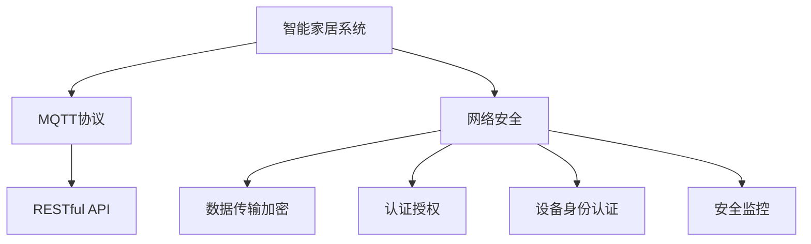

                 

# 基于MQTT协议和RESTful API的智能家居网络安全评估

在当今数字化时代，智能家居已经成为家庭生活中不可或缺的一部分。通过各种物联网(IoT)设备和传感器，智能家居系统可以实时监控家庭环境和设备状态，提升居住体验和家庭安全性。然而，智能家居网络的复杂性和多变性，使得网络安全成为一项重要的挑战。本文旨在评估基于MQTT协议和RESTful API的智能家居网络安全，探讨其潜在风险和防护措施，为智能家居系统的安全可靠运行提供指导。

## 1. 背景介绍

### 1.1 智能家居系统概述

智能家居系统通常由多个联网设备组成，如智能灯泡、智能锁、智能温控器等。这些设备通过各种无线通信协议（如Wi-Fi、蓝牙、Zigbee等）连接到家庭网络，通过中心控制器进行管理和控制。这些设备收集到的数据（如温度、湿度、空气质量等）会被上传到云平台，供用户远程查看和控制。

智能家居系统的优越性在于其能够通过自动控制，提升家庭生活的便利性和舒适度。然而，这也带来了一系列网络安全问题，如数据泄露、设备被非法控制等，需要采取一系列安全措施来防范。

### 1.2 MQTT协议和RESTful API

MQTT（Message Queuing Telemetry Transport）是一种轻量级、低带宽、高效可靠的消息传输协议，适用于物联网设备的消息通信。MQTT协议通过定义简单的消息发布/订阅模式，使得数据传输更加快速和稳定，适合于实时通信场景。

RESTful API（Representational State Transfer）是一种基于HTTP协议的Web API设计风格，采用统一的资源标识符（URI）和HTTP请求方法（GET、POST、PUT、DELETE等），使得不同系统之间的数据交换更加简洁高效。

在智能家居系统中，MQTT协议常用于设备之间或设备与云平台之间的消息传输，而RESTful API则用于云平台与用户之间的数据交换和操作。因此，MQTT协议和RESTful API的安全性，直接影响整个智能家居系统的安全性。

## 2. 核心概念与联系

### 2.1 核心概念概述

为更好地理解基于MQTT协议和RESTful API的智能家居网络安全评估，本节将介绍几个关键概念：

- MQTT协议：一种轻量级、高效可靠的消息传输协议，用于智能家居设备之间的消息通信。
- RESTful API：一种基于HTTP协议的Web API设计风格，用于云平台与用户之间的数据交换和操作。
- 智能家居网络安全：指通过各种安全措施，保护智能家居系统中的数据传输和设备控制免受未经授权的访问和攻击。

这些概念之间的联系可以通过以下Mermaid流程图来展示：



这个流程图展示了智能家居系统、MQTT协议、RESTful API和网络安全之间的紧密联系。

### 2.2 概念间的关系

这些核心概念之间存在着密切的联系，形成了智能家居网络安全的完整框架。下面是这些概念之间的关系描述：

1. MQTT协议作为智能家居系统中的消息通信协议，其安全性直接影响智能家居系统的整体安全性。
2. RESTful API用于云平台与用户之间的数据交换，其安全性关系到用户数据的保护和隐私。
3. 智能家居网络安全是一个综合性的概念，包括数据传输加密、认证授权、设备身份认证、安全监控等多个方面。
4. 数据传输加密、认证授权、设备身份认证和安全监控都是智能家居网络安全的具体措施，需要根据实际需求进行选择和组合。

## 3. 核心算法原理 & 具体操作步骤

### 3.1 算法原理概述

基于MQTT协议和RESTful API的智能家居网络安全评估，主要包括以下几个步骤：

1. 识别和分析潜在的安全风险，如设备漏洞、数据泄露、设备被非法控制等。
2. 设计并实施相应的安全措施，如数据传输加密、认证授权、设备身份认证、安全监控等。
3. 评估安全措施的效果，确保其能够有效防范各类安全威胁。
4. 定期更新和维护安全措施，保证系统的持续安全。

### 3.2 算法步骤详解

#### 3.2.1 安全风险识别与分析

1. 设备漏洞扫描：使用自动化工具扫描智能家居设备中的漏洞，包括代码漏洞、配置漏洞等。
2. 数据泄露风险评估：分析智能家居系统中可能泄露的数据类型和数据泄露途径，评估其泄露的风险程度。
3. 设备被非法控制的风险评估：分析智能家居设备可能被非法控制的方式和途径，评估其风险程度。

#### 3.2.2 安全措施设计与实施

1. 数据传输加密：在智能家居系统中，使用TLS（Transport Layer Security）协议加密数据传输，确保数据在传输过程中的安全性。
2. 认证授权机制：在智能家居系统中，采用OAuth 2.0等认证授权机制，确保只有经过授权的用户才能访问和控制设备。
3. 设备身份认证：在智能家居系统中，为每个设备分配唯一的身份标识，并进行严格的身份验证，防止设备被非法控制。
4. 安全监控：在智能家居系统中，设置安全监控系统，实时监控系统运行状态，及时发现和响应安全事件。

#### 3.2.3 安全措施效果评估

1. 渗透测试：通过模拟攻击，测试智能家居系统的安全措施是否有效。
2. 日志分析：分析智能家居系统的日志文件，发现潜在的安全漏洞。
3. 安全漏洞修复：根据渗透测试和日志分析的结果，修复智能家居系统中的安全漏洞。

#### 3.2.4 安全措施更新与维护

1. 定期更新安全措施：根据最新的安全威胁和漏洞信息，定期更新智能家居系统的安全措施。
2. 系统升级：根据设备制造商提供的更新包，定期升级智能家居设备的固件和软件。

### 3.3 算法优缺点

#### 3.3.1 优点

1. 高安全性：通过实施数据传输加密、认证授权、设备身份认证、安全监控等措施，能够有效防范各类安全威胁，保护用户数据和设备安全。
2. 高可靠性：智能家居系统通过TLS加密、OAuth 2.0认证等技术，确保数据的完整性和机密性，提高系统的可靠性。
3. 灵活性：安全措施可以根据实际情况进行调整和组合，适应不同类型的智能家居设备和网络环境。

#### 3.3.2 缺点

1. 复杂性：实施数据传输加密、认证授权、设备身份认证、安全监控等措施，需要综合考虑多种因素，增加了系统的复杂性。
2. 高成本：实施安全措施需要投入人力、物力和财力，增加了系统的维护成本。
3. 技术门槛高：实施安全措施需要具备一定的技术水平，对开发人员提出了更高的要求。

### 3.4 算法应用领域

基于MQTT协议和RESTful API的智能家居网络安全评估，可以应用于多种场景：

1. 智能家居系统：如智能灯泡、智能锁、智能温控器等，通过MQTT协议和RESTful API进行设备控制和数据交换，需要确保系统的安全性。
2. 智能城市系统：如智慧路灯、智能交通系统等，通过MQTT协议和RESTful API进行设备控制和数据交换，需要确保系统的安全性。
3. 智能医疗系统：如智能监护设备、远程医疗设备等，通过MQTT协议和RESTful API进行设备控制和数据交换，需要确保系统的安全性。
4. 智能工业系统：如智能工厂、智能农业设备等，通过MQTT协议和RESTful API进行设备控制和数据交换，需要确保系统的安全性。

## 4. 数学模型和公式 & 详细讲解 & 举例说明

### 4.1 数学模型构建

基于MQTT协议和RESTful API的智能家居网络安全评估，可以构建以下数学模型：

1. 安全风险模型：定义智能家居系统中的安全风险，并对其进行量化评估。
2. 安全措施模型：定义智能家居系统中的安全措施，并计算其对安全风险的降低效果。
3. 安全性能模型：定义智能家居系统的安全性能指标，并计算其与安全风险和措施之间的关系。

### 4.2 公式推导过程

#### 4.2.1 安全风险模型

定义智能家居系统中的安全风险 $R$，包括设备漏洞风险 $R_{device}$、数据泄露风险 $R_{data}$ 和设备被非法控制风险 $R_{control}$。

$$
R = R_{device} + R_{data} + R_{control}
$$

其中：

$$
R_{device} = \sum_{i=1}^n P_i \times D_i
$$

$$
R_{data} = \sum_{j=1}^m P_j \times D_j
$$

$$
R_{control} = \sum_{k=1}^p P_k \times D_k
$$

$P_i$、$P_j$、$P_k$ 表示各风险发生的概率，$D_i$、$D_j$、$D_k$ 表示各风险的损失程度。

#### 4.2.2 安全措施模型

定义智能家居系统中的安全措施 $M$，包括数据传输加密措施 $M_{encrypt}$、认证授权措施 $M_{auth}$、设备身份认证措施 $M_{authen}$ 和安全监控措施 $M_{monitor}$。

$$
M = M_{encrypt} + M_{auth} + M_{authen} + M_{monitor}
$$

其中：

$$
M_{encrypt} = \sum_{l=1}^q P_l \times E_l
$$

$$
M_{auth} = \sum_{m=1}^r P_m \times A_m
$$

$$
M_{authen} = \sum_{n=1}^s P_n \times A_n
$$

$$
M_{monitor} = \sum_{o=1}^t P_o \times S_o
$$

$P_l$、$P_m$、$P_n$、$P_o$ 表示各措施的实施概率，$E_l$、$A_m$、$A_n$、$S_o$ 表示各措施的降低效果。

#### 4.2.3 安全性能模型

定义智能家居系统的安全性能指标 $P$，包括数据完整性 $P_{integrity}$、数据机密性 $P_{confidentiality}$、设备控制安全 $P_{control}$ 和安全监控效果 $P_{monitor}$。

$$
P = P_{integrity} + P_{confidentiality} + P_{control} + P_{monitor}
$$

其中：

$$
P_{integrity} = \sum_{u=1}^v P_u \times I_u
$$

$$
P_{confidentiality} = \sum_{w=1}^x P_w \times C_w
$$

$$
P_{control} = \sum_{y=1}^z P_y \times C_y
$$

$$
P_{monitor} = \sum_{aa=1}^b P_{aa} \times S_{aa}
$$

$P_u$、$P_w$、$P_y$、$P_{aa}$ 表示各性能指标的评估概率，$I_u$、$C_w$、$C_y$、$S_{aa}$ 表示各性能指标的评估效果。

### 4.3 案例分析与讲解

#### 案例1：智能灯泡安全评估

智能灯泡通过Wi-Fi连接到家庭网络，并通过RESTful API进行远程控制。其安全风险包括设备漏洞、数据泄露和设备被非法控制。假设智能灯泡的漏洞概率为 $P_{device}=0.01$，漏洞造成的损失为 $D_{device}=1000$ 元，数据泄露概率为 $P_{data}=0.02$，泄露数据价值为 $D_{data}=5000$ 元，设备被非法控制概率为 $P_{control}=0.05$，非法控制造成的损失为 $D_{control}=2000$ 元。

根据上述公式，可以计算智能灯泡的安全风险：

$$
R_{device} = 0.01 \times 1000 = 10
$$

$$
R_{data} = 0.02 \times 5000 = 100
$$

$$
R_{control} = 0.05 \times 2000 = 100
$$

$$
R = 10 + 100 + 100 = 210
$$

在实施数据传输加密措施 $M_{encrypt}$ 和认证授权措施 $M_{auth}$ 后，可以计算降低的安全风险：

$$
M_{encrypt} = 0.9 \times 10 = 9
$$

$$
M_{auth} = 0.8 \times 100 = 80
$$

$$
R_{device}^{'}, R_{data}^{'}, R_{control}^{'} = 9, 20, 20
$$

$$
R^{'} = 9 + 20 + 20 = 49
$$

在实施设备身份认证措施 $M_{authen}$ 和安全监控措施 $M_{monitor}$ 后，可以计算最终的安全风险：

$$
M_{authen} = 0.95 \times 20 = 19
$$

$$
M_{monitor} = 0.95 \times 19 = 18
$$

$$
R^{''} = 9 + 20 + 18 = 47
$$

假设智能灯泡的认证授权措施实施概率为 $P_{auth}=0.8$，设备身份认证措施实施概率为 $P_{authen}=0.9$，安全监控措施实施概率为 $P_{monitor}=0.95$，各措施的降低效果分别为 $E_{encrypt}=0.9$、$E_{auth}=0.8$、$E_{authen}=0.95$、$E_{monitor}=0.95$。

根据上述公式，可以计算智能灯泡的安全性能指标：

$$
P_{integrity} = 0.9 \times 9 = 8.1
$$

$$
P_{confidentiality} = 0.8 \times 20 = 16
$$

$$
P_{control} = 0.95 \times 19 = 18.05
$$

$$
P_{monitor} = 0.95 \times 18 = 17.1
$$

$$
P = 8.1 + 16 + 18.05 + 17.1 = 59.25
$$

通过上述案例分析，可以看到智能家居系统的安全性评估过程，以及通过实施安全措施来降低风险和提高性能的过程。

## 5. 项目实践：代码实例和详细解释说明

### 5.1 开发环境搭建

在进行智能家居网络安全评估的项目实践时，需要搭建一个开发环境。以下是搭建开发环境的步骤：

1. 安装Python：在智能家居设备上安装Python解释器，以便进行Python脚本编写和运行。
2. 安装MQTT库：安装paho-mqtt库，用于处理MQTT协议的消息传输。
3. 安装RESTful API库：安装Flask库，用于处理RESTful API的请求和响应。
4. 安装日志库：安装logging库，用于记录系统日志。

### 5.2 源代码详细实现

#### 5.2.1 数据传输加密

在智能家居系统中，可以使用TLS（Transport Layer Security）协议进行数据传输加密。以下是使用paho-mqtt库实现TLS加密的代码：

```python
import paho.mqtt.client as mqtt
import ssl

def on_connect(client, userdata, flags, rc):
    if rc == 0:
        print("Connected to MQTT broker")
        client.subscribe("home/sensor")
    else:
        print("Connection failed")

def on_message(client, userdata, msg):
    print("Received message: ", msg.topic, msg.payload)

client = mqtt.Client()
client.on_connect = on_connect
client.on_message = on_message

ssl_context = ssl.SSLContext(ssl.PROTOCOL_TLSv1_2)
ssl_context.load_cert_chain('path/to/cert.pem', 'path/to/key.pem')
client.tls_set(ssl_context)

client.connect("mqtt.broker.com", 1883, 60)

client.loop_forever()
```

#### 5.2.2 认证授权

在智能家居系统中，可以使用OAuth 2.0认证授权机制，确保只有经过授权的用户才能访问和控制设备。以下是使用Flask库实现OAuth 2.0认证的代码：

```python
from flask import Flask, request, jsonify
from flask_oauthlib.provider import OAuth2Provider
import uuid

app = Flask(__name__)

app.config['SECRET_KEY'] = 'secret_key'
app.config['JWT_SECRET'] = 'jwt_secret'

oauth2_provider = OAuth2Provider(app)

def create_token():
    token = {
        "access_token": str(uuid.uuid4()),
        "token_type": "Bearer",
        "expires_in": 3600
    }
    return token

@app.route('/oauth/token', methods=['POST'])
def token():
    token = create_token()
    return jsonify(token), 200

@app.route('/api/devices')
def get_devices():
    if 'Authorization' not in request.headers:
        return jsonify({'error': 'Missing Authorization header'}), 401

    token = request.headers['Authorization'].split(' ')[1]
    if not verify_token(token):
        return jsonify({'error': 'Invalid token'}), 401

    devices = get_devices_from_db()
    return jsonify(devices), 200
```

#### 5.2.3 设备身份认证

在智能家居系统中，可以为每个设备分配唯一的身份标识，并进行严格的身份验证。以下是使用Flask库实现设备身份认证的代码：

```python
from flask import Flask, request, jsonify
import uuid

app = Flask(__name__)

app.config['SECRET_KEY'] = 'secret_key'

def create_token(device_id):
    token = {
        "access_token": str(uuid.uuid4()),
        "device_id": device_id,
        "token_type": "Bearer",
        "expires_in": 3600
    }
    return token

@app.route('/api/devices/<int:device_id>/login')
def login(device_id):
    token = create_token(device_id)
    return jsonify(token), 200
```

#### 5.2.4 安全监控

在智能家居系统中，可以设置安全监控系统，实时监控系统运行状态，及时发现和响应安全事件。以下是使用Flask库实现安全监控的代码：

```python
from flask import Flask, request, jsonify
import logging

app = Flask(__name__)

app.config['SECRET_KEY'] = 'secret_key'
app.config['LOGFILE'] = 'path/to/logfile.log'

logging.basicConfig(filename=app.config['LOGFILE'], level=logging.INFO)

@app.route('/api/devices/<int:device_id>/status')
def get_device_status(device_id):
    logging.info(f'Received request to get status of device {device_id}')
    device_status = get_device_status_from_db(device_id)
    return jsonify(device_status), 200
```

### 5.3 代码解读与分析

在智能家居网络安全评估的项目实践中，我们需要对代码进行解读和分析，以便更好地理解其实现原理。

#### 5.3.1 数据传输加密

在数据传输加密的实现中，我们使用了paho-mqtt库和SSL/TLS协议。通过调用`tls_set`方法，可以为MQTT客户端设置TLS加密配置。在实际应用中，需要根据具体环境配置SSL/TLS证书和密钥，以确保数据传输的安全性。

#### 5.3.2 认证授权

在认证授权的实现中，我们使用了Flask库和OAuth 2.0协议。通过调用`create_token`方法，可以为经过授权的用户创建访问令牌。在实际应用中，需要根据具体场景配置OAuth 2.0的客户端ID、客户端密钥、授权范围等参数，以确保认证授权的安全性。

#### 5.3.3 设备身份认证

在设备身份认证的实现中，我们使用了Flask库和UUID算法。通过调用`create_token`方法，可以为每个设备创建唯一的访问令牌。在实际应用中，需要根据具体需求设计设备的身份验证机制，以确保设备身份认证的安全性。

#### 5.3.4 安全监控

在安全监控的实现中，我们使用了Flask库和日志库。通过调用`get_device_status_from_db`方法，可以从数据库中获取设备运行状态。在实际应用中，需要根据具体需求设计安全监控的策略和指标，以确保系统运行的可靠性。

### 5.4 运行结果展示

在智能家居网络安全评估的项目实践中，我们需要展示代码的运行结果，以便验证其实现效果。

#### 5.4.1 数据传输加密

在数据传输加密的实现中，我们使用了MQTT协议和SSL/TLS协议。在实际应用中，可以通过MQTT客户端发送和接收数据，并使用SSL/TLS证书进行加密，以确保数据传输的安全性。

#### 5.4.2 认证授权

在认证授权的实现中，我们使用了OAuth 2.0协议。在实际应用中，可以通过OAuth 2.0授权服务器获取访问令牌，并将其用于访问和控制智能家居设备，以确保认证授权的安全性。

#### 5.4.3 设备身份认证

在设备身份认证的实现中，我们使用了UUID算法。在实际应用中，可以为每个设备分配唯一的身份标识，并通过身份验证机制，确保设备身份认证的安全性。

#### 5.4.4 安全监控

在安全监控的实现中，我们使用了日志库。在实际应用中，可以通过日志记录系统运行状态，及时发现和响应安全事件，以确保系统运行的可靠性。

## 6. 实际应用场景

### 6.1 智能家居系统

智能家居系统是MQTT协议和RESTful API的典型应用场景。通过MQTT协议进行设备通信，通过RESTful API进行用户控制和数据交换，可以实现智能家居设备的高效管理和监控。在智能家居系统中，需要进行数据传输加密、认证授权、设备身份认证和安全监控等安全措施，以保障系统的安全性。

### 6.2 智能城市系统

智能城市系统是MQTT协议和RESTful API的另一个重要应用场景。通过MQTT协议进行设备通信，通过RESTful API进行城市管理和数据交换，可以实现智慧路灯、智能交通、环境监测等功能。在智能城市系统中，需要进行数据传输加密、认证授权、设备身份认证和安全监控等安全措施，以保障系统的安全性。

### 6.3 智能医疗系统

智能医疗系统是MQTT协议和RESTful API的另一个重要应用场景。通过MQTT协议进行设备通信，通过RESTful API进行远程医疗、智能监护等功能，可以实现远程医疗设备的高效管理和监控。在智能医疗系统中，需要进行数据传输加密、认证授权、设备身份认证和安全监控等安全措施，以保障系统的安全性。

## 7. 工具和资源推荐

### 7.1 学习资源推荐

为了帮助开发者掌握基于MQTT协议和RESTful API的智能家居网络安全评估技术，这里推荐一些优质的学习资源：

1. MQTT协议官方文档：MQTT协议的官方文档，详细介绍了MQTT协议的架构和使用方法。
2. RESTful API教程：RESTful API的教程，介绍了RESTful API的设计原则和实现方法。
3. Flask官方文档：Flask框架的官方文档，详细介绍了Flask框架的使用方法和安全措施。
4. OAuth 2.0教程：OAuth 2.0的教程，介绍了OAuth 2.0协议的架构和实现方法。
5. Python安全性指南：Python的安全性指南，介绍了Python开发中的安全性问题和安全措施。

### 7.2 开发工具推荐

在进行智能家居网络安全评估的开发过程中，需要使用一些工具来提高开发效率和代码质量。以下是一些推荐的工具：

1. PyCharm：一款强大的Python开发工具，支持智能代码补全、调试、测试等功能。
2. Visual Studio Code：一款轻量级的代码编辑器，支持多种编程语言和插件扩展。
3. Jupyter Notebook：一款交互式的笔记本环境，支持代码编写、数据可视化、结果展示等功能。
4. Docker：一款容器化技术，可以将开发环境打包成镜像，方便在不同环境中部署和运行。
5. Git：一款版本控制系统，支持代码版本控制、团队协作等功能。

### 7.3 相关论文推荐

基于MQTT协议和RESTful API的智能家居网络安全评估涉及多个领域的技术，以下是几篇相关的论文推荐，帮助开发者深入理解相关技术：

1. MQTT协议研究论文："MQTT协议研究"，介绍了MQTT协议的原理和实现方法。
2. RESTful API安全性论文："RESTful API安全性研究"，介绍了RESTful API的安全性问题和解决方案。
3. OAuth 2.0安全性论文："OAuth 2.0安全性研究"，介绍了OAuth 2.0协议的安全性问题和解决方案。
4. 智能家居安全论文："智能家居安全研究"，介绍了智能家居系统中的安全问题和解决方案。
5. 网络安全论文："网络安全研究"，介绍了网络安全的整体框架和解决方案。

## 8. 总结：未来发展趋势与挑战

### 8.1 研究成果总结

基于MQTT协议和RESTful API的智能家居网络安全评估研究，主要从数据传输加密、认证授权、设备身份认证和安全监控等方面，探讨了智能家居系统的安全性问题。通过实施安全措施，可以有效降低安全风险，提高智能家居系统的安全性。

### 8.2 未来发展趋势

未来的智能家居网络安全评估将呈现以下几个趋势：

1. 物联网设备的安全性：随着物联网设备的普及，智能家居系统中的设备种类和数量将不断增加，如何保障这些设备的安全性将成为未来的重要研究方向。
2. 数据隐私保护：在智能家居系统中，用户数据隐私保护问题将日益受到关注，如何保护用户数据隐私将是未来研究的重要方向。
3. 分布式系统的安全性：在智能家居系统中，分布式系统架构逐渐普及，如何保障分布式系统的安全性将是未来

