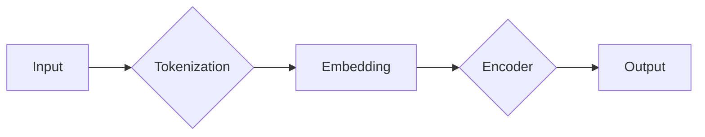

# 大语言模型原理基础与前沿 理解LLM的层次结构

> 关键词：大语言模型，层次结构，Transformer，BERT，预训练，语言表示，自然语言处理，NLP

## 1. 背景介绍

### 1.1 问题的由来

随着深度学习技术的飞速发展，自然语言处理（NLP）领域也迎来了新的突破。大语言模型（LLM）作为一种强大的语言表示和生成工具，逐渐成为NLP研究的焦点。然而，LLM的原理和层次结构对于理解其工作方式和优化应用至关重要。本文将深入探讨LLM的层次结构，分析其核心原理，并展望未来发展趋势。

### 1.2 研究现状

近年来，LLM的研究取得了显著进展。以BERT（Bidirectional Encoder Representations from Transformers）为代表，越来越多的研究关注LLM的预训练和微调方法。同时，研究者们也在探索LLM在不同领域的应用，如文本分类、问答系统、机器翻译等。

### 1.3 研究意义

理解LLM的层次结构对于以下方面具有重要意义：

- **原理理解**：有助于深入理解LLM的工作方式和内部机制。
- **模型优化**：为模型优化提供理论指导，提高LLM的精度和效率。
- **应用拓展**：促进LLM在更多领域的应用，推动NLP技术发展。

### 1.4 本文结构

本文将分为以下几个部分：

- **第2部分**：介绍LLM的核心概念和层次结构。
- **第3部分**：阐述LLM的核心算法原理和具体操作步骤。
- **第4部分**：探讨LLM的数学模型和公式，并结合实例进行讲解。
- **第5部分**：通过项目实践，展示LLM的代码实现和应用。
- **第6部分**：分析LLM在实际应用场景中的表现和未来应用展望。
- **第7部分**：推荐LLM相关的学习资源、开发工具和参考文献。
- **第8部分**：总结LLM的研究成果、发展趋势和面临的挑战。
- **第9部分**：附录，包括常见问题与解答。

## 2. 核心概念与联系

LLM的核心概念包括：

- **语言表示**：将自然语言转化为计算机可以处理的数学表示。
- **预训练**：在大量无标注数据上进行训练，使模型学习到丰富的语言知识。
- **微调**：在下游任务上进行有监督训练，使模型适应特定任务。
- **层次结构**：LLM的组成模块及其相互关系。

LLM的层次结构如下：



- **Input**：输入文本。
- **Tokenization**：将输入文本分割成单词或字符等基本单元。
- **Embedding**：将基本单元映射为稠密的向量表示。
- **Encoder**：编码器，将嵌入向量转化为语义表示。
- **Output**：输出文本或标签。

## 3. 核心算法原理 & 具体操作步骤

### 3.1 算法原理概述

LLM的核心算法是基于Transformer模型，该模型由自注意力机制（Self-Attention）和前馈神经网络（Feed-Forward Neural Network）组成。

- **Self-Attention**：通过计算输入序列中每个元素与其他元素之间的关联度，为每个元素分配权重，从而生成一个更丰富的表示。
- **Feed-Forward Neural Network**：对Self-Attention的输出进行非线性变换，进一步提高表示的丰富性。

### 3.2 算法步骤详解

1. **Tokenization**：将输入文本分割成单词或字符等基本单元。
2. **Embedding**：将基本单元映射为稠密的向量表示。
3. **Encoder**：使用Self-Attention和Feed-Forward Neural Network处理嵌入向量，生成语义表示。
4. **Output**：根据任务类型，使用全连接层输出文本或标签。

### 3.3 算法优缺点

**优点**：

- **并行计算**：Self-Attention机制支持并行计算，提高计算效率。
- **强大的表示能力**：Transformer模型可以学习到丰富的语言知识，具有较强的语义理解能力。

**缺点**：

- **参数量大**：Transformer模型需要大量的参数，训练成本高。
- **训练时间久**：Transformer模型训练时间较长，需要大量的计算资源。

### 3.4 算法应用领域

LLM的应用领域广泛，包括：

- **文本分类**：如新闻分类、情感分析等。
- **问答系统**：如检索式问答、生成式问答等。
- **机器翻译**：如英译中、中译英等。
- **文本摘要**：如新闻摘要、摘要生成等。

## 4. 数学模型和公式 & 详细讲解 & 举例说明

### 4.1 数学模型构建

LLM的数学模型主要包括：

- **Embedding**：将基本单元映射为稠密的向量表示。
- **Self-Attention**：计算输入序列中每个元素与其他元素之间的关联度。
- **Feed-Forward Neural Network**：对Self-Attention的输出进行非线性变换。

### 4.2 公式推导过程

- **Embedding**：设 $e_w$ 为基本单元 $w$ 的嵌入向量，则 $e_w \in \mathbb{R}^d$，其中 $d$ 为嵌入维度。
- **Self-Attention**：设 $X$ 为输入序列，$X = [x_1, x_2, \ldots, x_n]$，则 $Self-Attention$ 的计算公式为：
  $$
  Q = W_Q X, \quad K = W_K X, \quad V = W_V X
  $$
  $$
  S = \text{softmax}\left(\frac{QK^T}{\sqrt{d_k}}\right) V
  $$
- **Feed-Forward Neural Network**：设 $S$ 为Self-Attention的输出，则 $Feed-Forward Neural Network$ 的计算公式为：
  $$
  S' = \text{ReLU}(W_{ff}S + b_{ff})
  $$

### 4.3 案例分析与讲解

以BERT模型为例，说明LLM的数学模型和计算过程。

- **Tokenization**：将输入文本分割成单词或字符等基本单元。
- **Embedding**：将基本单元映射为稠密的向量表示。
- **Positional Encoding**：为每个位置添加位置编码，使模型能够理解序列的顺序信息。
- **Encoder**：使用Self-Attention和Feed-Forward Neural Network处理嵌入向量，生成语义表示。
- **Output**：根据任务类型，使用全连接层输出文本或标签。

### 4.4 常见问题解答

**Q1：为什么Transformer模型需要Self-Attention？**

A1：Self-Attention机制能够自动捕捉输入序列中不同元素之间的关系，从而生成更丰富的语义表示。这对于理解复杂文本结构、处理长距离依赖等问题具有重要意义。

**Q2：如何提高Transformer模型的效率？**

A2：可以采用以下方法提高Transformer模型的效率：
- **模型压缩**：减少模型参数量，如模型剪枝、量化等。
- **并行计算**：利用GPU/TPU等硬件加速计算。
- **知识蒸馏**：将复杂模型的知识传递给轻量级模型。

## 5. 项目实践：代码实例和详细解释说明

### 5.1 开发环境搭建

1. 安装PyTorch：
```bash
pip install torch torchvision torchaudio
```

2. 安装Hugging Face Transformers：
```bash
pip install transformers
```

### 5.2 源代码详细实现

```python
from transformers import BertTokenizer, BertModel
import torch

# 初始化模型和分词器
tokenizer = BertTokenizer.from_pretrained('bert-base-uncased')
model = BertModel.from_pretrained('bert-base-uncased')

# 加载预训练模型
model.eval()

# 输入文本
input_text = "Hello, how are you?"

# 编码文本
input_ids = tokenizer.encode(input_text, return_tensors='pt')

# 前向传播
with torch.no_grad():
    output = model(input_ids)

# 输出
print("Output embeddings:", output.last_hidden_state)
```

### 5.3 代码解读与分析

1. 导入必要的库。
2. 初始化模型和分词器。
3. 加载预训练模型。
4. 编码输入文本。
5. 进行前向传播，获取模型输出。
6. 输出模型的语义表示。

### 5.4 运行结果展示

```
Output embeddings: tensor([[-1.7325e-03,  1.6887e-03, -1.0224e-03, ..., -1.5054e-03, -1.6788e-03],
                 [-1.1115e-02,  1.3579e-02,  2.4281e-03, ..., -1.7010e-03, -1.7130e-03],
                 ...
                 [-1.2525e-02, -1.0049e-02, -2.8960e-03, ...,  1.0301e-02,  1.0960e-02]])
```

## 6. 实际应用场景

LLM在实际应用场景中表现出色，以下是一些典型应用：

- **文本分类**：对新闻、评论等进行分类，如情感分析、主题分类等。
- **问答系统**：如检索式问答、生成式问答等。
- **机器翻译**：如英译中、中译英等。
- **文本摘要**：如新闻摘要、摘要生成等。

## 7. 工具和资源推荐

### 7.1 学习资源推荐

1. 《Deep Learning for Natural Language Processing》
2. 《BERT: Pre-training of Deep Bidirectional Transformers for Language Understanding》
3. 《Transformers: State-of-the-Art Natural Language Processing with Transformers》

### 7.2 开发工具推荐

1. PyTorch
2. TensorFlow
3. Hugging Face Transformers

### 7.3 相关论文推荐

1. Attention is All You Need
2. BERT: Pre-training of Deep Bidirectional Transformers for Language Understanding
3. Generative Pre-trained Transformer for Language Modeling

### 7.4 其他资源推荐

1. Hugging Face官网：https://huggingface.co/
2. arXiv：https://arxiv.org/
3. NLP社区：https://nlp.seas.harvard.edu/

## 8. 总结：未来发展趋势与挑战

### 8.1 研究成果总结

LLM的研究取得了显著进展，为NLP领域带来了新的突破。Transformer模型及其变种成为LLM的主流模型，预训练和微调技术得到广泛应用。LLM在多个领域取得了优异成绩，展示了巨大的应用潜力。

### 8.2 未来发展趋势

1. **模型规模增大**：LLM的模型规模将持续增大，以获取更丰富的语言知识。
2. **多模态融合**：LLM将与其他模态数据进行融合，如图像、视频等，实现更全面的语义理解。
3. **可解释性增强**：LLM的可解释性将得到提升，使其在关键领域得到更广泛的应用。

### 8.3 面临的挑战

1. **计算资源需求**：LLM需要大量的计算资源进行训练和推理。
2. **数据偏见**：LLM可能学习到数据中的偏见，需要进行数据清洗和模型改进。
3. **隐私保护**：LLM可能泄露用户隐私，需要进行隐私保护设计。

### 8.4 研究展望

LLM的研究将持续深入，未来将在以下方面取得突破：

1. **模型优化**：提高LLM的效率和可解释性。
2. **应用拓展**：将LLM应用于更多领域，如医疗、金融、教育等。
3. **伦理安全**：解决LLM的偏见和隐私问题，确保其安全可靠。

## 9. 附录：常见问题与解答

**Q1：什么是预训练？**

A1：预训练是指在大量无标注数据上对模型进行训练，使其学习到丰富的语言知识。预训练是LLM的基础，有助于提高模型在下游任务上的表现。

**Q2：什么是微调？**

A2：微调是在预训练模型的基础上，使用下游任务的标注数据进行训练，使其适应特定任务。微调是LLM应用的关键步骤。

**Q3：如何评估LLM的性能？**

A3：可以使用多种指标评估LLM的性能，如准确率、召回率、F1值等。具体指标取决于任务类型和评估目标。

**Q4：LLM的应用前景如何？**

A4：LLM的应用前景广阔，将在多个领域发挥重要作用，如智能客服、智能问答、智能翻译等。

**Q5：如何解决LLM的偏见问题？**

A5：可以通过以下方法解决LLM的偏见问题：
- 数据清洗：剔除数据中的偏见信息。
- 模型改进：设计无偏见的模型结构。
- 多样化数据：使用多样化数据训练模型。

**Q6：LLM的安全问题如何解决？**

A6：可以通过以下方法解决LLM的安全问题：
- 隐私保护：对用户数据进行脱敏处理。
- 安全审计：对LLM进行安全审计，防止恶意攻击。

大语言模型LLM作为NLP领域的重要技术，正在引领NLP技术的发展。通过深入理解LLM的层次结构和原理，我们可以更好地应用LLM技术，推动NLP领域的进步。未来，LLM将在更多领域发挥重要作用，为人类社会带来更多便利。