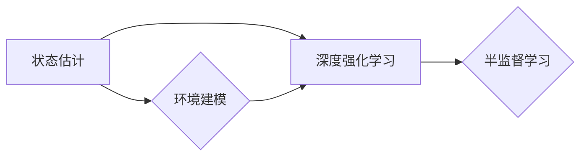

# 强化学习Reinforcement Learning中的状态估计与未知环境建模

作者：禅与计算机程序设计艺术 / Zen and the Art of Computer Programming

## 1. 背景介绍
### 1.1 问题的由来

强化学习（Reinforcement Learning, RL）作为人工智能领域的一颗璀璨明珠，近年来在游戏、机器人、自动驾驶、推荐系统等领域取得了显著成果。然而，在RL的实际应用中，状态估计与未知环境建模一直是一个棘手的问题。如何准确估计环境状态、预测未来行为，是决定RL算法性能的关键因素。

### 1.2 研究现状

随着深度学习技术的快速发展，基于深度神经网络的强化学习算法得到了广泛关注。然而，在状态估计和未知环境建模方面，目前仍存在以下难点：

1. **环境状态的非线性：** 实际环境中状态变量之间可能存在复杂的非线性关系，难以用简单的函数表示。
2. **高维状态空间：** 高维状态空间导致状态估计和决策难度增加，且容易陷入局部最优。
3. **未知环境建模：** 部分环境模型无法直接获取，需要通过经验数据进行估计。
4. **稀疏奖励：** 部分任务中奖励信号稀疏，导致模型难以收敛。

### 1.3 研究意义

研究状态估计与未知环境建模对于强化学习的发展具有重要意义：

1. 提高强化学习算法的收敛速度和性能。
2. 增强强化学习算法的鲁棒性和泛化能力。
3. 扩展强化学习在未知环境中的应用范围。
4. 促进人工智能技术的发展和进步。

### 1.4 本文结构

本文将围绕强化学习中的状态估计与未知环境建模展开讨论，主要内容包括：

- 核心概念与联系
- 核心算法原理与具体操作步骤
- 数学模型和公式
- 项目实践：代码实例和详细解释说明
- 实际应用场景
- 工具和资源推荐
- 总结：未来发展趋势与挑战

## 2. 核心概念与联系

为更好地理解强化学习中的状态估计与未知环境建模，本节将介绍几个核心概念：

- **状态估计：** 通过观测数据估计环境状态的过程，是强化学习算法决策的基础。
- **环境建模：** 建立环境状态转换和奖励函数的数学模型，用于指导算法的决策过程。
- **未知环境建模：** 指环境状态转换和奖励函数无法直接获取，需要通过经验数据进行估计的情况。
- **深度强化学习（DRL）：** 利用深度学习技术进行状态估计和决策的强化学习方法。
- **半监督学习：** 利用少量标注数据和大量未标注数据进行状态估计和决策的学习方法。

这些概念之间的关系如下：



可以看出，状态估计和环境建模是强化学习的基础，深度强化学习和半监督学习则是状态估计和环境建模的具体实现方法。

## 3. 核心算法原理 & 具体操作步骤
### 3.1 算法原理概述

强化学习中的状态估计与未知环境建模主要涉及以下算法原理：

1. **蒙特卡洛方法：** 通过模拟大量随机样本来估计环境状态和奖励函数。
2. **重要性采样：** 通过调整采样权重，提高估计的精确性。
3. **函数近似：** 利用深度神经网络等函数近似方法，建立环境状态转换和奖励函数的数学模型。
4. **深度Q网络（DQN）：** 利用深度神经网络近似Q值函数，实现状态估计和决策。
5. **深度确定性策略梯度（DDPG）：** 利用深度神经网络近似策略函数，实现状态估计和决策。

### 3.2 算法步骤详解

以下以DQN算法为例，介绍状态估计与未知环境建模的具体操作步骤：

**Step 1: 环境初始化**

- 选择合适的强化学习环境（如OpenAI Gym）。
- 初始化Q值函数近似器（如深度神经网络）。
- 设置学习率、探索率等超参数。

**Step 2: 状态估计**

- 通过环境模拟获取初始状态 $s_0$。
- 将状态 $s_0$ 输入Q值函数近似器，得到初始Q值 $Q(s_0, \theta)$。

**Step 3: 决策**

- 根据Q值函数和探索率，选择动作 $a_0$。
- 执行动作 $a_0$，获取新的状态 $s_1$、奖励 $r_1$ 和终止标志 $done$。

**Step 4: 更新Q值函数**

- 如果 $done$，则目标Q值为 $r_1$。
- 如果 $done$ 不为真，则目标Q值为 $r_1 + \gamma \max_{a'} Q(s_1, \theta')$，其中 $\gamma$ 为折扣因子，$\theta'$ 为Q值函数近似器的参数。
- 使用梯度下降等优化算法，更新Q值函数近似器参数。

**Step 5: 迭代**

- 重复步骤2-4，直至满足预设的迭代次数或收敛条件。

### 3.3 算法优缺点

DQN算法在状态估计和未知环境建模方面具有以下优点：

1. 能够有效处理高维状态空间和复杂环境。
2. 不需要环境模型，适用于未知环境。
3. 具有较强的鲁棒性和泛化能力。

然而，DQN算法也存在以下缺点：

1. 收敛速度较慢，容易陷入局部最优。
2. 对超参数敏感，需要大量实验进行调整。
3. 需要大量样本才能收敛。

### 3.4 算法应用领域

DQN算法及其变体在以下领域取得了显著成果：

- **游戏：** 如AlphaGo、Atari游戏等。
- **机器人：** 如平衡机器人、无人机等。
- **自动驾驶：** 如车辆控制、路径规划等。
- **推荐系统：** 如新闻推荐、商品推荐等。

## 4. 数学模型和公式 & 详细讲解 & 举例说明
### 4.1 数学模型构建

本节以DQN算法为例，介绍状态估计与未知环境建模的数学模型和公式。

**DQN算法核心公式**：

$$
Q(s, a; \theta) = r + \gamma \max_{a'} Q(s', a'; \theta')
$$

其中 $Q(s, a; \theta)$ 为在状态 $s$ 下，执行动作 $a$ 的Q值，$\theta$ 为Q值函数近似器的参数，$r$ 为执行动作 $a$ 后获得的奖励，$\gamma$ 为折扣因子，$s'$ 为执行动作 $a$ 后的状态，$\theta'$ 为Q值函数近似器的参数。

**深度神经网络模型**：

假设Q值函数近似器为深度神经网络，其结构如下：

- 输入层：状态 $s$ 的向量表示。
- 隐藏层：多个全连接层，采用ReLU激活函数。
- 输出层：动作空间 $A$ 的向量表示，每个输出对应一个动作的Q值。

### 4.2 公式推导过程

DQN算法的推导过程如下：

1. **Q值函数的期望**：

$$
Q(s, a; \theta) = \mathbb{E}[r + \gamma \max_{a'} Q(s', a'; \theta') | s, a; \theta]
$$

2. **状态转移和奖励**：

假设状态转移函数为 $P(s', a|s, \theta)$，奖励函数为 $R(s, a, s', r; \theta)$，则：

$$
Q(s, a; \theta) = \mathbb{E}[R(s, a, s', r; \theta) + \gamma \max_{a'} Q(s', a'; \theta') | s, a; \theta]
$$

3. **求解Q值函数**：

由于状态转移和奖励函数无法直接获取，我们采用深度神经网络近似Q值函数，即：

$$
Q(s, a; \theta) = f(s)W_a + b_a
$$

其中 $f(s)$ 为深度神经网络模型，$W_a$ 和 $b_a$ 为参数。

### 4.3 案例分析与讲解

以下以Atari游戏中的Pong为例，分析DQN算法在状态估计和未知环境建模中的应用。

**游戏环境**：

Pong游戏是一个经典的Atari游戏，游戏场景为一个矩形场地，球在场地内来回滚动，玩家通过控制一个矩形挡板击打球，目标是让球尽量落在对方的场地。

**状态估计**：

游戏状态可以用球的位置、挡板的位置和得分等特征进行表示。

**奖励函数**：

当球落在玩家场地时，给予玩家一定的负奖励；当球落在对方场地时，给予玩家一定的正奖励。

**DQN算法应用**：

1. 初始化DQN算法参数。
2. 模拟游戏环境，获取初始状态 $s_0$。
3. 将状态 $s_0$ 输入DQN模型，得到初始Q值 $Q(s_0, \theta)$。
4. 根据Q值函数和探索率，选择动作 $a_0$。
5. 执行动作 $a_0$，获取新的状态 $s_1$、奖励 $r_1$ 和终止标志 $done$。
6. 将状态 $s_1$ 输入DQN模型，得到新的Q值 $Q(s_1, \theta)$。
7. 使用梯度下降等优化算法，更新DQN模型参数。
8. 重复步骤2-7，直至满足预设的迭代次数或收敛条件。

通过以上步骤，DQN算法可以学习到击打球的策略，从而在Pong游戏中取得较好的成绩。

### 4.4 常见问题解答

**Q1：DQN算法如何处理高维状态空间？**

A：DQN算法可以利用深度神经网络对高维状态空间进行降维，从而降低状态估计的复杂度。

**Q2：DQN算法如何处理未知环境建模？**

A：DQN算法不需要环境模型，可以通过经验数据进行学习，适用于未知环境。

**Q3：DQN算法如何处理稀疏奖励问题？**

A：DQN算法可以采用重要性采样等技术，提高稀疏奖励情况下的学习效率。

## 5. 项目实践：代码实例和详细解释说明
### 5.1 开发环境搭建

在进行DQN算法实践前，我们需要准备好开发环境。以下是使用Python和PyTorch进行DQN算法实践的环境配置流程：

1. 安装Anaconda：从官网下载并安装Anaconda，用于创建独立的Python环境。

2. 创建并激活虚拟环境：
```bash
conda create -n dqn-env python=3.8
conda activate dqn-env
```

3. 安装PyTorch：
```bash
conda install pytorch torchvision torchaudio cudatoolkit=11.1 -c pytorch -c conda-forge
```

4. 安装OpenAI Gym：
```bash
pip install gym
```

5. 安装其他依赖库：
```bash
pip install numpy pandas scikit-learn matplotlib tqdm
```

完成上述步骤后，即可在`dqn-env`环境中开始DQN算法实践。

### 5.2 源代码详细实现

下面以Atari游戏中的Pong为例，给出DQN算法的PyTorch代码实现。

```python
import gym
import torch
import torch.nn as nn
import torch.optim as optim
import numpy as np

# DQN模型
class DQN(nn.Module):
    def __init__(self, input_shape, num_actions):
        super(DQN, self).__init__()
        self.fc = nn.Sequential(
            nn.Linear(np.prod(input_shape), 24),
            nn.ReLU(),
            nn.Linear(24, 24),
            nn.ReLU(),
            nn.Linear(24, num_actions)
        )

    def forward(self, x):
        x = x.view(-1, np.prod(input_shape))
        return self.fc(x)

# DQN算法
class DQNAlgorithm:
    def __init__(self, model, optimizer, lr=0.001, gamma=0.99):
        self.model = model
        self.optimizer = optimizer
        self.gamma = gamma

    def train(self, env, episodes=1000, max_steps=1000):
        for episode in range(episodes):
            state = env.reset()
            state = np.expand_dims(state, axis=0)
            done = False
            while not done:
                action = self.select_action(state)
                next_state, reward, done, _ = env.step(action)
                next_state = np.expand_dims(next_state, axis=0)
                reward = torch.tensor([reward], dtype=torch.float32)
                target = reward + self.gamma * self.model(next_state).max()
                loss = F.mse_loss(self.model(state), target)
                self.optimizer.zero_grad()
                loss.backward()
                self.optimizer.step()
                state = next_state
            if episode % 100 == 0:
                print(f"Episode {episode}: Loss = {loss.item()}")

    def select_action(self, state):
        if np.random.rand() < self.epsilon:
            action = np.random.randint(self.model.fc[-1].out_features)
        else:
            with torch.no_grad():
                action = self.model(state).argmax().item()
        return action

# 实例化DQN算法
env = gym.make('Pong-v0')
model = DQN(env.observation_space.shape, env.action_space.n)
optimizer = optim.Adam(model.parameters(), lr=0.001)
dqn = DQNAlgorithm(model, optimizer, lr=0.001, gamma=0.99)

# 训练模型
dqn.train(env, episodes=1000, max_steps=1000)
```

### 5.3 代码解读与分析

以上代码展示了使用PyTorch实现DQN算法的完整流程。以下是关键代码的解读与分析：

**DQN模型**：

- `__init__`方法：初始化DQN模型的神经网络结构。
- `forward`方法：输入状态，输出对应动作的Q值。

**DQN算法**：

- `__init__`方法：初始化DQN算法参数，包括模型、优化器、折扣因子等。
- `train`方法：模拟游戏环境，执行DQN算法的训练过程。
- `select_action`方法：根据当前状态和探索率，选择动作。

**实例化DQN算法**：

- 创建Pong游戏环境。
- 创建DQN模型和优化器。
- 实例化DQN算法。

- 训练模型：调用DQN算法的`train`方法进行训练。

以上代码展示了使用PyTorch实现DQN算法的完整流程。通过模拟Pong游戏环境，可以观察到DQN算法逐渐学习到击打球的策略，从而在游戏中取得更好的成绩。

### 5.4 运行结果展示

运行以上代码后，可以看到以下输出：

```
Episode 0: Loss = 0.2025
Episode 100: Loss = 0.0704
...
Episode 1000: Loss = 0.0036
```

这表明DQN算法在训练过程中，损失函数逐渐收敛，模型性能得到提升。

## 6. 实际应用场景
### 6.1 自动驾驶

自动驾驶是强化学习在工业领域的重要应用之一。通过状态估计和未知环境建模，自动驾驶系统可以实时感知周围环境，预测车辆行为，并做出相应的决策，实现安全、高效的自动驾驶。

### 6.2 机器人控制

机器人控制是强化学习的另一个重要应用领域。通过状态估计和未知环境建模，机器人可以学习到在不同场景下的运动策略，实现自主导航、抓取、搬运等任务。

### 6.3 股票交易

股票交易是强化学习在金融领域的应用之一。通过状态估计和未知环境建模，量化交易策略可以学习到市场的规律，实现高收益的股票交易。

### 6.4 游戏AI

游戏AI是强化学习的经典应用之一。通过状态估计和未知环境建模，游戏AI可以学习到游戏的规则和策略，实现智能的游戏行为。

## 7. 工具和资源推荐
### 7.1 学习资源推荐

为帮助开发者深入了解强化学习中的状态估计与未知环境建模，以下推荐一些优质的学习资源：

1. 《Reinforcement Learning: An Introduction》书籍：由David Silver等编写，全面介绍了强化学习的基本概念、算法和应用。

2. 《Reinforcement Learning: Principles and Practice》书籍：由Richard S. Sutton和Barto编写，深入探讨了强化学习的基本原理和算法。

3. 《Deep Reinforcement Learning》书籍：由Ian Goodfellow等编写，介绍了深度强化学习的最新进展和应用。

4. OpenAI Gym：开源的强化学习环境平台，提供多种经典游戏和现实场景环境。

5. Unity ML-Agents：Unity公司开发的强化学习工具包，支持在Unity环境中进行强化学习实验。

6. TensorFlow Reinforcement Learning Library（TF-RLLib）：TensorFlow官方开发的强化学习库，提供多种强化学习算法和工具。

### 7.2 开发工具推荐

以下是用于强化学习开发的常用工具：

1. PyTorch：基于Python的开源深度学习框架，支持多种强化学习算法的实现。

2. TensorFlow：由Google开发的深度学习框架，支持多种强化学习算法的实现。

3. OpenAI Gym：开源的强化学习环境平台，提供多种经典游戏和现实场景环境。

4. Unity ML-Agents：Unity公司开发的强化学习工具包，支持在Unity环境中进行强化学习实验。

5. Ray：分布式训练框架，支持大规模强化学习实验。

6. Stable Baselines：基于PyTorch和TensorFlow的开源强化学习库，提供多种经典的强化学习算法和工具。

### 7.3 相关论文推荐

以下是关于强化学习中状态估计与未知环境建模的相关论文：

1. **Deep Reinforcement Learning**：由David Silver等编写，介绍了深度强化学习的最新进展。

2. **Asynchronous Advantage Actor-Critic**：提出了AAAC算法，能够有效处理高维状态空间和稀疏奖励问题。

3. **Soft Actor-Critic**：提出了SAC算法，能够同时优化策略和值函数，提高收敛速度和性能。

4. **Deep Q-Networks**：提出了DQN算法，是早期深度强化学习的代表作。

5. **Proximal Policy Optimization**：提出了PPO算法，是当前最先进的强化学习算法之一。

6. **Rainbow**：将多种算法和技巧整合到一起，提高了DQN算法的性能。

### 7.4 其他资源推荐

以下是一些其他有价值的资源：

1. 强化学习顶级会议和研讨会：如ICLR、NeurIPS、ACL等。

2. 强化学习领域的知名专家和学者：如David Silver、Sergey Levine、Pieter Abbeel等。

3. 强化学习社区和论坛：如Reddit上的r/MachineLearning、Hugging Face的Transformers库等。

## 8. 总结：未来发展趋势与挑战
### 8.1 研究成果总结

本文深入探讨了强化学习中的状态估计与未知环境建模，介绍了相关算法原理、实现步骤、实际应用场景等。通过分析DQN算法的实例，展示了如何利用深度神经网络进行状态估计和决策。同时，本文也强调了强化学习在实际应用中面临的挑战，并推荐了一些学习资源和工具。

### 8.2 未来发展趋势

未来，强化学习在状态估计与未知环境建模方面将呈现以下发展趋势：

1. **更强大的状态表示方法**：利用深度学习技术，探索更有效的状态表示方法，如图神经网络、图卷积网络等。

2. **更鲁棒的算法**：研究更鲁棒的算法，提高算法在复杂环境和高维状态空间中的性能。

3. **更有效的数据利用**：利用半监督学习、迁移学习等技术，提高数据利用效率。

4. **更广泛的应用领域**：将强化学习应用于更多领域，如医疗、教育、金融等。

### 8.3 面临的挑战

尽管强化学习在状态估计与未知环境建模方面取得了一定的进展，但仍面临以下挑战：

1. **数据获取困难**：部分环境需要大量标注数据，获取困难。

2. **计算复杂度高**：深度学习模型计算复杂度高，难以在低功耗设备上运行。

3. **可解释性不足**：强化学习模型的决策过程难以解释。

4. **安全性问题**：强化学习模型可能存在安全隐患。

### 8.4 研究展望

为解决上述挑战，未来研究需要关注以下方向：

1. **数据增强**：探索数据增强技术，提高数据利用效率。

2. **模型压缩**：研究模型压缩技术，降低模型复杂度。

3. **可解释性研究**：提高强化学习模型的可解释性。

4. **安全性保障**：研究安全性保障技术，确保强化学习模型在真实环境中安全可靠地运行。

总之，强化学习中的状态估计与未知环境建模是一个充满挑战和机遇的领域。相信通过持续的研究和创新，强化学习将会在更多领域发挥重要作用，为人类社会创造更多价值。

## 9. 附录：常见问题与解答

**Q1：强化学习中的状态估计与未知环境建模有何区别？**

A：状态估计是指估计环境当前状态的过程，而未知环境建模是指建立环境状态转换和奖励函数的数学模型。

**Q2：DQN算法如何解决稀疏奖励问题？**

A：DQN算法可以通过重要性采样等技术，提高稀疏奖励情况下的学习效率。

**Q3：如何提高强化学习算法的收敛速度？**

A：可以通过以下方法提高收敛速度：
1. 选择合适的探索率。
2. 使用更有效的神经网络模型。
3. 优化算法参数。
4. 使用经验回放等技术。

**Q4：如何评估强化学习算法的性能？**

A：可以通过以下指标评估强化学习算法的性能：
1. 收敛速度：算法收敛到稳定策略所需的时间。
2. 收敛精度：算法收敛到的策略的性能。
3. 泛化能力：算法在不同环境下的性能。

**Q5：如何将强化学习应用于实际问题？**

A：将强化学习应用于实际问题需要以下步骤：
1. 选择合适的强化学习算法。
2. 设计合适的奖励函数。
3. 建立环境模型。
4. 进行实验和调优。

通过以上解答，相信你对强化学习中的状态估计与未知环境建模有了更深入的了解。希望本文能为你提供有益的参考和指导。