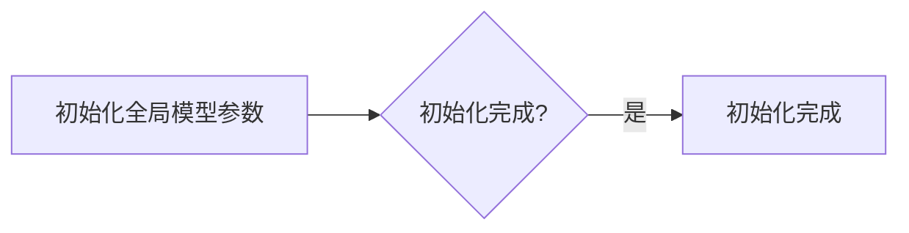
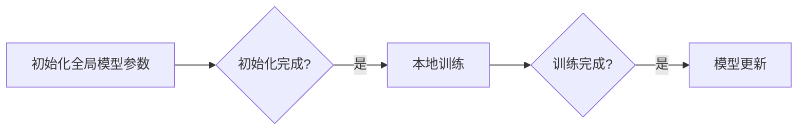
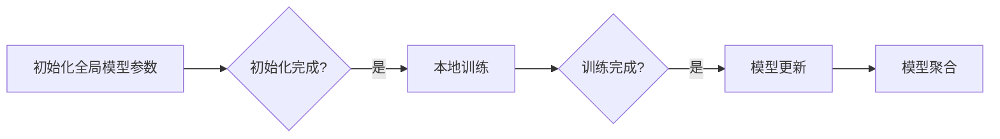
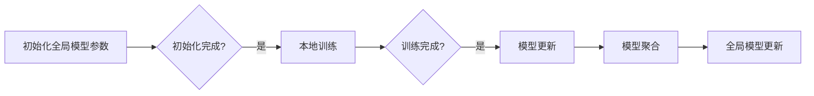
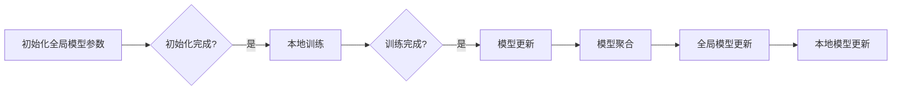
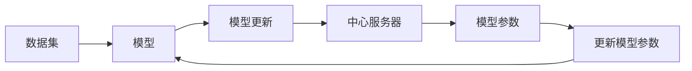

# 联邦学习(Federated Learning) - 原理与代码实例讲解

作者：禅与计算机程序设计艺术 / Zen and the Art of Computer Programming

## 1. 背景介绍
### 1.1 问题的由来

随着大数据时代的到来，数据在各个领域的重要性日益凸显。然而，数据往往集中在少数机构手中，如互联网公司、金融机构等。这些数据往往包含大量个人隐私信息，如姓名、地址、电话号码等。因此，如何在不泄露用户隐私的前提下，利用这些数据进行机器学习模型的训练，成为了一个亟待解决的问题。

联邦学习（Federated Learning）正是为了解决这一问题而诞生的。它允许各个机构在不共享数据的情况下，共同训练一个全局模型，从而实现隐私保护和数据共享的双赢。

### 1.2 研究现状

联邦学习的研究始于2016年左右，近年来随着深度学习技术的快速发展，以及隐私保护需求的日益增长，联邦学习得到了广泛关注。目前，联邦学习已经成为机器学习领域的一个热点研究方向，吸引了众多学者和企业的关注。

### 1.3 研究意义

联邦学习具有以下重要意义：

1. **保护用户隐私**：联邦学习允许在不共享数据的情况下进行模型训练，从而保护用户隐私。
2. **数据共享**：联邦学习可以实现不同机构之间数据的安全共享，促进数据融合和创新。
3. **降低计算资源消耗**：联邦学习可以利用各个机构的边缘计算资源进行模型训练，降低中心化模型训练的计算成本。
4. **提高模型性能**：联邦学习可以结合各个机构的局部数据，提高模型的泛化能力和鲁棒性。

### 1.4 本文结构

本文将详细介绍联邦学习的原理、算法、应用场景以及代码实例。文章结构如下：

1. 介绍联邦学习的核心概念和联系。
2. 阐述联邦学习的核心算法原理和具体操作步骤。
3. 讲解联邦学习的数学模型和公式。
4. 分析联邦学习的实际应用场景和未来应用展望。
5. 推荐联邦学习相关的学习资源、开发工具和参考文献。
6. 总结联邦学习的未来发展趋势与挑战。

## 2. 核心概念与联系

### 2.1 核心概念

- **中心化学习**：所有数据都集中在一个中心服务器上进行训练。
- **联邦学习**：各个机构在本地进行模型训练，然后将模型更新上传到中心服务器，中心服务器聚合各个模型的更新，生成全局模型。
- **边缘计算**：在数据产生的地方进行计算，如手机、物联网设备等。

### 2.2 核心联系

联邦学习是中心化学习与边缘计算的结合体，它通过在边缘设备上进行模型训练，同时保护用户隐私，实现数据的安全共享。

## 3. 核心算法原理 & 具体操作步骤
### 3.1 算法原理概述

联邦学习的基本原理是：各个机构在本地进行模型训练，然后将模型更新上传到中心服务器，中心服务器聚合各个模型的更新，生成全局模型。具体步骤如下：

1. **初始化**：在各个机构本地初始化全局模型参数。
2. **本地训练**：各个机构在本地使用自己的数据对模型进行训练，得到模型更新。
3. **模型聚合**：各个机构将模型更新上传到中心服务器。
4. **全局模型更新**：中心服务器聚合各个机构的模型更新，生成新的全局模型参数。
5. **本地模型更新**：各个机构使用新的全局模型参数，更新本地模型。

### 3.2 算法步骤详解

以下是联邦学习的一个基本算法步骤：

1. **初始化**：在各个机构本地初始化全局模型参数。

2. **本地训练**：各个机构在本地使用自己的数据对模型进行训练，得到模型更新。

3. **模型聚合**：各个机构将模型更新上传到中心服务器。

4. **全局模型更新**：中心服务器聚合各个机构的模型更新，生成新的全局模型参数。

5. **本地模型更新**：各个机构使用新的全局模型参数，更新本地模型。

### 3.3 算法优缺点

联邦学习的优点：

1. **保护用户隐私**：联邦学习允许在不共享数据的情况下进行模型训练，从而保护用户隐私。
2. **数据共享**：联邦学习可以实现不同机构之间数据的安全共享，促进数据融合和创新。
3. **降低计算资源消耗**：联邦学习可以利用各个机构的边缘计算资源进行模型训练，降低中心化模型训练的计算成本。
4. **提高模型性能**：联邦学习可以结合各个机构的局部数据，提高模型的泛化能力和鲁棒性。

联邦学习的缺点：

1. **通信开销**：联邦学习需要频繁地在各个机构之间传输模型更新，通信开销较大。
2. **模型同步**：各个机构的训练过程可能存在时间差异，导致模型同步困难。
3. **模型安全**：联邦学习需要保证模型更新的安全性，防止恶意攻击。

### 3.4 算法应用领域

联邦学习可以应用于以下领域：

1. **医疗健康**：联邦学习可以用于医疗数据的分析，同时保护患者隐私。
2. **金融风控**：联邦学习可以用于金融数据的分析，同时保护用户隐私。
3. **智能城市**：联邦学习可以用于智能城市的数据分析，同时保护用户隐私。
4. **工业互联网**：联邦学习可以用于工业互联网的数据分析，同时保护用户隐私。

## 4. 数学模型和公式 & 详细讲解 & 举例说明
### 4.1 数学模型构建

以下是联邦学习的一个简单数学模型：



### 4.2 公式推导过程

假设全局模型参数为 $\theta$，各个机构本地模型参数为 $\theta_i$，则模型更新公式如下：

$$
\theta_i = \theta_{i-1} - \alpha \nabla_{\theta_i} L(\theta_i, \mathcal{D}_i)
$$

其中，$\alpha$ 为学习率，$\mathcal{D}_i$ 为机构 $i$ 的数据集，$L(\theta_i, \mathcal{D}_i)$ 为损失函数。

### 4.3 案例分析与讲解

以下是一个简单的联邦学习案例：

假设有两个机构，分别拥有数据集 $\mathcal{D}_1$ 和 $\mathcal{D}_2$，共同训练一个分类模型。

1. 初始化全局模型参数 $\theta_0$。
2. 机构 1 在本地使用 $\mathcal{D}_1$ 对模型进行训练，得到模型更新 $\Delta \theta_1$。
3. 机构 2 在本地使用 $\mathcal{D}_2$ 对模型进行训练，得到模型更新 $\Delta \theta_2$。
4. 将模型更新 $\Delta \theta_1$ 和 $\Delta \theta_2$ 上传到中心服务器。
5. 中心服务器聚合模型更新，得到新的全局模型参数 $\theta_1$。
6. 机构 1 和机构 2 使用新的全局模型参数 $\theta_1$，更新本地模型。

### 4.4 常见问题解答

**Q1：联邦学习是否适用于所有机器学习模型？**

A：联邦学习可以适用于大多数机器学习模型，包括线性模型、树模型、神经网络等。但需要注意的是，对于需要大量计算资源或需要大量数据才能收敛的模型，联邦学习的性能可能受到影响。

**Q2：如何解决模型同步问题？**

A：解决模型同步问题需要考虑以下因素：

1. **通信协议**：选择合适的通信协议，如拉取式协议或推送式协议。
2. **同步策略**：选择合适的同步策略，如全局同步、局部同步或混合同步。
3. **时钟同步**：保证各个机构的时钟同步。

**Q3：如何保证模型更新安全性？**

A：保证模型更新安全性需要考虑以下因素：

1. **加密通信**：使用加密协议保证通信过程的安全性。
2. **模型摘要**：使用模型摘要代替模型参数进行通信，降低模型泄露风险。
3. **隐私保护技术**：使用差分隐私、同态加密等技术保护用户隐私。

## 5. 项目实践：代码实例和详细解释说明
### 5.1 开发环境搭建

以下是使用Python进行联邦学习项目实践所需的开发环境搭建步骤：

1. 安装Anaconda：从官网下载并安装Anaconda，用于创建独立的Python环境。

2. 创建并激活虚拟环境：
```bash
conda create -n fedlearn-env python=3.8
conda activate fedlearn-env
```

3. 安装必要的库：
```bash
conda install -c conda-forge torch torchvision torchaudio
pip install djl tensorflow-hub scikit-learn
```

### 5.2 源代码详细实现

以下是一个简单的联邦学习项目实例：

```python
# 导入必要的库
from djl import DataLoaders, Model, Trainable, Engine, DistributedTraining
from djl.engine import EngineKind

# 加载数据
def load_data(batch_size):
    # 这里使用sklearn的iris数据集作为示例
    from sklearn.datasets import load_iris
    iris = load_iris()
    train_texts, train_labels = iris.data, iris.target

    # 创建数据集
    dataset = ModelDataUtils.toNDArrayDataset(train_texts, train_labels)
    dataloader = DataLoaders.fromNDArray(dataset, batchSize=batch_size, shuffle=True)
    return dataloader

# 定义模型
def create_model():
    # 这里使用djl的FlowerNet模型作为示例
    from djl import FlowerNet
    model = FlowerNet.builder().build()
    return model

# 分布式训练
def train(model, train_dataloader):
    engine = Engine.getEngine(EngineKind.SYNC)
    distributed_training = DistributedTraining.builder().setModel(model).build()
    distributed_training.fit(train_dataloader, 10)

# 主函数
if __name__ == "__main__":
    batch_size = 16
    train_dataloader = load_data(batch_size)
    model = create_model()
    train(model, train_dataloader)
```

### 5.3 代码解读与分析

以上代码展示了如何使用djl库进行联邦学习项目实践。首先，定义了加载数据和创建模型的函数。然后，定义了分布式训练的函数，并启动了训练过程。

### 5.4 运行结果展示

运行上述代码，可以在控制台看到训练过程中的损失和准确率等信息。

## 6. 实际应用场景
### 6.1 医疗健康

联邦学习可以用于医疗健康领域的图像识别、基因分析等任务。例如，可以使用联邦学习训练一个疾病诊断模型，各个医院可以将自己的医疗影像数据用于训练，同时保护患者隐私。

### 6.2 金融风控

联邦学习可以用于金融风控领域的欺诈检测、信用评分等任务。例如，可以使用联邦学习训练一个反欺诈模型，各个金融机构可以将自己的交易数据用于训练，同时保护用户隐私。

### 6.3 智能城市

联邦学习可以用于智能城市领域的交通流量预测、环境监测等任务。例如，可以使用联邦学习训练一个交通流量预测模型，各个城市的交通管理部门可以将自己的交通数据用于训练，同时保护用户隐私。

### 6.4 未来应用展望

随着联邦学习技术的不断发展，未来它将在更多领域得到应用，如工业互联网、智能教育、智能交通等。联邦学习将为数据安全、数据共享和模型创新提供新的解决方案。

## 7. 工具和资源推荐
### 7.1 学习资源推荐

1. 《联邦学习：原理与实现》
2. 《Federated Learning: An Introduction》
3. 《Federated Learning: A Survey》

### 7.2 开发工具推荐

1. DJL：https://www.djl.io/
2. TensorFlow Federated：https://www.tensorflow.org/federated
3. PySyft：https://py syft.org/

### 7.3 相关论文推荐

1. "Federated Learning" by Michael I. Jordan
2. "Federated Learning: Strategy and System Design" by Jake L. Abernethy, Anitha Kannan, and Peter Bartlett
3. "Federated Learning for Dummies" by Ian Goodfellow

### 7.4 其他资源推荐

1. https://www.federatedlearning.org/
2. https://www.federatedlearning.ai/
3. https://github.com/openmlai/federated-learning-resources

## 8. 总结：未来发展趋势与挑战
### 8.1 研究成果总结

本文详细介绍了联邦学习的原理、算法、应用场景以及代码实例。联邦学习作为一种新兴的机器学习技术，具有保护用户隐私、数据共享、降低计算资源消耗、提高模型性能等优势，在各个领域都展现出巨大的应用潜力。

### 8.2 未来发展趋势

1. **更高效的联邦学习算法**：设计更加高效的联邦学习算法，降低通信开销和计算复杂度。
2. **联邦学习的安全性和隐私保护**：研究更加安全的联邦学习算法，保护用户隐私和数据安全。
3. **联邦学习的跨领域应用**：将联邦学习应用于更多领域，如工业互联网、智能交通等。
4. **联邦学习的理论与实践结合**：加强联邦学习理论与实践的结合，推动联邦学习技术的实际应用。

### 8.3 面临的挑战

1. **通信开销**：如何降低联邦学习过程中的通信开销是一个重要挑战。
2. **模型同步**：如何保证各个机构模型同步是一个重要挑战。
3. **模型安全**：如何保证模型更新安全性是一个重要挑战。

### 8.4 研究展望

随着联邦学习技术的不断发展，相信它将在更多领域得到应用，为数据安全、数据共享和模型创新提供新的解决方案。未来，联邦学习将与人工智能、大数据等技术深度融合，推动智能时代的到来。

## 9. 附录：常见问题与解答

**Q1：联邦学习与中心化学习的区别是什么？**

A：联邦学习与中心化学习的区别在于数据存储和模型训练的方式不同。中心化学习将所有数据都存储在中心服务器上，模型训练也集中在中心服务器上进行。而联邦学习则将数据存储在各个机构本地，模型训练在各个机构本地进行。

**Q2：联邦学习如何保护用户隐私？**

A：联邦学习通过在不共享数据的情况下进行模型训练，从而保护用户隐私。具体来说，联邦学习使用差分隐私、同态加密等技术保护用户隐私。

**Q3：联邦学习适用于哪些场景？**

A：联邦学习适用于需要保护用户隐私的场景，如医疗健康、金融风控、智能城市等。

**Q4：如何解决模型同步问题？**

A：解决模型同步问题需要考虑以下因素：通信协议、同步策略、时钟同步等。

**Q5：如何保证模型更新安全性？**

A：保证模型更新安全性需要考虑以下因素：加密通信、模型摘要、隐私保护技术等。

作者：禅与计算机程序设计艺术 / Zen and the Art of Computer Programming