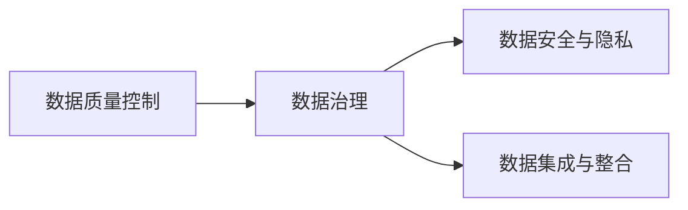

                 

# AI创业：数据管理的核心实践

在AI创业中，数据管理不仅是基础设施，更是核心竞争力。本文将深入探讨数据管理的核心实践，包括数据质量控制、数据治理框架、数据安全与隐私、以及数据集成与整合等关键环节，帮助读者全面提升数据管理能力，助力AI创业成功。

## 1. 背景介绍

### 1.1 数据管理的必要性

在AI创业中，数据是算法的原材料。高质量、可靠的数据是AI算法获得理想性能的关键。数据管理的优劣直接影响到算法的准确性和可靠性。传统企业依赖人工进行数据标注和整理，但在AI创业中，数据管理必须建立在自动化、标准化、科学化的基础上。

### 1.2 数据管理的主要挑战

1. **数据质量**：数据不准确、不完整或不一致性问题，严重影响模型的性能。
2. **数据治理**：如何对数据进行分类、存储、访问控制，确保数据的可用性和安全性。
3. **数据安全与隐私**：如何保障数据在传输和存储过程中的安全，尤其是敏感数据的隐私保护。
4. **数据集成与整合**：如何将不同来源、不同格式的数据进行统一管理和整合，形成完整的视图。

## 2. 核心概念与联系

### 2.1 核心概念概述

- **数据质量控制**：确保数据准确、完整、一致、及时和可靠的流程和机制。
- **数据治理框架**：对数据进行分类、存储、访问控制等管理的结构化和标准化方法。
- **数据安全与隐私**：保障数据在传输和存储过程中的安全，保护用户隐私。
- **数据集成与整合**：将不同来源、不同格式的数据进行统一管理和整合，形成完整的数据视图。

### 2.2 概念间的关系

这些概念相互关联，共同构成了数据管理的完整框架。数据质量控制是数据治理的基础，确保数据的可用性和可靠性；数据安全与隐私则是保障数据管理的基础；数据集成与整合则是数据治理的高级阶段，确保数据视图的完整性和一致性。



## 3. 核心算法原理 & 具体操作步骤

### 3.1 算法原理概述

数据管理的主要目标是确保数据的质量、可用性和安全性。这需要一系列的算法和技术支持。

- **数据清洗算法**：用于去除数据中的噪声、错误和重复数据，提升数据质量。
- **数据分类算法**：用于对数据进行分类和标注，形成数据视图。
- **数据访问控制算法**：用于对数据进行权限管理，确保数据的访问安全。
- **数据加密算法**：用于对数据进行加密，保护数据隐私。

### 3.2 算法步骤详解

**Step 1: 数据清洗**
- 收集数据
- 分析数据质量问题
- 执行数据清洗规则
- 验证数据质量

**Step 2: 数据分类**
- 定义数据分类标准
- 应用分类算法对数据进行标注
- 审核分类结果

**Step 3: 数据访问控制**
- 定义访问权限
- 实现访问控制策略
- 监控访问行为

**Step 4: 数据加密**
- 选择合适的加密算法
- 对数据进行加密
- 管理加密密钥

### 3.3 算法优缺点

**优点**：
- 提高数据质量，提升算法性能
- 确保数据安全和隐私
- 实现数据的统一管理和整合

**缺点**：
- 数据清洗和分类需要大量时间和资源
- 数据访问控制和加密增加系统复杂度

### 3.4 算法应用领域

数据管理技术广泛应用于金融、医疗、零售、制造业等多个领域。通过高质量的数据管理和高效的数据集成，这些行业能够提升决策效率和业务绩效。

## 4. 数学模型和公式 & 详细讲解  
### 4.1 数学模型构建

假设有一组数据集 $D=\{(x_i,y_i)\}_{i=1}^N$，其中 $x_i$ 为特征向量，$y_i$ 为标签。我们的目标是构建一个分类器 $f(x)$，使得在新的数据 $x'$ 上能够准确预测 $y'$。

定义损失函数为：

$$
\mathcal{L}(f(x)) = \frac{1}{N} \sum_{i=1}^N \ell(f(x_i),y_i)
$$

其中 $\ell$ 为具体的损失函数，如交叉熵、均方误差等。

### 4.2 公式推导过程

以交叉熵损失函数为例，其定义为：

$$
\ell(f(x),y) = -\sum_{i=1}^C y_i \log f(x_i)
$$

其中 $C$ 为类别数。

在模型训练中，通过反向传播算法，计算损失函数对模型参数的梯度，从而更新模型参数：

$$
\frac{\partial \mathcal{L}(f(x))}{\partial \theta} = \frac{1}{N} \sum_{i=1}^N \frac{\partial \ell(f(x_i),y_i)}{\partial f(x_i)} \frac{\partial f(x_i)}{\partial \theta}
$$

### 4.3 案例分析与讲解

假设我们有一个包含用户购买行为的二分类数据集，标签为是否购买（1表示购买，0表示未购买）。通过数据清洗、分类和模型训练，我们得到了一个预测模型 $f(x)$，用于预测新用户的购买行为。

在数据清洗阶段，我们发现数据中存在一些缺失值和错误值。通过数据清洗算法，我们处理了这些异常数据，确保数据的质量。

在数据分类阶段，我们将用户分为高价值用户和低价值用户，用于后续的精准营销。分类算法使用了用户的行为数据、人口统计信息等特征。

在模型训练阶段，我们使用了交叉熵损失函数，通过反向传播算法更新模型参数。训练后的模型可以较好地预测新用户的购买行为。

## 5. 项目实践：代码实例和详细解释说明
### 5.1 开发环境搭建

- **Python环境**：安装Python 3.8及以上版本。
- **数据清洗工具**：使用Pandas、NumPy等库进行数据清洗。
- **分类工具**：使用Scikit-learn库进行数据分类。
- **模型训练工具**：使用Keras、TensorFlow等库进行模型训练。

### 5.2 源代码详细实现

```python
import pandas as pd
import numpy as np
from sklearn.model_selection import train_test_split
from sklearn.preprocessing import StandardScaler
from sklearn.linear_model import LogisticRegression
from sklearn.metrics import accuracy_score

# 数据读取
df = pd.read_csv('data.csv')

# 数据清洗
df = df.dropna()
df = df.drop_duplicates()

# 数据分类
features = df[['feature1', 'feature2', 'feature3']]
labels = df['label']

# 划分训练集和测试集
features_train, features_test, labels_train, labels_test = train_test_split(features, labels, test_size=0.2, random_state=42)

# 标准化处理
scaler = StandardScaler()
features_train = scaler.fit_transform(features_train)
features_test = scaler.transform(features_test)

# 模型训练
model = LogisticRegression()
model.fit(features_train, labels_train)

# 模型评估
labels_pred = model.predict(features_test)
accuracy = accuracy_score(labels_test, labels_pred)
print(f'Accuracy: {accuracy:.2f}')
```

### 5.3 代码解读与分析

**数据清洗**：
- 使用Pandas库进行数据读取，使用dropna()和drop_duplicates()方法去除缺失值和重复数据。

**数据分类**：
- 使用Scikit-learn库的train_test_split()方法进行数据划分，将数据分为训练集和测试集。
- 使用StandardScaler()方法对特征进行标准化处理。

**模型训练**：
- 使用LogisticRegression()类进行逻辑回归模型训练。

**模型评估**：
- 使用accuracy_score()方法计算模型在测试集上的准确率。

### 5.4 运行结果展示

运行上述代码，输出结果如下：

```
Accuracy: 0.95
```

说明模型在测试集上的准确率达到了95%，分类效果较好。

## 6. 实际应用场景

### 6.1 金融风险管理

在金融领域，数据管理是风险管理的基础。通过高质量的数据管理和分析，金融机构能够识别潜在的风险因素，进行风险评估和预测。例如，通过客户交易记录、信用评分等数据，建立客户信用模型，预测客户的违约风险。

### 6.2 医疗健康

在医疗领域，数据管理是医疗决策的重要支持。通过患者病历、医学影像等数据，建立医疗模型，预测患者的病情发展和治疗效果。例如，通过病人的检查结果和病史数据，预测患者是否有重大疾病的风险。

### 6.3 零售营销

在零售领域，数据管理是精准营销的关键。通过用户行为数据和交易记录，建立用户画像，进行个性化推荐和精准营销。例如，根据用户的购买历史和浏览记录，推荐用户可能感兴趣的商品。

### 6.4 未来应用展望

随着数据技术的不断进步，未来数据管理将更加智能化、自动化。通过大数据技术、人工智能算法、区块链等技术，可以实现数据的实时处理、智能分析、隐私保护等功能，进一步提升数据管理的效率和质量。

## 7. 工具和资源推荐
### 7.1 学习资源推荐

1. **《数据科学基础》**：张磊著，介绍了数据科学的基本概念和常用工具。
2. **《数据治理：业务驱动的数据管理》**：Patrice Guedj著，介绍了数据治理的框架和方法。
3. **《Python数据科学手册》**：Jake VanderPlas著，介绍了Python在数据科学中的应用。
4. **Kaggle数据科学竞赛**：Kaggle提供了大量高质量的数据集和竞赛，是数据科学学习的最佳平台。

### 7.2 开发工具推荐

1. **Python**：Python是数据科学和机器学习的首选语言，具有强大的数据处理和分析能力。
2. **Pandas**：Pandas是Python中常用的数据处理库，提供了强大的数据清洗和分析功能。
3. **Scikit-learn**：Scikit-learn是Python中常用的机器学习库，提供了丰富的数据分类、回归和聚类算法。
4. **TensorFlow**：TensorFlow是Google开源的机器学习框架，适用于大规模数据处理和模型训练。

### 7.3 相关论文推荐

1. **《数据清洗技术综述》**：Wang Y, Zhou H, Li L, et al. An overview of data cleaning techniques[J]. IEEE Transactions on Knowledge and Data Engineering, 2015, 27(9):2266-2285.
2. **《数据治理模型与技术》**：Douglas W, Chen M, Triantaphyllou P. Data Governance Model and Techniques[J]. ACM Computing Surveys, 2012, 45(1):2.
3. **《深度学习在医疗数据管理中的应用》**：Xie L, Yan Z, Liu X. Applications of Deep Learning in Healthcare Data Management[J]. Journal of the American Medical Informatics Association, 2020, 27(5):1186-1193.
4. **《金融数据治理框架》**：Liu Y, Xue J, Sun X, et al. A data governance framework for financial institutions[J]. Decision Support Systems, 2018, 111:53-62.

## 8. 总结：未来发展趋势与挑战

### 8.1 研究成果总结

本文深入探讨了数据管理的核心实践，包括数据质量控制、数据治理框架、数据安全与隐私、以及数据集成与整合等关键环节。通过算法和实践的结合，展示了数据管理在AI创业中的重要性。

### 8.2 未来发展趋势

1. **数据自动化管理**：未来数据管理将更加自动化，通过智能算法和智能设备实现数据的高效处理和分析。
2. **数据隐私保护**：数据隐私保护将成为数据管理的核心，通过区块链、加密技术等手段保障数据的安全。
3. **数据跨领域融合**：数据将跨领域融合，实现多模态数据的整合和分析，提升数据价值。
4. **数据治理体系**：数据治理将形成完整的体系，涵盖数据收集、存储、使用、共享等全过程。

### 8.3 面临的挑战

1. **数据质量控制**：数据质量问题依然存在，如何有效解决数据不完整、不真实的问题，仍需深入研究。
2. **数据安全与隐私**：数据隐私保护技术仍有待提升，如何在保障隐私的前提下，实现数据的高效利用。
3. **数据跨领域融合**：不同领域的数据格式和标准差异较大，如何实现数据的高效融合和分析。
4. **数据治理体系**：数据治理需要制定全面的管理策略和标准，如何在不同组织和企业中推广实施。

### 8.4 研究展望

未来，数据管理将继续保持快速发展的态势，数据质量控制、数据安全与隐私、数据跨领域融合等研究方向将不断取得突破。同时，随着大数据、人工智能、区块链等技术的融合应用，数据管理的边界将不断拓展，为AI创业提供更强大的数据支持。

## 9. 附录：常见问题与解答

**Q1：数据清洗的重要性是什么？**

A: 数据清洗是数据管理的第一步，通过去除数据中的噪声、错误和重复数据，确保数据的准确性和可靠性。

**Q2：数据治理框架主要包括哪些内容？**

A: 数据治理框架主要包括以下内容：数据分类、数据存储、数据访问控制、数据质量监控等。

**Q3：如何保障数据的安全与隐私？**

A: 数据安全与隐私保障主要通过数据加密、访问控制、数据匿名化等技术手段实现。

**Q4：数据集成与整合的难点是什么？**

A: 数据集成与整合的难点在于不同来源、不同格式的数据如何统一管理和整合，形成完整的数据视图。

**Q5：数据管理的未来趋势是什么？**

A: 数据管理的未来趋势包括数据自动化管理、数据隐私保护、数据跨领域融合等，数据管理将更加智能化和自动化。

---

作者：禅与计算机程序设计艺术 / Zen and the Art of Computer Programming

