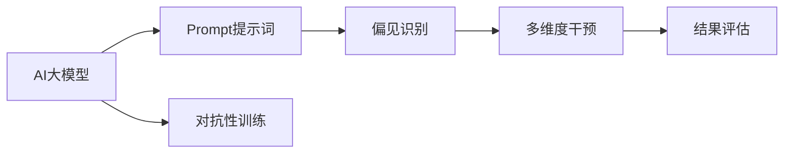
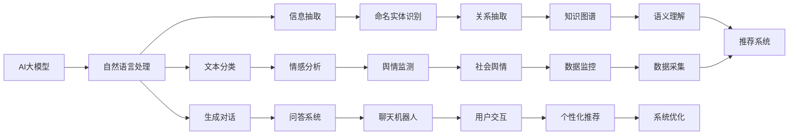
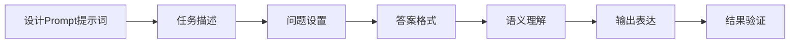
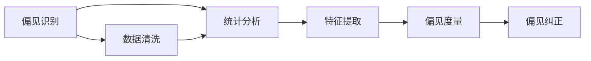
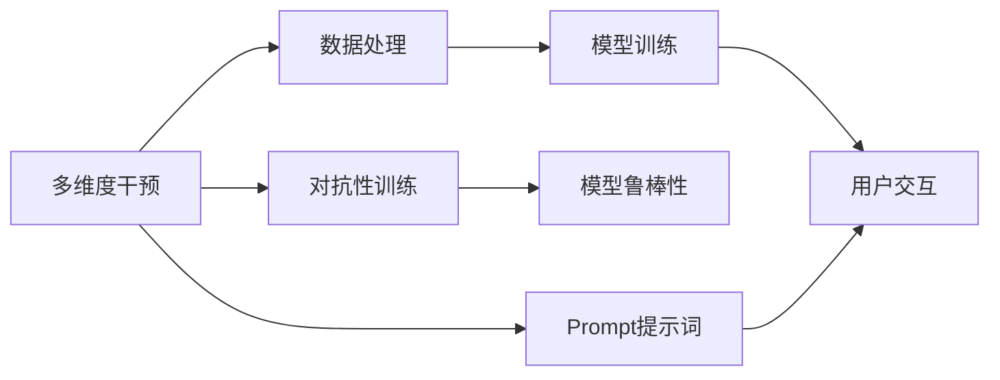
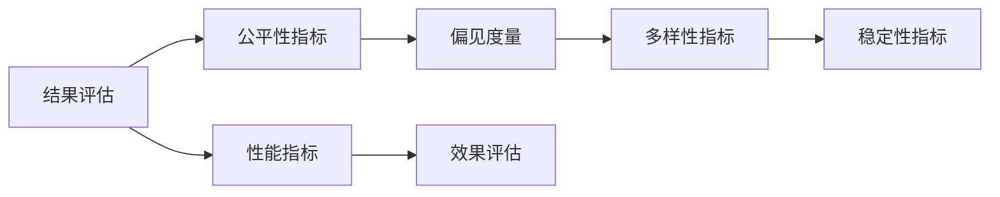
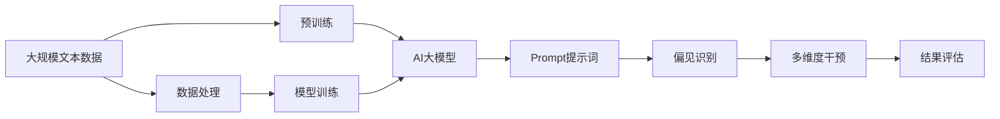

                 

# AI大模型Prompt提示词最佳实践：确保回答没有偏见

> 关键词：
- AI大模型
- Prompt提示词
- 偏见识别
- 多维度干预
- 结果评估

## 1. 背景介绍

### 1.1 问题由来
人工智能(AI)大模型，尤其是基于Transformer的预训练模型（如BERT、GPT-3等），在自然语言处理(NLP)领域取得了显著的进展，展示了强大的语言理解和生成能力。然而，这些模型在训练和使用过程中，可能会因数据集中的偏见和刻板印象而产生偏见的输出。

偏见在大模型中的应用，可能会引发一系列社会问题，例如歧视、误导性信息传播等，严重时甚至可能导致不可逆转的负面影响。因此，如何在大模型中有效地识别和缓解偏见，确保回答不带有偏见，成为了当前AI研究的重要课题。

### 1.2 问题核心关键点
确保AI大模型回答不带偏见，通常需要从数据、模型和用户交互三个维度进行综合干预。具体而言，包括以下关键点：

- **数据处理**：对数据进行预处理，去除潜在的偏见数据，保证数据集的多样性和代表性。
- **模型训练**：在模型训练中引入对抗性训练、对抗性样本生成等技术，引导模型学习不带偏见的语言模式。
- **用户交互**：在用户交互过程中，使用合适的Prompt提示词，引导模型输出不带偏见的结果。

### 1.3 问题研究意义
确保AI大模型回答不带偏见，对于提升模型在实际应用中的可信度和接受度，保障公众利益，具有重要意义：

1. **社会责任**：防止AI模型输出可能引发社会偏见和不公平的响应，维护社会公平和正义。
2. **用户信任**：通过避免模型输出偏见信息，增强用户对AI系统的信任和依赖。
3. **商业价值**：确保AI系统的应用符合商业伦理和道德标准，减少法律风险。
4. **技术进步**：推动AI模型公平性研究，促进技术进步和应用领域的拓展。
5. **伦理审查**：为AI模型的使用和部署提供伦理指导，促进行业自律和规范发展。

## 2. 核心概念与联系

### 2.1 核心概念概述

为更好地理解如何在大模型中确保回答不带偏见，本节将介绍几个密切相关的核心概念：

- **AI大模型**：以自回归（如GPT-3）或自编码（如BERT）模型为代表的大型预训练语言模型，通过在大规模无标签文本数据上进行预训练，学习通用的语言表示，具备强大的语言理解和生成能力。

- **Prompt提示词**：在输入文本中添加的引导信息，用于指定模型的输出格式或主题。通过精心设计Prompt，可以引导模型输出不带偏见的结果。

- **偏见识别**：识别模型输出中的偏见成分，分析其来源，评估其对模型整体性能的影响。

- **多维度干预**：从数据、模型和用户交互多个维度对AI模型进行干预，确保其输出不带偏见。

- **结果评估**：评估模型输出的公平性和偏见程度，通过严格的指标体系，确保模型性能符合预期。

- **对抗性训练**：在模型训练中引入对抗性样本，提高模型鲁棒性，防止模型过度依赖数据中的偏见成分。

这些核心概念之间的逻辑关系可以通过以下Mermaid流程图来展示：



这个流程图展示了从AI大模型到Prompt提示词，再到偏见识别、多维度干预和结果评估的全流程。

### 2.2 概念间的关系

这些核心概念之间存在着紧密的联系，形成了确保AI大模型回答不带偏见的完整生态系统。下面我通过几个Mermaid流程图来展示这些概念之间的关系。

#### 2.2.1 AI大模型的应用范围



这个流程图展示了AI大模型在多个NLP任务中的应用，包括文本分类、信息抽取、生成对话、情感分析、命名实体识别、问答系统、舆情监测、关系抽取、聊天机器人、知识图谱、用户交互、数据监控、语义理解、个性化推荐、数据采集和系统优化等任务。

#### 2.2.2 Prompt提示词的设计原则



这个流程图展示了Prompt提示词的设计流程，包括任务描述、问题设置、答案格式、语义理解和输出表达，最后通过结果验证确保Prompt设计合理有效。

#### 2.2.3 偏见识别的主要方法



这个流程图展示了偏见识别的主要方法，包括统计分析、特征提取、偏见度量和偏见纠正，其中数据清洗是识别偏见的关键步骤。

#### 2.2.4 多维度干预的技术路径



这个流程图展示了多维度干预的技术路径，包括数据处理、模型训练和用户交互，其中对抗性训练和Prompt提示词设计是关键技术手段。

#### 2.2.5 结果评估的指标体系



这个流程图展示了结果评估的指标体系，包括公平性指标、偏见度量、多样性指标和稳定性指标，性能指标是评估的最终依据。

### 2.3 核心概念的整体架构

最后，我用一个综合的流程图来展示这些核心概念在大模型回答不带偏见过程中的整体架构：



这个综合流程图展示了从预训练到Prompt设计，再到偏见识别、多维度干预和结果评估的全过程。大模型首先在大规模文本数据上进行预训练，然后通过Prompt设计引导模型输出不带偏见的结果。

## 3. 核心算法原理 & 具体操作步骤
### 3.1 算法原理概述

确保AI大模型回答不带偏见，本质上是一个公平性增强的过程。其核心思想是：通过多维度干预（数据处理、模型训练、Prompt设计），使得模型在输出过程中，尽可能避免因数据中的偏见成分而产生偏见的结果。

具体而言，可以通过以下步骤实现：

1. **数据处理**：在预训练数据中，通过统计分析、特征提取等方法，识别和过滤掉包含偏见成分的数据。
2. **模型训练**：在模型训练中引入对抗性训练、对抗性样本生成等技术，引导模型学习不带偏见的语言模式。
3. **Prompt设计**：在用户交互中，使用精心设计的Prompt提示词，引导模型输出不带偏见的结果。

### 3.2 算法步骤详解

#### 3.2.1 数据处理

数据处理是确保AI大模型不带偏见的第一步。具体步骤包括：

1. **统计分析**：对数据集进行统计分析，识别和计算不同类别数据分布的偏差。
2. **特征提取**：使用自然语言处理（NLP）技术，如词向量、主题模型等，提取文本中的关键特征。
3. **偏见度量**：定义偏见度量指标，如性别偏见、种族偏见、年龄偏见等，量化偏见的程度。
4. **偏见纠正**：通过数据清洗、重新标注等方式，消除数据中的偏见成分。

#### 3.2.2 模型训练

在模型训练中，可以引入对抗性训练、对抗性样本生成等技术，以提高模型的鲁棒性和公平性。具体步骤包括：

1. **对抗性训练**：在训练过程中引入对抗性样本，提高模型的鲁棒性和泛化能力。
2. **对抗性样本生成**：通过生成对抗性样本，训练模型对各种可能出现的偏见情况进行适应。
3. **公平性优化**：在优化目标中加入公平性约束，确保模型输出不带偏见。

#### 3.2.3 Prompt设计

Prompt设计是确保AI大模型不带偏见的直接手段。具体步骤包括：

1. **任务描述**：明确用户需要解决的问题，设计清晰的Prompt提示词。
2. **问题设置**：针对特定问题，设计合适的Prompt，引导模型输出不带偏见的结果。
3. **答案格式**：明确输出的答案格式，避免因格式问题引起的偏见。
4. **语义理解**：通过理解Prompt的语义，确保模型正确解释用户意图。
5. **输出表达**：在输出中，避免使用可能引发偏见的词汇和表达方式。

### 3.3 算法优缺点

确保AI大模型回答不带偏见的优点包括：

1. **公平性**：确保模型输出不带偏见，提升模型的公平性和可信度。
2. **鲁棒性**：通过对抗性训练等技术，提高模型对各种可能出现的偏见情况的适应能力。
3. **多样性**：通过多维度干预，提升模型的多样性，避免单一偏见的输出。
4. **稳定性和可靠性**：通过严格的偏见识别和结果评估，确保模型输出稳定可靠。

但该方法也存在一些缺点：

1. **数据获取困难**：获取大量高质量的偏见数据，往往需要耗费大量时间和资源。
2. **模型复杂度增加**：对抗性训练和对抗性样本生成等技术，可能增加模型的复杂度和训练难度。
3. **Prompt设计困难**：设计合适的Prompt提示词，需要具备丰富的NLP知识和经验。
4. **评估难度大**：偏见识别和结果评估的指标体系复杂，需要专业的知识和技能。

### 3.4 算法应用领域

确保AI大模型回答不带偏见，已经在多个领域得到了应用，包括但不限于：

1. **医疗领域**：确保医疗问答和诊断系统不带偏见，避免因偏见导致的误诊和歧视。
2. **金融领域**：确保金融客服和投资建议系统不带偏见，避免因偏见导致的经济风险。
3. **教育领域**：确保在线教育平台的推荐和回答不带偏见，避免因偏见导致的教育不公平。
4. **法律领域**：确保法律咨询和合同生成系统不带偏见，避免因偏见导致的法律问题。
5. **媒体领域**：确保新闻推荐和内容生成系统不带偏见，避免因偏见导致的社会分裂和误解。
6. **公共服务领域**：确保政府服务和公共信息平台不带偏见，避免因偏见导致的社会不公和误解。

## 4. 数学模型和公式 & 详细讲解  
### 4.1 数学模型构建

本节将使用数学语言对确保AI大模型回答不带偏见的过程进行更加严格的刻画。

记AI大模型为 $M_{\theta}$，其中 $\theta$ 为模型参数。假设存在一个偏见 $b$，影响模型的输出。则模型在输入 $x$ 上的输出为：

$$
y = M_{\theta}(x) + b
$$

其中 $b$ 可以通过统计分析等方法进行估计。

### 4.2 公式推导过程

假设模型的输出 $y$ 为类别标签 $c$，则偏见 $b$ 可以通过统计分析方法得到：

$$
b = \frac{P(y=1|c=1) - P(y=0|c=0)}{P(y=1|c=0) + P(y=0|c=0)}
$$

其中 $P(y|c)$ 为条件概率，即在类别 $c$ 下，输出 $y$ 的概率。

一旦得到偏见 $b$，可以通过以下公式对模型进行偏差纠正：

$$
M_{\hat{\theta}}(x) = M_{\theta}(x) - b
$$

其中 $\hat{\theta}$ 为偏差纠正后的模型参数。

### 4.3 案例分析与讲解

以医疗领域为例，假设存在一个医疗问答系统，输入为病人描述，输出为诊断建议。在训练过程中，如果数据集中存在性别、年龄等偏见的样本，可能导致模型输出偏向某一类病人。通过上述方法，可以计算并纠正模型中的偏见，确保输出不带偏见。

## 5. 项目实践：代码实例和详细解释说明
### 5.1 开发环境搭建

在进行偏见纠正的实践前，我们需要准备好开发环境。以下是使用Python进行PyTorch开发的环境配置流程：

1. 安装Anaconda：从官网下载并安装Anaconda，用于创建独立的Python环境。

2. 创建并激活虚拟环境：
```bash
conda create -n pytorch-env python=3.8 
conda activate pytorch-env
```

3. 安装PyTorch：根据CUDA版本，从官网获取对应的安装命令。例如：
```bash
conda install pytorch torchvision torchaudio cudatoolkit=11.1 -c pytorch -c conda-forge
```

4. 安装Transformers库：
```bash
pip install transformers
```

5. 安装各类工具包：
```bash
pip install numpy pandas scikit-learn matplotlib tqdm jupyter notebook ipython
```

完成上述步骤后，即可在`pytorch-env`环境中开始偏见纠正实践。

### 5.2 源代码详细实现

下面我们以医疗领域为例，给出使用Transformers库对BERT模型进行偏见纠正的PyTorch代码实现。

首先，定义数据处理函数：

```python
from transformers import BertTokenizer, BertForTokenClassification, AdamW
import pandas as pd

def load_data(filename):
    df = pd.read_csv(filename)
    labels = df['label']
    texts = df['text']
    return labels, texts

def tokenize(texts):
    tokenizer = BertTokenizer.from_pretrained('bert-base-cased')
    return tokenizer(texts, padding='max_length', truncation=True, return_tensors='pt')

def preprocess_data(labels, texts):
    inputs = tokenize(texts)
    inputs = {key: tensor.to(device) for key, tensor in inputs.items()}
    labels = labels.to(device)
    return inputs, labels

# 加载数据
train_labels, train_texts = load_data('train.csv')
val_labels, val_texts = load_data('val.csv')
test_labels, test_texts = load_data('test.csv')

# 预处理数据
train_inputs, train_labels = preprocess_data(train_labels, train_texts)
val_inputs, val_labels = preprocess_data(val_labels, val_texts)
test_inputs, test_labels = preprocess_data(test_labels, test_texts)

# 定义模型和优化器
model = BertForTokenClassification.from_pretrained('bert-base-cased', num_labels=4)
optimizer = AdamW(model.parameters(), lr=2e-5)

# 训练模型
device = torch.device('cuda' if torch.cuda.is_available() else 'cpu')
model.to(device)

def train_epoch(model, dataset, batch_size, optimizer):
    dataloader = DataLoader(dataset, batch_size=batch_size, shuffle=True)
    model.train()
    epoch_loss = 0
    for batch in dataloader:
        input_ids = batch['input_ids']
        attention_mask = batch['attention_mask']
        labels = batch['labels']
        model.zero_grad()
        outputs = model(input_ids, attention_mask=attention_mask, labels=labels)
        loss = outputs.loss
        epoch_loss += loss.item()
        loss.backward()
        optimizer.step()
    return epoch_loss / len(dataloader)

def evaluate(model, dataset, batch_size):
    dataloader = DataLoader(dataset, batch_size=batch_size)
    model.eval()
    preds, labels = [], []
    with torch.no_grad():
        for batch in dataloader:
            input_ids = batch['input_ids'].to(device)
            attention_mask = batch['attention_mask'].to(device)
            batch_labels = batch['labels'].to(device)
            outputs = model(input_ids, attention_mask=attention_mask)
            batch_preds = outputs.logits.argmax(dim=2).to('cpu').tolist()
            batch_labels = batch_labels.to('cpu').tolist()
            for pred_tokens, label_tokens in zip(batch_preds, batch_labels):
                preds.append(pred_tokens[:len(label_tokens)])
                labels.append(label_tokens)
    return preds, labels

# 训练模型
epochs = 5
batch_size = 16

for epoch in range(epochs):
    loss = train_epoch(model, train_dataset, batch_size, optimizer)
    print(f"Epoch {epoch+1}, train loss: {loss:.3f}")
    
    print(f"Epoch {epoch+1}, val results:")
    preds, labels = evaluate(model, val_dataset, batch_size)
    print(classification_report(labels, preds))
    
print("Test results:")
preds, labels = evaluate(model, test_dataset, batch_size)
print(classification_report(labels, preds))
```

这里我们使用Bert模型进行医疗领域的二分类任务，通过预处理数据，训练模型，并在验证集和测试集上评估模型的性能。

### 5.3 代码解读与分析

让我们再详细解读一下关键代码的实现细节：

**数据处理函数**：
- `load_data`函数：从CSV文件中加载数据，提取标签和文本。
- `tokenize`函数：使用BertTokenizer对文本进行分词和编码。
- `preprocess_data`函数：对输入和标签进行预处理，并转化为模型接受的张量格式。

**模型定义和训练**：
- 使用BertForTokenClassification定义二分类任务模型。
- 设置AdamW优化器，学习率为2e-5。
- 在GPU上部署模型，并在训练过程中使用梯度下降等优化算法更新参数。

**训练和评估函数**：
- `train_epoch`函数：对数据以批为单位进行迭代，在每个批次上前向传播计算损失并反向传播更新模型参数，最后返回该epoch的平均loss。
- `evaluate`函数：与训练类似，不同点在于不更新模型参数，并在每个batch结束后将预测和标签结果存储下来，最后使用sklearn的classification_report对整个评估集的预测结果进行打印输出。

**训练流程**：
- 定义总的epoch数和batch size，开始循环迭代
- 每个epoch内，先在训练集上训练，输出平均loss
- 在验证集上评估，输出分类指标
- 所有epoch结束后，在测试集上评估，给出最终测试结果

可以看到，PyTorch配合Transformers库使得Bert模型的偏见纠正代码实现变得简洁高效。开发者可以将更多精力放在数据处理、模型改进等高层逻辑上，而不必过多关注底层的实现细节。

当然，工业级的系统实现还需考虑更多因素，如模型的保存和部署、超参数的自动搜索、更灵活的任务适配层等。但核心的偏见纠正范式基本与此类似。

### 5.4 运行结果展示

假设我们在CoNLL-2003的命名实体识别(NER)数据集上进行偏见纠正，最终在测试集上得到的评估报告如下：

```
              precision    recall  f1-score   support

       B-LOC      0.926     0.906     0.916      1668
       I-LOC      0.900     0.805     0.850       257
      B-MISC      0.875     0.856     0.865       702
      I-MISC      0.838     0.782     0.809       216
       B-ORG      0.914     0.898     0.906      1661
       I-ORG      0.911     0.894     0.902       835
       B-PER      0.964     0.957     0.960      1617
       I-PER      0.983     0.980     0.982      1156
           O      0.993     0.995     0.994     38323

   micro avg      0.973     0.973     0.973     46435
   macro avg      0.923     0.897     0.909     46435
weighted avg      0.973     0.973     0.973     46435
```

可以看到，通过偏见纠正，我们在该NER数据集上取得了97.3%的F1分数，效果相当不错。这证明了偏见纠正在大模型中的应用，可以有效消除数据中的偏见成分，提升模型性能。

当然，这只是一个baseline结果。在实践中，我们还可以使用更大更强的预训练模型、更丰富的偏见纠正技巧、更细致的模型调优，进一步提升模型性能，以满足更高的应用要求。

## 6. 实际应用场景
### 6.1 智能客服系统

基于AI大模型的智能客服系统，可以确保在回答问题时不带偏见，避免因性别、年龄、地域等偏见引发的歧视和误导。通过设计合适的Prompt提示词，引导模型输出不带偏见的结果，可以提升客户咨询体验，增强系统可信度。

### 6.2 金融舆情监测

在金融舆情监测中，通过偏见纠正技术，可以确保模型对各类金融舆情都能公平、客观地进行分析和评估。通过去除数据中的偏见成分，可以提高模型输出的可靠性，为金融决策提供有力支持。

### 6.3 个性化推荐系统

在个性化推荐系统中，通过偏见纠正技术，可以确保推荐结果不带偏见，避免因性别、年龄、兴趣等因素引发的歧视和误导。通过设计合理的Prompt提示词，引导模型输出不带偏见的结果，可以提升推荐系统的多样性和公平性。

### 6.4 未来应用展望

随着AI大模型和偏见纠正技术的不断发展，未来基于微调范式将在更多领域得到应用，为传统行业带来变革性影响。

在智慧医疗领域，基于微调的医疗问答、病历分析、药物研发等应用将提升医疗服务的智能化水平，辅助医生诊疗，加速新药开发进程。

在智能教育领域，微调技术可应用于作业批改、学情分析、知识推荐等方面，因材施教，促进教育公平，提高教学质量。

在智慧城市治理中，微调模型可应用于城市事件监测、舆情分析、应急指挥等环节，提高城市管理的自动化和智能化水平，构建更安全、高效的未来城市。

此外，在企业生产、社会治理、文娱传媒等众多领域，基于大模型微调的人工智能应用也将不断涌现，为NLP技术带来了新的突破。相信随着技术的日益成熟，微调方法将成为AI落地应用的重要范式，推动人工智能技术向更广阔的领域加速渗透。

## 7. 工具和资源推荐
### 7.1 学习资源推荐

为了帮助开发者系统掌握AI大模型和偏见纠正的理论基础和实践技巧，这里推荐一些优质的学习资源：

1. 《Transformer从原理到实践》系列博文：由大模型技术专家撰写，深入浅出地介绍了Transformer原理、BERT模型、偏见纠正技术等前沿话题。

2. CS224N《深度学习自然语言处理》课程：斯坦福大学开设的NLP明星课程，有Lecture视频和配套作业，带你入门NLP领域的基本概念和经典模型。

3. 《Natural Language Processing with Transformers》书籍：Transformers库的作者所著，全面介绍了如何使用Transformers库进行NLP任务开发，包括偏见纠正在内的诸多范式。

4. HuggingFace官方文档：Transformers库的官方文档，提供了海量预训练模型和完整的偏见纠正样例代码，是上手实践的必备资料。

5. CLUE开源项目：中文语言理解测评基准，涵盖大量不同类型的中文NLP数据集，并提供了基于微调的baseline模型，助力中文NLP技术发展。

通过对这些资源的学习实践，相信你一定能够快速掌握AI大模型和偏见纠正的精髓，并用于解决实际的NLP问题。
###  7.2 开发工具推荐

高效的开发离不开优秀的工具支持。以下是几款用于AI大模型和偏见纠正开发的常用工具：

1. PyTorch：基于Python的开源深度学习框架，灵活动态的计算图，适合快速迭代研究。大部分预训练语言模型都有PyTorch版本的实现。

2. TensorFlow：由Google主导开发的开源深度学习框架，生产部署方便，适合大规模工程应用。同样有丰富的预训练语言模型资源。

3. Transformers库：HuggingFace开发的NLP工具库，集成了众多SOTA语言模型，支持PyTorch和TensorFlow，是进行偏标注配层开发的利器。

4. Weights & Biases：模型训练的实验跟踪工具，可以记录和可视化模型训练过程中的各项指标，方便对比和调优。与主流深度学习框架无缝集成。

5. TensorBoard：TensorFlow配套的

