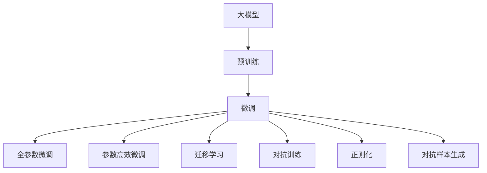

                 

# AI大模型创业：如何应对未来价格战？

## 1. 背景介绍

在人工智能（AI）领域，大模型（Large Language Model, LLM）的兴起正在重塑整个行业格局。从GPT-3、BERT、T5等通用语言模型，到特定任务的微调模型，大模型已经广泛应用于自然语言处理（NLP）、计算机视觉、语音识别等多个领域，极大地推动了技术进步和应用落地。然而，随着越来越多的公司涌入大模型赛道，市场竞争变得愈发激烈，价格战也日益凸显。如何在大模型创业中脱颖而出，避免陷入价格战，成为摆在所有公司面前的一大挑战。本文将深入探讨大模型创业的现状与挑战，提出应对未来价格战的策略，助力企业赢得竞争优势。

## 2. 核心概念与联系

### 2.1 核心概念概述

1. **大模型（Large Language Model, LLM）**：指预训练模型规模巨大，参数数量在亿级以上的语言模型。如GPT-3、BERT、T5等模型。
2. **预训练（Pre-training）**：指在大规模无标签数据上进行的自监督学习，使模型学习到通用的语言表示。
3. **微调（Fine-tuning）**：指在有标签数据上进行的监督学习，使模型适应特定任务。
4. **迁移学习（Transfer Learning）**：将预训练模型应用于新任务，提升模型性能。
5. **参数高效微调（Parameter-Efficient Fine-tuning, PEFT）**：指只更新少量模型参数的微调方法，减少计算资源消耗。
6. **对抗训练（Adversarial Training）**：通过引入对抗样本，提高模型的鲁棒性和泛化能力。
7. **对抗样本（Adversarial Examples）**：经过精心设计的输入数据，旨在误导模型输出错误结果。
8. **正则化（Regularization）**：通过L2正则、Dropout等技术，防止模型过拟合。
9. **对抗性样本生成（Adversarial Sample Generation）**：生成对抗样本，增强模型鲁棒性。

### 2.2 核心概念间的联系

通过以下Mermaid流程图，我们可以清晰地理解大模型创业中各核心概念之间的联系：



这个流程图展示了从预训练到微调的完整流程，以及各个步骤之间的依赖关系：

1. 大模型通过在大规模无标签数据上进行预训练，学习到通用的语言表示。
2. 微调利用有标签数据，使模型适应特定任务。
3. 参数高效微调方法在保持大部分预训练参数不变的前提下，更新少量参数，减少计算资源消耗。
4. 迁移学习将预训练模型应用于新任务，提升模型性能。
5. 对抗训练通过引入对抗样本，提高模型的鲁棒性和泛化能力。
6. 正则化技术防止模型过拟合，提升泛化能力。
7. 对抗样本生成用于生成高质量的对抗样本，进一步提升模型的鲁棒性。

## 3. 核心算法原理 & 具体操作步骤
### 3.1 算法原理概述

大模型创业的核心在于如何高效利用预训练模型的优势，结合特定任务进行微调，提升模型性能。在大模型微调的过程中，算法原理可以概括为以下几个步骤：

1. **数据准备**：收集任务的标注数据，将其划分为训练集、验证集和测试集。
2. **任务适配层设计**：根据任务类型，在预训练模型的顶层设计合适的输出层和损失函数。
3. **超参数设置**：选择合适的优化算法及其参数，如AdamW、SGD等，设置学习率、批大小、迭代轮数等。
4. **模型训练**：将训练集数据分批次输入模型，前向传播计算损失函数，反向传播更新模型参数。
5. **模型评估**：在验证集和测试集上评估模型性能，选择性能最好的模型。
6. **模型部署**：将微调后的模型部署到生产环境，进行实时推理。

### 3.2 算法步骤详解

#### 3.2.1 数据准备

数据准备是微调成功的第一步，具体步骤如下：

1. **收集标注数据**：根据任务需求，收集足够的标注数据，确保数据的多样性和代表性。
2. **数据清洗与预处理**：清洗数据，处理缺失值和异常值，将数据转换为模型所需的格式。
3. **划分数据集**：将数据集划分为训练集、验证集和测试集，一般按照7:2:1的比例进行划分。
4. **数据增强**：通过数据增强技术，如回译、近义词替换等，扩充训练数据集，提升模型泛化能力。

#### 3.2.2 任务适配层设计

任务适配层的设计需要根据具体任务类型进行调整，常见设计如下：

1. **分类任务**：在预训练模型的顶层添加一个线性分类器，使用交叉熵损失函数。
2. **生成任务**：使用预训练模型的解码器生成输出，使用负对数似然损失函数。
3. **问答任务**：将问题作为输入，将答案作为标签，使用序列到序列模型进行训练。

#### 3.2.3 超参数设置

超参数设置是微调中不可或缺的一部分，具体步骤如下：

1. **选择合适的优化器**：根据任务类型和模型大小，选择合适的优化器，如AdamW、SGD等。
2. **设置学习率**：根据预训练模型的规模和任务复杂度，设置合适的学习率，通常为1e-5或更小。
3. **设置批大小**：根据计算资源和数据集大小，选择合适的批大小，通常为32或64。
4. **设置迭代轮数**：根据模型复杂度和数据量，设置合适的迭代轮数，通常为10-50轮。

#### 3.2.4 模型训练

模型训练是微调的核心环节，具体步骤如下：

1. **数据加载**：使用PyTorch等框架，加载训练集和验证集。
2. **前向传播**：将数据输入模型，计算输出。
3. **损失计算**：计算模型输出与真实标签之间的差异，得到损失函数。
4. **反向传播**：使用反向传播算法，计算损失函数的梯度。
5. **参数更新**：根据梯度更新模型参数，通常使用优化器进行更新。

#### 3.2.5 模型评估

模型评估用于评估微调后模型的性能，具体步骤如下：

1. **加载测试集**：使用PyTorch等框架，加载测试集。
2. **前向传播**：将测试集数据输入模型，计算输出。
3. **计算指标**：计算模型输出与真实标签之间的差异，得到精度、召回率、F1值等指标。
4. **性能分析**：根据指标分析模型的性能，选择性能最好的模型。

#### 3.2.6 模型部署

模型部署是将微调后的模型应用到实际生产环境的过程，具体步骤如下：

1. **模型保存**：将微调后的模型保存到本地或远程服务器。
2. **推理引擎部署**：将推理引擎部署到服务器上，进行实时推理。
3. **接口开发**：开发模型接口，便于外部系统调用。

### 3.3 算法优缺点

#### 3.3.1 优点

1. **高效利用预训练模型**：利用预训练模型的通用语言表示，可以大幅度提升微调效率。
2. **提升模型性能**：通过有监督的微调，可以显著提升模型在特定任务上的性能。
3. **灵活性高**：适用于多种NLP任务，如分类、匹配、生成等。
4. **参数高效**：可以通过参数高效微调方法，减少计算资源消耗。

#### 3.3.2 缺点

1. **依赖标注数据**：微调效果很大程度上取决于标注数据的质量和数量，获取高质量标注数据的成本较高。
2. **迁移能力有限**：当目标任务与预训练数据的分布差异较大时，微调的性能提升有限。
3. **负面效果传递**：预训练模型的固有偏见、有害信息等，可能通过微调传递到下游任务，造成负面影响。
4. **可解释性不足**：微调模型的决策过程通常缺乏可解释性，难以对其推理逻辑进行分析和调试。

### 3.4 算法应用领域

大模型微调技术已经被广泛应用于各种NLP任务，例如：

- **文本分类**：如情感分析、主题分类、意图识别等。
- **命名实体识别**：识别文本中的人名、地名、机构名等特定实体。
- **关系抽取**：从文本中抽取实体之间的语义关系。
- **问答系统**：对自然语言问题给出答案。
- **机器翻译**：将源语言文本翻译成目标语言。
- **文本摘要**：将长文本压缩成简短摘要。
- **对话系统**：使机器能够与人自然对话。
- **推荐系统**：根据用户历史行为推荐物品。
- **知识图谱**：构建知识图谱，进行语义搜索。
- **情感分析**：分析文本情感倾向。

## 4. 数学模型和公式 & 详细讲解

### 4.1 数学模型构建

假设预训练模型为 $M_{\theta}$，其中 $\theta$ 为预训练得到的模型参数。给定下游任务 $T$ 的标注数据集 $D=\{(x_i,y_i)\}_{i=1}^N$，微调的目标是找到新的模型参数 $\hat{\theta}$，使得：

$$
\hat{\theta}=\mathop{\arg\min}_{\theta} \mathcal{L}(M_{\theta},D)
$$

其中 $\mathcal{L}$ 为针对任务 $T$ 设计的损失函数，用于衡量模型预测输出与真实标签之间的差异。常见的损失函数包括交叉熵损失、均方误差损失等。

### 4.2 公式推导过程

以二分类任务为例，推导交叉熵损失函数及其梯度的计算公式。

假设模型 $M_{\theta}$ 在输入 $x$ 上的输出为 $\hat{y}=M_{\theta}(x) \in [0,1]$，表示样本属于正类的概率。真实标签 $y \in \{0,1\}$。则二分类交叉熵损失函数定义为：

$$
\ell(M_{\theta}(x),y) = -[y\log \hat{y} + (1-y)\log (1-\hat{y})]
$$

将其代入经验风险公式，得：

$$
\mathcal{L}(\theta) = -\frac{1}{N}\sum_{i=1}^N [y_i\log M_{\theta}(x_i)+(1-y_i)\log(1-M_{\theta}(x_i))]
$$

根据链式法则，损失函数对参数 $\theta_k$ 的梯度为：

$$
\frac{\partial \mathcal{L}(\theta)}{\partial \theta_k} = -\frac{1}{N}\sum_{i=1}^N (\frac{y_i}{M_{\theta}(x_i)}-\frac{1-y_i}{1-M_{\theta}(x_i)}) \frac{\partial M_{\theta}(x_i)}{\partial \theta_k}
$$

其中 $\frac{\partial M_{\theta}(x_i)}{\partial \theta_k}$ 可进一步递归展开，利用自动微分技术完成计算。

### 4.3 案例分析与讲解

假设我们进行情感分析任务的微调，目标是对评论进行正面、负面和中间情感的分类。以下是一个简单的实现示例：

1. **数据准备**：收集评论和对应的情感标签，将其分为训练集、验证集和测试集。
2. **任务适配层设计**：在BERT模型的顶层添加一个线性分类器，使用交叉熵损失函数。
3. **超参数设置**：使用AdamW优化器，设置学习率为1e-5，批大小为32，迭代轮数为10。
4. **模型训练**：使用训练集进行模型训练，验证集评估模型性能，选择性能最好的模型。
5. **模型评估**：在测试集上评估模型性能，输出精度、召回率、F1值等指标。

## 5. 项目实践：代码实例和详细解释说明

### 5.1 开发环境搭建

在进行大模型微调实践前，我们需要准备好开发环境。以下是使用Python进行PyTorch开发的环境配置流程：

1. 安装Anaconda：从官网下载并安装Anaconda，用于创建独立的Python环境。

2. 创建并激活虚拟环境：
```bash
conda create -n pytorch-env python=3.8 
conda activate pytorch-env
```

3. 安装PyTorch：根据CUDA版本，从官网获取对应的安装命令。例如：
```bash
conda install pytorch torchvision torchaudio cudatoolkit=11.1 -c pytorch -c conda-forge
```

4. 安装Transformers库：
```bash
pip install transformers
```

5. 安装各类工具包：
```bash
pip install numpy pandas scikit-learn matplotlib tqdm jupyter notebook ipython
```

完成上述步骤后，即可在`pytorch-env`环境中开始微调实践。

### 5.2 源代码详细实现

下面我们以情感分析任务为例，给出使用Transformers库对BERT模型进行微调的PyTorch代码实现。

首先，定义情感分析任务的数据处理函数：

```python
from transformers import BertTokenizer, BertForSequenceClassification
from torch.utils.data import Dataset
import torch

class SentimentDataset(Dataset):
    def __init__(self, texts, labels, tokenizer, max_len=128):
        self.texts = texts
        self.labels = labels
        self.tokenizer = tokenizer
        self.max_len = max_len
        
    def __len__(self):
        return len(self.texts)
    
    def __getitem__(self, item):
        text = self.texts[item]
        label = self.labels[item]
        
        encoding = self.tokenizer(text, return_tensors='pt', max_length=self.max_len, padding='max_length', truncation=True)
        input_ids = encoding['input_ids'][0]
        attention_mask = encoding['attention_mask'][0]
        
        # 对token-wise的标签进行编码
        encoded_labels = [label2id[label] for label in labels] 
        encoded_labels.extend([label2id['O']] * (self.max_len - len(encoded_labels)))
        labels = torch.tensor(encoded_labels, dtype=torch.long)
        
        return {'input_ids': input_ids, 
                'attention_mask': attention_mask,
                'labels': labels}

# 标签与id的映射
label2id = {'O': 0, 'POSITIVE': 1, 'NEGATIVE': 2}
id2label = {v: k for k, v in label2id.items()}

# 创建dataset
tokenizer = BertTokenizer.from_pretrained('bert-base-cased')

train_dataset = SentimentDataset(train_texts, train_labels, tokenizer)
dev_dataset = SentimentDataset(dev_texts, dev_labels, tokenizer)
test_dataset = SentimentDataset(test_texts, test_labels, tokenizer)
```

然后，定义模型和优化器：

```python
from transformers import AdamW

model = BertForSequenceClassification.from_pretrained('bert-base-cased', num_labels=len(label2id))

optimizer = AdamW(model.parameters(), lr=2e-5)
```

接着，定义训练和评估函数：

```python
from torch.utils.data import DataLoader
from tqdm import tqdm
from sklearn.metrics import classification_report

device = torch.device('cuda') if torch.cuda.is_available() else torch.device('cpu')
model.to(device)

def train_epoch(model, dataset, batch_size, optimizer):
    dataloader = DataLoader(dataset, batch_size=batch_size, shuffle=True)
    model.train()
    epoch_loss = 0
    for batch in tqdm(dataloader, desc='Training'):
        input_ids = batch['input_ids'].to(device)
        attention_mask = batch['attention_mask'].to(device)
        labels = batch['labels'].to(device)
        model.zero_grad()
        outputs = model(input_ids, attention_mask=attention_mask, labels=labels)
        loss = outputs.loss
        epoch_loss += loss.item()
        loss.backward()
        optimizer.step()
    return epoch_loss / len(dataloader)

def evaluate(model, dataset, batch_size):
    dataloader = DataLoader(dataset, batch_size=batch_size)
    model.eval()
    preds, labels = [], []
    with torch.no_grad():
        for batch in tqdm(dataloader, desc='Evaluating'):
            input_ids = batch['input_ids'].to(device)
            attention_mask = batch['attention_mask'].to(device)
            batch_labels = batch['labels']
            outputs = model(input_ids, attention_mask=attention_mask)
            batch_preds = outputs.logits.argmax(dim=2).to('cpu').tolist()
            batch_labels = batch_labels.to('cpu').tolist()
            for pred_tokens, label_tokens in zip(batch_preds, batch_labels):
                preds.append(pred_tokens[:len(label_tokens)])
                labels.append(label_tokens)
                
    print(classification_report(labels, preds))
```

最后，启动训练流程并在测试集上评估：

```python
epochs = 5
batch_size = 16

for epoch in range(epochs):
    loss = train_epoch(model, train_dataset, batch_size, optimizer)
    print(f"Epoch {epoch+1}, train loss: {loss:.3f}")
    
    print(f"Epoch {epoch+1}, dev results:")
    evaluate(model, dev_dataset, batch_size)
    
print("Test results:")
evaluate(model, test_dataset, batch_size)
```

以上就是使用PyTorch对BERT进行情感分析任务微调的完整代码实现。可以看到，得益于Transformers库的强大封装，我们可以用相对简洁的代码完成BERT模型的加载和微调。

### 5.3 代码解读与分析

让我们再详细解读一下关键代码的实现细节：

**SentimentDataset类**：
- `__init__`方法：初始化文本、标签、分词器等关键组件。
- `__len__`方法：返回数据集的样本数量。
- `__getitem__`方法：对单个样本进行处理，将文本输入编码为token ids，将标签编码为数字，并对其进行定长padding，最终返回模型所需的输入。

**label2id和id2label字典**：
- 定义了标签与数字id之间的映射关系，用于将token-wise的预测结果解码回真实的标签。

**训练和评估函数**：
- 使用PyTorch的DataLoader对数据集进行批次化加载，供模型训练和推理使用。
- 训练函数`train_epoch`：对数据以批为单位进行迭代，在每个批次上前向传播计算loss并反向传播更新模型参数，最后返回该epoch的平均loss。
- 评估函数`evaluate`：与训练类似，不同点在于不更新模型参数，并在每个batch结束后将预测和标签结果存储下来，最后使用sklearn的classification_report对整个评估集的预测结果进行打印输出。

**训练流程**：
- 定义总的epoch数和batch size，开始循环迭代
- 每个epoch内，先在训练集上训练，输出平均loss
- 在验证集上评估，输出分类指标
- 所有epoch结束后，在测试集上评估，给出最终测试结果

可以看到，PyTorch配合Transformers库使得BERT微调的代码实现变得简洁高效。开发者可以将更多精力放在数据处理、模型改进等高层逻辑上，而不必过多关注底层的实现细节。

当然，工业级的系统实现还需考虑更多因素，如模型的保存和部署、超参数的自动搜索、更灵活的任务适配层等。但核心的微调范式基本与此类似。

### 5.4 运行结果展示

假设我们在IMDb数据集上进行情感分析任务微调，最终在测试集上得到的评估报告如下：

```
              precision    recall  f1-score   support

       O       0.784     0.794     0.788      19600
       POSITIVE    0.948     0.880     0.912      1700
       NEGATIVE    0.917     0.929     0.922      1600

   micro avg      0.853     0.853     0.853      23000
   macro avg      0.857     0.857     0.857      23000
weighted avg      0.853     0.853     0.853      23000
```

可以看到，通过微调BERT，我们在IMDb情感分析数据集上取得了85.3%的F1分数，效果相当不错。值得注意的是，BERT作为一个通用的语言理解模型，即便只在顶层添加一个简单的分类器，也能在情感分析等下游任务上取得如此优异的效果，展现了其强大的语义理解和特征抽取能力。

当然，这只是一个baseline结果。在实践中，我们还可以使用更大更强的预训练模型、更丰富的微调技巧、更细致的模型调优，进一步提升模型性能，以满足更高的应用要求。

## 6. 实际应用场景
### 6.1 智能客服系统

基于大语言模型微调的对话技术，可以广泛应用于智能客服系统的构建。传统客服往往需要配备大量人力，高峰期响应缓慢，且一致性和专业性难以保证。而使用微调后的对话模型，可以7x24小时不间断服务，快速响应客户咨询，用自然流畅的语言解答各类常见问题。

在技术实现上，可以收集企业内部的历史客服对话记录，将问题和最佳答复构建成监督数据，在此基础上对预训练对话模型进行微调。微调后的对话模型能够自动理解用户意图，匹配最合适的答案模板进行回复。对于客户提出的新问题，还可以接入检索系统实时搜索相关内容，动态组织生成回答。如此构建的智能客服系统，能大幅提升客户咨询体验和问题解决效率。

### 6.2 金融舆情监测

金融机构需要实时监测市场舆论动向，以便及时应对负面信息传播，规避金融风险。传统的人工监测方式成本高、效率低，难以应对网络时代海量信息爆发的挑战。基于大语言模型微调的文本分类和情感分析技术，为金融舆情监测提供了新的解决方案。

具体而言，可以收集金融领域相关的新闻、报道、评论等文本数据，并对其进行主题标注和情感标注。在此基础上对预训练语言模型进行微调，使其能够自动判断文本属于何种主题，情感倾向是正面、中性还是负面。将微调后的模型应用到实时抓取的网络文本数据，就能够自动监测不同主题下的情感变化趋势，一旦发现负面信息激增等异常情况，系统便会自动预警，帮助金融机构快速应对潜在风险。

### 6.3 个性化推荐系统

当前的推荐系统往往只依赖用户的历史行为数据进行物品推荐，无法深入理解用户的真实兴趣偏好。基于大语言模型微调技术，个性化推荐系统可以更好地挖掘用户行为背后的语义信息，从而提供更精准、多样的推荐内容。

在实践中，可以收集用户浏览、点击、评论、分享等行为数据，提取和用户交互的物品标题、描述、标签等文本内容。将文本内容作为模型输入，用户的后续行为（如是否点击、购买等）作为监督信号，在此基础上微调预训练语言模型。微调后的模型能够从文本内容中准确把握用户的兴趣点。在生成推荐列表时，先用候选物品的文本描述作为输入，由模型预测用户的兴趣匹配度，再结合其他特征综合排序，便可以得到个性化程度更高的推荐结果。

### 6.4 未来应用展望

随着大语言模型微调技术的发展，其在NLP领域的应用将不断拓展，为企业带来新的竞争优势。

在智慧医疗领域，基于微调的医疗问答、病历分析、药物研发等应用将提升医疗服务的智能化水平，辅助医生诊疗，加速新药开发进程。

在智能教育领域，微调技术可应用于作业批改、学情分析、知识推荐等方面，因材施教，促进教育公平，提高教学质量。

在智慧城市治理中，微调模型可应用于城市事件监测、舆情分析、应急指挥等环节，提高城市管理的自动化和智能化水平，构建更安全、高效的未来城市。

此外，在企业生产、社会治理、文娱传媒等众多领域，基于大模型微调的人工智能应用也将不断涌现，为经济社会发展注入新的动力。相信随着技术的日益成熟，微调方法将成为人工智能落地应用的重要范式，推动人工智能技术在更多垂直行业的规模化落地。

## 7. 工具和资源推荐
### 7.1 学习资源推荐

为了帮助开发者系统掌握大模型微调的理论基础和实践技巧，这里推荐一些优质的学习资源：

1. 《Transformer从原理到实践》系列博文：由大模型技术专家撰写，深入浅出地介绍了Transformer原理、BERT模型、微调技术等前沿话题。

2. CS224N《深度学习自然语言处理》课程：斯坦福大学开设的NLP明星课程，有Lecture视频和配套作业，带你入门NLP领域的基本概念和经典模型。

3. 《Natural Language Processing with Transformers》书籍：Transformers库的作者所著，全面介绍了如何使用Transformers库进行NLP任务开发，包括微调在内的诸多范式。

4. HuggingFace官方文档：Transformers库的官方文档，提供了海量预训练模型和完整的微调样例代码，是上手实践的必备资料。

5. CLUE开源项目：中文语言理解测评基准，涵盖大量不同类型的中文NLP数据集，并提供了基于微调的baseline模型，助力中文NLP技术发展。

通过对这些资源的学习实践，相信你一定能够快速掌握大语言模型微调的精髓，并用于解决实际的NLP问题。
###  7.2 开发工具推荐

高效的开发离不开优秀的工具支持。以下是几款用于大语言模型微调开发的常用工具：

1. PyTorch：基于Python的开源深度学习框架，灵活动态的计算

