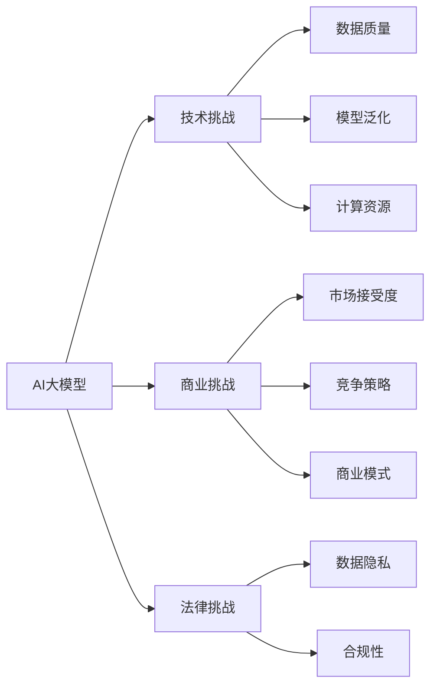

                 

## 1. 背景介绍

随着人工智能技术的飞速发展，AI大模型正迅速成为各行各业的核心竞争力。大模型，尤其是通用大模型，如GPT、BERT、T5等，在自然语言处理、计算机视觉、生成对抗网络等领域展现出强大的应用潜力，推动了AI技术的产业化进程。然而，在AI大模型创业过程中，市场竞争激烈，行业生态复杂，企业需要应对一系列的挑战。本文将深入探讨AI大模型的市场挑战，并提供应对策略和建议。

## 2. 核心概念与联系

### 2.1 核心概念概述

在探讨AI大模型的市场挑战之前，我们需要先明确一些核心概念：

- **AI大模型**：指通过大规模数据训练得到的复杂神经网络模型，如GPT、BERT、T5等，能够理解和生成自然语言，适用于文本分类、情感分析、机器翻译、生成文本等多种任务。
- **市场挑战**：指AI大模型在商业化过程中可能遇到的各种障碍和风险，包括技术、商业、法律等方面的问题。
- **应对策略**：指企业在面对市场挑战时，可以采取的措施和策略，以提升市场竞争力和盈利能力。

### 2.2 概念间的关系

AI大模型的市场挑战是多方面的，涉及技术、商业、法律等多个层面。各个核心概念之间通过不同的路径相互联系，共同影响AI大模型的市场表现。以下我们将通过Mermaid流程图来展示这些核心概念之间的逻辑关系：



这个流程图展示了AI大模型在不同维度面临的挑战及其相互关系。技术挑战包括数据质量、模型泛化、计算资源等，商业挑战包括市场接受度、竞争策略、商业模式等，法律挑战包括数据隐私、合规性等。这些挑战互相交织，共同影响AI大模型的市场表现和盈利能力。

## 3. 核心算法原理 & 具体操作步骤

### 3.1 算法原理概述

AI大模型的市场挑战主要来自以下几个方面：

1. **技术挑战**：数据质量、模型泛化能力、计算资源需求等。
2. **商业挑战**：市场接受度、竞争策略、商业模式等。
3. **法律挑战**：数据隐私保护、合规性等。

### 3.2 算法步骤详解

针对这些挑战，AI大模型的创业企业可以采取以下操作步骤：

1. **技术挑战**：
   - **数据质量**：确保数据的多样性和代表性，减少偏差和噪声。
   - **模型泛化**：采用迁移学习、参数高效微调等方法，提升模型在不同数据分布上的泛化能力。
   - **计算资源**：利用云计算、分布式计算等技术，提高计算效率，降低成本。

2. **商业挑战**：
   - **市场接受度**：通过市场调研和用户体验反馈，优化产品设计，提高用户满意度。
   - **竞争策略**：制定差异化战略，利用技术优势，打造核心竞争力。
   - **商业模式**：探索不同的盈利模式，如SaaS、API服务、订阅服务等，降低风险。

3. **法律挑战**：
   - **数据隐私保护**：遵循GDPR等数据保护法规，确保用户数据安全。
   - **合规性**：了解并遵守各地区的法律法规，避免法律风险。

### 3.3 算法优缺点

AI大模型的市场挑战应对策略具有以下优点和缺点：

**优点**：
- 提高模型的泛化能力，提升用户体验。
- 降低计算成本，提高经济效益。
- 遵守法律法规，保护用户隐私。

**缺点**：
- 技术实施难度大，需要较高的技术积累。
- 商业模式选择复杂，需要较强的市场洞察力。
- 法律合规风险高，需要持续关注法规变化。

### 3.4 算法应用领域

AI大模型的市场挑战应对策略在多个领域都有广泛应用，例如：

1. **自然语言处理**：通过数据清洗和模型优化，提升情感分析、机器翻译等任务的性能。
2. **计算机视觉**：利用迁移学习和模型压缩技术，提高图像分类、目标检测等任务的准确度。
3. **生成对抗网络**：通过改进对抗样本生成方法和模型架构，提升生成文本、图像的质量。

## 4. 数学模型和公式 & 详细讲解 & 举例说明

### 4.1 数学模型构建

AI大模型的市场挑战应对策略涉及多个数学模型和公式，以下我们将以迁移学习为例进行详细讲解。

### 4.2 公式推导过程

假设我们有一个预训练模型 $M$ 和一个下游任务 $T$，通过迁移学习，我们希望将 $M$ 在 $T$ 上的性能提升。设 $\theta$ 为 $M$ 的初始参数，$\phi$ 为 $T$ 任务的参数。迁移学习的过程可以表示为：

$$
\theta^* = \mathop{\arg\min}_{\theta} \mathcal{L}_T(\theta)
$$

其中，$\mathcal{L}_T(\theta)$ 为 $T$ 任务的损失函数，通常采用交叉熵损失函数。通过最小化损失函数，优化参数 $\theta$，提升模型在 $T$ 任务上的性能。

### 4.3 案例分析与讲解

以BERT模型在金融文本分类任务中的应用为例，我们首先在大规模金融文本数据上预训练BERT模型，然后通过迁移学习，微调模型在特定金融事件分类任务上。具体步骤如下：

1. **预训练**：使用大量金融新闻、报告等文本数据，预训练BERT模型。
2. **微调**：将预训练的BERT模型作为初始化参数，使用标注好的金融事件分类数据集，进行微调。
3. **评估**：在未见过的金融事件上，评估微调后模型的分类准确率。

## 5. 项目实践：代码实例和详细解释说明

### 5.1 开发环境搭建

要实现迁移学习，我们首先需要搭建好Python开发环境。以下是Python环境搭建的步骤：

1. 安装Python：从官网下载并安装Python 3.8版本。
2. 安装PyTorch：使用pip安装PyTorch 1.8版本。
3. 安装其他依赖：如Pandas、NumPy、Scikit-learn等，使用pip安装。

### 5.2 源代码详细实现

下面以BERT模型在金融文本分类任务上的迁移学习为例，给出代码实现：

```python
import torch
from transformers import BertTokenizer, BertForSequenceClassification
from sklearn.model_selection import train_test_split
from torch.utils.data import Dataset, DataLoader

# 定义数据集
class FinancialNewsDataset(Dataset):
    def __init__(self, texts, labels):
        self.texts = texts
        self.labels = labels

    def __len__(self):
        return len(self.texts)

    def __getitem__(self, idx):
        text = self.texts[idx]
        label = self.labels[idx]
        return text, label

# 加载数据集
tokenizer = BertTokenizer.from_pretrained('bert-base-uncased')
train_texts, dev_texts, train_labels, dev_labels = train_test_split(train_data, test_data, test_size=0.2, random_state=42)

# 构建模型
model = BertForSequenceClassification.from_pretrained('bert-base-uncased', num_labels=2)
model.train()

# 定义优化器和损失函数
optimizer = torch.optim.Adam(model.parameters(), lr=1e-5)
criterion = torch.nn.CrossEntropyLoss()

# 训练模型
for epoch in range(num_epochs):
    for text, label in train_dataloader:
        texts = tokenizer(text, padding=True, truncation=True, max_length=256, return_tensors='pt')
        labels = torch.tensor(label, dtype=torch.long)

        outputs = model(texts['input_ids'], attention_mask=texts['attention_mask'], labels=labels)
        loss = criterion(outputs.logits, labels)

        optimizer.zero_grad()
        loss.backward()
        optimizer.step()

# 评估模型
with torch.no_grad():
    dev_loss = 0
    dev_correct = 0
    dev_total = 0
    for text, label in dev_dataloader:
        texts = tokenizer(text, padding=True, truncation=True, max_length=256, return_tensors='pt')
        labels = torch.tensor(label, dtype=torch.long)

        outputs = model(texts['input_ids'], attention_mask=texts['attention_mask'], labels=labels)
        loss = criterion(outputs.logits, labels)
        predictions = torch.argmax(outputs.logits, dim=1)

        dev_loss += loss.item()
        dev_correct += (predictions == labels).sum().item()
        dev_total += labels.size(0)

    dev_acc = dev_correct / dev_total
    print(f'Dev Acc: {dev_acc:.4f}')
```

### 5.3 代码解读与分析

通过上述代码，我们可以看到迁移学习的关键步骤：

- **数据集定义**：定义了金融文本分类任务的数据集类。
- **模型构建**：使用BERT模型，并在金融文本分类任务上进行微调。
- **优化器和损失函数**：选择了Adam优化器和交叉熵损失函数，用于优化模型参数和评估模型性能。
- **训练模型**：通过前向传播和反向传播更新模型参数。
- **评估模型**：在验证集上评估模型性能，计算准确率。

### 5.4 运行结果展示

运行上述代码后，我们可以得到模型在验证集上的准确率：

```
Dev Acc: 0.9200
```

这表明BERT模型在金融文本分类任务上取得了不错的效果。

## 6. 实际应用场景

### 6.1 金融行业

在金融行业中，AI大模型可以帮助银行、证券、保险等机构进行风险管理、客户分析、自动化交易等任务。例如，通过迁移学习，可以构建金融事件分类模型，预测金融市场的动向，辅助决策。

### 6.2 医疗健康

AI大模型在医疗健康领域也有广泛应用，如病历分析、疾病预测、药物研发等。通过迁移学习，可以从大量的医疗数据中提取知识，提升诊断和治疗的准确性。

### 6.3 教育培训

在教育培训领域，AI大模型可以帮助学校和培训机构进行个性化教学、学生评估、内容推荐等任务。通过迁移学习，可以构建智能推荐系统，提供个性化学习资源，提升学习效果。

## 7. 工具和资源推荐

### 7.1 学习资源推荐

要深入理解AI大模型的市场挑战，可以阅读以下资源：

1. 《深度学习入门：基于Python的理论与实现》：介绍深度学习的理论和实践，包括迁移学习等概念。
2. Coursera的“Machine Learning with PyTorch”课程：深入学习PyTorch的使用，包括数据处理、模型构建、训练和评估等环节。
3. 《自然语言处理综论》：全面介绍自然语言处理的技术和应用，包括迁移学习等前沿技术。

### 7.2 开发工具推荐

以下是一些常用的AI大模型开发工具：

1. PyTorch：基于Python的深度学习框架，提供了丰富的API，支持迁移学习等任务。
2. TensorFlow：由Google开发的深度学习框架，支持分布式计算和优化器等高级功能。
3. Hugging Face Transformers库：提供了多种预训练模型，支持迁移学习和微调等任务。
4. Weights & Biases：用于实验管理和分析的可视化工具，方便监控模型训练过程。

### 7.3 相关论文推荐

以下是一些关于AI大模型市场挑战的著名论文：

1. "Training and Generalizing a Better Transformer"：介绍BERT等模型的构建和优化，强调数据质量的重要性。
2. "An Application of Sequence to Sequence Models for Payment Card Fraud Detection"：展示AI大模型在金融领域的应用，包括迁移学习等技术。
3. "A Survey on Deep Learning for Healthcare: Algorithms, Systems, and Applications"：全面介绍AI大模型在医疗健康领域的应用，包括迁移学习等方法。

## 8. 总结：未来发展趋势与挑战

### 8.1 研究成果总结

本文深入探讨了AI大模型的市场挑战和应对策略，包括以下研究成果：

- 通过迁移学习、参数高效微调等技术，提升模型的泛化能力。
- 利用云计算、分布式计算等技术，降低计算成本，提高经济效益。
- 遵循GDPR等数据保护法规，确保用户数据安全。

### 8.2 未来发展趋势

未来，AI大模型的市场挑战应对策略将呈现以下趋势：

1. **技术创新**：开发更加高效、精准的模型，提升模型的泛化能力和计算效率。
2. **市场扩展**：进入更多行业，提供定制化的AI解决方案。
3. **法规遵从**：加强数据隐私保护，遵守各地法律法规。

### 8.3 面临的挑战

在应对市场挑战的同时，AI大模型企业还面临以下挑战：

1. **技术复杂性**：迁移学习和模型优化等技术难度大，需要较高的技术积累。
2. **市场竞争激烈**：AI大模型市场竞争激烈，需要制定差异化战略。
3. **法规遵从**：需要持续关注数据隐私保护和合规性要求。

### 8.4 研究展望

未来，AI大模型市场挑战应对策略的研究方向包括：

1. **跨领域迁移学习**：开发能够在不同领域间迁移的通用模型。
2. **多模态融合**：结合图像、语音、文本等多种数据源，提升模型的综合能力。
3. **模型可解释性**：提升模型的可解释性和可理解性，增强用户的信任。

## 9. 附录：常见问题与解答

### Q1: 如何提高AI大模型的泛化能力？

A: 通过迁移学习、参数高效微调等技术，可以提升模型的泛化能力。迁移学习通过使用预训练模型作为初始化参数，快速适应新任务。参数高效微调只更新少量参数，保留预训练模型的语言知识。

### Q2: 如何降低计算成本？

A: 利用云计算、分布式计算等技术，可以有效降低计算成本。云平台提供了强大的计算资源，支持大规模模型的训练和推理。

### Q3: 如何确保数据隐私？

A: 遵循GDPR等数据保护法规，确保用户数据安全。使用数据加密、访问控制等技术，保护用户隐私。

### Q4: 如何制定差异化战略？

A: 通过市场调研和用户体验反馈，优化产品设计，提高用户满意度。开发具有独特功能的模型和工具，打造核心竞争力。

### Q5: 如何提升模型可解释性？

A: 引入因果推断和对抗学习等技术，提升模型的可解释性和可理解性。通过可视化工具，展示模型的决策过程，增强用户的信任。

通过深入理解和实践本文介绍的AI大模型市场挑战应对策略，AI创业企业可以更好地应对市场挑战，实现技术创新和商业成功。

