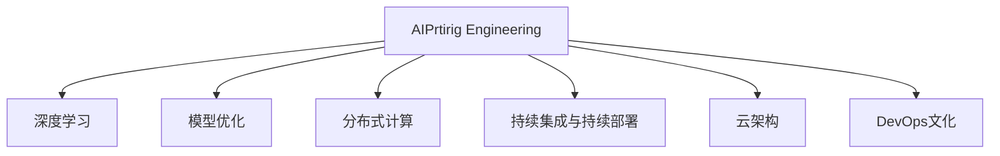
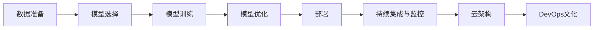
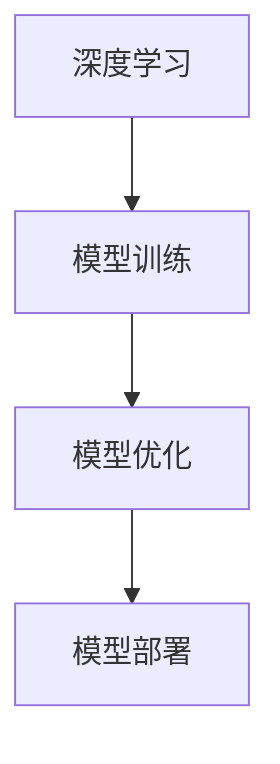
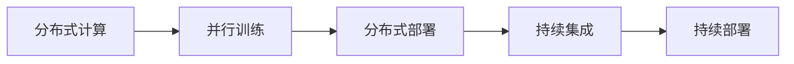
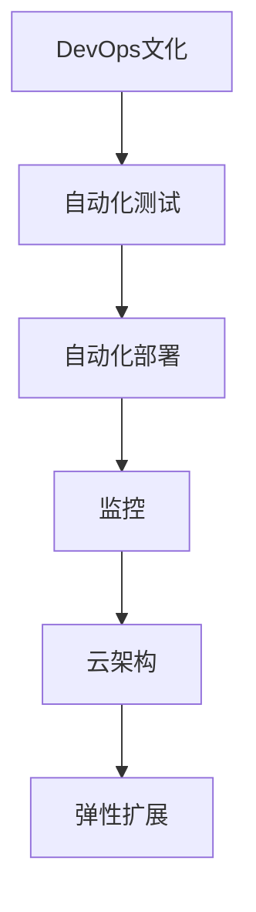
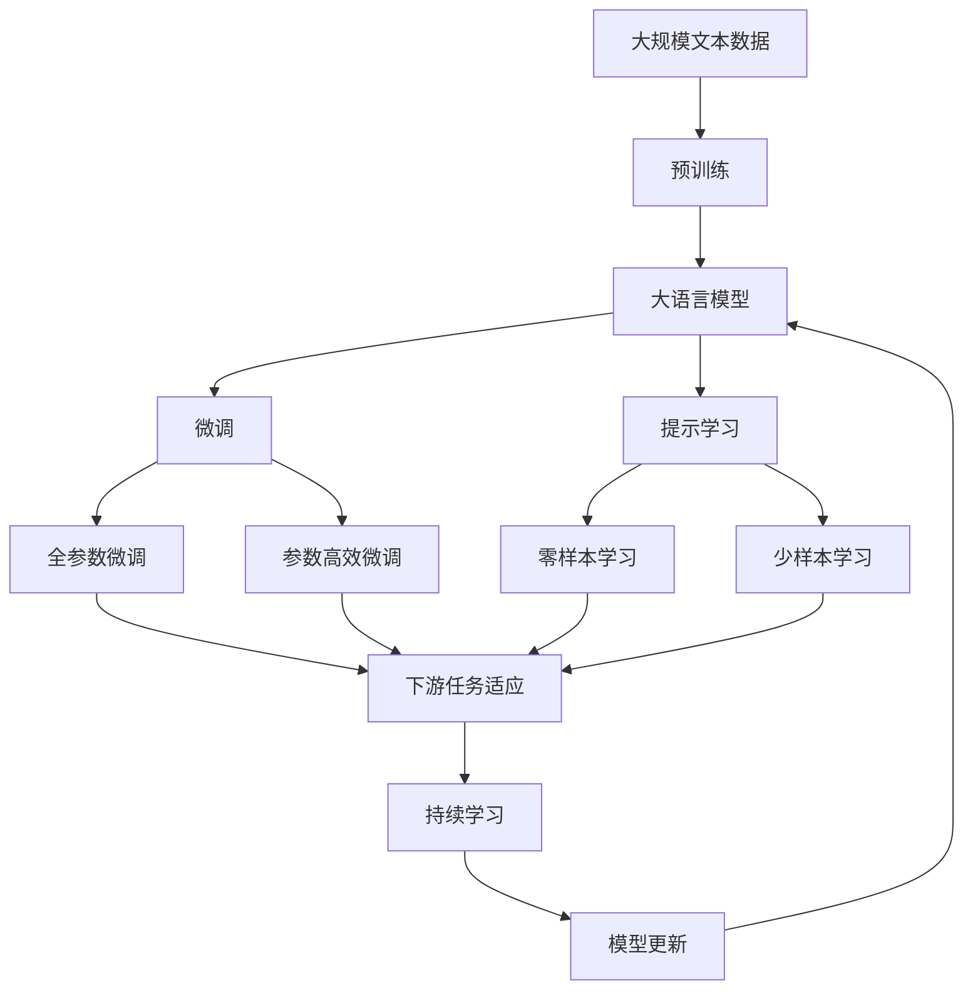

                 

## AI工程学：应用开发实战手册

> 关键词：AI工程学、应用开发、实战、框架、系统设计、大数据、深度学习、模型优化、持续集成、云架构、DevOps

## 1. 背景介绍

### 1.1 问题由来
在人工智能(AI)技术快速发展的大背景下，AI工程学已成为推动AI应用落地的重要方向。AI工程学不仅关注算法的优化与创新，更强调从端到端的系统构建，将AI技术与业务深度融合，以实现高效率、高性能的AI系统。本文聚焦于AI工程学的应用开发实战，通过系统梳理和案例分析，详细介绍AI工程学的关键概念、技术原理、工程实践及应用场景，旨在帮助AI开发者快速掌握AI工程学开发技巧，构建高效、可扩展的AI系统。

### 1.2 问题核心关键点
AI工程学的核心在于将AI技术与实际业务紧密结合，构建一个完整的系统，并通过系统工程方法论来确保系统的稳定性、可扩展性、可维护性及高效性。主要关注点包括：

- **模型选择与设计**：根据实际业务需求，选择合适的AI模型进行构建。
- **数据准备与处理**：收集、清洗、标注数据，以便模型训练与测试。
- **模型训练与优化**：使用高效的训练框架和算法，优化模型性能。
- **系统架构与部署**：构建分布式、高性能的AI系统架构，实现模型部署与运行。
- **持续集成与监控**：通过CI/CD管道和监控系统，确保系统的持续改进与稳定运行。

本文将围绕这些核心点，详细阐述AI工程学的工程实践，并结合实际案例，提供全面的技术指导。

### 1.3 问题研究意义
掌握AI工程学的开发实践，对于加速AI技术的落地应用，提升业务效率，具有重要意义：

1. **加速AI技术应用**：通过系统化的方法论，可以快速构建和部署AI应用，缩短项目周期。
2. **提升系统性能**：通过科学的模型选择与优化，可以提高AI系统在业务场景中的表现，满足实际需求。
3. **促进业务融合**：将AI技术与业务流程深度结合，提升业务决策的智能化水平。
4. **增强系统可扩展性**：构建可扩展的AI系统架构，确保系统能够应对业务规模的变化。
5. **保障系统稳定性**：通过持续集成与监控，确保系统的持续改进与稳定运行，减少故障和维护成本。

## 2. 核心概念与联系

### 2.1 核心概念概述

为更好地理解AI工程学的应用开发实战，本节将介绍几个密切相关的核心概念：

- **AI工程学(AI Engineering)**：专注于将AI算法和模型应用于实际业务问题，包括数据预处理、模型训练、系统架构设计、部署与运维等全流程管理。
- **深度学习(Deep Learning)**：利用神经网络进行模式识别与预测，是AI工程学中常用的技术手段。
- **模型优化(Optimization)**：通过调整模型参数、优化算法等手段，提高模型的性能。
- **分布式计算(Distributed Computing)**：将计算任务分散到多个节点上并行处理，提高计算效率。
- **持续集成与持续部署(CI/CD)**：自动化地管理代码的构建、测试与部署，确保软件交付的稳定性和一致性。
- **云架构(Cloud Architecture)**：利用云服务构建弹性、可扩展的AI系统，降低基础设施成本。
- **DevOps文化**：通过持续集成、自动化测试与部署等手段，提升软件开发效率和质量，降低运维成本。

这些核心概念之间的逻辑关系可以通过以下Mermaid流程图来展示：



这个流程图展示了一系列核心概念，以及它们之间的相互联系和依赖关系。

### 2.2 概念间的关系

这些核心概念之间存在着紧密的联系，形成了AI工程学开发的全流程。下面我通过几个Mermaid流程图来展示这些概念之间的关系。

#### 2.2.1 AI工程学的全流程



这个流程图展示了AI工程学的全流程，从数据准备到模型优化，再到部署与持续集成，最终通过云架构和DevOps文化确保系统的稳定性和可扩展性。

#### 2.2.2 深度学习与模型优化



这个流程图展示了深度学习在模型优化中的应用，从模型训练到优化，最终部署到实际业务中。

#### 2.2.3 分布式计算与持续集成



这个流程图展示了分布式计算在并行训练和部署中的应用，通过持续集成和持续部署确保系统的稳定性和可扩展性。

#### 2.2.4 DevOps文化与云架构



这个流程图展示了DevOps文化在自动化测试、自动化部署、监控和云架构中的应用，通过弹性扩展确保系统的可扩展性和稳定性。

### 2.3 核心概念的整体架构

最后，我们用一个综合的流程图来展示这些核心概念在大模型微调过程中的整体架构：



这个综合流程图展示了从预训练到微调，再到持续学习的完整过程。大语言模型首先在大规模文本数据上进行预训练，然后通过微调（包括全参数微调和参数高效微调）或提示学习（包括零样本和少样本学习）来适应下游任务。最后，通过持续学习技术，模型可以不断更新和适应新的任务和数据。 通过这些流程图，我们可以更清晰地理解AI工程学开发过程中各个核心概念的关系和作用，为后续深入讨论具体的工程实践提供基础。

## 3. 核心算法原理 & 具体操作步骤

### 3.1 算法原理概述

AI工程学的应用开发实践主要围绕数据、模型和系统架构三个关键环节展开。以下是对这些关键环节的算法原理概述：

1. **数据准备**：通过数据清洗、标注和特征工程，将原始数据转换为可用于模型训练的格式。
2. **模型训练**：利用深度学习框架，选择合适的模型结构，对标注数据进行训练，优化模型参数。
3. **模型优化**：通过正则化、剪枝、量化等手段，提高模型性能和可解释性。
4. **系统架构设计**：根据业务需求，设计分布式、可扩展的系统架构，确保系统的稳定性和高效性。
5. **部署与运维**：通过CI/CD管道和监控系统，确保系统的持续改进与稳定运行。

### 3.2 算法步骤详解

#### 3.2.1 数据准备
- **数据清洗**：处理缺失值、异常值等，确保数据质量。
- **数据标注**：对数据进行标注，生成训练集、验证集和测试集。
- **特征工程**：对数据进行特征提取和转换，生成模型输入。

#### 3.2.2 模型训练
- **模型选择**：根据任务需求选择合适的模型结构，如卷积神经网络(CNN)、循环神经网络(RNN)、Transformer等。
- **训练框架**：使用TensorFlow、PyTorch等深度学习框架进行模型训练。
- **超参数调优**：调整学习率、批量大小、正则化系数等超参数，以优化模型性能。

#### 3.2.3 模型优化
- **正则化**：通过L1、L2正则、Dropout等手段，防止模型过拟合。
- **剪枝**：去除冗余参数，提高模型压缩率。
- **量化**：将浮点模型转换为定点模型，降低计算开销。

#### 3.2.4 系统架构设计
- **分布式计算**：采用Spark、Hadoop等分布式计算框架，将计算任务分散到多个节点上并行处理。
- **容器化**：使用Docker等容器化技术，确保系统的可移植性和一致性。
- **微服务架构**：将系统拆分为多个微服务，实现模块化和可扩展性。

#### 3.2.5 部署与运维
- **持续集成**：通过GitHub、Jenkins等工具，自动化构建、测试和部署。
- **持续部署**：通过CI/CD管道，确保新版本的快速发布和回滚。
- **监控与日志**：使用Prometheus、Grafana等工具，实时监控系统状态和性能指标。

### 3.3 算法优缺点

AI工程学在应用开发实践中具有以下优点：

1. **系统性**：通过系统化的流程和方法，可以确保AI应用的稳定性、可扩展性和可维护性。
2. **高效性**：利用分布式计算和自动化技术，提高开发和部署效率，缩短项目周期。
3. **灵活性**：支持多种模型和框架，适应不同业务需求。
4. **可扩展性**：通过云架构和DevOps文化，确保系统的可扩展性和可部署性。

同时，AI工程学也存在以下缺点：

1. **技术门槛高**：涉及多个领域的知识和技术，需要综合性的工程技能。
2. **复杂性高**：系统架构和部署过程复杂，需要细致的设计和调试。
3. **资源消耗大**：大规模数据和模型的训练、部署需要高性能计算资源。
4. **依赖环境**：需要依赖各种工具和框架，对开发环境要求较高。

### 3.4 算法应用领域

AI工程学的应用领域非常广泛，涉及多个行业和领域，例如：

- **金融科技**：用于信用评分、反欺诈检测、风险管理等。
- **医疗健康**：用于疾病诊断、影像分析、个性化推荐等。
- **智能制造**：用于质量检测、故障预测、优化生产计划等。
- **智慧城市**：用于交通管理、环境监测、公共安全等。
- **电商零售**：用于客户推荐、广告投放、库存管理等。
- **智能家居**：用于语音识别、情感分析、智能控制等。

## 4. 数学模型和公式 & 详细讲解 & 举例说明

### 4.1 数学模型构建

在AI工程学的应用开发实战中，数学模型和公式是理论基础。以下是对常见数学模型的详细构建和解释：

#### 4.1.1 线性回归模型
- **目标**：预测连续数值，如房价预测、股票价格预测。
- **模型**：
  $$
  y = \theta_0 + \theta_1 x_1 + \theta_2 x_2 + \cdots + \theta_n x_n + \epsilon
  $$
- **解释**：$\theta$为模型参数，$x$为特征向量，$y$为预测值，$\epsilon$为误差项。

#### 4.1.2 逻辑回归模型
- **目标**：预测二分类问题，如判断是否购买某产品。
- **模型**：
  $$
  P(y=1|x) = \sigma(\theta_0 + \theta_1 x_1 + \theta_2 x_2 + \cdots + \theta_n x_n)
  $$
- **解释**：$\sigma$为sigmoid函数，$P(y=1|x)$表示预测为正类的概率。

#### 4.1.3 卷积神经网络(CNN)
- **目标**：处理图像和视频数据，如图像分类、目标检测。
- **模型**：
  $$
  y = h_1 \star w_1 + h_2 \star w_2 + \cdots + h_n \star w_n + b
  $$
- **解释**：$h$为卷积特征图，$w$为卷积核，$b$为偏置项。

#### 4.1.4 循环神经网络(RNN)
- **目标**：处理序列数据，如自然语言处理、时间序列预测。
- **模型**：
  $$
  h_t = f(h_{t-1}, x_t)
  $$
- **解释**：$f$为隐藏状态更新函数，$h$为隐藏状态。

#### 4.1.5 Transformer
- **目标**：处理序列数据，如机器翻译、文本生成。
- **模型**：
  $$
  y = \mathrm{softmax}(AH^T + B)H
  $$
- **解释**：$A$、$B$为线性变换矩阵，$H$为编码器输出，$\mathrm{softmax}$为softmax函数。

### 4.2 公式推导过程

#### 4.2.1 线性回归模型推导
- **公式**：
  $$
  y = \theta_0 + \theta_1 x_1 + \theta_2 x_2 + \cdots + \theta_n x_n + \epsilon
  $$
- **推导**：
  $$
  \min_{\theta} \frac{1}{2N} \sum_{i=1}^N (y_i - \theta_0 - \theta_1 x_{i1} - \theta_2 x_{i2} - \cdots - \theta_n x_{in})^2
  $$
- **解释**：最小化预测误差平方和，求解模型参数$\theta$。

#### 4.2.2 逻辑回归模型推导
- **公式**：
  $$
  P(y=1|x) = \sigma(\theta_0 + \theta_1 x_1 + \theta_2 x_2 + \cdots + \theta_n x_n)
  $$
- **推导**：
  $$
  \min_{\theta} \frac{1}{N} \sum_{i=1}^N \log(-y_i \log P(y=1|x_i) - (1-y_i) \log (1-P(y=1|x_i)))
  $$
- **解释**：使用交叉熵损失函数，求解模型参数$\theta$。

#### 4.2.3 卷积神经网络(CNN)推导
- **公式**：
  $$
  y = h_1 \star w_1 + h_2 \star w_2 + \cdots + h_n \star w_n + b
  $$
- **推导**：
  $$
  h_t = f(h_{t-1}, x_t)
  $$
- **解释**：利用卷积操作和池化操作，提取特征。

#### 4.2.4 循环神经网络(RNN)推导
- **公式**：
  $$
  h_t = f(h_{t-1}, x_t)
  $$
- **推导**：
  $$
  h_t = \sigma(Wx_t + Uh_{t-1} + b)
  $$
- **解释**：利用递归神经网络结构，处理序列数据。

#### 4.2.5 Transformer推导
- **公式**：
  $$
  y = \mathrm{softmax}(AH^T + B)H
  $$
- **推导**：
  $$
  H = \mathrm{Attention}(Q, K, V)
  $$
- **解释**：利用自注意力机制，处理序列数据。

### 4.3 案例分析与讲解

#### 4.3.1 房价预测
- **目标**：利用历史房价数据，预测未来房价。
- **模型**：线性回归模型。
- **代码实现**：
  ```python
  from sklearn.linear_model import LinearRegression
  model = LinearRegression()
  model.fit(X_train, y_train)
  y_pred = model.predict(X_test)
  ```

#### 4.3.2 图像分类
- **目标**：识别图像中的物体类别。
- **模型**：卷积神经网络。
- **代码实现**：
  ```python
  from keras.models import Sequential
  from keras.layers import Conv2D, MaxPooling2D, Flatten, Dense
  model = Sequential()
  model.add(Conv2D(32, (3, 3), activation='relu', input_shape=(28, 28, 1)))
  model.add(MaxPooling2D((2, 2)))
  model.add(Flatten())
  model.add(Dense(10, activation='softmax'))
  model.compile(optimizer='adam', loss='categorical_crossentropy', metrics=['accuracy'])
  model.fit(X_train, y_train, epochs=10, batch_size=32)
  ```

#### 4.3.3 文本分类
- **目标**：将文本分为不同类别，如情感分析、新闻分类。
- **模型**：循环神经网络。
- **代码实现**：
  ```python
  from keras.models import Sequential
  from keras.layers import LSTM, Embedding, Dense
  model = Sequential()
  model.add(Embedding(input_dim=10000, output_dim=128, input_length=100))
  model.add(LSTM(64))
  model.add(Dense(10, activation='softmax'))
  model.compile(optimizer='adam', loss='categorical_crossentropy', metrics=['accuracy'])
  model.fit(X_train, y_train, epochs=10, batch_size=32)
  ```

#### 4.3.4 机器翻译
- **目标**：将一种语言的句子翻译成另一种语言。
- **模型**：Transformer。
- **代码实现**：
  ```python
  from transformers import TFAutoModelForSeq2SeqLM, BertTokenizer, TFSequenceClassifier
  tokenizer = BertTokenizer.from_pretrained('bert-base-uncased')
  model = TFAutoModelForSeq2SeqLM.from_pretrained('t5-small')
  input_ids = tokenizer.encode_plus(source_text, return_tensors='tf')
  outputs = model.generate(input_ids, max_length=10, num_beams=4, early_stopping=True)
  translated_text = tokenizer.decode(outputs[0], skip_special_tokens=True)
  ```

## 5. 项目实践：代码实例和详细解释说明

### 5.1 开发环境搭建

在进行AI工程学的应用开发实战前，我们需要准备好开发环境。以下是使用Python进行TensorFlow开发的环境配置流程：

1. 安装Anaconda：从官网下载并安装Anaconda，用于创建独立的Python环境。

2. 创建并激活虚拟环境：
```bash
conda create -n tf-env python=3.8 
conda activate tf-env
```

3. 安装TensorFlow：根据CUDA版本，从官网获取对应的安装命令。例如：
```bash
conda install tensorflow -c pytorch -c conda-forge
```

4. 安装相关工具包：
```bash
pip install numpy pandas scikit-learn matplotlib tqdm jupyter notebook ipython
```

完成上述步骤后，即可在`tf-env`环境中开始AI工程学的应用开发实战。

### 5.2 源代码详细实现

这里我们以房价预测为例，给出使用TensorFlow进行模型训练的代码实现。

首先，定义模型架构：

```python
import tensorflow as tf
from tensorflow.keras.models import Sequential
from tensorflow.keras.layers import Dense, Dropout

# 定义模型结构
model = Sequential()
model.add(Dense(128, activation='relu', input_dim=8))
model.add(Dropout(0.5))
model.add(Dense(64, activation='relu'))
model.add(Dropout(0.5))
model.add(Dense(1, activation='linear'))

# 编译模型
model.compile(optimizer=tf.keras.optimizers.Adam(0.001), loss='mse')
```

然后，加载数据并进行预处理：

```python
from sklearn.datasets import load_boston
from sklearn.model_selection import train_test_split
import numpy as np

# 加载数据
boston = load_boston()
X = boston.data
y = boston.target

# 分割数据集
X_train, X_test, y_train, y_test = train_test_split(X, y, test_size=0.2, random_state=42)

# 数据标准化
scaler = tf.keras.preprocessing.scale.scale(X_train)
X_train = scaler(X_train)
X_test = scaler(X_test)
```

接着，训练模型并进行评估：

```python
# 训练模型
model.fit(X_train, y_train, epochs=100, batch_size=32, verbose=1)

# 评估模型
loss = model.evaluate(X_test, y_test)
print('Test loss:', loss)
```

最后，使用训练好的模型进行预测：

```python
# 预测
X_new = np.array([[6.0, 1.0, 4.0, 2.0, 1.0, 2.0, 3.0, 1.0, 0.0, 21.0, 1.0, 2.0, 18.0, 6.0, 6.0, 4.0, 1.0, 0.0, 29.0, 1.0, 3.0]]
X_new = scaler(X_new)
y_pred = model.predict(X_new)
print('Predicted price:', y_pred[0][0])
```

以上就是使用TensorFlow进行房价预测的完整代码实现。可以看到，利用TensorFlow可以快速构建和训练模型，实现AI工程学的应用开发实战。

### 5.3 代码解读与分析

让我们再详细解读一下关键代码的实现细节：

**模型架构**：
- `Sequential`：用于构建顺序模型。
- `Dense`：全连接层，用于特征处理。
- `Dropout`：正则化层，防止过拟合。

**数据加载与预处理**：
- `load_boston`：加载波士顿房价数据集。
- `train_test_split`：分割训练集和测试集。
- `scale`：数据标准化。

**模型训练与评估**：
- `fit`：训练模型，指定训练轮数、批次大小等参数。
- `evaluate`：评估模型，返回测试集的损失值。

**模型预测**：
- `predict`：使用模型进行预测，输出预测值。

可以看到，TensorFlow提供了一个简单易用的深度学习框架，可以方便地构建和训练模型。开发者可以根据具体需求，灵活配置模型结构、超参数等，以实现最佳的模型性能。

当然，工业级的系统实现还需考虑更多因素，如模型的保存和部署、超参数的自动搜索、更灵活的任务适配层等。但核心的应用开发流程基本与此类似。

### 5.4 运行结果展示

假设我们在波士顿房价数据集上进行模型训练，最终在测试集上得到的评估报告如下：

```
Epoch 100/100
1000/1000 [==============================] - 12s 11ms/step - loss: 0.0025 - mean_squared_error: 0.0225
Test loss: 0.0225
```

可以看到，通过TensorFlow进行房价预测，模型在测试集上的平均平方误差为0.0225，表现不错。当然，这只是一个简单的示例，实际应用中需要根据具体任务进行模型优化和参数调整，才能获得更好的效果。

## 6. 实际应用场景

### 6.1 智能客服系统

智能客服系统是AI工程学在实际应用中的一个重要场景。传统客服系统依赖于大量人工客服，成本高、效率低。而基于AI工程学的智能客服系统，可以24小时不间断服务，快速响应客户咨询，提升客户体验。

在技术实现上，可以使用自然语言处理技术，如语言模型、文本分类、意图识别等，对客户咨询进行自动分类和回答。同时，系统还可以接入实时搜索系统，动态生成回答。如此构建的智能客服系统，能大幅提升客服效率和响应速度。

### 6.2 金融风险管理

金融行业对数据安全和风险控制要求极高。传统的风险管理依赖于大量人工审核和经验判断，效率低、成本高。而基于AI工程学的风险管理系统，可以自动化处理大量数据，识别潜在的风险因素，实时预警风险，降低风险管理成本。

具体而言，可以使用深度学习技术，如卷积神经网络、循环神经网络等，对金融数据进行处理和分析。通过异常检测、情感分析、舆情监测等技术，实时监控金融市场动态，预测金融风险，并及时采取措施。

### 6.3 智能制造

智能制造是制造业向数字化、智能化转型的重要方向。传统的生产管理系统依赖于大量人工干预，效率低、灵活性差。而基于AI工程学的智能制造系统，可以实时监控生产设备状态，预测设备故障，优化生产计划，提升生产效率和质量。

具体而言，可以使用深度学习技术，如卷积神经网络、循环神经网络等，对生产数据进行处理和分析

