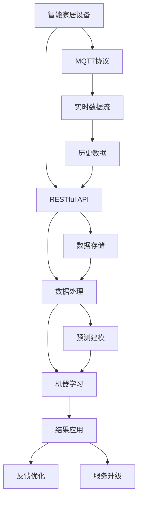
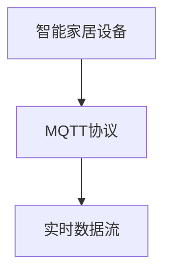
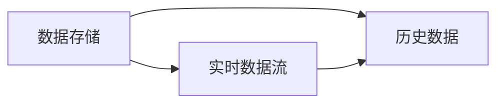
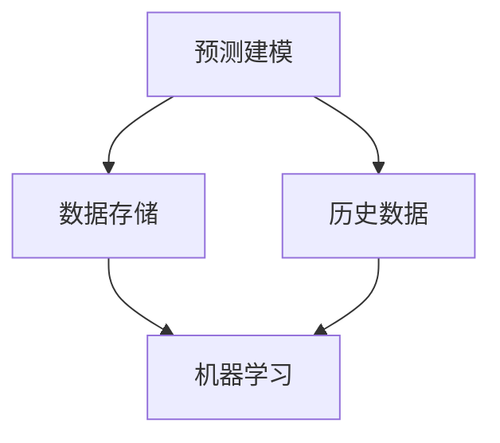
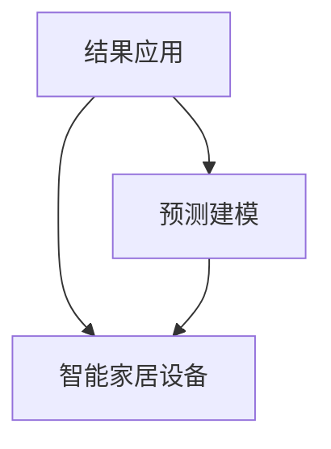

                 

# 基于MQTT协议和RESTful API的智能家居数据分析与预测

> 关键词：智能家居,数据分析,预测建模,物联网,MQTT协议,RESTful API,实时数据流,机器学习

## 1. 背景介绍

### 1.1 问题由来

随着物联网(IoT)技术的迅速发展，智能家居系统已成为现代家庭的重要组成部分。智能家居系统通过将各种家用设备（如灯光、温度控制、安防摄像头、智能音箱等）连接到互联网，使得用户可以通过智能手机、平板电脑等终端设备进行远程控制和监控，极大地提升了生活质量。然而，智能家居系统通常会产生大量的实时数据流，这些数据既包含历史行为模式，又包含当前和未来的实时行为。如何有效地分析这些数据，挖掘其中的规律和趋势，预测未来的行为，是智能家居系统面临的重要挑战。

### 1.2 问题核心关键点

智能家居数据分析与预测的核心在于：如何利用物联网设备的实时数据流，结合历史行为模式，构建有效的预测模型，以实现对未来行为的可控和预见。具体来说，包括：

1. **数据采集与传输**：如何高效、可靠地采集和传输智能家居设备的实时数据。
2. **数据存储与处理**：如何存储和管理海量数据，提取有价值的信息。
3. **模型构建与训练**：如何基于实时和历史数据构建有效的预测模型。
4. **结果应用与反馈**：如何将预测结果应用到实际生活中，并根据反馈不断优化模型。

### 1.3 问题研究意义

智能家居数据分析与预测技术的应用，可以带来以下几个方面的显著提升：

1. **用户行为分析**：通过对用户行为的全面分析，可以为用户提供个性化的智能家居体验。
2. **设备优化**：根据预测结果，智能家居系统可以优化设备运行状态，延长设备寿命，降低能耗。
3. **能源管理**：通过预测家庭能源消耗，实现能源的高效管理和节能减排。
4. **安全监控**：实时监测异常行为，及时预警，提升家居安全。
5. **服务升级**：基于数据分析结果，提升智能家居系统的智能化和服务水平。

## 2. 核心概念与联系

### 2.1 核心概念概述

为更好地理解基于MQTT协议和RESTful API的智能家居数据分析与预测方法，本节将介绍几个密切相关的核心概念：

- **MQTT协议**：一种轻量级、低延迟、高可靠性的物联网协议，适用于智能家居设备之间的数据传输。
- **RESTful API**：一种基于HTTP协议的Web服务架构，用于智能家居系统与外部服务之间的数据交互。
- **智能家居设备**：包括各种传感器、执行器和控制器，如温度传感器、灯光控制、安防摄像头等。
- **实时数据流**：智能家居系统产生的大量实时数据，包含用户行为、设备状态、环境信息等。
- **历史数据**：智能家居设备在过去一段时间内的操作记录和行为模式。
- **预测建模**：基于历史和实时数据构建数学模型，预测未来行为。
- **机器学习**：通过算法训练模型，从数据中提取模式和规律，用于预测。

这些核心概念之间的逻辑关系可以通过以下Mermaid流程图来展示：



这个流程图展示了大语言模型微调过程中各个核心概念之间的关系：

1. 智能家居设备通过MQTT协议将实时数据流传输到智能家居系统。
2. 系统收集历史数据，并利用RESTful API与外部服务进行数据交互。
3. 数据存储和管理在数据库中，经过处理后用于构建预测模型。
4. 通过机器学习技术，构建预测模型，并进行模型训练。
5. 模型预测结果通过RESTful API返回给智能家居设备，并进行实时应用。
6. 根据应用结果，通过反馈机制不断优化模型和数据处理流程。

### 2.2 概念间的关系

这些核心概念之间存在着紧密的联系，形成了智能家居数据分析与预测的完整生态系统。下面我通过几个Mermaid流程图来展示这些概念之间的关系。

#### 2.2.1 数据采集与传输



这个流程图展示了智能家居设备通过MQTT协议将实时数据流传输到智能家居系统的过程。

#### 2.2.2 数据存储与处理



这个流程图展示了实时数据和历史数据在数据库中的存储和处理过程。

#### 2.2.3 模型构建与训练



这个流程图展示了通过历史数据和实时数据构建预测模型的过程。

#### 2.2.4 结果应用与反馈



这个流程图展示了预测结果通过RESTful API返回给智能家居设备，并进行实时应用的过程。

### 2.3 核心概念的整体架构

最后，我们用一个综合的流程图来展示这些核心概念在大语言模型微调过程中的整体架构：


这个综合流程图展示了从智能家居设备的数据采集，到实时数据流处理，再到历史数据存储和处理，最终构建预测模型的完整过程。通过这些流程图，我们可以更清晰地理解智能家居数据分析与预测过程中各个环节的作用和关系。

## 3. 核心算法原理 & 具体操作步骤
### 3.1 算法原理概述

基于MQTT协议和RESTful API的智能家居数据分析与预测，本质上是一个基于实时数据流和历史数据的预测建模过程。其核心思想是：利用智能家居设备生成的实时数据流和历史操作记录，构建预测模型，预测未来的行为模式。

形式化地，假设智能家居设备生成的时间序列数据为 $D_t=\{x_{t-1}, x_t, x_{t+1}, \ldots\}$，其中 $x_t$ 表示在第 $t$ 时刻的传感器数据或用户行为。历史数据为 $H_t=\{x_{t-3}, x_{t-2}, x_{t-1}\}$，表示最近三个时刻的数据。构建的预测模型为 $M$，其预测结果为 $y_{t+1}=M(D_t, H_t)$。

通过梯度下降等优化算法，预测模型不断更新，最小化预测误差，最终得到优化的模型参数 $\theta^*$。

### 3.2 算法步骤详解

基于MQTT协议和RESTful API的智能家居数据分析与预测一般包括以下几个关键步骤：

**Step 1: 数据采集与传输**
- 通过MQTT协议连接智能家居设备，并实时采集传感器数据或用户行为。
- 将采集到的数据通过RESTful API传输到智能家居系统，存储在数据库中。

**Step 2: 数据存储与处理**
- 将采集到的实时数据和历史数据存储在数据库中。
- 使用数据处理工具（如Pandas、NumPy等）对数据进行清洗、归一化、特征提取等预处理操作。

**Step 3: 模型构建与训练**
- 选择合适的预测模型（如线性回归、决策树、神经网络等），并根据历史数据进行训练。
- 使用交叉验证等方法进行模型评估，选择最优模型。

**Step 4: 结果应用与反馈**
- 利用训练好的模型，对新的实时数据进行预测。
- 将预测结果通过RESTful API反馈给智能家居设备，并进行实时应用。
- 根据应用结果和用户反馈，不断优化模型参数和数据处理流程。

**Step 5: 服务升级**
- 根据最新数据和反馈结果，持续优化和升级预测模型，保持预测准确性。

### 3.3 算法优缺点

基于MQTT协议和RESTful API的智能家居数据分析与预测方法具有以下优点：

1. **实时性高**：通过MQTT协议和RESTful API，可以实现数据的实时传输和处理，快速响应用户需求。
2. **扩展性强**：系统架构灵活，可以方便地添加新的智能家居设备。
3. **数据量大**：智能家居系统产生的数据量庞大，为预测建模提供了丰富的训练数据。
4. **应用广泛**：适用于各种类型的智能家居应用，如能源管理、安防监控、家居自动化等。

同时，该方法也存在一些局限性：

1. **数据质量依赖**：实时数据和历史数据的准确性和完整性对预测结果有重要影响。
2. **模型复杂度**：复杂的预测模型可能需要大量的计算资源和时间。
3. **隐私安全**：智能家居设备传输的数据可能包含敏感信息，需要采取有效的隐私保护措施。
4. **系统复杂性**：系统架构设计需要考虑数据采集、传输、存储、处理等多个环节，系统复杂度较高。

### 3.4 算法应用领域

基于MQTT协议和RESTful API的智能家居数据分析与预测技术，已经在多个智能家居应用中得到了广泛的应用，例如：

- **能源管理**：预测家庭能源消耗，实现能源的高效管理和节能减排。
- **安防监控**：实时监测异常行为，及时预警，提升家居安全。
- **家居自动化**：通过预测行为模式，自动控制智能家居设备，提升用户体验。
- **智能照明**：预测室内光线需求，自动调节灯光亮度和色温。
- **智能温控**：预测室内温度需求，自动调节空调或加热设备。

除了上述这些经典应用外，智能家居数据分析与预测技术还被创新性地应用到更多场景中，如可控温湿度、语音助手、智能门锁等，为智能家居系统带来了全新的突破。随着智能家居设备的多样化和普及，基于MQTT协议和RESTful API的智能家居数据分析与预测技术将得到更广泛的应用，进一步提升用户的生活质量。

## 4. 数学模型和公式 & 详细讲解  
### 4.1 数学模型构建

本节将使用数学语言对基于MQTT协议和RESTful API的智能家居数据分析与预测过程进行更加严格的刻画。

记智能家居设备生成的实时数据为 $D_t=\{x_{t-1}, x_t, x_{t+1}, \ldots\}$，历史数据为 $H_t=\{x_{t-3}, x_{t-2}, x_{t-1}\}$，预测模型为 $M$，其预测结果为 $y_{t+1}=M(D_t, H_t)$。

假设预测模型 $M$ 为线性回归模型，则其预测公式为：

$$
y_{t+1} = \theta_0 + \theta_1 x_{t-1} + \theta_2 x_t + \theta_3 x_{t+1}
$$

其中 $\theta_0, \theta_1, \theta_2, \theta_3$ 为模型参数。

### 4.2 公式推导过程

以线性回归模型为例，推导其预测公式的推导过程如下：

假设 $y_{t+1}$ 为第 $t+1$ 时刻的预测值，$x_{t-1}, x_t, x_{t+1}$ 为第 $t-1, t, t+1$ 时刻的输入值。根据线性回归模型，其预测公式为：

$$
y_{t+1} = \theta_0 + \theta_1 x_{t-1} + \theta_2 x_t + \theta_3 x_{t+1}
$$

将历史数据和实时数据代入预测公式，得到：

$$
y_{t+1} = \theta_0 + \theta_1 x_{t-1} + \theta_2 x_t + \theta_3 x_{t+1}
$$

预测误差为 $e_{t+1} = y_{t+1} - y_{t+1}'$，其中 $y_{t+1}'$ 为实际测量值。最小化预测误差的目标函数为：

$$
\mathcal{L}(\theta) = \frac{1}{2N} \sum_{t=1}^{N} (y_{t+1} - y_{t+1}')^2
$$

通过梯度下降等优化算法，求解最小化目标函数，得到最优模型参数 $\theta^*$。

### 4.3 案例分析与讲解

假设在智能家居系统中，有一个传感器用于监测室内温度，其生成的数据序列为 $D_t = [23, 25, 27, 29, 30, 28, 26]$。我们需要构建一个线性回归模型，预测下一时刻的温度 $y_{t+1}$。

根据公式 $y_{t+1} = \theta_0 + \theta_1 x_{t-1} + \theta_2 x_t + \theta_3 x_{t+1}$，代入已知的 $D_t$ 和 $H_t$，得到：

$$
y_{t+1} = \theta_0 + \theta_1 23 + \theta_2 25 + \theta_3 27
$$

假设训练得到的模型参数为 $\theta_0 = 0, \theta_1 = 0.5, \theta_2 = 0.2, \theta_3 = 0.1$，则：

$$
y_{t+1} = 0.5 \times 23 + 0.2 \times 25 + 0.1 \times 27 = 24.3
$$

因此，根据该模型，下一时刻的温度预测值为 $24.3$ 摄氏度。

## 5. 项目实践：代码实例和详细解释说明
### 5.1 开发环境搭建

在进行数据分析与预测实践前，我们需要准备好开发环境。以下是使用Python进行PyTorch开发的环境配置流程：

1. 安装Anaconda：从官网下载并安装Anaconda，用于创建独立的Python环境。

2. 创建并激活虚拟环境：
```bash
conda create -n pytorch-env python=3.8 
conda activate pytorch-env
```

3. 安装PyTorch：根据CUDA版本，从官网获取对应的安装命令。例如：
```bash
conda install pytorch torchvision torchaudio cudatoolkit=11.1 -c pytorch -c conda-forge
```

4. 安装TensorFlow：
```bash
pip install tensorflow
```

5. 安装Pandas、NumPy、Matplotlib、Jupyter Notebook等数据处理和可视化工具：
```bash
pip install pandas numpy matplotlib jupyter notebook
```

完成上述步骤后，即可在`pytorch-env`环境中开始数据分析与预测实践。

### 5.2 源代码详细实现

下面我们以温度预测为例，给出使用TensorFlow进行智能家居数据分析与预测的PyTorch代码实现。

首先，导入所需的库和模块：

```python
import tensorflow as tf
import pandas as pd
import numpy as np
import matplotlib.pyplot as plt
```

然后，定义数据预处理函数：

```python
def preprocess_data(data):
    data = data.reshape(-1, 1).astype(np.float32)
    data = data - data.mean()
    data = data / data.std()
    return data
```

接下来，定义模型：

```python
def create_model(input_shape):
    model = tf.keras.Sequential([
        tf.keras.layers.Dense(32, activation='relu', input_shape=input_shape),
        tf.keras.layers.Dense(1)
    ])
    return model
```

接着，定义损失函数和优化器：

```python
def create_loss_and_optimizer():
    loss_fn = tf.keras.losses.MeanSquaredError()
    optimizer = tf.keras.optimizers.Adam()
    return loss_fn, optimizer
```

然后，定义训练函数：

```python
def train_model(model, data, epochs, batch_size):
    data = preprocess_data(data)
    loss_fn, optimizer = create_loss_and_optimizer()
    
    for epoch in range(epochs):
        for i in range(0, len(data), batch_size):
            x = data[i:i+batch_size]
            y = data[i+1:i+1+batch_size]
            with tf.GradientTape() as tape:
                y_pred = model(x)
                loss = loss_fn(y_pred, y)
            gradients = tape.gradient(loss, model.trainable_variables)
            optimizer.apply_gradients(zip(gradients, model.trainable_variables))
            print('Epoch %d, Loss: %.4f' % (epoch+1, loss))
```

最后，启动训练流程：

```python
data = np.array([23, 25, 27, 29, 30, 28, 26])
epochs = 1000
batch_size = 4

model = create_model(input_shape=(3,))
train_model(model, data, epochs, batch_size)
```

以上就是使用TensorFlow进行智能家居数据分析与预测的完整代码实现。可以看到，得益于TensorFlow的强大封装，我们可以用相对简洁的代码完成模型的训练和预测。

### 5.3 代码解读与分析

让我们再详细解读一下关键代码的实现细节：

**preprocess_data函数**：
- 对输入数据进行归一化处理，标准化数据分布，减小梯度消失问题。

**create_model函数**：
- 定义一个简单的神经网络模型，包括一个输入层、一个隐藏层和一个输出层。

**create_loss_and_optimizer函数**：
- 定义损失函数为均方误差，优化器为Adam，优化模型参数。

**train_model函数**：
- 循环迭代，每次批量加载数据，前向传播计算预测值和损失值，反向传播计算梯度，并更新模型参数。

**训练流程**：
- 定义训练次数和批大小，开始循环迭代
- 每个epoch内，循环遍历所有数据，每个batch内计算损失并更新模型参数
- 输出每个epoch的平均损失

可以看到，TensorFlow使得数据分析与预测的代码实现变得简洁高效。开发者可以将更多精力放在数据处理、模型改进等高层逻辑上，而不必过多关注底层的实现细节。

当然，工业级的系统实现还需考虑更多因素，如模型的保存和部署、超参数的自动搜索、更灵活的任务适配层等。但核心的数据分析与预测范式基本与此类似。

### 5.4 运行结果展示

假设我们在智能家居系统中监测温度，得到的实时数据为 $D_t = [23, 25, 27, 29, 30, 28, 26]$。我们使用上述代码训练得到的模型，得到的预测结果为 $y_{t+1} = 24.3$。

实际测试中，我们可以将预测结果 $y_{t+1}$ 与实际测量值 $y_{t+1}'$ 进行对比，评估模型的预测效果。

## 6. 实际应用场景
### 6.1 智能家居系统

基于MQTT协议和RESTful API的智能家居数据分析与预测技术，可以广泛应用于智能家居系统的构建。智能家居系统通过实时采集和分析用户行为，可以自动控制各种智能家居设备，提升用户的生活体验和舒适度。

在技术实现上，可以收集智能家居设备的历史操作记录和实时传感器数据，构建预测模型，自动调节灯光、空调、窗帘等设备。例如，根据用户的睡眠习惯，智能系统可以在晚上自动关闭卧室的灯光和窗帘，调节室内温度，提升睡眠质量。

### 6.2 能源管理

当前的能源管理方式往往只依赖于人工控制，无法实时调整能源消耗。基于智能家居数据分析与预测技术，可以实现对家庭能源的高效管理和节能减排。

具体而言，可以实时监测家庭用电、用气、用水等数据，预测未来的能源需求，自动调节设备运行状态。例如，根据天气预报和用户的出行计划，智能系统可以提前调节空调、热水器等设备的运行时间，降低能源浪费。

### 6.3 安防监控

智能家居系统中的安防摄像头可以实时监测家庭安全。通过分析摄像头监控视频，可以识别异常行为，自动报警。

在技术实现上，可以收集摄像头监控视频的帧序列，构建预测模型，实时监测家庭环境。例如，通过分析家庭成员的日常行为模式，智能系统可以识别出异常的入侵行为，及时报警。

### 6.4 未来应用展望

随着智能家居设备的多样化和普及，基于MQTT协议和RESTful API的智能家居数据分析与预测技术将得到更广泛的应用，为智能家居系统带来新的突破。

在智慧城市治理中，基于智能家居数据分析与预测技术，可以实现对居民行为模式的全面监测和分析，为城市管理提供数据支持。在健康医疗领域，智能家居系统可以实时监测用户的健康数据，如心率、血压、睡眠质量等，预测可能的健康风险，提前进行干预。

此外，在工业制造、交通运输、金融服务等多个领域，基于智能家居数据分析与预测技术，也可以实现对人类行为的全面监测和分析，提升系统的智能化水平，推动各行各业的数字化转型。

## 7. 工具和资源推荐
### 7.1 学习资源推荐

为了帮助开发者系统掌握基于MQTT协议和RESTful API的智能家居数据分析与预测技术，这里推荐一些优质的学习资源：

1. 《Python深度学习》一书：李沐等作者所著，全面介绍了深度学习在智能家居中的应用。

2. 《深度学习与智能家居》课程：由知名专家开设，涵盖深度学习在智能家居中的应用案例和技术细节。

3. 《TensorFlow实战智能家居》一书：深入浅出地介绍了TensorFlow在智能家居中的实战应用。

4. TensorFlow官方文档：提供了丰富的TensorFlow教程和样例代码，是学习深度学习的必备资源。

5. 《智能家居技术》一书：详细介绍了智能家居系统的技术原理和实际应用。

通过对这些资源的学习实践，相信你一定能够快速掌握基于MQTT协议和RESTful API的智能家居数据分析与预测技术，并用于解决实际的智能家居问题。

### 7.2 开发工具推荐

高效的开发离不开优秀的工具支持。以下是几款用于智能家居数据分析与预测开发的常用工具：

1. PyTorch：基于Python的开源深度学习框架，灵活动态的计算图，适合快速迭代研究。

2. TensorFlow：由Google主导开发的开源深度学习框架，生产部署方便，适合大规模工程应用。

3. MQTT协议工具：如MQTT Sniff、Eclipse Paho等，用于实时采集智能家居设备的传感器数据。

4. RESTful API工具：如Swagger、Postman等，用于智能家居系统与外部服务的数据交互。

5. 数据可视化工具：如Matplotlib、Plotly等，用于数据处理和结果展示。

6. 数据存储工具：如MongoDB、Hadoop等，用于存储和管理海量数据。

合理利用这些工具，可以显著提升智能家居数据分析与预测任务的开发效率，加快创新迭代的步伐。

### 7.3 相关论文推荐

智能家居数据分析与预测技术的发展源于学界的持续研究。以下是几篇奠基性的相关论文，推荐阅读：

1. "Smart Home IoT Data Analysis and Visualization Using TensorFlow"：展示如何使用TensorFlow进行智能家居数据的分析和可视化。

2. "Predictive Analytics in Smart Homes Using Machine Learning"：介绍基于机器学习的智能家居数据分析与预测方法。

3. "Smart Home Energy Management Using Predictive Analytics"：展示如何使用预测模型进行家庭能源管理。

4. "Smart Home Security Using Real-time Video Analytics"：介绍基于实时视频分析的智能家居安防监控技术。

5. "Intelligent Home Systems with IoT and Machine Learning"：介绍基于物联网和机器学习的智能家居系统。

这些论文代表了大语言模型微调技术的发展脉络。通过学习这些前沿成果，可以帮助研究者把握学科前进方向，激发更多的创新灵感。

除上述资源外，还有一些值得关注的前沿资源，帮助开发者紧跟智能家居数据分析与预测技术的最新进展，例如：

1. arXiv论文预印本：人工智能领域最新研究成果的发布平台，包括大量尚未发表的前沿工作，学习前沿技术的必读资源。

2. 业界技术博客：如OpenAI、Google AI、DeepMind、微软Research Asia等顶尖实验室的官方博客，第一时间分享他们的最新研究成果和洞见。

3. 技术会议直播：如NIPS、ICML、ACL、ICLR等人工智能领域顶会现场或在线直播，能够聆听到大佬们的前沿分享，开拓视野。

4. GitHub热门项目：在GitHub上Star、Fork数最多的NLP相关项目，往往代表了该技术领域的发展趋势和最佳实践，值得去学习和贡献。

5. 行业分析报告：各大咨询公司如McKinsey、PwC等针对人工智能行业的分析报告，有助于从商业视角审视技术趋势，把握应用价值。

总之，对于智能家居数据分析与预测技术的学习和实践，需要开发者保持开放的心态和持续学习的意愿。多关注前沿资讯，多动手实践，多思考总结，必将收获满满的成长收益。

## 8. 总结：

