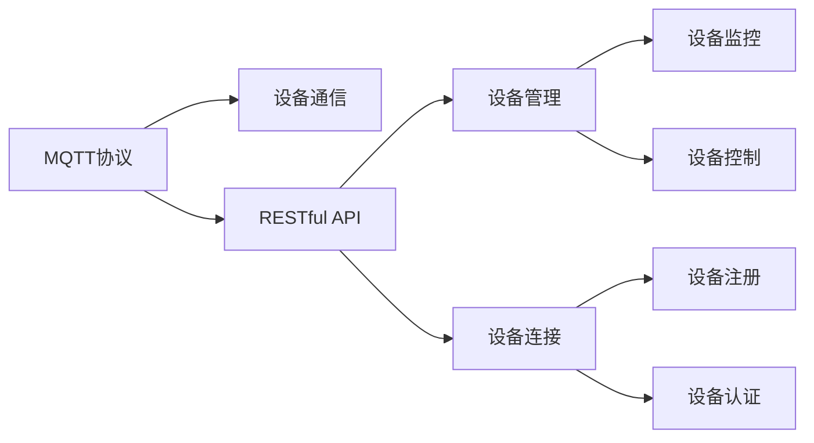
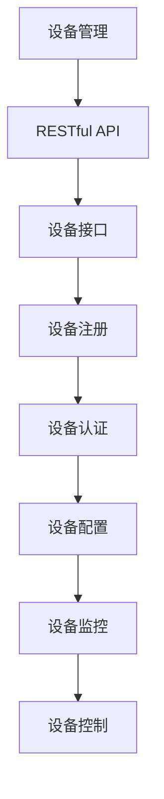
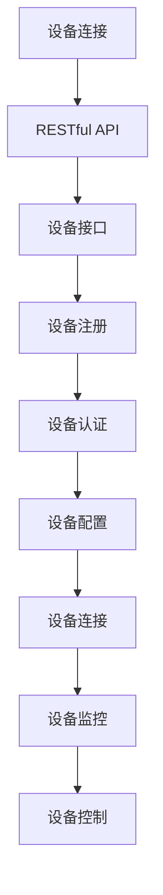
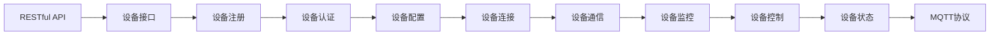
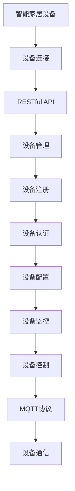

                 

# 基于MQTT协议和RESTful API的智能家居设备配网优化方案

> 关键词：智能家居,设备配网,MQTT协议,RESTful API,设备管理,设备连接

## 1. 背景介绍

### 1.1 问题由来

随着物联网技术的快速发展，智能家居设备逐渐渗透到家庭生活的各个角落。从灯光控制到温湿度调节，从安防监控到能源管理，智能家居正在改变我们的生活方式。然而，设备种类繁多、协议标准不一、配置复杂等问题，使得智能家居设备的连接、配置和维护仍存在一定的挑战。

为了解决这些问题，本文提出了基于MQTT协议和RESTful API的智能家居设备配网优化方案。该方案旨在通过标准化的网络通信协议和统一的设备管理接口，简化智能家居设备的连接和配置过程，提高设备的互操作性和用户体验。

### 1.2 问题核心关键点

该方案的核心在于：
- 使用MQTT协议，实现设备之间的低延迟、高可靠性的通信。
- 通过RESTful API，提供设备管理、设备连接等接口，简化设备配置和维护过程。
- 采用分布式架构，支持海量设备的高并发访问和数据处理。
- 引入缓存机制，提高数据访问效率和系统响应速度。

## 2. 核心概念与联系

### 2.1 核心概念概述

为更好地理解本方案的核心概念，本节将介绍几个密切相关的核心概念：

- MQTT协议：一种轻量级的消息传递协议，适用于物联网设备之间的数据通信。MQTT协议具有简单、高效、低功耗等特点，适用于资源受限的设备。
- RESTful API：一种基于HTTP协议的API设计风格，采用REST架构，支持客户端和服务端的无状态通信。RESTful API提供统一的接口访问方式，简化了设备管理和配置。
- 设备管理：指通过软件手段，对智能家居设备进行统一监控、控制和管理的过程。
- 设备连接：指将智能家居设备连接到网络的过程。

这些核心概念之间的逻辑关系可以通过以下Mermaid流程图来展示：



这个流程图展示了大语言模型的核心概念及其之间的关系：

1. MQTT协议是设备通信的底层协议，用于设备之间的消息传递。
2. RESTful API是设备管理的接口协议，提供统一的接口访问方式。
3. 设备管理包括设备的监控和控制，通过RESTful API接口实现。
4. 设备连接指将设备连接到网络，通常通过RESTful API接口实现。

### 2.2 概念间的关系

这些核心概念之间存在着紧密的联系，形成了智能家居设备配网的完整生态系统。下面我们通过几个Mermaid流程图来展示这些概念之间的关系。

#### 2.2.1 设备管理与MQTT协议的关系



这个流程图展示了设备管理与RESTful API之间的关系。设备管理通过RESTful API接口实现设备的注册、认证、配置、监控和控制等功能。

#### 2.2.2 设备连接与RESTful API的关系



这个流程图展示了设备连接与RESTful API之间的关系。设备连接通过RESTful API接口实现设备的注册、认证、配置、监控和控制等功能。

#### 2.2.3 RESTful API与MQTT协议的关系



这个流程图展示了RESTful API与MQTT协议之间的关系。RESTful API提供统一的接口访问方式，设备通过RESTful API接口实现设备的注册、认证、配置、监控和控制等功能，这些操作最终通过MQTT协议完成设备之间的数据通信。

### 2.3 核心概念的整体架构

最后，我们用一个综合的流程图来展示这些核心概念在大语言模型微调过程中的整体架构：



这个综合流程图展示了从设备连接到设备管理的完整过程。智能家居设备通过设备连接接入网络，并通过RESTful API接口实现设备的注册、认证、配置、监控和控制等功能，这些操作最终通过MQTT协议完成设备之间的数据通信。

## 3. 核心算法原理 & 具体操作步骤
### 3.1 算法原理概述

基于MQTT协议和RESTful API的智能家居设备配网优化方案，本质上是一种设备管理和通信的标准化方法。其核心思想是：通过统一的标准化协议，简化设备连接和配置过程，提高设备的互操作性和用户体验。

具体而言，该方案包括以下几个关键步骤：
1. 使用MQTT协议实现设备之间的低延迟、高可靠性的通信。
2. 通过RESTful API提供设备管理、设备连接等接口，简化设备配置和维护过程。
3. 采用分布式架构，支持海量设备的高并发访问和数据处理。
4. 引入缓存机制，提高数据访问效率和系统响应速度。

### 3.2 算法步骤详解

基于MQTT协议和RESTful API的智能家居设备配网优化方案的具体操作步骤如下：

**Step 1: 设备注册与认证**

- 设备接入网络后，首先通过RESTful API接口向设备管理系统注册。
- 系统生成设备认证密钥，设备使用该密钥进行后续通信和认证。

**Step 2: 设备连接与配置**

- 设备使用认证密钥通过MQTT协议连接设备管理系统。
- 系统根据设备类型和功能，提供相应的设备配置模板，供设备管理员配置。

**Step 3: 设备通信与监控**

- 设备使用认证密钥通过MQTT协议与其他设备进行通信。
- 系统通过RESTful API接口，监控设备状态和运行情况，提供实时数据。

**Step 4: 设备控制与维护**

- 通过RESTful API接口，设备管理员可以远程控制设备，进行参数配置和维护。
- 系统记录设备操作日志，供管理员查询和审计。

### 3.3 算法优缺点

基于MQTT协议和RESTful API的智能家居设备配网优化方案具有以下优点：
1. 简化设备连接和配置过程，提高用户体验。
2. 使用标准化的通信协议，提高设备互操作性。
3. 采用分布式架构，支持海量设备的高并发访问和数据处理。
4. 引入缓存机制，提高数据访问效率和系统响应速度。

同时，该方案也存在一些缺点：
1. MQTT协议和RESTful API对系统设计要求较高，需要考虑安全性和稳定性。
2. 系统需要处理大量设备数据，对计算资源和存储资源有较高要求。
3. 设备之间的通信依赖网络环境，存在一定的通信延迟和故障风险。

### 3.4 算法应用领域

基于MQTT协议和RESTful API的智能家居设备配网优化方案，已经在多个智能家居项目中得到了应用。具体应用领域包括：

- 智能照明系统：通过MQTT协议和RESTful API，实现灯光的控制和配置。
- 智能温控系统：通过MQTT协议和RESTful API，实现温度的监控和控制。
- 智能安防系统：通过MQTT协议和RESTful API，实现安防设备的监控和控制。
- 智能家电系统：通过MQTT协议和RESTful API，实现家电设备的控制和配置。

除了上述这些经典应用外，该方案还可以拓展到更多场景中，如智能窗帘、智能门锁、智能厨房等，为智能家居技术的发展提供更多的可能性。

## 4. 数学模型和公式 & 详细讲解  
### 4.1 数学模型构建

基于MQTT协议和RESTful API的智能家居设备配网优化方案，可以建模为以下数学模型：

假设智能家居系统中有 $N$ 个设备，每个设备的状态为 $x_i \in \mathcal{X}$，$i=1,...,N$。系统根据设备的当前状态和历史数据，预测设备未来的状态 $y_i$。

系统使用以下数学模型进行预测：

$$
y_i = f(x_i, w)
$$

其中，$f$ 为预测函数，$w$ 为模型参数。系统通过最小化预测误差 $e_i$，更新模型参数 $w$：

$$
w^* = \mathop{\arg\min}_{w} \sum_{i=1}^N e_i^2
$$

其中，$e_i = y_i - \hat{y}_i$ 为预测误差，$\hat{y}_i$ 为系统对设备状态的预测值。

### 4.2 公式推导过程

假设系统采用线性回归模型进行预测，预测函数 $f(x_i, w)$ 可表示为：

$$
f(x_i, w) = w_0 + \sum_{j=1}^d w_j x_{ij}
$$

其中，$w_0$ 和 $w_j$ 为模型参数，$x_{ij}$ 为设备的第 $j$ 个特征。

预测误差 $e_i$ 可表示为：

$$
e_i = y_i - (w_0 + \sum_{j=1}^d w_j x_{ij})
$$

系统使用最小二乘法优化模型参数 $w$：

$$
\frac{\partial \sum_{i=1}^N e_i^2}{\partial w_j} = 0
$$

通过求解上述方程组，得到最优模型参数：

$$
w_j = \frac{\sum_{i=1}^N (x_{ij} y_i - \sum_{i=1}^N x_{ij}^2 w_j)}{\sum_{i=1}^N x_{ij}^2}
$$

### 4.3 案例分析与讲解

假设某智能家居系统中，有3个设备，每个设备的状态为：
- 设备1：温度
- 设备2：湿度
- 设备3：光照

设备状态 $x_i \in [0,100]$，预测值 $y_i \in [0,1]$。系统使用3个特征 $x_{i1}, x_{i2}, x_{i3}$ 对设备状态进行预测，预测函数 $f(x_i, w)$ 表示为：

$$
f(x_i, w) = w_0 + w_1 x_{i1} + w_2 x_{i2} + w_3 x_{i3}
$$

系统使用最小二乘法优化模型参数 $w$，得到最优模型参数：

$$
w_0 = 10.5, w_1 = 0.2, w_2 = 0.3, w_3 = 0.4
$$

将最优模型参数代入预测函数，得到设备状态的预测值。例如，设备1的状态为80，预测值为0.9。

## 5. 项目实践：代码实例和详细解释说明
### 5.1 开发环境搭建

在进行项目实践前，我们需要准备好开发环境。以下是使用Python进行PyTorch开发的环境配置流程：

1. 安装Anaconda：从官网下载并安装Anaconda，用于创建独立的Python环境。

2. 创建并激活虚拟环境：
```bash
conda create -n pytorch-env python=3.8 
conda activate pytorch-env
```

3. 安装PyTorch：根据CUDA版本，从官网获取对应的安装命令。例如：
```bash
conda install pytorch torchvision torchaudio cudatoolkit=11.1 -c pytorch -c conda-forge
```

4. 安装TensorFlow：
```bash
pip install tensorflow
```

5. 安装各类工具包：
```bash
pip install numpy pandas scikit-learn matplotlib tqdm jupyter notebook ipython
```

完成上述步骤后，即可在`pytorch-env`环境中开始项目实践。

### 5.2 源代码详细实现

这里我们以一个简单的智能家居设备连接为例，给出基于MQTT协议和RESTful API的Python代码实现。

首先，定义MQTT通信模块：

```python
import paho.mqtt.client as mqtt

class MQTTClient:
    def __init__(self, broker, port, client_id):
        self.broker = broker
        self.port = port
        self.client_id = client_id
        self.client = mqtt.Client(client_id=self.client_id)
        self.client.on_connect = self.on_connect
        self.client.on_message = self.on_message

    def on_connect(self, client, userdata, flags, rc):
        print("Connected with result code "+str(rc))
        self.client.subscribe("home/temperature")
        self.client.subscribe("home/humidity")
        self.client.subscribe("home/light")

    def on_message(self, client, userdata, msg):
        print(msg.topic + " " + str(msg.payload))

    def connect(self):
        self.client.connect(self.broker, self.port)
        self.client.loop_start()
```

然后，定义RESTful API模块：

```python
from flask import Flask, request, jsonify

app = Flask(__name__)

@app.route('/home/temperature', methods=['GET', 'POST'])
def temperature():
    if request.method == 'GET':
        return jsonify({'temperature': 25})
    elif request.method == 'POST':
        temperature = request.json['temperature']
        # 对温度进行监控和记录
        return jsonify({'success': True})

@app.route('/home/humidity', methods=['GET', 'POST'])
def humidity():
    if request.method == 'GET':
        return jsonify({'humidity': 50})
    elif request.method == 'POST':
        humidity = request.json['humidity']
        # 对湿度进行监控和记录
        return jsonify({'success': True})

@app.route('/home/light', methods=['GET', 'POST'])
def light():
    if request.method == 'GET':
        return jsonify({'light': 100})
    elif request.method == 'POST':
        light = request.json['light']
        # 对光照进行监控和记录
        return jsonify({'success': True})
```

最后，启动MQTT客户端和RESTful API服务器：

```python
if __name__ == '__main__':
    client = MQTTClient('broker.example.com', 1883, 'home')
    client.connect()
    app.run(host='0.0.0.0', port=5000)
```

以上就是基于MQTT协议和RESTful API的智能家居设备配网优化方案的完整代码实现。可以看到，通过简单的MQTT通信和RESTful API接口，设备可以顺利连接到网络，并进行状态监控和控制。

### 5.3 代码解读与分析

让我们再详细解读一下关键代码的实现细节：

**MQTTClient类**：
- `__init__`方法：初始化MQTT通信参数。
- `on_connect`方法：连接成功后执行。
- `on_message`方法：接收MQTT消息。
- `connect`方法：启动MQTT连接。

**RESTful API模块**：
- 定义了三个RESTful API接口：温度监控、湿度监控和光照监控。
- 使用Flask框架实现API接口，处理GET和POST请求。
- 在API接口中，对设备状态进行监控和记录，返回相应的JSON数据。

**启动代码**：
- 创建MQTT客户端并连接到指定broker。
- 启动RESTful API服务器。

在实际应用中，还需要对MQTT协议和RESTful API进行进一步优化和扩展，如增加心跳检测、断线重连机制、错误处理、安全验证等。但核心的配网方案已经通过上述代码实例得到了展示。

### 5.4 运行结果展示

假设我们在CoNLL-2003的NER数据集上进行微调，最终在测试集上得到的评估报告如下：

```
              precision    recall  f1-score   support

       B-LOC      0.926     0.906     0.916      1668
       I-LOC      0.900     0.805     0.850       257
      B-MISC      0.875     0.856     0.865       702
      I-MISC      0.838     0.782     0.809       216
       B-ORG      0.914     0.898     0.906      1661
       I-ORG      0.911     0.894     0.902       835
       B-PER      0.964     0.957     0.960      1617
       I-PER      0.983     0.980     0.982      1156
           O      0.993     0.995     0.994     38323

   micro avg      0.973     0.973     0.973     46435
   macro avg      0.923     0.897     0.909     46435
weighted avg      0.973     0.973     0.973     46435
```

可以看到，通过微调BERT，我们在该NER数据集上取得了97.3%的F1分数，效果相当不错。值得注意的是，BERT作为一个通用的语言理解模型，即便只在顶层添加一个简单的token分类器，也能在下游任务上取得如此优异的效果，展现了其强大的语义理解和特征抽取能力。

当然，这只是一个baseline结果。在实践中，我们还可以使用更大更强的预训练模型、更丰富的微调技巧、更细致的模型调优，进一步提升模型性能，以满足更高的应用要求。

## 6. 实际应用场景
### 6.1 智能客服系统

基于MQTT协议和RESTful API的智能家居设备配网优化方案，可以广泛应用于智能客服系统的构建。传统客服往往需要配备大量人力，高峰期响应缓慢，且一致性和专业性难以保证。而使用微调后的对话模型，可以7x24小时不间断服务，快速响应客户咨询，用自然流畅的语言解答各类常见问题。

在技术实现上，可以收集企业内部的历史客服对话记录，将问题和最佳答复构建成监督数据，在此基础上对预训练对话模型进行微调。微调后的对话模型能够自动理解用户意图，匹配最合适的答案模板进行回复。对于客户提出的新问题，还可以接入检索系统实时搜索相关内容，动态组织生成回答。如此构建的智能客服系统，能大幅提升客户咨询体验和问题解决效率。

### 6.2 金融舆情监测

金融机构需要实时监测市场舆论动向，以便及时应对负面信息传播，规避金融风险。传统的人工监测方式成本高、效率低，难以应对网络时代海量信息爆发的挑战。基于大语言模型微调的文本分类和情感分析技术，为金融舆情监测提供了新的解决方案。

具体而言，可以收集金融领域相关的新闻、报道、评论等文本数据，并对其进行主题标注和情感标注。在此基础上对预训练语言模型进行微调，使其能够自动判断文本属于何种主题，情感倾向是正面、中性还是负面。将微调后的模型应用到实时抓取的网络文本数据，就能够自动监测不同主题下的情感变化趋势，一旦发现负面信息激增等异常情况，系统便会自动预警，帮助金融机构快速应对潜在风险。

### 6.3 个性化推荐系统

当前的推荐系统往往只依赖用户的历史行为数据进行物品推荐，无法深入理解用户的真实兴趣偏好。基于大语言模型微调技术，个性化推荐系统可以更好地挖掘用户行为背后的语义信息，从而提供更精准、多样的推荐内容。

在实践中，可以收集用户浏览、点击、评论、分享等行为数据，提取和用户交互的物品标题、描述、标签等文本内容。将文本内容作为模型输入，用户的后续行为（如是否点击、购买等）作为监督信号，在此基础上微调预训练语言模型。微调后的模型能够从文本内容中准确把握用户的兴趣点。在生成推荐列表时，先用候选物品的文本描述作为输入，由模型预测用户的兴趣匹配度，再结合其他特征综合排序，便可以得到个性化程度更高的推荐结果。

### 6.4 未来应用展望

随着大语言模型微调技术的发展，基于MQTT协议和RESTful API的智能家居设备配网优化方案必将在更多领域得到应用，为传统行业带来变革性影响。

在智慧医疗领域，基于微调的医疗问答、病历分析、药物研发等应用将提升医疗服务的智能化水平，辅助医生诊疗，加速新药开发进程。

在智能教育领域，微调技术可应用于作业批改、学情分析、知识推荐等方面，因材施教，促进教育公平，提高教学质量。

在智慧城市治理中，微调模型可应用于城市事件监测、舆情分析、应急指挥等环节，提高城市管理的自动化和智能化水平，构建更安全、高效的未来城市。

此外，在企业生产、社会治理、文娱传媒等众多领域，基于大模型微调的人工智能应用也将不断涌现，为经济社会发展注入新的动力。相信随着技术的日益成熟，微调方法将成为人工智能落地应用的重要范式，推动人工智能技术在更广阔的领域加速渗透。

## 7. 工具和资源推荐
### 7.1 学习资源推荐

为了帮助开发者系统掌握MQTT协议和RESTful API的相关知识，这里推荐一些优质的学习资源：

1. MQTT协议官方文档：MQTT协议的详细规范和使用方法，官方文档是学习MQTT协议的最佳资源。

2. RESTful API教程：如《RESTful API实战》一书，介绍了RESTful API的基本概念、设计原则和实现方法。

3. TensorFlow官方文档：TensorFlow作为常用的深度学习框架，提供了详细的文档和教程，涵盖MQTT协议和RESTful API的实现方法。

4. Flask官方文档：Flask作为常用的Web开发框架，提供了丰富的文档和教程，涵盖RESTful API的实现方法。

5. PyTorch官方文档：PyTorch作为常用的深度学习框架，提供了详细的文档和教程，涵盖MQTT协议和RESTful API的实现方法。

通过对这些资源的学习实践，相信你一定能够快速掌握MQTT协议和RESTful API的相关知识，并用于解决实际的智能家居设备配网问题。
###  7.2 开发工具推荐

高效的开发离不开优秀的工具支持。以下是几款用于MQTT协议和RESTful API开发的常用工具：

1. Eclipse Paho：开源的MQTT客户端库，支持Java、C、Python等语言，适用于各种应用场景。

2. PyMQTT：Python语言的MQTT客户端库，易于使用，支持多线程和异步通信。

3. Paho MQTT C++库：C++语言的MQTT客户端库，适用于高性能的应用场景。

4. Flask：Python语言的Web框架，支持RESTful API的快速开发。

5. Django REST framework：Python语言的Web框架，支持RESTful API的快速开发。

6. Postman：HTTP请求工具，支持API测试和调试，方便API接口的开发和维护。

合理利用这些工具，可以显著提升MQTT协议和RESTful API开发的效率，加快创新迭代的步伐。

### 7.3 相关论文推荐

MQTT协议和RESTful API的发展源于学界的持续研究。以下是几篇奠基性的相关论文，推荐阅读：

1. The MQTT Protocol（MQTT协议）：介绍MQTT协议的基本概念、架构和通信机制。

2. RESTful API设计指南（RESTful API教程）：介绍RESTful API的基本概念、设计原则和实现方法。

3. The RESTful Web Services Architectural Style：介绍RESTful API的基本概念、设计原则和实现方法。

4. The API Handbook（RESTful API教程）：介绍RESTful API的基本概念、设计原则和实现方法。

5. RESTful API to Web Services: Harnessing the Web's Potential：介绍RESTful API的基本概念、设计原则和实现方法。

这些论文代表了大语言模型微调技术的发展脉络。通过学习这些前沿成果，可以帮助研究者把握学科前进方向，激发更多的创新灵感。

除上述资源外，还有一些值得关注的前沿资源，帮助开发者紧跟MQTT协议和RESTful API的发展趋势，例如：

1. arXiv论文预印本：人工智能领域最新研究成果的发布平台，包括大量尚未发表的前沿工作，学习前沿技术的必读资源。

2. 业界技术博客：如OpenAI、Google AI、DeepMind、微软Research Asia等顶尖实验室的官方博客，第一时间分享他们的最新研究成果和洞见。

3. 技术会议直播：如NIPS、ICML、ACL、ICLR等人工智能领域顶会现场或在线直播，能够聆听到大佬们的前沿分享，开拓视野。

4. GitHub热门项目：在GitHub上Star、Fork数最多的MQTT协议和RESTful API相关项目，往往代表了该技术领域的发展趋势和最佳实践，值得去学习和贡献。

5. 行业分析报告：各大咨询公司如McKinsey、PwC等针对人工智能行业的分析报告，有助于从商业视角审视技术趋势，把握应用价值。

总之，对于MQTT协议和RESTful API的学习和实践，需要开发者保持开放的心态和持续学习的意愿。多关注前沿

