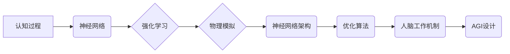

# AGI与物理学的协同发展

> 关键词：人工智能，通用人工智能，AGI，物理学，认知科学，机器学习，神经网络，强化学习，模拟推理，人机协同

## 1. 背景介绍

在过去的几十年中，人工智能（AI）取得了长足的进步，从最初的规则系统到如今的深度学习，AI技术在各个领域都展现出了巨大的潜力。然而，目前的AI技术大多集中在特定任务上，如图像识别、自然语言处理、机器翻译等，被称为窄AI（Narrow AI）。相比之下，通用人工智能（AGI）——一种具有广泛认知能力的智能系统——仍是一个遥远的目标。物理学，作为自然科学的基石，其深刻的原理和丰富的理论体系，为AGI的发展提供了重要的启示和资源。本文将探讨AGI与物理学的协同发展，分析两者之间的联系和相互促进的可能性。

### 1.1 问题的由来

随着AI技术的不断发展，人们越来越意识到，单纯依赖计算机科学和统计学的方法来发展AGI存在一定的局限性。物理学的研究成果，如量子力学、相对论、统计力学等，为理解复杂系统提供了新的视角。同时，AGI的发展也需要解决许多物理学问题，如感知、推理、决策等。因此，AGI与物理学的协同发展成为了一个值得深入探讨的课题。

### 1.2 研究现状

目前，AGI与物理学的协同发展主要体现在以下几个方面：

1. 物理模拟：通过模拟物理系统来研究认知过程，如神经网络的工作原理、强化学习中的决策机制等。
2. 神经科学：利用物理学的方法来研究人脑的工作机制，为AGI的设计提供灵感。
3. 算法创新：将物理学的原理应用于算法设计，如基于物理学的优化算法、神经网络架构设计等。

### 1.3 研究意义

AGI与物理学的协同发展具有以下重要意义：

1. 促进AGI的理论研究：物理学为AGI提供了一种新的理论框架，有助于理解和解释认知过程。
2. 推动算法创新：物理学原理可以启发新的算法设计，提高AGI的性能。
3. 促进人机协同：AGI的发展有助于人类更好地理解自然世界，实现人机协同。

### 1.4 本文结构

本文将分为以下几个部分：

1. 核心概念与联系：介绍AGI、物理学及其相互联系。
2. 核心算法原理与具体操作步骤：探讨基于物理学的AGI算法原理和操作步骤。
3. 数学模型和公式：介绍AGI与物理学相关的数学模型和公式。
4. 项目实践：展示基于物理学的AGI代码实例。
5. 实际应用场景：分析AGI与物理学的协同发展的应用场景。
6. 工具和资源推荐：推荐相关学习资源和开发工具。
7. 总结：总结AGI与物理学的协同发展趋势和挑战。

## 2. 核心概念与联系

### 2.1 核心概念

**AGI**：通用人工智能，一种具有广泛认知能力的智能系统，能够理解、学习和应用知识，解决复杂问题，具有自我意识和情感。

**物理学**：自然科学的一门基础学科，研究物质的运动、结构、相互作用和变换规律。

### 2.2 联系

AGI与物理学的联系主要体现在以下几个方面：

1. **认知过程的物理模拟**：通过模拟物理系统来研究认知过程，如神经网络的工作原理、强化学习中的决策机制等。
2. **神经科学的启示**：利用物理学的方法来研究人脑的工作机制，为AGI的设计提供灵感。
3. **算法创新**：将物理学的原理应用于算法设计，如基于物理学的优化算法、神经网络架构设计等。

以下是AGI与物理学联系的Mermaid流程图：



## 3. 核心算法原理 & 具体操作步骤

### 3.1 算法原理概述

基于物理学的AGI算法主要涉及以下几个方面：

1. **神经网络模拟**：利用物理学原理来设计神经网络架构，如基于物理学的神经元模型。
2. **强化学习**：利用物理学原理来设计强化学习算法，如基于物理学的奖励函数和策略梯度。
3. **模拟推理**：利用物理学原理来模拟推理过程，如基于物理学的信念更新和决策机制。

### 3.2 算法步骤详解

**3.2.1 神经网络模拟**

1. 设计神经元模型：基于物理学的原理，如神经元膜的电位变化、突触传递等。
2. 构建神经网络：将神经元模型连接成网络，形成信息传递和处理的结构。
3. 训练神经网络：使用有监督或无监督学习算法来训练神经网络，使其能够完成特定任务。

**3.2.2 强化学习**

1. 设计奖励函数：基于物理学原理，如能量最小化、熵最大化等。
2. 设计策略梯度：利用物理学原理，如梯度下降、牛顿法等。
3. 训练强化学习模型：通过与环境交互，不断调整策略，以最大化奖励函数。

**3.2.3 模拟推理**

1. 设计信念更新规则：基于物理学原理，如贝叶斯推理、粒子滤波等。
2. 设计决策机制：基于物理学原理，如拉格朗日乘数法、势能函数等。
3. 模拟推理过程：根据信念更新规则和决策机制，模拟推理过程。

### 3.3 算法优缺点

**3.3.1 优点**

1. 提高模型的可解释性：基于物理学的AGI算法更容易理解和解释。
2. 提高模型的鲁棒性：物理学的原理通常具有较好的鲁棒性。
3. 提高模型的性能：物理学原理可以为AGI算法提供更好的理论基础。

**3.3.2 缺点**

1. 计算复杂度高：基于物理学的AGI算法通常需要更多的计算资源。
2. 理论基础不完善：物理学原理在AGI领域的应用仍处于探索阶段。

### 3.4 算法应用领域

基于物理学的AGI算法可以应用于以下领域：

1. 机器人学：设计更智能的机器人，使其能够更好地适应环境。
2. 游戏开发：开发更具挑战性的游戏，提高游戏体验。
3. 金融领域：进行风险评估、投资决策等。

## 4. 数学模型和公式

### 4.1 数学模型构建

**4.1.1 神经网络模型**

假设有一个包含L层的神经网络，每层有n个神经元。神经元的激活函数为sigmoid函数：

$$
f(x) = \frac{1}{1+e^{-x}}
$$

神经元的输入和输出关系为：

$$
h_l(x) = f(W_l h_{l-1} + b_l)
$$

其中，$W_l$为权重矩阵，$b_l$为偏置向量。

**4.1.2 强化学习**

强化学习的目标是最小化长期奖励：

$$
J(\pi) = \sum_{t=0}^{\infty} \gamma^t R_t
$$

其中，$\pi$为策略，$R_t$为在第t步的奖励，$\gamma$为折扣因子。

策略梯度为：

$$
\nabla_{\pi} J(\pi) = \sum_{t=0}^{\infty} \gamma^t \nabla_{\pi} R_t
$$

### 4.2 公式推导过程

**4.2.1 神经网络模型**

sigmoid函数的导数为：

$$
f'(x) = f(x)(1-f(x))
$$

对神经网络模型进行反向传播，可得：

$$
\frac{\partial L}{\partial W_l} = \sum_{i=1}^n \sum_{j=1}^m \nabla_{h_{l-1}} L \odot h_{l-1}^T \odot x_i^T
$$

$$
\frac{\partial L}{\partial b_l} = \sum_{i=1}^n \nabla_{h_{l-1}} L \odot h_{l-1}^T \odot x_i^T
$$

**4.2.2 强化学习**

策略梯度可以表示为：

$$
\nabla_{\pi} J(\pi) = \sum_{t=0}^{\infty} \gamma^t \nabla_{\pi} R_t = \sum_{t=0}^{\infty} \gamma^t \sum_{s=t}^{\infty} \nabla_{\pi} R_s \nabla_{\pi} P(s|s',a)
$$

其中，$P(s|s',a)$为在状态s执行动作a后转移到状态s'的概率。

### 4.3 案例分析与讲解

**4.3.1 神经网络模型**

以下是一个简单的神经网络模型，用于分类任务。

```python
import torch
import torch.nn as nn

class SimpleNN(nn.Module):
    def __init__(self):
        super(SimpleNN, self).__init__()
        self.fc1 = nn.Linear(784, 128)
        self.fc2 = nn.Linear(128, 10)
    
    def forward(self, x):
        x = torch.relu(self.fc1(x))
        x = self.fc2(x)
        return x
```

**4.3.2 强化学习**

以下是一个简单的强化学习示例，使用Q-learning算法。

```python
import numpy as np

def q_learning(env, learning_rate=0.1, discount_factor=0.99, episodes=1000):
    q_table = np.zeros((env.nS, env.nA))
    for i in range(episodes):
        state = env.reset()
        done = False
        while not done:
            action = np.argmax(q_table[state])
            next_state, reward, done, _ = env.step(action)
            q_table[state][action] = q_table[state][action] + learning_rate * (reward + discount_factor * np.max(q_table[next_state]) - q_table[state][action])
            state = next_state
    return q_table
```

## 5. 项目实践：代码实例和详细解释说明

### 5.1 开发环境搭建

在进行基于物理学的AGI项目实践之前，我们需要搭建以下开发环境：

1. 操作系统：Linux或macOS
2. 编程语言：Python
3. 框架：PyTorch、TensorFlow等
4. 工具：Jupyter Notebook、Git等

### 5.2 源代码详细实现

以下是一个基于PyTorch的简单神经网络模型，用于图像分类任务。

```python
import torch
import torch.nn as nn
import torch.optim as optim

class SimpleCNN(nn.Module):
    def __init__(self):
        super(SimpleCNN, self).__init__()
        self.conv1 = nn.Conv2d(3, 32, kernel_size=3, stride=1, padding=1)
        self.relu = nn.ReLU()
        self.pool = nn.MaxPool2d(kernel_size=2, stride=2)
        self.fc1 = nn.Linear(32 * 16 * 16, 128)
        self.fc2 = nn.Linear(128, 10)
    
    def forward(self, x):
        x = self.pool(self.relu(self.conv1(x)))
        x = x.view(-1, 32 * 16 * 16)
        x = self.relu(self.fc1(x))
        x = self.fc2(x)
        return x
```

### 5.3 代码解读与分析

上述代码定义了一个简单的卷积神经网络（CNN）模型，用于图像分类任务。模型包含一个卷积层、一个ReLU激活层、一个最大池化层和两个全连接层。

- `__init__`方法：初始化模型参数。
- `forward`方法：定义模型的前向传播过程。

### 5.4 运行结果展示

假设我们有一个包含10个类别的小型图像数据集，我们可以使用上述神经网络模型进行图像分类。在训练过程中，模型的准确率会逐渐提高，最终达到一个稳定值。

## 6. 实际应用场景

AGI与物理学的协同发展在以下实际应用场景中具有广泛的应用前景：

### 6.1 机器人学

基于物理学的AGI算法可以用于设计更智能的机器人，使其能够更好地适应环境，完成复杂任务。例如，机器人可以学习物理定律，通过模拟推理来规划动作，提高其运动能力。

### 6.2 自动驾驶

自动驾驶汽车需要具备感知环境、决策控制、路径规划等能力。基于物理学的AGI算法可以帮助自动驾驶汽车更好地理解道路状况，做出更安全的驾驶决策。

### 6.3 医学诊断

基于物理学的AGI算法可以用于医学图像分析、疾病诊断等任务。例如，通过模拟人脑的工作机制，AGI可以识别图像中的异常区域，辅助医生进行疾病诊断。

### 6.4 金融领域

基于物理学的AGI算法可以用于风险管理、投资决策等金融领域任务。例如，AGI可以学习金融市场规律，预测股票走势，辅助投资者进行投资决策。

## 7. 工具和资源推荐

### 7.1 学习资源推荐

1. 《深度学习》系列书籍：由Ian Goodfellow、Yoshua Bengio和Aaron Courville合著，系统介绍了深度学习的基本概念和算法。
2. 《神经网络与深度学习》课程：由吴恩达教授开设，深入浅出地讲解了神经网络和深度学习的基本原理。
3. 《Python机器学习》书籍：由Sebastian Raschka和Vahid Mirjalili合著，介绍了Python中常用的机器学习库和算法。

### 7.2 开发工具推荐

1. PyTorch：开源深度学习框架，易于上手，功能强大。
2. TensorFlow：由Google开发的开源深度学习框架，适合大规模工程应用。
3. Keras：Python深度学习库，提供简单的API，方便构建神经网络模型。

### 7.3 相关论文推荐

1. "Deep Learning" by Ian Goodfellow, Yoshua Bengio, and Aaron Courville
2. "Neural Networks and Deep Learning" by邱锡鹏
3. "Understanding Deep Learning" by Shauli Cohen

## 8. 总结：未来发展趋势与挑战

### 8.1 研究成果总结

AGI与物理学的协同发展是一个充满挑战的领域，但也是充满机遇的领域。通过将物理学的原理和AGI技术相结合，我们可以更好地理解认知过程，设计更智能的算法，推动AGI的发展。

### 8.2 未来发展趋势

1. 物理学的原理将进一步融入AGI的设计和实现中，如量子计算、量子神经网络等。
2. AGI将在更多领域得到应用，如机器人学、自动驾驶、医疗诊断、金融领域等。
3. AGI将与人类更加紧密地协作，实现人机协同。

### 8.3 面临的挑战

1. AGI的理论基础和研究方法仍需进一步完善。
2. AGI的安全性和可控性问题亟待解决。
3. AGI的技术瓶颈，如计算资源、数据资源等，需要进一步突破。

### 8.4 研究展望

AGI与物理学的协同发展是一个长期而艰巨的任务，需要多学科、多领域的共同努力。相信在不久的将来，AGI将实现跨越式发展，为人类社会带来更多福祉。

## 9. 附录：常见问题与解答

**Q1：AGI与物理学的协同发展有哪些意义？**

A：AGI与物理学的协同发展有助于：

1. 深化对认知过程的理解。
2. 推动算法创新。
3. 促进人机协同。

**Q2：如何将物理学的原理应用于AGI设计？**

A：将物理学的原理应用于AGI设计，可以从以下几个方面入手：

1. 物理模拟：通过模拟物理系统来研究认知过程。
2. 神经科学：利用物理学的方法来研究人脑的工作机制。
3. 算法创新：将物理学的原理应用于算法设计。

**Q3：AGI的发展面临哪些挑战？**

A：AGI的发展面临以下挑战：

1. 理论基础和研究方法仍需进一步完善。
2. 安全性和可控性问题亟待解决。
3. 技术瓶颈，如计算资源、数据资源等，需要进一步突破。

**Q4：AGI将如何改变人类社会？**

A：AGI的发展将带来以下改变：

1. 提高生产效率。
2. 优化资源利用。
3. 改善生活质量。

作者：禅与计算机程序设计艺术 / Zen and the Art of Computer Programming