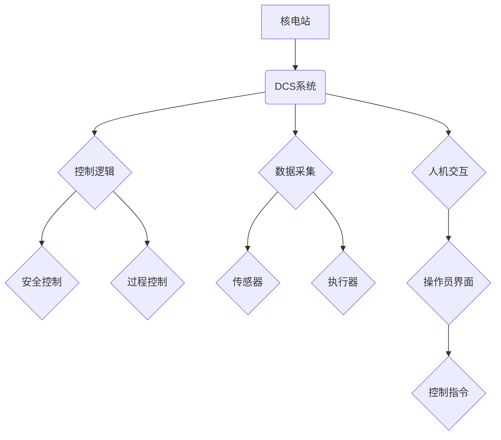

## 核电dcs系统结构分析方法研究

> 关键词：核电、DCS系统、系统结构分析、安全可靠性、控制算法、软件架构、数据通信、人机交互

## 1. 背景介绍

核电站作为一种重要的能源生产方式，其安全性和可靠性至关重要。数字控制系统（DCS）作为核电站的核心控制系统，承担着安全运行、过程控制和数据采集等关键任务。随着核电站技术的发展和智能化程度的提高，DCS系统的复杂性也随之增加，对系统结构分析的需求日益迫切。

传统的DCS系统结构分析方法主要依赖于经验和专家知识，缺乏系统性和科学性。随着计算机技术和软件工程的发展，基于模型的系统结构分析方法逐渐成为主流。这种方法通过建立系统模型，模拟系统行为，分析系统结构的优缺点，从而为系统设计和优化提供依据。

## 2. 核心概念与联系

**2.1 核心概念**

* **DCS系统:** 数字控制系统，用于控制和监测核电站的各种设备和过程，实现安全运行、过程优化和数据采集等功能。
* **系统结构分析:** 对系统组成、功能、关系和行为进行分析，以了解系统整体特性和潜在问题。
* **模型驱动设计:** 以系统模型为核心，通过模型驱动开发和验证，实现系统设计和实现的自动化和高效化。

**2.2 架构关系**



**2.3 联系分析**

DCS系统是核电站的核心控制系统，其结构设计直接影响核电站的安全性和可靠性。系统结构分析可以帮助我们：

* 了解DCS系统的组成、功能和关系，明确系统各部分的职责和相互作用。
* 分析系统结构的优缺点，识别潜在的风险和问题。
* 为系统设计和优化提供依据，提高系统的安全性、可靠性和效率。

## 3. 核心算法原理 & 具体操作步骤

**3.1 算法原理概述**

DCS系统中常用的控制算法包括PID控制、模糊控制、神经网络控制等。这些算法通过对系统输入和输出进行分析，计算控制量，实现对系统状态的调节。

* **PID控制:**  是一种经典的控制算法，通过比例、积分和微分三个环节，对系统偏差进行补偿，实现对系统状态的精确控制。
* **模糊控制:**  是一种基于模糊逻辑的控制算法，能够处理不确定性和复杂性，适用于对系统模型不完全了解的情况。
* **神经网络控制:**  是一种基于人工神经网络的控制算法，具有强大的学习和适应能力，能够实现对复杂系统的控制。

**3.2 算法步骤详解**

以PID控制为例，其具体操作步骤如下：

1. **测量系统输出:**  获取系统当前的输出值。
2. **计算偏差:**  将系统输出值与设定值进行比较，计算偏差。
3. **比例控制:**  根据偏差大小，计算比例控制量。
4. **积分控制:**  根据偏差积分值，计算积分控制量。
5. **微分控制:**  根据偏差变化率，计算微分控制量。
6. **综合控制量:**  将比例、积分和微分控制量进行加权组合，得到最终的控制量。
7. **执行控制量:**  将控制量传递给执行器，调节系统输入。

**3.3 算法优缺点**

* **PID控制:**  优点：简单易实现，控制效果好；缺点：对系统模型要求较高，难以处理非线性系统。
* **模糊控制:**  优点：能够处理不确定性和复杂性；缺点：规则设计较为复杂，难以量化分析。
* **神经网络控制:**  优点：学习能力强，适应性好；缺点：训练过程复杂，需要大量数据。

**3.4 算法应用领域**

* **PID控制:**  广泛应用于工业控制、过程控制、自动驾驶等领域。
* **模糊控制:**  应用于机器人控制、智能家居、医疗诊断等领域。
* **神经网络控制:**  应用于电力系统控制、金融风险管理、图像识别等领域。

## 4. 数学模型和公式 & 详细讲解 & 举例说明

**4.1 数学模型构建**

DCS系统可以抽象为一个状态空间模型，其数学模型可以表示为：

$$
\dot{x}(t) = f(x(t), u(t))
$$

$$
y(t) = h(x(t))
$$

其中：

* $x(t)$: 系统状态向量
* $u(t)$: 系统输入向量
* $y(t)$: 系统输出向量
* $f(x(t), u(t))$ : 系统状态方程
* $h(x(t))$ : 系统输出方程

**4.2 公式推导过程**

系统状态方程和输出方程的具体形式取决于系统的物理特性和控制算法。例如，对于一个简单的机械系统，其状态方程可以表示为：

$$
\dot{x}(t) = \frac{u(t)}{m}
$$

$$
y(t) = x(t)
$$

其中：

* $m$: 系统质量
* $u(t)$: 控制力

**4.3 案例分析与讲解**

以PID控制为例，其控制算法可以表示为：

$$
u(t) = K_p e(t) + K_i \int e(t) dt + K_d \frac{de(t)}{dt}
$$

其中：

* $K_p$: 比例系数
* $K_i$: 积分系数
* $K_d$: 微分系数
* $e(t)$: 系统偏差

通过调整PID控制参数，可以优化控制系统的性能，例如提高响应速度、减少超调量等。

## 5. 项目实践：代码实例和详细解释说明

**5.1 开发环境搭建**

* 操作系统：Linux
* 编程语言：Python
* 软件工具：

    * Jupyter Notebook
    * NumPy
    * SciPy
    * Matplotlib

**5.2 源代码详细实现**

```python
import numpy as np
from scipy.integrate import odeint
import matplotlib.pyplot as plt

# 系统参数
m = 1.0  # 质量
k = 1.0  # 弹簧系数
c = 0.1  # 阻尼系数

# PID控制参数
Kp = 1.0
Ki = 0.1
Kd = 0.01

# 系统状态方程
def system_dynamics(x, t, u):
    x1 = x[0]
    x2 = x[1]
    dx1dt = x2
    dx2dt = (-k * x1 - c * x2 + u) / m
    return [dx1dt, dx2dt]

# 初始状态
x0 = [0.0, 0.0]

# 控制输入
u = 1.0

# 时间范围
t = np.linspace(0, 10, 100)

# 求解系统状态
sol = odeint(system_dynamics, x0, t, args=(u,))

# 绘制系统状态
plt.plot(t, sol[:, 0], label='位置')
plt.plot(t, sol[:, 1], label='速度')
plt.xlabel('时间 (s)')
plt.ylabel('状态')
plt.legend()
plt.show()
```

**5.3 代码解读与分析**

* 代码首先定义了系统参数、PID控制参数和系统状态方程。
* 然后使用`odeint`函数求解系统状态方程，得到系统在不同时间点的状态。
* 最后使用`matplotlib`库绘制系统状态曲线。

**5.4 运行结果展示**

运行代码后，会生成一个包含位置和速度曲线图的图形，展示系统在控制输入作用下的动态响应。

## 6. 实际应用场景

DCS系统广泛应用于核电站的各个方面，例如：

* **反应堆控制:**  控制反应堆功率、温度和压力等关键参数，确保反应堆安全运行。
* **循环水系统控制:**  控制循环水流量、温度和压力，保证冷却系统正常工作。
* **蒸汽发生器控制:**  控制蒸汽发生器的压力、温度和流量，提高发电效率。
* **发电机控制:**  控制发电机的转速、电压和电流，保证发电稳定。

**6.4 未来应用展望**

随着人工智能、大数据和云计算技术的快速发展，DCS系统将朝着更加智能化、自动化和网络化的方向发展。未来DCS系统可能具备以下特点：

* **自学习和自适应:**  能够根据运行数据自动学习和调整控制参数，提高控制精度和效率。
* **故障诊断和预测:**  能够识别和预测潜在故障，提前采取措施避免事故发生。
* **远程监控和控制:**  能够实现远程监控和控制，提高运营效率和安全性。

## 7. 工具和资源推荐

**7.1 学习资源推荐**

* **书籍:**

    * 《核电站控制系统》
    * 《数字控制系统》
    * 《人工智能》

* **在线课程:**

    * Coursera: 数字控制系统
    * edX: 人工智能

**7.2 开发工具推荐**

* **编程语言:** Python, C++, Java
* **软件工具:**

    * MATLAB
    * Simulink
    * LabVIEW

**7.3 相关论文推荐**

* **核电DCS系统安全可靠性研究**
* **基于人工智能的核电DCS系统控制策略**
* **核电DCS系统网络安全研究**

## 8. 总结：未来发展趋势与挑战

**8.1 研究成果总结**

本文对核电DCS系统结构分析方法进行了研究，介绍了核心概念、算法原理、数学模型和代码实现等内容。

**8.2 未来发展趋势**

未来核电DCS系统将朝着更加智能化、自动化和网络化的方向发展，需要进一步研究人工智能、大数据和云计算等技术的应用。

**8.3 面临的挑战**

* **系统复杂性:**  核电DCS系统非常复杂，需要开发更加高效的分析和设计方法。
* **安全可靠性:**  核电站的安全性和可靠性至关重要，DCS系统的安全性和可靠性需要得到进一步保障。
* **技术创新:**  需要不断进行技术创新，开发更加先进的DCS系统技术。

**8.4 研究展望**

未来将继续深入研究核电DCS系统结构分析方法，探索人工智能、大数据和云计算等技术的应用，为核电站的安全运行和发展提供技术支持。

## 9. 附录：常见问题与解答

* **Q1:  核电DCS系统有哪些主要功能？**

    **A1:**  核电DCS系统主要功能包括控制和监测核电站的各种设备和过程，实现安全运行、过程优化和数据采集等。

* **Q2:  核电DCS系统有哪些常见的控制算法？**

    **A2:**  核电DCS系统常用的控制算法包括PID控制、模糊控制、神经网络控制等。

* **Q3:  核电DCS系统面临哪些挑战？**

    **A3:**  核电DCS系统面临的挑战包括系统复杂性、安全可靠性、技术创新等。


作者：禅与计算机程序设计艺术 / Zen and the Art of Computer Programming 
