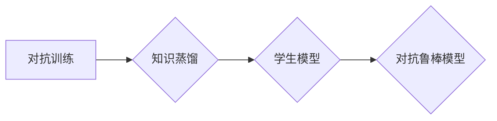

## 知识蒸馏在对抗学习中的应用研究

> 关键词：知识蒸馏、对抗学习、模型鲁棒性、迁移学习、深度学习

## 1. 背景介绍

在深度学习领域，模型的鲁棒性一直是研究的热点问题。对抗攻击是指通过对输入数据进行微小的扰动，从而导致模型输出错误的攻击方式。对抗攻击的出现对深度学习模型的安全性带来了严重威胁，也促使人们更加关注模型的鲁棒性。

知识蒸馏是一种迁移学习技术，它通过将一个大模型（教师模型）的知识传递给一个小模型（学生模型），从而提高小模型的性能。知识蒸馏不仅可以提高模型的效率，还可以提升模型的泛化能力。

近年来，研究者们开始探索将知识蒸馏应用于对抗学习领域。通过知识蒸馏，可以将对抗训练过程中获得的对抗鲁棒性知识传递给其他模型，从而提升这些模型的对抗鲁棒性。

## 2. 核心概念与联系

### 2.1 知识蒸馏

知识蒸馏是一种迁移学习技术，其核心思想是将一个大模型（教师模型）的知识传递给一个小模型（学生模型）。教师模型通常经过大量的训练数据训练，拥有更强的表达能力和泛化能力，而学生模型则通常更小，更轻量，更易于部署。

知识蒸馏通过最小化教师模型和学生模型的输出分布之间的差异来实现知识传递。除了直接最小化预测输出的差异，知识蒸馏还利用了教师模型的软标签（即预测概率分布）来指导学生模型的学习，从而获得更精细的知识传递。

### 2.2 对抗学习

对抗学习旨在训练出能够抵抗对抗攻击的鲁棒模型。对抗攻击通常通过对输入数据进行微小的扰动，从而导致模型输出错误。对抗学习的目标是训练模型能够识别和抵抗这些对抗性扰动，即使在存在对抗攻击的情况下也能保持准确性。

常见的对抗学习方法包括：

* **FGSM（Fast Gradient Sign Method）攻击：** 通过计算目标函数梯度并沿着梯度方向添加小的扰动来生成对抗样本。
* **PGD（Projected Gradient Descent）攻击：** 迭代地对对抗样本进行更新，直到达到最大攻击效果。
* **对抗训练：** 在训练过程中，除了使用原始数据，还使用对抗样本进行训练，从而提高模型的对抗鲁棒性。

### 2.3 知识蒸馏与对抗学习的结合

将知识蒸馏应用于对抗学习可以有效提升模型的对抗鲁棒性。

* **知识迁移：** 通过知识蒸馏，可以将对抗训练过程中获得的对抗鲁棒性知识传递给其他模型，从而提升这些模型的对抗鲁棒性。
* **模型压缩：** 知识蒸馏可以将大型对抗训练模型压缩成更小的模型，同时保持其对抗鲁棒性。
* **加速训练：** 使用知识蒸馏可以加速对抗训练过程，因为学生模型只需要学习教师模型的知识，而不是从头开始训练。

**Mermaid 流程图**



## 3. 核心算法原理 & 具体操作步骤

### 3.1 算法原理概述

知识蒸馏在对抗学习中的应用主要基于以下原理：

* **对抗训练的知识：** 对抗训练过程中，模型学习了识别和抵抗对抗攻击的能力，这些知识包含在教师模型的权重和参数中。
* **知识蒸馏的机制：** 知识蒸馏通过最小化教师模型和学生模型的输出分布差异来传递知识。

通过将对抗训练得到的教师模型的知识蒸馏到学生模型中，可以有效提升学生模型的对抗鲁棒性。

### 3.2 算法步骤详解

1. **对抗训练：** 使用对抗样本训练一个大型教师模型，使其能够抵抗各种类型的对抗攻击。
2. **知识蒸馏：** 使用教师模型的软标签（预测概率分布）来指导学生模型的学习。
3. **模型压缩：** 可以通过知识蒸馏将大型教师模型压缩成更小的学生模型，同时保持其对抗鲁棒性。
4. **评估：** 使用标准的对抗攻击方法评估学生模型的对抗鲁棒性，并与未进行知识蒸馏的模型进行比较。

### 3.3 算法优缺点

**优点：**

* **提升对抗鲁棒性：** 可以有效提升模型的对抗鲁棒性。
* **模型压缩：** 可以将大型对抗训练模型压缩成更小的模型。
* **加速训练：** 可以加速对抗训练过程。

**缺点：**

* **教师模型依赖：** 需要一个经过对抗训练的大型教师模型。
* **知识传递效率：** 知识传递的效率取决于教师模型和学生模型的结构和参数。

### 3.4 算法应用领域

* **图像识别：** 提升图像识别模型对对抗攻击的抵抗能力。
* **自然语言处理：** 提升自然语言处理模型对对抗文本的抵抗能力。
* **安全领域：** 提升安全系统模型对恶意攻击的抵抗能力。

## 4. 数学模型和公式 & 详细讲解 & 举例说明

### 4.1 数学模型构建

知识蒸馏的目标是最小化教师模型和学生模型的输出分布之间的差异。可以使用KL散度（Kullback-Leibler divergence）来度量两个分布之间的差异。

假设教师模型的输出为 $p(y|x)$，学生模型的输出为 $q(y|x)$，则KL散度为：

$$
KL(p||q) = \sum_y p(y|x) \log \frac{p(y|x)}{q(y|x)}
$$

其中，$x$ 是输入数据，$y$ 是输出类别。

### 4.2 公式推导过程

为了最小化KL散度，可以使用梯度下降算法进行优化。

目标函数为：

$$
L = KL(p||q) + \lambda L_{CE}
$$

其中，$L_{CE}$ 是交叉熵损失函数，$\lambda$ 是权重参数。

通过对目标函数求梯度，可以得到学生模型参数的更新规则。

### 4.3 案例分析与讲解

假设我们有一个图像分类任务，使用教师模型和学生模型进行知识蒸馏。

* 教师模型经过对抗训练，能够抵抗各种类型的对抗攻击。
* 学生模型是一个更小的模型，需要学习教师模型的知识来提升其对抗鲁棒性。

通过知识蒸馏，可以将教师模型的对抗鲁棒性知识传递给学生模型，从而使学生模型能够更好地抵抗对抗攻击。

## 5. 项目实践：代码实例和详细解释说明

### 5.1 开发环境搭建

* Python 3.6+
* TensorFlow 2.0+
* PyTorch 1.0+

### 5.2 源代码详细实现

```python
# 导入必要的库
import tensorflow as tf

# 定义教师模型和学生模型
teacher_model = tf.keras.models.load_model('teacher_model.h5')
student_model = tf.keras.models.Sequential([
    # 学生模型的层结构
])

# 定义知识蒸馏损失函数
def distillation_loss(teacher_output, student_output, temperature=1.0):
    # 计算KL散度
    kl_loss = tf.keras.losses.KLDivergence()(teacher_output, student_output)
    # 计算交叉熵损失
    ce_loss = tf.keras.losses.CategoricalCrossentropy()(teacher_output, student_output)
    # 返回总损失
    return kl_loss + ce_loss

# 定义训练函数
def train_step(images, labels):
    # 使用教师模型预测
    with tf.GradientTape() as tape:
        teacher_output = teacher_model(images)
        student_output = student_model(images)
        loss = distillation_loss(teacher_output, student_output)
    # 计算梯度并更新学生模型参数
    gradients = tape.gradient(loss, student_model.trainable_variables)
    optimizer.apply_gradients(zip(gradients, student_model.trainable_variables))
    return loss

# 训练学生模型
optimizer = tf.keras.optimizers.Adam(learning_rate=0.001)
for epoch in range(epochs):
    for batch in dataset:
        loss = train_step(batch[0], batch[1])
        print(f'Epoch: {epoch}, Loss: {loss.numpy()}')

# 保存训练好的学生模型
student_model.save('student_model.h5')
```

### 5.3 代码解读与分析

* 代码首先定义了教师模型和学生模型。
* 然后定义了知识蒸馏损失函数，该函数计算教师模型和学生模型的输出分布之间的KL散度和交叉熵损失。
* 训练函数使用梯度下降算法更新学生模型的参数。
* 最后，代码训练了学生模型并保存了训练好的模型。

### 5.4 运行结果展示

训练完成后，可以将训练好的学生模型与未进行知识蒸馏的模型进行比较，评估其对抗鲁棒性。

## 6. 实际应用场景

### 6.1 图像识别

在图像识别领域，知识蒸馏可以用于提升模型对对抗攻击的抵抗能力。例如，可以将对抗训练得到的教师模型的知识蒸馏到更小的学生模型中，从而在保持识别准确率的同时降低模型的计算成本。

### 6.2 自然语言处理

在自然语言处理领域，知识蒸馏可以用于提升模型对对抗文本的抵抗能力。例如，可以将对抗训练得到的教师模型的知识蒸馏到更小的学生模型中，从而在保持文本理解准确率的同时降低模型的计算成本。

### 6.3 安全领域

在安全领域，知识蒸馏可以用于提升安全系统模型对恶意攻击的抵抗能力。例如，可以将对抗训练得到的教师模型的知识蒸馏到更小的学生模型中，从而在保持安全检测准确率的同时降低模型的计算成本。

### 6.4 未来应用展望

随着对抗攻击技术的不断发展，知识蒸馏在对抗学习中的应用前景十分广阔。未来，知识蒸馏技术可能会应用于更多领域，例如：

* **自动驾驶：** 提升自动驾驶模型对对抗攻击的抵抗能力，确保驾驶安全。
* **医疗诊断：** 提升医疗诊断模型对对抗样本的抵抗能力，提高诊断准确率。
* **金融欺诈检测：** 提升金融欺诈检测模型对对抗攻击的抵抗能力，防止金融损失。

## 7. 工具和资源推荐

### 7.1 学习资源推荐

* **论文：**
    * Hinton, G., Vinyals, O., & Dean, J. (2015). Distilling the knowledge in a neural network. arXiv preprint arXiv:1503.02531.
    * Goodfellow, I., Shlens, J., & Szegedy, C. (2014). Explaining and harnessing adversarial examples. arXiv preprint arXiv:1412.6572.
* **博客文章：**
    * https://towardsdatascience.com/knowledge-distillation-a-powerful-technique-for-deep-learning-model-compression-a39194191197
    * https://blog.openai.com/adversarial-examples/

### 7.2 开发工具推荐

* **TensorFlow:** https://www.tensorflow.org/
* **PyTorch:** https://pytorch.org/

### 7.3 相关论文推荐

* **对抗学习：**
    * Goodfellow, I., Shlens, J., & Szegedy, C. (2014). Explaining and harnessing adversarial examples. arXiv preprint arXiv:1412.6572.
    * Kurakin, A., Goodfellow, I., & Bengio, S. (2016). Adversarial machine learning at scale. arXiv preprint arXiv:1608.04644.
* **知识蒸馏：**
    * Hinton, G., Vinyals,