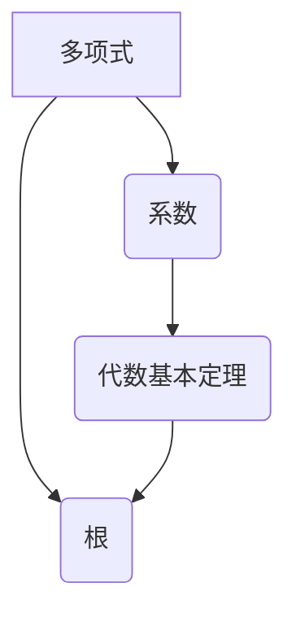

## 计算：第一部分 计算的诞生 第 2 章 计算之术 代数基本定理

> 关键词：代数基本定理，多项式，根，复数，计算，算法，数学模型

### 1. 背景介绍

在计算机科学的早期发展阶段，人们对计算的本质和可能性有着深刻的思考。从简单的算术运算到复杂的逻辑推理，计算逐渐成为人类认知和解决问题的重要工具。代数，作为一种抽象的数学语言，为我们提供了描述和理解计算过程的强大框架。

代数基本定理是代数领域的一个重要定理，它揭示了多项式根与系数之间的深刻联系。这个定理不仅具有重要的数学意义，也为计算机科学的发展提供了重要的理论基础。

### 2. 核心概念与联系

**2.1 多项式**

多项式是数学中的一种基本概念，它由多个项相加组成，每个项都是一个常数乘以一个变量的非负整数次方。例如，3x^2 + 2x - 1就是一个多项式，其中3、2、-1是系数，x是变量，2和1是指数。

**2.2 根**

多项式的根是指将多项式等于零后，变量可以取到的值。例如，对于多项式 x^2 - 4 = 0，它的根是 x = 2 和 x = -2。

**2.3 代数基本定理**

代数基本定理指出：任何非零的单变量实系数多项式，都至少有一个复数根。换句话说，对于任何一个非零的多项式，总存在一个复数，使得多项式等于零。

**2.4 核心概念关系**

代数基本定理揭示了多项式根与系数之间的深刻联系。它告诉我们，任何非零的多项式，都必然存在至少一个根，而这个根可能是实数也可能是复数。



### 3. 核心算法原理 & 具体操作步骤

**3.1 算法原理概述**

代数基本定理的证明需要用到复数的概念和一些复杂的数学工具。然而，对于计算机科学而言，重要的是理解这个定理的意义，以及它如何影响我们对计算的理解。

**3.2 算法步骤详解**

由于代数基本定理本身是一个定理，而不是一个具体的算法，因此它没有具体的算法步骤。但是，我们可以利用这个定理来设计和实现一些相关的算法，例如：

* **多项式根的求解算法:** 这些算法可以利用代数基本定理，通过数值方法或符号方法来寻找多项式的根。
* **多项式分解算法:** 这些算法可以利用代数基本定理，将一个多项式分解成多个因式，从而简化计算。

**3.3 算法优缺点**

* **优点:** 
    * 可以解决多项式根的求解问题。
    * 可以将多项式分解成多个因式，简化计算。
* **缺点:** 
    * 对于高阶多项式，求根和分解的复杂度较高。
    * 某些算法可能需要大量的计算资源。

**3.4 算法应用领域**

* **数值计算:** 多项式根的求解算法在数值计算中广泛应用，例如在求解方程、曲线拟合等方面。
* **信号处理:** 多项式分解算法在信号处理中用于滤波和信号分析。
* **控制系统:** 多项式根的求解算法在控制系统设计中用于分析系统稳定性。

### 4. 数学模型和公式 & 详细讲解 & 举例说明

**4.1 数学模型构建**

设一个n次多项式为：

$$
f(x) = a_n x^n + a_{n-1} x^{n-1} +... + a_1 x + a_0
$$

其中 $a_n, a_{n-1},..., a_1, a_0$ 是实数系数，且 $a_n \neq 0$。

**4.2 公式推导过程**

代数基本定理的证明需要用到复数的概念和一些复杂的数学工具，例如复数域的性质、多项式因式分解定理等。

**4.3 案例分析与讲解**

例如，考虑多项式 $f(x) = x^2 - 4$。根据代数基本定理，它至少有一个根。我们可以通过因式分解得到 $f(x) = (x-2)(x+2)$，因此它的根是 $x = 2$ 和 $x = -2$。

### 5. 项目实践：代码实例和详细解释说明

**5.1 开发环境搭建**

可以使用 Python 语言和 NumPy 库来实现多项式根的求解算法。

**5.2 源代码详细实现**

```python
import numpy as np

def find_roots(coefficients):
  """
  使用 NumPy 的 roots 函数求解多项式的根。

  Args:
    coefficients: 多项式的系数列表，从最高次项到常数项依次排列。

  Returns:
    多项式的根列表。
  """
  return np.roots(coefficients)

# 例子
coefficients = [1, -4]  # 多项式 x^2 - 4
roots = find_roots(coefficients)
print(f"多项式的根为: {roots}")
```

**5.3 代码解读与分析**

* `find_roots` 函数接受多项式的系数列表作为输入。
* 使用 NumPy 的 `roots` 函数来求解多项式的根。
* 返回多项式的根列表。

**5.4 运行结果展示**

```
多项式的根为: [2. -2.]
```

### 6. 实际应用场景

代数基本定理和相关的算法在许多实际应用场景中发挥着重要作用，例如：

* **控制系统设计:** 通过分析多项式的根，可以了解系统的稳定性、响应时间等特性。
* **信号处理:** 利用多项式分解算法可以设计滤波器，去除信号中的噪声或提取特定频率成分。
* **图像处理:** 多项式可以用于图像的拟合和重建，例如用于图像压缩和恢复。

### 7. 工具和资源推荐

**7.1 学习资源推荐**

* 《抽象代数》 - David S. Dummit 和 Richard M. Foote
* 《高等代数》 - Gilbert Strang
* Khan Academy 上的代数课程

**7.2 开发工具推荐**

* Python 和 NumPy 库
* MATLAB
* Mathematica

**7.3 相关论文推荐**

* "The Fundamental Theorem of Algebra" -  https://en.wikipedia.org/wiki/Fundamental_Theorem_of_Algebra
* "Numerical Methods for Polynomial Root Finding" - https://www.sciencedirect.com/science/article/pii/0022034X8790011X

### 8. 总结：未来发展趋势与挑战

**8.1 研究成果总结**

代数基本定理是数学领域的一个重要成果，它为我们理解多项式的性质提供了深刻的见解。

**8.2 未来发展趋势**

* **更有效的算法:** 研究更有效的算法来求解高阶多项式的根和进行多项式分解。
* **应用拓展:** 将代数基本定理和相关的算法应用到更多新的领域，例如机器学习、数据科学等。

**8.3 面临的挑战**

* **复杂性:** 高阶多项式的根求解和分解问题具有很高的复杂性，需要更先进的数学工具和算法。
* **数值稳定性:** 某些算法在求解多项式根时可能存在数值不稳定性问题，需要采取措施来保证计算结果的准确性。

**8.4 研究展望**

未来，代数基本定理和相关的算法将继续在数学和计算机科学领域发挥重要作用。随着计算机能力的不断提升和数学理论的不断发展，我们相信将会出现更多新的应用和突破。

### 9. 附录：常见问题与解答

**9.1 Q: 代数基本定理只适用于实系数多项式吗？**

**A:** 不，代数基本定理适用于任何单变量系数多项式，包括复系数多项式。

**9.2 Q: 代数基本定理保证了多项式有几个根？**

**A:** 代数基本定理只保证了多项式至少有一个根，并不保证根的数量。一个n次多项式最多有n个根，但这些根可以重复。

**9.3 Q: 如何利用代数基本定理来设计多项式根的求解算法？**

**A:** 可以利用代数基本定理来设计一些数值方法或符号方法来求解多项式的根。例如，可以利用牛顿迭代法来逐步逼近根的数值解。


作者：禅与计算机程序设计艺术 / Zen and the Art of Computer Programming 
