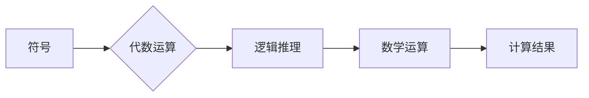

## 计算：第一部分 计算的诞生 第 2 章 计算之术 符号与代数

> 关键词：符号计算、代数运算、算法、数学模型、编程语言、计算机科学基础

### 1. 背景介绍

在上一章中，我们探讨了计算的本质和早期形式。本章将深入探讨计算之术的核心：符号与代数。符号作为计算的基石，赋予了计算机理解和操作抽象概念的能力。代数则为符号提供了操作规则，使得我们可以进行复杂的逻辑推理和数学运算。

从简单的算术运算到复杂的科学计算，符号与代数在计算领域扮演着至关重要的角色。理解它们之间的关系，对于深入理解计算机科学的本质至关重要。

### 2. 核心概念与联系

#### 2.1 符号

符号是抽象概念的表示形式，可以是字母、数字、图形或其他标记。在计算中，符号被用来代表变量、常量、运算符和逻辑关系等。

#### 2.2 代数

代数是数学的一个分支，它使用符号和运算规则来表达和解决数学问题。代数运算包括加、减、乘、除、指数、根号等，以及变量的代换和方程的求解。

#### 2.3 符号与代数的联系

符号和代数是密不可分的。符号提供了抽象概念的表示形式，而代数则为这些符号提供了操作规则。通过符号和代数的结合，计算机能够处理抽象概念，进行逻辑推理和数学运算。

**Mermaid 流程图**



### 3. 核心算法原理 & 具体操作步骤

#### 3.1 算法原理概述

符号代数运算的核心算法是基于规则的推理和替换。这些规则定义了符号之间的关系和操作方式，例如加法、减法、乘法、除法、指数运算等。

算法的基本步骤包括：

1. **符号解析:** 将输入的符号表达式解析成树形结构，以便于进行操作。
2. **规则匹配:** 根据符号表达式的结构，匹配相应的代数运算规则。
3. **符号替换:** 根据匹配的规则，将符号表达式进行替换，简化表达式。
4. **结果输出:** 输出最终的计算结果。

#### 3.2 算法步骤详解

以简单的加法运算为例，算法步骤如下：

1. **符号解析:** 将表达式 "a + b" 解析成树形结构：

```
+
/ \
a  b
```

2. **规则匹配:** 匹配加法规则：

```
a + b = c
```

3. **符号替换:** 将 "a" 和 "b" 替换为具体的数值，例如 "a = 2" 和 "b = 3"，则表达式变为：

```
2 + 3 = c
```

4. **结果输出:** 计算结果 "c = 5"。

#### 3.3 算法优缺点

**优点:**

* **精确性:** 基于规则的推理保证了计算结果的精确性。
* **可扩展性:** 可以通过添加新的规则来扩展算法的处理能力。
* **可解释性:** 算法步骤清晰易懂，易于理解和调试。

**缺点:**

* **效率:** 对于复杂的表达式，算法执行效率可能较低。
* **表达能力:** 某些复杂的数学概念可能难以用符号和规则来表达。

#### 3.4 算法应用领域

符号代数运算算法广泛应用于以下领域：

* **数学软件:** Mathematica、Maple、MATLAB 等数学软件都依赖于符号代数运算算法。
* **科学计算:** 科学计算中需要进行复杂的数学运算，例如求解微分方程、数值积分等。
* **人工智能:** 符号代数运算是人工智能领域中知识表示和推理的基础。

### 4. 数学模型和公式 & 详细讲解 & 举例说明

#### 4.1 数学模型构建

符号代数运算可以抽象为一个数学模型，其中：

* **符号:** 表示抽象概念，例如变量、常量、运算符等。
* **表达式:** 由符号和运算符组成的组合，表示一个数学关系。
* **规则:** 定义了符号之间的关系和操作方式，例如加法规则、乘法规则等。

#### 4.2 公式推导过程

一个典型的符号代数运算公式是：

$$
a + b = c
$$

其中，a、b、c 是符号，+ 是加法运算符。

这个公式表示两个符号 a 和 b 的和等于符号 c。

#### 4.3 案例分析与讲解

以求解方程为例，假设我们有一个方程：

$$
2x + 3 = 7
$$

我们可以使用符号代数运算算法来求解 x 的值。

1. **符号解析:** 将方程解析成树形结构。
2. **规则匹配:** 匹配减法规则，将等式两边减去 3：

$$
2x = 4
$$

3. **符号替换:** 将等式两边除以 2：

$$
x = 2
$$

4. **结果输出:** x 的值等于 2。

### 5. 项目实践：代码实例和详细解释说明

#### 5.1 开发环境搭建

可以使用 Python 语言和 SymPy 库来实现符号代数运算。

#### 5.2 源代码详细实现

```python
from sympy import symbols, Eq, solve

# 定义符号变量
x = symbols('x')

# 定义方程\nequation = Eq(2*x + 3, 7)

# 求解方程
solution = solve(equation, x)

# 打印结果
print(f"方程的解为: {solution}")
```

#### 5.3 代码解读与分析

1. `from sympy import symbols, Eq, solve`: 导入 SymPy 库中的符号定义、方程定义和求解函数。
2. `x = symbols('x')`: 定义符号变量 x。
3. `equation = Eq(2*x + 3, 7)`: 定义方程 2x + 3 = 7。
4. `solution = solve(equation, x)`: 使用 solve 函数求解方程，得到 x 的解。
5. `print(f"方程的解为: {solution}")`: 打印结果。

#### 5.4 运行结果展示

```
方程的解为: [2]
```

### 6. 实际应用场景

符号代数运算在各种实际应用场景中发挥着重要作用，例如：

* **科学计算:** 计算物理、化学、生物学等领域的复杂公式和模型。
* **工程设计:** 进行结构分析、电路设计、控制系统设计等。
* **人工智能:** 实现知识表示、推理和决策。

### 6.4 未来应用展望

随着人工智能和计算能力的不断发展，符号代数运算将在更多领域得到应用，例如：

* **自动数学证明:** 自动化数学证明过程，提高数学研究效率。
* **个性化教育:** 根据学生的学习进度和能力，提供个性化的数学学习内容。
* **科学发现:** 通过符号代数运算，发现新的科学规律和理论。

### 7. 工具和资源推荐

#### 7.1 学习资源推荐

* **书籍:**
    * 《数学基础》
    * 《计算机代数》
    * 《符号计算》
* **在线课程:**
    * Coursera 上的数学和计算机科学课程
    * edX 上的数学和计算机科学课程

#### 7.2 开发工具推荐

* **SymPy:** Python 符号计算库
* **Mathematica:** 商业数学软件
* **Maple:** 商业数学软件

#### 7.3 相关论文推荐

* **论文搜索引擎:** Google Scholar、arXiv
* **计算机科学期刊:** ACM Transactions on Programming Languages and Systems (TOPLAS)、Journal of the ACM (JACM)

### 8. 总结：未来发展趋势与挑战

#### 8.1 研究成果总结

符号代数运算算法的发展推动了计算机科学的进步，使得计算机能够处理抽象概念和进行复杂的数学运算。

#### 8.2 未来发展趋势

未来，符号代数运算算法将朝着以下方向发展：

* **更高效:** 开发更有效的符号代数运算算法，提高计算效率。
* **更强大:** 扩展算法的处理能力，支持更复杂的数学概念和运算。
* **更智能:** 将人工智能技术与符号代数运算相结合，实现更智能的计算。

#### 8.3 面临的挑战

符号代数运算算法也面临着一些挑战：

* **表达能力:** 某些复杂的数学概念难以用符号和规则来表达。
* **可解释性:** 随着算法复杂度的增加，算法的可解释性降低。
* **安全性:** 符号代数运算算法可能存在安全漏洞，需要加强安全防护。

#### 8.4 研究展望

未来研究将集中在以下方面：

* **开发新的符号代数运算算法:** 提高算法效率和表达能力。
* **将人工智能技术与符号代数运算相结合:** 实现更智能的计算。
* **加强符号代数运算算法的安全防护:** 确保算法的安全性。

### 9. 附录：常见问题与解答

* **Q1: 符号代数运算和数值计算有什么区别？**

* **A1:** 符号代数运算处理的是符号表达式，而数值计算处理的是数值数据。符号代数运算可以进行精确的数学推理，而数值计算可能存在精度误差。

* **Q2: 如何选择合适的符号代数运算工具？**

* **A2:** 选择符号代数运算工具需要考虑以下因素：
    * **功能:** 工具是否支持所需的数学运算和功能。
    * **效率:** 工具的计算效率如何。
    * **易用性:** 工具是否易于学习和使用。
    * **成本:** 工具的成本是否合理。

* **Q3: 符号代数运算在哪些领域有应用？**

* **A3:** 符号代数运算广泛应用于科学计算、工程设计、人工智能等领域。


作者：禅与计算机程序设计艺术 / Zen and the Art of Computer Programming 
