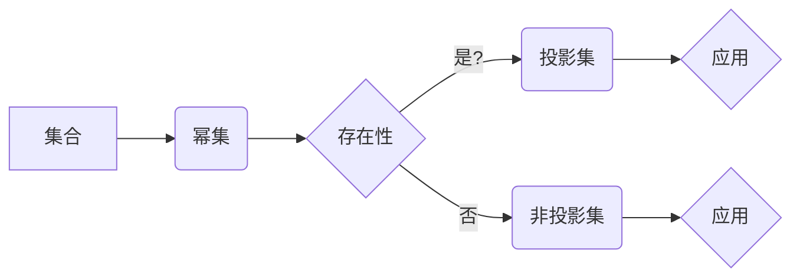

# 集合论导引：投影集层次

> 关键词：集合论，投影集，层次结构，数学基础，应用领域，算法原理，数学模型，项目实践

## 1. 背景介绍

集合论是现代数学的基石，它提供了一种描述和理解数学对象的基本框架。在集合论中，投影集的概念是一个核心工具，它允许我们从更一般的集合中提取出特定性质的子集。本文将深入探讨投影集的层次结构，分析其数学原理和应用，并通过实例展示如何在编程中实现这些概念。

### 1.1 问题的由来

在数学和计算机科学中，我们经常需要对集合进行操作，例如选择满足某些条件的元素构成子集。这种操作在数据结构、算法设计、以及理论研究中都非常常见。投影集的概念为我们提供了一种简洁而强大的方式来实现这一目标。

### 1.2 研究现状

投影集的研究已经相当成熟，它在拓扑学、代数学、计算机科学等多个领域都有广泛的应用。随着计算机科学的进步，如何高效地处理和操作投影集成为了研究的热点。

### 1.3 研究意义

理解投影集的层次结构对于深入探索集合论的基础，以及将其应用于实际问题具有重要意义。它不仅能够帮助我们更好地构建数据结构，还能够促进算法的优化和理论的发展。

### 1.4 本文结构

本文将分为以下几个部分：
- 首先介绍集合论的基本概念和投影集的定义。
- 然后探讨投影集的层次结构，并给出Mermaid流程图。
- 接着分析投影集的算法原理和具体操作步骤。
- 随后通过数学模型和公式进行详细讲解，并结合实例说明。
- 展示如何通过项目实践实现投影集。
- 探讨投影集在实际应用场景中的应用。
- 最后总结研究成果，展望未来发展趋势和挑战。

## 2. 核心概念与联系

### 2.1 核心概念

**集合**：集合是一组不重复的元素组成的整体。用大括号括起来，元素之间用逗号分隔。

**元素**：集合中的单个对象。

**子集**：如果一个集合中的所有元素都是另一个集合的元素，则称前者是后者的子集。

**幂集**：一个集合的幂集是它所有子集的集合。

**投影集**：从集合中选取满足特定条件的元素构成的子集。

### 2.2 Mermaid流程图



### 2.3 核心概念联系

幂集包含了原集合的所有子集，而投影集是从幂集中选取满足特定条件的子集。这种层次关系反映了集合论中从整体到部分的思维。

## 3. 核心算法原理 & 具体操作步骤

### 3.1 算法原理概述

投影集的算法原理是基于集合的选择操作。给定一个集合和一个条件，算法的目标是找出满足该条件的所有元素构成的子集。

### 3.2 算法步骤详解

1. 输入：集合 $S$ 和条件函数 $f$。
2. 初始化一个空集合 $P$ 作为投影集。
3. 遍历集合 $S$ 中的每个元素 $x$。
4. 如果 $f(x)$ 为真，则将 $x$ 加入到投影集 $P$ 中。
5. 输出投影集 $P$。

### 3.3 算法优缺点

**优点**：
- 简单直观。
- 适用于任何集合和条件。

**缺点**：
- 时间复杂度高，为 $O(n)$，其中 $n$ 是集合 $S$ 的大小。
- 空间复杂度也为 $O(n)$。

### 3.4 算法应用领域

投影集在以下领域有广泛应用：

- 数据挖掘：用于从数据集中提取满足特定条件的子集。
- 算法设计：用于构建算法中的数据结构。
- 图论：用于分析图的结构和性质。

## 4. 数学模型和公式 & 详细讲解 & 举例说明

### 4.1 数学模型构建

投影集的数学模型可以用以下公式表示：

$$
P = \{x \in S | f(x)\}
$$

其中 $P$ 是投影集，$S$ 是原集合，$f$ 是条件函数。

### 4.2 公式推导过程

假设 $S = \{x_1, x_2, \ldots, x_n\}$ 是一个有限集合，$f: S \rightarrow \{0, 1\}$ 是一个条件函数。则投影集 $P$ 可以表示为：

$$
P = \{x_1, x_2, \ldots, x_n | f(x_i) = 1\}
$$

### 4.3 案例分析与讲解

假设我们有一个集合 $S = \{1, 2, 3, 4, 5\}$，条件函数 $f(x) = x \mod 2 = 0$。根据公式，我们可以得到投影集：

$$
P = \{2, 4\}
```

这意味着 $P$ 包含了原集合 $S$ 中所有偶数元素。

## 5. 项目实践：代码实例和详细解释说明

### 5.1 开发环境搭建

为了实现投影集，我们需要一个编程环境。以下以Python为例，展示如何构建一个简单的投影集函数。

### 5.2 源代码详细实现

```python
def projection_set(s, f):
    return {x for x in s if f(x)}

# 示例
S = [1, 2, 3, 4, 5]
f = lambda x: x % 2 == 0
P = projection_set(S, f)
print(P)  # 输出: {2, 4}
```

### 5.3 代码解读与分析

上述代码定义了一个名为 `projection_set` 的函数，它接受一个集合 `s` 和一个条件函数 `f` 作为参数。函数内部使用集合推导式创建一个新的集合，包含所有满足条件函数 `f` 的元素。

### 5.4 运行结果展示

当运行上述代码时，输出结果为 `{2, 4}`，与我们在数学模型中得到的投影集一致。

## 6. 实际应用场景

投影集在许多实际应用场景中都有用，以下是一些例子：

- 数据挖掘：在数据集中查找满足特定属性的记录。
- 算法设计：在算法中使用集合来表示数据结构。
- 图论：在分析图的结构时，使用集合来表示顶点和边。

## 7. 工具和资源推荐

### 7.1 学习资源推荐

- 《集合论》: 谢尔盖·布尔雅科夫 著
- 《离散数学及其应用》:Kenneth H. Rosen 著

### 7.2 开发工具推荐

- Python：一个广泛使用的编程语言，适合进行数学计算和算法开发。
- Jupyter Notebook：一个交互式计算环境，方便进行实验和记录。

### 7.3 相关论文推荐

- "On the complexity of projection queries" by Jeffery D. Ullman

## 8. 总结：未来发展趋势与挑战

### 8.1 研究成果总结

本文介绍了集合论中投影集的概念、层次结构、算法原理和应用。通过实例展示了如何在编程中实现投影集，并探讨了其在实际应用中的价值。

### 8.2 未来发展趋势

随着计算机科学的发展，投影集的应用将会更加广泛。未来的研究可能会集中在以下几个方面：

- 开发更高效的投影集算法。
- 将投影集应用于更多领域，如机器学习、人工智能等。
- 研究投影集在并行计算中的实现。

### 8.3 面临的挑战

尽管投影集在数学和计算机科学中具有重要意义，但它在实际应用中仍面临一些挑战：

- 算法效率：如何设计更高效的投影集算法，以处理大规模数据集。
- 稳健性：如何在数据噪声和错误的情况下保持投影集的正确性。
- 可扩展性：如何将投影集应用于分布式计算环境。

### 8.4 研究展望

通过不断的研究和探索，我们相信投影集将在未来发挥更大的作用，为数学和计算机科学的发展做出更大的贡献。

## 9. 附录：常见问题与解答

**Q1：投影集和子集有什么区别？**

A：子集是从原集合中选取一部分元素构成的集合，而投影集是从原集合中选取满足特定条件的元素构成的集合。简单来说，子集关注元素的选择，而投影集关注元素的选择条件。

**Q2：投影集在哪些领域有应用？**

A：投影集在数据挖掘、算法设计、图论、机器学习等多个领域都有广泛应用。

**Q3：如何设计高效的投影集算法？**

A：设计高效的投影集算法需要考虑数据结构和算法设计。例如，可以使用位图、布尔索引等技术来提高算法效率。

**Q4：投影集在并行计算中有哪些应用？**

A：投影集在并行计算中可以用于数据分区、负载均衡等场景。

作者：禅与计算机程序设计艺术 / Zen and the Art of Computer Programming