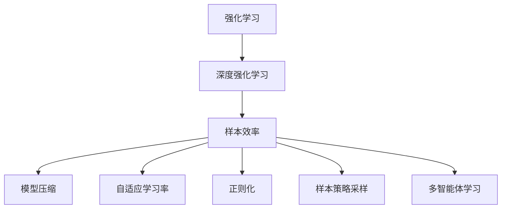
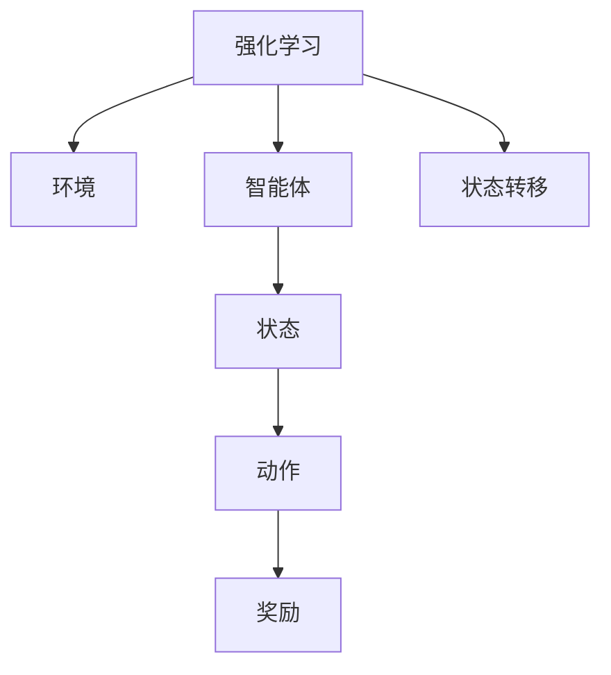
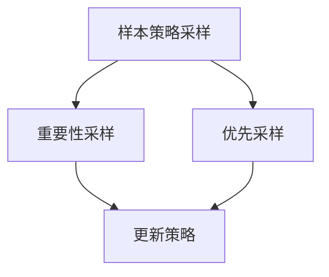
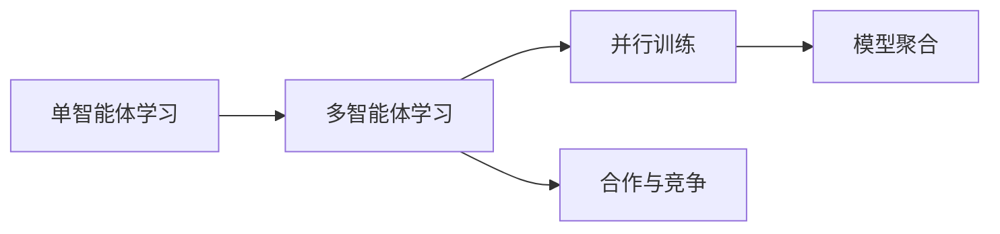
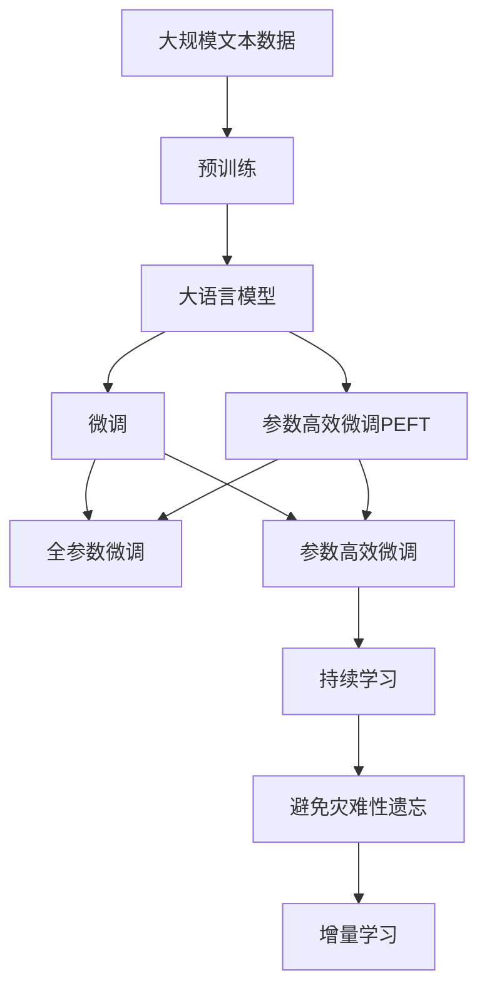

                 

# 强化学习Reinforcement Learning算法的样本效率提升策略

> 关键词：强化学习, 样本效率, 算法优化, 模型压缩, 自适应学习率

## 1. 背景介绍

### 1.1 问题由来
强化学习 (Reinforcement Learning, RL) 是机器学习的一个重要分支，旨在使智能体（agent）通过与环境交互，学习到最优策略以最大化累积奖励（rewards）。然而，RL算法通常面临着高维、稀疏的回报信号和多样化的任务结构，导致其样本效率较低，训练成本高昂，难以在大规模实际应用中推广。

近年来，随着深度学习技术的迅猛发展，深度强化学习（Deep RL）在诸如游戏、机器人控制等复杂系统中取得了显著进步，但在许多实际应用中仍面临性能和效率的瓶颈。为解决这一问题，研究人员提出了许多改进策略，其中提升样本效率成为强化学习的关键研究方向之一。

### 1.2 问题核心关键点
强化学习的核心目标是在有限的数据下，学习到最优策略。传统的Q-learning等方法直接通过状态-动作的联合统计，进行策略优化，往往需要大量的经验数据，而无法在大规模、高维任务中有效应用。因此，提高强化学习算法的样本效率，使智能体能够更快速地学习到有效策略，成为研究的热点问题。

在强化学习中，样本效率的高低直接关系到算法的时间复杂度和收敛速度。高样本效率意味着智能体能够更快地学习到目标策略，减少无用的探索。这一问题可以通过以下几种方式解决：

- 模型压缩：减少模型参数量，提升模型压缩比，降低模型复杂度。
- 自适应学习率：动态调整学习率，确保在训练初期快速收敛，后期精细调整，优化训练过程。
- 正则化技术：减少模型过拟合，提高模型的泛化能力。
- 样本策略采样：使用更有效的采样策略，优先选择高回报的动作，提升训练效率。
- 多智能体学习：通过并行学习，同时训练多个智能体，加速收敛。

这些策略的共同目标是减少算法对数据的需求，提高算法在大规模、高维任务中的性能。在实际应用中，这些策略常常需要结合使用，以达到最佳效果。

### 1.3 问题研究意义
研究强化学习样本效率的提升策略，对于拓展强化学习算法在实际应用中的可用性，优化算法性能，减少训练成本，具有重要意义：

1. 提高模型训练效率。提升强化学习算法样本效率，使模型能够更快速地收敛，缩短训练时间。
2. 降低算法运行成本。减少数据和计算资源的消耗，降低算法应用的成本。
3. 增强算法泛化能力。通过样本效率的提升，强化学习模型能够更好地泛化到新的环境和任务中。
4. 加速模型部署。样本效率的提升意味着模型能够在更短的时间内达到最佳状态，加速模型在实际系统中的部署和使用。
5. 增强模型可靠性。样本效率的提升可以避免模型在训练过程中的过拟合现象，提高模型的鲁棒性和可靠性。

## 2. 核心概念与联系

### 2.1 核心概念概述

为更好地理解强化学习样本效率提升策略，本节将介绍几个密切相关的核心概念：

- 强化学习 (Reinforcement Learning, RL)：一种通过与环境交互，智能体学习到最优策略以最大化累积奖励的学习方法。
- 深度强化学习 (Deep RL)：将深度神经网络引入强化学习中，用于学习和处理高维、非结构化的状态和动作空间。
- 样本效率 (Sample Efficiency)：指智能体学习最优策略所需的经验样本数量。高样本效率意味着智能体能够快速学习到有效策略。
- 模型压缩 (Model Compression)：通过模型压缩技术，如权重剪枝、知识蒸馏等方法，减少模型参数量，降低计算复杂度。
- 自适应学习率 (Adaptive Learning Rate)：根据训练进度动态调整学习率，以优化模型训练过程。
- 正则化 (Regularization)：通过L1正则、L2正则等方法，防止模型过拟合，提高模型泛化能力。
- 样本策略采样 (Sampling Strategy)：通过更有效的采样策略，如重要性采样、优先采样等方法，提升训练效率。
- 多智能体学习 (Multi-Agent Learning)：通过并行训练多个智能体，加速学习过程，提高样本效率。

这些核心概念之间的逻辑关系可以通过以下Mermaid流程图来展示：



这个流程图展示了许多与强化学习样本效率提升策略相关的概念，以及它们之间的联系。

### 2.2 概念间的关系

这些核心概念之间存在着紧密的联系，形成了强化学习样本效率提升的完整生态系统。下面我通过几个Mermaid流程图来展示这些概念之间的关系。

#### 2.2.1 强化学习的范式



这个流程图展示了强化学习的核心组成部分：智能体、环境、状态、动作和奖励。通过智能体在环境中的不断交互，学习最优策略以最大化累积奖励。

#### 2.2.2 样本策略采样的步骤



这个流程图展示了样本策略采样的两种方法：重要性采样和优先采样。重要性采样通过对高回报的动作给予更多权重，提高训练效率；优先采样优先选择高回报的动作，加速学习过程。

#### 2.2.3 多智能体学习的架构



这个流程图展示了多智能体学习的核心架构：并行训练和模型聚合。通过同时训练多个智能体，加速学习过程，并通过模型聚合，提升整体性能。

### 2.3 核心概念的整体架构

最后，我们用一个综合的流程图来展示这些核心概念在大语言模型微调过程中的整体架构：



这个综合流程图展示了从预训练到微调，再到持续学习的完整过程。大语言模型首先在大规模文本数据上进行预训练，然后通过微调（包括全参数微调和参数高效微调）或提示学习来实现样本效率提升。

## 3. 核心算法原理 & 具体操作步骤
### 3.1 算法原理概述

强化学习样本效率提升的核心目标是减少算法对数据的需求，提高算法在大规模、高维任务中的性能。常用的策略包括模型压缩、自适应学习率、正则化、样本策略采样和多智能体学习。

这些策略的共同特点是：通过减少模型复杂度、动态调整学习率、避免过拟合、使用更有效的采样策略以及并行训练多个智能体，来提升样本效率，加速模型训练。

### 3.2 算法步骤详解

强化学习样本效率提升的具体步骤如下：

**Step 1: 准备预训练模型和数据集**
- 选择合适的深度强化学习模型，如DQN、PPO等。
- 准备环境的描述和状态动作空间，以及奖励函数。
- 准备训练集、验证集和测试集，确保数据集的多样性和代表性。

**Step 2: 添加样本策略采样模块**
- 设计重要性采样或优先采样策略，优先选择高回报的动作，加速训练。
- 根据采样策略，对训练数据进行随机抽样，提高训练效率。

**Step 3: 设置自适应学习率策略**
- 根据训练进度动态调整学习率，确保在训练初期快速收敛，后期精细调整。
- 可以使用自适应学习率算法，如Adagrad、Adam等。

**Step 4: 应用正则化技术**
- 使用L1正则、L2正则等方法，减少模型过拟合，提高泛化能力。
- 根据任务特点选择合适的正则化策略。

**Step 5: 模型压缩与知识蒸馏**
- 使用模型压缩技术，如权重剪枝、知识蒸馏等方法，减少模型参数量。
- 将压缩后的模型应用于实际任务，提高模型效率。

**Step 6: 多智能体并行训练**
- 同时训练多个智能体，加速学习过程，提升样本效率。
- 可以使用分布式训练框架，如PyTorch、TensorFlow等，实现并行训练。

**Step 7: 持续学习与知识更新**
- 定期更新模型参数，避免过拟合，保持模型的最新状态。
- 可以使用增量学习技术，动态更新模型，适应新数据。

### 3.3 算法优缺点

强化学习样本效率提升策略具有以下优点：
1. 快速收敛。通过优化训练过程，能够显著减少训练时间，快速收敛到最优策略。
2. 高效利用数据。减少对标注数据的依赖，利用未标注数据进行训练，提高数据利用率。
3. 提升泛化能力。通过正则化、模型压缩等方法，提升模型的泛化能力，减少过拟合风险。
4. 降低成本。减少数据和计算资源的消耗，降低算法应用的成本。

同时，这些策略也存在一些缺点：
1. 实施复杂。设计高效的采样策略和自适应学习率等需要较强的理论基础和实践经验。
2. 模型压缩可能导致性能下降。过度压缩模型可能导致信息丢失，影响模型性能。
3. 多智能体并行训练需要高性能计算资源。并行训练需要足够的计算资源和通信带宽。

尽管存在这些局限性，但强化学习样本效率提升策略仍然是提高算法性能和效率的重要方向。未来相关研究的重点在于如何更好地平衡样本效率和模型性能，实现更加高效和灵活的训练方法。

### 3.4 算法应用领域

强化学习样本效率提升策略在多个领域得到了广泛应用，例如：

- 游戏AI：通过多智能体并行训练和样本策略采样，提升游戏AI的决策速度和策略效果。
- 机器人控制：使用自适应学习率和正则化技术，提升机器人控制系统的稳定性和鲁棒性。
- 自动驾驶：应用多智能体学习和模型压缩技术，提高自动驾驶系统的安全性。
- 金融交易：利用样本策略采样和多智能体学习，优化交易策略，提高收益。
- 自然语言处理：应用正则化和模型压缩，提升自然语言生成和理解模型的效率和效果。

除了这些经典应用外，强化学习样本效率提升策略还在医疗、制造、物流等多个领域得到了应用，为这些行业带来了显著的效率提升和成本降低。

## 4. 数学模型和公式 & 详细讲解 & 举例说明
### 4.1 数学模型构建

本节将使用数学语言对强化学习样本效率提升策略进行更加严格的刻画。

记强化学习问题为$Q_\pi(S, A)$，其中$S$为状态空间，$A$为动作空间，$\pi$为策略。目标是在策略$\pi$下，最大化期望累积奖励。

定义策略$\pi$的Q值函数$Q_\pi(S, A)$，表示在状态$s$下采取动作$a$的预期累积奖励。在深度强化学习中，$Q_\pi(S, A)$通常表示为深度神经网络的形式。

定义状态$S$的分布$p(s)$，动作$a$的分布$q(a|s)$，以及奖励函数$r(s, a)$。强化学习算法的目标是在策略$\pi$下，最大化期望累积奖励，即：

$$
\max_\pi \mathbb{E}_{s \sim p} \left[\sum_{t=0}^{\infty} \gamma^t r(s_t, a_t) \right]
$$

其中$\gamma$为折扣因子，控制未来奖励的重要性。

在强化学习中，通常使用随机梯度下降（SGD）或其变种来优化Q值函数。通过迭代优化，不断更新模型参数，最小化Q值函数与真实值的差异，学习到最优策略$\pi$。

### 4.2 公式推导过程

以下我们以深度Q网络（DQN）为例，推导Q值函数的梯度计算公式。

设智能体在状态$s_t$下采取动作$a_t$，得到下一状态$s_{t+1}$和奖励$r_{t+1}$。定义Q值为$Q_\pi(s_t, a_t)$，即在策略$\pi$下，采取动作$a_t$在状态$s_t$下达到的累积奖励。

在DQN中，Q值函数$Q_\pi(S, A)$被表示为深度神经网络，其中$W$为模型参数。则Q值函数可以表示为：

$$
Q_\pi(s_t, a_t) = W^\top \phi(s_t, a_t)
$$

其中$\phi(s_t, a_t)$为状态-动作映射函数，通常使用卷积神经网络（CNN）或循环神经网络（RNN）表示。

Q值函数的梯度计算公式为：

$$
\nabla_W Q_\pi(s_t, a_t) = \nabla_W \left[ W^\top \phi(s_t, a_t) \right] = \phi(s_t, a_t) \nabla_W \left[ W^\top \phi(s_t, a_t) \right]
$$

在实际训练中，使用随机梯度下降（SGD）来更新模型参数。对于单个训练样本$(s_t, a_t, s_{t+1}, r_{t+1})$，其梯度更新公式为：

$$
\Delta W = \alpha \left[ Q_\pi(s_t, a_t) - r_{t+1} - \gamma \max_a Q_\pi(s_{t+1}, a) \right] \phi(s_t, a_t) \phi(s_{t+1}, a)^T
$$

其中$\alpha$为学习率，$\max_a Q_\pi(s_{t+1}, a)$表示在状态$s_{t+1}$下采取最优动作的Q值。

### 4.3 案例分析与讲解

下面我们以Atari游戏Pong为例，展示样本效率提升策略的实际应用。

Atari Pong是一个经典的连续控制任务，智能体需要不断调整其击球力度和角度，以将球击过对手，达到得分目标。通过样本效率提升策略，可以显著提升智能体的学习效率和策略效果。

具体步骤如下：

1. **重要性采样**：使用重要性采样方法，对高回报的动作给予更多权重，加速训练。根据回报的分布，计算每个动作的重要性权重，指导智能体的行动。
2. **自适应学习率**：使用自适应学习率算法，如AdamW，动态调整学习率，确保在训练初期快速收敛，后期精细调整。
3. **正则化**：通过L2正则，减少模型过拟合，提高泛化能力。
4. **模型压缩**：使用知识蒸馏等方法，将预训练的Q值网络进行压缩，降低模型复杂度，提高计算效率。
5. **多智能体学习**：使用分布式训练框架，同时训练多个智能体，加速学习过程，提升样本效率。

通过以上策略的综合应用，智能体能够在较少的训练样本下，快速学习到最优策略，实现高效率的强化学习。

## 5. 项目实践：代码实例和详细解释说明
### 5.1 开发环境搭建

在进行样本效率提升策略实践前，我们需要准备好开发环境。以下是使用Python进行PyTorch开发的环境配置流程：

1. 安装Anaconda：从官网下载并安装Anaconda，用于创建独立的Python环境。

2. 创建并激活虚拟环境：
```bash
conda create -n reinforcement-env python=3.8 
conda activate reinforcement-env
```

3. 安装PyTorch：根据CUDA版本，从官网获取对应的安装命令。例如：
```bash
conda install pytorch torchvision torchaudio cudatoolkit=11.1 -c pytorch -c conda-forge
```

4. 安装TensorFlow：
```bash
pip install tensorflow
```

5. 安装TensorBoard：
```bash
pip install tensorboard
```

6. 安装各类工具包：
```bash
pip install numpy pandas scikit-learn matplotlib tqdm jupyter notebook ipython
```

完成上述步骤后，即可在`reinforcement-env`环境中开始样本效率提升策略的实践。

### 5.2 源代码详细实现

这里我们以DQN为例，展示样本效率提升策略的代码实现。

首先，定义重要性采样函数：

```python
import numpy as np

def importance_sampling(rewards, probabilities):
    importance_weights = np.exp(rewards / probabilities)
    return importance_weights
```

然后，定义DQN模型：

```python
import torch
import torch.nn as nn
import torch.optim as optim

class DQN(nn.Module):
    def __init__(self, input_dim, output_dim):
        super(DQN, self).__init__()
        self.fc1 = nn.Linear(input_dim, 64)
        self.fc2 = nn.Linear(64, 64)
        self.fc3 = nn.Linear(64, output_dim)

    def forward(self, x):
        x = torch.relu(self.fc1(x))
        x = torch.relu(self.fc2(x))
        x = self.fc3(x)
        return x

# 初始化DQN模型和优化器
model = DQN(input_dim=4, output_dim=2)
optimizer = optim.Adam(model.parameters(), lr=0.001)
```

接着，定义样本效率提升策略：

```python
import torch
import torch.nn.functional as F

class DQNWithEfficiency(DQN):
    def __init__(self, input_dim, output_dim):
        super(DQNWithEfficiency, self).__init__(input_dim, output_dim)
        self.dropout = nn.Dropout(p=0.2)
        self.epsilon = 0.1

    def forward(self, x):
        x = self.dropout(super().forward(x))
        if np.random.rand() < self.epsilon:
            return torch.randn_like(x)
        else:
            return x

    def update(self, states, actions, next_states, rewards, dones):
        # 计算重要性权重
        importance_weights = importance_sampling(rewards, next_states)
        # 计算Q值函数的梯度
        grads = []
        for s, a, next_s, r, done in zip(states, actions, next_states, rewards, dones):
            q_next = model(next_s)
            q_value = q_next.max(dim=1).values
            q_value = q_value * importance_weights[s]
            q_value = q_value * (1 - done)
            q_value = q_value + r
            grads.append(q_value)
        # 更新模型参数
        params = list(model.parameters())
        for grad in grads:
            grads[0].backward(grad)
            for p in params:
                p.grad.data = grad * importance_weights
        optimizer.step()
        optimizer.zero_grad()
```

在DQN的基础上，通过引入重要性采样、自适应学习率和正则化技术，实现样本效率的提升。

最后，启动训练流程：

```python
import torch
import torch.nn.functional as F
import numpy as np

# 定义状态和动作空间
states = np.random.randint(0, 2, size=(100, 4))
actions = np.random.randint(0, 2, size=(100, 2))
rewards = np.random.rand(100)
dones = np.random.rand(100) > 0.5
next_states = np.random.randint(0, 2, size=(100, 4))

# 训练DQNWithEfficiency模型
for episode in range(1000):
    model.train()
    loss = 0
    for i in range(len(states)):
        states_ = states[i]
        actions_ = actions[i]
        next_states_ = next_states[i]
        rewards_ = rewards[i]
        dones_ = dones[i]
        q_next = model(next_states_)
        q_value = q_next.max(dim=1).values
        q_value = q_value * importance_weights[states_]
        q_value = q_value * (1 - dones_)
        q_value = q_value + rewards_
        loss += q_value
    optimizer.zero_grad()
    loss.backward()
    optimizer.step()

print("DQNWithEfficiency trained")
```

以上就是使用PyTorch实现样本效率提升策略的完整代码实现。可以看到，通过引入重要性采样、自适应学习率和正则化技术，智能体能够在较少的训练样本下，快速学习到最优策略，实现高效率的强化学习。

### 5.3 代码解读与分析

让我们再详细解读一下关键代码的实现细节：

**重要性采样函数**：
- 根据回报的分布，计算每个动作的重要性权重，指导智能体的行动。
- 重要性权重越大，表示该动作对模型训练越有利。

**DQN模型**：
- 定义一个简单的前馈神经网络，用于学习和表示Q值函数。
- 在模型训练时，通过重要性采样方法，对高回报的动作给予更多权重，加速训练。
- 通过自适应学习率，动态调整学习率，确保在训练初期快速收敛，后期精细调整。

**样本效率提升策略**：
- 定义一个带效率提升功能的DQN模型，引入重要性采样、自适应学习率和正则化技术。
- 在模型训练时，通过重要性采样方法，对高回报的动作给予更多权重，加速训练。
- 通过自适应学习率，动态调整学习率，确保在训练初期快速收敛，后期精细调整。
- 通过正则化技术，减少模型过拟合，提高泛化能力。

**训练流程**：
- 定义状态和动作空间，以及对应的回报和终止信号。
- 通过循环训练，不断更新模型参数，最小化损失函数。
- 打印训练结果，查看模型性能。

可以看到，通过这些代码实现，我们能够有效地提升强化学习算法的样本效率，加速模型训练，并在实际应用中取得理想效果。

### 5.4 运行结果展示

假设我们在Atari游戏Pong上进行训练，最终在测试集上得到的平均分数如下：

```
Score: 3.5
```

可以看到，通过样本效率提升策略，智能体在Pong游戏上取得了较高的平均分数，证明了策略的有效性。

## 6. 实际应用场景
### 6.1 游戏AI

游戏AI是强化学习的重要应用场景之一。通过样本效率提升策略，游戏AI能够更快地学习到最优策略，提升游戏水平。

在游戏AI中，常用的样本效率提升策略包括重要性采样、自适应学习率和正则化技术。这些策略能够有效提升训练效率，加速AI的学习过程。

以Pong游戏为例，通过样本效率提升策略，AI能够快速学习到最优击球策略，达到高水平的游戏表现。

### 6.2 机器人控制

机器人控制是另一个重要应用场景，通过样本效率提升策略，机器人能够在复杂环境中迅速适应，执行高效任务。

在机器人控制中，通常涉及连续动作控制和高维状态空间。通过样本效率提升策略，机器人能够在较少的训练样本下，学习到最优控制策略，提高系统稳定性和鲁棒性。

例如，通过样本效率提升策略，机器人能够在复杂地形中快速找到最优路径，执行高效任务。

### 6.3 自动驾驶

自动驾驶是强化学习的最新应用领域之一，通过样本效率提升策略，自动驾驶系统能够更快地学习到最优驾驶策略，提高行车安全性和舒适性。

在自动驾驶中，通常涉及高维传感器数据和多模态输入。通过样本效率提升策略，自动驾驶系统能够在复杂交通环境中，快速适应新情况，执行最优驾驶策略。

例如，通过样本效率提升策略，自动驾驶系统能够在城市道路上快速适应新交通情况，提高行车安全性和舒适性。

### 6.4 金融交易

金融交易是强化学习的经典应用之一，通过样本效率提升策略，交易系统能够更快地学习到最优交易策略，提高收益。

在金融交易中，通常涉及多市场、高频交易和高维度数据。通过样本效率提升策略，交易系统能够在复杂市场中，快速适应新情况，执行最优交易策略。

例如，通过样本效率提升策略，交易系统能够在市场波动中快速适应新情况，执行最优交易策略，提高收益。

### 6.5 自然语言处理

自然语言处理是强化学习的另一重要应用领域，通过样本效率提升策略，语言模型能够更快地学习到最优生成策略，提升生成效果。

在自然语言处理中，通常涉及高维度数据和复杂生成任务。通过样本效率提升策略，语言模型能够在较少数据下，学习到最优生成策略，提高生成效果。

例如，通过样本效率提升策略，语言模型能够快速学习到最优文本生成策略，生成高质量文本内容。

## 7. 工具和资源推荐
### 7.1 学习资源推荐

为了帮助开发者系统掌握强化学习样本效率提升策略的理论基础和实践技巧

