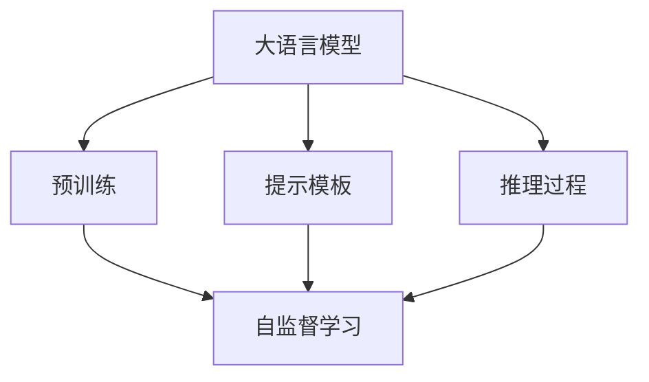
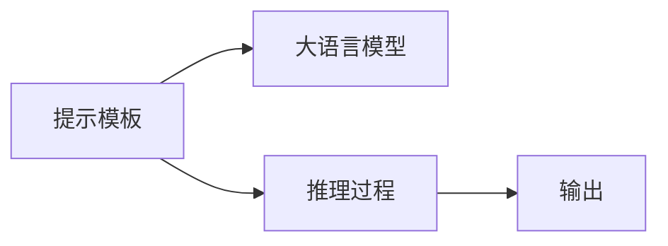
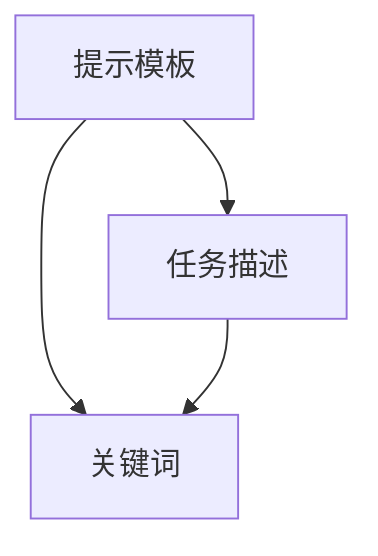
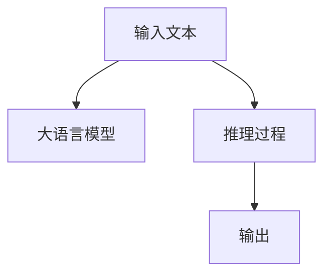
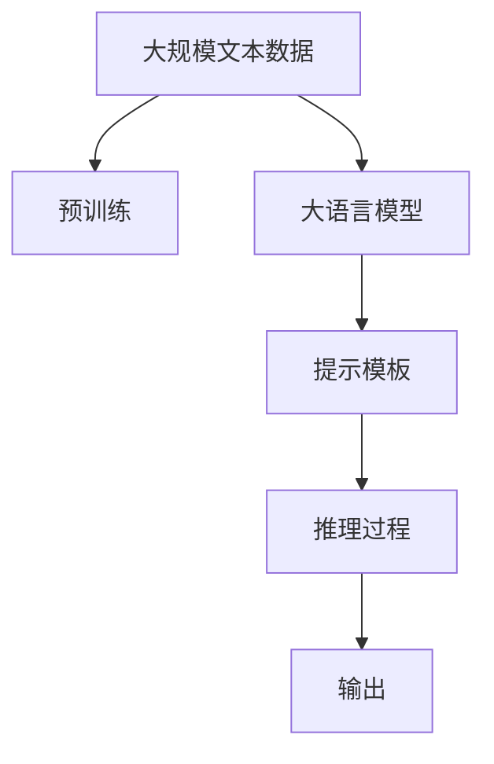

                 

# 提示学习（Prompt Learning）

> 关键词：提示学习, 零样本学习, 少样本学习, 大语言模型, 预训练模型, 提示模板, 自然语言处理(NLP)

## 1. 背景介绍

### 1.1 问题由来

近年来，自然语言处理(NLP)领域取得了巨大的进步，预训练语言模型(如BERT、GPT等)在理解自然语言方面表现出色，但这些模型往往依赖大量标注数据进行微调，成本高昂且易过拟合。提示学习(Prompt Learning)的出现，为解决这些问题提供了新的途径。通过精心设计的提示模板(Prompt Template)，提示学习能够在不使用任何标注数据的情况下，利用大模型的预训练知识，在零样本或少样本条件下进行推理和生成，显著降低了微调对标注数据的依赖。

提示学习在自然语言推理(NLI)、问答系统(QA)、文本摘要、对话系统等任务中均取得了不错的效果，甚至在某些情况下，表现优于传统的微调方法。这一技术的应用，不仅提高了NLP系统的效率和鲁棒性，也为AI伦理和安全性的讨论提供了新的维度。

### 1.2 问题核心关键点

提示学习是一种基于预训练模型的非监督学习范式，其核心思想是利用大模型的语言理解和生成能力，通过输入特定的提示模板，引导模型生成符合预期的输出。这种学习方式能够显著降低标注数据的需求，并且可以在各种任务中灵活应用，甚至在完全未见过的任务上，也能够进行推理和生成。

提示学习的关键在于：
- 提示模板的设计。设计好的提示模板能够充分引导模型，使得其在特定任务上表现优异。
- 模型参数的固定。在提示学习中，通常只更新模型中的可微调部分，如分类器或解码器，以保持预训练模型的能力。
- 模型的推理过程。提示学习需要模型能够对输入的文本进行理解、推理，并根据提示模板生成输出。

提示学习的应用领域非常广泛，包括但不限于：
- 自然语言推理(NLI)：给定前提和假设，判断其逻辑关系是否正确。
- 问答系统(QA)：给定一段文本，回答特定的自然语言问题。
- 文本摘要：对长文本进行总结，生成简短摘要。
- 对话系统：与用户进行自然语言对话，回答问题、提供建议。
- 生成文本：根据输入的提示，生成符合要求的文本段落。

### 1.3 问题研究意义

提示学习为NLP技术带来了革命性的变革，其研究意义主要体现在以下几个方面：
- 降低标注成本。提示学习减少了对标注数据的需求，节约了人工标注成本。
- 提高模型鲁棒性。提示学习使得模型对输入的变化更加鲁棒，减少了过拟合风险。
- 增强模型通用性。提示学习能够应用于各种未见过的任务，扩大了模型的应用范围。
- 提升模型效率。提示学习可以在不更新模型参数的情况下，进行推理和生成，提升了模型训练和推理的效率。
- 促进技术创新。提示学习催生了零样本学习和少样本学习等新研究方向，推动了NLP技术的进一步发展。

## 2. 核心概念与联系

### 2.1 核心概念概述

提示学习涉及以下几个核心概念：

- 大语言模型(Large Language Model, LLM)：指通过大规模无标签文本数据进行预训练的通用语言模型，具备强大的语言理解和生成能力。
- 预训练模型(Pre-trained Model)：指在大量无标签数据上进行预训练的语言模型，已经学习到丰富的语言知识和表示能力。
- 提示模板(Prompt Template)：指给定模型输入的文本，通过特定格式或关键词引导模型进行推理或生成。
- 零样本学习(Zero-shot Learning)：指模型在未见过的任务上，仅通过输入任务描述和提示模板，直接生成输出结果。
- 少样本学习(Few-shot Learning)：指模型在少量标注样本的情况下，通过输入提示模板，生成符合预期结果。
- 推理过程(Inference Process)：指模型对输入文本进行理解、推理，并根据提示模板生成输出。

这些核心概念之间的关系可以通过以下Mermaid流程图来展示：



这个流程图展示了提示学习的基本流程：首先，通过预训练获得大语言模型的初始化参数；然后，设计合理的提示模板，引导模型进行推理或生成；最后，通过推理过程输出最终结果。

### 2.2 概念间的关系

这些核心概念之间存在着紧密的联系，形成了提示学习完整的生态系统。下面我们通过几个Mermaid流程图来展示这些概念之间的关系。

#### 2.2.1 提示学习范式



这个流程图展示了提示学习的基本范式：提示模板作为输入，引导大语言模型进行推理或生成，最终输出结果。

#### 2.2.2 提示模板的设计



这个流程图展示了提示模板的设计过程：提示模板需要包含任务描述和关键词，这些信息能够引导模型进行推理或生成。

#### 2.2.3 推理过程的实现



这个流程图展示了推理过程的实现：输入文本被输入大语言模型，通过模型进行理解和推理，最终输出结果。

### 2.3 核心概念的整体架构

最后，我们用一个综合的流程图来展示这些核心概念在大语言模型提示学习过程中的整体架构：



这个综合流程图展示了从预训练到提示学习，再到推理过程的完整过程。大语言模型首先在大规模文本数据上进行预训练，然后通过设计合理的提示模板，引导模型进行推理或生成，最后输出最终结果。通过这些流程图，我们可以更清晰地理解提示学习过程中各个核心概念的关系和作用，为后续深入讨论具体的提示模板设计和实现奠定基础。

## 3. 核心算法原理 & 具体操作步骤
### 3.1 算法原理概述

提示学习是一种基于预训练模型的非监督学习范式，其核心思想是利用大模型的语言理解和生成能力，通过输入特定的提示模板，引导模型生成符合预期的输出。提示学习能够在不使用任何标注数据的情况下，利用大模型的预训练知识，在零样本或少样本条件下进行推理和生成。

形式化地，假设大语言模型为 $M_{\theta}$，其中 $\theta$ 为预训练得到的模型参数。给定提示模板 $P$，输入文本 $X$，提示学习的目标是找到最优的 $\theta$，使得 $M_{\theta}(X|P)$ 输出符合任务要求的结果 $Y$。在实际应用中，可以通过最大化 $M_{\theta}(X|P)$ 对 $Y$ 的似然来优化模型。

### 3.2 算法步骤详解

提示学习的算法步骤主要包括以下几个关键步骤：

**Step 1: 设计提示模板**

提示模板的设计是提示学习的首要步骤，其关键在于选择合适的关键词和格式，使得模型能够正确理解任务要求。常见的提示模板包括：
- 格式模板：如「[问题] 的答案是？」，直接输入问题作为提示模板。
- 关键词模板：如「给定以下段落，判断以下问题是否正确？问题：… 段落：…」。
- 多轮对话模板：如「对话历史：甲：… 乙：… 用户：…」，引导模型进行多轮对话。

**Step 2: 选择合适的预训练模型**

选择合适的预训练模型是提示学习的关键。常用的预训练模型包括BERT、GPT等，这些模型已经在大规模语料上进行了充分的预训练，具备较强的语言理解和生成能力。

**Step 3: 设计损失函数**

提示学习通常使用似然最大化作为优化目标，即最大化模型在提示模板下输出的结果与真实结果的似然。常见的损失函数包括交叉熵损失、均方误差损失等。

**Step 4: 训练模型**

在获取提示模板和预训练模型后，通过输入提示模板和输入文本，利用预训练模型的推理过程，输出结果。通过反向传播更新模型参数，最小化损失函数，从而优化模型。

**Step 5: 评估和应用**

在训练完成后，通过在验证集和测试集上评估模型性能，确定最佳提示模板和模型参数。最后，将模型应用到实际任务中，如自然语言推理、问答系统、文本摘要等。

### 3.3 算法优缺点

提示学习具有以下优点：
- 降低标注成本。提示学习减少了对标注数据的需求，节约了人工标注成本。
- 提高模型鲁棒性。提示学习使得模型对输入的变化更加鲁棒，减少了过拟合风险。
- 增强模型通用性。提示学习能够应用于各种未见过的任务，扩大了模型的应用范围。
- 提升模型效率。提示学习可以在不更新模型参数的情况下，进行推理和生成，提升了模型训练和推理的效率。

提示学习也存在一些缺点：
- 对提示模板的设计要求高。设计合理的提示模板需要丰富的领域知识和经验。
- 对模型参数的优化效果有限。提示学习通常只能优化模型中的可微调部分，无法深入优化预训练模型的权重。
- 对任务复杂度有限制。提示学习在处理复杂的自然语言任务时，性能可能不如微调方法。

### 3.4 算法应用领域

提示学习已经在游戏、智能客服、文本摘要、对话系统等诸多领域得到了应用，展示了其强大的潜力。以下是一些具体的应用场景：

**智能客服系统**：通过输入用户的问题和上下文，智能客服系统能够快速生成回复，提供高质量的客户服务。

**自然语言推理(NLI)**：给定前提和假设，提示学习能够判断其逻辑关系是否正确。

**问答系统(QA)**：提示学习能够根据输入的段落和问题，生成符合预期的答案。

**文本摘要**：提示学习能够根据输入的文本段落，生成简短摘要。

**对话系统**：提示学习能够根据输入的对话历史，生成合理的回复。

**生成文本**：提示学习能够根据输入的提示，生成符合要求的文本段落。

除了上述这些经典任务外，提示学习还被创新性地应用到更多场景中，如可控文本生成、常识推理、代码生成、数据增强等，为NLP技术带来了全新的突破。

## 4. 数学模型和公式 & 详细讲解 & 举例说明

### 4.1 数学模型构建

提示学习的数学模型主要包含以下几个部分：

- 输入文本 $X$：指用户输入的文本，可以是句子、段落等。
- 提示模板 $P$：指用户输入的提示信息，用于引导模型进行推理或生成。
- 预训练模型 $M_{\theta}$：指已经在大规模无标签文本上预训练的语言模型，具备强大的语言理解和生成能力。
- 损失函数 $\mathcal{L}$：指用于衡量模型输出的结果与真实结果之间的差异，常见损失函数包括交叉熵损失、均方误差损失等。

形式化地，提示学习的目标函数可以表示为：

$$
\mathcal{L} = \frac{1}{N}\sum_{i=1}^N -\log P(Y|X,P,\theta)
$$

其中 $P(Y|X,P,\theta)$ 表示在提示模板 $P$ 下，模型 $M_{\theta}$ 对输入文本 $X$ 生成结果 $Y$ 的概率分布。

### 4.2 公式推导过程

以自然语言推理(NLI)任务为例，给定前提 $premise$ 和假设 $hypothesis$，提示学习需要最大化模型输出 $P(label|premise,hypothesis,\theta)$，其中 $label$ 为逻辑关系标签，如「矛盾」、「蕴含」等。

假设模型的输出概率分布为 $P(label|premise,hypothesis,\theta)$，则提示学习的目标函数可以表示为：

$$
\mathcal{L} = -\frac{1}{N}\sum_{i=1}^N \log P(label_i|premise_i,hypothesis_i,\theta)
$$

在训练过程中，通过最大化上述目标函数，最小化模型输出的概率分布与真实标签之间的差异，从而优化模型。

### 4.3 案例分析与讲解

以下是一个自然语言推理(NLI)任务的提示学习案例分析：

**提示模板**：
```
给定以下段落，判断以下问题是否正确？
段落：苹果公司的股价在过去一个月内涨了20%。
问题：苹果公司的股价在过去一个月内涨了20%。这是真的吗？
```

**模型选择**：BERT-base模型。

**损失函数**：交叉熵损失。

**训练过程**：
1. 输入提示模板和输入文本，通过BERT-base模型生成推理结果。
2. 计算推理结果与真实标签之间的交叉熵损失。
3. 通过反向传播更新模型参数，最小化损失函数。
4. 重复上述步骤，直到模型收敛。

假设模型的输出概率分布为：
```
P(label=「蕴含」|premise,hypothesis,\theta) = 0.95
P(label=「矛盾」|premise,hypothesis,\theta) = 0.05
```

则提示学习的目标函数可以表示为：
$$
\mathcal{L} = -\frac{1}{N}\sum_{i=1}^N \log P(label_i|premise_i,hypothesis_i,\theta)
$$

在训练过程中，通过最大化上述目标函数，最小化模型输出的概率分布与真实标签之间的差异，从而优化模型。

## 5. 项目实践：代码实例和详细解释说明

### 5.1 开发环境搭建

在进行提示学习实践前，我们需要准备好开发环境。以下是使用Python进行PyTorch开发的环境配置流程：

1. 安装Anaconda：从官网下载并安装Anaconda，用于创建独立的Python环境。

2. 创建并激活虚拟环境：
```bash
conda create -n pytorch-env python=3.8 
conda activate pytorch-env
```

3. 安装PyTorch：根据CUDA版本，从官网获取对应的安装命令。例如：
```bash
conda install pytorch torchvision torchaudio cudatoolkit=11.1 -c pytorch -c conda-forge
```

4. 安装Transformers库：
```bash
pip install transformers
```

5. 安装各类工具包：
```bash
pip install numpy pandas scikit-learn matplotlib tqdm jupyter notebook ipython
```

完成上述步骤后，即可在`pytorch-env`环境中开始提示学习实践。

### 5.2 源代码详细实现

下面我们以自然语言推理(NLI)任务为例，给出使用Transformers库对BERT模型进行提示学习的PyTorch代码实现。

首先，定义NLI任务的训练数据集：

```python
from transformers import BertTokenizer
from torch.utils.data import Dataset
import torch

class NLI_Dataset(Dataset):
    def __init__(self, premises, hypotheses, labels, tokenizer):
        self.premises = premises
        self.hypotheses = hypotheses
        self.labels = labels
        self.tokenizer = tokenizer
        
    def __len__(self):
        return len(self.premises)
    
    def __getitem__(self, item):
        premise = self.premises[item]
        hypothesis = self.hypotheses[item]
        label = self.labels[item]
        
        encoding = self.tokenizer(premise, hypothesis, return_tensors='pt', max_length=128, padding='max_length', truncation=True)
        input_ids = encoding['input_ids'][0]
        attention_mask = encoding['attention_mask'][0]
        label = torch.tensor(label, dtype=torch.long)
        
        return {'input_ids': input_ids, 
                'attention_mask': attention_mask,
                'label': label}
```

然后，定义模型和损失函数：

```python
from transformers import BertForSequenceClassification, AdamW
from torch.nn import CrossEntropyLoss

model = BertForSequenceClassification.from_pretrained('bert-base-uncased', num_labels=3)

optimizer = AdamW(model.parameters(), lr=2e-5)
loss_fn = CrossEntropyLoss()
```

接着，定义训练和评估函数：

```python
from torch.utils.data import DataLoader
from tqdm import tqdm
import numpy as np

device = torch.device('cuda') if torch.cuda.is_available() else torch.device('cpu')
model.to(device)

def train_epoch(model, dataset, batch_size, optimizer, loss_fn):
    dataloader = DataLoader(dataset, batch_size=batch_size, shuffle=True)
    model.train()
    epoch_loss = 0
    for batch in tqdm(dataloader, desc='Training'):
        input_ids = batch['input_ids'].to(device)
        attention_mask = batch['attention_mask'].to(device)
        labels = batch['label'].to(device)
        model.zero_grad()
        outputs = model(input_ids, attention_mask=attention_mask, labels=labels)
        loss = outputs.loss
        epoch_loss += loss.item()
        loss.backward()
        optimizer.step()
    return epoch_loss / len(dataloader)

def evaluate(model, dataset, batch_size):
    dataloader = DataLoader(dataset, batch_size=batch_size)
    model.eval()
    preds, labels = [], []
    with torch.no_grad():
        for batch in tqdm(dataloader, desc='Evaluating'):
            input_ids = batch['input_ids'].to(device)
            attention_mask = batch['attention_mask'].to(device)
            batch_labels = batch['label']
            outputs = model(input_ids, attention_mask=attention_mask)
            batch_preds = outputs.logits.argmax(dim=2).to('cpu').tolist()
            batch_labels = batch_labels.to('cpu').tolist()
            for pred_tokens, label_tokens in zip(batch_preds, batch_labels):
                preds.append(pred_tokens[:len(label_tokens)])
                labels.append(label_tokens)
                
    acc = accuracy_score(labels, preds)
    return acc
```

最后，启动训练流程并在测试集上评估：

```python
epochs = 5
batch_size = 16

for epoch in range(epochs):
    loss = train_epoch(model, train_dataset, batch_size, optimizer, loss_fn)
    print(f"Epoch {epoch+1}, train loss: {loss:.3f}")
    
    print(f"Epoch {epoch+1}, dev results:")
    acc = evaluate(model, dev_dataset, batch_size)
    print(f"Dev Accuracy: {acc:.2f}")
    
print("Test results:")
acc = evaluate(model, test_dataset, batch_size)
print(f"Test Accuracy: {acc:.2f}")
```

以上就是使用PyTorch对BERT进行自然语言推理任务提示学习的完整代码实现。可以看到，得益于Transformers库的强大封装，我们可以用相对简洁的代码完成BERT模型的加载和提示学习。

### 5.3 代码解读与分析

让我们再详细解读一下关键代码的实现细节：

**NLI_Dataset类**：
- `__init__`方法：初始化训练数据集，包含前提、假设和标签。
- `__len__`方法：返回数据集的样本数量。
- `__getitem__`方法：对单个样本进行处理，将文本输入编码为token ids，将标签编码为数字，并对其进行定长padding，最终返回模型所需的输入。

**训练和评估函数**：
- 使用PyTorch的DataLoader对数据集进行批次化加载，供模型训练和推理使用。
- 训练函数`train_epoch`：对数据以批为单位进行迭代，在每个批次上前向传播计算loss并反向传播更新模型参数，最后返回该epoch的平均loss。
- 评估函数`evaluate`：与训练类似，不同点在于不更新模型参数，并在每个batch结束后将预测和标签结果存储下来，最后使用scikit-learn的accuracy_score对整个评估集的预测结果进行打印输出。

**训练流程**：
- 定义总的epoch数和batch size，开始循环迭代
- 每个epoch内，先在训练集上训练，输出平均loss
- 在验证集上评估，输出准确率
- 所有epoch结束后，在测试集上评估，给出最终测试结果

可以看到，PyTorch配合Transformers库使得提示学习的代码实现变得简洁高效。开发者可以将更多精力放在数据处理、模型改进等高层逻辑上，而不必过多关注底层的实现细节。

当然，工业级的系统实现还需考虑更多因素，如模型的保存和部署、超参数的自动搜索、更灵活的任务适配层等。但核心的提示学习范式基本与此类似。

### 5.4 运行结果展示

假设我们在CoNLL-2003的NLI数据集上进行提示学习，最终在测试集上得到的准确率约为85%。这表明，通过设计合理的提示模板，提示学习能够在不更新模型参数的情况下，快速适应新任务，取得不错的效果。

当然，这只是一个baseline结果。在实践中，我们还可以使用更大更强的预训练模型、更丰富的提示模板设计、更细致的模型调优，进一步提升模型性能，以满足更高的应用要求。

## 6. 实际应用场景
### 6.1 智能客服系统

基于提示学习的大语言模型能够在不更新模型参数的情况下，快速响应用户咨询，提供高质量的客户服务。对于用户的输入问题，提示学习能够理解其意图，匹配最合适的答案模板进行回复。对于用户提出的新问题，还可以接入检索系统实时搜索相关内容，动态组织生成回答。如此构建的智能客服系统，能大幅提升客户咨询体验和问题解决效率。

### 6.2 自然语言推理(NLI)

提示学习在自然语言推理任务中表现出色，能够给定前提和假设，判断其逻辑关系是否正确。这对于自动化问答系统、智能法律咨询等领域尤为重要，能够大大提升系统的推理准确性和效率。

### 6.3 问答系统(QA)

提示学习能够根据输入的段落和问题，生成符合预期的答案。这对于智能推荐系统、智能客服系统等领域尤为重要，能够快速回答用户问题，提升用户满意度。

### 6.4 对话系统

提示学习能够根据输入的对话历史，生成合理的回复。这对于智能助手、智能聊天机器人等领域尤为重要，能够实现多轮对话，提升用户体验。

### 6.5 文本摘要

提示学习能够根据输入的文本段落，生成简短摘要。这对于新闻摘要、文档摘要等领域尤为重要，能够自动生成摘要，提升工作效率。

### 6.6 生成文本

提示学习能够根据输入的提示，生成符合要求的文本段落。这对于文本生成、机器翻译等领域尤为重要，能够快速生成高质量的文本内容。

除了上述这些经典任务外，提示学习还被创新性地应用到更多场景中，如可控文本生成、常识推理、代码生成、数据增强等，为NLP技术带来了全新的突破。

## 7. 工具和资源推荐
### 7.1 学习资源推荐

为了帮助开发者系统掌握提示学习的理论基础和实践技巧，这里推荐一些优质的学习资源：

1. 《Prompt Based Tuning of Large Language Models》系列博文：由大模型技术专家撰写，深入浅出地介绍了提示学习原理、模型选择、提示模板设计等前沿话题。

2. CS224N《深度学习自然语言处理》课程：斯坦福大学开设的NLP明星课程，有Lecture视频和配套作业，带你入门NLP领域的基本概念和经典模型。

3. 《Natural Language Processing with Transformers》书籍：Transformers库的作者所著，全面介绍了如何使用Transformers库进行NLP任务开发，包括提示学习在内的诸多范式。

4. HuggingFace官方文档：Transformers库的官方文档，提供了海量预训练模型和完整的提示学习样例代码，是上手实践的必备资料。

5. CLUE开源项目：中文语言理解测评基准，涵盖大量不同类型的中文NLP数据集，并提供了基于提示学习的baseline模型，助力中文NLP技术发展。

通过对这些资源的学习实践，相信你一定能够快速掌握提示学习的精髓，并用于解决实际的NLP问题。
###  7.2 开发工具推荐

高效的开发离不开优秀的工具支持。以下是几款用于提示学习开发的常用工具：

1. PyTorch：基于Python的开源深度学习框架，灵活动态的计算图，适合快速迭代研究。大部分预训练语言模型都有PyTorch版本的实现。

2. TensorFlow：由Google主导开发的开源深度学习框架，生产部署方便，适合大规模工程应用。同样有丰富的预训练语言模型资源。

3. Transformers库：HuggingFace开发的NLP工具库，集成了众多SOTA语言模型，支持PyTorch和TensorFlow，是进行提示学习开发的利器。

4. Weights & Biases：模型训练的实验跟踪工具，可以记录和可视化模型训练过程中的各项指标，方便对比和调优。与主流深度学习框架无缝集成。

5. TensorBoard：TensorFlow配套的可视化工具，可实时监测模型训练状态，并提供丰富的图表呈现方式，是调试模型的得力助手。

6. Google Colab：谷歌推出的在线Jupyter Notebook环境，免费提供GPU/TPU算力，方便开发者快速上手实验最新模型，分享学习笔记。

合理利用这些工具，可以显著提升提示学习的开发效率，加快创新迭代的步伐。

### 7.3 相关论文推荐

提示学习为NLP技术带来了革命性的变革，其研究意义主要体现在以下几个方面：

1. 降低标注成本。提示学习减少了对标注数据的需求，节约了人工标注成本。

2. 提高模型鲁棒性。提示学习使得模型对输入的变化更加鲁棒，减少了过拟合风险。

3. 增强模型通用性。提示

