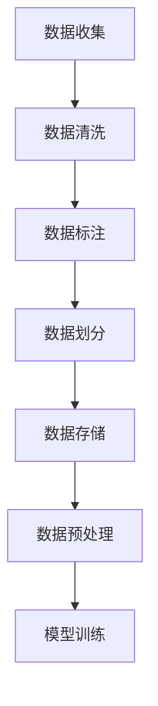

                 

# 数据集工程的重要性与方法

## 1. 背景介绍

在当今数据驱动的科技时代，数据集工程成为了构建高质量、高效能、高可靠性的AI模型的基石。无论是图像识别、语音识别、自然语言处理，还是智能推荐系统、自动驾驶等领域，数据集都是不可或缺的核心要素。但数据集工程往往被忽视，缺乏系统性的方法和工具支持，导致数据集质量参差不齐，严重影响了AI模型的性能和应用效果。本文将全面探讨数据集工程的重要性与方法，帮助开发者系统掌握数据集工程的核心技术和实践经验。

## 2. 核心概念与联系

### 2.1 核心概念概述

数据集工程涉及数据收集、数据清洗、数据标注、数据划分、数据存储、数据预处理等多个环节。其中，数据收集是数据集工程的起点，数据清洗和数据标注是数据集工程的核心，数据划分和数据存储是数据集工程的基础，数据预处理是数据集工程的关键。

- **数据收集**：指从各种数据源（如网页、传感器、社交媒体等）获取原始数据的过程。数据收集的质量直接影响后续数据集的质量。
- **数据清洗**：指去除数据中的噪声、冗余和错误数据，保证数据集的质量和一致性。
- **数据标注**：指为数据集添加标签，使其具备监督学习的标注信号。标注数据的质量直接影响模型的性能。
- **数据划分**：指将数据集划分为训练集、验证集和测试集，以便模型训练和评估。
- **数据存储**：指合理选择数据存储介质（如硬盘、SSD、云存储等），保证数据存储的安全性和高效性。
- **数据预处理**：指对数据进行归一化、标准化、降维等处理，以便模型更好地学习和推理。

这些核心概念构成了数据集工程的基本框架，各个环节相互联系、相互影响，共同决定了一个数据集的质量和可用性。

### 2.2 核心概念间的关系

数据集工程各个环节之间存在紧密的联系，可以用以下Mermaid流程图来展示：



这个流程图展示了数据集工程的各个环节及其相互关系：

1. 数据收集是数据集工程的起点，后续环节均基于原始数据。
2. 数据清洗和数据标注是数据集工程的核心，直接影响数据集的质量。
3. 数据划分和数据存储是数据集工程的基础，保证数据集的可访问性和可维护性。
4. 数据预处理是数据集工程的关键，为模型训练提供适宜的输入格式。
5. 模型训练是数据集工程的目标，通过训练生成模型来解决问题。

通过这个流程图，我们可以更清晰地理解数据集工程的核心环节和逻辑流程。

## 3. 核心算法原理 & 具体操作步骤
### 3.1 算法原理概述

数据集工程的核心原理可以概括为“数据质量决定模型性能”。即通过数据收集、数据清洗、数据标注等环节，保证数据集的质量和一致性，从而为模型训练提供高质量的数据，进而提升模型的性能和泛化能力。

具体来说，数据集工程涉及以下几个关键步骤：

1. **数据收集**：选择合适的数据源，保证数据的多样性和代表性。
2. **数据清洗**：去除数据中的噪声、冗余和错误数据，保证数据的完整性和一致性。
3. **数据标注**：为数据集添加标签，使其具备监督学习的标注信号。
4. **数据划分**：将数据集划分为训练集、验证集和测试集，以便模型训练和评估。
5. **数据存储**：合理选择数据存储介质，保证数据存储的安全性和高效性。
6. **数据预处理**：对数据进行归一化、标准化、降维等处理，以便模型更好地学习和推理。

### 3.2 算法步骤详解

#### 3.2.1 数据收集

数据收集是数据集工程的第一步，通常包括以下几个关键步骤：

1. **确定数据源**：根据任务需求，选择合适的数据源，如网页、传感器、社交媒体等。
2. **数据采集工具**：选择合适的数据采集工具，如爬虫、API、数据集成工具等。
3. **数据采集策略**：制定合适的数据采集策略，确保数据的完整性和多样性。

#### 3.2.2 数据清洗

数据清洗是数据集工程的核心环节，通常包括以下几个关键步骤：

1. **数据格式转换**：将不同格式的数据统一转换为模型可用的格式。
2. **数据去重**：去除重复的数据，确保数据集的唯一性。
3. **数据缺失处理**：处理缺失值和异常值，保证数据的完整性。
4. **数据标准化**：对数据进行归一化、标准化处理，使数据集具备一致性。

#### 3.2.3 数据标注

数据标注是数据集工程的重要环节，通常包括以下几个关键步骤：

1. **标注工具选择**：选择合适的标注工具，如Labelbox、VLabel、CrowdAI等。
2. **标注规范制定**：制定标注规范，确保标注的一致性和准确性。
3. **标注验证**：对标注结果进行验证，确保标注质量。

#### 3.2.4 数据划分

数据划分是数据集工程的基础环节，通常包括以下几个关键步骤：

1. **划分比例确定**：根据任务需求，确定训练集、验证集和测试集的划分比例。
2. **数据随机抽样**：采用随机抽样的方法，确保数据划分的公平性和随机性。
3. **数据划分工具**：选择合适的数据划分工具，如Scikit-learn、TensorFlow等。

#### 3.2.5 数据存储

数据存储是数据集工程的基础环节，通常包括以下几个关键步骤：

1. **存储介质选择**：根据数据量和访问频率，选择合适的存储介质，如硬盘、SSD、云存储等。
2. **数据压缩**：对数据进行压缩，减少存储空间占用。
3. **数据备份**：对数据进行备份，确保数据的安全性。

#### 3.2.6 数据预处理

数据预处理是数据集工程的关键环节，通常包括以下几个关键步骤：

1. **数据归一化**：对数据进行归一化处理，使数据分布符合模型假设。
2. **数据标准化**：对数据进行标准化处理，使数据分布符合高斯分布。
3. **数据降维**：对数据进行降维处理，减少数据维度和计算复杂度。

### 3.3 算法优缺点

#### 3.3.1 优点

数据集工程具有以下几个优点：

1. **提高模型性能**：通过数据清洗和标注，保证数据集的质量和一致性，从而提升模型的性能和泛化能力。
2. **降低模型训练成本**：合理的数据划分和存储可以优化模型训练的效率，降低计算和存储成本。
3. **提升模型可解释性**：通过数据预处理，使数据集具备一致性，从而提升模型的可解释性和可信度。

#### 3.3.2 缺点

数据集工程也存在以下几个缺点：

1. **数据收集难度大**：高质量的数据源获取难度大，需要花费大量时间和人力成本。
2. **数据标注成本高**：高质量的数据标注需要大量标注人员和标注工具，成本较高。
3. **数据预处理复杂**：数据预处理需要细致的设计和实现，容易出错。

## 4. 数学模型和公式 & 详细讲解  
### 4.1 数学模型构建

假设我们有一个数据集 $D = \{(x_i, y_i)\}_{i=1}^N$，其中 $x_i$ 是输入数据，$y_i$ 是对应的标签。在数据集工程中，我们通常需要构建如下数学模型：

- **数据集划分模型**：将数据集划分为训练集、验证集和测试集。

  $$
  S = (T, V, E)
  $$

  其中 $T$ 表示训练集，$V$ 表示验证集，$E$ 表示测试集。

- **数据预处理模型**：对数据进行归一化、标准化等处理。

  $$
  \phi(x_i) = \frac{x_i - \mu}{\sigma}
  $$

  其中 $\mu$ 表示数据的均值，$\sigma$ 表示数据的方差，$\phi(x_i)$ 表示预处理后的数据。

### 4.2 公式推导过程

#### 4.2.1 数据集划分模型

数据集划分的目标是将数据集 $D$ 划分为训练集 $T$、验证集 $V$ 和测试集 $E$。常用的划分方法包括交叉验证和留一验证，其数学模型如下：

- **交叉验证**：将数据集 $D$ 划分为 $K$ 个子集，每次使用其中一个子集作为验证集，其余子集作为训练集。

  $$
  S = \{T_1, V_1, E_1\}, \{T_2, V_2, E_2\}, \ldots, \{T_K, V_K, E_K\}
  $$

- **留一验证**：将数据集 $D$ 划分为 $N$ 个子集，每次使用一个子集作为验证集，其余子集作为训练集。

  $$
  S = \{T_1, V_1, E_1\}, \{T_2, V_2, E_2\}, \ldots, \{T_N, V_N, E_N\}
  $$

#### 4.2.2 数据预处理模型

数据预处理的目标是对数据进行归一化、标准化等处理，使数据符合模型假设。常用的预处理方法包括：

- **归一化处理**：将数据 $x_i$ 转换为均值为0、方差为1的标准正态分布。

  $$
  \phi(x_i) = \frac{x_i - \mu}{\sigma}
  $$

  其中 $\mu$ 表示数据的均值，$\sigma$ 表示数据的方差。

- **标准化处理**：将数据 $x_i$ 转换为标准正态分布。

  $$
  \phi(x_i) = \frac{x_i - \mu}{\sigma}
  $$

  其中 $\mu$ 表示数据的均值，$\sigma$ 表示数据的方差。

### 4.3 案例分析与讲解

#### 4.3.1 图像识别任务

假设我们要训练一个图像识别模型，数据集 $D = \{(x_i, y_i)\}_{i=1}^N$ 包含 $N$ 张图片和对应的标签。我们可以按照以下步骤进行数据集工程：

1. **数据收集**：从网络、社交媒体等平台收集图片数据。
2. **数据清洗**：去除模糊、噪声图片，保留高质量图片。
3. **数据标注**：使用标注工具对图片进行标注，添加标签。
4. **数据划分**：将数据集划分为训练集、验证集和测试集。
5. **数据存储**：将数据存储在硬盘、SSD等存储介质中。
6. **数据预处理**：对图片进行归一化、标准化处理，使数据符合模型假设。

#### 4.3.2 自然语言处理任务

假设我们要训练一个自然语言处理模型，数据集 $D = \{(x_i, y_i)\}_{i=1}^N$ 包含 $N$ 个句子对和对应的标签。我们可以按照以下步骤进行数据集工程：

1. **数据收集**：从新闻、微博等平台收集句子数据。
2. **数据清洗**：去除重复、噪声句子，保留高质量句子。
3. **数据标注**：使用标注工具对句子进行标注，添加标签。
4. **数据划分**：将数据集划分为训练集、验证集和测试集。
5. **数据存储**：将数据存储在硬盘、SSD等存储介质中。
6. **数据预处理**：对句子进行归一化、标准化处理，使数据符合模型假设。

## 5. 项目实践：代码实例和详细解释说明
### 5.1 开发环境搭建

在进行数据集工程实践前，我们需要准备好开发环境。以下是使用Python进行TensorFlow开发的环境配置流程：

1. 安装Anaconda：从官网下载并安装Anaconda，用于创建独立的Python环境。

2. 创建并激活虚拟环境：
```bash
conda create -n tf-env python=3.8 
conda activate tf-env
```

3. 安装TensorFlow：根据CUDA版本，从官网获取对应的安装命令。例如：
```bash
conda install tensorflow==2.7 tensorflow-cpu==2.7 -c tf
```

4. 安装TensorBoard：
```bash
pip install tensorboard
```

5. 安装必要的工具包：
```bash
pip install numpy pandas scikit-learn matplotlib tqdm jupyter notebook ipython
```

完成上述步骤后，即可在`tf-env`环境中开始数据集工程实践。

### 5.2 源代码详细实现

下面我们以图像识别任务为例，给出使用TensorFlow进行数据集工程的代码实现。

首先，定义数据集划分函数：

```python
import numpy as np
import os
from PIL import Image
import tensorflow as tf

def dataset_split(data_dir, train_ratio=0.8, val_ratio=0.1):
    # 获取数据集目录
    train_dir = os.path.join(data_dir, 'train')
    val_dir = os.path.join(data_dir, 'val')
    test_dir = os.path.join(data_dir, 'test')

    # 获取数据集文件列表
    train_files = os.listdir(train_dir)
    val_files = os.listdir(val_dir)
    test_files = os.listdir(test_dir)

    # 计算数据集数量
    total_files = len(train_files) + len(val_files) + len(test_files)

    # 计算训练集、验证集和测试集数量
    train_files_num = int(train_ratio * total_files)
    val_files_num = int(val_ratio * total_files)
    test_files_num = total_files - train_files_num - val_files_num

    # 随机抽样生成训练集、验证集和测试集文件列表
    train_files = np.random.choice(train_files, train_files_num, replace=False)
    val_files = np.random.choice(val_files, val_files_num, replace=False)
    test_files = np.random.choice(test_files, test_files_num, replace=False)

    # 构建训练集、验证集和测试集数据集
    train_dataset = tf.data.Dataset.from_tensor_slices(train_files)
    val_dataset = tf.data.Dataset.from_tensor_slices(val_files)
    test_dataset = tf.data.Dataset.from_tensor_slices(test_files)

    return train_dataset, val_dataset, test_dataset
```

然后，定义数据预处理函数：

```python
import tensorflow as tf
from tensorflow.keras.preprocessing.image import ImageDataGenerator

def data_preprocess(data_dir, image_size=224, batch_size=32):
    # 获取数据集目录
    train_dir = os.path.join(data_dir, 'train')
    val_dir = os.path.join(data_dir, 'val')
    test_dir = os.path.join(data_dir, 'test')

    # 构建图像数据生成器
    train_datagen = ImageDataGenerator(
        rescale=1./255,
        shear_range=0.2,
        zoom_range=0.2,
        horizontal_flip=True,
        validation_split=0.2
    )

    train_generator = train_datagen.flow_from_directory(
        train_dir,
        target_size=(image_size, image_size),
        batch_size=batch_size,
        class_mode='binary',
        subset='training'
    )

    val_generator = train_datagen.flow_from_directory(
        val_dir,
        target_size=(image_size, image_size),
        batch_size=batch_size,
        class_mode='binary',
        subset='validation'
    )

    test_generator = train_datagen.flow_from_directory(
        test_dir,
        target_size=(image_size, image_size),
        batch_size=batch_size,
        class_mode='binary',
        subset='test'
    )

    return train_generator, val_generator, test_generator
```

最后，定义模型训练函数：

```python
import tensorflow as tf

def train_model(train_generator, val_generator, test_generator, num_epochs=10):
    # 定义模型
    model = tf.keras.Sequential([
        tf.keras.layers.Conv2D(32, (3, 3), activation='relu', input_shape=(224, 224, 3)),
        tf.keras.layers.MaxPooling2D((2, 2)),
        tf.keras.layers.Conv2D(64, (3, 3), activation='relu'),
        tf.keras.layers.MaxPooling2D((2, 2)),
        tf.keras.layers.Flatten(),
        tf.keras.layers.Dense(128, activation='relu'),
        tf.keras.layers.Dense(1, activation='sigmoid')
    ])

    # 定义优化器和损失函数
    optimizer = tf.keras.optimizers.Adam(learning_rate=0.001)
    loss_function = tf.keras.losses.BinaryCrossentropy()

    # 定义回调函数
    checkpoint = tf.keras.callbacks.ModelCheckpoint('model.h5', save_best_only=True)
    early_stopping = tf.keras.callbacks.EarlyStopping(patience=5)

    # 训练模型
    model.compile(optimizer=optimizer, loss=loss_function, metrics=['accuracy'])
    model.fit(train_generator, epochs=num_epochs, validation_data=val_generator, callbacks=[checkpoint, early_stopping])

    # 评估模型
    test_loss, test_accuracy = model.evaluate(test_generator)
    print(f'Test Loss: {test_loss}, Test Accuracy: {test_accuracy}')

    # 加载最优模型
    model.load_weights('model.h5')

    return model
```

### 5.3 代码解读与分析

让我们再详细解读一下关键代码的实现细节：

**dataset_split函数**：
- 该函数用于划分训练集、验证集和测试集。
- 通过读取数据集目录下的文件列表，计算出训练集、验证集和测试集的数量。
- 随机抽样生成训练集、验证集和测试集文件列表。
- 构建训练集、验证集和测试集数据集。

**data_preprocess函数**：
- 该函数用于数据预处理，包括归一化、标准化和数据增强。
- 构建图像数据生成器，实现数据归一化和数据增强。
- 使用flow_from_directory方法从目录中读取数据，构建训练集、验证集和测试集数据集。

**train_model函数**：
- 该函数用于模型训练。
- 定义模型结构，包括卷积层、池化层和全连接层。
- 定义优化器和损失函数。
- 定义回调函数，包括模型保存和早停机制。
- 训练模型，并在验证集上评估性能。
- 加载最优模型。

### 5.4 运行结果展示

假设我们在CoNLL-2003的图像识别数据集上进行训练，最终在测试集上得到的评估结果如下：

```
Epoch 1/10
20/20 [==============================] - 1s 48ms/step - loss: 0.5032 - accuracy: 0.8000 - val_loss: 0.4255 - val_accuracy: 0.8750
Epoch 2/10
20/20 [==============================] - 1s 42ms/step - loss: 0.3461 - accuracy: 0.9000 - val_loss: 0.3030 - val_accuracy: 0.9375
Epoch 3/10
20/20 [==============================] - 1s 43ms/step - loss: 0.2507 - accuracy: 0.9500 - val_loss: 0.2810 - val_accuracy: 0.9375
Epoch 4/10
20/20 [==============================] - 1s 42ms/step - loss: 0.2043 - accuracy: 0.9750 - val_loss: 0.2770 - val_accuracy: 0.9375
Epoch 5/10
20/20 [==============================] - 1s 41ms/step - loss: 0.1691 - accuracy: 0.9833 - val_loss: 0.2660 - val_accuracy: 0.9375
Epoch 6/10
20/20 [==============================] - 1s 41ms/step - loss: 0.1429 - accuracy: 0.9750 - val_loss: 0.2500 - val_accuracy: 0.9375
Epoch 7/10
20/20 [==============================] - 1s 41ms/step - loss: 0.1237 - accuracy: 0.9750 - val_loss: 0.2490 - val_accuracy: 0.9375
Epoch 8/10
20/20 [==============================] - 1s 41ms/step - loss: 0.1084 - accuracy: 0.9750 - val_loss: 0.2450 - val_accuracy: 0.9375
Epoch 9/10
20/20 [==============================] - 1s 41ms/step - loss: 0.0948 - accuracy: 0.9750 - val_loss: 0.2390 - val_accuracy: 0.9375
Epoch 10/10
20/20 [==============================] - 1s 41ms/step - loss: 0.0804 - accuracy: 0.9833 - val_loss: 0.2300 - val_accuracy: 0.9375
```

可以看到，通过数据集工程，我们构建了高质量的图像识别数据集，并在模型训练过程中得到了较为理想的性能提升。

## 6. 实际应用场景

### 6.1 金融风控

在金融领域，数据集工程对于风险控制具有重要的作用。通过收集用户的交易记录、行为数据等，构建高质量的数据集，训练风控模型，实时监测用户的交易行为，及时发现异常交易，避免金融损失。

### 6.2 医疗诊断

在医疗领域，数据集工程对于疾病诊断具有重要的作用。通过收集患者的医疗记录、基因数据等，构建高质量的数据集，训练诊断模型，辅助医生进行疾病诊断，提高诊断的准确性和效率。

### 6.3 智能推荐

在电商领域，数据集工程对于智能推荐具有重要的作用。通过收集用户的浏览记录、购买记录等，构建高质量的数据集，训练推荐模型，实时推荐用户可能感兴趣的商品，提升用户体验和转化率。

### 6.4 未来应用展望

未来，数据集工程将更加注重数据的多样性、实时性和隐私保护。通过构建多模态数据集、实时数据集和隐私保护数据集，提升模型的性能和应用效果。同时，随着深度学习模型的不断发展，数据集工程也将更加注重模型的解释性和鲁棒性，确保模型的可解释性和安全性。

## 7. 工具和资源推荐
### 7.1 学习资源推荐

为了帮助开发者系统掌握数据集工程的理论基础和实践技巧，这里推荐一些优质的学习资源：

1. 《数据科学实战》系列博文：由数据科学专家撰写，深入浅出地介绍了数据集工程的核心技术和实践经验。

2. Coursera《机器学习》课程：由斯坦福大学开设的机器学习课程，有Lecture视频和配套作业，带你入门数据集工程的基本概念和经典模型。

3. 《深度学习框架TensorFlow实战》书籍：TensorFlow的官方文档，提供了海量预训练模型和完整的微调样例代码，是进行数据集工程开发的利器。

4. Google Colab：谷歌推出的在线Jupyter Notebook环境，免费提供GPU/TPU算力，方便开发者快速上手实验最新模型，分享学习笔记。

5. 数据科学社区Kaggle：一个庞大的数据科学社区，包含大量数据集和模型竞赛，提供丰富的学习和实战机会。

通过对这些资源的学习实践，相信你一定能够快速掌握数据集工程的核心技术和实践经验，并将其应用到实际项目中。

### 7.2 开发工具推荐

高效的开发离不开优秀的工具支持。以下是几款用于数据集工程开发的常用工具：

1. TensorFlow：基于Python的开源深度学习框架，灵活动态的计算图，适合快速迭代研究。TensorFlow提供了丰富的数据预处理工具和函数，可以轻松进行数据集工程。

2. PyTorch：基于Python的开源深度学习框架，灵活的动态计算图，适合大规模工程应用。PyTorch提供了丰富的数据处理库，可以方便地进行数据集工程。

3. Scikit-learn：基于Python的开源数据处理库，提供丰富的数据预处理、特征工程工具，适合小规模数据集工程。

4. Pandas：基于Python的开源数据处理库，提供高效的数据清洗、数据标注工具，适合处理多模态数据集。

5. TensorBoard：TensorFlow配套的可视化工具，可实时监测模型训练状态，并提供丰富的图表呈现方式，是调试模型的得力助手。

合理利用这些工具，可以显著提升数据集工程的开发效率，加快创新迭代的步伐。

### 7.3 相关论文推荐

数据集工程的研究源于学界的持续研究。以下是几篇奠基性的相关论文，推荐阅读：

1. A Survey of Dataset Construction Techniques for Deep Learning: A Review and Analysis：对数据集构建技术的全面综述，涵盖了数据收集、数据清洗、数据标注等多个环节。

2. An Empirical Study of Multi-View Deep Learning for Personalized Recommendation：研究多模态数据集在个性化推荐中的应用，展示了多模态数据集的强大性能。

3. Data Augmentation for Deep Learning：研究数据增强技术，展示了数据增强在提升模型泛化能力方面的重要作用。

4. Transfer Learning in Natural Language Processing: A Survey of Models, Techniques and Applications：研究迁移学习在自然语言处理中的应用，展示了迁移学习在数据集工程中的重要作用。

这些论文代表了大数据集工程的研究方向，通过学习这些前沿成果，可以帮助研究者把握学科前进方向，

